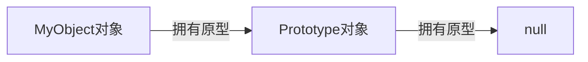
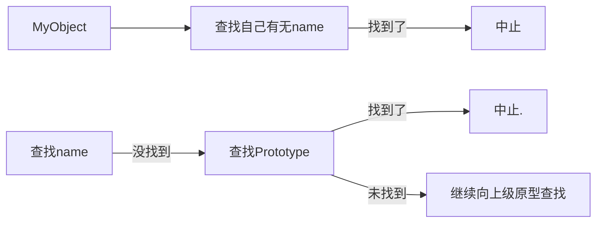
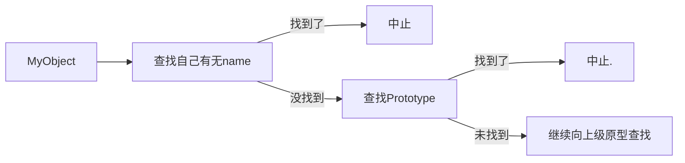

# 前言

笔记来源 -- 千锋教育 JS 视频 + JS 高级程序设计（第四版）+ MDN

可以用 VSCode 对 JS 代码 debug；可以在 JS 代码中加入 `debugger` 进行调试；更多细节请看 VSCode 官网。

# 基础

## JS 简介

<b>JS 发展历史</b>

1994 年，网景公司（Netscape）发布了 Navigator 浏览器 0.9 版，这是世界上第一款比较成熟的网络浏览器，轰动一时。但是这是一款名副其实的浏览器只能浏览页面，浏览器无法与用户互动，当时解决这个问题有两个办法，一个是采用现有的语言，允许它们直接嵌入网页。另一个是发明一种全新的语言。
liveScript ==> JavaScript ==> ECMAscript

1995 年 Sun 公司将  Oak语言改名为 Java，正式向市场推出。Sun 公司大肆宣传，许诺这种语言可以"一次编写，到处运行"（Write Once, Run Anywhere），它看上去很可能成为未来的主宰。

网景公司动了心，决定与 Sun 公司结成联盟

34 岁的系统程序员 Brendan Eich 登场了。1995 年 4 月，网景公司录用了他，他只用 10 天时间就把 JavaScript 设计出来了（多态语言）

<b>JS 的设计理念</b>

- 借鉴 C 语言的基本语法; 
- 借鉴 Java 语言的数据类型和内存管理; 
- 借鉴 Scheme 语言，将函数提升到"第一等公民"（first class）的地位;
- 借鉴 Self 语言，使用基于原型（prototype）的继承机制。

<b>JS 的作用</b>

- 常见的网页效果【表单验证，轮播图。。。】
- 与 H5 配合实现游戏【水果忍者： http://www.jq22.com/demo/html5-fruit-ninja/】
- 实现应用级别的程序【http://naotu.baidu.com】
- 实现统计效果【http://echarts.baidu.com/examples/】
- 地理定位等功能【http://lbsyun.baidu.com/jsdemo.htm#i4_5】
- 在线学编程【https://codecombat.163.com/play/】
- 深度学习模型部署

<b>JS 的组成</b>

- ECMASCRIPT：定义了 JavaScript 的语法规范，描述了语言的基本语法和数据类型。
- BOM (Browser Object Model)：浏览器对象模型

  - 有一套成熟的可以操作浏览器的 API，通过 BOM 可以操作浏览器。比如：弹出框、浏览器跳转、获取分辨率等
  - DOM (Document Object Model)：文档对象模型。有一套成熟的可以操作页面元素的 API，通过 DOM 可以操作页面中的元素。比如：增加 div，减少 div，给 div 交互位置等

<b>JS 就是通过固定的语法去操作`浏览器`和`标签结构`来实现网页上的各种效果</b>

## 书写位置

- 和 `css` 一样，我们的 `js` 也可以有多种方式书写在页面上让其生效
- `js` 也有多种方式书写，分为<b>行内式，内嵌式，外链式</b>

<b>行内式 JS 代码（不推荐）</b>

写在标签上的 js 代码需要依靠事件（行为）来触发

```html
<!-- 写在 a 标签的 href 属性上，
此处的 JavaScript 单词大小写不敏感 -->
<a href="JavaScript:alert('我是一个弹出层');">点击一下试试</a>

<!-- 写在其他元素上 -->
<div onclick="alert('我是一个弹出层')">点一下试试看</div>
```

<b>内嵌式 JS 代码</b>

内嵌式就是指直接把代码写在 html 页面中，内嵌式的 JS 代码会在页面打开的时候直接触发

```html
<!-- 在 html 页面书写一个 script 标签，标签内部书写 js 代码 -->
<script type="text/JavaScript">
    alert('我是一个弹出层')
</script>
<!-- 
注：script 标签可以放在 head 里面也可以放在 body 里面
-->
```

<b>`外链式 JS 代码（推荐）`</b>

外链式 JS 代码只要引入了 html 页面，就会在页面打开的时候直接触发

新建一个 `.js` 后缀的文件，在文件内书写 js 代码，把写好的 js 文件引入 html 页面

```javascript
// 我是 index.js 文件
alert('我是一个弹出层')
```

```html
<!-- 我是一个 html 文件 -->

<!-- 通过 script 标签的 src 属性，把写好的 js 文件引入页面 -->
<script src="index.js"></script>

<!-- 一个页面可以引入多个 js 文件 -->
<script src="index1.js"></script>
<script src="index2.js"></script>
<script src="index3.js"></script>
```

## 注释

- 学习一个语言，先学习一个语言的注释，因为注释是给我们自己看的，也是给开发人员看的，写好一个注释，也有利于我们以后阅读代码
- JS 的注释和 C 语言类似

<b>单行注释</b>

- 一般就是用来描述下面一行代码的作用
- 可以直接写两个 `/` ，也可以按 `ctrl + /`

```javascript
// 我是一个单行注释

// 下面代码表示在浏览器里面出现一个弹出层
alert('我是一个弹出层')
```

<b>多行注释</b>

- 一般用来写一大段话，或者注释一段代码
- 可以直接写 `/**/` 然后在两个星号中间写注释，也可以按 `shift + alt + a`

```javascript
/*
	我是一个多行注释
*/

/*
	注释的代码不会执行
	alert('我是一个弹出层')
	alert('我是一个弹出层')
*/
alert('我是一个弹出层')
```

## 变量

- 变量指的是在程序中保存数据的一个容器
- 变量是计算机内存中存储数据的标识符，根据变量名称可以获取到内存中存储的数据
- 也就是说，我们向内存中存储了一个数据，然后要给这个数据起一个名字，为了是我们以后再次找到他
- 语法： `let 变量名 = 值`

### 定义变量及赋值

```javascript
// 定义一个变量
var num;

// 给一个变量赋值
num = 100;

// 定义一个变量的同时给其赋值
var num2 = 200;
```

<b>注意</b>

- 一个变量名只能存储一个值
- 当再次给一个变量赋值的时候，前面一次的值就没有了
- 变量名称区分大小写（JS 区分大小写）

### 变量的命名规则和命名规范

规则：必须遵守的，不遵守就是错

1. 一个变量名称可以由<b>数字、字母、英文下划线（_）、美元符号（$）</b>组成
2. 严格区分大小写
3. 不能由数字开头，不要使用中文汉字命名
4. 不能是<b>保留字 / 关键字</b>
5. 不要出现空格

规范： 建议遵守的（开发者默认），不遵守不会报错

1. 变量名尽量有意义（语义化）
2. 遵循驼峰命名规则，由多个单词组成的时候，从第二个单词开始首字母大写

## 数据类型

- 是指我们存储在内存中的数据的类型
- 我们通常分为两大类<b>基本数据类型 & 复杂/引用数据类型</b>

### 基本数据类型

1. 数值类型（number）
   - 一切数字都是数值类型（包括二进制，十进制，十六进制等）
   - NaN（not a number），一个非数字
2. 字符串类型（string）
   - 被引号包裹的所有内容（可以是单引号也可以是双引号）
3. 布尔类型（boolean）
   - 只有两个（true 或者 false）
4. null 类型（null）
   - 只有一个，就是 null，表示空的意思
5. undefined 类型（undefined）
   - 只有一个，就是 undefined，表示没有值的意思

### 复杂数据类型

1. 对象类型（object）
2. 函数类型（function），JS 中函数是一等公民，也是一种对象。
3. symbol 类型（ES 6 引入）

### 判断数据类型

- 既然已经把数据分开了类型，那么我们就要知道我们存储的数据是一个什么类型的数据
- 使用 `typeof` 关键字来进行判断

```javascript
// 第一种使用方式
var n1 = 100;
console.log(typeof n1);

// 第二种使用方式
var s1 = 'abcdefg';
console.log(typeof(s1));
```

### 判断一个变量是不是数字

- 可以使用 `isNaN` 这个方法来判断一个变量是不是数字
- `isNaN` ：is not a number

```javascript
// 如果变量是一个数字
var n1 = 100;
console.log(isNaN(n1)); //=> false

// 如果变量不是一个数字
var s1 = 'Jack'
console.log(isNaN(s1)); //=> true
```

### 数据类型转换

- 数据类型之间的转换，比如数字转成字符串，字符串转成布尔，布尔转成数字等

<b>其他数据类型转成数值</b>

1. `Number(变量)`

   - 可以把一个变量强制转换成数值类型
   - 可以转换小数，会保留小数
   - 可以转换布尔值
   - 遇到不可转换的都会返回 NaN

2. `parseInt(变量)`

   - 从第一位开始检查，是数字就转换，知道一个不是数字的内容
   - 开头就不是数字，那么直接返回 NaN
   - 不认识小数点，只能保留整数

3. `parseFloat(变量)`

   - 从第一位开始检查，是数字就转换，知道一个不是数字的内容

   - 开头就不是数字，那么直接返回 NaN

   - 认识一次小数点

4. 除了加法以外的数学运算

   - 运算符两边都是可运算数字才行
   - 如果运算符任何一遍不是一个可运算数字，那么就会返回 NaN
   - 加法不可以用

<b>其他数据类型转成字符串</b>

1. `变量.toString()`
   - 有一些数据类型不能使用 `toString()` 方法，比如 undefined 和 null
2. `String(变量)`
   - 所有数据类型都可以
3. 使用加法运算
   - 在 JS 里面，`+` 由两个含义
   - 字符串拼接： 只要 `+` 任意一边是字符串，就会进行字符串拼接
   - 加法运算：只有 `+` 两边都是数字的时候，才会进行数学运算

### 其他数据类型转成布尔

在 js 中，只有 `''`、`0`、`null`、`undefined`、`NaN`，这些是 false，其余都是 true

## 运算符

就是在代码里面进行运算的时候使用的符号，不光只是数学运算，我们在 js 里面还有很多的运算方式

### 数学运算符

`+`

- 只有符号两边都是数字的时候才会进行加法运算
- 只要符号任意一边是字符串类型，就会进行字符串拼接

`-`

- 会执行减法运算

- 会自动把两边都转换成数字进行运算

`*`

- 会执行乘法运算
- 会自动把两边都转换成数字进行运算

`/`

- 会执行除法运算
- 会自动把两边都转换成数字进行运算

`%`

- 会执行取余运算
- 会自动把两边都转换成数字进行运算

### 赋值运算符

1. `=`

   - 就是把 `=` 右边的赋值给等号左边的变量名
   - `var num = 100`
   - 就是把 100 赋值给 num 变量
   - 那么 num 变量的值就是 100

2. `+=`

   ```javascript
   var a = 10;
   a += 10;
   console.log(a); //=> 20
   ```

   - `a += 10` 等价于 `a = a + 10`

3. `-=`

   ```javascript
   var a = 10;
   a -= 10;
   console.log(a); //=> 0
   ```

   - `a -= 10` 等价于 `a = a - 10`

4. `*=`

   ```javascript
   var a = 10;
   a *= 10;
   console.log(a); //=> 100
   ```

   - `a *= 10` 等价于 `a = a * 10`

5. `/+`

   ```javascript
   var a = 10;
   a /= 10;
   console.log(a); //=> 1
   ```

   - `a /= 10` 等价于 `a = a / 10`

6. `%=`

   ```javascript
   var a = 10;
   a %= 10;
   console.log(a); //=> 0
   ```

   - `a %= 10` 等价于 `a = a % 10`

###  比较运算符

1. `==`
   - 比较符号两边的值是否相等，不管数据类型
   - `1 == '1'`
   - 两个的值是一样的，所以得到 true
2. `===`
   - 比较符号两边的值和数据类型是否都相等
   - `1 === '1'`
   - 两个值虽然一样，但是因为数据类型不一样，所以得到 false
3. `!=`
   - 比较符号两边的值是否不等
   - `1 != '1'`
   - 因为两边的值是相等的，所以比较他们不等的时候得到 false
4. `!==`
   - 比较符号两边的数据类型和值是否不等
   - `1 !== '1'`
   - 因为两边的数据类型确实不一样，所以得到 true
5. `>=`
   - 比较左边的值是否 大于或等于 右边的值
   - `1 >= 1`  true
   - `1 >= 0`  true
   - `1 >= 2`  false
6. `<=`
   - 比较左边的值是否 小于或等于 右边的值
   - `1 <= 2`  true
   - `1 <= 1`  true
   - `1 <= 0`  false 
7. `>`
   - 比较左边的值是否 大于 右边的值
   - `1 > 0`  true
   - `1 > 1`  false
   - `1 > 2`  false
8. `<`
   - 比较左边的值是否 小于 右边的值
   - `1 < 2`  true
   - `1 < 1` false
   - `1 < 0` false

### 逻辑运算符 

1. `&&`
   - 进行 且 的运算
   - 符号左边必须为 true 并且右边也是 true，才会返回 true
   - 只要有一边不是 true，那么就会返回 false
   - `true && true`  true
   - `true && false`  false
   - `false && true`  false
   - `false && false`  false
2. `||`
   - 进行 或 的运算
   - 符号的左边为 true 或者右边为 true，都会返回 true
   - 只有两边都是 false 的时候才会返回 false
   - `true || true`  true
   - `true || false`  true
   - `false || true`  true
   - `false || false`  false
3. `!`
   - 进行 取反 运算
   - 本身是 true 的，会变成 false
   - 本身是 false 的，会变成 true
   - `!true`  false
   - `!false`  true

### 自增自减运算符（一元运算符）

1. `++`

   - 进行自增运算

   - 分成两种，<b>前置++ / 后置++</b>

   - 前置++，会先把值自动 +1，在返回

     ```javascript
     var a = 10;
     console.log(++a);
     // 会返回 11，并且把 a 的值变成 11
     ```

   - 后置++，会先把值返回，在自动+1

     ```javascript
     var a = 10;
     console.log(a++);
     // 会返回 10，然后把 a 的值变成 11
     ```

2. `--`

   - 进行自减运算
   - 分成两种，<b>前置-- / 后置--</b>
   - 和 `++` 运算符道理一样

## 分支结构

- 我们的 js 代码都是顺序执行的（从上到下）
- 逻辑分支就是根据我们设定好的条件来决定要不要执行某些代码

### if 条件分支

<b>if 语句</b>

- 通过一个 if 语句来决定代码执行与否

- 语法： `if (条件) { 要执行的代码 }`

- 通过 `()` 里面的条件是否成立来决定 `{}` 里面的代码是否执行

  ```javascript
  // 条件为 true 的时候执行 {} 里面的代码
  if (true) {
    alert('因为条件是 true，我会执行')
  }
  
  // 条件为 false 的时候不执行 {} 里面的代码
  if (false) {
  	alert('因为条件是 false，我不会执行')    
  }
  ```

<b>if-else 语句</b>

- 通过 if 条件来决定，执行哪一个 `{}` 里面的代码

- 语法： `if (条件) { 条件为 true 的时候执行 } else { 条件为 false 的时候执行 }`

- 两个 `{}` 内的代码一定有一个会执行

  ```javascript
  // 条件为 true 的时候，会执行 if 后面的 {} 
  if (true) {
    alert('因为条件是 true，我会执行')
  } else {
    alert('因为条件是 true，我不会执行')
  }
  
  // 条件为 false 的时候，会执行 else 后面的 {}
  if (false) {
    alert('因为条件为 false，我不会执行')
  } else {
    alert('因为条件为 false，我会执行')
  }
  ```

<b>if-else-if 语句</b>

- 可以通过 if 和 else if 来设置多个条件进行判断

- 语法：`if (条件1) { 条件1为 true 的时候执行 } else if (条件2) { 条件2为 true 的时候执行 }`

- 会从头开始依次判断条件

  - 如果第一个条件为 true 了，那么就会执行后面的 `{}` 里面的内容
  - 如果第一个条件为 false，那么就会判断第二个条件，依次类推

- 多个 `{}` ，只会有一个被执行，一旦有一个条件为 true 了，后面的就不在判断了

  ```javascript
  // 第一个条件为 true，第二个条件为 false，最终会打印 “我是代码段1”
  if (true) {
    alert('我是代码段1')
  } else if (false) {
  	alert('我是代码段2')           
  }
  
  // 第一个条件为 true，第二个条件为 true，最终会打印 “我是代码段1”
  // 因为只要前面有一个条件满足了，就不会继续判断了
  if (true) {
    alert('我是代码段1')
  } else if (true) {
    alert('我是代码段2')
  }
  
  // 第一个条件为 false，第二个条件为 true，最终会打印 “我是代码段2”
  // 只有前一个条件为 false 的时候才会继续向后判断
  if (false) {
    alert('我是代码段1')
  } else if (true) {
    alert('我是代码段2')
  }
  
  // 第一个条件为 false，第二个条件为 false，最终什么也不会发生
  // 因为当所有条件都为 false 的时候，两个 {} 里面的代码都不会执行
  if (false) {
    alert('我是代码段1')
  } else if (false) {
    alert('我是代码段2')
  }
  ```

<b>if-else-if...else 语句</b>

- 和之前的 `if else if ...` 基本一致，只不过是在所有条件都不满足的时候，执行最后 else 后面的 `{}`

  ```javascript
  // 第一个条件为 false，第二个条件为 false，最终会打印 “我是代码段3”
  // 只有前面所有的条件都不满足的时候会执行 else 后面的 {} 里面的代码
  // 只要前面有一个条件满足了，那么后面的就都不会执行了
  if (false) {
    alert('我是代码段1')
  } else if (false) {
    alert('我是代码段2')
  } else {
    alert('我是代码段3')
  }
  ```

### switch 条件分支

- 也是条件判断语句的一种

- 是对于某一个变量的判断

- 语法：`switch`语句最初只支持 `int` 数据类型。然而，随着语言的发展，`switch` 语句现在可以接受多种数据类型作为其条件表达式，包括 `string`、`boolean`、`symbol` 以及 `enum` 等。

  ```javascript
  switch (要判断的变量) {
    case 情况1:
      情况1要执行的代码
      break
    case 情况2:
      情况2要执行的代码
      break
    case 情况3:
      情况3要执行的代码
      break
    default:
      上述情况都不满足的时候执行的代码
  }
  ```

  - 要判断某一个变量 等于 某一个值得时候使用

- 例子🌰： 根据变量给出的数字显示是星期几

  ```javascript
  var week = 1
  switch (week) {
    case 1:
      alert('星期一')
      break
    case 2:
      alert('星期二')
      break
    case 3:
      alert('星期三')
      break
    case 4:
      alert('星期四')
      break
    case 5:
      alert('星期五')
      break
    case 6:
      alert('星期六')
      break
    case 7:
      alert('星期日')
      break
    default:
      alert('请输入一个 1 ～ 7 之间的数字')
  }
  ```


### 三元运算

- 三元运算，就是用<b>两个符号</b>组成一个语句

- 三元运算只是对 <b>if else</b> 语句的一个简写形式

- 语法： `条件 ? 条件为 true 的时候执行 : 条件为 false 的时候执行`

  ```javascript
  var age = 18;
  age >= 18 ? alert('已经成年') : alert('没有成年')
  ```

## 循环结构

- 循环结构，就是根据某些给出的条件，重复的执行同一段代码
- 循环必须要有某些固定的内容组成
  1. 初始化
  2. 条件判断
  3. 要执行的代码
  4. 自身改变

### while

- `while`，中文叫 当…时，其实就是当条件满足时就执行代码，一旦不满足了就不执行了

- 语法 `while (条件) { 满足条件就执行 }`

- 因为满足条件就执行，所以我们写的时候一定要注意，就是设定一个边界值，不然就一直循环下去了

  ```javascript
  // 1. 初始化条件
  var num = 0;
  // 2. 条件判断
  while (num < 10) {
    // 3. 要执行的代码
    console.log('当前的 num 的值是 ' + num)
    // 4. 自身改变
    num = num + 1
  }
  ```

  - 如果没有自身改变，那么就会一直循环不停了

### do while

- 是一个和 `while` 循环类似的循环

- `while` 会先进行条件判断，满足就执行，不满足直接就不执行了

- 但是 `do while` 循环是，先不管条件，先执行一回，然后在开始进行条件判断

- 语法： `do { 要执行的代码 } while (条件)`

  ```javascript
  // 下面这个代码，条件一开始就不满足，但是依旧会执行一次 do 后面 {} 内部的代码
  var num = 10
  do {
    console.log('我执行了一次')
    num = num + 1
  } while (num < 10)
  ```


### for

- 和 `while` 和 `do while` 循环都不太一样的一种循环结构

- 道理是和其他两种一样的，都是循环执行代码的

- 语法： `for (var i = 0; i < 10; i++) { 要执行的代码 }`

  ```javascript
  // 把初始化，条件判断，自身改变，写在了一起
  for (var i = 1; i <= 10; i++) {
    // 这里写的是要执行的代码
    console.log(i)
  }
  
  // 控制台会依次输出 1 ~ 10 
  ```

- 这个只是看起来不太舒服，但是用起来比较好用

### break-中止循环

- 在循环没有进行完毕的时候，因为我设置的条件满足，提前终止循环

- 比如：我要吃五个包子，吃到三个的时候，不能在吃了，我就停止吃包子这个事情

- 要终止循环，就可以直接使用 `break` 关键字

  ```javascript
  for (var i = 1; i <= 5; i++) {
    // 没循环一次，吃一个包子
    console.log('我吃了一个包子')
    // 当 i 的值为 3 的时候，条件为 true，执行 {} 里面的代码终止循环
    // 循环就不会继续向下执行了，也就没有 4 和 5 了
    if (i === 3) {
      break
    }
  }
  ```

### continue 结束本次循环

- 在循环中，把循环的本次跳过去，继续执行后续的循环

- 比如：吃五个包子，到第三个的时候，第三个掉地下了，不吃了，跳过第三个，继续吃第四个和第五个

- 跳过本次循环，就可以使用 `continue` 关键字

  ```javascript
  for (var i = 1; i <= 5; i++) {
    // 当 i 的值为 3 的时候，执行 {} 里面的代码
    // {} 里面有 continue，那么本次循环后面的代码就都不执行了
    // 自动算作 i 为 3 的这一次结束了，去继续执行 i = 4 的那次循环了
    if (i === 3) {
      console.log('这个是第三个包子，掉地下了，我不吃了')
      continue
    }
    console.log('我吃了一个包子')
  }
  ```


## 函数

- 对于 js 来说，函数就是把任意一段代码放在一个盒子里面，这个是函数的定义

- 在我想要让这段代码执行的时候，直接执行这个盒子里面的代码就行，这个是函数的执行

- 先看一段代码

  ```javascript
  // 这个是我们以前写的一段代码
  for (var i = 0; i < 10; i++) {
    console.log(i)
  }
  
  // 函数，这个 {} 就是那个 “盒子”
  function fn() {
    // 这个函数我们以前写的代码
    for (var i = 0; i < 10; i++) {
      console.log(i)
    }
  }
  
  fn(); // 执行盒子中的代码
  ```

两个阶段就是<b>放在盒子里面</b>和<b>让盒子里面的代码执行</b>

- 把代码放在盒子里面就是函数的定义阶段
- 函数的定义方式有两种声明式和赋值式

### 定义函数

函数的常见定义方式（非对象内定义）有三种

<b>声明式</b>

- 使用 `function` 这个关键字来声明一个函数

- 语法：

  ```javascript
  function fn() {
    // 一段代码
  }
  // function: 声明函数的关键字，表示接下来是一个函数了
  // fn: 函数的名字，我们自己定义的（遵循变量名的命名规则和命名规范）
  // (): 必须写，是用来放参数的位置（一会我们再聊）
  // {}: 就是我们用来放一段代码的位置（也就是我们刚才说的 “盒子”）
  ```

<b>赋值式</b>

- 其实就是和我们使用 `var` 关键字是一个道理了

- 首先使用 `var` 定义一个变量，把一个函数当作值直接赋值给这个变量就可以了

- 语法： 

  ```javascript
  var fn = function () {
    // 一段代码
  }
  // 不需要在 function 后面书写函数的名字了，因为在前面已经有了
  ```


<b>箭头函数（暂时了解，后面细讲）</b>

新语法，类似于其他语言的 lambda 表达式

```js
var fn = (a,b)=> a+b;
```

### 调用上的区别

- 虽然两种定义方式的调用都是一样的，但是还是有一些区别的

- 声明式函数：调用可以在<b>定义之前或者定义之后</b>

  ```javascript
  // 可以调用
  fn()
  
  // 声明式函数
  function fn() {
    console.log('我是 fn 函数')
  }
  
  // 可以调用
  fn()
  ```

- 赋值式/箭头函数：调用只能在<b>定义之前</b>

  ```javascript
  // 会报错
  fn()
  
  // 赋值式函数
  var fn = function () {
    console.log('我是 fn 函数')
  }
  
  // 可以调用
  fn()
  ```


### 函数参数

和其他语言一样，函数参数分为形参和实参。

- 形参就是一个占位符，告诉你这个地方要传入一个参数
- 实参就是在函数调用的时候给行参赋值，给一个实际的内容的

<b>形参与实参对应的关系</b>

- 形参比实参少，多传入的参数无法通过形参获取（可以通过函数内部的 arguments 参数获取到传给函数的所有变量）

```js
function fn(num1, num2) {
  // 函数内部可以使用 num1 和 num2
    console.log(num1);
    console.log(num2);
    console.log(arguments);
}

// 本次调用的时候，传递了两个实参，100 200 和 300
// 100 对应了 num1，200 对应了 num2，300 没有对应的变量
// 所以在函数内部就没有办法依靠变量来使用 300 这个值
fn(100, 200, 300)
```

- 形参比实参多，多余的形参获取不导致，默认为 undefined。

```js
function fn(num1, num2) {
  // 函数内部可以使用 num1 和 num2
    console.log(num1);
    console.log(num2);
    console.log(arguments);
}


// 本次调用的时候，传递了两个实参，100 对应 num1
// 而 num2 没有实参和其对应，那么 num2 的值就是 undefined
fn(100)
```

实际上，JS 中函数的形参不是必须要写的，即便我们给未定义形参的函数传值，函数内部也是可以获取到的，请看下面的例子。

```js
function say(){
    console.log(arguments[0]);
}

say('hello'); // 可以正常输出 hello
```

再看下面的例子

```js
function say(){
    if (arguments[1] != undefined){
        console.log(arguments[1]);    
    }else{
        console.log('arguments[1] is undefined');
    }
}

say() //  arguments[1] is undefined
say(1,2) //  2
```

但是不推荐这种写法，不清晰，容易令人迷惑。

### 默认参数

JS 中支持默认参数，给参数赋默认值。

```js
function say(name='jerry'){
    console.log(`你好, ${name}`)
}
```


### 返回值

- 当我开始执行函数以后，函数内部的代码就会从上到下的依次执行

- 必须要等到函数内的代码执行完毕

- 而 `return` 关键字就是可以在函数中间的位置停掉，让后面的代码不在继续执行

  ```javascript
  function fn() {
    console.log(1)
    console.log(2)
    console.log(3)
    
    // 写了 return 以后，后面的 4 和 5 就不会继续执行了
    return
    console.log(4)
    console.log(5)
  }
  
  // 函数调用
  fn()
  ```

- 函数调用本身也是一个表达式，表达式就应该有一个值出现

- 现在的函数执行完毕之后，是不会有结果出现的

  ```javascript
  // 比如 1 + 2 是一个表达式，那么 这个表达式的结果就是 3
  console.log(1 + 2) // 3
  
  function fn() {
    // 执行代码
  }
  
  // fn() 也是一个表达式，这个表达式就没有结果出现
  console.log(fn()) // undefined
  ```

- `return` 关键字就是可以给函数执行完毕一个结果

  ```javascript
  function fn() {
    // 执行代码
    return 100
  }
  
  // 此时，fn() 这个表达式执行完毕之后就有结果出现了
  console.log(fn()) // 100
  ```

  - 我们可以在函数内部使用 `return` 关键把任何内容当作这个函数运行后的结果

### 匿名函数

匿名函数即没有名字的函数，当一个函数希望接收另一个函数作为参数时，经常会用到匿名函数。下面是定义匿名函数的语法。

```js
(function(){
    console.log('hello')
})
```

可以看出，匿名函数有以下特点

- 没有函数名字
- 用 () 包裹了整个函数

匿名函数的调用和普通函数一样，使用 `()` 调用符号即可。

```js
(function(){
    console.log('hello')
})() // hello
```

<b>匿名函数的典型使用场景</b>

但我们需要使用某些函数，且只要使用一次时，就可以使用匿名函数。如，我们希望给 body 绑定一个鼠标移动事件，监听鼠标的移动。

```js
function onMouseMove(event){
    console.log(event.offsetX, event.offsetY);
}

let bodyEle = document.getElementsByTagName('body')[0];
bodyEle.addEventListener('mousemove', onMouseMove);
```

因为我们只用到了一次 `onMouseMove` 函数，所以上面的代码可以使用匿名函数简写

```js
function onMouseMove(event){
    console.log(event.offsetX, event.offsetY);
}

let bodyEle = document.getElementsByTagName('body')[0];
bodyEle.addEventListener('mousemove', function(event){
    console.log(event.offsetX, event.offsetY);
});
```

### 箭头函数

我们还可以使用另一种形式<b>箭头函数</b>，使用 `(event) =>` 来代替 `function(event)`

```python
function onMouseMove(event){
    console.log(event.offsetX, event.offsetY);
}

let bodyEle = document.getElementsByTagName('body')[0];
bodyEle.addEventListener('mousemove', (event)=>{
    console.log(event.offsetX, event.offsetY);
});
```

如果函数只接受一个参数，可以省略参数周围的括号

```js
bodyEle.addEventListener('mousemove', event=>{
    console.log(event.offsetX, event.offsetY);
});
```

在数组中使用箭头函数

```js
const originals = [1,2,3];
// map ==> 映射
const double = originals.map(item=>item*2);
```

<b>提前剧透：箭头函数中没有 this</b>

### 函数的优点

- 函数就是对一段代码的封装，在我们想调用的时候调用
- 函数的几个优点
  1. 封装代码，使代码更加简洁
  2. 复用，在重复功能的时候直接调用就好
  3. 代码执行时机，随时可以在我们想要执行的时候执行

### 预解析/变量提升

```js
fn()
console.log(num)

function fn() {
  console.log('我是 fn 函数')
}

var num = 100
```

经过预解析之后可以变形为，函数的声明被提升了。

```javascript
function fn() {
  console.log('我是 fn 函数')
}
var num

fn()
console.log(num)
num = 100
```

赋值是函数会按照 `var` 关键字的规则进行预解析。

看 MDN 补充。

### 作用域

作用域，就是一个变量可以生效的范围；变量不是在所有地方都可以使用的，而这个变量的使用范围就是作用域。

#### 全局作用域

- 全局作用域是最大的作用域

- 在全局作用域中定义的变量可以在任何地方使用

- 页面打开的时候，浏览器会自动给我们生成一个全局作用域 window

- 这个作用域会一直存在，直到页面关闭就销毁了

  ```javascript
  // 下面两个变量都是存在在全局作用域下面的，都是可以在任意地方使用的
  var num = 100
  var num2 = 200
  ```

#### 局部作用域

- 局部作用域就是在全局作用域下面有开辟出来的一个相对小一些的作用域

- 在局部作用域中定义的变量只能在这个局部作用域内部使用

- <b>在 JS 中只有函数能生成一个局部作用域，别的都不行</b>

- 每一个函数，都是一个局部作用域


```javascript
// 这个 num 是一个全局作用域下的变量 在任何地方都可以使用
var num = 100

function fn() {
  // 下面这个变量就是一个 fn 局部作用域内部的变量
  // 只能在 fn 函数内部使用
  var num2 = 200
}

fn()
```

在 JS 中，var 声明的变量作用域是一个函数，而 let 声明的变量作用域是 `{}`；不要去使用 var，而是使用 const 和 let。

#### 变量访问规则

- 首先，在自己的作用域内部查找，如果有，就直接拿来使用
- 如果没有，就去上一级作用域查找，如果有，就拿来使用
- 如果没有，就继续去上一级作用域查找，依次类推
- 如果一直到全局作用域都没有这个变量，那么就会直接报错（该变量 is not defined）

```js
var num = 100

function fn() {
  var num2 = 200
  
  function fun() {
    var num3 = 300
    
    console.log(num3) // 自己作用域内有，拿过来用
    console.log(num2) // 自己作用域内没有，就去上一级，就是 fn 的作用域里面找，发现有，拿过来用
    console.log(num) // 自己这没有，去上一级 fn 那里也没有，再上一级到全局作用域，发现有，直接用
    console.log(a) // 自己没有，一级一级找上去到全局都没有，就会报错
  }
  
  fun()
}

fn()
```

- 当你想给一个变量赋值的时候，那么就先要找到这个变量，在给他赋值；变量赋值规则如下
- 先在自己作用域内部查找，有就直接赋值
- 没有就去上一级作用域内部查找，有就直接赋值
- 在没有再去上一级作用域查找，有就直接赋值
- 如果一直找到全局作用域都没有，那么就把这个变量定义为全局变量，在给他赋值

```javascript
function fn() {
  num = 100
}
fn()

// fn 调用以后，要给 num 赋值
// 查看自己的作用域内部没有 num 变量
// 就会向上一级查找
// 上一级就是全局作用域，发现依旧没有
// 那么就会把 num 定义为全局的变量，并为其赋值
// 所以 fn() 以后，全局就有了一个变量叫做 num 并且值是 100
console.log(num) // 100
```

### 浏览器内置函数

浏览器提供了许多函数供 JS 调用，但是需要注意，这些函数是有浏览器提供的~后面会单独讲浏览器中的内置函数。

## 对象

### 创建对象

JS 创建对象的常见三种方式

<b>字面量创建对象</b>

字面量是最常用的形式，函数返回对象一般返回的字面量对象。使用字面量创建对象可以在写的时候就添加好成员/方法，也可以动态的添加。

```js
// 创建一个空对象
let obj = {}

// 像对象中添加成员
obj.name = 'Jack'
obj.age = 18

// 写的时候就添加好成员
let obj2 = {
    name: 'jerry',
    age: 18
};
```

<b>内置构造函数创建对象</b>

JS 给我们内置了一个 Object 构造函数，这个构造函数就是用来创造对象的。当 构造函数和 new 关键字连用的时候，就可以为我们创造出一个对象。一般会结合原型、继承一起使用。

```js
// 创建一个空对象
var obj = new Object()

// 向对象中添加成员和方法
obj.name = 'Rose'
obj.age = 20
```

<b>自定义函数创建对象</b>

```js
function fn(){
    this.say = function(){
        console.log('hello')
    }
}

let c = new fn();
c.say();
```

<b>使用工厂函数创建对象</b>

先写一个工厂函数，在函数中创造出一个对象，并且给对象添加一些属性，然后返回对象。类似于其他 OOP 语言的工厂设计模式。

```js
function createObject(name, age){
    let obj = new Object();
    obj.name = name;
    obj.age = age;
    obj.say = function(){
        console.log(obj.name);
    }
    return obj;
}

let c1 = createObject('jerry1',18);
let c2 = createObject('jerry2',18);

c1.say() // jerry1
c2.say() // jerry2
```

<b>ES6 -- class</b>

ES6 新增的语法糖 class，先了解下。

```js
class MyClass{
    constructor(){
        console.log('create object');
    }
    say(){
        console.log('hello');
    }
}
let mc = new MyClass();
mc.say()
```

### 构造函数

#### 构造函数的意义

使用对象字面量在只需要创建一个对象时是可以的，但如果你需要创建多个对象，就会很麻烦，需要多次复制代码。我们希望有一种方法来定义对象的“特征”，即方法集和属性集，然后可以创建任意多个对象，只需更新不同属性的值；这个方法就是构造函数。

#### 基本使用

构造函数是用来创建对象的函数，JS 中构造函数的语法和普通函数的语法一样，不过构造函数是使用 [`new`](https://developer.mozilla.org/zh-CN/docs/Web/JavaScript/Reference/Operators/new) 关键字调用的函数。当我们调用构造函数时，它会

- 创建一个新对象
- 将 `this` 绑定到新对象，以便你可以在构造函数代码中引用 `this`
- 运行构造函数中的代码
- 返回新对象

构造函数默认首字母大写，并且以它们创建的对象类型命名。假定我们要创建一个 Person 对象。

```js
function Person(name){
    this.name = name;
    this.introduce = function(){
        console.log(`你好，我是 ${this.name}`);
    }
}

let person = new Person('jerry');
person.introduce(); // 你好，我是 jerry
```

因为构造函数会自动返回一个对象，所以构造函数内部不要写 return

- 如果 return 一个基本数据类型，那么写了没有意义
- 如果 return 一个引用数据类型，那么构造函数本身的意义就没有了

我们可以 new 构造函数得到多个对象，但是这样得到的对象会人手一份函数，十分耗费内存空间。虽然下面的代码是用同一个构造函数创建的，但是他们的函数并不是同一个。

```js
function Person(name){
    this.name = name;
    this.introduce = function(){
        console.log(`你好，我是 ${this.name}`);
    }
}

let person1 = new Person('jerry');
let person2 = new Person('jerry');

person1.introduce === person2.introduce // false
```

因为上述代码在逻辑上相当于，是不同的函数对象。

```js
function Person(name){
    this.name = name;
    this.introduce = new Function();
}
```

一种解决办法是在外部定义函数

```js
function Person(name){
    this.name = name;
    this.introduce = introduce;
}
function introduce(){
    console.log(`你好，我是 ${this.name}`);
}
let person1 = new Person('jerry');
let person2 = new Person('jerry');

person1.introduce === person2.introduce // true
```

<b>上面的方式有什么缺点？</b>

以分开的方式去保存 `person` 对象包含的所有的属性和方法，这是令人沮丧且效率低下的，而且会有很多的变量和函数之间同名的风险。我们希望的是将一些信息安全地锁在对象的包内，防止它们被损坏。

原型可以解决上述缺点，在包内保存对象的属性和方法，避免同名风险。

### 原型构造对象模板

像上面单纯的使用构造函数来构造对象，要么需要重复定义属性，要么可能存在属性重名的问题，而利用原型来构建一个创建对象的模板可以解决上述的问题。

我们先来看下 JS 中的原型。我们创建一个普通的对象，来看看对象中有什么属性和方法。

```js
let myObject = {
  name: "Jerry",
  greet() {
    console.log(`来自 ${this.name} 的问候`);
  },
};
myObject.greet(); // 来自 Jerry 的问候
```

使用 dir 列举对象中属性和方法

```js
dir(myObject);
Object
    ➡️name: "Jerry"
    ➡️greet: f greet()
    ➡️[[Prototype]]: Object
        ➡️constructor: f Object()
		➡️hasOwnProperty: f hasOwnProperty()
		...
        ➡️toLocaleString: f toLocaleString()
		...
        ➡️__proto__: (...)
    
```

<b>`[[Prototype]]` 中这些额外的属性是什么，它们是从哪里来的？</b>

#### 原型链

JavaScript 中所有的对象都有一个内置属性，称为它的 prototype（原型），在 Chrome 浏览器中以 `[[Prototype]]` 的形式出现。



原型本身是一个对象，故原型对象也会有它自己的原型，这就构成了原型链。原型链终止于以 `null` 作为其原型的对象上。

<b>对象属性访问规则</b>

首先在自己这里查找，找不到就在原型中搜索，还找不到就找原型的原型，依次类推。



JS 中有个对象叫 `Object.prototype`，它是最基础的原型，所有对象默认都拥有它。`Object.prototype` 的原型是 `null`，所以它位于原型链的终点


一个对象的原型并不总是 `Object.prototype`，试试这段代码

```js
let object = new Date();

// 使用 Object 的 getPrototypeOf 方法遍历原型链
do {
  object = Object.getPrototypeOf(object);
  console.log(object);
} while (object);
```

`myDate` 的原型是 `Date.prototype` 对象，它（`Date.prototype`）的原型是 `Object.prototype`。

#### 属性屏蔽

按照属性和变量的查找规则



如果 MyObject 中有和 Prototype 相同的属性，则会直接访问 MyObject 自己的属性，这就是属性屏蔽。

#### 使用原型

我们可以使用原型来定制一个创建对象的模板。在 JS 中给对象设置原型的方式有很多种，先学习 Object.create() 和构造函数这两种方式。

<b>使用 Object.create 创建对象，并将传入的对象作为原型</b>

```js
// 定义一个对象，作为原型
const personPrototype = {
    geet(){
        console.log('hello');
    }
}

// 以 personPrototype 作为原型创建一个对象
const obj = Object.create(personPrototype);
obj.geet(); // hello

// 查看 obj 的原型
Object.getPrototypeOf(obj);
```

<b>使用 Object.assign 为构造函数指定原型</b>

构造函数中有一个属性 `prototype` 用于确保用该构造函数创建的对象都有指定的原型，默认是的原型 Object。

```js
const personPrototype = {
  greet() {
    console.log(`你好，我的名字是 ${this.name}！`);
  },
};

function Person(name) {
  this.name = name;
}
// 将 personPrototype 中的属性都赋予给 Person 的 prototype
Object.assign(Person.prototype, personPrototype);
```

在 JavaScript 高级程序设计（第三版）【大致是 2015 年的书】中的写法为

```js
function Person(name) {
  this.name = name;
}
Person.prototype.greet = function(){
    console.log(`你好，我是${this.name}`)
}

let p = new Person('jerry');
```

<b>可以通过代码验证，使用上述方式创建的不同实例对象共享的同一个 function，节约了内存</b>

```js
const personPrototype = {
  greet() { console.log(`我的名字是 ${this.name}！`); },
};

function Person(name) {
  this.name = name;
}
// 将 personPrototype 中的属性都赋予给 Person 的 prototype
Object.assign(Person.prototype, personPrototype);

let p1 = new Person('jerry');
let p2 = new Person('tom');

p1.greet == p2.greet;	// true
```

#### 自有属性

自由属性类似于 Java 的成员属性，是属于实例对象的，而原型中的方法，每个实例对象都是一样的。

```js
function Person(name, age){
    this.name = name;
    this.age = age;
}

const personPrototype = {
    greet(){
        console.log(`你好，我是 ${this.name}`)
    },
    introduce(){
        console.log(`姓名 ${this.name}年龄${this.age}`)
    }
}

// 使用 Object.assign
Object.assign(Person.prototype, personPrototype);

let p1 = new Person('jerry', 20);
let p2 = new Person('tom', 20);

p1.introduce();	// 姓名 jerry年龄20
p2.introduce();	// 姓名 tom年龄20

/* 也可以直接给函数的原型绑定属性 */
```

不同对象可以共享同一原型的属性，如果现在有两个对象，一个 teacher 一个 student，他们具备某些相同的属性，这些相同的属性可以提取成一个原型，然后将其赋值给 teacher 和 student 的 prototype，然后 teacher 和 student 在分别实现自己特有的属性。

上面说的就是 JS 中的继承；提取出公共的属性，将其赋值给其他需要这些属性的构造函数。

### 面向对象

面向对象编程（Object-Oriented Programming OOP）是一种编程思维和编码架构。它将现实世界的事物抽象为一个一个的类。

面向对象编程有三大特点：

- <b>①封装：</b>合理封装/暴露类中的内容（即限定使用条件）
- <b>②继承：</b>利用现成的数据进行“克隆”，再根据情况进行添加和修改。
- <b>③多态：</b>同一种属性或方法在不同的对象上具有不同的实现方式和表现形式（在代码中的体现则是，把一个对象看成它的父类，而不是把它当成具体类；从而做到一种形式多种表现）

#### JS 的面向对象

JavaScript 中的一对核心特性：构造函数和原型的特性完全可以描述面向对象编程的这些概念。

- 使用构造函数实现类的定义：如果一个方法定义于构造函数的 `prototype` 属性中，那么所有由该构造函数创造出来的对象都可以通过原型使用该方法。
- 原型链很自然地实现了继承特性。例如，如果我们由 `Person` 原型构造了一个 `Student` 类，那么我们可以继承 `Person` 类的 `name` 属性，也可以定义自己的方法。

#### 原型链与继承的区别

尽管原型链看起来很像是继承的层级结构，并且在某些方面，原型链的行为与继承的行为也很类似，但是在其他方面，二者之间仍然存在区别。

在继承方式下，当一个子类完成继承时，由该子类所创建的对象既具有其子类中单独定义的属性，又具有其父类中定义的属性（以及父类的父类，依此类推）。

在原型链中，每一个层级都代表了一个不同的对象，不同的对象之间通过 `__proto__` 属性链接起来。

原型链的行为并不太像是继承，而更像是<b>委派（delegation）</b>。当我们要求对象执行某项任务时，在委派模式下，对象可以自己执行该项任务，或者要求另一个对象（委派的对象）以其自己的方式执行这项任务。在许多方面，相对于继承来说，委派可以更为灵活地在许多对象之间建立联系（例如，委派模式可以在程序运行时改变、甚至完全替换委派对象）。

但是直接使用构造函数和原型去实现这些特性（例如继承）比较麻烦，因此，JavaScript 提供了 <b>class 语法糖</b>，将基于类的面向对象编程中的概念映射到原型中。

### 类语法糖

#### 创建对象

可以像 Java / Python 那样使用 class 关键字声明一个类

```js
class Person{
    name;
    // 构造函数
    constructor(name){
        this.name = name;
    }
    introduce(){
        console.log(`你好，我叫${this.name}`);
    }
}
```

类中的 name 声明可以省略，因为 this.name = name 这句话会给 Person 的实例对象绑定 name 属性。<span style="color:blue">但是建议写上，在类声明中明确列出属性可以方便阅读代码的人更容易确定哪些属性是这个类的一部分。</span>

构造函数使用 `constructor`关键字来声明。就像在类声明外的构造函数一样，它会：

- 创建一个新的对象
- 将 `this` 绑定到这个新的对象，可以在构造函数代码中使用 `this` 来引用它
- 执行构造函数中的代码
- 返回这个新的对象

创建对象

```js
const pdd = new Person('jerry');
pdd.introduce();
```

如果无需外部初入参数初始化对象，可以省略构造函数，JS 解释器会自动添加构造函数。

#### 继承语法糖

使用 extands 关键字实现继承。需求，声明一个 Person 的子类，重写 introduce 方法，并添加新的方法 grade。

```js
class Person{
    name;
    // 构造函数
    constructor(name){
        this.name = name;
    }
    introduce(){
        console.log(`你好，我叫${this.name}`);
    }
}

class Teacher extends Person{
    teachers;
    constructor(name, teachers){
        super(name);
        this.teachers = teachers;
    }
    introduce(){
        super.introduce();
        console.log(`你好，我是 ${this.teachers}，我叫 ${this.name}`);
    }
    grade(score){
        console.log(score);
    }
}

new Teacher('语文老师','jerry').introduce();
```

如果我们想调用父类的方法可以使用 `super.方法名`

#### 封装

JS 可以通过给属性/方法增加 `#` 前缀来实现私有，如果在类的外部尝试访问 `#year`，浏览器将会抛出错误<span style="color:red">（浏览器厂商没实现这个协议吧，最新版的 Edge 并不会报错，但是 node 中会报错）</span>

注意，私有字段必须在类中声明！否则会抛出异常！

`VM164:6 Uncaught SyntaxError: Private field '#year' must be declared in an enclosing class`

```js
class Student{
    #year; // 不声明会报错
    #name;

    constructor(name, year) {
     	this.#name = name;
        this.#year = year;
    }

    introduce() {
        console.log(`${this.#name}, ${this.#year}.`);
    }
}
```

私有方法也是使用 # 进行声明

```js
class Example {
    somePublicMethod() {
        this.#somePrivateMethod();
    }

    #somePrivateMethod() {
        console.log("You called me?");
    }
} 

const myExample = new Example();
myExample.somePublicMethod(); // 'You called me?'
myExample.#somePrivateMethod(); // SyntaxError
```

### 原型继承

暂时不记

## JSON

JSON（JavaScript Object Notation）本身是一种数据交换格式，虽然 JSON 这个名字中有 “Object” 这个词，但它并不是一个 JavaScript 对象，而是表示 JavaScript 对象的一种文本格式。

JSON 是一个字符串，其格式非常类似于 JavaScript 对象字面量的格式，不过 JSON 中的 key 都是字符串，而且要使用双引号。

一个典型的 JSON 格式数据

```js
{
  "formed": 2016,
  "secretBase": "Super tower",
  "active": true,
  "members": [
    {
      "name": "Molecule",
      "age": 29,
      "powers": ["Radiation", "Turning", "Radiation"]
    },
    {
      "name": "Madame",
      "age": 39,
      "powers": ["Million", "Damage", "Superhuman"]
    }
  ]
}
```

我们可以将 JSON 字符串转成 JS 对象，也可以将 JS 对象转成 JSON 字符串。将字符串转换为原生对象称为反序列化（deserialization），而将原生对象转换为可以通过网络传输的字符串称为序列化（serialization）

浏览器中内置了一个名叫 `JSON` 的对象，它包含两个方法

- `parse()`：以文本字符串形式接受 JSON 对象作为参数，并返回相应的对象。
- `stringify()`：接收一个对象作为参数，返回一个对应的 JSON 字符串。

```js
let myObj = { name: "Chris", age: 38 };

// '{"name":"Chris","age":38}'
let myString = JSON.stringify(myObj);

// 将 JSON 格式的字符串转成 JS 对象
let obb = JSON.parse(myString)
```

## 数组

JS 中的数组可以存储不同类型的数据。

### <b>创建数组</b>

```js
let colors = new Array();
let color = new Array(20);
// 带初始化元素的数组,
let colors = new Array("red","blue") 
// 字面量数组
let colors2 = ['red', 'blue']
```

<b>ES6 新增：创建数组的静态方法</b>

- Array.from(类数组结构, [function]) -- 将类数组结构转换为数组实例（可迭代的也可以转成数组）
- Array.of(arg1,arg2,..etc) -- 将一组参数转换为数组实例

```js
console.log(Array.from('hello world java'))
// 第二个参数是可选的，用于对array做处理
console.log(Array.from('hello world java', x=>x+"?"))

// 创建对象 person，person 中包含一个生成器函数
const iter = {
    // *[Symbol] 表示这是一个生成器函数
    *[Symbol.iterator](){
        yield 1;
        yield 2;
    }
}
console.log(Array.from(iter))
```

还可以使用 from 把集合和 map 转成新数组，对于 map，key-value 被视作数组的一个元素（数组套数组）

```js
const m = new Map().set('k1',1).set('k2',2)
const s = new Set().add(1).add(2)

console.log(Array.from(m)) // [ ['k1',1], ['k2',1] ]
console.log(Array.from(s))

// 将 map 中的 key 作为数组中的元素，抛弃 value
console.log(Array.from(m, e=>e[0])) // ["k1","k2"]
```

还能把对象的属性值转为数组，不过属性要是 0~ 数字，要用 length 属性。

```js
const arrayLikeObject = { 
 0: 1, 
 1: 2, 
 2: 3, 
 3: 4, 
 length: 4 
}; 
console.log(Array.from(arrayLikeObject)); // [1, 2, 3, 4]
```

<b>数组空位</b>

可以用 ,,, 来创建空位 `const options = [, , , , ,]` 五个逗号，创建包含五个元素的数组。但是不要用数组空位，因为对于数组空位，会存在行为不一致和性能隐患，实在要用，就给空位赋值 undefined。

<b>数组索引，可以通过索引给数组`添加元素`</b>

```js
let colors = ['red', 'blue'];
colors[2] = 'green'
colors[100] = 'other'
// 但是 3~99 是没有的，试图访问会出返回 undefined
```

### 检测数组

<b>检测数组 -- 使用 Array.isArray 而非 instanceof</b>

instanceof 可以用于判断变量属于什么类型。但是如果有两个页面（iframe）会出现问题。

先了解下 instanceof 的工作原理

instanceof 运算符是 JavaScript 中用于检测一个对象是否由某个构造函数创建的一种方法。它的工作原理是通过检查对象的[[Prototype]] 链来确定该对象是否是特定类或构造函数的实例。

而每个页面可以有自己的全局执行上下文，这意味着它们可以有自己独立的全局对象和构造函数。

- iframe one 创建了一个 Array，把它传递给了 iframe two；
- iframe one 和 two 都有自己的 Array 构造函数的原型链，虽然功能都一样，但是 one 传递过去的 Array 并不在 two 的原型链上，因此会是 false

为解决这个问题，ECMAScript 提供了 Array.isArray()方法。这个方法的目的就是确定一个值是否为数组，而不用管它是在哪个全局执行上下文中创建的。

### <b>迭代方法</b>

ES6 中，Array 的原型上暴露了 3 个用于检索数组内容的方法：keys()、values() 和 entries()。keys() 返回数组索引的迭代器，values() 返回数组元素的迭代器，而 entries() 返回索引/值对的迭代器

```js
const a = ["foo", "bar", "baz", "qux"];
// 因为这些方法都返回迭代器，所以可以将它们的内容
// 通过 Array.from()直接转换为数组实例
const aKeys = Array.from(a.keys());
const aValues = Array.from(a.values());
const aEntries = Array.from(a.entries());
console.log(aKeys); // [0, 1, 2, 3] 
console.log(aValues); // ["foo", "bar", "baz", "qux"] 
console.log(aEntries); // [[0, "foo"], [1, "bar"], [2, "baz"], [3, "qux"]] 

// 使用 ES6 的解构可以非常容易地在循环中拆分键 / 值对：
for (const [idx, element] of a.entries()) {
    console.log(idx, element);
}
```

### <b>复制和填充</b>

- fill，填充数组
- copyWithin，按指定范围浅复制数组中的部分内容，然后插入到指定索引位置处；仔细阅读源码中的注释
  - target 表示要复制元素的起始索引
  - start 和 end 表示要复制那个范围的数据

```js
const num = [0,0,0,0,0]
num.fill(5) // [5,5,5,5,5]
num.fill(3, 0, 2) // [0,2) 处填充 3

let num = [0, 1, 2, 3, 4, 5, 6, 7, 8, 9]
// target, start, end
// 指定 target 为 4, index=4 位置开始的数据会被覆盖
// 多少的数据被覆盖呢？由 start 和 end 决定，没写那就是全覆盖
// start, end 未指定，那么默认 4 后面的全部被覆盖
// 0 1 2 3 0 1 2 3 4 5
// num.copyWithin(4)
// target start 指定了 end 未指定 end 默认为len
// num.copyWithin(0, 8)
num.copyWithin(0, 8, 10) // 和上面的等价

console.log(num)
```

### <b>转换为字符串</b>

- toString() \ toLocaleString() 转为字符串
- valueOf() 的结果仍然是数组
- 数组.join('分隔符') 使用指定的分隔符拼接元素

### <b>stack \ queue \ sort</b>

- Array 可以当 stack 用 -- push / pop
- Array 可以当 queue 用 -- push / shift
- 排序方法，reverse / sort，
  - sort 中可以传入一个比较器，定义排序规则
  - `num.sort((a,b)=>{ return b-a; })`
  - 原地排序

### <b>常见操作</b>

列出的 API 都会创建新数组对象

concat，默认会展平 concat 的数组，

- 展平：将数组的元素一个一个添加进去，如果是数组套数组，内部的数组不会继续展平。
- 取消展平行为：将数组对象的 Symbol.isConcatSpreadable 设置为 false

```js
let n1 = [1,2,3]
let n2 = [4,5,[6]]

n1.concat(n2) // [1, 2, 3, 4, 5, Array(1)]
n2[Symbol.isConcatSpreadable]=false
n1.concat(n2)// [1, 2, 3, Array(3)]
```

slice，切片，从数组中切片出部分元素创建一个新数组

```js
let n = [0,1,2,3,4,5]
n.slice(2) // [2, 3, 4, 5]
n.slice(2,5)// [2, 3, 4]
```

splice，在数组中插入 / 删除 / 替换 元素，用的非常多~

- start -- 起始索引
- deleteCount -- 删除多少元素
- items -- 将 item 插入到删除元素的位置

```js
let num = [0,1,2,3,4,5]
// 在索引0处删除0个元素，并在删除元素的索引插入元素 100 和 200
// 最后 num 为 [100, 200, 0, 1, 2, 3, 4, 5]
num.splice(0,0,100,200)
```

### 搜索

搜索有三个 function，分别是 indexOf / lastIndexOf / includes 都是采用的严格相等。

介绍下 includes，判断数组中是否包含该元素，可以指定检索的范围

- searchElement 要检索的元素
- fromIndex 从那个 index 开始找元素，可选（js 中 `?fromIndex` 表示参数可选）

<span style="color:blue">此外，数组也提供了 find 和 findIndex 查找元素，查找符合要求的第一个元素，两个函数需要传入一个回调函数（断言函数）判断是否符合查找要求。</span>

```js
// 查找第一个大于 5 的元素
let person = [ {age:18},{age:20} ]
person.find(e=>e.age===20)
// 可以传入 element,index,原数组
person.find((e,index,array)=>array[0].age==20)
```

### <b>迭代方法</b>

和 Java 的函数式编程差不多，有 every / filter / forEach / map / some

| 方法    | 作用                                       |
| ------- | ------------------------------------------ |
| every   | 每个元素都返回 true，函数返回 true         |
| filter  | 返回符合条件的元素                         |
| forEach | 拿到每个元素做操作，无返回值，属于消费函数 |
| map     | 可做元素转换，返回转换后的元素             |
| some    | 有一个元素返回 true，函数返回 true         |

```js
let num = [1,2,3,4,5,6,7];
// 每个方法可传入的参数都是这三个
num.map((ele,index,array)=> ele ** index);
```

### <b>归并（约）方法</b>

| 方法        | 作用                                         |
| ----------- | -------------------------------------------- |
| reduce      | 迭代所有的元素，返回一个最终值，如，用来求和 |
| reduceRight | 从右边开始归约                               |

方法的参数都是下面四个
- pre 前一次操作的执行结果
- next 要和 pre 进行运算的数据
- index 索引
- array 原数组

```js
let num = [1,2,3,4,5,6,7];
num.reduce((pre,next,index,array)=>pre+next);
```

## 字符串

### 创建

创建字符串有两种方法：字面量 / 构造函数

字面量：

```javascript
var str = 'hello'
```

构造函数创建

```javascript
var str = new String('hello')
```

### 常用方法

字符串的常用方法如下，基本上都是见名知意

| 方法                      | 说明                               |
| ------------------------- | ---------------------------------- |
| charAt(索引)              | 找到字符串中指定索引位置的内容返回 |
| charCodeAt(索引)          | 返回对应索引位置的 unicode 编码    |
| indexOf                   | 找到字符出现的第一个索引           |
| substring                 | 截取字符串，start~end              |
| substr                    | 截取字符串，start length           |
| toLowerCase / toUpperCase | 大小写字母转换                     |


## Math & Date

- Math 是 js 的一个内置对象，提供了一堆的方法帮助我们操作数字
- Date 是 js 的一个内置对象，提供了一堆的方法帮助我们操作时间

### Math

就是提供了一些数学相关的操作

| 方法           | 说明                          |
| -------------- | ----------------------------- |
| Math.random()  | 生成一个 [0 ~ 1) 之间的随机数 |
| Math.round()   | 四舍五入                      |
| Math.abs()     | 求绝对值                      |
| Math.ceil()    | 向上取整                      |
| Math.floor()   | 向下取整                      |
| Math.max / min | 最大值，最小值                |
| Math.PI        | 得到的是 `π` 的值             |

### 数字进制转换

`toString()` 方法可以在数字转成字符串的时候给出一个进制数

语法： `toString(你要转换的进制)`

```javascript
let num = 100
console.log(num.toString(2)) // 1100100
console.log(num.toString(8)) // 144
console.log(num.toString(16)) // 64
```

`parseInt()` 方法可以在字符串转成数字的时候把字符串当成多少进制转成十进制

语法： `parseInt(要转换的字符串，当作几进制来转换)`

```javascript
let str = 100
console.log(parseInt(str, 8)) // 64 把 100 当作一个 八进制 的数字转换成 十进制 以后得到的
console.log(parseInt(str, 16)) // 256 把 100 当作 十六进制 的数字转换成 十进制 以后得到的
console.log(parseInt(str, 2)) // 4 把 100 当作 二进制 的数字转换成 十进制 以后得到的
```

### Date

js 提供的内置构造函数，专门用来获取时间的

#### new Date()

`new Date()` 在不传递参数的情况下是默认返回当前时间

```javascript
var time = new Date()
console.log(time) // 当前时间 Fri Mar 01 2019 13:11:23 GMT+0800 (中国标准时间)
```

`new Date()` 在传入参数的时候，可以获取到一个你传递进去的时间

```javascript
var time = new Date('2019-03-03 13:11:11')
console.log(time) // Sun Mar 03 2019 13:11:11 GMT+0800 (中国标准时间)
```

`new Date()` 传递的参数有多种情况

传递两个数字，第一个表示年，第二个表示月份

```javascript
var time = new Date(2019, 00) // 月份从 0 开始计数，0 表示 1月，11 表示 12月
console.log(time) // Tue Jan 01 2019 00:00:00 GMT+0800 (中国标准时间)
```

传递三个数字，前两个不变，第三个表示该月份的第几天，从 1 到 31

```javascript
var time = new Date(2019, 00, 05) 
console.log(time) // Sat Jan 05 2019 00:00:00 GMT+0800 (中国标准时间)
```

传递四个数字，前三个不变，第四个表示当天的几点，从 0 到 23

```javascript
var time = new Date(2019, 00, 05, 22) 
console.log(time) // Sat Jan 05 2019 22:00:00 GMT+0800 (中国标准时间)
```

传递五个数字，前四个不变，第五个表示的是该小时的多少分钟，从 0 到 59

```javascript
var time = new Date(2019, 00, 05, 22, 33) 
console.log(time) // Sat Jan 05 2019 22:33:00 GMT+0800 (中国标准时间)
```

传递六个数字，前五个不变，第六个表示该分钟的多少秒，从 0 到 59

```javascript
var time = new Date(2019, 00, 05, 22, 33, 55) 
console.log(time) // Sat Jan 05 2019 22:33:55 GMT+0800 (中国标准时间)
```

传入字符串的形式

```javascript
console.log(new Date('2019')) 
// Tue Jan 01 2019 08:00:00 GMT+0800 (中国标准时间)
console.log(new Date('2019-02')) 
// Fri Feb 01 2019 08:00:00 GMT+0800 (中国标准时间)
console.log(new Date('2019-02-03')) 
// Sun Feb 03 2019 08:00:00 GMT+0800 (中国标准时间)
console.log(new Date('2019-02-03 13:')) 
// Sun Feb 03 2019 13:00:00 GMT+0800 (中国标准时间)
console.log(new Date('2019-02-03 13:13:')) 
// Sun Feb 03 2019 13:13:00 GMT+0800 (中国标准时间)
console.log(new Date('2019-02-03 13:13:13')) 
// Sun Feb 03 2019 13:13:13 GMT+0800 (中国标准时间)
```

#### 获取年月日等

- 比如我们得到的时间字符串是 `Sun Feb 03 2019 13:13:13 GMT+0800 (中国标准时间)`
- 我指向得到这个日期中是那一年，我们就要靠截取字符串的形式得到
- 但是现在 js 为我们提供了一系列的方法来得到里面的指定内容

`getFullYear()` 方式是得到指定字符串中的哪一年

```javascript
var time = new Date(2019, 03, 03, 08, 00, 22)
console.log(time.getFullYear()) // 2019
```

`getMonth()` 方法是得到指定字符串中的哪一个月份 

```javascript
var time = new Date(2019, 03, 03, 08, 00, 22)
console.log(time.getMonth()) // 3
```

- 这里要有一个注意的地方
- 月份是从 0 开始数的
- 0 表示 1月，1 表示 2月，依此类推

`getDate()` 方法是得到指定字符串中的哪一天

```javascript
var time = new Date(2019, 03, 03, 08, 00, 22)
console.log(time.getDate()) // 3
```

`getHours()` 方法是得到指定字符串中的哪小时

```javascript
var time = new Date(2019, 03, 03, 08, 00, 22)
console.log(time.getHours()) // 8
```

`getMinutes()` 方法是得到指定字符串中的哪分钟

```javascript
var time = new Date(2019, 03, 03, 08, 00, 22)
console.log(time.getMinutes()) // 0
```

`getSeconds()` 方法是得到指定字符串中的哪秒钟

```javascript
var time = new Date(2019, 03, 03, 08, 00, 22)
console.log(time.getSeconds()) // 22
```

`getDay()` 方法是得到指定字符串当前日期是一周中的第几天（周日是 0，周六是 6）

```javascript
var time = new Date(2019, 03, 08, 08, 00, 22)
console.log(time.getDay()) // 1
```

`getTime()` 方法是得到执行时间到 `格林威治时间` 的毫秒数

```javascript
var time = new Date(2019, 03, 08, 08, 00, 22)
console.log(time.getTime()) // 1554681622000
```

#### 不支持日期减法

JS 不支持直接对日期或没有提供日期减法相关的函数，要自己算。

## BOM

BOM（Browser Object Model）浏览器对象模型，其实就是操作浏览器的一些能力，并非 W3C 的标准，而是由浏览器厂商自行实现的，规定了我们可以操作哪些内容

- 获取一些浏览器的相关信息（窗口的大小）
- 操作浏览器进行页面跳转
- 获取当前浏览器地址栏的信息
- 操作浏览器的滚动条
- 浏览器的信息（浏览器的版本）
- 让浏览器出现一个弹出框（alert/confirm/prompt）

- BOM 的核心就是 window 对象
- window 是浏览器内置的一个对象，里面包含着操作浏览器的方法

BOM 常用的对象有 navigator、location、history、screen。

<b>如何学习和使用 BOM？</b>

先过一遍 BOM 相关的内容，有个印象；后面如果想实现某些功能可以问 GPT，问他用那些 API，然后自己编码写主要的逻辑。

### 获取浏览器窗口的尺寸

` innerHeight` 和 `innerWidth`

这两个方法分别是用来获取浏览器窗口的宽度和高度（包含滚动条的）

```javascript
var windowHeight = window.innerHeight
console.log(windowHeight)

var windowWidth = window.innerWidth
console.log(windowWidth)
```

### 浏览器的弹出层

浏览器弹出层有下面三种

| 弹出层                           | 说明                                                         |
| -------------------------------- | ------------------------------------------------------------ |
| window.alert(‘message’)          | 在浏览器弹出一个提示框                                       |
| window.confirm('我是一个询问框') | 在浏览器弹出一个询问框<br>点击确定得到 true<br>点击取消得到 false |
| window.prompt('请输入内容')      | 在浏览器弹出一个输入框<br>点击确定得到文本框内容<br>点击取消得到 null |

### 浏览器的地址信息-location

在 window 中有一个对象叫做 `location` ，专门用来存储浏览器的地址栏内的信息的。

| 属性 / 方法       | 说明                                                         |
| ----------------- | ------------------------------------------------------------ |
| location.href     | 存储浏览器当前页面地址栏内 url 地址的信息<br>可以用于跳转页面 |
| location.search   | 查询的参数                                                   |
| location.protocol | 协议                                                         |
| location.reload() | 重新加载页面（刷新页面）                                     |

<b>location.href</b>

```javascript
// 打印地址栏信息，会把中文编程 url 编码的格式
console.log(window.location.href)

// 跳转到 index 页面
window.location.href = './index.html';
// 跳转到百度
window.location.href = 'https://www.naidu.com';
```

<b>location.reload</b>

```javascript
// 刷新页面
window.location.reload()
```

注意：不要写在全局，不然浏览器就会一直处在刷新状态。

### 浏览器的历史记录-history

window 中有一个对象叫做 `history`，是专门用来存储历史记录信息的。history 对象的原型是 History，History 中有一些属性和方法。

| 属性 / 方法       | 说明                                                         |
| ----------------- | ------------------------------------------------------------ |
| history.back()    | 回到前一个页面，就相当于浏览器上的 ⬅️ 按钮                    |
| history.forward() | 去到下一个历史记录里面，也就是去到下一个页面，就相当于浏览器上的 ➡️ 按钮 |
| history.go()      | 前进后退，go(-2) 后退两页                                    |
| history.length    | 历史记录的长度                                               |

### 浏览器的版本信息

window 中有一个对象叫做 `navigator`，是专门用来获取浏览器信息的

| 属性名               | 描述                           |
| -------------------- | ------------------------------ |
| navigator.userAgent  | 获取的浏览器的整体信息         |
| navigator.appName    | 获取的是浏览器的名称           |
| navigator.appVersion | 获取的是浏览器的版本号         |
| navigator.platform   | 获取到的是当前计算机的操作系统 |

### 浏览器的 onload 事件

onload 事件是在页面所有资源加载完毕后执行的。

```js
window.onload = function () {
    console.log('页面已经加载完毕')
}
```

<b>在 html 页面中把 js 写在 head 里面</b>

```html
<html>
    <head>
        <meta charset="UTF-8" />
        <script>
            // 这个代码执行的时候，body 还没有加载
            // 这个时候我们就获取不到 body 中的那个 div

            // 就需要使用 window.onload 事件
            window.onload = function () {
                // 这个函数会在页面加载完毕以后在执行
                // 那么这个时候页面的 DOM 元素都已经加载了，我们就可以获取 div 了
            }
        </script>
    </head>
    <body>
        <div></div>
    </body>
</html>
```

<b>在 html 页面中把 js 写在 body 最后面</b>

```html
<html>
    <head>
        <meta charset="UTF-8" />
    </head>
    <body>
        <div></div>

        <script>
            // 这个代码执行的时候，body 已经加载完毕了
            // 在这里就可以获取到 div，写不写 window.onload 就无所谓了
            window.onload = function () {
                // 这个函数会在页面加载完毕以后在执行
                // 那么这个时候页面的 DOM 元素都已经加载了，我们就可以获取 div 了
            }
        </script>
    </body>
</html>
```

window.load 可以用于加载一些需要页面所有资源加载完毕后再进行操作的场景；例如，一些图表库或 UI 组件库需要在 DOM 结构完全就绪后才能绑定并正常工作。

不过，更推荐使用 `document.addEventListener('DOMContentLoaded', callback)`来替代 `window.onload`，因为前者在 DOM 结构加载完成后就会触发，而不必等待所有资源加载完成，更能提高用户体验。

### 浏览器的 onscroll 事件

这个 onscroll 事件是当浏览器的滚动条滚动的时候触发，或者鼠标滚轮滚动的时候出发

```js
window.onscroll = function () {
    console.log('浏览器滚动了')
}
```

注意：前提是页面的高度要超过浏览器的可是窗口才可以

### 浏览器滚动的距离

- 浏览器内的内容即然可以滚动，那么我们就可以获取到浏览器滚动的距离
- 思考一个问题？
  - 浏览器真的滚动了吗？
  - 其实我们的浏览器是没有滚动的，是一直在那里
  - 滚动的是什么？是我们的页面
  - 所以说，其实浏览器没有动，只不过是页面向上走了
- 所以，这个已经不能单纯的算是浏览器的内容了，而是我们页面的内容
- 所以不是在用 window 对象了，而是使用 document 对象

#### scrollTop

scrollTop 用于获取的是页面向上滚动的距离，一共有两个获取方式

| 方法                               | IE                          | Chrome & Firefox    |
| ---------------------------------- | --------------------------- | ------------------- |
| document.body.scrollTop            | 没有 `DOCTYPE` 声明用谁都行 | 没有 `DOCTYPE` 声明 |
| document.documentElement.scrollTop | 有 `DOCTYPE` 声明用它       | 有 `DOCTYPE` 声明   |

Safari 一枝独秀，用 `window.pageYOffset`

```javascript
window.onscroll = function () {
    console.log(document.body.scrollTop)
    console.log(document.documentElement.scrollTop)
}
```

#### scrollLeft

获取页面向左滚动的距离，也是两个方法

| 方法                         | 说明              |
| ---------------------------- | ----------------- |
| document.body.scrollLeft     | 和 scrollTop 一致 |
| document.documentElementLeft | 和 scrollTop 一致 |

```javascript
window.onscroll = function () {
    console.log(document.body.scrollLeft)
    console.log(document.documentElement.scrollLeft)
}
```

### 定时器

#### 使用定时器

在 js 里面，有两种定时器，倒计时定时器和间隔定时器

| 定时器                 | 说明                                   |
| ---------------------- | -------------------------------------- |
| setTimeout(fun, time)  | 倒计时多少时间以后执行函数，只执行一次 |
| setInterval(fun, time) | 每间隔多少时间就执行一次函数           |

<b>倒计时定时器</b>

倒计时多少时间以后执行函数，会在你设定的时间以后，执行函数

```javascript
let timerId = setTimeout(()=>{ console.log("executor") }, 3000);
```

- 时间是按照毫秒进行计算的，1000 毫秒就是 1秒钟
- 所以会在页面打开 1 秒钟以后执行函数
- 只执行一次，就不在执行了
- 返回值是，当前这个定时器是页面中的第几个定时器

<b>间隔定时器</b>

每间隔多少时间就执行一次函数

```javascript
let timerId = setInterval(()=>{ console.log('我饿了！') }, 1000);
```

- 时间和刚才一样，是按照毫秒进行计算的
- 每间隔 1 秒钟执行一次函数
- 只要不关闭，会一直执行
- 返回值是，当前这个定时器是页面中的第几个定时器

<b>定时器的返回值</b>

设置定时器的时候，他们的返回值是一个数字。

#### 关闭定时器

定时器的返回值 timerId 是表示这个定时器是页面上的第几个定时器，这个 timerId 就是用来关闭定时器的数字

我们有两个方法来关闭定时器 `clearTimeout` 和 `clearInterval`

```javascript
let timerId = setTimeout(()=>{ console.log("executor") }, 3000);
clearTimeout(timerId)
```

关闭以后，定时器就不会在执行了

```javascript
let timerId = setInterval(()=>{ console.log('我饿了！') }, 1000);
clearInterval(timerId2)
```

<b>原则上</b> 

- `clearTimeout` 关闭 `setTimeout`
- `clearInterval` 关闭 `setInterval`

但是其实是可以通用的，他们可以混着使用

### 浏览器页面自动滚动

需求：实现类似于微信读书中自动阅读的功能，点击页面时，页面开始滚动，再次单击时停止滚动。

```js
let scrollAmount = 1; // 每次滚动的像素数
let scrollInterval = setInterval(function () {
    window.scrollBy(0, scrollAmount);
}, 10); // 每100毫秒滚动一次

let clickCount = 0;
document.addEventListener('click', (event) => {
    console.log(event)
    clickCount++;
    if (clickCount % 2 != 0) {
        clearInterval(scrollInterval); // 停止滚动    
    } else {
        scrollInterval = setInterval(function () {
            window.scrollBy(0, scrollAmount);
        }, 10); // 每100毫秒滚动一次
    }
})
```

## 获取 DOM

DOM（Document Object Model）文档对象模型，其实就是操作 html 中的标签的一些能力

<b>我们可以操作哪些内容</b>

- 获取一个元素
- 移除一个元素
- 创建一个元素
- 向页面里面添加一个元素
- 给元素绑定一些事件
- 获取元素的属性
- 给元素添加一些 css 样式
- ...


DOM 的核心对象就是 docuemnt 对象，而 document 对象是浏览器内置的一个对象，里面存储着专门用来操作元素的各种方法；我们通过 js 获取到的页面标签对象就叫做 DOM 对象

### 获取元素

- 通过 js 代码来获取页面中的标签
- 获取到以后我们就可以操作这些标签了
- 具体的获取语法要再看一下，dom 编程艺术

| 方法                   | 说明                            |
| ---------------------- | ------------------------------- |
| getElementById         | 通过标签的 id 名称来获取标签    |
| getElementsByClassName | 通过标签的 class 名称来获取标签 |
| getElementsByTagName   | 通过标签名称来获取标签的        |
| querySelector          | 按照选择器的方式来获取元素      |
| querySelectorAll       | 按照选择器的方式来获取元素      |

#### getElementById

`getElementById` 是通过标签的 id 名称来获取标签的，因为在一个页面中 id 是唯一的，所以获取到的就是一个元素

```html
<body>
    <div id="box"></div>
    <script>
        var box = document.getElementById('box')
        console.log(box) // <div></div>
    </script>
</body>
```

获取到的就是页面中的那个 id 为 box 的 div 标签

#### getElementsByClassName

`getElementsByClassName` 是通过标签的 class 名称来获取标签的，因为页面中可能有多个元素的 class 名称一样，所以获取到的是一组元素；

即便获取的 class 只有一个，那也是获取一组元素，只不过这一组中只有一个 DOM 元素而已

```html
<body>
    <div calss="box"></div>
    <script>
        var box = document.getElementsByClassName('box')
        console.log(box) // [<div></div>]
        console.log(box[0]) // <div></div>
    </script>
</body>
```

获取到的是一组元素，是一个长得和数组一样的数据结构，但是不是数组，是伪数组，这个一组数据也是按照索引排列的，所以我们想要准确的拿到这个 div，需要用索引来获取。

#### getElementsByTagName

`getElementsByTagName` 是通过标签的标签名称来获取标签的，因为页面中可能有多个元素的标签名称一样，所以获取到的是一组元素。

哪怕真的只有一个这个标签名，那么也是获取一组元素，只不过这一组中只有一个 DOM 元素而已

```html
<body>
    <div></div>
    <script>
        var box = document.getElementsByTagName('div')
        console.log(box) // [<div></div>]
        console.log(box[0]) // <div></div>
    </script>
</body>
```

和 `getElementsByClassName` 一样，获取到的是一个长得很像数组的元素，必须要用索引才能得到准确的 DOM 元素

#### querySelector

`querySelector` 是按照选择器的方式来获取元素，也就是说，按照我们写 css 的时候的选择器来获取；

这个方法只能获取到一个元素，并且是页面中第一个满足条件的元素

```javascript
console.log(document.querySelector('div')) // 获取页面中的第一个 div 元素 
console.log(docuemnt.querySelector('.box')) // 获取页面中第一个有 box 类名的元素
console.log(document.querySelector('#box')) // 获取页面中第一个 id 名为 box 的元素
```

#### querySelectorAll

`querySelectorAll` 是按照选择器的方式来获取元素，这个方法能获取到所有满足条件的元素，以一个伪数组的形式返回

```js
console.log(document.querySelectorAll('div')) // 获取页面中的所有的 div 元素 
console.log(docuemnt.querySelectorAll('.box')) // 获取页面中所有有 box 类名的元素
```

获取到的是一组数据，也是需要用索引来获取到准确的每一个 DOM 元素

#### 练习

获取 `https://www.baichuan-ai.com/chat` 反馈两个字。

分析 html 结构，发现可以先获取 id 为 `__next` 的 DOM，然后再逐步获取它下面的子 DOM。

```js
let main = document.getElementById('__next');
let feedbackEle = main.getElementsByClassName('feedback')[2];
console.log(feedbackEle.textContent);
```

### 操作属性

通过我们各种获取元素的方式获取到页面中的标签以后，可以操作 DOM 元素的属性，来修改页面效果 / 更新页面属性（color，文本内容等）。

#### innerHTML 

获取元素内部的 HTML 结构

```html
<body>
    <div>
        <span>hello</span>
    </div>

    <script>
        let div = document.querySelector('div');
        console.log(div.innerHTML)
        /* <span>hello</span> */
    </script>
</body>
```

设置元素的内容

```html
<body>
  <div></div>
  <script>
    var div = document.querySelector('div')
   	div.innerHTML = '<p>hello</p>'
  </script>
</body>
```

设置完以后，页面中的 div 元素里面就会嵌套一个 p 元素

#### innerText

获取元素内部的文本，并修改文本内容（只能获取到文本内容，获取不到 html 标签）

```html
<body>
  <div></div>

  <script>
    let div = document.querySelector('div')
   	div.innerText = '<p>hello</p>'
  </script>
</body>
```

设置完毕以后，会把 `<p>hello</p>` 当作一个文本出现在 div 元素里面，而不会把 p 解析成标签

#### getAttribute

获取元素的某个属性（包括自定义属性）

```html
<body>
    <div a="100" class="box"></div>

    <script>
        let div = document.querySelector('div')
        console.log(div.getAttribute('a')) // 100
        console.log(div.getAttribute('class')) // box
    </script>
</body>
```

#### setAttribute

给元素设置一个属性（包括自定义属性）

```html
<body>
    <div></div>

    <script>
        var div = document.querySelector('div')
        div.setAttribute('a', 100)
        div.setAttribute('class', 'box')
        console.log(div) // <div a="100" class="box"></div>
    </script>
</body>
```

#### removeAttribute

直接移除元素的某个属性

```html
<body>
    <div a="100" class="box"></div>

    <script>
        let div = document.querySelector('div')
        div.removeAttribute('class')
        console.log(div) // <div a="100"></div>
    </script>
</body>
```

#### style

专门用来给元素添加 css 样式的，添加的都是行内样式

```js
<body>
  <div></div>

  <script>
    var div = document.querySelector('div')
   	div.style.width = "100px"
    div.style.height = "100px"
    div.style.backgroundColor = "pink"
    console.log(div) 
    // <div style="width: 100px; height: 100px; background-color: pink;"></div>
  </script>
</body>
```

页面中的 div 就会变成一个宽高都是100，背景颜色是粉色

#### className

专门用来操作元素的类名的

```html
<body>
    <div class="box"></div>

    <script>
        var div = document.querySelector('div')
        console.log(div.className) // box
    </script>
</body>
```

也可以设置元素的类名，不过是全覆盖式的操作

```html
<body>
    <div class="box"></div>

    <script>
        var div = document.querySelector('div')
        div.className = 'test'
        console.log(div) // <div class="test"></div>
    </script>
</body>
```

在设置的时候，不管之前有没有类名，都会全部被设置的值覆盖

### DOM节点

DOM 的节点我们一般分为常用的三大类元素节点 / 文本节点 / 属性节点

| 节点类型 | 如何获取                                                     |
| -------- | ------------------------------------------------------------ |
| 元素节点 | 通过各种方法获取到的叫做元素节点（标签节点）<br>通过 `getElementBy...` 获取到的都是元素节点 |
| 文本节点 | 标签里面写的文字，那么就是文本节点<br>通过 `getAttribute` 获取的就是元素的属性节点 |
| 属性节点 | 写在每一个标签上的属性，就是属性节点<br>通过 `innerText` 获取到的就是元素的文本节点 |

### 获取节点

节点按父子关系区分可分为，父节点和子节点（子一级），孙子节点（子二级），下表的子节点均指子一级节点

| 方法                   | 说明                       |
| ---------------------- | -------------------------- |
| childNodes             | 获取所有的子节点           |
| children               | 获取所有的子元素节点       |
| firstChild             | 获取第一个子节点           |
| lastChild              | 获取最后一个子节点         |
| firstElementChild      | 获取子一级第一个元素节点   |
| nextSibling            | 获取下一个兄弟节点         |
| previousSibling        | 获取上一个兄弟节点         |
| nextElementSibling     | 获取下一个元素节点         |
| previousElementSibling | 获取上一个元素节点         |
| parentNode             | 获取父节点                 |
| attributes             | 获取元素节点的所有属性节点 |

这部分的内容主要是考察逻辑的，而非 API 的使用，多写点代码就可以了。（JS Dom 编程的艺术中的 DOM 操作写的比较细致）

<b>几个易错点</b>

- firstChild，在 HTML 中，元素之间的空白字符（包括空格、制表符和换行符）会被解析为一个文本节点
- firstElementChild 只会返回元素节点，忽略所有的文本节点和注释节点。

<span style="color:blue">不带 Element 的，会将文本和注释作为一个节点。请看下面的代码。</span>

```html
<body>
    <ul test="我是 ul 的一个属性">
        <li>hello</li>
    </ul>

    <script>
        // 先获取 ul
        let ul = document.querySelector('ul');

        // 获取到 ul 下的第一个子元素节点，是一个元素节点
        /* <li>hello</li> */

        let eleNode = ul.firstElementChild;

        // 获取到 ul 下的第一个子节点，是一个文本节点
        // #text，里面的内容是 '\n'
        let textNode = ul.firstChild;
        console.log(textNode)
    </script>
</body>
```

### 节点属性

节点会分成很多种，我们也能获取到各种不同的节点；哪各种节点之间属性有什么区别？

```html
<body>
    <ul test="我是 ul 的一个属性">
        <li>hello</li>
        <li>hello</li>
    </ul>
    <div></div>

    <script>
        // 先获取 ul
        let ul = document.querySelector('ul');
        /**
        <ul test="我是 ul 的一个属性">
            <li>hello</li>
        </ul>
        */

        // 获取到 ul 下的第一个子元素节点，是一个元素节点
        let eleNode = ul.firstElementChild;
        /* <li>hello</li> */

        // 获取到 ul 的属性节点组合，因为是个组合，我们要拿到节点的话要用索引
        let attrNode = ul.attributes[0];
        // test="我是 ul 的一个属性"

        // 获取到 ul 下的第一个子节点，是一个文本节点 '\n'
        let textNode = ul.firstChild;
        console.log(textNode)
    </script>
</body>
```

#### nodeType

- `nodeType`：获取节点的节点类型，用数字表示

  ```javascript
  console.log(eleNode.nodeType) // 1
  console.log(attrNode.nodeType) // 2
  console.log(textNode.nodeType) // 3
  ```

  - `nodeType === 1` 就表示该节点是一个 **元素节点**
  - `nodeType === 2` 就表示该节点是一个 **属性节点**
  - `nodeType === 3` 就表示该节点是一个 **注释节点**

#### nodeName

- `nodeName`：获取节点的节点名称

  ```javascript
  console.log(eleNode.nodeName) // LI
  console.log(attrNode.nodeName) // test
  console.log(textNode.nodeName) // #text
  ```

  - 元素节点的 `nodeName` 就是 **大写标签名**
  - 属性节点的 `nodeName` 就是 **属性名**
  - 文本节点的 `nodeName` 都是 **#text**

#### nodeValue

- `nodeValue`： 获取节点的值

  ```javascript
  console.log(eleNode.nodeValue) // null
  console.log(attrNode.nodeValue) // 我是 ul 的一个属性
  console.log(textNode.nodeValue) // 换行 + 空格
  ```

  - 元素节点没有 `nodeValue`
  - 属性节点的 `nodeValue` 就是 **属性值**
  - 文本节点的 `nodeValue` 就是 **文本内容**

#### 汇总

| -        | nodeType | nodeName   | nodeValue |
| -------- | -------- | ---------- | --------- |
| 元素节点 | 1        | 大写标签名 | null      |
| 属性节点 | 2        | 属性名     | 属性值    |
| 文本节点 | 3        | \#text     | 文本内容  |

## 操作 DOM 

- 我们所说的操作无非就是 **增删改查（CRUD）**
- 创建一个节点（因为向页面中增加之前，我们需要先创建一个节点出来）
- 向页面中增加一个节点
- 删除页面中的某一个节点
- 修改页面中的某一个节点
- 获取页面中的某一个节点

### 创建一个节点

`createElement`：用于创建一个元素节点

```javascript
// 创建一个 div 元素节点
var oDiv = document.createElement('div')

console.log(oDiv) // <div></div>
```

创建出来的就是一个可以使用的 div 元素

`createTextNode`：用于创建一个文本节点

```javascript
// 创建一个文本节点
var oText = document.createTextNode('我是一个文本')

console.log(oText) // "我是一个文本"
```

### 向页面中加入一个节点

`appendChild`：是向一个元素节点的末尾追加一个节点

语法： `父节点.appendChild(要插入的子节点)`

```javascript
// 创建一个 div 元素节点
var oDiv = document.createElement('div')
var oText = document.createTextNode('我是一个文本')

// 向 div 中追加一个文本节点
oDiv.appendChild(oText)

console.log(oDiv) // <div>我是一个文本</div>
```

`insertBefore`：向某一个节点前插入一个节点

语法： `父节点.insertBefore(要插入的节点，插入在哪一个节点的前面)`

```html
<body>
    <div>
        <p>我是一个 p 标签</p>
    </div>

    <script>
        var oDiv = document.querySelector('div')
        var oP = oDiv.querySelector('p')

        // 创建一个元素节点
        var oSpan = document.createElement('span')

        // 将这个元素节点添加到 div 下的 p 的前面
        oDiv.insertBefore(oSpan, oP)

        console.log(oDiv)
        /*
    	<div>
    		<span></span>
    		<p>我是一个 p 标签</p>
        </div>
    */
    </script>
</body>
```

### 删除页面中的某一个节点

`removeChild`：移除某一节点下的某一个节点

语法：`父节点.removeChild(要移除的字节点)`

```html
<body>
    <div>
        <p>我是一个 p 标签</p>
    </div>

    <script>
        var oDiv = document.querySelector('div')
        var oP = oDiv.querySelector('p')

        // 移除 div 下面的 p 标签
        oDiv.removeChild(oP)

        console.log(oDiv) // <div></div>
    </script>
</body>
```

### 修改页面中的某一个节点

`replaceChild`：将页面中的某一个节点替换掉

语法： `父节点.replace(新节点，旧节点)`

```html
<body>
    <div>
        <p>我是一个 p 标签</p>
    </div>

    <script>
        var oDiv = document.querySelector('div')
        var oP = oDiv.querySelector('p')

        // 创建一个 span 节点
        var oSpan = document.createElement('span')
        // 向 span 元素中加点文字
        oSpan.innerHTML = '我是新创建的 span 标签'

        // 用创建的 span 标签替换原先 div 下的 p 标签
        oDiv.replaceChild(oSpan, oP)

        console.log(oDiv)
        /*
    	<div>
    		<span>我是新创建的 span 标签</span>
        </div>
    */
    </script>
</body>
```

### 获取元素的非行间样式

- 我们在操作 DOM 的时候，很重要的一点就是要操作元素的 css 样式

- 那么在操作 css 样式的时候，我们避免不了就要获取元素的样式

- 之前我们说过可以用 `元素.style.xxx` 来获取

- 但是这个方法只能获取到元素 **行间样式**，也就是写在行内的样式

  ```html
  <style>
    div {
      width: 100px;
    }
  </style>
  <body>
    <div style="height: 100px;">
      <p>我是一个 p 标签</p>
    </div>
  
    <script>
      var oDiv = document.querySelector('div')
  		console.log(oDiv.style.height) // 100px
      console.log(oDIv.style.width) // ''
    </script>
  </body>
  ```

- 不管是外链式还是内嵌式，我们都获取不到该元素的样式

- 这里我们就要使用方法来获取了 **getComputedStyle** 和 **currentStyle**

- 这两个方法的作用是一样的，只不过一个在 **非 IE** 浏览器，一个在 **IE** 浏览器

<b>getComputedStyle（非 IE 使用）</b>

语法：`window.getComputedStyle(元素, null).要获取的属性`

```html
<style>
    div {
        width: 100px;
    }
</style>
<body>
    <div style="height: 100px;">
        <p>我是一个 p 标签</p>
    </div>

    <script>
        var oDiv = document.querySelector('div')
        console.log(window.getComputedStyle(oDiv).width) // 100px
        console.log(window.getComputedStyle(oDiv).height) // 100px
    </script>
</body>
```

这个方法获取行间样式和非行间样式都可以

<b>currentStyle（IE 使用）</b>

语法：`元素.currentStyle.要获取的属性`

```html
<style>
    div {
        width: 100px;
    }
</style>
<body>
    <div style="height: 100px;">
        <p>我是一个 p 标签</p>
    </div>

    <script>
        var oDiv = document.querySelector('div')
        console.log(oDiv.currentStyle.width) // 100px
        console.log(oDiv.currentStyle.height) // 100px
    </script>
</body>
```

### 获取元素的偏移量

就是元素在页面上的什么位置，我们有几个属性来获取，offsetLeft 和 offsetTop 和 offsetWidth 和 offsetHeight

<b>offsetLeft 和 offsetTop</b>

- 获取的是元左边的偏移量和上边的偏移量
- 分成两个情况来看
- 没有定位的情况下
  - 获取元素边框外侧到页面内侧的距离
- 有定位的情况下
  - 获取元素边框外侧到定位父级边框内侧的距离（其实就是我们写的 left 和 top 值）

<b>offsetWidth 和 offsetHeight</b>

- 获取元素 `内容宽高 + padding宽高 + border宽高` 的和

## Event

Event 就是 JS 中的事件的执行机制，什么是事件的执行机制呢？

<b>思考题</b>

当一个大盒子嵌套一个小盒子的时候，并且两个盒子都有点击事件，你点击里面的小盒子，外面的大盒子上的点击事件要不要执行？

### 事件的传播

我们点击了小盒子，也是点在了大盒子上，大盒子的点击事件也会触发，这个就叫做<b>事件的传播</b>

<b>当元素触发一个事件的时候，其父元素也会触发相同的事件，父元素的父元素也会触发相同的事件</b>

- 点在内层的小盒子上，也是点在了外层的大盒子上，也会触发 body 的点击事件
- 也是点击在了 body 上，也会触发 body 的点击事件
- 也是点击在了 html 上，也会触发 html 的点击事件
- 也是点击在了 document 上，也会触发 document 的点击事件
- 也是点击在了 window 上，也会触发 window 的点击事件
- 也就是说，页面上任何一个元素触发事件，都会一层一层最终导致 window 的相同事件触发，前提是各层级元素得有注册相同的事件，不然不会触发

<b>在事件传播的过程中，需要注意</b>

- 只会传播同类事件
- 只会从点击元素开始按照 html 的结构逐层向上元素的事件会被触发
- 内部元素不管有没有该事件，只要上层元素有该事件，那么上层元素的事件就会被触发

<b>到现在，我们已经了解了事件的传播，我们再来思考一个问题</b>

- 事件确实会从自己开始，到 window 的所有相同事件都会触发
- 是因为我们点在自己身上，也确实逐层的点在了直至 window 的每一个元素身上
- 但是到底是先点在自己身上，还是先点在了 window 身上呢
- 先点在自己身上，就是先执行自己的事件处理函数，逐层向上最后执行 window 的事件处理函数
- 反之，则是先执行 window 的事件处理函数，逐层向下最后执行自己身上的事件处理函数

### 冒泡、捕获、目标

每一个事件，都是有可能从自己到 window ，有可能要执行多个同类型事件

#### 目标

你是点击在哪个元素身上了，那么这个事件的<b>目标</b>就是什么

#### 冒泡

就是从事件<b>目标</b>的事件处理函数开始，依次向外，直到 window 的事件处理函数触发，也就是从下向上的执行事件处理函数

#### 捕获

就是从 window 的事件处理函数开始，依次向内，只要事件<b>目标</b>的事件处理函数执行，也就是从上向下的执行事件处理函数

#### 冒泡和捕获的区别

就是在事件的传播中，多个同类型事件处理函数的执行顺序不同

### 事件委托

事件委托是指将自己的事情交给别人来做。

因为冒泡机制，点击子元素的时候，也会同步触发父元素的相同事件，所以我们就可以把子元素的事件委托给父元素来做

### 事件触发

点击子元素的时候，不管子元素有没有点击事件，只要父元素有点击事件，那么就可以触发父元素的点击事件

```html
<body>
    <ul>
        <li>1</li>
        <li>2</li>
        <li>3</li>
    </ul>
    <script>
        var oUl = docuemnt.querySelector('ul')

        oUl.addEventListener('click', function (e) {
            console.log('我是 ul 的点击事件，我被触发了')
        })
    </script>
</body>
```

- 像上面一段代码，当你点击 ul 的时候肯定会触发
- 但是当你点击 li 的时候，其实也会触发

### target

- target 这个属性是事件对象里面的属性，表示你点击的目标

- 当你触发点击事件的时候，你点击在哪个元素上，target 就是哪个元素

- 这个 target 也不兼容，在 IE 下要使用 srcElement


```html
<body>
    <ul>
        <li>1</li>
        <li>2</li>
        <li>3</li>
    </ul>
    <script>
        var oUl = docuemnt.querySelector('ul')

        oUl.addEventListener('click', function (e) {
            e = e || window.event
            var target = e.target || e.srcElement
            console.log(target)
        })
    </script>
</body>
```

- 上面的代码，当你点击 ul 的时候，target 就是 ul
- 当你点击在 li 上面的时候，target 就是 li

### 委托

委托，父 div 嵌套子 li，给父 div 绑定点击事件，触发点击时间的时候，判断被点击的对象是不是 li，是的话则触发相应的操作，这就是委托。

- 这个时候，当我们点击 li 的时候，也可以触发 ul 的点事件

- 并且在事件内不，我们也可以拿到你点击的到底是 ul 还是 li

- 这个时候，我们就可以把 li 的事件委托给 ul 来做


```html
<body>
    <ul>
        <li>1</li>
        <li>2</li>
        <li>3</li>
    </ul>
    <script>
        var oUl = docuemnt.querySelector('ul')

        oUl.addEventListener('click', function (e) {
            e = e || window.event
            var target = e.target || e.srcElement

            // 判断你点击的是 li
            if (target.nodeName.toUpperCase === 'LI') {
                // 确定点击的是 li
                // 因为当你点击在 ul 上面的时候，nodeName 应该是 'UL'
                // 去做点击 li 的时候该做的事情了
                console.log('我是 li，我被点击了')
            }
        })
    </script>
</body>
```

上面的代码，我们就可以把 li 要做的事情委托给 ul 来做。

### 总结

<b>为什么要用事件委托</b>

- 我页面上本身没有 li
- 我通过代码添加了一些 li
- 添加进来的 li 是没有点击事件的
- 我每次动态的操作完 li 以后都要从新给 li 绑定一次点击事件比较麻烦
- 这个时候只要委托给 ul 就可以了
- 因为新加进来的 li 也是 ul 的子元素，点击的时候也可以触发 ul 的点击事件

- 事件委托的书写
  - 元素的事件只能委托给结构父级或者再结构父级的同样的事件上
  - li 的点击事件，就不能委托给 ul 的鼠标移入事件
  - li 的点击事件，只能委托给 ul 或者在高父级的点击事件上

### 默认行为

- 默认行为，就是不用我们注册，它自己就存在的事情
  - 比如我们点击鼠标右键的时候，会自动弹出一个菜单
  - 比如我们点击 a 标签的时候，我们不需要注册点击事件，他自己就会跳转页面
  - ...
- 这些不需要我们注册就能实现的事情，我们叫做<b>默认事件</b>

### 阻止默认行为

- 有的时候，我们不希望浏览器执行默认事件

  - 比如我给 a 标签绑定了一个点击事件，我点击你的时候希望你能告诉我你的地址是什么
  - 而不是直接跳转链接
  - 那么我们就要把 a 标签原先的默认事件阻止，不让他执行默认事件

- 我们有两个方法来阻止默认事件

  - `e.preventDefault()`：非 IE 使用
  - `e.returnValue = false`：IE 使用

- 我们阻止默认事件的时候也要写一个兼容的写法


```html
<a href="https://www.baidu.com">点击我试试</a>
<script>
	var oA = document.querySelector('a')
  
  a.addEventListener('click', function (e) {
    e = e || window.event
    
    console.log(this.href)
    
    e.preventDefault ? e.preventDefault() : e.returnValue = false
  })
</script>
```

- 这样写完以后，你点击 a 标签的时候，就不会跳转链接了
- 而是会在控制台打印出 a 标签的 href 属性的值

## 异步 JS

### 同步的缺点

浏览器是按照我们书写代码的顺序一行一行执行，在上一行完成后才会执行下一行，但是浏览器提供的许多功能可能需要很长的时间来完成，这样会导致浏览器卡住，降低用户体验。

这是一个生成素数的代码。

```html
<!DOCTYPE html>
<html lang="en">

<head>
    <meta charset="UTF-8">
    <meta name="viewport" content="width=device-width, initial-scale=1.0">
    <title>Document</title>
</head>

<body>
    <label for="quota">素数个数：</label>
    <input type="text" id="quota" name="quota" value="5000000" />
    <input type="text" />

    <button id="generate">生成素数</button>
    <button id="reload">重载</button>

    <div id="output"></div>

</body>
<script>
    function generatePrimes(quota) {
        function isPrime(n) {
            for (let c = 2; c <= Math.sqrt(n); ++c) {
                if (n % c === 0) {
                    return false;
                }
            }
            return true;
        }
        const primes = [];
        const maximum = 5000000;
        while (primes.length < quota) {
            const candidate = Math.floor(Math.random() * (maximum + 1));
            if (isPrime(candidate)) {
                primes.push(candidate);
            }
        }
        return primes;
    }
    document.querySelector("#generate").addEventListener("click", () => {
        const quota = document.querySelector("#quota").value;
        const primes = generatePrimes(quota);
        document.querySelector("#output").textContent =
            `完成！已生成素数${quota}个。`;
    });
    document.querySelector("#reload").addEventListener("click", () => {
        document.location.reload();
    });

</script>

</html>
```

在执行完 `generatePrimes` 前，用户不能输入任何东西，也不能点击任何东西，或做任何其他事情。

如何避免这种问题，提高用户的体验感？我们希望的是

- 通过调用一个函数来启动一个长期运行的操作
- 让函数开始操作并立即返回，这样我们的程序就可以保持对其他事件做出反应的能力
- 当操作最终完成时，通知我们操作的结果。

JS 的异步函数就提供了这种能力，而 JS 异步编程的基础是 Promise。

### Promise

Promise 会立即执行函数来开始异步操作，并返回一个 Promise 对象，这个返回的 Promise 对象会异步的监听事情是否完成，如果完成了，会根据操作结果是成功还是失败来触发相应的处理方法。

我们使用 fetch API 来体验 Promise。

```js
const fetchPromise = fetch(
  "https://mdn.github.io/learning-area/javascript/apis/fetching-data/can-store/products.json",
);

console.log(fetchPromise);

fetchPromise.then((response) => {
  console.log(`已收到响应：${response.status}`);
});

console.log("已发送请求……");
```

我们需要连续进行异步函数调用时可以使用 Promise 链，避免嵌套

```js
const fetchPromise = fetch(
    "https://mdn.github.io/learning-area/javascript/apis/fetching-data/can-store/products.json",
);

fetchPromise
    .then((response) => {
    // fetch 中 response.josn() 是一个异步函数
    return response.json();
})
    .then((json) => {
    console.log(json[0].name);
});
```

异步函数调用过程中如果出现了异常，异常的捕获也可以通过链式调用来捕获。

```js
const fetchPromise = fetch(
    "bad-scheme://mdn.github.io/learning-area/javascript/apis/fetching-data/can-store/products.json",
);

fetchPromise
    .then((response) => {
    if (!response.ok) {
        throw new Error(`HTTP 请求错误${response.status}`);
    }
    // fetch 中 response.josn() 是一个异步函数
    return response.json();
})
    .then((json) => {
    console.log(json[0].name);
})
    .catch((error) => {
    console.error(`无法获取产品列表：${error}`);
});
```

Promise 链适合用在操作由几个异步函数组成，且当前操作依赖于上一操作的情况。例如，我们利用 fetch 获取网上的数据，获取到数据后再对数据做后处理。


这种情况就适合用 Promise 的链式调用。

```js
fetchPromise
    .then((response) => {
    if (!response.ok) {
        throw new Error(`HTTP 请求错误${response.status}`);
    }
    // 接收到数据后，返回数据中的 JSON 字符串
    // fetch 中 response.josn() 是一个异步函数
    return response.json();
})
    .then((json) => {
    // 拿到上一阶段请求的数据后解析数据
    console.log(json[0].name);
})
```

### 合并使用多个 Promise

有时候我们是希望同时执行多个没有关联的 Promise。

- Promise.all()，所有 Promise 操作都完成后再统一处理结果
  - 适用场景：用户多文件上传，所有文件上传后才允许进行后面的操作。
- Promise.any()，只要由一个成功就兑现，如果所有的 Promise 都被拒绝，就被拒绝。
  - 适用场景：同时查询多个仓库，看是否存在某商品

<b>Promise.all()，有一个执行失败就 catch，打印错误信息：获取失败</b>

```js
const fetchPromise1 = fetch(
    "https://mdn.github.io/learning-area/javascript/apis/fetching-data/can-store/products.json",
);
const fetchPromise2 = fetch(
    "https://mdn.github.io/learning-area/javascript/apis/fetching-data/can-store/not-found",
);
const fetchPromise3 = fetch(
    "https://mdn.github.io/learning-area/javascript/oojs/json/superheroes.json",
);

Promise.all([fetchPromise1, fetchPromise2, fetchPromise3])
    .then((responses) => {
    for (const response of responses) {
        console.log(`${response.url}：${response.status}`);
    }
})
    .catch((error) => {
    console.error(`获取失败：${error}`);
});

```

<b>Promise.any()，全部都失败才执行 cache，打印错误信息：获取失败</b>

```js
const fetchPromise1 = fetch(
    "https://mdn1.github.io/learning-area/javascript/oojs/json/superheroes.json",
);
const fetchPromise2 = fetch(
    "https://mdn1.github.io/learning-area/javascript/oojs/json/superheroes.json",
);
const fetchPromise3 = fetch(
    "https://mdn1.github.io/learning-area/javascript/oojs/json/superheroes.json",
);

Promise.any([fetchPromise1, fetchPromise2, fetchPromise3])
    .then((response) => {
    console.log(`${response.url}：${response.status}`);
})
    .catch((error) => {
    console.error(`获取失败：${error}`);
});
```

### 利器-async/await

JS 的 `async` 关键字提供了一种更简单的方法来处理基于异步 Promise 的代码。

在函数开头添加 `async`，就可以使其成为一个异步函数。

在函数调用时添加 await 则是同步等待异步调用的结果。

```js
async function fetchProducts() {
    try {
        // 在这一行之后，我们的函数将等待 `fetch()` 调用完成
        // 调用 `fetch()` 将返回一个“响应”或抛出一个错误
        const response = await fetch(
            "https://mdn.github.io/learning-area/javascript/apis/fetching-data/can-store/products.json",
        );
        if (!response.ok) {
            throw new Error(`HTTP 请求错误：${response.status}`);
        }
        // 等待 response.json() 的调用完成（异步函数）
        // `response.json()` 调用将返回 JSON 对象或抛出一个错误
        const json = await response.json();
        console.log(json[0].name);
    } catch (error) {
        console.error(`无法获取产品列表：${error}`);
    }
}

// fetchProducts 是一个异步函数，因此它的返回结果是 Promise对象哦。
fetchProducts();
```

### workers-多线程

JS 的 Worker 给了我们在不同线程中运行某些任务的能力。为了避免并发问题，主代码和 worker 代码不能直接访问彼此的变量。

Workers 和主代码运行在完全分离的环境中，只有通过相互发送消息来进行交互。特别是，这意味着 workers 不能访问 DOM（窗口、文档、页面元素等等）。

| workers 类型      | 说明                                                         |
| ----------------- | ------------------------------------------------------------ |
| dedicated workers | 也称为 Web Workers，是为单个窗口或标签提供的后台线程。       |
| shared workers    | 允许多个窗口或标签共享同一个 worker 实例。                   |
| service workers   | 运行在网络服务员工具链上的脚本，能够在没有用户标签打开的情况下运行，并且能够拦截和管理网络请求。 |

目前涉及不到，暂时不学。

## 存储

在浏览器端，有时候我们需要存储一些数据，这时候可以使用 <b>Web Storage API</b>

 <b>Web Storage 包含两种机制</b>

- sessionStorage
  - 仅为会话存储数据，这意味着数据将一直存储到浏览器（或选项卡）关闭。
  - 数据永远不会被传输到服务器。
  - 存储限额大于 cookie（最大 5MB）。
- localStorage
  - 存储的数据没有过期日期，只能通过 JavaScript、清除浏览器缓存或本地存储的数据来清除。
  - 存储限额是两者之间的最大值。

在使用 vue 进行手机 app 开发时，如果需要持久化存储一些数据到 app 中，就可以使用 localStorage。

localStorage 和 sessionStorage 的 API 一致

```js
// 存储数据
sessionStorage.setItem('key', 'value');
// 获取数据
let value = sessionStorage.getItem('key');
// 删除数据
sessionStorage.removeItem('key');
```

Web Storage 存储数据的适合，会为每个域名分开存储，即每个域都有一个单独的数据存储区，互不干扰，也无法互相访问。

## 代理-Proxy

Proxy 是 ES6 中新增的一个特性，它是一种用于定义对象访问行为的对象。简单来说，Proxy 可以拦截并定义对目标对象的属性访问、函数调用等操作的行为。

<b>Proxy 的这种能力使得我们可以对对象实施各种检测和方法增强。</b>

- 实现数据绑定，自动更新 UI；如果对象的值发生了 setter 事件并修改了值，那么级联更新对应的 DOM。
- 对数据进行过滤或转换
- 监控对象状态的变化，以便执行额外的逻辑
- 提供默认值，防止读取不存在的属性时出错

```js
const target = {
    foo: 'bar'
};

const handler  = {
    get(trapTarget, property, receiver){
        return 'handler override';
    }
}

const proxy = new Proxy(target, handler);
console.log(target.foo);
console.log(proxy.foo);
```

## this 的问题

- this 的问题，this 出现在函数中。
  - 谁调用的函数，this 就是谁
  - `this` 都会被绑定到正在构造的新对象上
- var 声明会被拿到函数或全局作用域的顶部，位于作用域中所有代码之前。

- v8 引擎中，两个对象结构一样，则会共享隐藏的类，省内存，如果其中一个对象修改了属于它的属性（如添加或删除一个函数，绑定或删除一个属性）就不会再共享类了
  - 所以，定义完整的对象属性，而非中途添加
  - 不使用某些值时，置为 null，而非删除，不改变对象的结构，可以继续共享隐藏对象，同时不用的变量也可以被 gc 探查到

# **JavaScript高级程序设计**

## **Date**

​                ● Date 日期

​                ○ Date.parse() 将一个日期字符串转成毫秒

​                ○ 注意，月数是从 0 开始计数的，所以一月对应数字 0

​                ● Date 继承的方法

​                ○ toLocaleString - 返回与浏览器运行的本地环境一致的日期和时间

​                ○ toString - 带时区信息

​                ○ valueOf -- 毫秒数

​                ● 日期格式化方法也有很多，基本都是见名知意

​                ● 也可以单独获取时分秒

## **RegExp**

典型的，用到再查


## **原始值包装类型**

- Boolean 的 toString 返回的是字符串

- Number 可以判断是否是整数和安全整数

  - Number.isInteger(1.00) # True
  - Number.isInteger(1.01) False
  - Number.isSafeInteger(-1 * (2**5200))
  - (10.256).toFixed(2) # 返回固定两个小数的字符串

- String

  - 也没什么特别好记的

  - 字符串迭代和解构

    ```js
    let msg = 'abcdefg';
    // message[要访问的属性]
    // xxx() 调用这个属性
    let sIter = message[Symbol.iterator]();
    for(const item of sIter){
        console.log(item);
    }
    // 前面的 for 循环迭代完了，下面的 next 就拿不到东西了，直接 undefined
    // 也可以调用 next 方法获取下一个元素
    console.log(sIter.next())
    
    // 解构字符串什么意思呢?
    console.log(...message) // 拆成一个个字符输出
    console.log([...message]) // 拆成一个个字符，存到数组里
    ```

  - 字符串大小写转换

    - toUpperCase / toLocaleUpperCase，Locale 是针对特定区域的大小写转换

  - 字符串大小比较

    - localeCompare，所在的地区（国家和语言）决定了这个方法如何比较字符串
    - `>` 粗暴的根据 unicode 码元的值进行比较

  - 字符串编码

    - 以编码方法为例：

      encodeURI()、encodeURIComponent()

      encodeURI 不会编码属于 URL 组件的特殊字符，比如冒号、斜杠、问号、井号

      encodeURIComponent()会编码它发现的所有非标准字符

      ```js
      let uri = 'https://www.baidu.com#index hello'
      
      console.log(encodeURI(uri)) // https://www.baidu.com#index%20hello
      
      console.log(encodeURIComponent(uri)) //https%3A%2F%2Fwww.baidu.com%23index%20hello
      ```

- window 对象

  ```javascript
  let global = function(){
      return this;
  }
  console.log(global()) // 这里是 window 调用的 func 所以 this 是 window
  ```

# 集合引用类型

## Object

创建对象的方式

- 使用 new 和 object 的构造函数
- 使用对象字面量

```javascript
let person = new Object()
person.age = 18

// 对象字面量
let person = {
    age: 17
}
```

在对象字面量表示法中，属性名可以是字符串或数值

```javascript
let person = {
    "name": "jerry"
}
```

对象字面量表示法通常只在为了让属性一目了然时才使用

<b>注意：</b>在使用对象字面量表示法定义对象时，并不会实际调用 Object 构造函数。

<b>对象的字段名可由计算得出</b>

```js
const PREFIX = 'prefix';

let obj = {
    [`${PREFIX}Field`]: 'prefixed field',
    ['suffix'+2]:'hello',
    ['say'](){
        console.log("hello")
    }
};

console.log(obj.prefixField); // 输出：'prefixed field'
obj.say() // hello
```

<b>对象属性的访问方式</b>

- 通过点语法访问
- 使用 `[]` 访问

```js
// 这是必须使用 [] 访问的情况
let person = {
    1:"number1"
}
console.log(person[1])
```

<b>使用对象字面量传递可选参数</b>

```js
function display(args){
    let output = '';
    if (typeof args.name == 'string'){
        output += "name: "+ args.name + "\n";
    }
    if(typeof args.age == 'number'){
        output += 'age:'+ args.age + '\n';
    }
    console.log(output);
}
display({ name:'jerry',age:18 })
display({ name:'tomm'})
```

## Array

可以存储不同类型的数据。

<b>创建数组</b>

```js
let colors = new Array();
let color = new Array(20);
// 带初始化元素的数组,
let colors = new Array("red","blue") 
// 字面量数组
let colors2 = ['red', 'blue']
```

<b>ES6 新增：创建数组的静态方法</b>

- Array.from(类数组结构, [function]) -- 将类数组结构转换为数组实例（可迭代的也可以转成数组）
- Array.of(arg1,arg2,..etc) -- 将一组参数转换为数组实例

```js
console.log(Array.from('hello world java'))
// 第二个参数是可选的，用于对array做处理
console.log(Array.from('hello world java', x=>x+"?"))

// 创建对象 person，person 中包含一个生成器函数
const iter = {
    // *[Symbol] 表示这是一个生成器函数
    *[Symbol.iterator](){
        yield 1;
        yield 2;
    }
}
console.log(Array.from(iter))
```

还可以使用 from 把集合和 map 转成新数组，对于 map，key-value 被视作数组的一个元素（数组套数组）

```js
const m = new Map().set('k1',1).set('k2',2)
const s = new Set().add(1).add(2)

console.log(Array.from(m)) // [ ['k1',1], ['k2',1] ]
console.log(Array.from(s))

// 将 map 中的 key 作为数组中的元素，抛弃 value
console.log(Array.from(m, e=>e[0])) // ["k1","k2"]
```

还能把对象的属性值转为数组，不过属性要是 0~ 数字，要用 length 属性。

```js
const arrayLikeObject = { 
 0: 1, 
 1: 2, 
 2: 3, 
 3: 4, 
 length: 4 
}; 
console.log(Array.from(arrayLikeObject)); // [1, 2, 3, 4]
```

<b>数组空位</b>

可以用 `,,,` 来创建空位 `const options = [, , , , ,]` 五个逗号，创建包含五个元素的数组。但是不要用数组空位，因为对于数组空位，会存在行为不一致和性能隐患，实在要用，就给空位赋值 undefined。

<b>数组索引，可以通过索引给数组`添加元素`</b>

```js
let colors = ['red', 'blue'];
colors[2] = 'green'
colors[100] = 'other'
// 但是 3~99 是没有的，试图访问会出返回 undefined
```

<b>检测数组 -- 使用 Array.isArray 而非 instanceof</b>

instanceof 可以用于判断变量属于什么类型。但是如果有两个页面（iframe）会出现问题。

先了解下 instanceof 的工作原理

instanceof 运算符是 JavaScript 中用于检测一个对象是否由某个构造函数创建的一种方法。它的工作原理是通过检查对象的 [[Prototype]] 链来确定该对象是否是特定类或构造函数的实例。

而每个页面可以有自己的全局执行上下文，这意味着它们可以有自己独立的全局对象和构造函数。

- iframe one 创建了一个 Array，把它传递给了 iframe two；
- iframe one 和 two 都有自己的 Array 构造函数的原型链，虽然功能都一样，但是 one 传递过去的 Array 并不在 two 的原型链上，因此会是 false

为解决这个问题，ECMAScript 提供了 Array.isArray()方法。这个方法的目的就是确定一个值是否为数组，而不用管它是在哪个全局执行上下文中创建的。

<b>迭代方法</b>

ES6 中，Array 的原型上暴露了 3 个用于检索数组内容的方法：keys()、values() 和 entries()。keys() 返回数组索引的迭代器，values() 返回数组元素的迭代器，而 entries() 返回索引/值对的迭代器

```js
const a = ["foo", "bar", "baz", "qux"];
// 因为这些方法都返回迭代器，所以可以将它们的内容
// 通过 Array.from()直接转换为数组实例
const aKeys = Array.from(a.keys());
const aValues = Array.from(a.values());
const aEntries = Array.from(a.entries());
console.log(aKeys); // [0, 1, 2, 3] 
console.log(aValues); // ["foo", "bar", "baz", "qux"] 
console.log(aEntries); // [[0, "foo"], [1, "bar"], [2, "baz"], [3, "qux"]] 

// 使用 ES6 的解构可以非常容易地在循环中拆分键 / 值对：
for (const [idx, element] of a.entries()) {
    console.log(idx, element);
}
```

<b>复制和填充</b>

- fill，填充数组
- copyWithin，按指定范围浅复制数组中的部分内容，然后插入到指定索引位置处；仔细阅读源码中的注释
  - target 表示要复制元素的起始索引
  - start 和 end 表示要复制那个范围的数据

```js
const num = [0,0,0,0,0]
num.fill(5) // [5,5,5,5,5]
num.fill(3, 0, 2) // [0,2) 处填充 3

let num = [0, 1, 2, 3, 4, 5, 6, 7, 8, 9]
// target, start, end
// 指定 target 为 4, index=4 位置开始的数据会被覆盖
// 多少的数据被覆盖呢？由 start 和 end 决定，没写那就是全覆盖
// start, end 未指定，那么默认 4 后面的全部被覆盖
// 0 1 2 3 0 1 2 3 4 5
// num.copyWithin(4)
// target start 指定了 end 未指定 end 默认为len
// num.copyWithin(0, 8)
num.copyWithin(0, 8, 10) // 和上面的等价

console.log(num)
```

<b>转换</b>

- toString() \ toLocaleString() 转为字符串
- valueOf() 的结果仍然是数组
- 数组.join('分隔符') 使用指定的分隔符拼接元素

<b>stack \ queue \ sort</b>

- Array 可以当 stack 用 -- push / pop
- Array 可以当 queue 用 -- push / shift
- 排序方法，reverse / sort，
  - sort 中可以传入一个比较器，定义排序规则
  - `num.sort((a,b)=>{ return b-a; })`
  - 原地排序

<b>常见操作</b>

列出的 API 都会创建新数组对象

- concat，默认会展平 concat 的数组，

  - 展平：将数组的元素一个一个添加进去，如果是数组套数组，内部的数组不会继续展平。
  - 取消展平行为：将数组对象的 Symbol.isConcatSpreadable 设置为 false

  ```js
  let n1 = [1,2,3]
  let n2 = [4,5,[6]]
  
  n1.concat(n2) // [1, 2, 3, 4, 5, Array(1)]
  n2[Symbol.isConcatSpreadable]=false
  n1.concat(n2)// [1, 2, 3, Array(3)]
  ```

- slice，切片，从数组中切片出部分元素创建一个新数组

  ```js
  let n = [0,1,2,3,4,5]
  n.slice(2) // [2, 3, 4, 5]
  n.slice(2,5)// [2, 3, 4]
  ```

- splice，在数组中插入 / 删除 / 替换 元素，用的非常多~

  - start -- 起始索引
  - deleteCount -- 删除多少元素
  - items -- 将 item 插入到删除元素的位置

  ```js
  let num = [0,1,2,3,4,5]
  // 在索引0处删除0个元素，并在删除元素的索引插入元素 100 和 200
  // 最后 num 为 [100, 200, 0, 1, 2, 3, 4, 5]
  num.splice(0,0,100,200)
  ```

<b>搜索</b>

搜索有三个 function，分别是 indexOf / lastIndexOf / includes 都是采用的严格相等。

介绍下 includes，判断数组中是否包含该元素，可以指定检索的范围

- searchElement 要检索的元素
- fromIndex 从那个 index 开始找元素，可选（js 中 `?fromIndex` 表示参数可选）

<span style="color:blue">此外，数组也提供了 find 和 findIndex 查找元素，查找符合要求的第一个元素，两个函数需要传入一个回调函数（断言函数）判断是否符合查找要求。</span>

```js
// 查找第一个大于 5 的元素
let person = [ {age:18},{age:20} ]
person.find(e=>e.age===20)
// 可以传入 element,index,原数组
person.find((e,index,array)=>array[0].age==20)
```

<b>迭代方法</b>

和 Java 的函数式编程差不多，有 every / filter / forEach / map / some

| 方法    | 作用                                       |
| ------- | ------------------------------------------ |
| every   | 每个元素都返回 true，函数返回 true         |
| filter  | 返回符合条件的元素                         |
| forEach | 拿到每个元素做操作，无返回值，属于消费函数 |
| map     | 可做元素转换，返回转换后的元素             |
| some    | 有一个元素返回 true，函数返回 true         |

```js
let num = [1,2,3,4,5,6,7];
// 每个方法可传入的参数都是这三个
num.map((ele,index,array)=> ele ** index);
```

<b>归并（约）方法</b>

- 归并方法，迭代所有的元素，返回一个最终值，如，用来求和。
- reduce / reduceRight，reduceRight 是从右向左规约
- 方法的参数都是下面四个
  - pre 前一次操作的执行结果
  - next 要和 pre 进行运算的数据
  - index 索引
  - array 原数组

```js
let num = [1,2,3,4,5,6,7];
num.reduce((pre,next,index,array)=>pre+next);
```

## 定型数组

提升原生库传输数据的效率。在早期的 WebGL 中，由于 JS 数组和原生数组不匹配，需要转换，有很大的性能开销。

### ArrayBuffer

ArrayBuffer 是所有定型数组及视图引用的基本单位，类似于 C 的 malloc，ArrayBuffer 有如下特点

- 内存分配失败会抛出错误
- 可分配的内存不能超过 Number.MAX_SAFE_INTEGER
- 声明 ArrayBuffer 会将所有的二进制位初始化
- ArrayBuffer 分配的内存可以被 GC

<b>对 ArrayBuffer 进行读写的话需要使用`视图`。</b>

WebGL 用的，不看了。我不用写 WebGL。

## Map

Map 的大多数特性都可以通过 Object 类型实现，但是还是有一些细微差异。

- Map 可用 JS 中任意类型数据作为 key，Object 则只能使用数值、字符串/符号作为 key；
- Map 内部使用的 SameValueZero 比较操作，基本上等同于严格比价。

#### 创建 Map

<b>使用 new 创建空 map</b>

```js
let m = new Map();
```

<b>创建 map 时初始化映射</b>

```js
let m = new Map([
    ['k1','v1'],
    ['k2','v2']
]);

```

使用自定义迭代器创建初始化映射

```js
let m2 = new Map({
    [Symbol.iterator]: function*(){
        yield ['k1','v1'];
        yield ['k2','v2']
    }
});
```

<b>`解释下这个语法`</b>

- `[Symbol.iterator]` 是一个计算属性语法，是给字面量对象设置了一个属性，属性值为 function；此处是自定义了一个迭代器。
- function* 表示这是一个生成器函数，它会返回一个迭代器对象，可以通过调用这个迭代器对象的 `next()` 方法来获取生成的值。
- 每次调用 `next()` 方法，生成器函数就会执行到下一个 `yield` 语句，并将 `yield` 后面的值作为 `next()` 方法的返回值。
- 生成器函数生成的迭代器对象实现了 `next` 方法。这是由 JavaScript 引擎自动完成的

```js
// 验证生成器函数生成的迭代器实现了 next 方法
let generator = function*() {
    yield ['k1', 'v1'];
    yield ['k2', 'v2'];
}();
console.log(generator.next());
```

<b>映射 undefined</b>

```js
let m = new Map([[]]);
m.has(undefined) // true
```

#### CRUD

| 方法            | 描述                              |
| --------------- | --------------------------------- |
| has(key)        | 判断是否存在该 key                |
| get(key)        | 获取 key 对应的 value             |
| set(key, value) | 添加/修改 key-value，支持链式调用 |
| clear()         | 清空 map                          |
| size            | 不是方法，是 number               |

#### 顺序与迭代

Map 会维护 key-value 的插入顺序，因此可以根据插入顺序执行迭代操作。迭代的方式有很多种，假定定义了这样一个 map。

```js
const m = new Map([
    ['k1','v1'],
    ['k2','v2'],
])
```

| 迭代方式                     | 说明                              |
| ---------------------------- | --------------------------------- |
| `m[Symbol.iterator]`         | 获取 map 提供的迭代器进行迭代     |
| `m.entries()`                | 获取 map key-value 组成的 entries |
| `m.keys()`                   | 获取所有的 key                    |
| `m.value()`                  | 获取所有的 value                  |
| `m.forEach((k,v)=>log(k,v))` | forEach 遍历                      |

```js
let m = new Map([
    ['k1','v1'],
    ['k2','v2'],
])
// 此处用了解构语法
for(const [k,v] of m.entries()){
    console.log(k,v);
}

// k1 v1
// k2 v2
```

#### Object or Map？

<b>内存占用</b>

Object 和 Map 的工程级实现在不同浏览器间存在明显差异，但存储单个键/值对所占用的内存数量都会随键的数量线性增加。批量添加或删除键/值对则取决于各浏览器对该类型内存分配的工程实现。不同浏览器的情况不同，但给定固定大小的内存，Map 大约可以比 Object 多存储 50%的键/值对。

<b>插入性能</b>

向 Object 和 Map 中插入新键/值对的消耗大致相当，不过插入 Map 在所有浏览器中一般会稍微快一点儿。对这两个类型来说，插入速度并不会随着键/值对数量而线性增加。如果代码涉及大量插入操作，那么显然 Map 的性能更佳。

<b>查找速度</b>

与插入不同，从大型 Object 和 Map 中查找键/值对的性能差异极小，但如果只包含少量键/值对，则 Object 有时候速度更快。在把 Object 当成数组使用的情况下（比如使用连续整数作为属性），浏览器引擎可以进行优化，在内存中使用更高效的布局。这对 Map 来说是不可能的。对这两个类型而言，查找速度不会随着键/值对数量增加而线性增加。如果代码涉及大量查找操作，那么某些情况下可能选择 Object 更好一些。

<b>删除性能</b>

使用 delete 删除 Object 属性的性能一直以来饱受诟病，目前在很多浏览器中仍然如此。为此，出现了一些伪删除对象属性的操作，包括把属性值设置为 undefined 或 null。但很多时候，这都是一种讨厌的或不适宜的折中。而对大多数浏览器引擎来说，Map 的 delete()操作都比插入和查找更快。如果代码涉及大量删除操作，那么毫无疑问应该选择 Map。

## WeakMap

WeakMap 的 key 只能是 Object，基本用法可 Map 类似，不再赘述。

<b>注意：WeakMap 不可迭代，因为 WeakMap 中的 key-value 随时都可能被销毁</b>

因为 WeakMap 实例不会妨碍垃圾回收，所以非常适合保存关联元数据。来看下面这个例子，其中使用了常规的 Map。

```js
const m = new Map(); 
const loginButton = document.querySelector('#login'); 
// 给这个节点关联一些元数据
m.set(loginButton, {disabled: true});
```

假设在上面的代码执行后，页面被 JavaScript 改变了，原来的登录按钮从 DOM 树中被删掉了。但由于映射中还保存着按钮的引用，所以对应的 DOM 节点仍然会逗留在内存中，除非明确将其从映射中删除或者等到映射本身被销毁。

如果这里使用的是弱映射，如以下代码所示，那么当节点从 DOM 树中被删除后，垃圾回收程序就可以立即释放其内存（假设没有其他地方引用这个对象）

```js
const wm = new WeakMap(); 

const loginButton = document.querySelector('#login'); 

// 给这个节点关联一些元数据
wm.set(loginButton, {disabled: true});
```

## Set

创建 set 的方式和 map 类似，不过 set 没有 key 罢了

```js
let s = new Set([1,2,3])
let s2 = new Set({
    [symbol.iterator]: function*(){
        yield 1;
        yield 2;
    }
})
```

有 has / add / push / delete 等方法。

<b>Set 会维护值插入时的顺序，因此支持按顺序迭代。</b>

迭代方式有：s.values() \ s[Symbol.iterator]

## WeakSet

也是类似于 WeakMap 较于 Map，也是弱集合中的值只能是 Object 或者继承自 Object 的类型，不支持迭代。

## 扩展运算符

`...`

扩展操作符在对可迭代对象执行浅复制时特别有用，只需简单的语法就可以复制整个对象

```js
let arr1 = [1, 2, 3]; 
let arr2 = [...arr1]; 
console.log(arr1); // [1, 2, 3] 
console.log(arr2); // [1, 2, 3] 
console.log(arr1 === arr2); // false
```

对于期待可迭代对象的构造函数，只要传入一个可迭代对象就可以实现复制：

```js
let map1 = new Map([[1, 2], [3, 4]]); 
let map2 = new Map(map1);
```

<b>注意：浅复制意味着只会复制对象引用</b>

# 迭代器和生成器

- 迭代器
- 生成器 -- 要结合 yield 使用， yield* 可以将一个可迭代对象序列化为一连串单独产出的值。

# 面向对象

## 对象

### 回顾创建对象

前面简单学习过 JS 如何创建对象

- new Object()，创建对象，然后给对象绑定属性和方法
- 创建字面量对象
- 使用 class 语法糖
- new 构造方法()

下面是创建对象的一些示例代码

```js
const obj1 = new Object();
obj1.say = function(){ console.log("hello obj"); }

const obj2 = {
    say(){
        console.log('hello obj2')
    }
    say2: function(){
        console.log('hello obj2')
    }
		// 计算属性
    ['name'](){
        console.log('hello obj2')
    }
};
// obj2.name() 调用计算属性方法 name 也可以 obj2['name']()调用
class Obj3{
    constructor(){
        console.log('创建了 Obj3')
    }
}
obj3 = new Obj3()
```

### 属性的类型

ECMA-262 使用一些内部特性来描述属性的特征。这些特性是由为 JavaScript 实现引擎的规范定义的。因此，开发者不能在 JavaScript 中直接访问这些特性。为了将某个特性标识为内部特性，规范会用两个中括号把特性的名称括起来，比如`[[Enumerable]]`

<b>JS 的内部特性会用两个中括号括起来 [[Enumerable]]</b>

<b>属性分类：数据属性 / 访问器属性</b>

| 属性               | 描述                                                         |
| ------------------ | ------------------------------------------------------------ |
| `[[Configurable]]` | 属性是否可被定义，如 delete、修改特性、及是否可以把它改为访问器属性（可以 setter / getter 的属性）。直接定义在对象上的属性默认为 true |
| `[[Enumerable]]`   | 表示属性是否可以通过 for-in 循环返回。直接定义在对象上的属性默认为 true |
| `[[Writable]]`     | 表示属性的值是否可以被修改。直接定义在对象上的属性默认为 true |
| `[[Value]]`        | 包含属性实际的值。默认为 undefined                           |

可使用 `Object.defineProperty` 为一个空对象设置属性

```js
let person = {};
Object.defineProperty(person,'name',{
    configurable: false,
    value: 'Jerry'
});

// 因此，虽然可以对同一个属性多次调用 Object.defineProperty()，但在把 configurable 设置为 false 之后就会受限制了

// 抛出错误
Object.defineProperty(person,'name',{
    configurable: true,
    value: 'Jerry'
});
```

<b>访问器属性</b>

访问器属性不包含数据值。它们包含一个获取（getter）函数和一个设置（setter）函数，不过这两个函数不是必需的。在读取访问器属性时，会调用获取函数，这个函数的责任就是返回一个有效的值。

访问器属性有 4 个特性描述它们的行为

| 属性               | 描述                                                         |
| ------------------ | ------------------------------------------------------------ |
| `[[Configurable]]` | 属性是否可被定义，如 delete、修改特性、及是否可以把它改为访问器属性（可以 setter / getter 的属性）。直接定义在对象上的属性默认为 true |
| `[[Enumerable]]`   | 表示属性是否可以通过 for-in 循环返回。直接定义在对象上的属性默认为 true |
| `[[Get]]`          | 获取函数，在读取属性时调用。默认值为 undefined。             |
| `[[Set]]`          | 设置函数，在写入属性时调用。默认值为 undefined。             |

访问器属性不能直接定义，必须使用 `Object.defineProperty()`，对于敏感的有范围限制的属性，可以考虑使用访问器属性。

```js
let book = {
    year_:  2018,
    edition: 1
};

Object.defineProperty(book,'year',{
    get(){
        return this.year_;
    },
    set(newValue){
        if(newValue<=2025){
            this.year_ = newValue;
            this.edition +=newValue-2018;
        }
    }
});

book.year = 2026 // 并不能改变 year_ 的值
```

- 只定义获取函数意味着属性是只读
- 只定义设置函数意味着不可读

同时设置多个属性

```js
let book = {};
Object.defineProperties(book, {
    other1_: { value: 1 },
    other2_: { value: 2 },
    other1: {
        get() { return this.other1_; },
        set(newValue) { this.other1_ = newValue; }
    },
    other2: {
        get() { return this.other2_; },
        set(newVal) { self.other2_ = newVal }
    }
})

console.log(book.other1);
```

函数的若干种写法

```js
let book = {
    year_: 2018,
    edition: 1
};
Object.defineProperties(book, {
    other1_: {
        value: 1
    },
    other2_: {
        value: 2
    },
    other1: {
        get: function () {
            return this.other1_;
        },
        set: function (newVal) {
            self.other1_ = newVal
        }
    },
    other2: {
        get: function () {
            return this.other2_;
        },
        set: function (newVal) {
            self.other2_ = newVal
        }
    }
})

console.log(book.other1);

```

## 可计算属性


