# 大数据体系介绍

## 层次划分

按照大数据项目的分层，可以分为下面几层

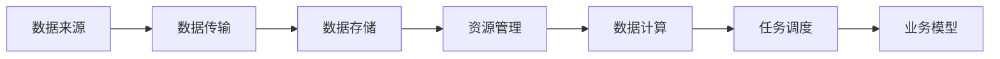

先看数据来源，大数据项目中的数据可以是来自数据库的结构化数据，也可以是半结构化的文件日志，还可以是视频、PPT 等非结构化数据。

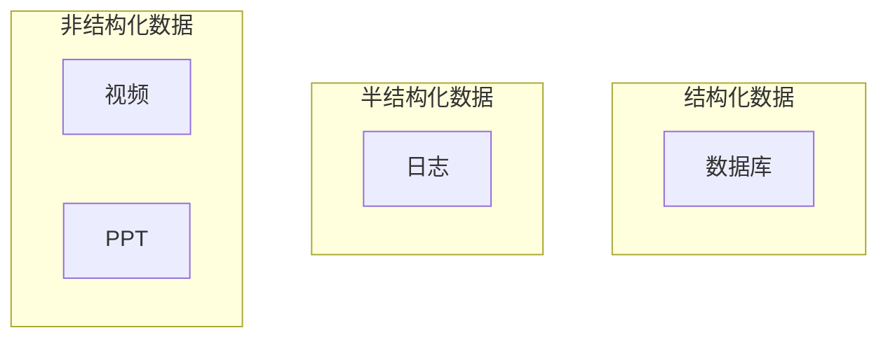

- 数据传输：主要有 DataX 数据传递、Flume 日志收集、Kafka 消息队列。可以使用这些实时采集数据然后传给数据计算层做实时计算。
- 数据存储：主要是采用分布式的数据存储 HDFS。
- 资源管理：一般采用 YARN
- 数据计算层：一般分为实时计算和离线计算。如 Spark、Flink。现在一般是用 Spark 做离线计算，Flink 做实时计算
- 任务调度层：主要是用 Qozie 任务调度和 DS 任务调度
- 业务模型层：主要是做业务模型、数据可视化和利用分析结果做业务应用的。

## 技术对比

<b>Hadoop 核心组件（非生态圈），核心组件有三个</b>

- HDFS：分布式的文件系统，解决海里数据存储的问题。
- MapReduce：分布式计算框架，解决海里数据计算的问题（现在一般用 Spark、Flink）
- Yarn：调度和集群资源管理的框架，解决资源任务调度问题

<b>广义上的 Hadoop 是指 Hadoop 生态圈，重点包括：HDFS、MapReduce、Hive、HBase、Yarn、Kafka、Spark、Flink、Zookeeper</b>

- HDFS：分布式文件系统。HDFS 采用了主从（Master/Slave）结构模型，一个 HDFS 集群包括一个名称节点和若干个数据节点。名称节点作为中心服务器，负责管理文件系统的命名空间及客户端对文件的访问。
- MapReduce：分布式计算框架
- HBase：针对结构化数据的 NoSQL 数据库，用于海量明细数据（十亿、百亿）的随机实时查询，如日志明细、交易清单、轨迹行为等
- Hive：基于 Hadoop 的数据仓库；最初用于解决海量结构化的日志数据统计问题。
  - Hive 定于了一种类似 SQL 的查询语言（HSQL）将 SQL 转化为 mapreduce 任务在 hadoop 上执行。我们可以利用 Hive 对采集到的数据做分析，然后存储到 HBase 中。
  - Hive 本身没有存储数据，数据是存储在 HDFS 中的。Hive 的表其实就是 HDFS 的目录
  - 一般使用 Hive 做离线分析。

<b> Hive 和 HBase 是协作关系，它们可以如何协作呢?</b>

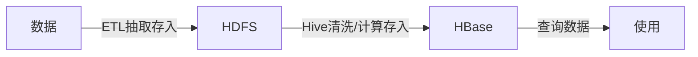

Hive 就是用来清洗、计算数据，存入 HBase 的。Hive 也可以统计数据。

[大数据入门：Hive和Hbase区别对比 - 知乎 (zhihu.com)](https://zhuanlan.zhihu.com/p/333682189)

<b>其他组件就比较好理解了</b>

- Yarn：资源调度
- Kafka：消息队列，可用于采集数据
- Spark、Flink：计算框架
- Zookeeper：分布式协作框架，主要用来解决分布式环境下的数据管理问题：数据统一命名，状态同步，集群管理，配置同步等。

[Hadoop的生态系统 - 知乎 (zhihu.com)](https://zhuanlan.zhihu.com/p/112758968)

## 离线数仓

离线数仓架构示意图

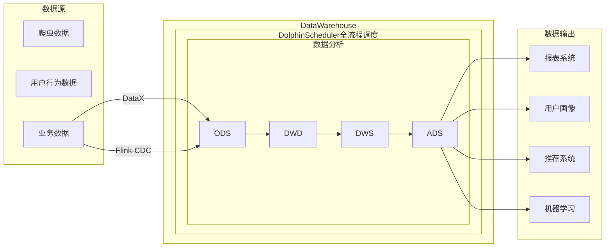

数据仓库不是数据的最终目的地，而是为数据的最终目的地做准备。这些准备包括对数据的：备份、清洗、聚合、统计等。

- 数据采集传输可以用：Flume、Kafka、DataX
- 数据存储可以用：MySQL、HDFS
- 数据计算可以用：Hive，写 SQL 便可以利用 Hadoop 的 MapReduce 进行数据计算。也可以把 Hive 的计算引擎换成 Spark。
  - Hive 会将分析结果保存到数据库
- ..


# 我的 Spark 笔记

用 SQL 比较多 90% 都是写 SQL；10% 是用 Spark、Flink 提供的 API 来完成数据统计/分析（业务比较复杂）

我们用的 Spark 版本是 spark-3.2.4-bin-hadoop3.2-scala2.13

[Spark入门教程（非常详细）从零基础入门到精通，看完这一篇就够了-CSDN博客](https://blog.csdn.net/Javachichi/article/details/131871627)

可能用到的 Linux 命令

- 查看端口占用 ` sudo netstat -antup | grep 8080`
- t 显示 tcp 相关项
- u 显示 udp 相关项
- p 显示 PID

可能用到的 windows 命令

- 查看端口占用 `netstat -ano | findstr "8080"`
- 杀死任务 `taskkill /T /F /PID xxx`

## Hadoop 安装

<b style="color:blue">配置 Hadoop，避免本地运行 Spark 报错</b>

Hadoop 设计用于 Linux 运行，但是我们写 Spark 的时候是在 windows 上开发，不可避免的会用到部分 Hadoop 的功能，为了避免在 windows 上报错，我们要安装一个 Hadoop。

- 下载 Hadoop：[cdarlint/winutils: winutils.exe hadoop.dll and hdfs.dll binaries for hadoop windows (github.com)](https://github.com/cdarlint/winutils/tree/master)
- 将 Hadoop bin 下的的 dll 文件复制到 C:/Windows/System32 下
- 配置 HADOOP_HOME 环境变量指向 hadoop 文件夹
- 然后重启机器，这样就不会报错了。
- [大数据学习踩坑之 HADOOP_HOME and hadoop.home.dir are unset.-CSDN博客](https://blog.csdn.net/HeyShHeyou/article/details/103441110)

<b style="color:blue">windows 配置单机版 Hadoop</b>

如果确实需要 Hadoop 相关的组件和功能，需要安装一下 windows 单机版本的 Hadoop

[Windows下配置单机Hadoop环境_windows配置hadoop获取电脑的hostname-CSDN博客](https://blog.csdn.net/qq_42582489/article/details/103401039)

- 下载并解压 Hadoop

- 下载 windows Hadoop 需要的 hadoop.dll 和 winutils.exe winutils.pdb；将下载的三个文件放到 hadoop 的 bin 目录

- 将 hadoop.dll 放到 C:/Windows/System32 下

- 设置 HADOOP_HOME 环境变量，在 Path 环境变量中添加 `%HADOOP_HOME%/bin`

- 在 /etc/hadoop-env.cmd 中配置 JAVA_HOME 的路径，默认就是 %JAVA_HOME%，我们在系统环境变量中设置了 JAVA_HOME，所以这步可以跳过。

- 配置 hadoop /etc 中的 core-site.xml 和 hdfs-site.xml

  ```xml
  <!-- core-site.xml -->
  <configuration>
    <property>
      <name>fs.defaultFS</name>
      <value>hdfs://127.0.0.1:9999</value>
    </property>
  </configuration>
  
  
  <!-- 
  hdfs-site.xml 
  data/namenode data/datanode 都是自己创建的目录
  -->
  <configuration>
    <property>
      <name>dfs.replication</name>
      <value>1</value>
    </property>
    <property>
      <name>dfs.namenode.name.dir</name>
      <value>file:///C:/software/dev/hadoop-3.2.4/data/namenode</value>
    </property>
    <property>
      <name>dfs.datanode.data.dir</name>
      <value>file:///C:/software/dev/hadoop-3.2.4/data/datanode</value>
    </property>
  </configuration>
  ```

- cmd 中输入 hadoop 测试~

- 初始化 hdfs `hdfs namenode -format`

[Windows下hadoop环境搭建之NameNode启动报错_error namenode.namenode: failed to start namenode.-CSDN博客](https://blog.csdn.net/qq_35704550/article/details/122956800)

[03、Hadoop框架HDFS Shell 命令_如何单独启动hdfs在shell环境中-CSDN博客](https://blog.csdn.net/hujieliang123/article/details/122877806)

## Spark 介绍

## Spark 是什么

Spark 最早源于一篇论文 Resilient Distributed Datasets: A Fault-Tolerant Abstraction for In-Memory Cluster Computing，该论文是由加州大学柏克莱分校的 Matei Zaharia 等人发表的。论文中提出了一种弹性分布式数据集（即 RDD）的概念。

RDD 是一种分布式内存抽象，其使得程序员能够在大规模集群中做内存运算，并且有一定的容错方式。而这也是整个 Spark 的核心数据结构，Spark 整个平台都围绕着 RDD 进行。

<b>Spark 是如何做计算的呢？</b>

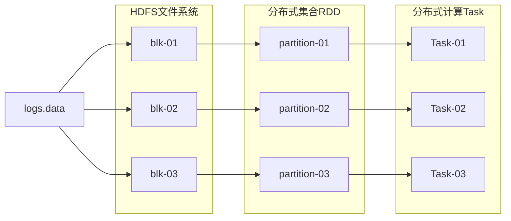

Spark 是分布式计算框架，借鉴了 MapReduce 的思想，保留了其分布式并行计算的特点，并改进了其明显的缺陷，让中间数据存储在内存中而非磁盘，提高了程序整体的运行速度。

以计算 logs.data 为例，logs.data 被分散的存储在 HDFS 文件系统中；针对每个 blk 都会有一个计算的分区，每个分区都会有一个计算的任务。

<b>Spark 是一个统一分析引擎</b>

统一分析引擎是指 Spark 适用面非常广泛，所以，被称之为统一的（适用面广）的分析引擎（数据处理）

Spark 可以对任意类型的数据进行自定义计算；可以计算结构化、半结构化、非结构化等各种类型的数据；同时也支持使用 Python、Java、Scala、R 以及 SQL 语言去开发应用程序计算数据；

<b>Spark 的特点</b>

- 速度：基于流式计算速度要比 hadoop 快 100 倍左右，离线计算比 mr 快速 10 倍左右
- 易用：spark 提供了超过 80 个高阶算子供给我们使用，并支持非常多的编程语言
- 通用性：提供了几乎大数据分析中的所有的技术栈; 离线：spark core，sql：spark sql、图计算、机器学习等等
- 随处运行：支持 yarn、standalone、mesos、kebernates...

Spark 可以非常方便地与其他的开源产品进行融合。比如，Spark 可以使用 Hadoop 的 YARN 和 Apache Mesos 作为它的资源管理和调度器，并且可以处理所有 Hadoop 支持的数据，包括 HDFS、HBase 和 Cassandra 等。 这对于已经部署 Hadoop 集群的用户特别重要,不需要做任何数据迁移就可以使用 Spark 的强大处理能力。Spark 也可以不依赖于第三方的资源管理和调度器，它实现了 Standalone 作为其内置的资源管理和调度框架,这样进一步降低了 Spark 的使用门]槛，使得所有人都可以非常容易地部署和使用 Spark。此外, Spark 还提供了在 EC2 上部署 Standalone 的 Spark 集群的工具。

简单说，他是一个集成了离线计算、实时计算、图计算、机器学习，并包括 sql 查询等等的计算框架。

## Spark VS Hadoop

<b>Spark VS Hadoop</b>

| -            | Hadoop                                       | Spark                                                        |
| ------------ | -------------------------------------------- | ------------------------------------------------------------ |
| 类型         | 基础平台, 包含计算, 存储, 调度               | 纯计算工具（分布式）                                         |
| 场景         | 海量数据批处理（磁盘迭代计算）               | 海量数据的批处理（内存迭代计算、交互式计算）、海量数据流计算 |
| 价格         | 对机器要求低, 便宜                           | 对内存有要求, 相对较贵                                       |
| 编程范式     | Map+Reduce, API 较为底层, 算法适应性差       | RDD 组成 DAG 有向无环图, API 较为顶层, 方便使用              |
| 数据存储结构 | MapReduce 中间计算结果在 HDFS 磁盘上, 延迟大 | RDD 中间运算结果在内存中 , 延迟小                            |
| 运行方式     | Task 以进程方式维护, 任务启动慢              | Task 以线程方式维护, 任务启动快，可批量创建提高并行能力      |

尽管 Spark 相对于 Hadoop 而言具有较大优势，但 Spark 并不能完全替代 Hadoop

- 在计算层面，Spark 相比较 MR（MapReduce）有巨大的性能优势，但至今仍有许多计算工具基于 MR 构架，比如非常成熟的 Hive
- Spark 仅做计算，而 Hadoop 生态圈不仅有计算（MR）也有存储（HDFS）和资源管理调度（YARN），HDFS 和 YARN 仍是许多大数据体系的核心架构

<b>Hadoop 的基于进程的计算和 Spark 基于线程方式优缺点？</b>

Hadoop 中的 MR 中每个 map/reduce task 都是一个 java 进程方式运行，好处在于进程之间是互相独立的，每个 task 独享进程资源，没有互相干扰，监控方便，但是问题在于 task 之间不方便共享数据，执行效率比较低。比如多个 map task 读取不同数据源文件需要将数据源加载到每个 map task 中，造成重复加载和浪费内存。而基于线程的方式计算是为了数据共享和提高执行效率，Spark 采用了线程的最小的执行单位，但缺点是线程之间会有资源竞争。

## Spark 四大特点

<b>速度快</b>

由于 Apache Spark 支持内存计算，并且通过 DAG（有向无环图）执行引擎支持无环数据流，所以官方宣称其在内存中的运算速度要比 Hadoop 的 MapReduce 快 100 倍，在硬盘中要快 10 倍

Spark 处理数据与 MapReduce 处理数据相比，有如下两个不同点

- 其一、Spark 处理数据时，可以将中间处理结果数据存储到内存中；
- 其二、Spark 提供了非常丰富的算子(API),可以做到复杂任务在一个 Spark 程序中完成

<b>易于使用</b>

Spark 支持 Java、Scala、Python 等语言，每种语言的 api 设计几乎一样。

<b>通用性强</b>

在 Spark 的基础上，Spark 还提供了包括 Spark SQL、Spark Streaming、MLib 及 GraphX 在内的多个工具库，我们可以在一个应用中无缝地使用这些工具库。

<b>运行方式</b>

Spark 支持多种运行方式，包括在 Hadoop 和 Mesos 上，也支持 Standalone 的独立运行模式，同时也可以运行在云 Kubernetes（Spark 2.3开始支持）上。

对于数据源而言，Spark 支持从 HDFS、HBase、Cassandra 及 Kafka 等多种途径获取数据。

## Spark 核心组件

整个 Spark 框架模块包含：Spark Core、 Spark SQL、 Spark Streaming、 Spark GraphX、 Spark MLlib，而后四项的能力都是建立在核心引擎（Spark Core）之上

- Spark Core
  - 实现了 Spark 的基本功能，包含任务调度、内存管理、错误恢复、与存储系统交互等模块。
  - Spark Core 中还包含了对弹性分布式数据集(resilient distributed dataset,简称 RDD)的 API 定义
  - 提供 Python、Java、Scala、R 语言的 API，可以编程进行海量离线数据批处理计算
- Spark SQL（⭐）
  - 基于 SparkCore 之上，提供结构化数据的处理模块，支持多种数据源，比如 Hive 表、Parquet 以及 JSON 等。
  - SparkSQL 支持以 SQL 语言或者 Apache Hive 版本的 SQL 方言对数据进行处理。
  - SparkSQL 本身针对离线计算场景，也可以完成实时计算（一般是伪实时）
  - 基于 SparkSQL，Spark 提供了 StructuredStreaming 模块，可以以 SparkSQL 为基础，进行数据的流式计算。
- Spark Streaming（淘汰了）：是Spark提供的对实时数据进行流式计算的组件。提供了用来操作数据流的API,并且与Spark Core中的RDDAPI高度对应。
- Spark ML：以 SparkCore 为基础，进行机器学习计算，内置了大量的机器学习库和 API 算法等。方便用户以分布式计算的模式进行机器学习计算。
- Spark Graphx：以 SparkCore 为基础，进行图计算，提供了大量的图计算 API，方便用于以分布式计算模式进行图计算。

## Spark 运行模式

Spark 提供多种运行模式

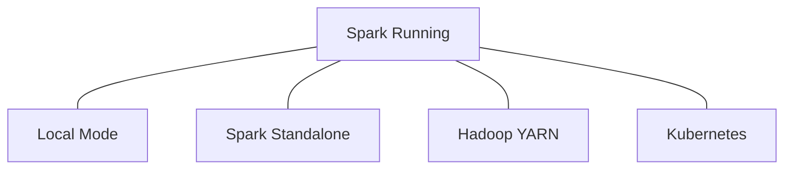

- 本地模式（单机）：本地模式就是以一个<b>独立的进程</b>，通过其内部的<b>多个线程来模拟</b>整个 Spark 运行时环境
- Standalone 模式（集群）：Spark 中的各个角色以<b>独立进程</b>的形式存在，并组成 Spark 集群环境

- Hadoop YARN 模式（集群）：Spark中的各个角色<b>运行在 YARN 的容器内部</b>，并组成 Spark 集群环境
- Kubernetes 模式（容器集群）：Spark中的各个角色<b>运行在 Kubernetes 的容器内部</b>，并组成 Spark 集群环境
- 云服务模式（运行在云平台上）

## Spark 的架构角色

### Yarn 中的角色

我们先回顾下 Yarn 角色。

YARN 主要有 4 类角色，从 2 个层面去看：

资源管理层面

- 集群资源管理者（Master）：ResourceManager（管理整个集群的资源）
- 单机资源管理者（Worker）：NodeManager（管理单台机器的资源）

任务计算层面

- 单任务管理者（Master）：ApplicationMaster（任务失败重启、任务的资源分配、任务的工作调度）
- 单任务执行者（Worker）：Task（干活的）
- 一个 Master 对应一个 Worker；即每个任务都有各自对应的管理者，这个管理者负责任务的失败重启、资源分配、工作调度等。

### Spark 运行角色

Spark 中有 4 类角色

| 角色          | 说明                                                  |
| ------------- | ----------------------------------------------------- |
| Master 角色   | 管理整个集群的资源，类比于 Yarn 的 ResourceManager    |
| Worker 角色   | 管理单个服务器的资源，类比于 Yarn 的 NodeManager      |
| Driver 角色   | 管理单个 Spark 任务，类比于 Yarn 的 ApplicationMaster |
| Executor 角色 | 执行单个任务的计算，类比于 Yarn 容器内运行的 Task     |

从 2 个层面划分

资源管理层面

- 管理者: Spark 是 Master 角色， YARN 是 ResourceManager
- 工作中: Spark 是 Worker 角色， YARN 是 NodeManager

从任务执行层面

- 某任务管理者: Spark 是 Driver 角色， YARN 是 ApplicationMaster
- 某任务执行者: Spark 是 Executor 角色， YARN 是容器中运行的具体工作进程。

正常情况下 Executor 是干活的角色，不过在特殊场景下（Local 模式）Driver 可以即管理又干活

## Spark 部署

| 部署模式    | 说明                                                         |
| ----------- | ------------------------------------------------------------ |
| Local       | 多用于本地测试，如在 eclipse, idea 中写程序测试等            |
| Standalone⭐ | 是 Spark 自带的一个资源调度框架，它支持完全分布式。          |
| Yarn⭐       | 生态圈里面的一个资源调度框架，Spark 也是可以基于 Yarn 来计算的。 |
| Mesos       | 资源调度框架，与 Yarn 类似。                                 |

### Standalone 模式

这里只安装一个单机版的的 Spark。

1️⃣下载 Spark [Index of /dist/spark (apache.org)](https://archive.apache.org/dist/spark/)，选择 spark-3.2.4-bin-hadoop3.2-scala2.13

2️⃣准备好 JDK 环境

- 安装 JDK，sudo apt install ...

3️⃣修改配置文件

- spark-env.sh.template 改名为 spark-env.sh

  - 在里面配置下列内容

    ```shell
    export JAVA_HOME=/usr/lib/jvm/java-11-openjdk-amd64
    SPARK_MASTER_HOST=localhost # 我们用的本地主机，所以是 localhost
    SPARK_MASTER_PORT=7077
    ```

- workers.template 改名为 workers（不改也可以），里面写 localhost（我们是单机上启动 workers，所以直接配本地 localhost）

- 配置 spark-defauts.conf.template（配置日志开启机制，用于将数据保存到日志，目前不配置也可以）

4️⃣启动，sbin 下的 start-all.sh 启动所有

5️⃣jsp 查看是否创建了 master 和 worker

集群搭建不讲，自行网上查资料

<b>启动 spark</b>

```bash
bash sbin/start-all.sh
```

<b>提交任务到 spark 中运行（未指定使用多少资源，默认用全部的资源）</b>

```bash
./bin/spark-submit --class org.apache.spark.examp
les.SparkPi --master spark://localhost:7077 examples/jars/spark-examples_2.13-3.2.4.jar
```

### Yarn 模式

Yarn 模式不会启动 Spark 集群。Yarn 是调度器，Spark 集群会在 Yarn 内部启动。

我们使用 `./bin/spark-submit --help` 查看 submit 的提交模式

- spark://host:port
- mesos://host:port
- yarn
- k8s://https://host:port
- local (Default: local[*])

我们用 yarn 模式启动（需要安装 Hadoop），需要现在 spark-env.sh 里配置这些信息

```bash
export JAVA_HOME=/usr/lib/jvm/java-11-openjdk-amd64
SPARK_MASTER_HOST=localhost # 我们用的本地主机，所以是 localhost
SPARK_MASTER_PORT=7077
HADOOP_CONF_DIR=hadoop的地址
YARN_CONF_DIR=hadoop的地址
```

启动

```bash
./bin/spark-submit --master yarn --deploy-mode cluster --class org.apache.spark.examp
les.SparkPi --master spark://localhost:7077 examples/jars/spark-examples_2.13-3.2.4.jar
```

yarn 分为 client 模式和 cluster 模式，client 模式不能离开 client，yarn 模式可以离开。其他的自行查博客。

## Spark Shell

### local 模式

直接启动 Spark Shell 默认是本地模式。

```shell
spark-shell
```

local 模式仅在本机启动一个 SparkSubmit 进程，没有与集群建立联系。虽然进程中有 SparkSubmit 但是不会被提交到集群。

### Cluster模式（集群模式）

```shell
spark-shell --master spark://localhost:7077
```

### Yarn 模式（Yarn-client 模式）

```shell
spark-shell --master yarn
```

注意，这里的 master 必须使用 yarn-client 模式，不是 yarn-cluster 因为 spark-shell 是一个与用户交互的命令行

- spark-shell会创建两个对象: sc和spark, 分别表示两个重要的上下文环境: SparkContext和SparkSession。
- master=local[J表示运行在Local模式，[表示CPU的核心数量
- spark-shell模式会启用WebUl端口4040，如果同- -时间启动多个spark-shell,该端口依次递增

<b>退出spark-shell</b>

正确退出：quit 千万不要 ctrl+c 退出，这样是错误的。若使用了ctr1+c退出，使用命令查看监听端口:
netstat -apn| grep 4040
再使用ki11 -9端口号杀死进程。

# Spark 开发环境

## 环境搭建

本地运行的时候不用启动 Spark

配置好 pom 文件

- 需要 scala library
- 需要 spark-core （学什么就加什么，目前只学 core）
- 如果后期学 spark-sql 就加 spark-sql
- spark 和 scala 的版本要对应的上

```xml
<dependencies>
    <!-- Spark Core -->
    <dependency>
        <groupId>org.apache.spark</groupId>
        <artifactId>spark-core_2.13</artifactId>
        <version>3.2.4</version>
    </dependency>

    <!-- Spark SQL -->
    <!-- 
    <dependency>
        <groupId>org.apache.spark</groupId>
        <artifactId>spark-sql_2.13</artifactId>
        <version>3.5.1</version>
    </dependency>
			-->
			<!-- org.codehaus.janino 是一个轻量级的 Java 编译器 先不用-->
    <!--        <dependency>-->
    <!--            <groupId>org.codehaus.janino</groupId>-->
    <!--            <artifactId>janino</artifactId>-->
    <!--            <version>3.1.4</version>-->
    <!--        </dependency>-->

    <dependency>
        <groupId>org.scala-lang</groupId>
        <artifactId>scala-library</artifactId>
        <version>2.13.13</version>
    </dependency>
</dependencies>
```

## WordCount

Spark RDD 编程的程序入口对象是 SparkContext 对象(不论何种编程语言)。只有构建出 SparkContext, 基于它才能执行后续的 API 调用和计算。本质上, SparkContext 对编程来说, 主要功能就是创建第一个 RDD 出来

```scala
package org.spark

import org.apache.spark.{SparkConf, SparkContext}

object WordCount{
    def main(args: Array[String]): Unit = {
        val sc = new SparkContext(
            new SparkConf().setAppName("WordCount")
            	// local 表示本地模式
            	// * 表示使用所有的 CPU 核
                .setMaster("local[*]")
        )
        val path = "xxx"
        sc.textFile(path)
            .flatMap(_.split("\\s+"))
            .map((_, 1))
            .reduceByKey(_ + _)
            .foreach(println)
        sc.stop()
    }
}
```

定义一个日志配置类

```scala
package org.spark

import org.apache.log4j.{Level, Logger}

trait LoggerTrait {
    Logger.getLogger("org.apache.spark").setLevel(Level.WARN)
    Logger.getLogger("org.apache.hadoop").setLevel(Level.WARN)
    Logger.getLogger("org.spark_project").setLevel(Level.WARN)
}
```

然后我们的 scala 类继承自这个类，这样就只会打印 WARN 的日志了

```scala
package org.spark

import org.apache.spark.{SparkConf, SparkContext}

object WordCount extends LoggerTrait {
    def main(args: Array[String]): Unit = {
        val sc = new SparkContext(
            new SparkConf().setAppName("WordCount")
                .setMaster("local[*]")
        )
        val path = "xxx"
        sc.textFile(path)
            .flatMap(_.split("\\s+"))
            .map((_, 1))
            .reduceByKey(_ + _)
            .foreach(println)
        sc.stop()
    }
}
```

为了方便获取和关闭 spark context 我们定义一个工具类

```scala
package org.spark

import org.apache.spark.{SparkConf, SparkContext}/8

/**
 * SparkUtil 快速创建 Spark 连接？
 */
object SparkUtil {
    private var context: SparkContext = _

    def getSparkContext(name: String, master: String = "local[*]"): SparkContext = {
        context = new SparkContext(
            new SparkConf().setAppName(name)
                .setMaster(master)
        )
        context
    }

    def closeContext(): Unit = context.stop()
}
```

# SparkCore

SparkCore 的学习主要是了解 RDD 的概念，掌握 RDD 的创建；重要的算子；缓存和检查点机制；了解 Spark 执行的基本原理。

其中算子这块其实就是学习函数式编程，了解 Spark 中定义的每个算子有什么样的功能。很多内容和 scala 的函数式编程是重合的，不过 Spark 中的计算结果是 RDD。

## RDD

### <b>为什么需要 RDD?</b>

分布式计算需要解决很多问题

- 分区计算
- shuffle 控制
- 数据存储\序列化\发送
- 数据计算 API

需要抽象出一个统一的数据抽象对象来实现分布式计算需要的功能。

### RDD 介绍

RDD（Resilient Distributed Dataset）叫做弹性分布式数据集

- Dataset：一个数据集合，用于存放数据的。
- Distributed：RDD 中的数据是分布式存储的，可用于分布式计算。
- Resilient：RDD 中的数据可以存储在内存中或者磁盘中。

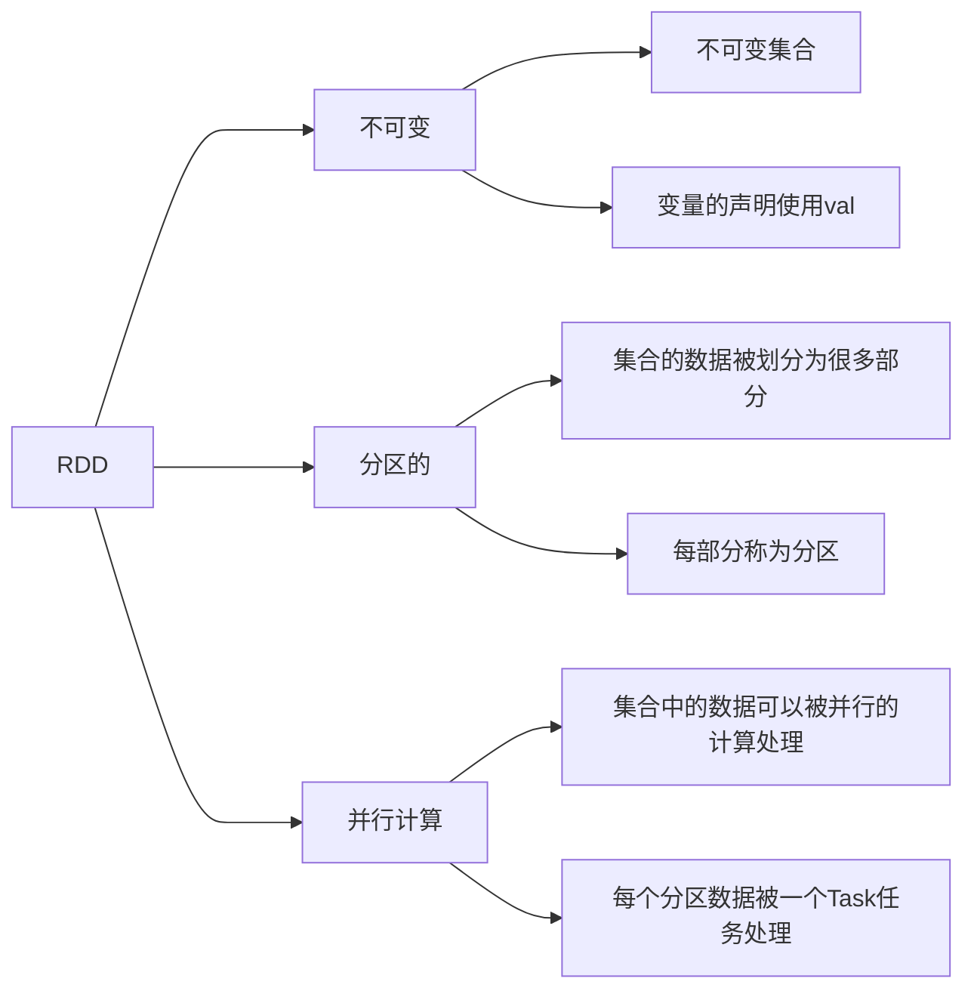

RDD 是 Spark 中最基本的数据抽象，代表一个不可变、可分区、里面的元素可并行计算的集合。Spark 所有的运算和操作都是建立在 RDD 上的。

### RDD 的五大特征

- RDD 是有分区的；假设 1 个 RDD 有 3 个分区，RDD 存储了 123456，那么这些数据会被分散在 3 个分区内进行存储
- RDD 的方法会作用在其所有分区上；假设我们对 RDD 中的数据 +1 操作，那所有分区的数据都会 +1
- RDD 之间是有依赖关系（血缘关系）
- Key-Value 型的 RDD 可以有分区器
- RDD 的分区规划，会尽量靠近数据所在的服务器，避免网络读取。

## RDD 的创建

主要有两种创建方式

- 通过并行化集合创建(本地集合对象转分布式 RDD)
- 读取外部数据源(读取文件)

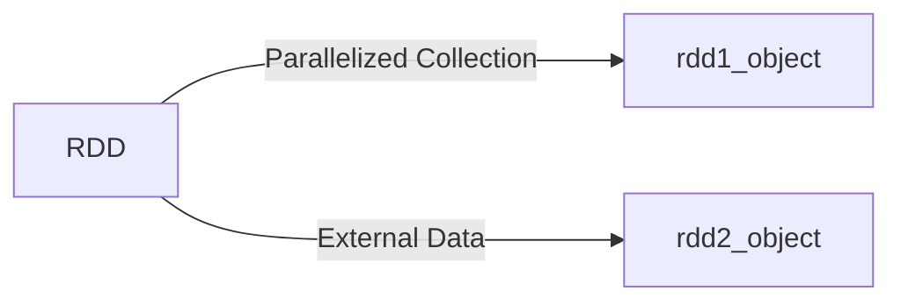

<b>本地集合创建 RDD</b>

```scala
package org.it.rdd

import org.spark_core.{LoggerTrait, SparkUtil}

object CreateRDD extends LoggerTrait {
    def main(args: Array[String]): Unit = {
        val sc = SparkUtil.getSparkContext("FlatMapOP")
        //        val data = sc makeRDD List(1, 2, 3, 4, 5, 6)
        val data = sc.makeRDD((1 to 20))
        // 获取 RDD 的默认分区数，默认是电脑的最大核心数
        println(data.getNumPartitions) // 16
        val list: Array[Int] = data.collect() // 将 RDD 对象转为 scala 的集合对象
        println(list.mkString("Array(", ", ", ")"))
        SparkUtil.closeContext()
    }
}
```

<b>读取文件创建 RDD - textFile(文件路径, 分区数)</b>

可以读本地文件，也可以读 HDFS 数据

```scala
// 读取本地文件
val data: RDD[String] = sc.textFile("cdn.txt", 4)
println(data.collect().mkString("Array(", ", ", ")"))

// 读取 HDFS 中的文件
val dataFromHDFS: RDD[String] = sc.textFile("hdfs://localhost:8020/input/cdn.txt", 4)
```

注意，分区数 Spark 有自己的判断，如果分区大小超出了 Spark 的允许范围，参数 2 无效。

<b>读取一堆小文件 wholeTextFile</b>

这个 API 偏向于少量分区读取数据因为，这个API表明了自己是小文件读取专用，那么文件的数据很小分区很多，导致 shuffle 的几率更高.所以尽量少分区读取数据.

## RDD 算子介绍

RDD 对象上的 API 称之为算子，是对 RDD 对象中的数据做操作的。

<b>RDD 的算子分为 transform（转换）算子和 action（动作）算子，RDD 算子有个特点，不执行 action 算子的话，前面的 transform 操作都不会执行。</b>

<b>transform 算子：</b>返回值仍然是一个 RDD，称之为转换算子。这类算子是 `lazy 懒加载` 的，如果没有 action 算子，Transformation 算子是不工作的。

<b>action 算子：</b>返回值不是 rdd 的就是 action 算子

对于这两类算子来说，Transformation 算子，相当于在构建执行计划，action 是一个指令让这个执行计划开始工作。

如果没有 action, Transformation 算子之间的迭代关系，就是一个没有通电的流水线。只有 action 到来，这个数据处理的流水线才开始工作。

[PySpark 基础之 Transformation算子和Action算子_spark的transformation算子和action算子是什么关系-CSDN博客](https://blog.csdn.net/weixin_44639720/article/details/129977777#:~:text=Transformation算子： RDD的算子，返回值仍然是一个RDD，称之为转换算子。 这类算子是,lazy 懒加载 的，如果没有Action算子，Transformation算子是不工作的。)

[Spark介绍-Spark Core(1)_spark core的功能-CSDN博客](https://blog.csdn.net/qq_33431394/article/details/109225600)

[Spark RDD Lazy Evaluation的特性及作用-CSDN博客](https://blog.csdn.net/MrLevo520/article/details/100079438)

## transform 算子

一个基本 Spark 算子的示例代码

```scala
package org.spark.transform

import org.spark.{LoggerTrait, SparkUtil}

object Distinct extends LoggerTrait {
    def main(args: Array[String]): Unit = {
        val sc = SparkUtil.getSparkContext("FlatMapOP")
        val data = Seq(1, 2, 3, 4, 5, 6, 3, 4, 5, 4, 5, 6, 4, 3, 5)
        // parallelize 第一个参数是集合
        // 						第二个参是分区数
        //						如果有分区，想收集计算结果
        //						就需要进行 collect
        sc.parallelize(data, 2)
            .distinct()
            // 传入的参数类型 + 返回的参数类型
            .sortBy(identity)
            .collect()
            .foreach(println)
        SparkUtil.closeContext()
    }
}
```

collect 中有很多细节，Action 算子部分会详细说明

<b>常用算子汇总</b>

| 算子名称       | 作用                                                         |
| -------------- | ------------------------------------------------------------ |
| `map`          | 将 RDD 的数据一条条处理（处理的逻辑基于 map 算子中接收的处理函数），返回新的 RDD |
| `flatMap`      | 对 rdd 执行 map 操作，然后进行展平操作。<br>类似于 scala 中的 map + flatten |
| `reduceByKey`  | 针对 KV 型 RDD，自动按照 key 分组，然后根据你提供的聚合逻辑，完成组内数据 (value) 的聚合操作. |
| `groupBy`      | 将 RDD 数据按照传入的 func 进行分组                          |
| `filter`       | 过滤数据，保留返回值为 True 的数据，丢弃返回值为 False 的数据 |
| `distinct`     | 对 RDD 数据进行去重，返回新的 RDD                            |
| `union`        | 2 个 rdd 合并成 1 个 rdd 返回，只是合并，不会去重，不同类型的 rdd 依旧可以合并 |
| `join`         | 对两个 RDD 执行 JOIN 操作（可实现 SQL 的内\外连接）<br>join 算子只能用于二元元组 |
| `intersection` | 求 2 个 rdd 的交集，返回一个新的 rdd                         |
| `glom`         | 将 RDD 的数据，加上嵌套，这个嵌套按照分区来进行<br>RDD 数据 [1,2,3,4] 有两个分区，glom 后变成 [ [1,2],[3,4] ] |
| `groupByKey`   | 针对 KV 型 RDD，自动按照 key 分组                            |
| `sortBy`       | 对 RDD 数据进行排序，基于我们指定的排序依据                  |
| `sortByKey`    | 针对 `kV` 型 RDD，按照 key 进行排序                          |

| 算子名称                 | 作用                                                         |
| ------------------------ | ------------------------------------------------------------ |
| `map`                    | 将 RDD 的数据一条条处理（处理的逻辑基于 map 算子中接收的处理函数），返回新的 RDD |
| `flatMap`                | 对 rdd 执行 map 操作，然后进行展平操作。<br>类似于 scala 中的 map + flatten |
|                          | 过滤想要的数据进行保留，                                     |
|                          |                                                              |
|                          |                                                              |
|                          |                                                              |
| `sortBy`                 | 对 RDD 数据进行排序，基于指定的排序依据                      |
| `sample`                 | 随机采样指定比例的数据，采样的数据量只是接近这个比例<br>withReplacemetn：True 表示元素可以被重复采样<br>fraction：采样比例 |
| `mapPartitions`          | map算子批处理版。一次被传递的是一整个分区的数据，作为一个迭代器（一次性list）对象传入过来。<br>性能比 map 要高。注意 OOM，因为他一次性要加载一个分区中的所有数据进行处理。 |
| `mapPartitionsWithIndex` | 类似于 mapPartitions,除此之外还会携带分区的索引值            |

要再补下函数部分的知识。函数作为形式参数这块。case 模式匹配也要补一下。


| 算子名称               | 作用                                                         |
| ---------------------- | ------------------------------------------------------------ |
| `reduceByKey`          | 自动按照 key 分组，然后根据提供的聚合逻辑，对组内的数据（value）进行3聚合操作 |
| **`groupBy`**          | 将 rdd 的数据进行分组，分组条件由我们指定                    |
| **``**                 | 自动按照 key 分组                                            |
| **`join`**             | 对两个 rdd 执行 join 操作，可以实现 SQL 的内外连接， join 算子只能用于二元元组<br>join：内连接<br>leftOuterJoin：左连接<br>rightOuterJoin：右连接 |
| **`sortByKey`**        | 按照key进行排序                                              |
| **`mapValue`**         | 针对二元元组，对其内部的二元元组的 Value 执行 map 操作       |
| combineByKey           |                                                              |
| aggregateByKey         |                                                              |
| coalesce / repartition | 从字面理解就是重新分区，coalesce 用于分区减少操作，repartition用于增加分区。<br>repartition其实就是通过coalesce 来实现的。coalesce 默认采取的窄依赖，但是也可以产生宽依赖。repartition只是宽依赖。<br>一般是要求全局排序设置为 1 个分区外，多数时候都会重新分区 |


| 算子名称            | 说明                                                         |
| ------------------- | ------------------------------------------------------------ |
| **`glom`**          | 将RDD的数据，加上嵌套，这个嵌套按照分区来进行                |
| **`mapPartitions`** | 一次被传递的是一整个分区的数据，作为一个迭代器（一次性list）对象传入过来 |
| **`partitionBy`**   | 对RDD进行自定义分区操作                                      |
| **`repartition`**   | 对RDD的分区执行重新分区（仅数量）                            |
| **`coalesce`**      | 对分区进行数量增减                                           |

## Action 算子

所有的 action 算子都是作用在 RDD 上的，并且在 RDD 的 Patition 上执行，主要作用于是驱动我们的 RDD。换言之任何的 RDD 如果没有 Action 算子驱动，RDD 是不执行的。

| 算子名称           | 说明                                                         |
| ------------------ | ------------------------------------------------------------ |
| `countByKey`       | 统计 key 出现的次数，一般用于 KV 型 RDD                      |
| `collect`          | 将RDD各个分区内的数据，统一收集到 Driver 中，形成一个 List 对象。RDD 是分布式对象，数据量可能很大，所以在用这个算子之前要了解结果数据集不会很大，不然 Driver 内存会溢出 |
| `reduce`           | 对 RDD 数据按照传入的逻辑进行聚合                            |
| `fold`             | 和 reduce 一样，按照传入的逻辑进行聚合，聚合是带有初始值的   |
| `first`            | 取出 RDD 的第一个元素                                        |
| `take`             | 取 RDD 前 N 个元素，组合成 list 返回给你                     |
| `top`              | 对 RDD 数据集进行降序排序，取前 N 个                         |
| `count`            | 计算 RDD 有多少条数据，返回值是一个数字                      |
| `takeSample`       | 随机抽样 RDD 的数据，可以设置随机数种子                      |
| `takeOrdered`      | 对 RDD 进行排序，取前 N 个                                   |
| `foreach`          | 对 RDD 的每一个元素, 执行我们提供的逻辑的操作                |
| `foreachPartition` | 和普通的 foreach 一致，但是一次处理的是一整个分区数据。foreachPartition 就是一个没有返回值的 mapPartition |
| `saveAsTextFile`   | 将 RDD 的数据写入文本文件中<br/>支持本地写出，HDFS 等文件系统 |

saveAstextFile 算子是分布式执行的，执行数据不经过 Driver，写出的时候，每个分区所在的 Executor 直接控制数据写出到目标文件系统中，所以才会一个分区产生 1 个结果文件。

foreach 和 saveAsTextFile 算子都是是分区直接执行的，跳过 Driver，由分区所在的 Executor 直接执行。

其余 Action 算子都会将结果发送至 Driver。

## 分区操作算子

tf 表示 transformation

| 算子名称                | 说明                                                         |
| ----------------------- | ------------------------------------------------------------ |
| mapPartitions - tf 类型 | map 算子的批处理版，一次被传递的是一整个分区的数据（一个迭代器）。 |
| mapPartitionsWithIndex - tf 类型 | 类似于 mapPartitions，会携带分区的索引值 |
| Action 类型             | 和普通 foreach 一致，一次处理的是一整个分区数据              |
| partitionBy - tf 类型   | 对 RDD 进行自定义分区操作                                    |
| repartition - tf 类型   | 对 RDD 的分区执行重新分区<br>一般仅全局排序时会设置成 1 个分区 |
| coalesce - tf 类型      | 对分区进行数量增减                                           |
| mapValues - tf 类型     | 针对二元元组 RDD ,对其内部的二元元组的 Value 执行 map 操作   |
| join - tf 类型          | 对两个 RDD 执行 JOIN 操作(可实现 SQL 的内\外连接)<br>只能用于二元元组 |

## 算子对比

groupByKey 和 reduceByKey 的区别。

reduceByKey 的性能是远大于 groupByKey+聚合逻辑的。

- groupByKey 是先分组（shuffle），然后再聚合的。
- reduceByKey 是自带聚合逻辑。
  - 先在分区内做预聚合（可以极大减少下一步被 shuffle 的数据）
  - 然后再走分组流程（shuffle）
  - 分组后再做最终聚合

尽量不要增加分区，这可能会破坏内存迭代的计算管道。

## 保存文件

直接 RDD.下面的方法即可

- saveAsTextFile
- saveAsObjectFile
- saveAsSequence
- saveAsHadoopFile

# RDD 持久化

## RDD 的数据是过程数据

RDD 之间进行相互迭代计算(Transformation 的转换)，当执行开启后，新 RDD 的生成，代表老 RDD 的消失。

RDD的数据是过程数据，只在处理的过程中存在, 一旦处理完成，就不见了。这个特性可以最大化的利用资源，老旧 RDD 没用了就从内存中清理，给后续的计算腾出内存空间。

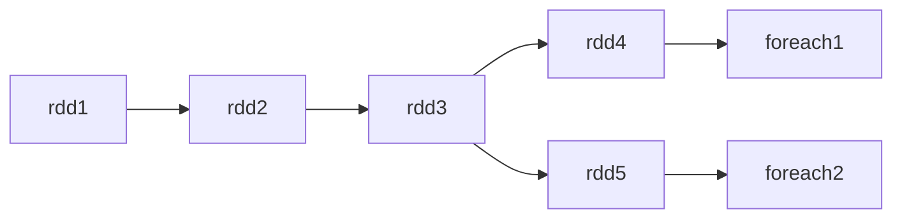

rdd3 被使用了两次，其实在第一次使用后，rdd3 就不存在了。第二次使用的时候只能基于 RDD 的依赖关系（血缘关系）从 rdd1 重新执行，构建 rdd3 供 rdd5 使用。

<b>问题</b>

如果 rdd3 被多个 rdd 使用，每次都要重新计算，十分耗费资源~

## RDD 缓存

为了解决上述问题，Spark 提供了缓存 API，将指定的 RDD 数据保留在内存或硬盘中。

<b>缓存的特点</b>

- 缓存技术可以将过程 RDD 数据，持久化保存到内存或者硬盘上
- 但是，这个保存在设定上是认为不安全的。如果断电缓存会丢失，如果内存不足会清理缓存 etc...

不过，一旦缓存丢失，可以基于血缘关系的记录，重新计算这个 RDD 的数据

<b>缓存是如何保存的</b>

RDD 有多个分区，每个分区会将自己的数据保存在所在的 Executor 内存/磁盘上，是分散存储的。

同时，由于缓存可能会丢失，因此缓存会保留血缘关系，丢失了就按血缘关系重新计算（为什么缓存要自己保存？RDD 不是自己维护了吗？读一下不就好了？还是说，这样做更方便？）

### persist / cache

Spark 使用 persist / cache 来缓存计算结果。不过不是立即缓存，而是触发 action 算子后，再进行缓存。<b>默认是缓存到内存中</b>

```scala
  /**
   * Persist this RDD with the default storage level (`MEMORY_ONLY`).
   */
  def persist(): this.type = persist(StorageLevel.MEMORY_ONLY)

  /**
   * Persist this RDD with the default storage level (`MEMORY_ONLY`).
   */
  def cache(): this.type = persist()
```

缓存的各种方式

```scala
# RDD3被2次使用，可以加入缓存进行优化
rdd3.cache()	#缓存到内存中.
rdd3.persist(StorageLevel.MEMORYONLY)	# 仅内存缓存
rdd3.persist (StorageLevel.MEMORYONLY_2)
#仅内存缓存，2个副本
rdd3. persist (StorageLevel. DISK_ ONLY)
#仅缓存硬盘上
rdd3. persist (StorageLevel. DISK_ ONLY .2)
#仅缓存硬盘上，2个副本
rdd3. persist (StorageLevel. DISK_ ONLY. 3)
#仅缓存硬盘上，3个副本
rdd3. persist (StorageLevel. MEMORY_ AND. DISK)
#先放内存，不够放硬盘
rdd3. persist(StorageLevel. MEMORY_ AND_ DISK .2)#先放内存，不够放硬盘，2个副本
rdd3. persist(StorageLevel.0FF_ HEAP)
#堆外内存(系统内存)
#如上API，自行选择使用即可
#一般建议使用rdd3 . persist (StorageL evel. MEMORY_ AND_ DISK)
#如果内存比较小的集群，建议使用rdd3 . persist(StorageLevel. DISK_ ONLY)或者就别用缓存了用CheckPoint
#主动清理缓存的API
rdd . unpersist()
```

| 持久化策略          | 含义                                                         |
| ------------------- | ------------------------------------------------------------ |
| MEMORY_ONLY（默认） | RDD中的数据，以没有经过序列化的java对象为格式，存在内存中，如果内存不足，不会存储到磁盘中。这种策略效率最高，但是对内存的要求也特别高 |
| MEMORY_ONLY_SER     | 就比MEMORY_ONLY多了一个序列化的功能，保存在内存中的数据是经过序列化的，数据其实以字节数组的方式存储的 |
| MEMORY_AND_DISK     | 比MEMORY_ONLY多了一个功能，如果内存不足会将数据存储在磁盘中  |
| MEMORY_AND_DISK_SER | 比MEMORY_AND_DISK多了一个功能，如果内存不足会将数据存储在磁盘中,往磁盘中存储数据效率比MEMORY_AND_DISK |
| DISK_ONLY           | 所有数据都保存在磁盘之中，这种效率最差，一般都不用           |
| xxx_2               | 相较于上诉策略而言，多一个_2,如：MEMORY_ONLY_2。比上诉的策略多了一个副本功能，2表示2个副本。因为还要加备份，所以性能肯定相对降低，但是容错变强。 |
| HEAP_OFF            | 使用非spark内存来操作数据。堆外内存。如：HBase、redis        |

持久化（缓存）的结果会以绿色圆点显示。

### 持久化的必要性

Spark 中的 RDD 是懒加载的，只有当遇到行动算子时才会从头计算所有 RDD，而且当同一个 RDD 被多次使用时，每次都需要重新计算一遍，这样会严重增加消耗。为了避免重复计算同一个 RDD，可以将 RDD 进行持久化。

将某个 RDD 中的数据保存到内存或者磁盘中，每次需要对这个 RDD 进行算子操作时，可以直接从内存或磁盘中取出该 RDD 的持久化数据，而不需要从头计算才能得到这个 RDD。

复用计算结果。

### RDD 持久化案例

我们用一个案例来看看持久化能提升多大的性能

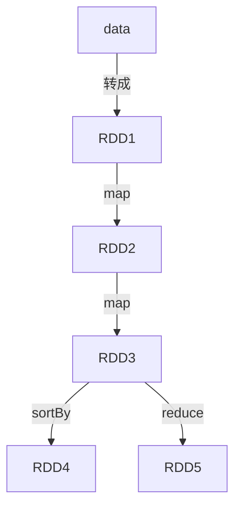

```scala
package org.spark.transform

import org.spark.{LoggerTrait, SparkUtil}

/**
 * 测试 Persist 前后的计算效率
 */
object Persist extends LoggerTrait {
    def main(args: Array[String]): Unit = {
        val sc = SparkUtil.getSparkContext("Persist")
        val data = (1 to 10000000).toSeq
        val rdd1 = sc.parallelize(data, 1)
        val rdd2 = rdd1.map(_ * 0.234)
        /**
         * 加 persist() 计算时间 1400+
         * 不加 persist() 计算时间 2300+
         */
        val rdd3 = rdd2.map(_ + 1 - 20 / 2.4).persist()
        rdd3.reduce(_ + _)

        val start = System.currentTimeMillis()

        for (i <- 1 to 10) {
            val rdd4 = rdd3.reduce(_ + _)
        }
        println(System.currentTimeMillis() - start)
        SparkUtil.closeContext()
    }
}
```

## checkpoints

检查点，和 JVM 的 checkpoints 类似，确保数据的安全。

Spark 的 checkpoint 是一种重要的容错机制，用于在发生故障时恢复数据，而非重新计算。假设，在处理长时间运行的复杂数据处理任务快结束时，程序异常终止了，这时候我们可以从 checkpoint 中读取先前的 RDD，不必从头到尾重新计算。

和缓存相比，CheckPoint 是一种重量级的使用，也就是 RDD 的重新计算成本很高的时候，我们采用 CheckPoint 比较合适，或者数据量很大，用 CheckPoint 比较合适。如果数据量小，或者 RDD 重新计算是非常快的，用 CheckPoint 没啥必要，直接缓存即可。

Cache 和 CheckPoint 两个 API 都不是 Action 类型，所以要想它们工作，必须在后面接上 Action 操作，让 RDD 有数据。

<b>在本地设置检查点</b>

如果没有安装 hadoop 可能会报错

`java.io.FileNotFoundException: java.io.FileNotFoundException: HADOOP_HOME and hadoop.home.dir are unset`

```scala
package org.spark.transform

import org.spark.{LoggerTrait, SparkUtil}

object CheckPoints extends LoggerTrait {
    def main(args: Array[String]): Unit = {
        val sc = SparkUtil.getSparkContext("CheckPoints")
        sc.setCheckpointDir("data")
        val data = sc.makeRDD((1 to 20))
        val mid = data.map(_ * 21.343).map((_, 1))
        mid.checkpoint()

        println(mid.reduceByKey(_ + _))

        SparkUtil.closeContext()
    }
}
```

<b>在 HDFS 上设置检查点</b>

文件路径写成 HDFS 的格式即可。一般是推荐保存在 HDFS 上的。

# 共享变量

## 广播变量

<b>下面来看一个 demo</b>

```scala
package org.spark.broadcast

import org.spark.{LoggerTrait, SparkUtil}

object BroadCast extends LoggerTrait {
    def main(args: Array[String]): Unit = {
        val sc = SparkUtil.getSparkContext("FlatMapOP")
        val n = 10
        val data = sc.makeRDD(1 to 100)
        val ans = data.map(e => e % n).reduce(_ + _)
        println(ans)
        SparkUtil.closeContext()
    }
}
```

这个代码有个问题，RDD 的数据可能会需要很多个 worker 节点进行计算，但是 map 中 e % n 取余操作中的 n 来自 master 节点，每个 worker 在求余计算的时候，worker 中的每个 task 都会拉取一次 n。

假设 n 是 1G 的数据，有 1 个 worker，worker 中有 5 个 task，每个 task 都会拉取一次数据，意味着总共要拉取 5G 的数据，使用 5G 内存（浪费了 4G 内存）。

```mermaid
graph LR
subgraph Worker
task1
task2
task3
task4
task5
end
subgraph Master
n=1G-->|拉取数据|task1
n=1G-->|拉取数据|task2
n=1G-->|拉取数据|task3
n=1G-->|拉取数据|task4
n=1G-->|拉取数据|task5
end
```

这时候，可以使用广播变量，让 Worker 拉取一份数据，Worker 中的所有 task 共享这个只读数据。

```scala
package org.spark.broadcast

import org.spark.{LoggerTrait, SparkUtil}

object BroadCast2 extends LoggerTrait {
    def main(args: Array[String]): Unit = {
        val sc = SparkUtil.getSparkContext("BroadCast2")
        val n = 10
        val bn = sc.broadcast(n)

        val ans = sc.makeRDD(1 to 100).map(e => e % bn.value).reduce(_ + _)
        println(ans)
        SparkUtil.closeContext()
    }
}
```

- task 拉取数据的规则，先在本地的 Executor 对应的 BlockManager 中尝试获取变量副本
- 本地没有则从 Driver 远程拉取变量副本，并保存到本地的 BlockManger 中
- 此后这个 executor 上的 task 都会直接使用本地 BlockManager 中的副本
- executor 的 BlockManger 除了从 driver 上拉取也可能从其他 BlockManger 中拉取

<b>总结</b>

广播变量用来高效分发较大的对象。向所有工作节点发送一个较大的只读值，以供一个或多个 Spark 操作使用。比如，如果你的应用需要向所有节点发送一个较大的只读查询表，甚至是机器学习算法中的一个很大的特征向量，广播变量用起来都很顺手。

## 累加器

假设，我们希望在 foreach 中做累加，我们可以直接在里面写代码逻辑。<b>用的比较少。</b>

```scala
package org.spark.acc

import org.spark.SparkUtil

// 累加器
object Acc {
    def main(args: Array[String]): Unit = {
        val sc = SparkUtil.getSparkContext("FlatMapOP")
        val data = sc.makeRDD((1 to 100), 4)
        var total = 0

        data.collect().foreach(e => {
            total += e
        })
        println(total)
        SparkUtil.closeContext()
    }
}
```

但是这种写法有个致命的缺陷，要进行 collect，把所有的数据收集到一起，可能会出现内存溢出。

<b>这时候就需要用到累加器了，用累加器完成全局数据的累加</b>

```scala
package org.spark.acc

import org.spark.{LoggerTrait, SparkUtil}

// 累加器
object Acc extends LoggerTrait {
    def main(args: Array[String]): Unit = {
        val sc = SparkUtil.getSparkContext("FlatMapOP")
        val data = sc.makeRDD((1 to 100), 4)
        val sum = sc.longAccumulator("num_sum")
        data.collect().foreach(e => {
            sum.add(e)
        })
        println(sum.value)
        SparkUtil.closeContext()
    }
}
```

我们也可以自定义累加器，实现 AccumulatorV2 抽象类即可。具体的写法自行百度。


# RDD 依赖关系

## Lineage（血统）&容错

<b>就是指当前的 RDD 来自那个 RDD，如果当前的 RDD 丢了，就去上一个 RDD 里重新计算得到当前 RDD。</b>

eg：第 n 个节点出错，会从第 n-1 个节点恢复

RDD 只支持粗粒度转换，即在大量记录上执行的单个操作。将创建 RDD 的一系列 Lineage（即血统）记录下来，以便恢复丢失的分区。RDD 的 Lineage 会记录 RDD 的元数据信息和转换行为，当该 RDD 的部分分区数据丢失时，它可以根据这些信息来重新运算和恢复丢失的数据分区。

RDD 和它依赖的父 RDD (s) 的关系有两种不同的类型，即窄依赖（narrow dependency）和宽依赖（wide dependency）。

可以使用代码 rdd. toDebugString 打印依赖关系

### 宽依赖和窄依赖

<b>宽依赖</b>：没有发生 shuffle；如 filter、map、flatmap、mapPartitions

<b>窄依赖</b>：存在 shuffle；如 reduceByKey、groupByKey、combineByKey、sortByKey

<div align="center">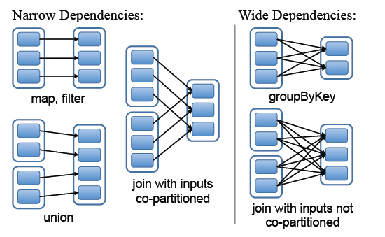</div>

#### 宽依赖

宽依赖指的是多个子 RDD 的 Partition 会依赖同一个父 RDD 的 Partition（父 RDD 的数据被使用了多次）

算子：reduceByKey、groupBy、 groupByKey、 aggregateByKey、 distinct，『join (join with inputs not co-partitioned)』等

<div align="center">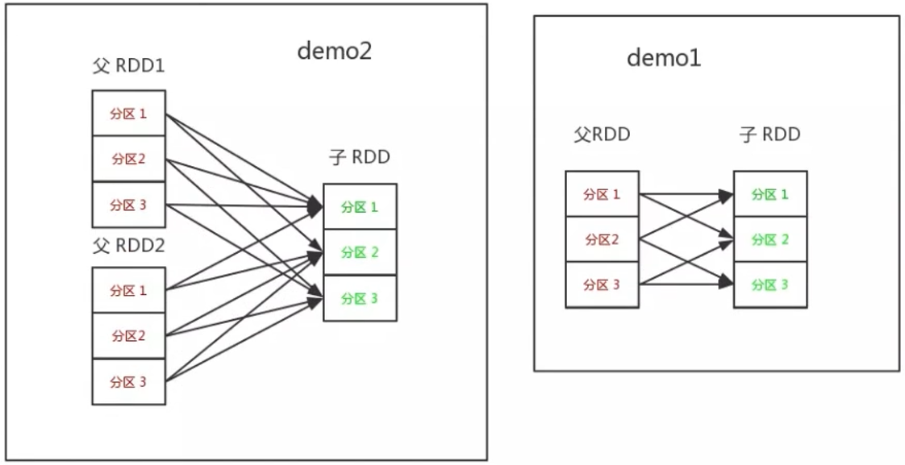</div>

#### 窄依赖

父 RDD 中的分区只被子 RDD 的分区使用一次（数据被分别存储在多个分区，可以认为是父 RDD 的数据只被子 RDD 使用一次）

<b>窄依赖分为两种</b>

- 一对一依赖：OneToOneDependency
- 范围依赖：RangeDependency，它仅仅被 `org.apache.spark.rdd.UnionRDD` 使用。UnionRDD 是把多个 RDD 合成一个 RDD，这些 RDD 是被拼接而成，每个父 RDD 的 Partition 的相对顺序不会变，不过每个父 RDD 在 UnionRDD 中的 Partition 的起始位置不同

窄依赖算子包括：map、flatMap、 mapPartition、 filter、 union、 『join (co-partitioned)』等

- map、filter、 flatMap、 mapPartition 算子如 demo1 所示
- union 算子如 demo2 所示
- join(co-partitioned) 如 demo3 所示

比较特别是的 join 算子，即可以是窄依赖，也可以是宽依赖。当 join 的输入是 co-partitioned 则是窄依赖，否则是宽依赖。或者你可以认为 co-partitioned 表示 join 的父 RDD 是经过了 Hash 分区的。

<div align="center">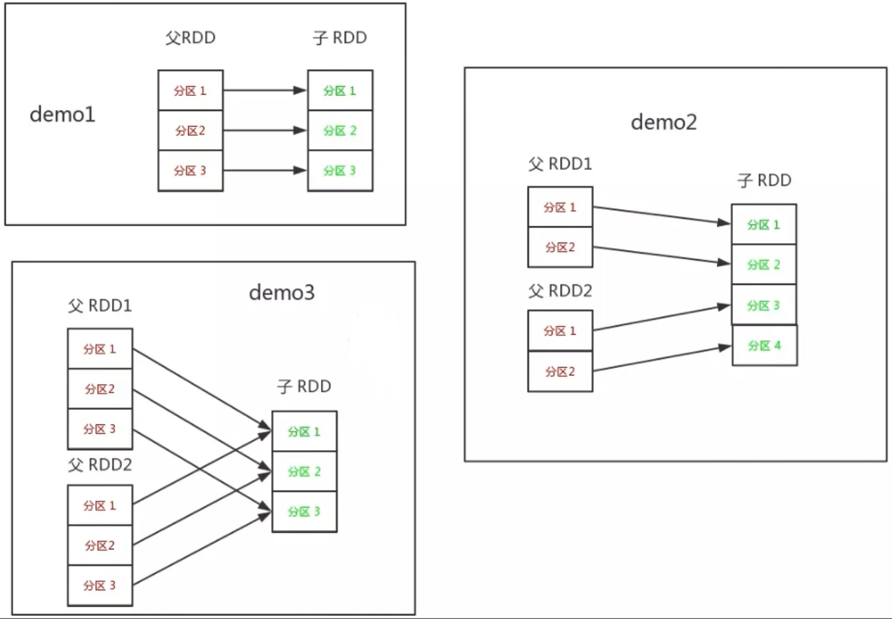</div>

### 依赖的源码

org.apache.spark.Dependency 的继承关系

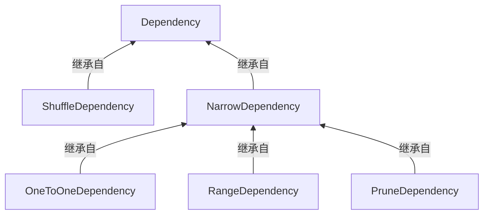

- OneToOneDependency：一对一依赖， 如 map、filter 操作。
- RangeDependency：范围依赖，如 union 操作。union 操作返回 UnionRDD，UnionRDD 是把多个 RDD 合并成一个 RDD，即每个父 RDD 的分区相对顺序保持不变，只不过每个父 RDD 在 UnionRDD 中的分区起始位置不同。

## RDD 的任务

### 任务划分

RDD 任务切分中间分为：Application、Job、 Stage 和 Task

- Application：初始化一个 SparkContext 即生成一个 Application，Spark 上下文的执行入口。
- Job：一个 Action 算子就会生成一个 Job
- Stage：一个 Job 会被拆分成很多组任务，每组任务被称为Stage。Stage 等于宽依赖（ShuffleDependency）的个数加
- Task：一个 Stage 阶段中，最后一个 RDD 的分区个数就是 Task 的个数。

<b>注意，每一层都是 1 对 n 的关系</b>

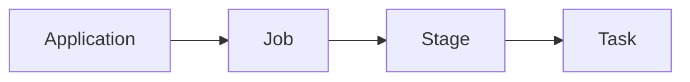

### DAG

DAG（Directed Acyclic Graph）有向无环图，记录了 RDD 之间转换的逻辑关系，原始的 RDD 通过一系列的转换就就形成了 DAG。<b>宽依赖是划分 Stage 的依据</b>

DAG 记录了 RDD 的转换过程和任务的阶段。

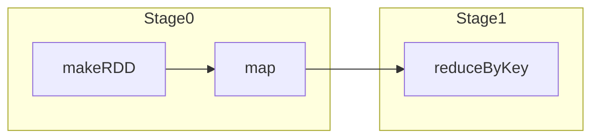

xxBy 的都会触发 shuffle 操作（宽依赖）

<b>为什么通过宽依赖来划分 Stage</b>

宽依赖的出现意味着某个阶段的计算无法完全独立于其他分区，必须等待其他分区的数据收集齐全后才能进行处理。因此，当 Spark 在执行过程中遇到一个宽依赖时，会将之前的计算步骤作为一个阶段（Stage）结束，并从当前遇到的宽依赖处开始划分新的阶段。这样的划分<span style="color:blue">确保了每个阶段内的任务都可以独立执行，从而提高了并行处理的效率。</span>

#### Job

一个 action 算子生成一个 Job

#### Stage 划分规则

- 从后向前推理，遇到宽依赖就断开，遇到窄依赖就把当前的 RDD 加入到Stage 中
- 每个 Stage 里面的 Task 的数量是由该 Stage 中最后一个 RDD 的 Partition 数量决定的
- 最后一个 Stage 里面的任务的类型是 ResultTask，前面所有其他 Stage 里面的任务类型都是 ShuffleMapTask
- 代表当前 Stage 的算子一定是该 Stage 的最后一 个计算步骤

由于 spark 中 stage 的划分是根据 shuffle 来划分的，而宽依赖必然有 shuffle 过程，因此可以说 spark 是根据宽窄依赖来划分 stage 的。

不管最后是否触发 shuffle，最后都会保存一个结束的 stage。

#### task 划分规则

- **读取输入：**Spark 从 HDFS 或其他存储系统中读取输入数据，这些数据通常以文件的形式存在,每个文件被划分为多个 Block

- **解析输入：**Spark 使用特定的 InputFormat 来解析输入数据， 将多个 Block 合并成一个或多个 InputSplit（InputSplit 不能跨越文件）每个 InputSplit 会对应一个独立（逻辑的独立）的计算单元。

- **生成任务：**为 InputSplit 生成具体的 Task。InputSplit 与 Task 是一一对应的关系。

- **执行任务：**这些具体的 Task 每个都会被分配到集群上的某个节点的某个 Executor 去执行。

<div align="center">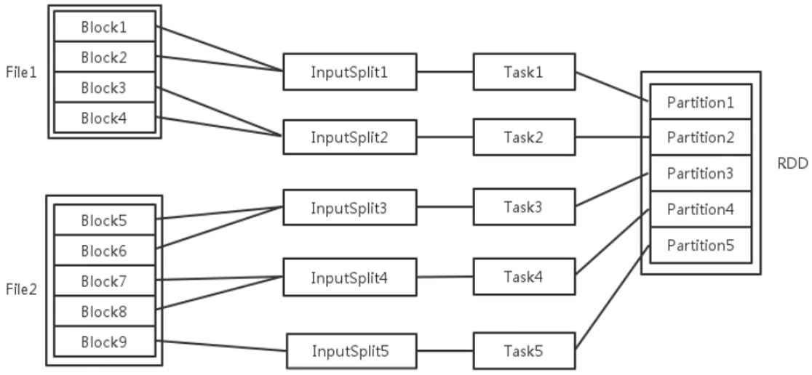</div>

- 每个节点可以起一个或多个 Executor。
- 每个 Executor 由若干 core 组成，每个 Executor 的每个 core 一次只能执行一个 Task。
- 每个 Task 执行的结果就是生成了目标 RDD 的一个 partiton。

<b>简单说，RDD 在计算的时候，每个分区都会起一个 task，所以 rdd 的分区数目决定了总的 task 数目。</b>

### WebUI-展示

用 Spark 的 WebUI 展示前面讲的内容，直接在 spark-shell 里测试代码

```scala
// sc 是 spark-shell 里 sparkcontext 的变量名
sc.makeRDD((1 to 100).toSeq)
.map(_*2)
.map(_+1)
.map((_,1))
.reduceByKey(_+_)
.collect
```

这份代码我们没有指定分区数，那么默认就按最大 core 来指定分区（4 核的就指定 4 个分区）DAG 可视化结果如下

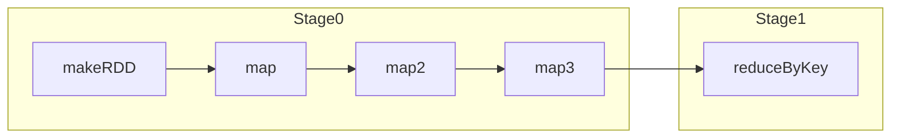

| Stage Id ▾ | Description                                                  | Submitted           | Duration | Tasks: Succeeded/Total | Input | Output | Shuffle Read | Shuffle Write |
| ---------- | ------------------------------------------------------------ | ------------------- | -------- | ---------------------- | ----- | ------ | ------------ | ------------- |
| 1          | [collect at :1](http://172.25.38.148:4040/stages/stage/?id=1&attempt=0)+details | 2024/04/10 17:36:21 | 0.1 s    | 4/4                    |       |        | 765.0 B      |               |
| 0          | [map at :1](http://172.25.38.148:4040/stages/stage/?id=0&attempt=0)+details | 2024/04/10 17:36:20 | 0.6 s    | 4/4                    |       |        |              | 765.0 B       |

我们也可以指定分区数，指定只是用两个分区

```scala
// sc 是 spark-shell 里 sparkcontext 的变量名
sc.makeRDD((1 to 100).toSeq, 2)
.map(_*2)
.map(_+1)
.map((_,1))
.reduceByKey(_+_)
.collect
```

| Stage Id ▾ | Description                                                  | Submitted           | Duration | Tasks: Succeeded/Total | Input | Output | Shuffle Read | Shuffle Write |
| ---------- | ------------------------------------------------------------ | ------------------- | -------- | ---------------------- | ----- | ------ | ------------ | ------------- |
| 3          | [collect at :1](http://172.25.38.148:4040/stages/stage/?id=3&attempt=0)+details | 2024/04/10 17:40:21 | 66 ms    | 2/2                    |       |        | 495.0 B      |               |
| 2          | [map at :1](http://172.25.38.148:4040/stages/stage/?id=2&attempt=0)+details | 2024/04/10 17:40:20 | 55 ms    | 2/2                    |       |        |              | 495.0 B       |


# Core-高级

- 自定义分区
- 累加器的使用
- 广播变量的使用
- Spark-JDBC
- Spark 整合 HBase
- Shuffle 原理
- 源码解析

## 自定义分区与排序

### 自定义排序

spark 中对简单的数据类型可以直接排序，但是对于一些复杂的条件以利用自定义排序来实现。这个比较简单，直接过了

### 自定义分区

如果 RDD 数据分区的时候不均匀，这时候可以自定义分区域，让数据较均匀的分配。

一个数据分区不均匀（数据倾斜）的例子

```scala
package org.spark.paritition

import org.apache.spark.HashPartitioner
import org.spark.{LoggerTrait, SparkUtil}

object DefinePartition extends LoggerTrait {
    def main(args: Array[String]): Unit = {
        val sc = SparkUtil.getSparkContext("DefinePartition")
        val data = sc.makeRDD(List(
            ('a', 1), ('a', 1), ('a', 1), ('a', 1), ('a', 1), ('a', 1), ('a', 1), ('a', 1), ('a', 1),
            ('b', 1), ('b', 1), ('b', 1), ('b', 1),
            ('c', 1), ('c', 1), ('c', 1),
            ('d', 1)
        ))

        data.partitionBy(new HashPartitioner(4)).mapPartitionsWithIndex((a, iter) => {
            println(a)
            iter.map(s => (s._1, 2))
        }).foreach(println);
        SparkUtil.closeContext()
    }
}
```

我们可以通过自定义分区方式来让数据均匀分配，如采用轮询的分区策略。

```scala
package org.spark.paritition

import org.apache.spark.{HashPartitioner, Partitioner}
import org.spark.{LoggerTrait, SparkUtil}

object DefinePartition extends LoggerTrait {
    def main(args: Array[String]): Unit = {
        val sc = SparkUtil.getSparkContext("DefinePartition")
        val data = sc.makeRDD(List(
            ('a', 1), ('a', 1), ('a', 1), ('a', 1), ('a', 1), ('a', 1), ('a', 1), ('a', 1), ('a', 1),
            ('b', 1), ('b', 1), ('b', 1), ('b', 1),
            ('c', 1), ('c', 1), ('c', 1),
            ('d', 1)
        ), 4)

        data.partitionBy(new LoopPartitions(4)).mapPartitionsWithIndex((a, iter) => {
            println(a)
            iter.map(e => (e._1, 2))
        }).foreach(println)
        SparkUtil.closeContext()

    }

}

class LoopPartitions(val numPartitions: Int) extends Partitioner {
    var cur = -1

    override def getPartition(key: Any): Int = {
        cur = cur + 1
        cur % 4
    }
}
```


## Spark-JDBC

纯粹的 API 调用。

1️⃣导入 MySQL 依赖

```xml
<dependency>
    <groupId>mysql</groupId>
    <artifactId>mysql-connector-java</artifactId>
    <version>8.0.30</version>
</dependency>
```

2️⃣连接驱动，执行数据库操作

### 读取 MySQL 数据

使用 JdbcRDD 读取 MySQL 数据

- JdbcRDD 的 sql 语句需要这种类型的：sql – the text of the query. The query must contain two `?`
- lowerBound 的值对应第一个 ？
- upperBound 的值对应第二个 ？

```scala
package org.spark.mysql

import org.apache.spark.rdd.JdbcRDD
import org.spark.{LoggerTrait, SparkUtil}

import java.sql.DriverManager

object ConnectionMySQL extends LoggerTrait {
    def main(args: Array[String]): Unit = {
        val sc = SparkUtil.getSparkContext("FlatMapOP")
        val jdbcRdd = new JdbcRDD[(Int, String, String, String, String)](
            sc,
            () => DriverManager.getConnection("jdbc:mysql://localhost:3306/atm", "root", "root"),
            "select * from userinfo where customer_id between ? and ?",
            0,
            20,
            2,
            result => {
                val id = result.getInt(1)
                val name = result.getString(2)
                val pid = result.getString(3)
                val telephone = result.getString(4)
                val address = result.getString(5)
                (id, name, pid, telephone, address)
            }
        )
        jdbcRdd.foreach(e => println(e))
        SparkUtil.closeContext()
    }
}
```

### 写入数据到 MySQL

1️⃣创建一个 RDD

2️⃣使用 foreach 这类函数将数据写入到 MySQL

- 获取数据库连接
- 获得预编译对象
- 设置参数
- 执行 sql

```scala
package org.spark.mysql

import org.apache.spark.rdd.JdbcRDD
import org.spark.{LoggerTrait, SparkUtil}

import java.sql.DriverManager

object WriteMySQL extends LoggerTrait {
    def main(args: Array[String]): Unit = {
        val sc = SparkUtil.getSparkContext("WriteMySQL ")
        val data = sc.makeRDD(
            List((3, "jerry", "239483277133409903", "14334450987", "深圳"),
                (4, "tom", "333383277133409903", "14334450412", "深圳")))
        data.foreach(ele => {
            val conn = DriverManager.getConnection("jdbc:mysql://localhost:3306/atm", "root", "root")
            val pst = conn.prepareStatement("insert into userinfo values(?,?,?,?,?)")
            pst.setInt(1, ele._1)
            pst.setString(2, ele._2)
            pst.setString(3, ele._3)
            pst.setString(4, ele._4)
            pst.setString(5, ele._5)
            pst.executeUpdate()
        })
        SparkUtil.closeContext()
    }
}
```

上面的代码是每一条 sql 就创建一个 conn 进行写入操作，过于消耗资源，我们可以对数据分区遍历，每个分区使用同一个 conn。『foreachPartition』

- 传入的参数是形参为 iter 的 function

```scala
package org.spark.mysql

import org.apache.spark.rdd.JdbcRDD
import org.spark.{LoggerTrait, SparkUtil}

import java.sql.DriverManager

object WriteMySQL extends LoggerTrait {
    def main(args: Array[String]): Unit = {
        val sc = SparkUtil.getSparkContext("WriteMySQL ")
        val data = sc.makeRDD(
            List((10, "JJ", "239442312312319903", "14334450987", "深圳"),
                (11, "KK", "3334532345632e2903", "14334320412", "深圳"),
                (5, "jack", "33338qwe3413409903", "14334450412", "深圳"),
                (6, "some", "333334678643409903", "14334450412", "深圳"),
                (7, "cake", "333578907133409903", "14356450412", "深圳"),
                (8, "boob", "333116887133409903", "14377750412", "深圳"),
                (9, "take", "333383277131234903", "14338888412", "深圳"),
            ))

        data.foreachPartition(e => {
            val conn = DriverManager.getConnection("jdbc:mysql://localhost:3306/atm", "root", "root")
            val pst = conn.prepareStatement("insert into userinfo values(?,?,?,?,?)")
            e.foreach(
                ele => {
                    pst.setInt(1, ele._1)
                    pst.setString(2, ele._2)
                    pst.setString(3, ele._3)
                    pst.setString(4, ele._4)
                    pst.setString(5, ele._5)
                    pst.executeUpdate()
                }
            )
        })
        SparkUtil.closeContext()
    }
}
```

## Shuffle 原理

### 什么是 shuffle

shuffle 是分布式计算不可或缺的一个部分，同时是分布式计算性能消耗最大的一个部分，原因就在于发送的数据的网络传输。

shuffle 是一个过程，如果我们把分布式计算理解为总-分-总

- 第一个总是统一加载外部数据，做统一作业的拆分
- 分，便是处理每一个独立的 task 任务；
- 第二个总，便是各个独立的 task 任务运行完毕之后进行的汇总

汇总的数据便是各个独立 task 任务计算之后的数据，显然是在不同的节点之上往某几个节点汇总（<span style="color:blue">通过网络传输数据进行汇总</span>），汇总的这个过程便是 shuffle。其中 shuffle 有分为 了 shuffle write 的过程和 shuffle-read 的过程。 汇总的过程涉及到数据的重新分布，所以 shuffle 顾名思义就是一个数据打乱重排的过程。

### ShuffleManager 的实现

spark 最早的 shuffle 处理方式，就是 HashShuffleManager，在 0.8 的版本中出现了优化之后的 HashShuffleManager，同时在 spark1 .2 的版本出现的 SortShuffleManager 成为了默认的 shuffle 处理方式，目前的版本就只有一个 SortShuffleManager。 

SortShuffleManager 分为普通机制和排序机制

- 普通机制：排序方式
- 排序机制：Bypass 不排序（就是原先的 HashShuffleManager）

<b>排序机制的原理『补』</b>

<b>排序机制调参『补』</b>

<b>Task 提交源码解析『补』</b>

如何制定 shuffle 处理方式呢，spark 中有一 个参数

`spark.shuffle.manager=hash| sort`(默认)。

# Spark-SQL

SparkSQL 是一个用于结构化数据处理的 Spark 组件。所谓结构化数据，是指具有 Schema 信息的数据，例如 JSON、Parquet、Avro、CSV 格式的数据。

SparkCore 可以处理结构化和非结构化数据，而 SparkSQL 只能处理结构化数据。

- SparkSQL 介绍
- SparkSQL 的编程模型（DataFrame 和 DataSet）
- SparkSQL 读写数据
- SparkSQL 运行流程
- SparkSQL 和 Hive 整合

## SparkSQL介绍

大数据开发中，主要就是用 SparkSQL 处理业务，SparkSQL 处理不了的才用 SparkCore。

<b>SparkSQL 是非常成熟的海量结构化数据处理框架</b>

- SparkSQL 本身十分优秀，支持 SQL 语言\性能强\可以自动优化\API 简单\兼容 HIVE 等等
- 企业大面积在使用 SparkSQL 处理业务数据
  - 离线开发
  - 数仓搭建
  - 科学计算
  - 数据分析

<b>SparkSQL 的特点</b>

- 融合性：SQL 可以无缝集成在代码中，随时用 SQL 处理数据

  spark.sql("select * from people")

- 统一数据访问：一套标准 API 可读写不同数据源

- Hive 兼容：可以使用 SparkSQL 直接计算并生成 Hive 数据表

- 标准化连接：支持标准化 JDBC\ODBC 连接，方便和各种数据库进行数据交互

<b>SparkSQL</b>

前身是 Shark，默认的 Hive，但是很多地方和 SparkCore 不适应，最终被放弃。

- 2014 年 1.0 正式发布
  2015 年 1.3 发布 DataFrame 数据结构，沿用至今
- 2016 年 1.6 发布 Dataset 数据结构(带泛型的 DataFrame)，适用于支持泛型的语言(Java\Scala)
- 2016 年 2.0 统一了 Dataset 和 DataFrame，以后只有 Dataset 了, Python 用的 DataFrame 就是没有泛型的 Dataset
- 2019 年 3.0 发布，性能大幅度提升, SparkSQL 变化不大

<b>总结</b>

- SparkSQL 用于处理大规模结构化数据的计算引擎
- SparkSQL 在企业中广泛使用，并性能极好，学习它不管是工作还是就业都有很大帮助
- SparkSQL:使用简单、API 统一、兼容 HIVE、支持标准化 JDBC 和 ODBC 连接
- SparkSQL 2014 年正式发布，当下使用最多的 2.0 版。Spark 发布于 2016 年，当下使用的最新 3.0 办发布于 2019 年

### SparkSQL VS Hive

| SparkSQL             | Hive                 |
| -------------------- | -------------------- |
| 内存计算             | 磁盘迭代             |
| SQL/代码混合执行     | 仅能以 SQL 开发      |
| 无原数据管理         | metas otre           |
| 底层运行 Spark RDD   | 底层运行 MapReduce   |
| 都可以运行在 Yarn 上 | 都可以运行在 Yarn 上 |

### SparkSQL编程模型

Spark 的编程模型主要有：SQL、DataFrame/Dataset

- <b>SQL：</b>使用 SQL 语句来操作数据。由于 SQL 操作的是表，因此我们需要将 SparkSQL 对应的编程模型转换成一张表才能进行 SQL 查询。
- <b>DataFrame：</b>DataFrame 是 SparkSQL 提供的一个编程抽象，与 RDD 类似，也是一个分布式的数据集合。DataFrame 在 RDD 的基础上加了 Schema (描述数据的信息，可以认为是元数据，DataFrame 曾经就有个名字叫 SchemaRDD)
- <b>Dataset：</b>Dataset 在 DataFrame 的基础上添加了泛型支持，以便提前发现错误

Spark 优化器会对 DataFrame 和 Dataset 进行优化，即便程序或 SQL 不高效，也可以运行的很快。

在 Spark 中，一个 DataFrame 代表的是一个元素类型为 Row 的 Dataset，即 DataFrame 只是 Dataset[Row] 的一个类型别名


### SparkSession对象

在 RDD 阶段，程序的执行入口对象是: SparkContext

在 Spark 2.0 后，推出了 SparkSession 对象，作为 Spark 编码的统一入口对象。

SparkSession 对象可以

- 用于 SparkSQL 编程
- 用于 SparkCore 编程（可以通过 SparkSession 对象中获取到 SparkContext）

后续的代码，执行环境入口对象，统一变更为 SparkSession 对象

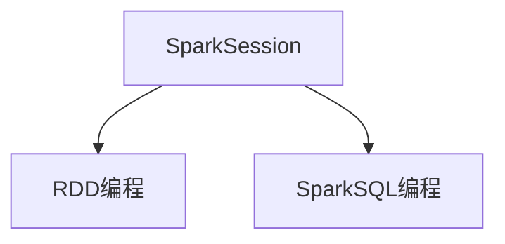

### HelloWorld

<b>导入依赖</b>

环境准备，导入下列依赖（在原有的基础上导入 spark-sql 依赖），core 和 sql 的版本要一致~

```xml
<dependency>
    <groupId>org.apache.spark</groupId>
    <artifactId>spark-sql_2.13</artifactId>
    <version>3.2.4</version>
</dependency>
```

<b>构建 SparkSession</b>

```scala
val spark = SparkSession.builder()
	.appName("SparkSQLOps")
	.master("local[*]")
//.enableHiveSupport()//支持hive的相关操作
	.getOrCreate()
```

<b>使用 SparkSQL 读取数据</b>

```scala
package org.spark_sql

import org.apache.spark.sql.{DataFrame, Dataset, SparkSession}

object QuickStart extends LoggerTrait {


    def main(args: Array[String]): Unit = {
        val ss = SparkSession.builder()
            .appName("QuickStart")
            .master("local")
            .getOrCreate()
        val path = "Advert.txt"
        val data1: Dataset[String] = ss.read.textFile(path)
        val data2: DataFrame = ss.read.text(path)

        data1.show()
        data2.show()
    }

}
```

## DF&DS介绍

### DataFrame

<b>假设 RDD 中的数据是这样的</b>

| 1    | 张三 | 20   |
| ---- | ---- | ---- |
| 2    | 李四 | 21   |

<b>那么 DataFrame 中的数据就是这样的</b>
|ID:Int|Name:String|Age:Int|
| ---- | ---- | ---- |
| 1    | 张三 | 20   |
| 2    | 李四 | 21   |

DataFrame 比 RDD 多了描述数据的信息（Schema）；DataFrame 还配套了新的操作数据的方法，做了更高层次的抽象，处理数据更加简单，甚至可以用 SQL 处理数据。

### Dataset

相对于 RDD，Dataset 提供了强类型支持，也是在 RDD 的每行数据加了类型约束

<b>假设 RDD 中的数据是这样的</b>

| 1    | 张三 | 20   |
| ---- | ---- | ---- |
| 2    | 李四 | 21   |

<b>那么 DataFrame 中的数据就是这样的</b>

| ID:Int | Name:String | Age:Int |
| ------ | ----------- | ------- |
| 1      | 张三        | 20      |
| 2      | 李四        | 21      |

在 DataSet 中数据是这样的，会将数据封装到一个样例类（case class）中，这也意味着会有类型提示~可以借助 IDE 帮我们快速判断代码是否有编译时错误。

| Person(id:Int, Name:String, Age:Int) |
| :----------------------------------: |
|         Person(1, 张三, 20)          |
|         Person(2, 李四, 21)          |

<b>总结：</b>相比 DataFrame，Dataset 提供了编译时类型检查，对于分布式程序来讲，提交一次作业太费劲了（要编译、打包、上传、 运行），到提交到集群运行时才发现错误，很折腾人，这也是引入 Dataset 的一个重要原因。

eg：使用 DataFrame 的代码读取 json 文件，但是 json 文件中并没有 score 字段，编译能通过，但是运行时会报异常！使用 Dataset 实现，在 IDE 里就会报错！

DataFrame 编译通过

```scala
va1 df1 = spark.read.json("/tmp/people.json")
//json文件中没有score字段,但是能编译通过
va1 df2 = df1.filter("score > 60")
df2.show()
```

Dataset IDE 中报错

```scala
va1 ds1 = spark.read.json("/tmp/people.json").as[Peop1e]
//使用dataset这样写， 在IDE中就能发现错误
va1 ds2 = ds1.filter(_.scoreT< 60)
va1 ds3 = ds1.filter(_.age < 18)
//打印
ds3.show()
```

<b>Spark 社区推荐用 DS~</b>

可以认为 Dataset = DataFrame + RDD

### RDD/DF/DS

我们来了解下 RDD / DF / DS 三者的关系。看下它们推出的顺序。

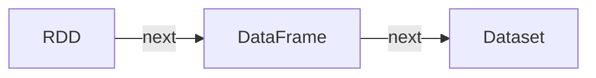

最先推出的 RDD 然后是 DataFrame 最后是 Dataset；Dataset 解决了 DataFrame 缺乏编译时错误提示的问题。

RDD 需要使用原始的 Core 算子来进行数据的筛选，统计

DataFrame 可以使用 SQL 进行数据的筛选，统计

Dataset 既可以使用 SQL 进行数据的筛选，也可以使用算子的方式。⭐⭐⭐

我们查看下源码，来看下 RDD / DF / DS 之间的关系。

```scala
type DataFrame = Dataset[Row] // Spark 2.x 版本的 DataFrame 用 Dataset 重写了，可以将 DataFrame 看成是 Row 类型的 Dataset
```

## SQL/DSL风格

DataFrame 和 Dataset 都支持 DSL 风格和 SQL 风格

### DSL风格

<b>DSL 风格：领域特定语言</b>

其实就是指 DataFrame/Dataset 的特有 API

DSL 风格意思就是以调用 API 的方式来处理 Data

比如：df.where().limit()

常用 DSL 风格的 API

| API                                              | 说明                                                     |
| ------------------------------------------------ | -------------------------------------------------------- |
| select("name")<br>select(\$"name", \$"age"+1)    | 查询 name 列<br>查询 name 列和 age 列，其中 age 列的值+1 |
| filter(\$"age">21)<br>where 的作用和 filter 类似 | 查询 age>21 的数据                                       |
| groupBy("age").count()                           | 按 age 分组，并求每一组的数量                            |
| limit(5)                                         | 仅查询 5 条数据                                          |
|                                                  |                                                          |

### <b>SQL风格</b>

SQL 风格就是使用 SQL 语句处理 DataFrame 的数据

比如：spark.sql(“SELECT * FROM xxx)

## 准备数据

DataFrame 和 Dataset 用到的数据如下

txt 数据

```txt
1,zhangsan,20
2,lisi,22
3,wangwu,18
4,jerry,8
```

json 数据，虽然不符合 json 数据的格式，但是就是得这样写

```json
{"name": "tom1",  "age": 10}
{"name": "tom2",  "age": 30}
{"name": "tom3",  "age": 40}
{"name": "jerry",  "age": 8}
{"name": "jack",  "age": 23}
{"name": "nick",  "age": 18}
```

csv 数据

```csv
tom,65,背景
jerry,40,背景
nick,11,背景
jack,23,背景
bob,20,背景
lucy,10,背景
```

## DataFrame

DataFrame 是一个二维表结构，有行、列和表结构描述。

在结构上

- StrucType 对象描述整个 DataFrame 的表结构
- StrucField 对象描述一个列的信息

在数据上

- Row 对象记录一行数据
- Column 对象记录一列数据并包含列的信息

### 加载数据创建DF

我们可以使用 SparkSQL 的统一 API 进行数据读取构建 DataFrame。

```scala
sparkSession.read.xxx(path) // 返回 DataFrameReader 对象
sparkSession.readStream.xxx(path) // 返回 DataStreamFrameReader 对象
sparkSession.read.format("json") 等价于 sparkSession.read.json(xx)
```

| API                            | 说明                                                         |
| ------------------------------ | ------------------------------------------------------------ |
| read.parquet(path)             | 读取 parquet 类型的数据                                      |
| read.schema(schema).json(path) | 读取 json 类型的数据                                         |
| read.schema(schema).csv(path)  | 读取 csv 类型的数据                                          |
| read.text(path)                | 读取 txt 类型的数据<br>不支持 schema，默认是一行为一个元素<br>Text data source only produces a single data column named "value" |

读取 txt 中的数据转为 DataFrame

```scala
import org.apache.spark.sql.{DataFrame, SparkSession}
import org.spark_sql.LoggerTrait

// 通过读取外部文件创建 DF
object CreateDFByFile extends LoggerTrait {
    val session: SparkSession = SparkSession.builder()
        .appName("CreateDFByFile")
        .master("local")
        .getOrCreate()
    var data: DataFrame = _
    private val curPath = CreateDFByFile.getClass.getResource(".").toURI.getPath

    def readFromTxt(): Unit = {
        val data: DataFrame = session.read.text(curPath + "test.txt")
        // Text data source only produces a single data column named "value"
        data.show()
    }

    def main(args: Array[String]): Unit = {
        readFromTxt()
    }
}
```

读取 csv 文件创建 DF

```scala
def readFromCSV(): Unit = {
    val mySchema = "name string, age int, bg string"
    val data: DataFrame = session.read.schema(mySchema).csv(curPath + "test.csv")
    data.createTempView("person")
    session.sql("select * from person").show(2)
}
/*
+-----+---+----+
| name|age|  bg|
+-----+---+----+
|  tom| 65|背景|
|jerry| 40|背景|
+-----+---+----+
*/
```

读取 json 文件创建 DF。需要注意的是，Spark 是通过 {} 来检测是否是一条完整的数据，{} 为一条，{}{} 为两条，其实并不是正确的 json 格式数据。

json 由于是 key:value 形式的，因此我们可以不指定 schema

```scala
def readFromJson(): Unit = {
    val data: DataFrame = session.read.json(curPath+"test.json")
    data.show()
}
```

读取 parquet 类型的数据。Apache Parquet是一种<b>列式存储格式</b>，广泛应用于大数据处理领域。parquet 的特点有：高效压缩、支持嵌套数据结构、自动保存 schema 信息、兼容性和可拓展性强。这里，我们使用 spark example 中自带的 parquet 数据。

```scala
def readFromParquet(): Unit = {
    val data: DataFrame = session.read.parquet(curPath + "users.parquet")
    data.show()
}
/*
+------+--------------+----------------+
|  name|favorite_color|favorite_numbers|
+------+--------------+----------------+
|Alyssa|          null|  [3, 9, 15, 20]|
|   Ben|           red|              []|
+------+--------------+----------------+
*/
```

### 其他方式创建DF

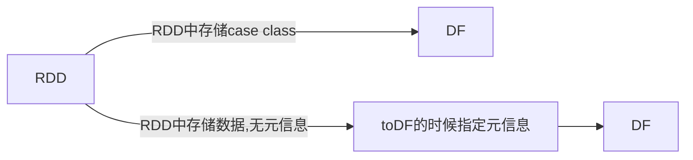

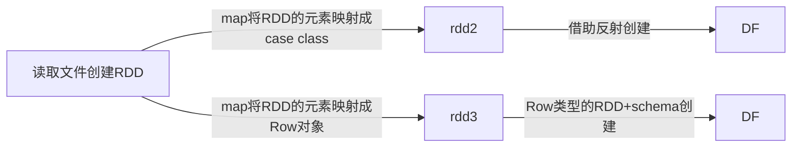

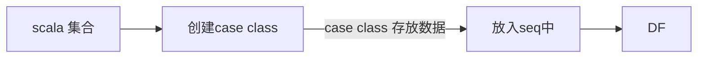

| 方式                 | 说明                                                         |
| -------------------- | ------------------------------------------------------------ |
| 将 RDD 转为 DF       | sparkSession.createDataFrame(rdd)<br>RDD.toDF                |
| Seq + case class     | sparkSession.createDataFrame(seq)                            |
| DS 转 DF             | DS.toDF                                                      |
| 读取 txt 文件转为 DF | 方式1️⃣获取数据，切分后将没行数据封装到 case class 中<br/>方式2️⃣获取数据，切分后将每行数据封装到 Row 中，然后使用 Row+schema 创建 DF |

> <b>创建 RDD，将 RDD 转为 DF</b>

- 创建一个 RDD，RDD 中的元素是 case class
- 使用 createDataset 将 RDD 转 DF
- 或者借助 scala 的隐式转换，直接将 RDD 转成 Df（rdd.toDF）

```scala
object CreateDF extends LoggerTrait {
    val session: SparkSession = SparkSession.builder()
        .appName("CreateDF")
        .master("local[*]")
        .getOrCreate()

    // 根据 RDD 创建一个 DF
    def RDDtoDF(): Unit = {
        val rdd: RDD[DF] = session
            .sparkContext
            .makeRDD(Seq(DF("jerry", 19), DF("tom", 25)))

        val df: DataFrame = session.createDataFrame(rdd)
        df.show()
    }
    
    // 隐式转换，直接转 DF
    def RDDToDF2(): Unit = {
        val rdd: RDD[DF] = session
        .sparkContext
        .makeRDD(Seq(DF("jerry", 19), DF("tom", 25)))
        import session.implicits._
        val df: DataFrame = rdd.toDF
        df.printSchema()
        df.show()
    }
    
    def main(args: Array[String]): Unit = {
        RDDtoDF()
    }
}
/*
输出约束信息，有自动类型推断，age 推断为 int 类型。

root
 |-- name: string (nullable = true)
 |-- age: integer (nullable = false)
 |-- bg: string (nullable = true)
 
+-----+---+
| name|age|
+-----+---+
|jerry| 19|
|  tom| 25|
+-----+---+
*/
```

session 是我们创建的 SparkSession 对象，隐式转换的工具在它的 implicitis 里。

> <b>如果 RDD 中没有元信息，可以在 toDF 的时候指定元信息</b>

```scala
def RDD2DF3(): Unit = {
    val textRdd: RDD[String] = session.sparkContext.textFile(path)
    val data: RDD[(String, Int, String)] = textRdd
    		.map(_.split(" "))
    		.map(x => (x(0), x(1).toInt, x(2)))
    import session.implicits._
    val df: DataFrame = data.toDF("name", "age", "bg")
    df.show()
}
```

> <b>创建 List，List 中存 case class，然后转 DF</b>

- 创建 Sequence
- 向 Sequence 中添加 case class

```scala
def ListToDF(): Unit = {
    val list = Seq(DF("jerry", 19), DF("tom", 25))
    val df: DataFrame = session.createDataFrame(list)
    df.show()
}
```

> <b>读取文件创建 RDD，借助『RDD + case class + 反射』将 RDD 转为 DataFrame。</b>

- 创建样例类 (要为样例类设置 setter/getter 方法才行)
- 读取文件，将文件转为样例类 RDD 集合对象
- 将 RDD 转为 DF

```scala
case class TestTxt() {
    @BeanProperty var seq: Int = _
    @BeanProperty var name: String = _
    @BeanProperty var age: Int = _

    def this(seq: Int, name: String, age: Int) = {
        this
        this.seq = seq
        this.name = name
        this.age = age
    }
}

// 读取 txt 文件，经过后处理后转 DF
def readFileToDF(): Unit = {
    val data: RDD[String] = session
        .sparkContext
        .textFile(path + "test.txt")
    
    val dealData: RDD[TestTxt] = data.map(e => {
        val line = e.split(",")
        new TestTxt(line(0).toInt, line(1), line(2).toInt)
    })

    val df1: DataFrame = session.createDataFrame(dealData, classOf[TestTxt])
    df1.show()
}
```

> <b>读取文件创建 RDD，采用的 RDD[Row] + schema 的形式</b>

- 从 txt 文本读取数据，将每一行数据处理为 Row 
- 通过 StructType 和 StructField 创建 scheme 对象，scheme 的创建方式有多种。
- 使用处理好的 Row 组成的 RDD 对象和 scheme 对象创建 DataFrame 对象

```scala
def readFileToDFByRowSchema(): Unit = {
    val data: RDD[String] = session
        .sparkContext
        .textFile(path + "test.txt")

    val rdd = data.map(_.split(","))
    	.map(x => Row(x(0).toInt, x(1), x(2).toInt))
    val scheme = StructType(
        StructField("seq", IntegerType, nullable = true) ::
        StructField("name", StringType, nullable = true) ::
        StructField("age", IntegerType, nullable = true) :: Nil
    )
    val df = session.createDataFrame(rdd, scheme)
    df.show()
    session.stop()
}

// 创建 schema 的方式有很多，喜欢那种用那种
val scheme1 = StructType(
    StructField("name", StringType, nullable = false) ::
    StructField("age", IntegerType, nullable = false) ::
    StructField("bg", StringType, nullable = false) :: Nil
)

val scheme2 = (new StructType)
    .add(StructField("name", StringType, nullable = false))
    .add(StructField("age", IntegerType, nullable = false))
    .add(StructField("bg", StringType, nullable = false))

val scheme3 = StructType(Nil)
    .add(StructField("name", StringType, nullable = false))
    .add(StructField("age", IntegerType, nullable = false))
    .add(StructField("bg", StringType, nullable = false))
```

### 使用SQL完成计算

在使用 SQL 风格前，需要将 DF 注册成表。这样就可以将 DF 看成一个关系型数据表，然后可以通过 sparkSession.sql 来执行 SQL 语句查询，结果返回一个 DF。

| API                           | 说明                     |
| ----------------------------- | ------------------------ |
| createTempView                | 创建一个临时表           |
| createOrReplaceTempView       | 创建或替换一个临时表     |
| createGlobalTempView          | 创建一个全局临时表       |
| createOrReplaceGlobalTempView | 创建或替换一个全局临时表 |

全局表可以跨 SparkSession 对象使用，查询前需要给表假设前缀`global_temp.表名`

临时表只有在当前 SparkSession 中可用

```scala
def SQL(): Unit = {
    val csvPath = "test.csv"
    val csv: DataFrame = session.read.schema("name STRING, age INT, bg STRING").csv(csvPath)
    csv.createTempView("csv")
    csv.createGlobalTempView("csv")
    session.sql("select * from global_temp.csv").show()
    session.sql("select * from csv").show()
}
```

如果 SQL 比较长，上面的写法阅读起来不方便，可以使用 scala 的`""" """`语法

```scala
session.sql(
    """
      |select
      |name,
      |age
      |from
      |person
      |""".stripMargin).show()
```

SparkSQL 内置了大量的函数，位于 org.apache.spark.sql.functions 中。

这些函数主要分为 10 类：UDF 函数、聚合函数、字符串函数、日期函数、排序函数、非聚合函数、数学函数、混在函数、窗口函数、字符串函数、集合函数。大部分函数与 Hive 中的相同。

<b>使用部分内置函数</b>

```scala
```


### 使用DSL完成计算

<b>这里重点学习 DSL 风格</b>

| 方法         | 说明                                                         |
| ------------ | ------------------------------------------------------------ |
| show         | 展示 DF 中的数据, 默认展示 20 条                             |
| printSchema  | 打印输出 df 的 schema 信息                                   |
| select       | 选择 DF 中指定的列                                           |
| filter/where | 过滤 DF 内的数据，返回一个过滤后的 DF                        |
| groupBy      | 按照指定的列进行数据的分组， 返回值是 RelationalGroupedDataset 对象 |

<b>假设，我们从 csv 中得到了 DF 对象，现在要对 age 进行+1，该怎么做？</b>

```scala
// 我们使用 sql 来写是这样的
def readFromCSVAgePlus(): Unit = {
    val mySchema = "name string, age int, bg string"
    val data: DataFrame = session.read.schema(mySchema).csv(curPath + "test.csv")
    data.createTempView("person")
    session.sql("select name,age,bg from person").show(2)
    session.sql("select name,age+1 as plus_age,bg from person").show(2)
}
```

使用 DSL 呢？

```scala
// 这样是错误的
data.select("name", "age+1").show()
data.select("name", "age" + 1).show()
```

```scala
// 正确的写法
def readFromCSVAgePlus(): Unit = {
    val mySchema = "name string, age int, bg string"
    val data: DataFrame = session.read.schema(mySchema).csv(curPath + "test.csv")
	// 需要使用隐式转换
    import session.implicits._
    data.select($"name", $"age" + 1).show()
}
```

<b>使用 gropuBy 按年龄分组</b>

<b>使用 filter/where 过滤年龄小于 20 的用户</b>

这种方式写起来不是很方便，选择你觉得方便的方式来做。

## Dataset

### 加载数据创建DS

| API                              | 说明                                                         |
| -------------------------------- | ------------------------------------------------------------ |
| sparkSession.read.textFile(path) | 将读取的数据转为 Dataset<br>将文件中的每一行看作一个元素，并且所有元素组成了一列，列名默认为 value |

<b>读取 txt 数据转换成 Dataset</b>

- 使用 read.textFile 转成 Dataset[String]
- 定义 case 类，导入隐式转换库
- 调用 Dataset 的 map 算子将每个元素拆分并存入 case class 中

```scala
package org.it.df

import org.apache.spark.sql.{Dataset, SparkSession}
import org.spark_core.LoggerTrait

case class Person(val number: Int, val name: String, val age: Int)

object CreateDS extends LoggerTrait {
    val BASE = ""
    val txtPath = BASE + "org/it/df/test.txt"
    val csvPath = BASE + "org/it/df/test.csv"
    val jsonPath = BASE + "org/it/df/test.json"

    val ss: SparkSession = SparkSession.builder()
                                .appName("CreateDS")
                                .master("local[*]")
                                .getOrCreate()
	
    // 从 txt 中读取数据转为 Dataset
    def readFromTxt(): Unit = {
        val data: Dataset[String] = ss.read.textFile(txtPath)
        import ss.implicits._
        // map 做了个类型转换，从 String 类型转成了 Person 类型
        val data2: Dataset[Person] = data.map(e => {
            val eles = e.split(",")
            Person(eles(0).toInt, eles(1), eles(2).toInt)
        })
        data2.createTempView("txt")
        ss.sql("select * from txt where age>10").show()
        ss.close()
    }
}
```

### 其他方式创建DS

均使用了 scala 的隐式转换

| 方式                   | 说明                            |
| ---------------------- | ------------------------------- |
| 将 RDD 转为 DS         | sparkSession.createDataset(rdd) |
| 利用 scala 集合创建 DS | sparkSession.createDataset(seq) |
| 集合+样例类创建 DS     | List(case class).toDS           |
| DF 转 DS               | DF.toDS                         |

相关代码如下

```scala
import org.apache.spark.rdd.RDD
import org.apache.spark.sql.{DataFrame, Dataset, SparkSession}
import org.spark_sql.LoggerTrait

// 通过 RDD 创建 DS
object CreateDSByRDD extends LoggerTrait {
    val ss = SparkSession.builder()
        .appName("CreateDSByRDD")
        .master("local")
        .getOrCreate()

    // 通过已有 RDD 创建 DS
    def createByRDD(): Unit = {
        import ss.implicits._
        val rdd: RDD[Int] = ss.sparkContext.makeRDD(1 to 20)
        val ds: Dataset[Int] = ss.createDataset(rdd)
        ds.show()
    }

    // 利用 scala 集合创建 DS
    def createBySeq(): Unit = {
        import ss.implicits._
        val ds: Dataset[Int] = ss.createDataset(1 to 20)
        ds.show()
    }
    
    case class Demo(name: String, age: Int)

    // 通过样例类配合创建 DS
    def createByCase(): Unit = {
        import ss.implicits._
        val personList: List[Demo] = List(Demo("Jerry", 19))
        val ds: Dataset[Demo] = personList.toDS
        ds.show()
    }

    //dataframe 转 ds
    def createByDF(): Unit = {
        import ss.implicits._
        val path = "test.json"
        val df: DataFrame = ss.read.json(path)
        val ds: Dataset[Demo] = df.as[Demo]
        ds.show()
    }

    def main(args: Array[String]): Unit = {
        createByDF()
        println("=" * 20)
        createByRDD()
        println("=" * 20)
        createBySeq()
        println("=" * 20)
        createByCase()
    }
}
```

### 使用SQL完成计算

就和正常写 SQL 一样，简简单单。

```scala
package org.it.df

import org.apache.spark.sql.{DataFrame, Dataset, SparkSession}
import org.spark_sql.LoggerTrait

import java.nio.file.{Files, Paths}

// 在 DS 上进行 SQL 查询
object CreateDSBySQL extends LoggerTrait {
    val abs = CreateDSBySQL.getClass.getResource("test.json").toURI.getPath
    val ss: SparkSession = SparkSession.builder()
        .appName("CreateDSBySQL")
        .master("local")
        .getOrCreate()

    case class PersonSQL(name: String, age: Long)

    import ss.implicits._

    val ds: Dataset[PersonSQL] = ss.read.json(abs).as[PersonSQL]

    def queryAllOrderByAge(): Unit = {
        ds.createTempView("person")
        ss.sql("select * from person order by age").show()
    }

    def queryByCondition(): Unit = {
        ds.createTempView("person")
        ss.sql("select * from person where name not like '%t%' order by age").show()
    }

    def queryByCondition2(): Unit = {
        ds.createTempView("person")
        ss.sql("select * from person where name not like '%t%' and age>20").show()
    }

    def main(args: Array[String]): Unit = {
        queryByCondition2()
    }
}
```

### 使用DSL完成计算

DSL 即领域特定语言，就是 Dataset 上定义的一系列 API。我们可以使用 SQL 完成数据的过滤、筛选、聚合操作，也可以使用 DSL 完成上述操作。

Dataset 的 DSL 语法，网上的资料比较少。

```scala
val ds: Dataset[PersonSQL] = ss.read.json(abs).as[PersonSQL]
import ss.implicits._
ds.createTempView("person")
// 过滤年龄小于 20 的数据
ds.filter(_.age > 20).show()
```

如何过滤字段这个还不知道。

## RDD/DS/DF互相转换

```mermaid
graph LR
subgraph RDD2Other
R1[RDD]-->RDS[DS]
R1[RDD]-->|Seq+Row|RDF[DF]
R1[RDD]-->|Seq+case_class|RDF2[DF]
end

subgraph DF2Other
DFs[DF]--->|DF.rdd|元素为Row的RDD
DFs[DF]--->|DF的as方法|DS
end

subgraph DS2Other
DS[DS]-->|DS.rdd|元素为case类的RDD
DS[DS]-->|DS.toDF|DF
end
```

### DataSet->DataFrame/RDD

DataSet 转 DataFrame 和 RDD 非常简单。

- DataSet 转 DataFrame，导入 sparkSession 对象的 implicits 直接 toDF
- Dataset 转 RDD，直接 Dataset.rdd

```scala
import org.apache.spark.rdd.RDD
import org.apache.spark.sql.{Dataset, SparkSession}
import org.spark_sql.LoggerTrait


// DF 和 DS 的互相转换
object DS2DF extends LoggerTrait {
    val session = SparkSession.builder()
        .appName("DF2DS")
        .master("local")
        .getOrCreate()

    def createDS(): Dataset[Person] = {
        import session.implicits._
        val ds: Dataset[Person] = session.createDataset(Seq(
            Person("jerry", 19), Person("tom", 24),
            Person("cat", 12), Person("bob", 19),
        ))
        ds
    }

    // DS 转 DF
    def DS2DFOne(): Unit = {
        val ds: Dataset[Person] = createDS()
        val df = ds.toDF()
    }

    // DS 转 RDD
    def DS2RDD(): Unit = {
        val ds: Dataset[Person] = createDS()
        val rdd: RDD[Person] = ds.rdd
        rdd.foreach(println)
    }
}
```

### DataFrame->Dataset/RDD

DataFrame 转 Dataset 和 RDD 也非常简单

- DataFrame 转 Dataset，调用 DataFrame.as[case class] 即可
- DataFrame 转 RDd，直接 DataFrame.rdd 即可

```scala
package org.it.df2ds

import org.apache.spark.rdd.RDD
import org.apache.spark.sql.{DataFrame, Row, SparkSession}
import org.spark_sql.LoggerTrait

case class Person(name: String, age: Int)

// DF 和 DS 的互相转换
object DF2DS extends LoggerTrait {
    val session = SparkSession.builder()
        .appName("DF2DS")
        .master("local")
        .getOrCreate()

    def createDF(): DataFrame = {
        val rdd = session.sparkContext.makeRDD(Seq(
            Person("jerry", 19), Person("tom", 24),
            Person("cat", 12),	 Person("bob", 19),
        ))
        import session.implicits._
        rdd.toDF()
    }


    // DF 转 DS, as 方法
    private def DF2DS(): Unit = {
        val df = createDF()
        import session.implicits._
        val ds = df.as[Person]
    }

    // DF 转 RDD 然后遍历 RDD 中的元素
    def DF2RDD(): Unit = {
        val df = createDF()
        val rdd: RDD[Row] = df.rdd
        rdd.foreach(e => {
            println(s"${e(0)},${e(1)}")
        })
    }
}
```

### RDD->DF/DS

RDD->DF 稍微麻烦点

- RDD->DF，使用 Seq + case class，这种 RDD 可以直接 toDF 创建 DF
- RDD->DF，使用 Seq + Row + schema

```scala
package org.it.df2ds

import org.apache.spark.rdd.RDD
import org.apache.spark.sql.types.{IntegerType, StringType, StructField, StructType}
import org.apache.spark.sql.{DataFrame, Row, SparkSession}
import org.spark_sql.LoggerTrait

import scala.beans.BeanProperty

// 要给 case 类设置 get set 方法
case class Test(@BeanProperty name: String, @BeanProperty age: Int)

// RDD 转 DataFrame 和 Dataset
object RDD2Other extends LoggerTrait {
    val session: SparkSession = SparkSession.builder().appName("RDD2Other").master("local").getOrCreate()

    def createRDDByCaseClass(): RDD[Test] = {
        session.sparkContext.makeRDD(
            Seq(Test("jerry", 10), new Test("tom", 8)))
    }

    def createRDDRow(): RDD[Row] = {
        session.sparkContext.makeRDD(
            Seq(Row("jerry", 10), Row("tom", 8)))
    }

    def RDD2DataFrame(): Unit = {
        val rddCase: RDD[Test] = createRDDByCaseClass()
        // RDD + 对应的 beanClass（case class, case class 的字段要有 setter/getter 方法）
        val df1: DataFrame = session.createDataFrame(rddCase, classOf[Test])
        df1.show()
    }

    def RDD2DataFrame2(): Unit = {
        val seqRow: RDD[Row] = createRDDRow()
        // RDDRow + schema
        val schema = StructType(
            StructField("name", StringType, nullable = true) ::
                StructField("age", IntegerType, nullable = true) :: Nil
        )
        val df: DataFrame = session.createDataFrame(seqRow, schema)
        df.show()
    }


    def main(args: Array[String]): Unit = {
        RDD2DataFrame2()
    }
}
```

RDD->DS 稍微麻烦点

- RDD->DS，创建一个 Seq，Seq 里面存 case 类，将这个 Seq 转为 RDD
- RDD->DS，也可以直接利用上面的 Seq 创建 DS

```scala
package org.it.df2ds

import org.apache.spark.rdd.RDD
import org.apache.spark.sql.{Dataset, Row, SparkSession}
import org.spark_sql.LoggerTrait

// 要给 case 类设置 get set 方法
case class Test2(name: String, age: Int)

// RDD 转 DataFrame 和 Dataset
object RDD2DS extends LoggerTrait {
    val session: SparkSession = SparkSession.builder().appName("RDD2Other").master("local").getOrCreate()

    def createRDDByCaseClass(): RDD[Test2] = {
        session.sparkContext.makeRDD(
            Seq(Test2("jerry", 10), Test2("tom", 8)))
    }


    def RDD2Dataset(): Unit = {
        val rddCase: RDD[Test2] = createRDDByCaseClass()
        import session.implicits._
        val ds: Dataset[Test2] = session.createDataset(rddCase)
        ds.show()
    }

    def RDD2Dataset2(): Unit = {
        import session.implicits._
        val ds: Dataset[Test2] = session.createDataset(Seq(Test2("jerry", 10), Test2("tom", 8)))
        ds.show()
    }


    def main(args: Array[String]): Unit = {
        RDD2Dataset()
        RDD2Dataset2()
    }
}
/*
+-----+---+
| name|age|
+-----+---+
|jerry| 10|
|  tom|  8|
+-----+---+

+-----+---+
| name|age|
+-----+---+
|jerry| 10|
|  tom|  8|
+-----+---+
*/
```

## 查看数据和清洗数据

> <b>查看数据的 API</b>

| API    | 说明 |
| ------ | ---- |
| head   |      |
| first  |      |
| sample |      |
| show   |      |

SparkSQL 的 DataFrame 支持数据清洗，这部分的 API 和 pandas 有些类似。

| API                | 说明                             |
| ------------------ | -------------------------------- |
| dropDuplicates     | 去除重复数据，只保留第一条       |
| drop               | 删除指定行                       |
| na.drop<br>na.fill | 删除为 na 的行<br>填充为 na 的行 |

## 数据读写操作

### 读取数据

前面已经介绍过了怎么用 Spark 读取数据

| API                                             | 说明                                       |
| ----------------------------------------------- | ------------------------------------------ |
| sparkSession.read.json<br>sparkSession.read.csv | 读取对应的数据                             |
| sparkSession.read.format("json")                | 读取对应的数据，read.json 就是通过它实现的 |

还有一个没介绍的，就是读取 JDBC 中的数据

| API                    | 说明               |
| ---------------------- | ------------------ |
| sparkSession.read.jdbc | 读取 JDBC 中的数据 |

```scala
package org.it.read_write

import org.apache.spark.sql.{DataFrame, SparkSession}

import java.util.Properties

// 读写 JDBC 的数据
object ReadJDBC {
    val session: SparkSession = SparkSession.builder()
        .appName("ReadJDBC")
        .master("local")
        .getOrCreate()

    def main(args: Array[String]): Unit = {
        val properties = new Properties()
        properties.setProperty("user", "root")
        properties.setProperty("password", "root")

        val jdbc: DataFrame = session.read.jdbc(
            url = "jdbc:mysql://localhost:3306/cec_case",
            table = "project",
            properties = properties
        )
        
        jdbc.show()
    }
}
```

### 写数据

将数据写出到其他地方的用法也很简单，和读取数据的 API 差不多，不过写出用的是 write 而非 read。

我将 JDBC 读取到的数据分别写出到 csv/json 等格式的数据中，写出的数据格式也都是正确的。

注意：txt 的数据不支持 data type；数据库中查出的数据包含的 data type，因此不能保存为 txt，除非自己做一些后处理，去除 data type。

```scala
package org.it.read_write

import org.apache.spark.sql.{DataFrame, SparkSession}

import java.util.Properties

// 读写 JDBC 的数据
object ReadJDBC {
    val session: SparkSession = SparkSession.builder()
        .appName("ReadJDBC")
        .master("local")
        .getOrCreate()

    def main(args: Array[String]): Unit = {
        val properties = new Properties()
        properties.setProperty("user", "root")
        properties.setProperty("password", "root")

        val jdbc: DataFrame = session.read.jdbc(
            url = "jdbc:mysql://localhost:3306/cec_case",
            table = "project",
            properties = properties
        )

        jdbc.write.csv("./jdbc.csv")
        jdbc.write.json("./jdbc.json")
        jdbc.write.text("./jdbc.txt")
    }
}
```

写出的 json 格式的数据

```json
{"id":13,"name":"九江",  "create_time":"2023-03-19"}
{"id":14,"name":"赣州",  "create_time":"2023-03-19"}
```
