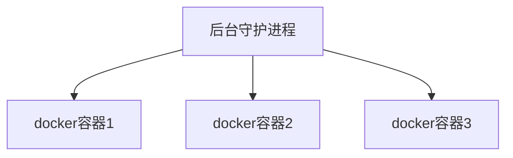

# Docker简介

## 为什么要Docker

产品的开发到上线，从环境搭建到应用配置，有很多需要注意的地方。因此开发和运维之间的协作显得很重要。特别是版本的迭代，对运维人员来说是种考验。

Docker给出了一个标准化的解决方案。以前只是搬代码，现在是把代码+配置一起搬过去直接运行，把原始环境一模一样的复制过来，把软件和它的运行环境一起带过来安装。

Docker 一次构建 处处运行。

简而言之：Docker是一个解决了运行环境和配置问题的软件容器，方便做持续集成 并有助于整体发布的容器虚拟化技术。Docker仅包含业务运行所需的runtime环境。

可以把容器看做是一个简易版的Linux环境。

## Docker能做什么

Docker 模拟的不是一个完整的操作系统，而是对进程进行隔离。

- 传统虚拟机技术是虚拟出一套硬件后，在其上运行一个完整的OS，在该系统上再运行所需应用进程。
- 而容器内的应用进程直接运行于宿主的内核，容器没有自己的内容，而且也没有进行硬件虚拟。因此容器要比传统VM更为轻便。
- 每个容器之间互相隔离，每个容器有自己的文件系统，容器之间进程不会相互影响，能区分计算资源。

## Docker三要素

- 仓库：存放镜像的地方。我们可以把镜像发布到仓库中，需要时再从仓库里下载。
- 镜像：一个模板。image文件生成的容器实例，本身也是一个文件，称为镜像文件。
- 容器：镜像的实例就是容器。一个容器运行一种服务，当我们需要的时候，就可以通过docker客户端创建一个对应的运行实例，即容器。

从仓库里下载镜像，用下载到的镜像得到一个一个的实例（容器）。一个模板生成多个实例。

Docker是一个开源的应用容器引擎，基于Go语言并遵循Apache2.0协议开源。

Docker可以让开发者打包他们的应用以及依赖包到一个轻量级、可移植的容器中，然后发布到任何流行的Linux机器上，也可实现虚拟化。

Docker容器使用的是沙箱机制，相互之间不会有任何接口，更重要的是容器性能开销极低。

大概意思是：Docker可以集成很多软件，然后把软件弄成镜像，让使用者可以直接用镜像，无需再安装软件。

运行中的这个镜像成为容器，容器的启动很迅速。

# 核心概念

Docker主机：安装了Docker程序的机器。Docker是直接安装在OS上的。

Docker客户端：连接Docker主机进行操作。

Docker仓库：用来保存各种打包好的软件镜像。

Docker镜像：软件打包好的镜像，放在仓库中。

Docker容器：镜像启动后的实例，称为一个容器。tomcat镜像运行五次，就会有五个容器，就有5个tomcat了。

使用Docker的步骤：

- 安装docker
- 去docker仓库找到软件对应的镜像
- 直接使用docker运行这个镜像，这个镜像就会生成一个docker容器
- 停止容器就是停止软件。一个容器对应一个软件。

# 安装Docker

## 安装虚拟机

- 安装虚拟机VM[收费] 或 VirtualBox[免费哦]

- 下载CentOS7 建议去中国科学技术大学下载镜像文件<a href="http://mirrors.ustc.edu.cn/">地址</a>

- 导入虚拟机文件，安装OS

- 使用客户端连接linux服务器。挑一个自己熟悉的就行。

- 设置虚拟机网络

  - 请看VM安装这个笔记
  
- 防火墙

  - 查看防火墙状态：`service status firewalld.service`
  - 关闭防火墙：`service firewalld stop`
  - 然后 输入命令 `service network restart` 【centos 7】

- 查看Linux的IP地址

  - ```shell
    ip addr 找到 inet 的地址
    ```

## 安装Docker

- `docker`要求内核版本高于3.10
  - 查看内核版本 `uname -r`
  - 不是的话，用 `yum update`更新
- 安装： `yum install docker`
- 启动：`systemctl start docker`
  - `docker -v` 查看docker版本号
  - 这里我出现了问题，看了这篇<a href="https://blog.csdn.net/E09620126/article/details/86577917?utm_medium=distribute.pc_relevant_t0.none-task-blog-BlogCommendFromMachineLearnPai2-1.channel_param&depth_1-utm_source=distribute.pc_relevant_t0.none-task-blog-BlogCommendFromMachineLearnPai2-1.channel_param">博客</a>解决了问题
- 停止：`systemctl stop docker`
- 将`docker`设置为开机自启：`systemctl enable docker`
- 停止`docker`：`systemctl stop docker`

<a hre="https://docs.docker.com/engine/install/centos/">官方安装文档</a>

## 更改Docker的镜像地址

我下的中科大的CentOS好像速度很快，并不慢。

- 去阿里云或其他云上获得加速地址
- 配置本机docker，运行镜像加速器
  - 更改配置
- 保存，service docker restart
  - 查看配置是否成功： ps -ef|grep docker

## 安装软件

- 搜索mysql镜像：`docker search mysql`
  - 其实就是去docker hub仓库里搜索mysql镜像
- 拉取mysql镜像：`docker pull mysql`不加标签，默认用最新的。
  - 指定标签 `docker pull mysql:5.5`
- 查看所有镜像：`docker images` 
- 删除镜像：`docker rmi image-id`【传镜像id】 [rmi= remove image]

## Docker容器操作

- 得到软件镜像====运行镜像====产生一个容器
- 示例
  - 搜索镜像：`docker search tomcat`
  - 拉取镜像：`docker pull tomcat`
  - 查看镜像：`docker images`
  - 运行镜像：`docker run --name container-name -d image-name`
    - eg：`docker run --name mytomcat-d tomcat.`
    - --name 自定义容器名
    - -d 后台运行
    - image-name 指定镜像模板
  - 查看运行的镜像：`docker ps`
  - 停止当前容器：`docker stop TAINER ID 或 容器名称`
  - 启动容器：`docker run container-id`
  - 删除一个容器：`docker rm container-id`
- 我们想访问docker中的tomcat是访问不了的。我们访问虚拟机里的8080，我们访问不到docker里的8080.我们要做一个映射。
- 停掉，重新安装tomcat
  - 停止容器：`docker stop xsafsf[TAINER ID]`

- 端口映射：`docker run -d -p 8888:8080 --name mytomcat tomcat` [把主机的8888映射到容器的8080]  可以简写`docker run -d -p 8888:8080 tomcat`，会自动为我们取名
  - -p：把主机端口映射到容器内部的端口  主机端口：容器内部端口
  - -d：后台启动。
- 我们需要关闭Linux的防火墙，才可以访问！
  - 查看防火墙状态：`service status firewalld.service`
  - 关闭防火墙：`service firewalld stop`
- 查看容器日志：`docker logs`
- 更多请看官网文档<a href="https://hub.docker.com/">地址</a>

# Docker命令

## 入门

- `docker run hello-world`
  - 本地没有hello-world所有会去仓库拉，把镜像下载下来然后运行镜像得到容器。
- run做了什么？
  - 本机中寻找镜像，没有就去仓库下载
  - 仓库中有，就下载到本地，并根据镜像，运行它得到实例【容器】
  - 没有，就报错。

## 底层原理

Docker C/S结构。 Docker的守护进程运行在主机上，然后通过Socket连接从客户端访问，守护进程从客户端接收命令并管理运行在主机上的容器。

容器是一个运行时环境。



虚拟机 = 软件+硬件 是一个完整的OS

docker：比vm 更少的抽象层，不需要Hypervisor实现硬件资源虚拟化，运行在docker容器上的程序直接使用的都是实际物理机的硬件资源。因此docker在cpu、内存利用效率上，会有明显优势。

docker是利用宿主机的内核，不需要Guest OS，docker无须想vm一样加载os内核。

## 常用镜像命令

- docker info 查看docker的信息
- docker --help 查看帮助文档
- **docker images** 查看本机的镜像
  - docker images -a 查看所有镜像（含中间映像层）
  - docker images -q 只显示镜像id
  - docker images --disgests 显示镜像的摘要信息
  - docker images --no-trunc 显示完整的镜像信息
- **docker search xxx** 查询xxx
  - 去<a href="https://hub.docker.com/">官网</a>搜镜像 
  - docker search -s 点赞数  镜像名
    - docker search -s 30 tomcat 查找点赞数超过30k的tomcat镜像
  - docker search --no-trunc 显示完整的镜像描述
  - docker search --automated 只列出automated build类型的镜像。
- **docker pull xxx** 拉取xxx镜像
  - `docker pull tomcat 等价于 docker pull tomcat:latest`
- **docker rmi xxx** 删除镜像
  - `docker rmi tomcat 等价于 docker rmi tomcat:laster`
  - `docker rmi -f tomcat 强制删除`
  - `docker rmi -f hello nginx 级联删除，同时删除多个`
  - `docker rmi -f $(docker images -qa) 删除全部`

## 常用容器命令（一）

> **docker run   [OPTIONS]    IMAGE   [COMMAND]   [ARG...]**

- OPTIONS说明【常用】：有些是一个减号，有些事两个减号。
  - --name=“容器新名字”       为容器指定一个名称
  - -d   后台运行容器，并返回容器ID，即启动守护式容器
  - -i    以交互式模式运行容器，通常与-t同时使用
  - -t    为容器重新分配一个伪输入终端，通常与-i同时使用
  - -p   随机端口映射
    - 指定端口映射，有以下四种格式
    - `ip:hostPort:containerPort`
    - `ip:containerPort`
    - `hostPort:containerPort`
    - `containerPort`
- eg：`docker run -it 7e6257c9f8d8[这个是centos镜像的id]`
  - -it   i一交互式模式运行容器 t----为容器分配一个伪终端
  - 退出容器用 exit 或 <span style="color:red">ctrl + p + q【正常退出不关闭容器】</span>
    - exit  容器停止 退出
    - ctrl+p+q 容器不停止退出
  - 启动容器：docker start 容器id/容器名
  - 重新启动容器：docker restart 容器id/容器名
  - 停止容器：docker stop 容器id/容器名   【温柔的，慢慢的关闭】
    - docker kill 容器id/容器名  强制停止，直接拔电源。
  - 删除容器：docker rm 容器id/容器名
    - docker rm -f 容器id/容器名字 强制
    - docker rm  $(docker ps -a -q)  因为不是强制的，所以只能删除未运行的容器！
- **docker ps** 列出容器
  - `docker ps -a` 列出所有容器【运行中的+历史运行的】
  - `docker ps -n 3` 列出上三次运行的容器
  - `docker ps -l` 上次运行的容器
  - `docker ps -lq` 上次运行的容器，且只显示id
- eg: `docker run -it --name mycontainer centos`
  - 创建centos容器，名称为mycontainer，以交互式模式运行且为其分配一个伪终端。
  - `docker run -it --name mycontainer2 -d centos`

## 常用容器命令（二）

> **使用镜像centos:7 以后台模式启动一个容器**

- `docker run -d centos`
  - `docker ps -a` 查看，发现容器已经退出。
  - <span style="color:red">**docker容器后台运行，必须要有一个前台进程！！**</span> 容器的命令如果不是那些一直挂起的命令（如top tail）就会自动退出。
- docker logs -f -t --tail 容器id  查看容器日志
  - -t 是加入时间戳
  - -f 跟随最新的日志打印
  - --tail 数字显示最后多少条

# Docker安装mysql

- docker search mysql
- docker pull mysql
- dokcer run --name mysql01 -d mysql 发现运行错误
  - 查看日志，看错误原因 【docker logs 对应容器的id】
  - 如何正确运行？去官网看哦！
  - docker run --name mysql01 -e MYSQL_ROOT_PASSWORD=123456 -d mysql
  - docker run -p 3306:3306 --name mysql01 -e MYSQL_ROOT_PASSWORD=123456 -d mysql