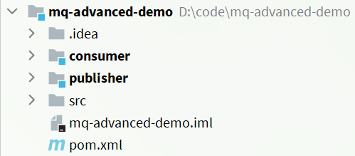
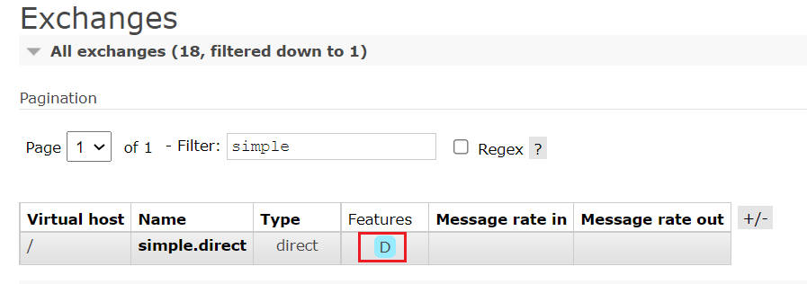
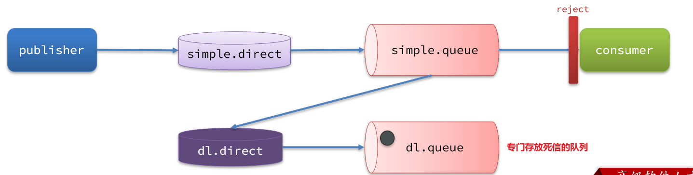

# 服务异步通信-高级篇

消息队列在使用过程中，面临着很多实际问题需要思考：


# 消息可靠性

消息从发送，到消费者接收，会经理多个过程：


> <b style="color:red">其中的每一步都可能导致消息丢失，常见的丢失原因包括</b>

- 发送时丢失：
  - 生产者发送的消息未送达 exchange
  - 消息到达 exchange 后未到达 queue
- MQ 宕机，queue 将消息丢失
- consumer 接收到消息后未消费就宕机

针对这些问题，RabbitMQ 分别给出了解决方案：

- 生产者确认机制
- mq 持久化
- 消费者确认机制
- 失败重试机制

下面我们就通过案例来演示每一个步骤。

首先，导入课前资料提供的 demo 工程：


项目结构如下：




## 生产者消息确认

RabbitMQ 提供了 publisher confirm 机制来避免消息发送到 MQ 过程中丢失。这种机制必须给每个消息指定一个唯一 ID。消息发送到 MQ 以后，会返回一个结果给发送者，表示消息是否处理成功。

返回结果有两种方式：

- publisher-confirm，发送者确认
  - 消息成功投递到交换机，返回 ack
  - 消息未投递到交换机，返回 nack
- publisher-return，发送者回执
  - 消息投递到交换机了，但是没有路由到队列。返回 ACK，及路由失败原因。


<b span style="color:red">注意：确认机制发送消息时，需要给每个消息设置一个全局唯一 id，以区分不同消息，避免 ack 冲突。</b>


### 修改配置

首先，修改 publisher 服务中的 application.yml 文件，添加下面的内容：

```yaml
spring:
  rabbitmq:
    publisher-confirm-type: correlated
    publisher-returns: true
    template:
      mandatory: true
```

- `publish-confirm-type`：开启 publisher-confirm，这里支持两种类型：
  - `simple`：同步等待 confirm 结果，直到超时
  - `correlated`：异步回调，定义 ConfirmCallback，MQ 返回结果时会回调这个 ConfirmCallback
- `publish-returns`：开启 publish-return 功能，同样是基于 callback 机制，不过是定义 ReturnCallback
- `template.mandatory`：定义消息路由失败时的策略。true 则调用 ReturnCallback；false 则直接丢弃消息

### 定义Return回调

每个 RabbitTemplate 只能配置一个 ReturnCallback，因此需要在项目加载时配置：

修改 publisher 服务，添加一个：

```java
package cn.itcast.mq.config;

import lombok.extern.slf4j.Slf4j;
import org.springframework.amqp.rabbit.core.RabbitTemplate;
import org.springframework.beans.BeansException;
import org.springframework.context.ApplicationContext;
import org.springframework.context.ApplicationContextAware;
import org.springframework.context.annotation.Configuration;

@Slf4j
@Configuration
public class CommonConfig implements ApplicationContextAware {
    @Override
    public void setApplicationContext(ApplicationContext applicationContext) throws BeansException {
        // 获取RabbitTemplate
        RabbitTemplate rabbitTemplate = applicationContext.getBean(RabbitTemplate.class);
        // 设置ReturnCallback
        rabbitTemplate.setReturnCallback((message, replyCode, replyText, exchange, routingKey) -> {
            // 投递失败，记录日志
            log.info("消息发送失败，应答码{}，原因{}，交换机{}，路由键{},消息{}",
                     replyCode, replyText, exchange, routingKey, message.toString());
            // 如果有业务需要，可以重发消息
        });
    }
}
```

### 定义ConfirmCallback

ConfirmCallback 可以在发送消息时指定，因为每个业务处理 confirm 成功或失败的逻辑不一定相同。

在 publisher 服务的 cn.itcast.mq.spring.SpringAmqpTest 类中，定义一个单元测试方法：

```java
public void testSendMessage2SimpleQueue() throws InterruptedException {
    // 1.消息体
    String message = "hello, spring amqp!";
    // 2.全局唯一的消息ID，需要封装到CorrelationData中
    CorrelationData correlationData = new CorrelationData(UUID.randomUUID().toString());
    // 3.添加callback
    correlationData.getFuture().addCallback(
        result -> {
            if(result.isAck()){
                // 3.1.ack，消息成功
                log.debug("消息发送成功, ID:{}", correlationData.getId());
            }else{
                // 3.2.nack，消息失败
                log.error("消息发送失败, ID:{}, 原因{}",correlationData.getId(), result.getReason());
            }
        },
        ex -> log.error("消息发送异常, ID:{}, 原因{}",correlationData.getId(),ex.getMessage())
    );
    // 4.发送消息
    rabbitTemplate.convertAndSend("task.direct", "task", message, correlationData);

    // 休眠一会儿，等待ack回执
    Thread.sleep(2000);
}
```

## 消息持久化

生产者确认可以确保消息投递到 RabbitMQ 的队列中，但是消息发送到 RabbitMQ 以后，如果突然宕机，也可能导致消息丢失。

要想确保消息在 RabbitMQ 中安全保存，必须开启消息持久化机制。

- 交换机持久化
- 队列持久化
- 消息持久化

### 交换机持久化

RabbitMQ 中交换机默认是非持久化的，mq 重启后就丢失。

SpringAMQP 中可以通过代码指定交换机持久化：

```java
@Bean
public DirectExchange simpleExchange(){
    // 三个参数：交换机名称、是否持久化、当没有queue与其绑定时是否自动删除
    return new DirectExchange("simple.direct", true, false);
}
```

事实上，默认情况下，由 SpringAMQP 声明的交换机都是持久化的。

可以在 RabbitMQ 控制台看到持久化的交换机都会带上 `D` 的标示：



### 队列持久化

RabbitMQ 中队列默认是非持久化的，mq 重启后就丢失。

SpringAMQP 中可以通过代码指定交换机持久化：

```java
@Bean
public Queue simpleQueue(){
    // 使用QueueBuilder构建队列，durable就是持久化的
    return QueueBuilder.durable("simple.queue").build();
}
```

事实上，默认情况下，由 SpringAMQP 声明的队列都是持久化的。

可以在 RabbitMQ 控制台看到持久化的队列都会带上`D`的标示：


### 消息持久化

利用 SpringAMQP 发送消息时，可以设置消息的属性（MessageProperties），指定 delivery-mode：

- 1：非持久化
- 2：持久化

用 Java 代码指定：


默认情况下，SpringAMQP 发出的任何消息都是持久化的，不用特意指定。

## 消费者消息确认

<span style="color:red">RabbitMQ 是阅后即焚机制，RabbitMQ 确认消息被消费者消费后会立刻删除。</span>

而 RabbitMQ 是通过消费者回执来确认消费者是否成功处理消息的：消费者获取消息后，应该向 RabbitMQ 发送 ACK 回执，表明自己已经处理消息。

> 设想这样的场景

- 1）RabbitMQ 投递消息给消费者
- 2）消费者获取消息后，返回 ACK 给 RabbitMQ
- 3）RabbitMQ 删除消息
- 4）消费者宕机，消息尚未处理

这样，消息就丢失了。因此消费者返回 ACK 的时机非常重要。

而 SpringAMQP 则允许配置三种确认模式：

- manual：手动 ack，需要在业务代码结束后，调用 api 发送 ack。
- auto：自动 ack，由 spring 监测 listener 代码是否出现异常，没有异常则返回 ack；抛出异常则返回 nack
- none：关闭 ack，MQ 假定消费者获取消息后会成功处理，因此消息投递后立即被删除

> 由此可知

- none 模式下，消息投递是不可靠的，可能丢失
- auto 模式类似事务机制，出现异常时返回 nack，消息回滚到 mq；没有异常，返回 ack
- manual：自己根据业务情况，判断什么时候该 ack

一般，我们都是使用默认的 auto 即可。

### 演示none模式

修改 consumer 服务的 application.yml 文件，添加下面内容：

```yaml
spring:
  rabbitmq:
    listener:
      simple:
        acknowledge-mode: none # 关闭ack
```

修改 consumer 服务的 SpringRabbitListener 类中的方法，模拟一个消息处理异常：

```java
@RabbitListener(queues = "simple.queue")
public void listenSimpleQueue(String msg) {
    log.info("消费者接收到simple.queue的消息：【{}】", msg);
    // 模拟异常
    System.out.println(1 / 0);
    log.debug("消息处理完成！");
}
```

测试可以发现，当消息处理抛异常时，消息依然被 RabbitMQ 删除了。

### 演示auto模式

再次把确认机制修改为 auto:

```yaml
spring:
  rabbitmq:
    listener:
      simple:
        acknowledge-mode: auto # 关闭ack
```

在异常位置打断点，再次发送消息，程序卡在断点时，可以发现此时消息状态为 unack（未确定状态）：


抛出异常后，因为 Spring 会自动返回 nack，所以消息恢复至 Ready 状态，并且没有被 RabbitMQ 删除


## 消费失败重试机制

当消费者出现异常后，消息会不断 requeue（重入队）到队列，再重新发送给消费者，然后再次异常，再次 requeue，无限循环，导致 mq 的消息处理飙升，带来不必要的压力：


怎么办呢？

### 本地重试

我们可以利用 Spring 的 retry 机制，在消费者出现异常时利用本地重试，而不是无限制的 requeue 到 mq 队列。

修改 consumer 服务的 application.yml 文件，添加内容：

```yaml
spring:
  rabbitmq:
    listener:
      simple:
        retry:
          enabled: true # 开启消费者失败重试
          initial-interval: 1000 # 初识的失败等待时长为1秒
          multiplier: 1 # 失败的等待时长倍数，下次等待时长 = multiplier * last-interval
          max-attempts: 3 # 最大重试次数
          stateless: true # true无状态；false有状态。如果业务中包含事务，这里改为false
```

重启 consumer 服务，重复之前的测试可以发现：

- 在重试 3 次后，SpringAMQP 会抛出异常 AmqpRejectAndDontRequeueException，说明本地重试触发了
- 查看 RabbitMQ 控制台，发现消息被删除了，说明最后 SpringAMQP 返回的是 ack，mq 删除消息了

结论：

- 开启本地重试时，消息处理过程中抛出异常，不会 requeue 到队列，而是在消费者本地重试
- 重试达到最大次数后，Spring 会返回 ack，消息会被丢弃

### 失败策略

在之前的测试中，达到最大重试次数后，消息会被丢弃，这是由 Spring 内部机制决定的。

在开启重试模式后，重试次数耗尽，如果消息依然失败，则需要有 MessageRecovery 接口来处理，它包含三种不同的实现：

- RejectAndDontRequeueRecoverer：重试耗尽后，直接 reject，丢弃消息。默认就是这种方式

- ImmediateRequeueMessageRecoverer：重试耗尽后，返回 nack，消息重新入队

- RepublishMessageRecoverer：重试耗尽后，将失败消息投递到指定的交换机

比较优雅的一种处理方案是 RepublishMessageRecoverer，失败后将消息投递到一个指定的，专门存放异常消息的队列，后续由人工集中处理。

1）在 consumer 服务中定义处理失败消息的交换机和队列

```java
@Bean
public DirectExchange errorMessageExchange(){
    return new DirectExchange("error.direct");
}
@Bean
public Queue errorQueue(){
    return new Queue("error.queue", true);
}
@Bean
public Binding errorBinding(Queue errorQueue, DirectExchange errorMessageExchange){
    return BindingBuilder.bind(errorQueue).to(errorMessageExchange).with("error");
}
```

2）定义一个RepublishMessageRecoverer，关联队列和交换机

```java
@Bean
public MessageRecoverer republishMessageRecoverer(RabbitTemplate rabbitTemplate){
    return new RepublishMessageRecoverer(rabbitTemplate, "error.direct", "error");
}
```

完整代码：

```java
package cn.itcast.mq.config;

import org.springframework.amqp.core.Binding;
import org.springframework.amqp.core.BindingBuilder;
import org.springframework.amqp.core.DirectExchange;
import org.springframework.amqp.core.Queue;
import org.springframework.amqp.rabbit.core.RabbitTemplate;
import org.springframework.amqp.rabbit.retry.MessageRecoverer;
import org.springframework.amqp.rabbit.retry.RepublishMessageRecoverer;
import org.springframework.context.annotation.Bean;

@Configuration
public class ErrorMessageConfig {
    @Bean
    public DirectExchange errorMessageExchange(){
        return new DirectExchange("error.direct");
    }
    @Bean
    public Queue errorQueue(){
        return new Queue("error.queue", true);
    }
    @Bean
    public Binding errorBinding(Queue errorQueue, DirectExchange errorMessageExchange){
        return BindingBuilder.bind(errorQueue).to(errorMessageExchange).with("error");
    }

    @Bean
    public MessageRecoverer republishMessageRecoverer(RabbitTemplate rabbitTemplate){
        return new RepublishMessageRecoverer(rabbitTemplate, "error.direct", "error");
    }
}
```

## 总结

如何确保 RabbitMQ 消息的可靠性？

- 开启生产者确认机制，确保生产者的消息能到达队列
- 开启持久化功能，确保消息未消费前在队列中不会丢失
- 开启消费者确认机制为 auto，由 spring 确认消息处理成功后完成 ack
- 开启消费者失败重试机制，并设置 MessageRecoverer，多次重试失败后将消息投递到异常交换机，交由人工处理

# 死信交换机

## 认识识死信交换机

### 什么是死信交换机

什么是死信？

当一个队列中的消息满足下列情况之一时，可以成为死信（dead letter）：

- 消费者使用 basic.reject 或 basic.nack 声明消费失败，并且消息的 requeue 参数设置为 false
- 消息是一个过期消息，超时无人消费
- 要投递的队列消息满了，无法投递

如果这个包含死信的队列配置了 `dead-letter-exchange` 属性，指定了一个交换机，那么队列中的死信就会投递到这个交换机中，而这个交换机称为<span style="color:red">死信交换机</span>（Dead Letter Exchange，检查 DLX）。

如图，一个消息被消费者拒绝了，变成了死信：


因为 simple.queue 绑定了死信交换机 dl.direct，因此死信会投递给这个交换机：


如果这个死信交换机也绑定了一个队列，则消息最终会进入这个存放死信的队列：




另外，队列将死信投递给死信交换机时，必须知道两个信息：

- 死信交换机名称
- 死信交换机与死信队列绑定的 RoutingKey

这样才能确保投递的消息能到达死信交换机，并且正确的路由到死信队列。


### 利用死信交换机接收死信（拓展）

在失败重试策略中，默认的 RejectAndDontRequeueRecoverer 会在本地重试次数耗尽后，发送 reject 给 RabbitMQ，消息变成死信，被丢弃。

我们可以给 simple.queue 添加一个死信交换机，给死信交换机绑定一个队列。这样消息变成死信后也不会丢弃，而是最终投递到死信交换机，路由到与死信交换机绑定的队列。


我们在 consumer 服务中，定义一组死信交换机、死信队列：

```java
// 声明普通的 simple.queue队列，并且为其指定死信交换机：dl.direct
@Bean
public Queue simpleQueue2(){
    return QueueBuilder.durable("simple.queue") // 指定队列名称，并持久化
        .deadLetterExchange("dl.direct") // 指定死信交换机
        .build();
}
// 声明死信交换机 dl.direct
@Bean
public DirectExchange dlExchange(){
    return new DirectExchange("dl.direct", true, false);
}
// 声明存储死信的队列 dl.queue
@Bean
public Queue dlQueue(){
    return new Queue("dl.queue", true);
}
// 将死信队列 与 死信交换机绑定
@Bean
public Binding dlBinding(){
    return BindingBuilder.bind(dlQueue()).to(dlExchange()).with("simple");
}
```

### 总结

什么样的消息会成为死信？

- 消息被消费者 reject 或者返回 nack
- 消息超时未消费
- 队列满了

死信交换机的使用场景是什么？

- 如果队列绑定了死信交换机，死信会投递到死信交换机；
- 可以利用死信交换机收集所有消费者处理失败的消息（死信），交由人工处理，进一步提高消息队列的可靠性。

## TTL

一个队列中的消息如果超时未消费，则会变为死信，超时分为两种情况：

- 消息所在的队列设置了超时时间
- 消息本身设置了超时时间


### 接收超时死信的死信交换机

在 consumer 服务的 SpringRabbitListener 中，定义一个新的消费者，并且声明死信交换机、死信队列：

```java
@RabbitListener(bindings = @QueueBinding(
    value = @Queue(name = "dl.ttl.queue", durable = "true"),
    exchange = @Exchange(name = "dl.ttl.direct"),
    key = "ttl"
))
public void listenDlQueue(String msg){
    log.info("接收到 dl.ttl.queue的延迟消息：{}", msg);
}
```

### 声明一个队列，并且指定TTL

要给队列设置超时时间，需要在声明队列时配置 x-message-ttl 属性：

```java
@Bean
public Queue ttlQueue(){
    return QueueBuilder.durable("ttl.queue") // 指定队列名称，并持久化
        .ttl(10000) // 设置队列的超时时间，10秒
        .deadLetterExchange("dl.ttl.direct") // 指定死信交换机
        .build();
}
```

注意，这个队列设定了死信交换机为 `dl.ttl.direct`

声明交换机，将ttl与交换机绑定：

```java
@Bean
public DirectExchange ttlExchange(){
    return new DirectExchange("ttl.direct");
}
@Bean
public Binding ttlBinding(){
    return BindingBuilder.bind(ttlQueue()).to(ttlExchange()).with("ttl");
}
```

发送消息，但是不要指定 TTL：

```java
@Test
public void testTTLQueue() {
    // 创建消息
    String message = "hello, ttl queue";
    // 消息ID，需要封装到CorrelationData中
    CorrelationData correlationData = new CorrelationData(UUID.randomUUID().toString());
    // 发送消息
    rabbitTemplate.convertAndSend("ttl.direct", "ttl", message, correlationData);
    // 记录日志
    log.debug("发送消息成功");
}
```

发送消息的日志：


查看下接收消息的日志：


因为队列的 TTL 值是 10000ms，也就是 10 秒。可以看到消息发送与接收之间的时差刚好是 10 秒。

### 发送消息时，设定TTL

在发送消息时，也可以指定 TTL：

```java
@Test
public void testTTLMsg() {
    // 创建消息
    Message message = MessageBuilder
        .withBody("hello, ttl message".getBytes(StandardCharsets.UTF_8))
        .setExpiration("5000")
        .build();
    // 消息ID，需要封装到CorrelationData中
    CorrelationData correlationData = new CorrelationData(UUID.randomUUID().toString());
    // 发送消息
    rabbitTemplate.convertAndSend("ttl.direct", "ttl", message, correlationData);
    log.debug("发送消息成功");
}
```

查看发送消息日志：


接收消息日志：


这次，发送与接收的延迟只有 5 秒。说明当队列、消息都设置了 TTL 时，任意一个到期就会成为死信。

### 总结

消息超时的两种方式是？

- 给队列设置ttl属性，进入队列后超过ttl时间的消息变为死信
- 给消息设置ttl属性，队列接收到消息超过ttl时间后变为死信

如何实现发送一个消息 20 秒后消费者才收到消息？

- 给消息的目标队列指定死信交换机
- 将消费者监听的队列绑定到死信交换机
- 发送消息时给消息设置超时时间为 20 秒

## 延迟队列

利用TTL结合死信交换机，我们实现了消息发出后，消费者延迟收到消息的效果。这种消息模式就称为延迟队列（Delay Queue）模式。

延迟队列的使用场景包括：

- 延迟发送短信
- 用户下单，如果用户在 15 分钟内未支付，则自动取消
- 预约工作会议，20 分钟后自动通知所有参会人员


因为延迟队列的需求非常多，所以 RabbitMQ 的官方也推出了一个插件，原生支持延迟队列效果。

这个插件就是 DelayExchange 插件。参考 RabbitMQ 的插件列表页面：https://www.rabbitmq.com/community-plugins.html


使用方式可以参考官网地址：https://blog.rabbitmq.com/posts/2015/04/scheduling-messages-with-rabbitmq

### 安装DelayExchange插件

参考课前资料：


### DelayExchange原理

DelayExchange 需要将一个交换机声明为 delayed 类型。当我们发送消息到 delayExchange 时，流程如下：

- 接收消息
- 判断消息是否具备 x-delay 属性
- 如果有 x-delay 属性，说明是延迟消息，持久化到硬盘，读取 x-delay 值，作为延迟时间
- 返回 routing not found 结果给消息发送者
- x-delay 时间到期后，重新投递消息到指定队列

### 使用DelayExchange

插件的使用也非常简单：声明一个交换机，交换机的类型可以是任意类型，只需要设定 delayed 属性为 true 即可，然后声明队列与其绑定即可。

#### 声明DelayExchange交换机

基于注解方式（推荐）：


也可以基于 @Bean 的方式：


#### 发送消息

发送消息时，一定要携带 x-delay 属性，指定延迟的时间：


### 总结

延迟队列插件的使用步骤包括哪些？

- 声明一个交换机，添加 delayed 属性为 true
- 发送消息时，添加 x-delay 头，值为超时时间

# 惰性队列

## 消息堆积问题

当生产者发送消息的速度超过了消费者处理消息的速度，就会导致队列中的消息堆积，直到队列存储消息达到上限。之后发送的消息就会成为死信，可能会被丢弃，这就是消息堆积问题。


解决消息堆积有两种思路：

- 增加更多消费者，提高消费速度。也就是我们之前说的 work queue 模式
- 扩大队列容积，提高堆积上限

要提升队列容积，把消息保存在内存中显然是不行的。

## 惰性队列

从 RabbitMQ 的 3.6.0 版本开始，就增加了 Lazy Queues 的概念，也就是惰性队列。惰性队列的特征如下：

- 接收到消息后直接存入磁盘而非内存
- 消费者要消费消息时才会从磁盘中读取并加载到内存
- 支持数百万条的消息存储

### 基于命令行设置lazy-queue

而要设置一个队列为惰性队列，只需要在声明队列时，指定 x-queue-mode 属性为 lazy 即可。可以通过命令行将一个运行中的队列修改为惰性队列：

```sh
rabbitmqctl set_policy Lazy "^lazy-queue$" '{"queue-mode":"lazy"}' --apply-to queues  
```

命令解读：

- `rabbitmqctl`：RabbitMQ 的命令行工具
- `set_policy`：添加一个策略
- `Lazy`：策略名称，可以自定义
- `"^lazy-queue$"`：用正则表达式匹配队列的名字
- `'{"queue-mode":"lazy"}'`：设置队列模式为 lazy 模式
- `--apply-to queues  `：策略的作用对象，是所有的队列

### 基于@Bean声明lazy-queue


### 基于@RabbitListener声明LazyQueue


### 总结

消息堆积问题的解决方案？

- 队列上绑定多个消费者，提高消费速度
- 使用惰性队列，可以再 mq 中保存更多消息

惰性队列的优点有哪些？

- 基于磁盘存储，消息上限高
- 没有间歇性的 page-out，性能比较稳定

惰性队列的缺点有哪些？

- 基于磁盘存储，消息时效性会降低
- 性能受限于磁盘的 IO

# MQ集群

## 集群分类

RabbitMQ的是基于Erlang语言编写，而Erlang又是一个面向并发的语言，天然支持集群模式。RabbitMQ的集群有两种模式：

- 普通集群：是一种分布式集群，将队列分散到集群的各个节点，从而提高整个集群的并发能力。
- 镜像集群：是一种主从集群，普通集群的基础上，添加了主从备份功能，提高集群的数据可用性。

镜像集群虽然支持主从，但主从同步并不是强一致的，某些情况下可能有数据丢失的风险。因此在 RabbitMQ 的 3.8 版本以后，推出了新的功能：仲裁队列来代替镜像集群，底层采用 Raft 协议确保主从的数据一致性。

## 普通集群

### 集群结构和特征

普通集群，或者叫标准集群（classic cluster），具备下列特征：

- 会在集群的各个节点间共享部分数据，包括：交换机、队列元信息。不包含队列中的消息。
- 当访问集群某节点时，如果队列不在该节点，会从数据所在节点传递到当前节点并返回
- 队列所在节点宕机，队列中的消息就会丢失

结构如图：


### 部署

参考课前资料：《RabbitMQ 部署指南.md》

## 镜像集群

### 集群结构和特征

镜像集群：本质是主从模式，具备下面的特征：

- 交换机、队列、队列中的消息会在各个 mq 的镜像节点之间同步备份。
- 创建队列的节点被称为该队列的主节点，备份到的其它节点叫做该队列的镜像节点。
- 一个队列的主节点可能是另一个队列的镜像节点
- 所有操作都是主节点完成，然后同步给镜像节点
- 主宕机后，镜像节点会替代成新的主

结构如图：


### 部署

参考课前资料：《RabbitMQ 部署指南.md》

## 仲裁队列

### 集群特征

仲裁队列：仲裁队列是 3.8 版本以后才有的新功能，用来替代镜像队列，具备下列特征：

- 与镜像队列一样，都是主从模式，支持主从数据同步
- 使用非常简单，没有复杂的配置
- 主从同步基于 Raft 协议，强一致

### 部署

参考课前资料：《RabbitMQ部署指南.md》

### Java代码创建仲裁队列

```java
@Bean
public Queue quorumQueue() {
    return QueueBuilder
        .durable("quorum.queue") // 持久化
        .quorum() // 仲裁队列
        .build();
}
```

### SpringAMQP连接MQ集群

注意，这里用 address 来代替 host、port 方式

```java
spring:
  rabbitmq:
    addresses: 192.168.150.105:8071, 192.168.150.105:8072, 192.168.150.105:8073
    username: itcast
    password: 123321
    virtual-host: /
```

