# 初识MQ

[Spring AMQP](https://docs.spring.io/spring-amqp/docs/current/reference/html/#message-converters)

## 同步和异步通讯

微服务间通讯有同步和异步两种方式：

- 同步通讯：就像打电话，需要实时响应。

- 异步通讯：就像发邮件，不需要马上回复。

<div align="center"></div>

两种方式各有优劣，打电话可以立即得到响应，但是你却不能跟多个人同时通话。发送邮件可以同时与多个人收发邮件，但是往往响应会有延迟。

### 同步通讯

我们之前学习的 Feign 调用就属于同步方式，虽然调用可以实时得到结果，但存在下面的问题：

<div align="center"></div>

> <b>同步调用的优点：</b>

- 时效性较强，可以立即得到结果

> <b>同步调用的问题：</b>

- 耦合度高
- 性能和吞吐能力下降
- 有额外的资源消耗
- 有级联失败问题

### 异步通讯

<b style="color:green">异步调用可以避免上述问题，异步调用常见实现是事件驱动模型</b>

以购买商品为例，用户支付后需要调用订单服务完成订单状态修改，调用物流服务，从仓库分配响应的库存并准备发货。

<div align="center">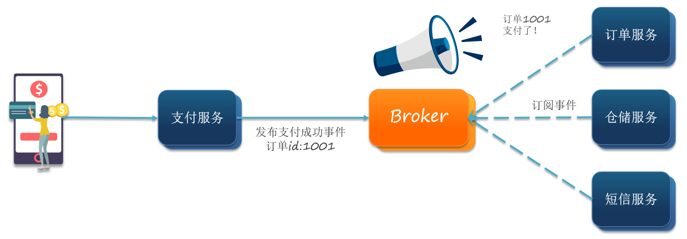</div>

在事件驱动模型中用两种角色：<span style="color:red">一种是事件发布者，一种是事件订阅者。</span>

- 支付服务是事件发布者（publisher），在支付完成后只需要发布一个支付成功的事件（event），事件中带上订单 id。
- 订单服务、仓储服务、物流服务是事件订阅者（Consumer），订阅支付成功的事件，监听到事件后完成自己业务即可。

为了解除事件发布者与订阅者之间的耦合，两者并不是直接通信，而是有一个中间人（Broker）。发布者发布事件到 Broker，不关心谁来订阅事件。订阅者从 Broker 订阅事件，不关心谁发来的消息。

<div align="center"></div>

Broker 是一个像数据总线一样的东西，所有的服务要接收数据和发送数据都发到这个总线上，这个总线就像协议一样，让服务间的通讯变得标准和可控。类似于一个有协议的队列，生产者向里面放数据，消费者从里面拿数据。

> <b>好处</b>

- 提升吞吐量：无需等待订阅者处理完成，响应更快速

- 故障隔离：服务没有直接调用，不存在级联失败问题
- 调用间没有阻塞，不会造成无效的资源占用
- 耦合度极低，每个服务都可以灵活插拔，可替换
- 流量削峰：不管发布事件的流量波动多大，都由 Broker 接收，订阅者可以按照自己的速度去处理事件

> <b>缺点</b>

- 架构复杂了，业务没有明显的流程线，不好管理
- 需要依赖于 Broker 的可靠、安全、性能

好在现在开源软件或云平台上 Broker 的软件是非常成熟的，比较常见的一种就是 MQ 技术。

## 技术对比

MQ，中文是消息队列（MessageQueue），字面来看就是存放消息的队列。也就是事件驱动架构中的 Broker。

比较常见的 MQ 实现：

- ActiveMQ
- RabbitMQ
- RocketMQ
- Kafka

几种常见 MQ 的对比：

|            | RabbitMQ            | ActiveMQ                 | RocketMQ | Kafka  |
| ---------- | ----------------------- | ------------------------------ | ------------ | ---------- |
| 公司/社区  | Rabbit                  | Apache                         | 阿里         | Apache     |
| 开发语言   | Erlang                  | Java                           | Java         | Scala&Java |
| 协议支持   | AMQP，XMPP，SMTP，STOMP | OpenWire,STOMP，REST,XMPP,AMQP | 自定义协议   | 自定义协议 |
| 可用性     | 高                      | 一般                           | 高           | 高         |
| 单机吞吐量 | 一般                    | 差                             | 高           | 非常高     |
| 消息延迟   | 微秒级                  | 毫秒级                         | 毫秒级       | 毫秒以内   |
| 消息可靠性 | 高                      | 一般                           | 高           | 一般       |

<span style="color:blue">追求可用性：Kafka、 RocketMQ 、RabbitMQ</span>

<span style="color:blue">追求可靠性：RabbitMQ、RocketMQ</span>

<span style="color:blue">追求吞吐能力：RocketMQ、Kafka</span>

<span style="color:blue">追求消息低延迟：RabbitMQ、Kafka</span>

# RabbitMQ简介

erlang 开发的 AMQP 的开源实现

## MQ基本概念

### 概述

MQ 全称 Message Queue（消息队列），是在消息的传输过程中保存消息的容器。多用于分布式系统之间进行通信。

传统的调用方式是，A 系统向 B 系统发起远程调用，然后等待 B 系统的调用结果。

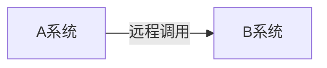

而加入消息队列后，调用方式变成了：A 系统发送消息给 MQ ，B 系统从 MQ 中取出消息进行消费。

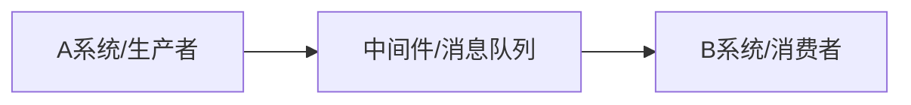

<b>小结</b>

- MQ，消息队列，存储消息的中间件
- 分布式系统通信两种方式：直接远程调用 和 借助第三方 完成间接通信
- 发送方称为生产者，接收方称为消费者

### 优势

优势：应用解耦、异步提速、削峰填谷

劣势：系统可用性降低、系统复杂度提高、会存在数据一致性问题

#### 应用解耦

如果库存系统出现问题，那么调用库存系统的订单系统也可能会出现问题，会导致后面无法正常调用支付系统和物流系统。系统耦合度高，一处错误可能导致后面无法正常执行。如果需要增加系统的话，如增加一个 X 系统，那么需要修改订单系统的代码，订单系统的可维护性低。

<div align="center">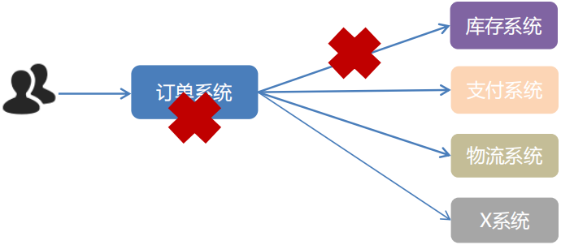</div>

使用 MQ 使得应用间解耦，提升容错性和可维护性。订单系统发送消息给 MQ，其他系统订阅 MQ 的消息，拿到消息后就执行。即便库存呢系统执行出错了，也不会影响其他系统的正常执行。而且，库存系统可能只是某几十秒内或几分钟内有问题，后面好了，可以继续从 MQ 中拿到那个未正常消费的消息，重新执行。如果需要增加 X 系统的话，只需要 X 系统从 MQ 中拿消息进行消费即可。

<div align="center">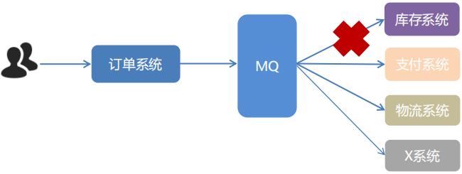</div>

#### 异步提速

一个下单操作耗时：20 + 300 + 300 + 300 = 920ms。用户点击完下单按钮后，需要等待 920ms 才能得到下单响应，太慢！

<div align="center">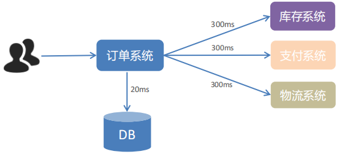</div>

加入消息队列后，用户点击完下单按钮后，只需等待 25ms 就能得到下单响应 (20+5=25ms)。提升用户体验和系统吞吐量（单位时间内处理请求的数目）。

<div align="center"></div>

#### 削峰填谷

在没有消息队列的情况下，如果请求瞬间增大，系统来不及处理可能会崩溃。

<div align="center"></div>

加入消息队列后，请求可以先打在消息队列中，然后系统在逐渐从 MQ 中拉取请求逐个处理。

<div align="center">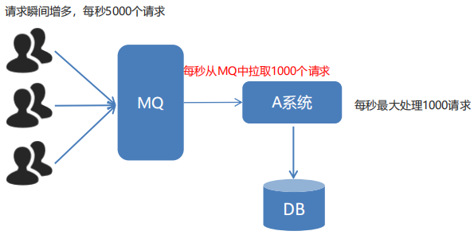</div>

<b>削峰填谷</b>

使用了 MQ 之后，限制消费消息的速度为 1000，这样一来，高峰期产生的数据势必会被积压在 MQ 中，高峰就被“削”掉了，但是因为消息积压，在高峰期过后的一段时间内，消费消息的速度还是会维持在1000，直到消费完积压的消息，这就叫做“填谷”。

使用 MQ 后，可以提高系统稳定性。

### 劣势

<b>系统可用性降低</b>

系统引入的外部依赖越多，系统稳定性越差。一旦 MQ 宕机，就会对业务造成影响。如何保证 MQ 的高可用？(集群容错？定期将数据 IO 到磁盘，参考 Redis 的操作？)

<b>系统复杂度提高</b>

MQ 的加入大大增加了系统的复杂度，以前系统间是同步的远程调用，现在是通过 MQ 进行异步调用。如何保证消息没有被重复消费？怎么处理消息丢失情况？那么保证消息传递的顺序性？这块的设计完全可以参考 TCP 协议。

<b>一致性问题</b>

A 系统处理完业务，通过 MQ 给 B、C、D 三个系统发消息数据，如果  B 系统、C 系统处理成功，D 系统处理失败。如何保证消息数据处理的一致性？

### 使用MQ的条件

①生产者不需要从消费者处获得反馈。引入消息队列之前的直接调用，其接口的返回值应该为空，这才让明明下层的动作还没做，上层却当成动作做完了继续往后走，即所谓异步成为了可能。

②容许短暂的不一致性。

③确实是用了有效果。即解耦、提速、削峰这些方面的收益，超过加入 MQ，管理 MQ 这些成本。

## RabbitMQ

### AMQP协议

AMQP，即 Advanced Message Queuing Protocol（高级消息队列协议），是一个网络协议，是应用层协议的一个开放标准，为面向消息的中间件设计。基于此协议的客户端与消息中间件可传递消息，并不受客户端/中间件不同产品，不同的开发语言等条件的限制。2006 年，AMQP 规范发布。类比 HTTP。 

<div align="center">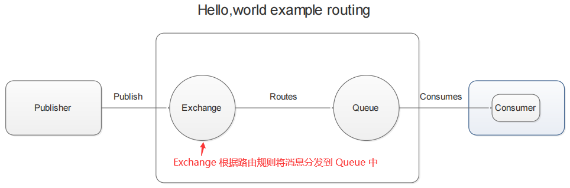</div>

### RabbitMQ简介

2007年，Rabbit 技术公司基于 AMQP 标准开发的 RabbitMQ 1.0 发布。RabbitMQ 采用 Erlang 语言开发。Erlang 语言由 Ericson 设计，专门为开发高并发和分布式系统的一种语言，在电信领域使用广泛。RabbitMQ 基础架构如下图

<div align="center">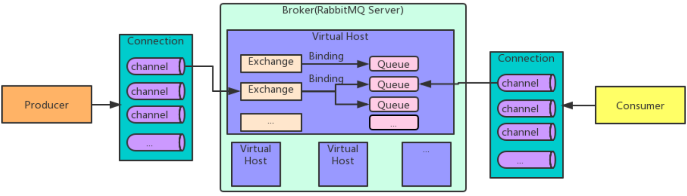</div>

- <b>Broker：</b>接收和分发消息的应用，RabbitMQ Server 就是 Message Broker
- <b>Virtual host：</b>出于多租户和安全因素设计的，把 AMQP 的基本组件划分到一个虚拟的分组中，类似于网络中的 namespace 概念。当多个不同的用户使用同一个 RabbitMQ server 提供的服务时，可以划分出多个 vhost，每个用户在自己的 vhost 创建 exchange／queue 等 
- <b>Connection：</b>publisher／consumer 和 broker 之间的 TCP 连接
- <b>Channel：</b>如果每一次访问 RabbitMQ 都建立一个 Connection，在消息量大的时候建立 TCP Connection 的开销将是巨大的，效率也较低。<span style="color:orange">Channel 是在 connection 内部建立的逻辑连接，如果应用程序支持多线程，通常每个 thread 创建单独的 channel 进行通讯，</span>AMQP method 包含了channel id 帮助客户端和 message broker 识别 channel，所以 channel 之间是完全隔离的。<span style="color:orange">Channel 作为轻量级的 Connection  极大减少了操作系统建立 TCP connection 的开销</span>
- <b>Exchange：</b>message 到达 broker 的第一站，根据分发规则，匹配查询表中的 routing key，分发消息到 queue 中去。常用的类型有：direct (point-to-point), topic (publish-subscribe) and fanout (multicast)
- <b>Queue：</b>消息最终被送到这里等待 consumer 取走
- <b>Binding：</b>exchange 和 queue 之间的虚拟连接，binding 中可以包含 routing key。Binding 信息被保存到 exchange 中的查询表中，用于 message 的分发依据。

### RabbitMQ工作模式

RabbitMQ 提供了 6 种工作模式：简单模式、work queues、Publish/Subscribe 发布与订阅模式、Routing 路由模式、Topics 主题模式、RPC 远程调用模式（远程调用，不太算 MQ；暂不作介绍）。

官网对应模式介绍：https://www.rabbitmq.com/getstarted.html

### JMS

- JMS 即 Java 消息服务（JavaMessage Service）应用程序接口，是一个 Java 平台中关于面向消息中间件的 API
- JMS 是 JavaEE 规范中的一种，类比 JDBC
- 很多消息中间件都实现了JMS 规范，例如：ActiveMQ。RabbitMQ 官方没有提供 JMS 的实现包，但是开源社区有

## 核心概念

- Message：消息由消息头和消息体组成。消息体是不透明的，而消息头则由一系列的可选属性组成，这些属性包括 routing-key（路由键）、priority、相对于其他消息的优先权、delivery-mode 等
- Publisher：消息的生产者，也是一个向交换器发布消息的客户端应用程序
- Exchange：交换器，用来接收生产者发送的消息并将这些消息路由给服务器中的队列。
    - 四种类型：direct（默认）、fanout、topic、headers
    - 不同类型的 Exchange 转发消息的策略有所区别
- Queue：消息队列
    - 用来保存消息，直到发送给消费者。他是消息的容器，也是消息的终点，一个消息可投入一个或多个队列。消息一直在队列里面，等待消费者连接到这个队列将其取走。
- Binding：绑定
    - 用于消息队列和交换器之间的关联。一个绑定就是基于路由键将交换器和消息队列连接起来的路由规则。可以将交换器理解成一个由绑定构成的路由表。
    - Exchange 和 Queue 的绑定可以是多对多的关系
- Connection
    - 网络连接，如一个 TCP 连接
- Channel：信道【解决多路复用】
    - 多路复用连接中的一条独立的双向数据流通道。信道是建立在真实的 TCP 连接内的虚拟连接。AMQP 命令都是通过信道发送出去的。不管是发布消息、订阅队列还是接收消息，这些动作都是通过信道完成。因为对于操作系统来说，建立和销毁 TCP 都是非常昂贵的开销，所有引入了信道的概念，以复用一条 TCP 连接。
- Consumer：消息的消费者
    - 表示一个从消息队列中取得消息的客户端应用程序。
- Virtual Host：虚拟主机
    - 表示一批交换器、消息队列和相关对象。虚拟主机是共享相同的身份认证和加密环境的独立服务器域。每个 vhost 本质是一个 mini 版的 RabbitMQ 服务器，拥有自己的队列、交换器、绑定和权限机制。vhost 是 AMQP 概念的基础，必须在连接时指定，RabbitMQ 默认的 vhost 是 /
- Broker：消息队列服务器实体
    - Pulisher --> Exchange ===> Queue --> Connection(Channel) -->Consumer

### 基本流程

<b>AMQP</b> 中消息的路由过程和 Java 开发者熟悉的 <b>JMS</b> 存在一些差别，<b>AMQP</b> 中增加了 <b>Exchange</b> 和 <b>Binding</b> 的角色。生产者把消息发布到 <b>Exchange</b> 上，消息最终到达队列并被消费者接收，而 <b>Binding </b>决定交换器的消息应该发送到那个队列。交换器不同，绑定规则不同，那么消息的结果就不一样。

## 安装RabbitMQ

安装 RabbitMQ，参考课前资料：

<div align="center"></div>

或直接使用 docker

```shell
# 拉取 mq
docker pull rabbitmq:3-management
# 启动 mq
docker run \
 -e RABBITMQ_DEFAULT_USER=itcast \ # 设置管理员账号
 -e RABBITMQ_DEFAULT_PASS=123321 \ # 设置管理员密码
 --name mq \
 --hostname mq1 \
 -p 15672:15672 \ # 管理信息页面
 -p 5672:5672 \  # 通信端口
 -d \
 rabbitmq:3-management
```

MQ 的基本结构

<div align="center"></div>

> RabbitMQ 中的一些角色

- publisher：生产者
- consumer：消费者
- exchange：交换机，负责消息路由，即消息发送到那几个 queue 中。
- queue：队列，存储消息
- virtualHost：虚拟主机，隔离不同租户的 exchange、queue、消息的隔离

## 消息工作模式

RabbitMQ 官方提供了 5 个不同的 Demo 示例，对应了不同的消息模型：

<div align="center"></div>

### BasicQueue

<div align="center">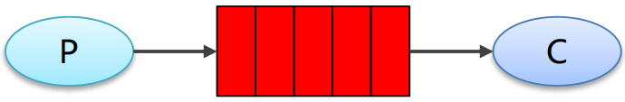</div>

- P：生产者，发送消息的程序
- C：消费者，消息的接收者，会一直等待消息到来
- queue：消息队列，图中红色部分，用于缓存消息；生产者向其中投递消息，消费者从其中取出消息

### WorkQueue

<div align="center">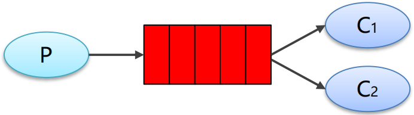</div>

- <b>Work Queues：</b>与入门程序的简单模式相比，多了一个或一些消费端，多个消费端共同消费同一个队列中的消息。在一个队列中如果有多个消费者，那么消费者之间对于同一个消息的关系是竞争的关系。(消息获取的线程安全性由消息队列自身保证吗？)
- <b>应用场景：</b>对于任务过重或任务较多情况使用工作队列可以提高任务处理的速度。

### Public/Sub订阅模式

<div align="center">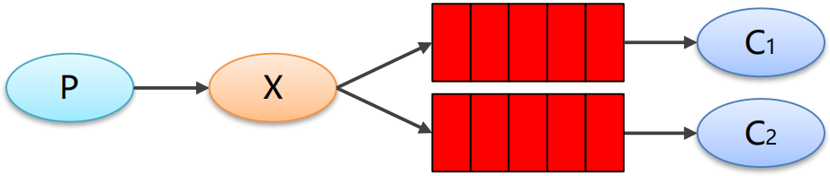</div>

在发布订阅模型中，会分发一个消息给多个消费者，多了一个 Exchange 角色，而且过程略有变化：

- P：生产者，也就是要发送消息的程序，但是不再发送到队列中，而是发给X（交换机）
- C：消费者，消息的接收者，会一直等待消息到来
- Queue：消息队列，接收消息、缓存消息
- Exchange：交换机（X）。一方面，接收生产者发送的消息。另一方面，知道如何处理消息，例如递交给某个特别队列、递交给所有队列、或是将消息丢弃。到底如何操作，取决于 Exchange 的类型。Exchange 有常见以下 3 种类型：
    - Fanout：广播，将消息交给所有绑定到交换机的队列，routing key 为空。
    - Direct：定向，把消息交给符合指定 routing key 的队列
    - Topic：通配符，把消息交给符合 routing pattern（路由模式） 的队列
- Exchange（交换机）只负责转发消息，不具备存储消息的能力，因此如果没有任何队列与 Exchange 绑定，或者没有符合路由规则的队列，那么消息会丢失！

<b>编写逻辑</b>

创建交换机、创建队列，然后将队列和交换机进行绑定。

<b>总结</b>

- 交换机需要与队列进行绑定，绑定之后；一个消息可以被多个消费者都收到。
- 发布订阅模式与工作队列模式的区别
    - 工作队列模式不用定义交换机，而发布/订阅模式需要定义交换机
    - 发布/订阅模式的生产方是面向交换机发送消息，工作队列模式的生产方是面向队列发送消息(底层使用默认交换机)
    - 发布/订阅模式需要设置队列和交换机的绑定，工作队列模式不需要设置，实际上工作队列模式会将队列绑定到默认的交换机

###  Routing路由模式

发布订阅模式是将一个消息发送给多个消费者，而 Routing 路由模式则是可以进行更为细致的发送，如将 error 消息发送给两个消费者，info、warning 这种消息则只发送给一个消费者。

<div align="center">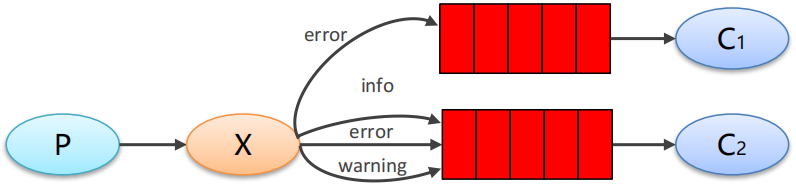</div>

- :orange:<span style="color:orange">队列与交换机的绑定，不能是任意绑定了，而是要指定一个 RoutingKey（路由 key）</span>
- 消息的发送方在向 Exchange 发送消息时，也必须指定消息的 RoutingKey
- Exchange 不再把消息交给每一个绑定的队列，而是根据消息的 Routing Key 进行判断，只有队列的 Routingkey 与消息的 Routing key 完全一致，才会接收到消息

<b>小结</b>

<b>Routing</b> 模式要求队列在绑定交换机时要指定 <b>routing key</b>，消息会转发到符合 routing key 的队列。

### Topics通配符模式

<b>模式说明</b>

- Topic 类型与 Direct 相比，都是可以根据 RoutingKey 把消息路由到不同的队列。只不过 Topic 类型 Exchange 可以让队列在绑定 Routing key 的时候使用<span style="color:red">通配符！</span>
- Routingkey 一般都是有一个或多个单词组成，多个单词之间以 `.` 分割，例如：item.insert 
- 通配符规则：`#` 匹配一个或多个词，`*` 匹配不多不少恰好 1 个词，例如：`item.#` 能够匹配 item.insert.abc 或者 item.insert，`item.*` 只能匹配 item.insert

<div align="center"></div>

- 红色 Queue：绑定的是 `usa.#` ，因此凡是以 `usa.` 开头的 routing key 都会被匹配到

- 黄色 Queue：绑定的是 `#.news` ，因此凡是以 `.news` 结尾的 routing key 都会被匹配

<b>总结</b>

Topic 主题模式可以实现 Pub/Sub 发布与订阅模式和 Routing 路由模式的功能，只是 Topic 在配置 routing key 的时候可以使用通配符，显得更加灵活。

### 工作模式总结

- 简单模式 HelloWorld：一个生产者、一个消费者，不需要设置交换机（使用默认的交换机）。
- 工作队列模式 Work Queue：一个生产者、多个消费者（竞争关系），不需要设置交换机（使用默认的交换机）。
- 发布订阅模式 Publish/subscribe：需要设置类型为 fanout 的交换机，并且交换机和队列进行绑定，当发送消息到交换机后，交换机会将消息发送到绑定的队列。
- 路由模式 Routing：需要设置类型为 direct 的交换机，交换机和队列进行绑定，并且指定 routing key，当发送消息到交换机后，交换机会根据 routing key 将消息发送到对应的队列。
- 通配符模式 Topic：需要设置类型为 topic 的交换机，交换机和队列进行绑定，并且指定通配符方式的 routing key，当发送消息到交换机后，交换机会根据 routing key 将消息发送到对应的队列。

## 导入工程

课前资料提供了一个 Demo 工程，mq-demo:

<div align="center"></div>

导入后可以看到结构如下：

<div align="center"></div>

包括三部分：

- mq-demo：父工程，管理项目依赖
- publisher：消息的发送者
- consumer：消息的消费者

## 入门案例

简单队列模式的模型图：

 <div align="center"></div>

官方的 HelloWorld 是基于最基础的消息队列模型来实现的，只包括三个角色：

- publisher：消息发布者，将消息发送到队列 queue
- queue：消息队列，负责接受并缓存消息
- consumer：订阅队列，处理队列中的消息

导入依赖

```xml
<dependency>
    <groupId>com.rabbitmq</groupId>
    <artifactId>amqp-client</artifactId>
    <version>5.16.0</version>
</dependency>
```

### publisher实现

思路：

- 建立连接
- 创建 Channel
- 声明队列
- 发送消息
- 关闭连接和 Channel

```java
package com.ex.rabbitmq.quick_test;

import com.rabbitmq.client.Channel;
import com.rabbitmq.client.Connection;
import com.rabbitmq.client.ConnectionFactory;
import org.slf4j.Logger;
import org.slf4j.LoggerFactory;

import java.nio.charset.StandardCharsets;

public class PublisherTest {
    static Logger log = LoggerFactory.getLogger("publisher");
    static String queueName = "simple.queue";

    public static void main(String[] args) throws Exception {
        ConnectionFactory factory = new ConnectionFactory();
        factory.setHost("127.0.0.1");
        factory.setPort(5672);
        factory.setUsername("itcast");
        factory.setVirtualHost("/");
        factory.setPassword("123321");
        Connection connection = null;
        Channel channel = null;
        try {
            connection = factory.newConnection();
            log.debug(String.valueOf(connection));
            channel = connection.createChannel();
            // 创建队列（debug 执行完此语句后，队列 simple.queue 队列成功创建）
            channel.queueDeclare(queueName, false, false, false, null);
            for (int i = 0; i < 10; i++) {
                channel.basicPublish("", queueName, null, "hello rabbitmq".getBytes(StandardCharsets.UTF_8));
                log.debug("消息{}发送成功", "hello rabbitmq");
            }
        } finally {
            if (channel != null) {
                channel.close();
            }
            if (connection != null) {
                connection.close();
            }
        }
    }
}
```

### consumer实现

- 建立连接
- 创建 Channel
- 声明队列
- 订阅消息

```java
package com.ex.rabbitmq.quick_test;

import com.rabbitmq.client.*;
import org.slf4j.Logger;
import org.slf4j.LoggerFactory;

import java.io.IOException;
import java.util.concurrent.TimeUnit;
import java.util.concurrent.TimeoutException;

public class ConsumerTest {
    static Logger log = LoggerFactory.getLogger("consumerTest");
    static String queueName = "simple.queue";

    public static void main(String[] args) throws IOException, TimeoutException, InterruptedException {
        // 设置消息队列参数
        ConnectionFactory factory = new ConnectionFactory();
        factory.setHost("127.0.0.1");
        factory.setPort(5672);
        factory.setUsername("itcast");
        factory.setVirtualHost("/");
        factory.setPassword("123321");

        Connection connection = null;
        Channel channel = null;
        try {
            // 建立连接并创建通道
            connection = factory.newConnection();
            channel = connection.createChannel();
            channel.queueDeclare(queueName, false, false, false, null);

            Channel finalChannel = channel;
            // 消费消息
            channel.basicConsume(queueName, new DefaultConsumer(finalChannel) {
                @Override
                public void handleDelivery(String consumerTag, Envelope envelope, AMQP.BasicProperties properties, byte[] body) throws IOException {
                    String message = new String(body);
                    log.debug("接收到消息:{}", message);
                    // 设置 ack 回复，表示接收到了消息
                    finalChannel.basicAck(envelope.getDeliveryTag(), false);
                }
            });
            log.debug("waiting for message");

        } finally {
            TimeUnit.SECONDS.sleep(50);
            channel.close();
            connection.close();
        }
    }
}

```

## 总结

基本消息队列的消息发送流程：

1. 建立 connection

2. 创建 channel

3. 利用 channel 声明队列

4. 利用 channel 向队列发送消息

基本消息队列的消息接收流程：

1. 建立 connection

2. 创建 channel

3. 利用 channel 声明队列

4. 定义 consumer 的消费行为 handleDelivery()

5. 利用 channel 将消费者与队列绑定

# SpringAMQP

SpringAMQP 是基于 RabbitMQ 封装的一套模板，并且还利用 SpringBoot 对其实现了自动装配，使用起来非常方便。

SpringAMQP 的官方地址：https://spring.io/projects/spring-amqp

<div align="center">

<div align="center">

SpringAMQP 提供了三个功能：

- <b>自动声明队列、交换机及其绑定关系</b>
- 基于注解的监听器模式，异步接收消息
- 封装了 RabbitTemplate 工具，用于发送消息 

## Basic Queue 简单队列模型

在父工程 mq-demo 中引入依赖

```xml
<!--AMQP依赖，包含RabbitMQ-->
<dependency>
    <groupId>org.springframework.boot</groupId>
    <artifactId>spring-boot-starter-amqp</artifactId>
</dependency>
```

### 消息发送

首先配置 MQ 地址，在 publisher 服务的 application.yml 中添加配置：

```yaml
spring:
  rabbitmq:
    host: 192.168.150.101 # 主机名
    port: 5672 # 端口
    virtual-host: / # 虚拟主机
    username: itcast # 用户名
    password: 123321 # 密码
```

然后在 publisher 服务中编写测试类 SpringAmqpTest，并利用 RabbitTemplate 实现消息发送：

```java
package cn.itcast.mq.spring;

import org.junit.Test;
import org.junit.runner.RunWith;
import org.springframework.amqp.rabbit.core.RabbitTemplate;
import org.springframework.beans.factory.annotation.Autowired;
import org.springframework.boot.test.context.SpringBootTest;
import org.springframework.test.context.junit4.SpringRunner;

@RunWith(SpringRunner.class)
@SpringBootTest
public class SpringAmqpTest {

    @Autowired
    private RabbitTemplate rabbitTemplate;

    @Test
    public void testSimpleQueue() {
        // 队列名称
        String queueName = "simple.queue";
        // 消息
        String message = "hello, spring amqp!";
        // 发送消息，它怎么注册队列的？
        rabbitTemplate.convertAndSend(queueName, message);
    }
}
```

### 消息接收

首先配置 MQ 地址，在 consumer 服务的 application.yml 中添加配置

```yaml
spring:
  rabbitmq:
    host: 192.168.150.101 # 主机名
    port: 5672 # 端口
    virtual-host: / # 虚拟主机
    username: itcast # 用户名
    password: 123321 # 密码
```

然后在 consumer 服务的 `cn.itcast.mq.listener` 包中新建一个类 SpringRabbitListener，代码如下

```java
package cn.itcast.mq.listener;

import org.springframework.amqp.rabbit.annotation.RabbitListener;
import org.springframework.stereotype.Component;

@Component
public class SpringRabbitListener {

    @RabbitListener(queues = "simple.queue")
    public void listenSimpleQueueMessage(String msg) throws InterruptedException {
        System.out.println("spring 消费者接收到消息：【" + msg + "】");
    }
}
```

### 测试

启动 consumer 服务，然后在 publisher 服务中运行测试代码，发送 MQ 消息

## WorkQueue

Work queues，也被称为（Task queues），任务模型。简单来说就是<b>让多个消费者绑定到一个队列，共同消费队列中的消息</b>。

<div align="center">

<span style="color:orange">当消息处理比较耗时的时候，可能生产消息的速度会远远大于消息的消费速度。长此以往，消息就会堆积越来越多，无法及时处理。此时就可以使用 work 模型，多个消费者共同处理消息处理，速度就能大大提高了。</span>

### 消息发送

这次我们循环发送，模拟大量消息堆积现象。在 publisher 服务中的 SpringAmqpTest 类中添加一个测试方法：

```java
/**
* workQueue
* 向队列中不停发送消息，模拟消息堆积。
*/
@Test
public void testWorkQueue() throws InterruptedException {
    // 队列名称
    String queueName = "simple.queue";
    // 消息
    String message = "hello, message_";
    for (int i = 0; i < 50; i++) {
        // 发送消息
        rabbitTemplate.convertAndSend(queueName, message + i);
        Thread.sleep(20);
    }
}
```

### 消息接收

要模拟多个消费者绑定同一个队列，我们在 consumer 服务的 SpringRabbitListener 中添加 2 个新的方法：

```java
@RabbitListener(queues = "simple.queue") // 绑定到同一个队列中
public void listenWorkQueue1(String msg) throws InterruptedException {
    System.out.println("消费者1接收到消息：【" + msg + "】" + LocalTime.now());
    Thread.sleep(20);
}

@RabbitListener(queues = "simple.queue") // 绑定到同一个队列中
public void listenWorkQueue2(String msg) throws InterruptedException {
    System.err.println("消费者2........接收到消息：【" + msg + "】" + LocalTime.now());
    Thread.sleep(200);
}
```

注意到这个消费者 sleep 了 1000 秒，模拟任务耗时。

### 测试

启动 ConsumerApplication 后，在执行 publisher 服务中刚刚编写的发送测试方法 testWorkQueue。可以看到消费者 1 很快完成了自己的 25 条消息。消费者 2 却在缓慢的处理自己的 25 条消息。也就是说消息是平均分配给每个消费者，并没有考虑到消费者的处理能力。这样显然是有问题的。

### 能者多劳

在 Spring 中有一个简单的配置，可以解决这个问题。我们修改 consumer 服务的 application.yml 文件，添加配置：

```yaml
spring:
  rabbitmq:
    listener:
      simple:
        prefetch: 1 # 每次只能获取一条消息，处理完成才能获取下一个消息
```

### 总结

Work 模型的使用：

- 多个消费者绑定到一个队列，同一条消息只会被一个消费者处理
- 通过设置 prefetch 来控制消费者预取的消息数量

## 发布/订阅

发布订阅的模型如图：

<div align="center"></div>

可以看到，在订阅模型中，多了一个 exchange 角色，而且过程略有变化：

- Publisher：生产者，也就是要发送消息的程序，但是不再发送到队列中，而是发给 X（交换机）
- Exchange：交换机，图中的 X。一方面，接收生产者发送的消息。另一方面，知道如何处理消息，例如递交给某个特别队列、递交给所有队列、或是将消息丢弃。到底如何操作，取决于 Exchange 的类型。
- <b style="color:red">Exchange 有以下 3 种类型：</b>
  - <span style="color:orange">Fanout：广播，将消息交给所有绑定到交换机的队列</span>
  - <span style="color:orange">Direct：定向，把消息交给符合指定 routing key 的队列</span>
  - <span style="color:orange">Topic：通配符，把消息交给符合 routing pattern（路由模式） 的队列</span>
- Consumer：消费者，与以前一样，订阅队列，没有变化
- Queue：消息队列也与以前一样，接收消息、缓存消息。

<b style="color:red">Exchange（交换机）只负责转发消息，不具备存储消息的能力</b>，因此如果没有任何队列与 Exchange 绑定，或者没有符合路由规则的队列，那么消息会丢失！

## Fanout

Fanout，英文翻译是扇出，我觉得在 MQ 中叫广播更合适。

<div align="center"></div>

在广播模式下，消息发送流程是这样的：

- 1）  可以有多个队列
- 2）  每个队列都要绑定到 Exchange（交换机）
- 3）  生产者发送的消息，只能发送到交换机，交换机来决定要发给哪个队列，生产者无法决定
- 4）  交换机把消息发送给绑定过的所有队列
- 5）  订阅队列的消费者都能拿到消息

我们的计划是这样的：

- 创建一个交换机 itcast.fanout，类型是 Fanout
- 创建两个队列 fanout.queue1 和 fanout.queue2，绑定到交换机 itcast.fanout

<div align="center"></div>

### 声明队列和交换机

Spring 提供了一个接口 Exchange，来表示所有不同类型的交换机：

<div align="center"></div>

在 consumer 中创建一个类，声明队列和交换机：

```java
package cn.itcast.mq.config;

import org.springframework.amqp.core.Binding;
import org.springframework.amqp.core.BindingBuilder;
import org.springframework.amqp.core.FanoutExchange;
import org.springframework.amqp.core.Queue;
import org.springframework.context.annotation.Bean;
import org.springframework.context.annotation.Configuration;

@Configuration
public class FanoutConfig {
    /**
     * 声明交换机
     * @return Fanout类型交换机
     */
    @Bean
    public FanoutExchange fanoutExchange(){
        return new FanoutExchange("itcast.fanout");
    }

    // 第1个队列
    @Bean
    public Queue fanoutQueue1(){
        return new Queue("fanout.queue1");
    }

    // 绑定队列和交换机
    @Bean
    public Binding bindingQueue1(Queue fanoutQueue1, FanoutExchange fanoutExchange){
        return BindingBuilder.bind(fanoutQueue1).to(fanoutExchange);
    }

    // 第2个队列
    @Bean
    public Queue fanoutQueue2(){
        return new Queue("fanout.queue2");
    }

    // 绑定队列和交换机
    @Bean
    public Binding bindingQueue2(Queue fanoutQueue2, FanoutExchange fanoutExchange){
        return BindingBuilder.bind(fanoutQueue2).to(fanoutExchange);
    }
}
```

### 消息发送

在 publisher 服务的 SpringAmqpTest 类中添加测试方法：

```java
@Test
public void testFanoutExchange() {
    // 队列名称
    String exchangeName = "itcast.fanout";
    // 消息
    String message = "hello, everyone!";
    rabbitTemplate.convertAndSend(exchangeName, "", message);
}
```

### 消息接收

在 consumer 服务的 SpringRabbitListener 中添加两个方法，作为消费者：

```java
@RabbitListener(queues = "fanout.queue1")
public void listenFanoutQueue1(String msg) {
    System.out.println("消费者1接收到Fanout消息：【" + msg + "】");
}

@RabbitListener(queues = "fanout.queue2")
public void listenFanoutQueue2(String msg) {
    System.out.println("消费者2接收到Fanout消息：【" + msg + "】");
}
```

### 总结

交换机的作用是什么？

- 接收 publisher 发送的消息
- 将消息按照规则路由到与之绑定的队列
- 不能缓存消息，路由失败，消息丢失
- FanoutExchange 的会将消息路由到每个绑定的队列

声明队列、交换机、绑定关系的 Bean 是什么？

- Queue
- FanoutExchange
- Binding

## Direct

在 Fanout 模式中，一条消息，会被所有订阅的队列都消费。但是，在某些场景下，我们希望不同的消息被不同的队列消费。这时就要用到 Direct 类型的 Exchange。

<div align="center"></div>

 <b>在 Direct 模型下</b>

- 队列与交换机的绑定，不能是任意绑定了，而是要指定一个`RoutingKey`（路由 key）
- 消息的发送方在，向 Exchange 发送消息时，也必须指定消息的 `RoutingKey`。
- Exchange 不再把消息交给每一个绑定的队列，而是根据消息的 `Routing Key` 进行判断，只有队列的 `Routingkey` 与消息的 `Routing key` 完全一致，才会接收到消息

<b>案例需求如下</b>

1. 利用 @RabbitListener 声明 Exchange、Queue、RoutingKey

2. 在 consumer 服务中，编写两个消费者方法，分别监听 direct.queue1 和 direct.queue2

3. 在 publisher 中编写测试方法，向 itcast.direct 发送消息

<div align="center"></div>

### 基于注解声明队列和交换机

基于 @Bean 的方式声明队列和交换机比较麻烦，Spring 还提供了基于注解方式来声明。在 consumer 的 SpringRabbitListener 中添加两个消费者，同时基于注解来声明队列和交换机：

```java
@RabbitListener(bindings = @QueueBinding(
    value = @Queue(name = "direct.queue1"),
    exchange = @Exchange(name = "itcast.direct", type = ExchangeTypes.DIRECT),
    key = {"red", "blue"}
))
public void listenDirectQueue1(String msg){
    System.out.println("消费者接收到direct.queue1的消息：【" + msg + "】");
}

@RabbitListener(bindings = @QueueBinding(
    value = @Queue(name = "direct.queue2"),
    exchange = @Exchange(name = "itcast.direct", type = ExchangeTypes.DIRECT),
    key = {"red", "yellow"}
))
public void listenDirectQueue2(String msg){
    System.out.println("消费者接收到direct.queue2的消息：【" + msg + "】");
}
```

### 消息发送

在 publisher 服务的 SpringAmqpTest 类中添加测试方法：

```java
@Test
public void testSendDirectExchange() {
    // 交换机名称
    String exchangeName = "itcast.direct";
    // 消息
    String message = "红色警报！日本乱排核废水，导致海洋生物变异，惊现哥斯拉！";
    // 发送消息
    rabbitTemplate.convertAndSend(exchangeName, "red", message);
}
```

### 总结

描述下 Direct 交换机与 Fanout 交换机的差异？

- Fanout 交换机将消息路由给每一个与之绑定的队列
- Direct 交换机根据 RoutingKey 判断路由给哪个队列
- 如果多个队列具有相同的 RoutingKey，则与 Fanout 功能类似

基于 @RabbitListener 注解声明队列和交换机有哪些常见注解？

- @Queue
- @Exchange

## Topic

### 说明

`Topic` 类型的 `Exchange` 与 `Direct` 相比，都是可以根据 `RoutingKey` 把消息路由到不同的队列。只不过 `Topic` 类型 `Exchange` 可以让队列在绑定 `Routing key` 的时候使用通配符！

`Routingkey` 一般都是有一个或多个单词组成，多个单词之间以 `.` 分割，例如： `item.insert`

 通配符规则：

`#`：匹配一个或多个词

`*`：匹配不多不少恰好 1 个词

举例：

`item.#`，能够匹配 `item.spu.insert` 或者 `item.spu`

`item.*`，只能匹配 `item.spu`

图示：

<div align="center"></div>

- Queue1：绑定的是 `china.#` ，因此凡是以 `china.` 开头的 `routing key` 都会被匹配到。包括 china.news 和 china.weather
- Queue2：绑定的是 `#.news` ，因此凡是以 `.news` 结尾的 `routing key` 都会被匹配。包括 china.news 和 japan.news

案例需求：

xxxxxx

实现思路如下：

1. 并利用 @RabbitListener 声明 Exchange、Queue、RoutingKey

2. 在 consumer 服务中，编写两个消费者方法，分别监听 topic.queue1 和 topic.queue2

3. 在 publisher 中编写测试方法，向 itcast. topic 发送消息

<div align="center">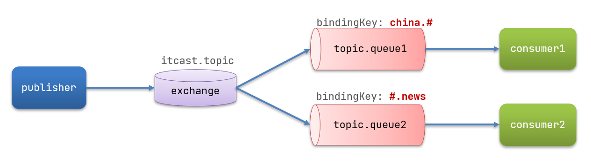</div>

### 消息发送

在 publisher 服务的 SpringAmqpTest 类中添加测试方法：

```java
/**
 * topicExchange
 */
@Test
public void testSendTopicExchange() {
    // 交换机名称
    String exchangeName = "itcast.topic";
    // 消息
    String message = "喜报！孙悟空大战哥斯拉，胜!";
    // 发送消息
    rabbitTemplate.convertAndSend(exchangeName, "china.news", message);
}
```

### 消息接收

在 consumer 服务的 SpringRabbitListener 中添加方法：

```java
@RabbitListener(bindings = @QueueBinding(
    value = @Queue(name = "topic.queue1"),
    exchange = @Exchange(name = "itcast.topic", type = ExchangeTypes.TOPIC),
    key = "china.#"
))
public void listenTopicQueue1(String msg){
    System.out.println("消费者接收到topic.queue1的消息：【" + msg + "】");
}

@RabbitListener(bindings = @QueueBinding(
    value = @Queue(name = "topic.queue2"),
    exchange = @Exchange(name = "itcast.topic", type = ExchangeTypes.TOPIC),
    key = "#.news"
))
public void listenTopicQueue2(String msg){
    System.out.println("消费者接收到topic.queue2的消息：【" + msg + "】");
}
```

### 总结

描述下 Direct 交换机与 Topic 交换机的差异？

- Topic 交换机接收的消息 RoutingKey 必须是多个单词，以 `*.*` 分割
- Topic 交换机与队列绑定时的 bindingKey 可以指定通配符
- `#`：代表 0 个或多个词
- `*`：代表 1 个词

## 消息转换器

之前说过，Spring 会把你发送的消息序列化为字节发送给 MQ，接收消息的时候，还会把字节反序列化为 Java 对象。

<div align="center"></div>

只不过，默认情况下 Spring 采用的序列化方式是 JDK 序列化。众所周知，JDK 序列化存在下列问题：

- 数据体积过大
- 有安全漏洞
- 可读性差

我们来测试一下。

### 测试默认转换器

我们修改消息发送的代码，发送一个 Map 对象：

```java
@Test
public void testSendMap() throws InterruptedException {
    // 准备消息
    Map<String,Object> msg = new HashMap<>();
    msg.put("name", "Jack");
    msg.put("age", 21);
    // 发送消息
    rabbitTemplate.convertAndSend("simple.queue","", msg);
}
```

停止 consumer 服务

发送消息后查看控制台：

<div align="center"></div>

### 配置JSON转换器

显然，JDK 序列化方式并不合适。我们希望消息体的体积更小、可读性更高，因此可以使用 JSON 方式来做序列化和反序列化。

在 publisher 和 consumer 两个服务中都引入依赖：

```xml
<dependency>
    <groupId>com.fasterxml.jackson.dataformat</groupId>
    <artifactId>jackson-dataformat-xml</artifactId>
    <version>2.9.10</version>
</dependency>
```

配置消息转换器。

在启动类中添加一个 Bean 即可：

```java
@Bean
public MessageConverter jsonMessageConverter(){
    return new Jackson2JsonMessageConverter();
}
```

# RabbitMQ高级特性

- 高级特性
    - 消息可靠性投递
    - Consumer ACK
    - 消费端限流
    - TTL
    - 死信队列
    - 延迟队列
    - 日志与监控
    - 消息可靠性分析与追踪
    - 管理
- 应用问题
    - 消息可靠性保障
    - 消息幂等性处理
- 集群搭建
    - RabbitMQ 高可用集群

## 高级特性

### 消息可靠性投递

在使用 RabbitMQ 的时候，作为消息发送方希望杜绝任何消息丢失或者投递失败场景。RabbitMQ 为我们提供了两种方式用来控制消息的投递可靠性模式。

- confirm 确认模式，producer --> exchange 的确认模式，producer 发送消息后可以对发送方设置一个 confirmCallback 监听，然后将来消息达到/不到达 exchange 都会被执行，告诉 producer 消息投递的结果。
- return 退回模式，exchange-->queue 的回退模式，投递失败则会返回一个 returnCallback，告诉 exchange 自己是否接收到了消息。

rabbitmq 消息投递的路径：

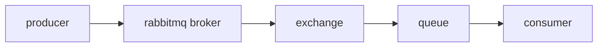

- 消息从 producer 到 exchange 则会返回一个 confirmCallback，不管消息是否成功到达 exchange，都会调用 confirmCallback，成功则返回 true，失败则返回 false。
- 消息从 exchange-->queue 投递失败则会返回一个 returnCallback，不管消息是否成功到达 exchange，都会调用 returnCallback，成功则返回 true，失败则返回 false。

我们可以利用这两个 callback 控制消息的可靠性投递。

<b>代码编写逻辑</b>

配置文件中开启确认模式

```yml
# 旧版本 开启 confirm 确认模式
# publisher-confirms: true

# 新版的开启 confirm 确认模式
publisher-confirm-type: correlated
# 开启 return 退回模式
publisher-returns: true
```

- 使用 rabbitTemplate.setConfirmCallback 设置回调函数。当消息发送到 exchange 后回调 confirm 方法。在方法中判断 ack，如果为 true，则发送成功，如果为 false，则发送失败，需要处理。
- 使用 rabbitTemplate.setReturnCallback 设置退回函数，当消息从 exchange 路由到 queue 失败后，如果设置了 rabbitTemplate.setMandatory(true) 参数【这点需要测试下】，则会将消息退回给 producer。并执行回调函数 returnedMessage。

```java
/**
* 确认模式: 该模式是来校验消息是否发送成功到交换机中
* 步骤:
* 1.确认开启: publisher-confirm-type: none
* 2.在rabbitTemplate定义一个confirmCallBack回调函数
*/
@Test
public void testConfirm(){

    //使用rabbitTemplate的确认回调方法
    rabbitTemplate.setConfirmCallback(new RabbitTemplate.ConfirmCallback() {
        /**
		 * @param correlationData 相关的配置信息
         * @param ack 代表了Exchange交换机是否收到了消息,true表示收到了消息,false表示交换机没有收到消息
         * @param cause 失败的原因
         */
        @Override
        public void confirm(CorrelationData correlationData, boolean ack, String cause) {

            System.out.println("发送消息后,回调方法执行了~~~");

            if (ack){
                System.out.println("发送消息成功,启动成功方案:"+cause);
            }else {
                System.out.println("发送消息失败,启动失败方案:"+cause);
            }
        }
    });

    //发送消息,假设写错交换机的名称,肯定会发送到Exchange失败,就会执行我们的confirmCallBack回调方法
    rabbitTemplate.convertAndSend("test_Exchange_Confirm","testConfirm","测试Confirm确认模式~~~");
}

/**
* 回退模式: 该模式是用来校验该消息是否从Exchange交换机成功路由到了queue队列中
* 当Exchange路由到queue失败后,就会执行这个ReturnCallBack方法
*
* 步骤:
* 1.开启回退模式: publisher-returns: true
* 2.设置ReturnCallBack
* 3,设置Exchange处理的消息的模式
* 1.如果消息没有路由到Queue中,则丢弃消息(默认)
* 2.如果消息没有路由到Queue中,返回给消息到发送方的ReturnCallBack方法
*/
@Test
public void testReturn() {

    // 设置ReturnCallback
    rabbitTemplate.setReturnCallback(new RabbitTemplate.ReturnCallback() {

        /**
         * @param message   消息对象
         * @param replyCode 错误码
         * @param replyText 错误信息
         * @param exchange  交换机
         * @param routingKey 路由键
         */
        @Override
        public void returnedMessage(Message message, int replyCode, String replyText, String exchange, String routingKey) {

            // 当我们的消息发送从Exchange交换机发送到Queue错误后就会执行这个回调方法
            System.out.println("ReturnCallBack 执行了~~~");
            System.out.println(message);
            System.out.println(replyCode);
            System.out.println(replyText);
            System.out.println(exchange);
            System.out.println(routingKey);
        }
    });

    /*
    发送消息,
     测试1: 使用正确的Exchange与routingKey执行成功,不会执行我们的ReturnCallBack回退方法
     测试2: 使用正确的Exchange与错误的不存在的routingKey,就会执行我们的ReturnCallBack回退方法
    */
    rabbitTemplate.convertAndSend("test_Exchange_Confirm", "testConfirm111", "testConfirm~~~发送消息,测试回退模式");
}
```

### 消息确认ack

ack 指 Acknowledge，确认。 表示消费端收到消息后的确认方式。一共有有三种确认方式：

- 自动确认：acknowledge="none"
- 手动确认：acknowledge="manual"
- 根据异常情况确认：acknowledge="auto"，（这种方式使用麻烦，不常用）

其中自动确认是指，当消息一旦被 Consumer 接收到，则自动确认收到，并将相应 message 从 RabbitMQ 的消息缓存中移除。<span style="color:orange">但是在实际业务处理中，很可能消息接收到，业务处理出现异常，那么该消息就会丢失。</span>如果设置了手动确认方式，则需要在业务处理成功后，调用 channel.basicAck()，手动签收，如果出现异常，则调用 channel.basicNack() 方法，让其自动重新发送消息。

<b>代码编写逻辑</b>

编写配置文件

```yml
listener:
  # RabbitMQ模式使用simple  simple支持事务的
  simple:
    # Consumer ACK机制：设置为手动签收
    acknowledge-mode: manual
    prefetch: 1 # 限流,配置1 表示消费端每次向MQ拉取最大一条消息
```

在消费的创建监听类，并在方法上使用注解 `@RabbitListener(queues="队列名称")` 监听队列。

```java
import com.rabbitmq.client.Channel;
import org.springframework.amqp.core.Message;
import org.springframework.amqp.rabbit.annotation.RabbitListener;
import org.springframework.stereotype.Component;

import java.io.IOException;

/**
 * Consumer ACK机制：默认自动签收
 *  1. 设置手动签收。acknowledge="manual"
 *  2. 让监听器类实现ChannelAwareMessageListener接口
 *  3. 如果消息成功处理，则调用channel的 basicAck()签收
 *  4. 如果消息处理失败，则调用channel的basicNack()拒绝签收，broker重新发送给consumer
 */
@Component
public class AckListener {

    @RabbitListener(queues = "test_Queue_Confirm")
    public void testAck(Message message, Channel channel) throws IOException {
        //得到消息的唯一deliveryTag
        long deliveryTag = message.getMessageProperties().getDeliveryTag();

        //模拟接收到消息消费的逻辑
        try{
            //接收到消息进行消费
            System.out.println(new String(message.getBody()));
            System.out.println("消息到了ACK机制中~~~");

            // 模拟执行逻辑错误
			// int i = 1/0;

            // 手动签收消息
            /*
            	deliveryTag：表示收到的消息的参数标签(消息的唯一id)
            	第二个参数：是否签收多条消息(批量签收消息)
             */
            channel.basicAck(deliveryTag,true);
        }catch (Exception e){
            //当我们上面的逻辑出现错误,就不会签收消息,我们在catch中就执行拒绝签收
            System.out.println("消费逻辑出现异常~~~消息被Ack机制重回队列");
            //拒绝签收
            /*
            第三个参数：requeue：重回队列。如果设置为true，则消息重新回到queue的尾部，broker会重新发送该消息给消费端,false为丢弃改消息,若设置了死信队列,就会交给死信队列
             */
            channel.basicNack(deliveryTag,true,false);
        }
    }
}
```

- 在 `rabbit:listener-container` 标签中设置 `acknowledge` 属性，设置 ack 方式 none：自动确认，manual：手动确认
- 如果在消费端没有出现异常，则调用 channel.basicAck(deliveryTag,false); 方法确认签收消息
- 如果出现异常，则在 catch 中调用 basicNack 或 basicReject，拒绝消息，让 MQ 重新发送消息。

<b>消息可靠性总结</b>

- 持久化
    - exchange 要持久化
    - queue 要持久化
    - message 要持久化
- 生产方确认 Confirm
- 消费方确认 Ack
- Broker 高可用

### 消费端限流

<div align="center"></div>

进行限量的时候，确认 ack 的设置要设置成手动确认，配置限流的方式和<span style="color:red">“消息确认 ack” </span>一样。

```yml
listener:
  # RabbitMQ模式使用simple  simple支持事务的
  simple:
    # Consumer ACK机制：设置为手动签收
    acknowledge-mode: manual
    prefetch: 1 # 限流,配置1 表示消费端每次向MQ拉取最大一条消息
```

### TTL

TTL 全称 Time To Live（存活时间/过期时间）。当消息到达存活时间后，还没有被消费，会被自动清除。RabbitMQ 可以对消息设置过期时间，也可以对整个队列（Queue）设置过期时间。

<div align="center">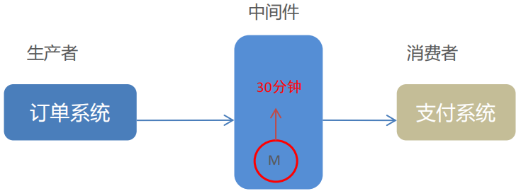</div>

- 设置队列过期时间使用参数：x-message-ttl，单位：ms(毫秒)，<b>会对整个队列消息统一过期。（如果 0 分钟来了一个消息，5 分钟来了一个消息，队列同意过期时间是 10 分钟，那么 5 分钟进来的这个消息也会过期吗？）</b>
- 设置消息过期时间使用参数：expiration。单位：ms(毫秒)，<b>当该消息在队列头部时（消费时），会单独判断这一消息是否过期。</b>
- 如果两者都进行了设置，以时间短的为准。

<b>代码编写逻辑</b>

更改下配置文件的逻辑即可

```java
import org.springframework.amqp.core.*;
import org.springframework.beans.factory.annotation.Qualifier;
import org.springframework.context.annotation.Bean;
import org.springframework.context.annotation.Configuration;

// 测试RabbitMQ的TTL
@Configuration
public class RabbitMQConfigTTL {

    //创建交换机
    @Bean
    public Exchange exchangeTtl(){
        //创建一个Topic：通配符，把消息交给符合routing pattern（路由模式） 的队列 的交换机
        return ExchangeBuilder.topicExchange("test_Exchange_TTL").build();
    }

    //创建队列
    @Bean
    public Queue queueTtl(){
        //创建一个队列,设置队列中消息过期时间为10秒（队列中所有的消息，如果超过10秒没有消费，都会过期）
        return QueueBuilder.durable("test_Queue_TTL").withArgument("x-message-ttl",10000).build();
    }

    //绑定交换机与队列
    @Bean
    public Binding bindingTtl(@Qualifier("exchangeTtl") Exchange exchange, @Qualifier("queueTtl") Queue queue){
        //将队列绑定在topic通配符交换机上设置路由规则routingKey,没有参数
        return BindingBuilder.bind(queue).to(exchange).with("ttl.#").noargs();
    }
}
```

消息的单独过期则是在发送消息的时候设置

```java
 public class TestSingleMessageTTL{
	/**
     * TTL:过期时间
     * 1. 队列统一过期
     * 2. 消息单独过期
     * 结果:
     * 如果设置了消息的过期时间，也设置了队列的过期时间，它以时间短的为准。
     * 队列过期后，会将队列所有消息全部移除。
     * 消息过期后，只有消息在队列顶端，才会判断其是否过期(移除掉)
     */
    @Test
    public void testTTL(){
        //* 1. 队列统一过期
        //发送10条消息,不去消费,查看web控制台10秒后这10条消息是否会被丢弃
//        for (int i = 0; i < 10; i++) {
//            //调用方法
//            rabbitTemplate.convertAndSend("test_Exchange_TTL","ttl.hehe.xf","测试TTL超时时间队列消息发送~~~"+i);
//        }


        //* 2. 消息单独过期
        // 消息后处理对象，设置一些消息的参数信息,发送消息的时候传递该参数,那么这些消息就会具有该参数
        //该对象是一个接口,使用匿名类部内来创建实现类
        MessagePostProcessor messagePostProcessor = new MessagePostProcessor() {

            //设置发送消息的参数
            @Override
            public Message postProcessMessage(Message message) throws AmqpException {
                message.getMessageProperties().setExpiration("5000");//设置消息过期时间为5秒
                return message;
            }
        };

        // 再次发生一条消息,使用我们设置好的消息参数对消息进行封装
        // 发送成功后,去看我们的队列中的这条消息是否是5秒过期,因为我们这个消息是在队列的顶端,等待被消费,而且过期时间短于队列统一时间,所以优先我们这单条消息过期时间
		// rabbitTemplate.convertAndSend("test_Exchange_TTL","ttl.hehe.fs","我被使用了消息参数,5秒后过期~~~",messagePostProcessor);


        //我们再次极端的测试,让我们这条消息不在队列的顶端

        //这条i==5的消息设置5秒过期,但是他在队列的中间,5秒后已经过期,但是不会被队列移除掉,当队列统一的过期时间到了,就会随着统一被队列丢弃 或者交给死信交换机
        //因为队列只会移除队列顶端的过期消息,例如当有消费者来消费这10条消息后,但是i=5这条消息
        //已经过期,当消费到这条消息时,它就在队列的顶端,就会判断该消息是否过期,
        //若过期,者就会移除,或者交给 死信交换机
        //不会发送给消费者消费的
        for (int i = 0; i < 10; i++) {
            if (i == 5) {
                //消息单独过期
                rabbitTemplate.convertAndSend("test_Exchange_TTL", "ttl.hehe.xf", "我被使用了消息参数,5秒后过期~~~而且在队列的中间,我会不会5秒后过期呢?", messagePostProcessor);
            } else {
                //不过期的消息
                rabbitTemplate.convertAndSend("test_Exchange_TTL", "ttl.hehe.xf", "我发送了消息....");
            }
        }
    }
 }
```

### 死信队列

其他 MQ 产品中没有交换机的概念，有的是死信队列的概念，因此这里用死信队列。

死信队列，英文缩写：DLX 。Dead Letter Exchange（死信交换机），当消息成为 Dead message 后，可以被重新发送到另一个交换机，这个交换机就是 DLX。DLX 也会绑定一个 queue，然后让其他消费者进行消费消息。

<div align="center">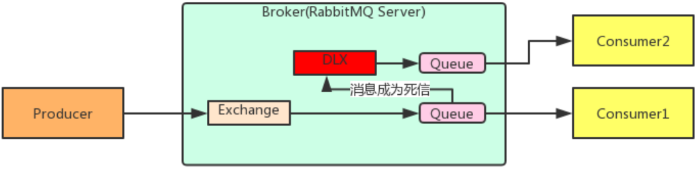</div>

<b>消息成为死信的三种情况</b>

- 队列消息长度到达限制；
- 消费者拒接消费消息，basicNack/basicReject, 并且不把消息重新放入原目标队列, requeue=false；
- 原队列存在消息过期设置，消息到达超时时间未被消费；

<b>队列绑定死信交换机</b>

- 给队列设置参数：x-dead-letter-exchange 和 x-dead-letter-routing-key

<b>代码逻辑</b>

死信队列：

- 声明正常的队列 (test_queue_dlx) 和正常交换机 (test_exchange_dlx)

- 声明死信队列 (queue_dlx) 和死信交换机 (exchange_dlx)

- 正常队列绑定死信交换机

- 设置两个参数：

    * x-dead-letter-exchange：死信交换机名称

    * x-dead-letter-routing-key：发送给死信交换机的 routingkey

```java
import org.springframework.amqp.core.*;
import org.springframework.beans.factory.annotation.Qualifier;
import org.springframework.context.annotation.Bean;
import org.springframework.context.annotation.Configuration;

import java.util.HashMap;
import java.util.Map;

/*
死信队列：
	1. 声明正常的队列(test_queue_dlx)和正常交换机(test_exchange_dlx)
	2. 声明死信队列(queue_dlx)和死信交换机(exchange_dlx)
    3. 正常队列绑定死信交换机
    	设置两个参数：
        	* x-dead-letter-exchange：死信交换机名称
        	* x-dead-letter-routing-key：发送给死信交换机的routingkey
 */
@Configuration
public class RabbitMQDeadMessageConfig {

    //创建自定义 死信交换机  逻辑认为是用来做死信服务的
    @Bean
    public Exchange exchangeDlx(){
        return ExchangeBuilder.topicExchange("exchange_del").build();
    }

    //创建自定义 死信队列  逻辑认为是用来做死信服务的
    @Bean
    public Queue queueDlx(){
        return QueueBuilder.durable("queue_dlx").build();
    }

    //将自定义的死信队列绑定在一块
    @Bean
    public Binding bindingDlx(@Qualifier("exchangeDlx") Exchange exchange,@Qualifier("queueDlx") Queue queue){
        return BindingBuilder.bind(queue).to(exchange).with("dlx.*").noargs();
    }

    //创建正常接收消息的交换机
    @Bean
    public Exchange exchangeNormalDlx(){
        return ExchangeBuilder.topicExchange("exchange_Normal_DLX").build();
    }

    //创建正常接收消息的队列,绑定我们的死信交换机
    @Bean
    public Queue queueNormalDlx(){
        return QueueBuilder.durable("queue_Normal_DLX")//正常队列的名称
                .withArgument("x-dead-letter-exchange","exchange_del")//设置改队列的死信交换机
                .withArgument("x-dead-letter-routing-key","dlx.xf")//设置该队列的发送消息时指定的routingkey
                .withArgument("x-message-ttl",10000)//设置队列中消息的过期时间
                .withArgument("x-max-length",10).build();//设置队列的最大容量
    }

    //将正常的交换机与队列绑定
    @Bean
    public Binding bindingNormalDlx(@Qualifier("exchangeNormalDlx") Exchange exchange,@Qualifier("queueNormalDlx") Queue queue){
        return BindingBuilder.bind(queue).to(exchange).with("test.dlx.#").noargs();
    }
}
```

测试代码在先前代码的基础上修改即可。

### 延迟队列

延迟队列，即消息进入队列后不会立即被消费，只有到达指定时间后，才会被消费。

查看下面的需求：

- 下单后，30 分钟未支付，取消订单，回滚库存（把该用户抢的库存加回去）。
- 新用户注册成功 7 天后，发送短信问候。

实现方式：

- 定时器，实现不优雅，需要设置时间定期执行任务，存在一定的误差，时间短了会耗费系统资源，时间长了误差又大。
- 延迟队列，实现优雅，每条消息只需要执行一次任务，开销也很小。

如果采用定时器完成判断用户是否支付的操作，需要定期执行查询操作，查询用户是否支付了，开销大；如果采用延迟队列的方式，每条消息只需要查询一次即可。

<div align="center">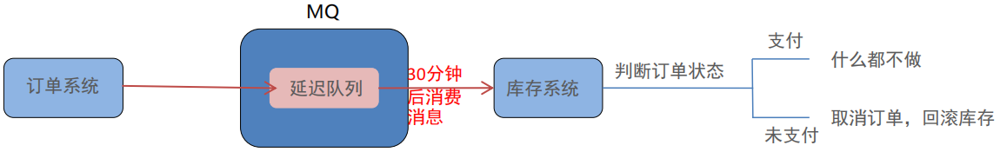</div>

很可惜。RabbitMQ 没有提供延迟队列的功能。但是可以用：<b style="color:red">TTL+死信队列</b>组合实现延迟队列的效果。

## 日志与监控

RabbitMQ 默认日志存放路径： /var/log/rabbitmq/rabbit@xxx.log。日志包含了 RabbitMQ 的版本号、Erlang 的版本号、RabbitMQ 服务节点名称、cookie 的 hash 值、
RabbitMQ 配置文件地址、内存限制、磁盘限制、默认账户 guest 的创建以及权限配置等等。

<b>常用命令</b>

- 查看队列 # rabbitmqctl list_queues
- 查看 exchanges # rabbitmqctl list_exchanges
- 查看用户 # rabbitmqctl list_users
- 查看连接 # rabbitmqctl list_connections
- 查看消费者信息 # rabbitmqctl list_consumers
- 查看环境变量 # rabbitmqctl environment
- 查看未被确认的队列 # rabbitmqctl list_queues name messages_unacknowledged
- 查看单个队列的内存使用 # rabbitmqctl list_queues name memory
- 查看准备就绪的队列 # rabbitmqctl list_queues name messages_ready

## 消息追踪

消息追踪：用于跟踪记录消息的投递过程，协助开发和运维人员进行问题定位。

在使用任何消息中间件的过程中，难免会出现某条消息异常丢失的情况。对于 RabbitMQ 而言，可能是因为生产者或消费者与 RabbitMQ 断开了连接，而它们与 RabbitMQ 又采用了不同的确认机制；也有可能是因为交换器与队列之间不同的转发策略；甚至是交换器并没有与任何队列进行绑定，生产者又不感知或者没有采取相应的措施；另外 RabbitMQ 本身的集群策略也可能导致消息的丢失。这个时候就需要有一个较好的机制跟踪记录消息的投递过程，以此协助开发和运维人员进行问题的定位。

<b>在 RabbitMQ 中可以使用 Firehose 和 rabbitmq_tracing 插件功能来实现消息追踪。</b>

firehose 的机制是将生产者投递给 rabbitmq 的消息，rabbitmq 投递给消费者的消息按照指定的格式发送到默认的 exchange 上。这个默认的 exchange 的名称为 amq.rabbitmq.trace，它是一个 topic 类型的 exchange。发送到这个 exchange 上的消息的 routing key 为 publish.exchangename 和 deliver.queuename。其中 exchangename 和 queuename 为实际 exchange 和 queue 的名称，分别对应生产者投递到 exchange 的消息，和消费者从 queue 上获取的消息。

## 应用问题

- 消息可靠性保障：消息补偿机制
- 消息幂等性保障：乐观锁解决方案

### 消息补偿

<div align="center">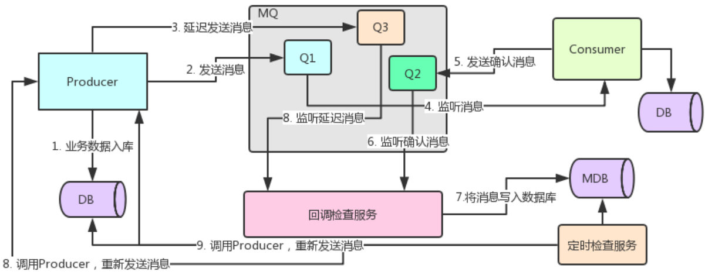</div>

### 消息幂等性

幂等性指一次和多次请求某一个资源，对于资源本身应该具有同样的结果。也就是说，其任意多次执行对资源本身所产生的影响均与一次执行的影响相同。<b>在 MQ 中指，消费多条相同的消息，得到与消费该消息一次相同的结果。</b>

<div align="center"></div>

用数据库的乐观锁来保证消息的幂等性。
