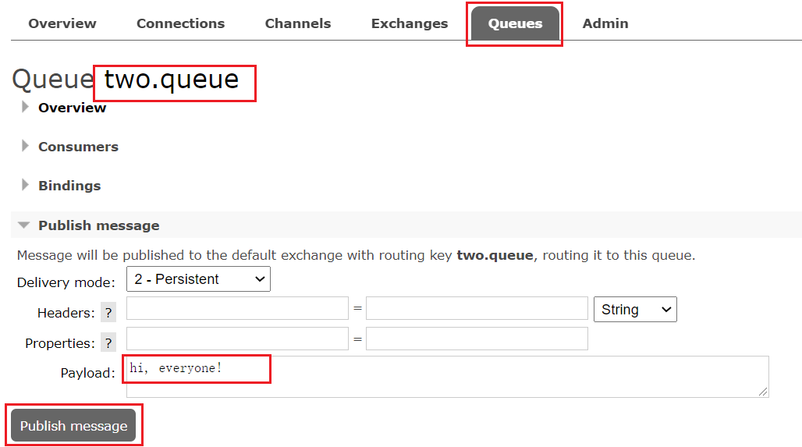
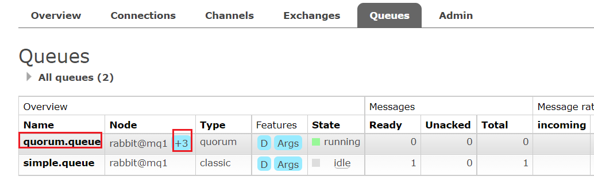

# RabbitMQ部署指南

# 单机部署

在 wsl 中使用 Docker 来安装。

## 下载镜像

方式一：在线拉取

``` shell
docker pull rabbitmq:3-management
```

方式二：从本地加载，使用命令加载镜像

```sh
docker load -i mq.tar
```

## 安装MQ

执行下面的命令来运行 MQ 容器

```sh
docker run \
 -e RABBITMQ_DEFAULT_USER=payphone \
 -e RABBITMQ_DEFAULT_PASS=123321 \
 --name mq \
 --hostname mq1 \
 -p 15672:15672 \ # 管理信息页面
 -p 5672:5672 \  # 通信端口
 -d \
 rabbitmq:3-management
```

# 安装DelayExchane插件

官方的安装指南地址为：https://blog.rabbitmq.com/posts/2015/04/scheduling-messages-with-rabbitmq

上述文档是基于 linux 原生安装 RabbitMQ，然后安装插件。

因为我们之前是基于 Docker 安装 RabbitMQ，所以是基于 Docker 来安装 RabbitMQ 插件。

## 下载插件

RabbitMQ 有一个官方的插件社区，地址为：https://www.rabbitmq.com/community-plugins.html

其中包含各种各样的插件，包括我们要使用的 DelayExchange 插件。

可以去对应的 GitHub 页面下载 3.9.0 版本的插件，地址为 https://github.com/rabbitmq/rabbitmq-delayed-message-exchange/releases/tag/3.9.0 这个对应 RabbitMQ 的 3.9.0 以上版本。

## 上传插件

因为我们是基于 Docker 安装，所以需要先查看 RabbitMQ 的插件目录对应的数据卷。

```shell
docker run -e RABBITMQ_DEFAULT_USER=payphone -e RABBITMQ_DEFAULT_PASS=123321 -v mq-plugins:/plugins --name mq --hostname mq1 -p 15672:15672 -p 5672:5672 -d rabbitmq:3-management
```

之前设定的 RabbitMQ 的数据卷名称为 `mq-plugins`，所以我们使用下面命令查看数据卷

```sh
docker volume inspect mq-plugins

[
    {
        "CreatedAt": "2023-01-02T21:29:28+08:00",
        "Driver": "local",
        "Labels": null,
        "Mountpoint": "/var/lib/docker/volumes/mq-plugins/_data",
        "Name": "mq-plugins",
        "Options": null,
        "Scope": "local"
    }
]
```

将插件上传到 `/var/lib/docker/volumes/mq-plugins/_data/` 目录即可。由于我用的是 wsl，因此直接使用 cp 命令将文件复制过去了。

```shell
cp rabbitmq_delayed_message_exchange-3.8.0-0199d11c.ez  /var/lib/docker/volumes/mq-plugins/_data/
```

在使用过程中发现 cd 没有权限进入该目录，因为 cd 不是一个应用程序而是 Linux 内建的命令，而 sudo 仅仅只对应用程序起作用。`sudo foo` 只意味着以 root 权限运行 foo 程序。所以，`sudo cd /etc/docker` 会报`sudo: cd：找不到命令`

解决办法是使用 sudo -i 命令提升用户权限。

```shell
sudo -i
cd /var/lib/docker/volumes/
```

## 安装插件

最后就是安装了，需要进入 MQ 容器内部来执行安装。我的容器名为 `mq`，所以执行下面命令

```sh
docker exec -it mq bash
```

执行时，请将其中的 `-it` 后面的 `mq` 替换为你自己的容器名，进入容器内部后，执行下面命令开启插件

```sh
rabbitmq-plugins enable rabbitmq_delayed_message_exchange

Enabling plugins on node rabbit@mq1:
rabbitmq_delayed_message_exchange
The following plugins have been configured:
  rabbitmq_delayed_message_exchange
  rabbitmq_management
  rabbitmq_management_agent
  rabbitmq_prometheus
  rabbitmq_web_dispatch
Applying plugin configuration to rabbit@mq1...
The following plugins have been enabled:
  rabbitmq_delayed_message_exchange

started 1 plugins.
```

# 集群部署

## 集群分类

在 RabbitMQ 的官方文档中，讲述了两种集群的配置方式：

- 普通模式：普通模式集群不进行数据同步，每个 MQ 都有自己的队列、数据信息（其它元数据信息如交换机等会同步）。例如我们有 2 个 MQ：mq1，和 mq2，如果你的消息在 mq1，而你连接到了 mq2，那么 mq2 会去 mq1 拉取消息，然后返回给你。如果 mq1 宕机，消息就会丢失。
- 镜像模式：与普通模式不同，队列会在各个 mq 的镜像节点之间同步，因此你连接到任何一个镜像节点，均可获取到消息。而且如果一个节点宕机，并不会导致数据丢失。不过，这种方式增加了数据同步的带宽消耗。

先来看普通模式集群。计划部署 3 节点的 mq 集群

| 主机名 | 控制台端口      | amqp通信端口    |
| ------ | --------------- | --------------- |
| mq1    | 8081 ---> 15672 | 8071 ---> 5672  |
| mq2    | 8082 ---> 15672 | 8072 ---> 5672  |
| mq3    | 8083 ---> 15672 | 8073  ---> 5672 |

集群中的节点标示默认都是：`rabbit@[hostname]`，因此以上三个节点的名称分别为：

- rabbit@mq1
- rabbit@mq2
- rabbit@mq3

## 获取Cookie

RabbitMQ 底层依赖于 Erlang，而 Erlang 虚拟机就是一个面向分布式的语言，默认就支持集群模式。集群模式中的每个 RabbitMQ 节点使用 cookie 来确定它们是否被允许相互通信。

要使两个节点能够通信，它们必须具有相同的共享秘密，称为 Erlang cookie。cookie 只是一串最多 255 个字符的字母数字字符。

每个集群节点必须具有相同的 cookie。实例之间也需要它来相互通信。

我们先在之前启动的 mq 容器中获取一个 cookie 值，作为集群的 cookie。执行下面的命令：

```sh
docker exec -it mq cat /var/lib/rabbitmq/.erlang.cookie
```

可以看到 cookie 值如下

```sh
FXZMCVGLBIXZCDEMMVZQ
```

接下来，停止并删除当前的mq容器，我们重新搭建集群。

```sh
docker rm -f mq
```

## 准备集群配置

在 /tmp 目录新建一个配置文件 rabbitmq.conf

```sh
cd /tmp
# 创建文件
touch rabbitmq.conf
```

文件内容如下

```nginx
loopback_users.guest = false
listeners.tcp.default = 5672
cluster_formation.peer_discovery_backend = rabbit_peer_discovery_classic_config
cluster_formation.classic_config.nodes.1 = rabbit@mq1
cluster_formation.classic_config.nodes.2 = rabbit@mq2
cluster_formation.classic_config.nodes.3 = rabbit@mq3
```

再创建一个文件，记录 cookie

```sh
cd /tmp
# 创建cookie文件
touch .erlang.cookie
# 写入cookie
echo "FXZMCVGLBIXZCDEMMVZQ" > .erlang.cookie
# 修改cookie文件的权限
chmod 600 .erlang.cookie
```

准备三个目录 mq1、mq2、mq3

```sh
cd /tmp
# 创建目录
mkdir mq1 mq2 mq3
```

然后拷贝 rabbitmq.conf、cookie 文件到 mq1、mq2、mq3

```sh
# 进入/tmp
cd /tmp
# 拷贝
cp rabbitmq.conf mq1
cp rabbitmq.conf mq2
cp rabbitmq.conf mq3
cp .erlang.cookie mq1
cp .erlang.cookie mq2
cp .erlang.cookie mq3
```

## 启动集群

创建一个网络

```sh
docker network create mq-net
```

docker volume create 

运行命令

```sh
docker run -d --net mq-net \
-v ${PWD}/mq1/rabbitmq.conf:/etc/rabbitmq/rabbitmq.conf \
-v ${PWD}/.erlang.cookie:/var/lib/rabbitmq/.erlang.cookie \
-e RABBITMQ_DEFAULT_USER=payphone \
-e RABBITMQ_DEFAULT_PASS=123321 \
--name mq1 \
--hostname mq1 \
-p 8071:5672 \
-p 8081:15672 \
rabbitmq:3.8-management
```


```sh
docker run -d --net mq-net \
-v ${PWD}/mq2/rabbitmq.conf:/etc/rabbitmq/rabbitmq.conf \
-v ${PWD}/.erlang.cookie:/var/lib/rabbitmq/.erlang.cookie \
-e RABBITMQ_DEFAULT_USER=payphone \
-e RABBITMQ_DEFAULT_PASS=123321 \
--name mq2 \
--hostname mq2 \
-p 8072:5672 \
-p 8082:15672 \
rabbitmq:3.8-management
```


```sh
docker run -d --net mq-net \
-v ${PWD}/mq3/rabbitmq.conf:/etc/rabbitmq/rabbitmq.conf \
-v ${PWD}/.erlang.cookie:/var/lib/rabbitmq/.erlang.cookie \
-e RABBITMQ_DEFAULT_USER=payphone \
-e RABBITMQ_DEFAULT_PASS=123321 \
--name mq3 \
--hostname mq3 \
-p 8073:5672 \
-p 8083:15672 \
rabbitmq:3.8-management
```

## 测试

在 mq1 这个节点上添加一个队列，查看在 mq2 和 mq3 两个控制台是否能看到，都能看到说明集群搭建成功。

### 数据共享测试

去 mq1 的管理页面中，利用控制台发送一条消息到 mq1 的队列中，查看在 mq2 和 mq3 是否能看到这条消息，能看到说明数据可正常共享。

### 可用性测试

我们让其中一台节点 mq1 宕机

```sh
docker stop mq1
```

然后登录 mq2 或 mq3 的控制台，发现 simple.queue 也不可用了，说明数据并没有拷贝到 mq2 和 mq3。

# 镜像模式

在刚刚的案例中，一旦创建队列的主机宕机，队列就会不可用。不具备高可用能力。如果要解决这个问题，必须使用官方提供的镜像集群方案。

官方文档地址：https://www.rabbitmq.com/ha.html

## 镜像模式的特征

默认情况下，队列只保存在创建该队列的节点上。而镜像模式下，创建队列的节点被称为该队列的主节点，队列还会拷贝到集群中的其它节点，也叫做该队列的镜像节点。

但是，不同队列可以在集群中的任意节点上创建，因此不同队列的主节点可以不同。甚至，一个队列的主节点可能是另一个队列的镜像节点。

用户发送给队列的一切请求，例如发送消息、消息回执默认都会在主节点完成，如果是从节点接收到请求，也会路由到主节点去完成。镜像节点仅仅起到备份数据作用。

当主节点接收到消费者的 ACK 时，所有镜像都会删除节点中的数据。

> <b>总结</b>

- 镜像队列结构是一主多从（从就是镜像）
- 所有操作都是主节点完成，然后同步给镜像节点
- 主宕机后，镜像节点会替代成新的主（如果在主从同步完成前，主就已经宕机，可能出现数据丢失）
- 不具备负载均衡功能，因为所有操作都会有主节点完成（但是不同队列，其主节点可以不同，可以利用这个提高吞吐量）

## 镜像模式的配置

镜像模式的配置有 3 种模式

| ha-mode          | ha-params          | 效果                                                         |
| :--------------- | :----------------- | :----------------------------------------------------------- |
| 准确模式 exactly | 队列的副本量 count | 集群中队列副本（主服务器和镜像服务器之和）的数量。count 如果为 1 意味着单个副本：即队列主节点。count 值为 2 表示 2 个副本：1 个队列主和 1 个队列镜像。换句话说：count = 镜像数量 + 1。如果群集中的节点数少于 count，则该队列将镜像到所有节点。如果有集群总数大于 count+1，并且包含镜像的节点出现故障，则将在另一个节点上创建一个新的镜像。 |
| all              | (none)             | 队列在群集中的所有节点之间进行镜像。队列将镜像到任何新加入的节点。镜像到所有节点将对所有群集节点施加额外的压力，包括网络 I/O，磁盘 I/O 和磁盘空间使用情况。推荐使用 exactly，设置副本数为（N / 2 +1）。 |
| nodes            | *node names*       | 指定队列创建到哪些节点，如果指定的节点全部不存在，则会出现异常。如果指定的节点在集群中存在，但是暂时不可用，会创建节点到当前客户端连接到的节点。 |

这里以 rabbitmqctl 命令作为案例来讲解配置语法。

### exactly模式

```
rabbitmqctl set_policy ha-two "^two\." '{"ha-mode":"exactly","ha-params":2,"ha-sync-mode":"automatic"}'
```

- `rabbitmqctl set_policy`：固定写法
- `ha-two`：策略名称，自定义
- `"^two\."`：匹配队列的正则表达式，符合命名规则的队列才生效，这里是任何以 `two.` 开头的队列名称
- `'{"ha-mode":"exactly","ha-params":2,"ha-sync-mode":"automatic"}'`: 策略内容
    - `"ha-mode":"exactly"`：策略模式，此处是 exactly 模式，指定副本数量
    - `"ha-params":2`：策略参数，这里是 2，就是副本数量为 2，1 主1 镜像
    - `"ha-sync-mode":"automatic"`：同步策略，默认是 manual，即新加入的镜像节点不会同步旧的消息。如果设置为 automatic，则新加入的镜像节点会把主节点中所有消息都同步，会带来额外的网络开销

### all模式

```
rabbitmqctl set_policy ha-all "^all\." '{"ha-mode":"all"}'
```

- `ha-all`：策略名称，自定义
- `"^all\."`：匹配所有以 `all.` 开头的队列名
- `'{"ha-mode":"all"}'`：策略内容
    - `"ha-mode":"all"`：策略模式，此处是 all 模式，即所有节点都会称为镜像节点

### nodes模式

```
rabbitmqctl set_policy ha-nodes "^nodes\." '{"ha-mode":"nodes","ha-params":["rabbit@nodeA", "rabbit@nodeB"]}'
```

- `rabbitmqctl set_policy`：固定写法
- `ha-nodes`：策略名称，自定义
- `"^nodes\."`：匹配队列的正则表达式，符合命名规则的队列才生效，这里是任何以 `nodes.` 开头的队列名称
- `'{"ha-mode":"nodes","ha-params":["rabbit@nodeA", "rabbit@nodeB"]}'`：策略内容
    - `"ha-mode":"nodes"`：策略模式，此处是 nodes 模式
    - `"ha-params":["rabbit@mq1", "rabbit@mq2"]`：策略参数，这里指定副本所在节点名称

## 测试

使用 exactly 模式的镜像，因为集群节点数量为 3，因此镜像数量就设置为 2

运行下面的命令

```sh
docker exec -it mq1 rabbitmqctl set_policy ha-two "^two\." '{"ha-mode":"exactly","ha-params":2,"ha-sync-mode":"automatic"}'
```

下面，我们创建一个新的队列

<div align="center"></div>
在任意一个 mq 控制台查看队列
<div align="center"></div>

### 测试数据共享

给 two.queue 发送一条消息
<div align="center"></div>
然后在 mq1、mq2、mq3 的任意控制台查看消息
<div align="center"></div>

### 测试高可用

现在，我们让 two.queue 的主节点 mq1 宕机
```sh
docker stop mq1
```
查看集群状态

<div align="center"></div>

查看队列状态

<div align="center"></div>

发现依然是健康的！并且其主节点切换到了 rabbit@mq2 上

# 仲裁队列

从 RabbitMQ 3.8 版本开始，引入了新的仲裁队列，具备与镜像队里类似的功能，但使用更加方便。

## 添加仲裁队列

在任意控制台添加一个队列，一定要选择队列类型为 Quorum 类型。

<div align="center"></div>

在任意控制台查看队列

<div align="center"></div>

可以看到，仲裁队列的 +2 字样。代表这个队列有 2 个镜像节点。

因为仲裁队列默认的镜像数为 5。如果你的集群有 7 个节点，那么镜像数肯定是 5；而我们集群只有 3 个节点，因此镜像数量就是 3

## 测试

可以参考对镜像集群的测试，效果是一样的。

## 集群扩容

### 加入集群

1）启动一个新的 MQ 容器

```sh
docker run -d --net mq-net \
-v ${PWD}/.erlang.cookie:/var/lib/rabbitmq/.erlang.cookie \
-e RABBITMQ_DEFAULT_USER=payphone \
-e RABBITMQ_DEFAULT_PASS=123321 \
--name mq4 \
--hostname mq5 \
-p 8074:15672 \
-p 8084:15672 \
rabbitmq:3.8-management
```

2）进入容器控制台
```sh
docker exec -it mq4 bash
```
3）停止 mq 进程
```sh
rabbitmqctl stop_app
```
4）重置 RabbitMQ 中的数据
```sh
rabbitmqctl reset
```
5）加入 mq1
```sh
rabbitmqctl join_cluster rabbit@mq1
```
6）再次启动 mq 进程
```sh
rabbitmqctl start_app
```
<div align="center"></div>

### 增加仲裁队列副本

先查看下 quorum.queue 这个队列目前的副本情况，进入 mq1 容器
```sh
docker exec -it mq1 bash
```
执行命令
```sh
rabbitmq-queues quorum_status "quorum.queue"
```
结果
<div align="center"></div>
现在，让 mq4 也加入进来

```sh
rabbitmq-queues add_member "quorum.queue" "rabbit@mq4"
```
结果
<div align="center"></div>
再次查看
```sh
rabbitmq-queues quorum_status "quorum.queue"
```

<div align="center"></div>
查看控制台，发现 quorum.queue 的镜像数量也从原来的 +2 变成了 +3
<div align="center"></div>
