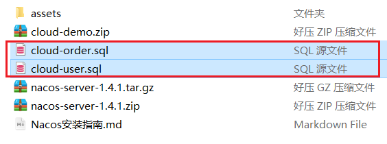
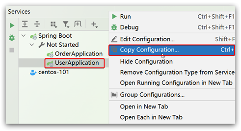
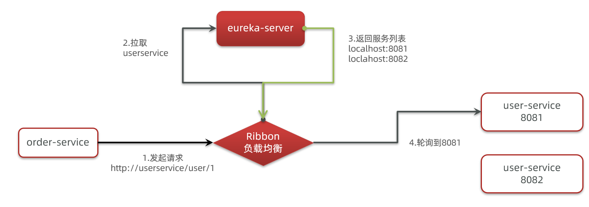
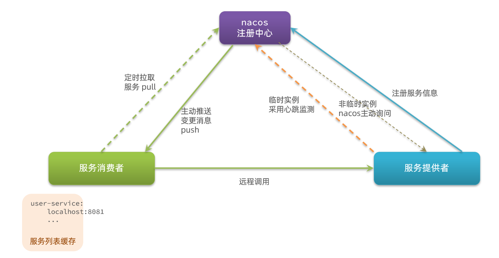
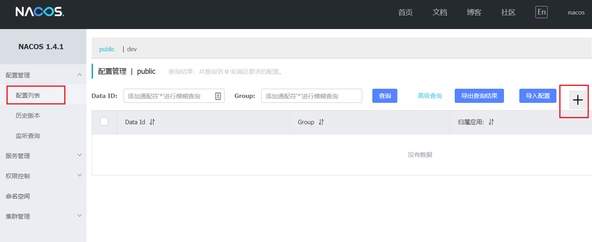
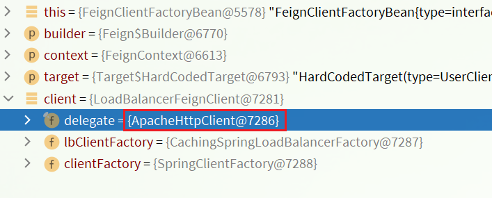

# Spring Cloud 基础篇

- 认识微服务
- 分布式服务架构案例
- `eureka` 注册中心
- `Ribbon` 负载均衡原理
- `nacos` 注册

# 认识微服务

随着互联网行业的发展，对服务的要求也越来越高，服务架构也从单体架构逐渐演变为现在流行的微服务架构。

## 单体架构

**单体架构**：将业务的所有功能集中在一个项目中开发，打成一个包部署。


> 单体架构的优缺点如下：

**优点：**

- 架构简单
- 部署成本低

**缺点：**

- 耦合度高（维护困难、升级困难）

## 分布式架构

**分布式架构**：根据业务功能对系统做拆分，每个业务功能模块作为独立项目开发，称为一个服务。


> 分布式架构的优缺点：

**优点：**

- 降低服务耦合
- 有利于服务升级和拓展

**缺点：**

- 服务调用关系错综复杂

分布式架构虽然降低了服务耦合，但是服务拆分时也有很多问题需要思考：

- 服务拆分的粒度如何界定？
- 服务之间如何调用？
- 服务的调用关系如何管理？

人们需要制定一套行之有效的标准来约束分布式架构。

## 微服务

> **微服务架构：一种良好的分布式架构方案**

- 优点：拆分粒度更小、服务更独立、耦合度更低。
- 缺点：架构非常复杂，运维、监控、部署难度提高。

> 微服务的架构特征：

- 单一职责：微服务拆分粒度更小，每一个服务都对应唯一的业务能力，做到单一职责
- 自治：团队独立、技术独立、数据独立，独立部署和交付
- 面向服务：服务提供统一标准的接口，与语言和技术无关
- 隔离性强：服务调用做好隔离、容错、降级，避免出现级联问题


微服务的上述特性其实是在给分布式架构制定一个标准，进一步降低服务之间的耦合度，提供服务的独立性和灵活性。做到高内聚，低耦合。

因此，可以认为**微服务**是一种经过良好架构设计的**分布式架构方案** 。


- **服务网关：**网关把请求分发到服务集群，做负载均衡，隔离，容错等。
- **注册中心：**维护微服务中每个节点的信息。
- **配置中心：**统一管理整个微服务群的配置，将来用变更，用通知的方式去让对应的服务监控到配置的服务，实现配置的热更新。
- **服务集群：**微服务拆分，形成集群。集群中的服务要遵从单一职责原则，面向服务，对外暴露接口。

> 微服务技术对比


## Spring Cloud

Spring Cloud 是目前国内使用最广泛的微服务框架。官网地址：https://spring.io/projects/spring-cloud。

Spring Cloud 集成了各种微服务功能组件，并基于 Spring Boot 实现了这些组件的自动装配，从而提供了良好的开箱即用体验。

其中常见的组件包括：


另外，Spring Cloud 底层是依赖于 Spring Boot 的，并且有版本的兼容关系，如下：


我学习的版本是 Hoxton.SR10，因此对应的 Spring Boot 版本是 2.3.x 版本。

## 总结

- 单体架构：简单方便，高度耦合，扩展性差，适合小型项目。例如：学生管理系统

- 分布式架构：松耦合，扩展性好，但架构复杂，难度大。适合大型互联网项目，例如：京东、淘宝

- 微服务：一种良好的分布式架构方案

  ①优点：拆分粒度更小、服务更独立、耦合度更低

  ②缺点：架构非常复杂，运维、监控、部署难度提高

- Spring Cloud 是微服务架构的一站式解决方案，集成了各种优秀微服务功能组件

# 服务拆分和远程调用

任何分布式架构都离不开服务的拆分，微服务也是一样。

## 服务拆分原则

微服务拆分时的几个原则：

- <span style="color:green">不同微服务，不要重复开发相同业务</span>
- <span style="color:green">微服务数据独立，不要访问其它微服务的数据库</span>
- <span style="color:green">微服务可以将自己的业务暴露为接口，供其它微服务调用</span>


## 服务拆分示例

以微服务 cloud-demo 为例，其结构如下：


cloud-demo：父工程，管理依赖

- order-service：订单微服务，负责订单相关业务
- user-service：用户微服务，负责用户相关业务

要求：

- 订单微服务和用户微服务都必须有各自的数据库，相互独立
- 订单服务和用户服务都对外暴露 Restful 的接口
- 订单服务如果需要查询用户信息，只能调用用户服务的 Restful 接口，不能查询用户数据库

### 导入 SQL 语句

首先，将 `cloud-order.sql` 和 `cloud-user.sql `导入到 mysql中：



cloud-user 表中初始数据如下：


cloud-order 表中初始数据如下：


cloud-order 表中持有 cloud-user 表中的 id 字段。

### 导入demo工程

用 IDEA 导入课前资料提供的 Demo：


项目结构如下：


导入后，会在IDEA右下角出现弹窗：


点击弹窗，然后按下图选择：


会出现这样的菜单：


配置下项目使用的 `JDK`：


## 实现远程调用案例

在order-service服务中，有一个根据id查询订单的接口：


根据id查询订单，返回值是Order对象，如图：


其中的user为null

在user-service中有一个根据id查询用户的接口：


查询的结果如图：


### 案例需求：

修改 order-service 中的根据id查询订单业务，要求在查询订单的同时，根据订单中包含的 userId 查询出用户信息，一起返回。


因此，我们需要在 `order-service` 中向 `user-service` 发起一个http的请求，调用 http://localhost:8081/user/{userId} 这个接口。

大概的步骤是这样的：

- 注册一个 RestTemplate 的实例到 Spring 容器
- 修改 order-service 服务中的 OrderService 类中的 queryOrderById 方法，根据 Order 对象中的 userId 查询 User
- 将查询的 User 填充到 Order 对象，一起返回

### 注册RestTemplate

首先，我们在 `order-service` 服务中的 `OrderApplication` 启动类中，注册 `RestTemplate` 实例：

```java
package cn.itcast.order;

import org.mybatis.spring.annotation.MapperScan;
import org.springframework.boot.SpringApplication;
import org.springframework.boot.autoconfigure.SpringBootApplication;
import org.springframework.context.annotation.Bean;
import org.springframework.web.client.RestTemplate;

@MapperScan("cn.itcast.order.mapper")
@SpringBootApplication
public class OrderApplication {

    public static void main(String[] args) {
        SpringApplication.run(OrderApplication.class, args);
    }

    @Bean
    public RestTemplate restTemplate() {
        return new RestTemplate();
    }
}
```

### 实现远程调用

修改 `order-service` 服务中的 `cn.itcast.order.service` 包下的 `OrderService` 类中的 `queryOrderById` 方法：


## 提供者与消费者

在服务调用关系中，会有两个不同的角色：

**服务提供者**：一次业务中，被其它微服务调用的服务。（提供接口给其它微服务）

**服务消费者**：一次业务中，调用其它微服务的服务。（调用其它微服务提供的接口）


但是，服务提供者与服务消费者的角色并不是绝对的，而是相对于业务而言。

如果服务 A 调用了服务 B，而服务 B 又调用了服务 C，服务 B 的角色是什么？

- 对于 A 调用 B 的业务而言：A 是服务消费者，B 是服务提供者
- 对于 B 调用 C 的业务而言：B 是服务消费者，C 是服务提供者

因此，服务 B 既可以是服务提供者，也可以是服务消费者。

# Eureka注册中心

假如我们的服务提供者 `user-service` 部署了多个实例，如图：


> **思考：**

- `order-service` 在发起远程调用的时候，该如何得知 `user-service` 实例的ip地址和端口？
- 有多个 `user-service` 实例地址，`order-service` 调用时该如何选择？
- `order-service` 如何得知某个 `user-service` 实例是否依然健康，是不是已经宕机？

## Eureka 的结构和作用

这些问题都需要利用 Spring Cloud 中的注册中心来解决，其中最广为人知的注册中心就是 Eureka，其结构如下：


> <span style="color:green">**order-service 如何得知 user-service 实例地址？**</span>

获取地址信息的流程如下：

- `user-service` 服务实例启动后，将自己的信息注册到 `eureka-server`（`Eureka` 服务端）。这个叫服务注册
- `eureka-server` 保存服务名称到服务实例地址列表的映射关系。<span style="color:red">（key-->服务名称；value-->服务地址）</span>
- `order-service` 根据服务名称，拉取实例地址列表。这个叫服务发现或服务拉取

> <span style="color:green">**order-service 如何从多个 user-service 实例中选择具体的实例？**</span>

- `order-service` 从实例列表中<span style="color:red">利用负载均衡算法选中一个实例地址</span>
- 向该实例地址发起远程调用

> <span style="color:green">**order-service 如何得知某个 user-service 实例是否依然健康，是不是已经宕机？**</span>

- `user-service` 会每隔一段时间（默认30秒）向 `eureka-server` 发起请求，报告自己状态，称为心跳
- 当超过一定时间没有发送心跳时，`eureka-server` 会认为微服务实例故障，将该实例从服务列表中剔除
- `order-service` 拉取服务时，就能将故障实例排除了

> <span style="color:green">**注意：一个微服务，既可以是服务提供者，又可以是服务消费者，因此 eureka 将服务注册、服务发现等功能统一封装到了eureka-client 端**</span>

因此，接下来我们动手实践的步骤包括：


## 搭建eureka-server

首先大家注册中心服务端：`eureka-server`，这必须是一个独立的微服务

### 创建eureka-server服务

在 `cloud-demo` 父工程下，创建一个子模块：


填写模块信息：


然后填写服务信息：


### 引入eureka依赖

引入 `Spring Cloud` 为 `eureka` 提供的 `starter` 依赖：

```xml
<dependency>
    <groupId>org.springframework.cloud</groupId>
    <artifactId>spring-cloud-starter-netflix-eureka-server</artifactId>
</dependency>
```

### 编写启动类

给 `eureka-server` 服务编写一个启动类，一定要添加一个 `@EnableEurekaServer` 注解，开启 `eureka` 的注册中心功能：

```java
package cn.itcast.eureka;

import org.springframework.boot.SpringApplication;
import org.springframework.boot.autoconfigure.SpringBootApplication;
import org.springframework.cloud.netflix.eureka.server.EnableEurekaServer;

@SpringBootApplication
@EnableEurekaServer
public class EurekaApplication {
    public static void main(String[] args) {
        SpringApplication.run(EurekaApplication.class, args);
    }
}
```

### 编写配置文件

编写一个 `application.yml` 文件，内容如下：

```yaml
server:
  port: 10086
spring:
  application:
    name: eureka-server
eureka:
  client:
    service-url: 
      defaultZone: http://127.0.0.1:10086/eureka
```

### 启动服务

启动微服务，然后在浏览器访问：http://127.0.0.1:10086

看到下面结果应该是成功了：


## 服务注册

下面，我们将 `user-service` 注册到 `eureka-server` 中去。

### 引入依赖

在 `user-service` 的 `pom` 文件中，引入下面的 `eureka-client` 依赖：

```xml
<dependency>
    <groupId>org.springframework.cloud</groupId>
    <artifactId>spring-cloud-starter-netflix-eureka-client</artifactId>
</dependency>
```

### 配置文件

在 `user-service` 中，修改 `application.yml` 文件，添加服务名称、`eureka` 地址：

```yaml
spring:
  application:
    name: userservice
eureka:
  client:
    service-url:
      defaultZone: http://127.0.0.1:10086/eureka
```

### 启动多个user-service实例

为了演示一个服务有多个实例的场景，我们添加一个 `SpringBoot` 的启动配置，再启动一个 `user-service`。

首先，复制原来的 `user-service` 启动配置：



然后，在弹出的窗口中，填写信息：


现在，`Spring Boot` 窗口会出现两个 `user-service` 启动配置：


不过，第一个是 `8081` 端口，第二个是 `8082` 端口。

启动两个 `user-service` 实例：


查看 `eureka-server` 管理页面：


## 服务发现

下面，我们将 `order-service` 的逻辑修改：向 `eureka-server` 拉取 `user-service` 的信息，实现服务发现。

### 引入依赖

之前说过，<span style="color:red">服务发现、服务注册统一都封装在 `eureka-client` 依赖</span>，因此这一步与服务注册时一致。

在 `order-service` 的 `pom` 文件中，引入下面的 `eureka-client` 依赖：

```xml
<dependency>
    <groupId>org.springframework.cloud</groupId>
    <artifactId>spring-cloud-starter-netflix-eureka-client</artifactId>
</dependency>
```

### 配置文件

服务发现也需要知道 eureka 地址，因此第二步与服务注册一致，都是配置 eureka 信息：

在 order-service 中，修改 application.yml 文件，添加服务名称、eureka地址：

```yaml
spring:
  application:
    name: orderservice
eureka:
  client:
    service-url:
      defaultZone: http://127.0.0.1:10086/eureka
```

### 服务拉取和负载均衡

最后，我们要去 `eureka-server` 中拉取 `user-service` 服务的实例列表，并且实现负载均衡。不过这些动作不用我们去做，只需要添加一些注解即可。

在 order-service 的 `OrderApplication` 中，给 `RestTemplate` 这个Bean添加一个 `@LoadBalanced` 注解：


修改 `order-service` 服务中的 `cn.itcast.order.service` 包下的 `OrderService` 类中的 `queryOrderById` 方法。修改访问的 `url` 路径，用服务名代替 `ip`、端口：


`spring` 会自动帮助我们从 `eureka-server` 端，根据 `userservice` 这个服务名称，获取实例列表，而后完成负载均衡。

# Ribbon 负载均衡

上一节中，我们添加了`@LoadBalanced` 注解，即可实现负载均衡功能，这是什么原理呢？

## 负载均衡原理

`Spring Cloud` 底层其实是利用了一个名为 `Ribbon` 的组件，来实现负载均衡功能的。



那么我们发出的请求明明是 http://userservice/user/1，怎么变成了http://localhost:8081的呢？

## 源码跟踪

为什么我们只输入了 `service` 名称就可以访问了呢？之前还要获取 `IP` 和端口。显然有人帮我们根据 `service`  名称，获取到了服务实例的 `IP` 和端口。它就是`LoadBalancerInterceptor`，这个类会在对 `RestTemplate` 的请求进行拦截，然后从 `Eureka` 根据服务 `id` 获取服务列表，随后利用负载均衡算法得到真实的服务地址信息，替换服务 `id`。

> 我们进行源码跟踪：

### LoadBalancerIntercepor


可以看到这里的intercept方法，拦截了用户的 `HttpRequest` 请求，然后做了几件事：

- `request.getURI()`：获取请求 `uri`，本例中就是 http://user-service/user/8
- `originalUri.getHost()`：获取 `uri` 路径的主机名，其实就是服务id，`user-service`
- `this.loadBalancer.execute()`：处理服务 id，和用户请求。

这里的`this.loadBalancer`是`LoadBalancerClient`类型，我们继续跟入。

### LoadBalancerClient

继续跟入execute方法：


代码是这样的：

- `getLoadBalancer(serviceId)：`根据服务 `id` 获取 `ILoadBalancer`，而 `ILoadBalancer` 会拿着服务 `id` 去 `eureka` 中获取服务列表并保存起来。
- `getServer(loadBalancer)：`利用内置的负载均衡算法，从服务列表中选择一个。本例中，可以看到获取了8082端口的服务

放行后，再次访问并跟踪，发现获取的是 8081：


果然实现了负载均衡。

### 负载均衡策略 `IRule`

在刚才的代码中，可以看到获取服务使通过一个`getServer`方法来做负载均衡:


我们继续跟入：


继续跟踪源码 `chooseServer` 方法，发现这么一段代码：


我们看看这个rule是谁：


这里的rule默认值是一个 `RoundRobinRule`，看类的介绍：


这不就是轮询的意思嘛。

到这里，整个负载均衡的流程我们就清楚了。

### 总结

`SpringCloudRibbon` 的底层采用了一个拦截器，拦截了 `RestTemplate` 发出的请求，对地址做了修改。用一幅图来总结一下：


基本流程如下：

- 拦截我们的 `RestTemplate` 请求 http://userservice/user/1
- `RibbonLoadBalancerClient` 会从请求 `url` 中获取服务名称，也就是 user-service
- `DynamicServerListLoadBalancer` 根据  `user-service` 到  `eureka` 拉取服务列表
- `eureka` 返回列表，`localhost:8081`、`localhost:8082`
- `IRule` 利用内置负载均衡规则，从列表中选择一个，例如 `localhost:8081` [ 默认的负载均衡策略是轮询 ]
- `RibbonLoadBalancerClient` 修改请求地址，用 `localhost:8081` 替代`userservice`，得到 http://localhost:8081/user/1，发起真实请求

## 负载均衡策略

### 负载均衡策略

负载均衡的规则都定义在 `IRule` 接口中，而 `IRule` 有很多不同的实现类：


不同规则的含义如下：

| **内置负载均衡规则类**      | **规则描述**                                                 |
| --------------------------- | ------------------------------------------------------------ |
| `RoundRobinRule`            | 简单轮询服务列表来选择服务器。它是 Ribbon 默认的负载均衡规则。 |
| `AvailabilityFilteringRule` | 对以下两种服务器进行忽略：   <br>（1）在默认情况下，这台服务器如果3次连接失败，这台服务器就会被设置为“短路”状态。短路状态将持续30秒，如果再次连接失败，短路的持续时间就会几何级地增加。  <br>（2）并发数过高的服务器。如果一个服务器的并发连接数过高，配置了 `AvailabilityFilteringRule` 规则的客户端也会将其忽略。并发连接数的上限，可以由客户端的`<clientName>.<clientConfigNameSpace>.ActiveConnectionsLimit`属性进行配置。 |
| `WeightedResponseTimeRule`  | 为每一个服务器赋予一个权重值。服务器响应时间越长，这个服务器的权重就越小。这个规则会随机选择服务器，这个权重值会影响服务器的选择。 |
| **`ZoneAvoidanceRule`**     | 以区域可用的服务器为基础进行服务器的选择。使用 Zone 对服务器进行分类，这个 Zone 可以理解为一个机房、一个机架等。而后再对 Zone 内的多个服务做轮询。 |
| `BestAvailableRule`         | 忽略那些短路的服务器，并选择并发数较低的服务器。             |
| `RandomRule`                | 随机选择一个可用的服务器。                                   |
| `RetryRule`                 | 重试机制的选择逻辑                                           |

默认的实现就是 `ZoneAvoidanceRule`，是一种轮询方案

### 自定义负载均衡策略

通过定义 `IRule` 实现可以修改负载均衡规则，有两种方式：

<span style="color:purple">**代码方式**</span>：在 <span style="color:red">order-service </span>中的 `OrderApplication` 类中，定义一个新的`IRule`，<span style="color:green">这样 order-service 在请求服务的时候就会根据我们配置的负载均衡规则进行查找最合适的服务。</span>

```java
@Bean
public IRule randomRule(){
    return new RandomRule();
}
```

<span style="color:purple">**配置文件方式**</span>：在 `order-service` 的 `application.yml` 文件中，添加新的配置也可以修改规则：

```yaml
userservice: # 给某个微服务配置负载均衡规则，这里是userservice服务
  ribbon:
    NFLoadBalancerRuleClassName: com.netflix.loadbalancer.RandomRule # 负载均衡规则 
```

> **注意**，一般用默认的负载均衡规则，不做修改。

## 饥饿加载

`Ribbon` 默认是采用懒加载，即第一次访问时才会去创建 `LoadBalanceClient`，请求时间会很长。

而饥饿加载则会在项目启动时创建，降低第一次访问的耗时，通过下面配置开启饥饿加载：

```yaml
ribbon:
  eager-load:
    enabled: true
    clients: userservice
```

## 总结

- Ribbon 负载均衡规则
  - 规则接口时 IRule
  - 默认实现时 ZoneAvoidanceRule，根据 zone 选择服务列表，然后轮询
- 负载均衡自定义方式
  - 代码方式：配置灵活，但是修改时需要重新打包发布
  - 配置方式：直观、方便，无需重新打包发布，但是无法做全局配置
- 饥饿加载
  - 开启饥饿加载
  - 指定饥饿加载的微服务名称

# Nacos注册中心

国内公司一般都推崇阿里巴巴的技术，比如注册中心，`SpringCloudAlibaba` 也推出了一个名为 `Nacos` 的注册中心。

## 认识和安装Nacos

[Nacos](https://nacos.io/) 是阿里巴巴的产品，现在是 [SpringCloud](https://spring.io/projects/spring-cloud) 中的一个组件。相比 [Eureka](https://github.com/Netflix/eureka) 功能更加丰富，在国内受欢迎程度较高。


安装方式可以参考《Nacos安装指南.md》

## 服务注册到 nacos

`Nacos` 是 `SpringCloudAlibaba` 的组件，而 `SpringCloudAlibaba` 也遵循 `SpringCloud` 中定义的服务注册、服务发现规范。因此使用 `Nacos` 和使用 `Eureka` 对于微服务来说，并没有太大区别。

主要差异在于：

- 依赖不同
- 服务地址不同

### 引入依赖

在 `cloud-demo` 父工程的 `pom` 文件中的`<dependencyManagement>`中引入`SpringCloudAlibaba` 的依赖：

```xml
<dependency>
    <groupId>com.alibaba.cloud</groupId>
    <artifactId>spring-cloud-alibaba-dependencies</artifactId>
    <version>2.2.6.RELEASE</version>
    <type>pom</type>
    <scope>import</scope>
</dependency>
```

然后在 `user-service` 和 `order-service` 中的 `pom` 文件中引入 `nacos-discovery` 依赖：

```xml
<dependency>
    <groupId>com.alibaba.cloud</groupId>
    <artifactId>spring-cloud-starter-alibaba-nacos-discovery</artifactId>
</dependency>
```

> <span style="color:red">**注意**：不要忘了注释掉eureka的依赖。</span>

### 配置nacos地址

在 `user-service` 和 `order-service` 的 `application.yml` 中添加 `nacos` 地址：

```yaml
spring:
  cloud:
    nacos:
      server-addr: localhost:8848
```

> <span style="color:red">**注意**：不要忘了注释掉eureka的地址</span>

### 重启

重启微服务后，登录 `nacos` 管理页面，可以看到微服务信息：


## 服务分级存储模型

一个**服务**可以有多个**实例**，例如我们的 user-service，可以有:

- 127.0.0.1:8081
- 127.0.0.1:8082
- 127.0.0.1:8083

假如这些实例分布于全国各地的不同机房，例如：

- 127.0.0.1:8081，在上海机房
- 127.0.0.1:8082，在上海机房
- 127.0.0.1:8083，在杭州机房

Nacos 就将同一机房内的实例 划分为一个**集群**。

也就是说，user-service 是服务，一个服务可以包含多个集群，如杭州、上海，每个集群下可以有多个实例，形成分级模型，如图：


微服务互相访问时，应该尽可能访问同集群实例，因为本地访问速度更快。当本集群内不可用时，才访问其它集群。例如：


杭州机房内的 order-service 应该优先访问同机房的 user-service。

### 给 user-service 配置集群

修改 `user-service` 的 `application.yml` 文件，添加集群配置：

```yaml
spring:
  cloud:
    nacos:
      server-addr: localhost:8848
      discovery:
        cluster-name: HZ # 集群名称
```

重启两个 `user-service` 实例后，我们可以在 `nacos` 控制台看到下面结果：


我们再次复制一个 `user-service` 启动配置，添加属性：

```sh
-Dserver.port=8083 -Dspring.cloud.nacos.discovery.cluster-name=SH
```

配置如图所示：


启动 `UserApplication3` 后再次查看 `nacos` 控制台：


### 同集群优先的负载均衡

默认的 `ZoneAvoidanceRule` 并不能实现根据同集群优先来实现负载均衡，它知识首次会访问同集群的服务，后面就是轮询，一个一个依次使用了。

因此 `Nacos` 中提供了一个`NacosRule`的实现，可以优先从同集群中挑选实例。

1）给order-service配置集群信息

修改 `order-service` 的 `application.yml` 文件，添加集群配置：

```sh
spring:
  cloud:
    nacos:
      server-addr: localhost:8848
      discovery:
        cluster-name: HZ # 集群名称
```

2）修改负载均衡规则

修改 `order-service` 的 `application.yml` 文件，修改负载均衡规则：

```yaml
userservice:
  ribbon:
    NFLoadBalancerRuleClassName: com.alibaba.cloud.nacos.ribbon.NacosRule # 负载均衡规则 
```

## 权重配置

实际部署中会出现这样的场景：

服务器设备性能有差异，部分实例所在机器性能较好，另一些较差，我们希望性能好的机器承担更多的用户请求。

但默认情况下 NacosRule 是同集群内随机挑选，不会考虑机器的性能问题。

因此，Nacos 提供了权重配置来控制访问频率，权重越大则访问频率越高。

在nacos控制台，找到 user-service 的实例列表，点击编辑，即可修改权重：


在弹出的编辑窗口，修改权重：


> **注意**：如果权重修改为0，则该实例永远不会被访问

## 环境隔离

`Nacos` 提供了 `namespace` 来实现环境隔离功能。

- `nacos` 中可以有多个 `namespace`
- `namespace` 下可以有 group、service 等
- 不同 `namespace` 之间相互隔离，例如不同 `namespace` 的服务互相不可见


### 创建 namespace

默认情况下，所有 service、data、group都在同一个 `namespace`，名为public：


我们可以点击页面新增按钮，添加一个 `namespace`：


然后，填写表单：


就能在页面看到一个新的 `namespace`：


### 给微服务配置 namespace

给微服务配置 namespace 只能通过修改配置来实现。

例如，修改order-service的application.yml文件：

```yaml
spring:
  cloud:
    nacos:
      server-addr: localhost:8848
      discovery:
        cluster-name: HZ
        namespace: 492a7d5d-237b-46a1-a99a-fa8e98e4b0f9 # 命名空间，填ID
```

重启order-service后，访问控制台，可以看到下面的结果：


此时访问order-service，因为namespace不同，会导致找不到userservice，控制台会报错：


## Nacos 与 Eureka 的区别

Nacos 的服务实例分为两种l类型：

- 临时实例：如果实例宕机超过一定时间，会从服务列表剔除，默认的类型。

- 非临时实例：如果实例宕机，不会从服务列表剔除，也可以叫永久实例。

配置一个服务实例为永久实例：

```yaml
spring:
  cloud:
    nacos:
      discovery:
        ephemeral: false # 设置为非临时实例
```

Nacos 和 Eureka 整体结构类似，服务注册、服务拉取、心跳等待，但是也存在一些差异：



- Nacos与eureka的共同点
  - 都支持服务注册和服务拉取
  - 都支持服务提供者心跳方式做健康检测

- Nacos 与 Eureka 的区别
  - Nacos 支持服务端主动检测提供者状态：临时实例采用心跳模式，非临时实例采用主动检测模式
  - 临时实例心跳不正常会被剔除，非临时实例则不会被剔除，仅仅是把他标记为不健康，等他变好。
  - Nacos 支持服务列表变更的消息推送模式，服务列表更新更及时。（eureka 是 pull 而 nacos 是 pull+push）
  - Nacos 集群默认采用 AP（强调数据的可用性，服务的可用性）方式，当集群中存在非临时实例时，采用 CP（强调数据的可靠性和一致性）模式；Eureka 采用 AP 方式。

# Spring Cloud 实用篇

- Nacos 配置管理
- Feign 远程调用
- Gateway 服务网关

# Nacos配置管理

Nacos除了可以做注册中心，同样可以做配置管理来使用。

> 主要内容

- 统一配置管理
- 配置热更新
- 配置共享
- 搭建 Nacos 集群

## 统一配置管理

当微服务部署的实例越来越多，达到数十、数百时，逐个修改微服务配置很麻烦，而且很容易出错。我们需要一种统一配置管理方案，可以集中管理所有实例的配置。

> 配置热更新


Nacos一方面可以将配置集中管理，另一方可以在配置变更时，及时通知微服务，实现配置的热更新。

### 在nacos中添加配置文件

如何在nacos中管理配置呢？



然后在弹出的表单中，填写配置信息：

- Data ID 就是配置文件的名称。配置文件的名称取名：`服务名称-[profile].[后缀名]`


> 注意：项目的核心配置，需要热更新的配置才有放到nacos管理的必要。基本不会变更的一些配置还是保存在微服务本地比较好。

### 从微服务拉取配置

微服务要拉取 nacos 中管理的配置，并且与本地的 application.yml 配置合并，才能完成项目启动。

但如果尚未读取 application.yml，又如何得知 nacos 地址呢？

因此 spring 引入了一种新的配置文件：bootstrap.yaml 文件，会在 application.yml 之前被读取，流程如下：


1）引入 nacos-config 依赖

首先，在 user-service 服务中，引入 nacos-config 的客户端依赖：

```xml
<!--nacos配置管理依赖-->
<dependency>
    <groupId>com.alibaba.cloud</groupId>
    <artifactId>spring-cloud-starter-alibaba-nacos-config</artifactId>
</dependency>
```

2）添加 bootstrap.yaml

然后，在 user-service 中添加一个 bootstrap.yaml 文件，内容如下：

```yaml
spring:
  application:
    name: userservice # 服务名称
  profiles:
    active: dev #开发环境，这里是dev 
  cloud:
    nacos:
      server-addr: localhost:8848 # Nacos地址
      config:
        file-extension: yaml # 文件后缀名
```

这里会根据 spring.cloud.nacos.server-addr 获取 nacos 地址，再根据

`${spring.application.name}-${spring.profiles.active}.${spring.cloud.nacos.config.file-extension}`作为文件id，来读取配置。

本例中，就是去读取`userservice-dev.yaml`：


3）读取nacos配置

在user-service中的UserController中添加业务逻辑，读取pattern.dateformat配置：


完整代码：

```java
package cn.itcast.user.web;

import cn.itcast.user.pojo.User;
import cn.itcast.user.service.UserService;
import lombok.extern.slf4j.Slf4j;
import org.springframework.beans.factory.annotation.Autowired;
import org.springframework.beans.factory.annotation.Value;
import org.springframework.web.bind.annotation.*;

import java.time.LocalDateTime;
import java.time.format.DateTimeFormatter;

@Slf4j
@RestController
@RequestMapping("/user")
public class UserController {

    @Autowired
    private UserService userService;

    @Value("${pattern.dateformat}")
    private String dateformat;
    
    @GetMapping("now")
    public String now(){
        return LocalDateTime.now().format(DateTimeFormatter.ofPattern(dateformat));
    }
    // ...略
}
```

在页面访问，可以看到效果：


## 配置热更新

我们最终的目的，是修改nacos中的配置后，微服务中无需重启即可让配置生效，也就是**配置热更新**。

Nacos 中的配置文件变更后，微服务无需重启就可以感知，不过需要通过下面两种配置实现：

### 方式一

在@Value注入的变量所在类上添加注解@RefreshScope：


### 方式二

使用@ConfigurationProperties注解代替@Value注解。

在user-service服务中，添加一个类，读取patterrn.dateformat属性：

```java
package cn.itcast.user.config;

import lombok.Data;
import org.springframework.boot.context.properties.ConfigurationProperties;
import org.springframework.stereotype.Component;

@Component
@Data
@ConfigurationProperties(prefix = "pattern")
public class PatternProperties {
    private String dateformat;
}
```

在UserController中使用这个类代替@Value：


完整代码：

```java
package cn.itcast.user.web;

import cn.itcast.user.config.PatternProperties;
import cn.itcast.user.pojo.User;
import cn.itcast.user.service.UserService;
import lombok.extern.slf4j.Slf4j;
import org.springframework.beans.factory.annotation.Autowired;
import org.springframework.web.bind.annotation.GetMapping;
import org.springframework.web.bind.annotation.PathVariable;
import org.springframework.web.bind.annotation.RequestMapping;
import org.springframework.web.bind.annotation.RestController;

import java.time.LocalDateTime;
import java.time.format.DateTimeFormatter;

@Slf4j
@RestController
@RequestMapping("/user")
public class UserController {

    @Autowired
    private UserService userService;

    @Autowired
    private PatternProperties patternProperties;

    @GetMapping("now")
    public String now(){
        return LocalDateTime.now().format(DateTimeFormatter.ofPattern(patternProperties.getDateformat()));
    }

    // 略
}
```

## 配置共享

其实微服务启动时，会去nacos读取多个配置文件，例如：

- `[spring.application.name]-[spring.profiles.active].yaml`，例如：userservice-dev.yaml

- `[spring.application.name].yaml`，例如：userservice.yaml

而`[spring.application.name].yaml`不包含环境，因此可以被多个环境共享。

下面我们通过案例来测试配置共享

### 添加一个环境共享配置

我们在nacos中添加一个userservice.yaml文件：


### 在user-service中读取共享配置

在user-service服务中，修改PatternProperties类，读取新添加的属性：


在user-service服务中，修改UserController，添加一个方法：


### 运行两个UserApplication，使用不同的profile

修改UserApplication2这个启动项，改变其profile值：


这样，UserApplication(8081)使用的profile是dev，UserApplication2(8082)使用的profile是test。

启动UserApplication和UserApplication2

访问http://localhost:8081/user/prop，结果：


访问http://localhost:8082/user/prop，结果：


可以看出来，不管是dev，还是test环境，都读取到了envSharedValue这个属性的值。

### 配置共享的优先级

当nacos、服务本地同时出现相同属性时，优先级有高低之分：


## 搭建Nacos集群

Nacos生产环境下一定要部署为集群状态，部署方式参考课前资料中的文档：


# Feign远程调用

先来看我们以前利用 RestTemplate 发起远程调用的代码：


> 存在下面的问题：

- 代码可读性差，编程体验不统一
- 参数复杂URL难以维护

Feign是一个声明式的http客户端，官方地址：https://github.com/OpenFeign/feign；其作用就是帮助我们优雅的实现 http 请求的发送，解决上面提到的问题。


## Feign替代RestTemplate

Fegin的使用步骤如下：

### 引入依赖

我们在order-service服务的pom文件中引入feign的依赖：

```xml
<dependency>
    <groupId>org.springframework.cloud</groupId>
    <artifactId>spring-cloud-starter-openfeign</artifactId>
</dependency>
```

### 添加注解

在order-service的启动类添加注解开启 Feign 的功能：


### 编写Feign的客户端

在order-service中新建一个接口，内容如下：

```java
package cn.itcast.order.client;

import cn.itcast.order.pojo.User;
import org.springframework.cloud.openfeign.FeignClient;
import org.springframework.web.bind.annotation.GetMapping;
import org.springframework.web.bind.annotation.PathVariable;

@FeignClient("userservice")
public interface UserClient {
    @GetMapping("/user/{id}")
    User findById(@PathVariable("id") Long id);
}
```

这个客户端主要是基于SpringMVC的注解来声明远程调用的信息，比如：

- 服务名称：userservice
- 请求方式：GET
- 请求路径：/user/{id}
- 请求参数：Long id
- 返回值类型：User

这样，Feign 就可以帮助我们发送http请求，无需自己使用RestTemplate来发送了。

### 测试

修改 order-service 中的 OrderService 类中的 queryOrderById 方法，使用 Feign 客户端代替 RestTemplate；看起来优雅多了。


### 总结

使用Feign的步骤：

① 引入依赖

② 主程序启动类上添加 @EnableFeignClients 注解

③ 编写 FeignClient 接口

④ 使用 FeignClient 中定义的方法代替 RestTemplate

## 自定义配置

Feign可以支持很多的自定义配置，如下表所示：

| 类型                   | 作用             | 说明                                                       |
| ---------------------- | ---------------- | ---------------------------------------------------------- |
| **feign.Logger.Level** | 修改日志级别     | 包含四种不同的级别：NONE、BASIC、HEADERS、FULL             |
| feign.codec.Decoder    | 响应结果的解析器 | http远程调用的结果做解析，例如解析 json 字符串为 java 对象 |
| feign.codec.Encoder    | 请求参数编码     | 将请求参数编码，便于通过 http 请求发送                     |
| feign.Contract         | 支持的注解格式   | 默认是 Spring MVC 的注解                                   |
| feign.Retryer          | 失败重试机制     | 请求失败的重试机制，默认是没有，不过会使用 Ribbon 的重试   |

一般情况下，默认值就能满足我们使用，如果要自定义时，只需要创建自定义的@Bean覆盖默认Bean即可。

下面以日志为例来演示如何自定义配置。

### 配置文件方式

基于配置文件修改feign的日志级别可以针对单个服务：（我们在 Order 里调用了 User，那么 Feign 的配置就写在 Order 的配置文件中）

```yaml
feign:  
  client:
    config: 
      userservice: # 针对某个微服务的配置
        loggerLevel: FULL #  日志级别 
```

也可以针对所有服务：

```yaml
feign:  
  client:
    config: 
      default: # 这里用default就是全局配置，如果是写服务名称，则是针对某个微服务的配置
        loggerLevel: FULL #  日志级别 
```

而日志的级别分为四种：

- NONE：不记录任何日志信息，这是默认值。<span style="color:red">（记录日志用 NONE 或 BASIC）</span>
- BASIC：仅记录请求的方法，URL以及响应状态码和执行时间。
- HEADERS：在BASIC的基础上，额外记录了请求和响应的头信息。
- FULL：记录所有请求和响应的明细，包括头信息、请求体、元数据。<span style="color:red">（调试错误的时候用 Full）</span>

### Java代码方式

也可以基于Java代码来修改日志级别，先声明一个类，然后声明一个Logger.Level的对象：

```java
public class DefaultFeignConfiguration  {
    @Bean
    public Logger.Level feignLogLevel(){
        return Logger.Level.BASIC; // 日志级别为BASIC
    }
}
```

如果要**全局生效**，将其放到启动类的@EnableFeignClients这个注解中：

```java
@EnableFeignClients(defaultConfiguration = DefaultFeignConfiguration.class) 
```

如果是**局部生效**，则把它放到对应的@FeignClient这个注解中：（uservice 只对 uservice 这个服务有效）

```java
@FeignClient(value = "userservice", configuration = DefaultFeignConfiguration.class) 
```

## Feign使用优化

Feign底层发起http请求，依赖于其它的框架。其底层客户端实现包括：

- URLConnection：默认实现，不支持连接池
- Apache HttpClient ：支持连接池
- OKHttp：支持连接池

因此提高Feign的性能主要手段就是使用**连接池**代替默认的 URLConnection。

这里我们用 Apache 的 HttpClient 来演示。

> 1）引入依赖

在order-service的pom文件中引入Apache的HttpClient依赖：

```xml
<!--httpClient的依赖 -->
<dependency>
    <groupId>io.github.openfeign</groupId>
    <artifactId>feign-httpclient</artifactId>
</dependency>
```

> 2）配置连接池

在order-service的application.yml中添加配置：

```yaml
feign:
  client:
    config:
      default: # default全局的配置
        loggerLevel: BASIC # 日志级别，BASIC就是基本的请求和响应信息
  httpclient:
    enabled: true # 开启feign对HttpClient的支持
    max-connections: 200 # 最大的连接数
    max-connections-per-route: 50 # 每个路径的最大连接数
```

接下来，在 FeignClientFactoryBean 中的 loadBalance 方法中打断点：


Debug方式启动order-service服务，可以看到这里的client，底层就是Apache HttpClient：



> 总结，Feign的优化：

1.日志级别尽量用 basic

2.使用HttpClient或OKHttp代替URLConnection

①  引入feign-httpClient依赖

②  配置文件开启httpClient功能，设置连接池参数

## 最佳实践

所谓最近实践，就是使用过程中总结的经验，最好的一种使用方式。观察可以发现，Feign 的客户端与服务提供者的 Controller 代码非常相似：

feign客户端：


UserController：


有没有一种办法简化这种重复的代码编写呢？

> Feign 的最佳实现

- 让 Controller 和 FeignClient 继承同一接口
- 将 FeignClient、POJO、Feign 的默认配置都定义到一个项目中，供所有消费者使用。

### 继承方式

一样的代码可以通过继承来共享：

1）定义一个API接口，利用定义方法，并基于SpringMVC注解做声明。

2）Feign客户端和Controller都集成改接口


优点：

- 简单
- 实现了代码共享

缺点：

- 服务提供方、服务消费方紧耦合

- 参数列表中的注解映射并不会继承，因此 Controller 中必须再次声明方法、参数列表、注解

### 抽取方式

将Feign的Client抽取为独立模块，并且把接口有关的POJO、默认的Feign配置都放到这个模块中，提供给所有消费者使用。

例如，将UserClient、User、Feign的默认配置都抽取到一个feign-api包中，所有微服务引用该依赖包，即可直接使用。


### 实现基于抽取的最佳实践

#### 抽取

首先创建一个module，命名为feign-api：


项目结构：


在feign-api中然后引入feign的starter依赖

```xml
<dependency>
    <groupId>org.springframework.cloud</groupId>
    <artifactId>spring-cloud-starter-openfeign</artifactId>
</dependency>
```

然后，order-service中编写的UserClient、User、DefaultFeignConfiguration都复制到feign-api项目中


#### 在order-service中使用feign-api

首先，删除 order-service 中的 UserClient、User、DefaultFeignConfiguration 等类或接口。

在 order-service 的 pom 文件中中引入 feign-api 的依赖：

```xml
<dependency>
    <groupId>cn.itcast.demo</groupId>
    <artifactId>feign-api</artifactId>
    <version>1.0</version>
</dependency>
```

修改 order-service 中的所有与上述三个组件有关的导包部分，改成导入 feign-api 中的包

#### 重启测试

重启后，发现服务报错了：


这是因为 UserClient 现在在 cn.itcast.feign.+clients 包下，

而 order-service 的 @EnableFeignClients 注解是在cn.itcast.order包下，不在同一个包，无法扫描到 UserClient。

#### 解决扫描包问题

方式一：

指定 Feign 应该扫描的包：

```java
@EnableFeignClients(basePackages = "cn.itcast.feign.clients")
```

方式二：

指定需要加载的Client接口：

```java
@EnableFeignClients(clients = {UserClient.class})
```

# Gateway服务网关

Spring Cloud Gateway 是 Spring Cloud 的一个全新项目，该项目是基于 Spring 5.0，Spring Boot 2.0 和 Project Reactor 等响应式编程和事件流技术开发的网关，它旨在为微服务架构提供一种简单有效的统一的 API 路由管理方式。

## 为什么需要网关

Gateway 网关是我们服务的守门神，所有微服务的统一入口。

网关的**核心功能特性**：

- 服务路由、负载均衡
- 身份认证和权限校验
- 请求限流

架构图：

**权限控制**：网关作为微服务入口，需要校验用户是是否有请求资格，如果没有则进行拦截。

**路由和负载均衡**：一切请求都必须先经过gateway，但网关不处理业务，而是根据某种规则，把请求转发到某个微服务，这个过程叫做路由。当然路由的目标服务有多个时，还需要做负载均衡。

**限流**：当请求流量过高时，在网关中按照下流的微服务能够接受的速度来放行请求，避免服务压力过大。

在SpringCloud中网关的实现包括两种：

- gateway
- zuul

Zuul是基于Servlet的实现，属于阻塞式编程。而 SpringCloudGateway 则是基于 Spring5 中提供的 WebFlux，属于响应式编程的实现，具备更好的性能。

## gateway快速入门

下面，我们就演示下网关的基本路由功能。基本步骤如下：

1. 创建SpringBoot工程gateway，引入网关依赖
2. 编写启动类
3. 编写基础配置和路由规则
4. 启动网关服务进行测试

### 创建gateway服务，引入依赖

创建服务：


引入依赖：网关本身也是一个微服务，也要注册到 nacos 中去。

```xml
<!--网关-->
<dependency>
    <groupId>org.springframework.cloud</groupId>
    <artifactId>spring-cloud-starter-gateway</artifactId>
</dependency>
<!--nacos服务发现依赖-->
<dependency>
    <groupId>com.alibaba.cloud</groupId>
    <artifactId>spring-cloud-starter-alibaba-nacos-discovery</artifactId>
</dependency>
```

### 编写启动类

```java
package cn.itcast.gateway;

import org.springframework.boot.SpringApplication;
import org.springframework.boot.autoconfigure.SpringBootApplication;

@SpringBootApplication
public class GatewayApplication {

	public static void main(String[] args) {
		SpringApplication.run(GatewayApplication.class, args);
	}
}
```

### 编写基础配置和路由规则

创建application.yml文件，内容如下：

```yaml
server:
  port: 10010 # 网关端口
spring:
  application:
    name: gateway # 服务名称
  cloud:
    nacos:
      server-addr: localhost:8848 # nacos地址
    gateway:
      routes: # 网关路由配置
        - id: user-service # 路由id，自定义，只要唯一即可
          # uri: http://127.0.0.1:8081 # 路由的目标地址 http就是固定地址
          uri: lb://userservice # 路由的目标地址 lb就是负载均衡，后面跟服务名称
          predicates: # 路由断言，也就是判断请求是否符合路由规则的条件
            - Path=/user/** # 这个是按照路径匹配，只要以/user/开头就符合要求
```

我们将符合`Path` 规则的一切请求，都代理到 `uri`参数指定的地址。

本例中，我们将 `/user/**`开头的请求，代理到`lb://userservice`，lb是负载均衡，根据服务名拉取服务列表，实现负载均衡。

### 重启测试

重启网关，访问http://localhost:10010/user/1时，符合`/user/**`规则，请求转发到uri：http://userservice/user/1，得到了结果：


### 网关路由的流程图

整个访问的流程如下：


总结：

网关搭建步骤：

1. 创建项目，引入nacos服务发现和gateway依赖

2. 配置application.yml，包括服务基本信息、nacos地址、路由

路由配置包括：

1. 路由id：路由的唯一标示

2. 路由目标（uri）：路由的目标地址，http代表固定地址，lb代表根据服务名负载均衡

3. 路由断言（predicates）：判断路由的规则，

4. 路由过滤器（filters）：对请求或响应做处理

接下来，就重点来学习路由断言和路由过滤器的详细知识

## 断言工厂

我们在配置文件中写的断言规则只是字符串，这些字符串会被Predicate Factory读取并处理，转变为路由判断的条件

例如Path=/user/**是按照路径匹配，这个规则是由

`org.springframework.cloud.gateway.handler.predicate.PathRoutePredicateFactory`类来

处理的，像这样的断言工厂在SpringCloudGateway还有十几个:

| **名称**   | **说明**                       | **示例**                                                     |
| ---------- | ------------------------------ | ------------------------------------------------------------ |
| After      | 是某个时间点后的请求           | -  After=2037-01-20T17:42:47.789-07:00[America/Denver]       |
| Before     | 是某个时间点之前的请求         | -  Before=2031-04-13T15:14:47.433+08:00[Asia/Shanghai]       |
| Between    | 是某两个时间点之前的请求       | -  Between=2037-01-20T17:42:47.789-07:00[America/Denver],  2037-01-21T17:42:47.789-07:00[America/Denver] |
| Cookie     | 请求必须包含某些cookie         | - Cookie=chocolate, ch.p                                     |
| Header     | 请求必须包含某些header         | - Header=X-Request-Id, \d+                                   |
| Host       | 请求必须是访问某个host（域名） | -  Host=**.somehost.org,**.anotherhost.org                   |
| Method     | 请求方式必须是指定方式         | - Method=GET,POST                                            |
| Path       | 请求路径必须符合指定规则       | - Path=/red/{segment},/blue/**                               |
| Query      | 请求参数必须包含指定参数       | - Query=name, Jack或者-  Query=name                          |
| RemoteAddr | 请求者的ip必须是指定范围       | - RemoteAddr=192.168.1.1/24                                  |
| Weight     | 权重处理                       |                                                              |


我们只需要掌握Path这种路由工程就可以了。

## 过滤器工厂

GatewayFilter是网关中提供的一种过滤器，可以对进入网关的请求和微服务返回的响应做处理：


### 路由过滤器的种类

Spring提供了31种不同的路由过滤器工厂。例如：

| **名称**             | **说明**                     |
| -------------------- | ---------------------------- |
| AddRequestHeader     | 给当前请求添加一个请求头     |
| RemoveRequestHeader  | 移除请求中的一个请求头       |
| AddResponseHeader    | 给响应结果中添加一个响应头   |
| RemoveResponseHeader | 从响应结果中移除有一个响应头 |
| RequestRateLimiter   | 限制请求的流量               |

### 请头过滤器

下面我们以AddRequestHeader 为例来讲解。

> **需求**：给所有进入userservice的请求添加一个请求头：Truth=itcast is freaking awesome!

只需要修改gateway服务的application.yml文件，添加路由过滤即可：

```yaml
spring:
  cloud:
    gateway:
      routes:
      - id: user-service 
        uri: lb://userservice 
        predicates: 
        - Path=/user/** 
        filters: # 过滤器
        - AddRequestHeader=Truth, Itcast is freaking awesome! # 添加请求头
```

当前过滤器写在userservice路由下，因此仅仅对访问userservice的请求有效。

### 默认过滤器

如果要对所有的路由都生效，则可以将过滤器工厂写到 default 下。格式如下：

```yaml
spring:
  cloud:
    gateway:
      routes:
      - id: user-service 
        uri: lb://userservice 
        predicates: 
        - Path=/user/**
      default-filters: # 默认过滤项
      - AddRequestHeader=Truth, Itcast is freaking awesome! 
```

### 总结

过滤器的作用是什么？

① 对路由的请求或响应做加工处理，比如添加请求头

② 配置在路由下的过滤器只对当前路由的请求生效

defaultFilters 的作用是什么？

① 对所有路由都生效的过滤器

## 全局过滤器

上一节学习的过滤器，网关提供了31种，但每一种过滤器的作用都是固定的。如果我们希望拦截请求，做自己的业务逻辑则没办法实现。

### 全局过滤器作用

全局过滤器的作用也是处理一切进入网关的请求和微服务响应，与 GatewayFilter 的作用一样。区别在于 GatewayFilter 通过配置定义，处理逻辑是固定的；**而 GlobalFilter 的逻辑需要自己写代码实现。**

定义方式是实现 GlobalFilter 接口。

```java
public interface GlobalFilter {
    /**
     *  处理当前请求，有必要的话通过{@link GatewayFilterChain}将请求交给下一个过滤器处理
     *
     * @param exchange 请求上下文，里面可以获取Request、Response等信息
     * @param chain 用来把请求委托给下一个过滤器 
     * @return {@code Mono<Void>} 返回标示当前过滤器业务结束
     */
    Mono<Void> filter(ServerWebExchange exchange, GatewayFilterChain chain);
}
```

在 filter 中编写自定义逻辑，可以实现下列功能：

- 登录状态判断
- 权限校验
- 请求限流等

### 自定义全局过滤器

需求：定义全局过滤器，拦截请求，判断请求的参数是否满足下面条件：

- 参数中是否有authorization，

- authorization参数值是否为admin

如果同时满足则放行，否则拦截

实现：

在gateway中定义一个过滤器：

```java
package cn.itcast.gateway.filters;

import org.springframework.cloud.gateway.filter.GatewayFilterChain;
import org.springframework.cloud.gateway.filter.GlobalFilter;
import org.springframework.core.annotation.Order;
import org.springframework.http.HttpStatus;
import org.springframework.stereotype.Component;
import org.springframework.web.server.ServerWebExchange;
import reactor.core.publisher.Mono;

@Order(-1)
@Component
public class AuthorizeFilter implements GlobalFilter {
    @Override
    public Mono<Void> filter(ServerWebExchange exchange, GatewayFilterChain chain) {
        // 1.获取请求参数
        MultiValueMap<String, String> params = exchange.getRequest().getQueryParams();
        // 2.获取authorization参数
        String auth = params.getFirst("authorization");
        // 3.校验
        if ("admin".equals(auth)) {
            // 放行
            return chain.filter(exchange);
        }
        // 4.拦截
        // 4.1.禁止访问，设置状态码
        exchange.getResponse().setStatusCode(HttpStatus.FORBIDDEN);
        // 4.2.结束处理
        return exchange.getResponse().setComplete();
    }
}
```

### 过滤器执行顺序

请求进入网关会碰到三类过滤器：当前路由的过滤器、DefaultFilter、GlobalFilter

**请求路由后**，会将当前路由过滤器和DefaultFilter、GlobalFilter，合并到一个过滤器链（集合）中，排序后依次执行每个过滤器：


排序的规则是什么呢？

- 每一个过滤器都必须指定一个int类型的order值，**order值越小，优先级越高，执行顺序越靠前**。
- GlobalFilter通过实现Ordered接口，或者添加@Order注解来指定order值，由我们自己指定
- 路由过滤器和defaultFilter的order由Spring指定，默认是按照声明顺序从1递增。
- 当过滤器的order值一样时，会按照 defaultFilter > 路由过滤器 > GlobalFilter的顺序执行。

详细内容，可以查看源码：

`org.springframework.cloud.gateway.route.RouteDefinitionRouteLocator#getFilters()`方法是先加载defaultFilters，然后再加载某个route的filters，然后合并。

`org.springframework.cloud.gateway.handler.FilteringWebHandler#handle()`方法会加载全局过滤器，与前面的过滤器合并后根据order排序，组织过滤器链

## 跨域问题

### 什么是跨域问题

跨域：域名不一致就是跨域，主要包括：

- 域名不同： www.taobao.com 和 www.taobao.org 和 www.jd.com 和 miaosha.jd.com

- 域名相同，端口不同：localhost:8080和localhost8081

跨域问题：**浏览器禁止**请求的发起者与服务端发生**跨域ajax请求**，请求被浏览器拦截的问题

解决方案：CORS，这个以前应该学习过，这里不再赘述了。不知道的小伙伴可以查看 https://www.ruanyifeng.com/blog/2016/04/cors.html

### 模拟跨域问题

找到课前资料的页面文件：


放入tomcat或者nginx这样的web服务器中，启动并访问。

可以在浏览器控制台看到下面的错误：


从localhost:8090访问localhost:10010，端口不同，显然是跨域的请求。

### 解决跨域问题

在gateway服务的application.yml文件中，添加下面的配置：

```yaml
spring:
  cloud:
    gateway:
      # 。。。
      globalcors: # 全局的跨域处理
        add-to-simple-url-handler-mapping: true # 解决options请求被拦截问题
        corsConfigurations:
          '[/**]': # 拦截一切请求
            allowedOrigins: # 允许哪些网站的跨域请求 
              - "http://localhost:8090"
            allowedMethods: # 允许的跨域ajax的请求方式
              - "GET"
              - "POST"
              - "DELETE"
              - "PUT"
              - "OPTIONS"
            allowedHeaders: "*" # 允许在请求中携带的头信息
            allowCredentials: true # 是否允许携带cookie
            maxAge: 360000 # 这次跨域检测的有效期
```

