# 基础篇概述

- 认识微服务
- 分布式服务架构案例
- `eureka` 注册中心
- `Ribbon` 负载均衡原理
- `nacos` 注册

# 认识微服务

随着互联网行业的发展，对服务的要求也越来越高，服务架构也从单体架构逐渐演变为现在流行的微服务架构。

## 单体架构

<b>单体架构：</b>将业务的所有功能集中在一个项目中开发，打成一个包部署。

<div align="center"></div>

> 单体架构的优缺点如下：

<b>优点：</b>

- 架构简单
- 部署成本低

<b>缺点：</b>

- 耦合度高（维护困难、升级困难）

## 分布式架构

<b>分布式架构</b>：根据业务功能对系统做拆分，每个业务功能模块作为独立项目开发，称为一个服务。

<div align="center"></div>

> 分布式架构的优缺点

<b>优点：</b>

- 降低服务耦合
- 有利于服务升级和拓展

<b>缺点：</b>

- 服务调用关系错综复杂

分布式架构虽然降低了服务耦合，但是服务拆分时也有很多问题：

- 服务拆分的粒度如何界定？
- 服务之间如何调用？-- 服务之间通过 socket 进行通信，常见的方式是 http 请求。
- 服务的调用关系如何管理？

需要制定一套行之有效的标准来约束分布式架构。

## 微服务

> <b>微服务架构：一种良好的分布式架构方案</b>

- 优点：拆分粒度更小、服务更独立、耦合度更低。
- 缺点：架构非常复杂，运维、监控、部署难度提高。

> 微服务的架构特征

- 单一职责：微服务拆分粒度更小，每一个服务都对应唯一的业务能力，做到单一职责
- 自治：团队独立、技术独立、数据独立，独立部署和交付
- 面向服务：服务提供统一标准的接口，与语言和技术无关
- 隔离性强：服务调用做好隔离、容错、降级，避免出现级联问题

<div align="center"></div>

微服务的上述特性其实是在给分布式架构制定一个标准，进一步降低服务之间的耦合度，提供服务的独立性和灵活性。做到高内聚，低耦合。

因此，可以认为<b>微服务</b>是一种经过良好架构设计的<b>分布式架构方案</b>。

<div align="center"></div>

- <b>服务网关：</b>网关把请求分发到服务集群，做负载均衡，隔离，容错等。
- <b>注册中心：</b>维护微服务中每个节点的信息。
- <b>配置中心：</b>统一管理整个微服务群的配置，将来用变更，用通知的方式去让对应的服务监控到配置的服务，实现配置的热更新。
- <b>服务集群：</b>微服务拆分，形成集群。集群中的服务要遵从单一职责原则，面向服务，对外暴露接口。

> 微服务技术对比

<div align="center"></div>

<div align="center"></div>

## Spring Cloud

Spring Cloud 是目前国内使用最广泛的微服务框架。官网地址：https://spring.io/projects/spring-cloud。

Spring Cloud 集成了各种微服务功能组件，并基于 Spring Boot 实现了这些组件的自动装配，从而提供了良好的开箱即用体验。

其中常见的组件包括：

<div align="center"></div>

另外，Spring Cloud 底层是依赖于 Spring Boot 的，并且有版本的兼容关系，如下：

<div align="center">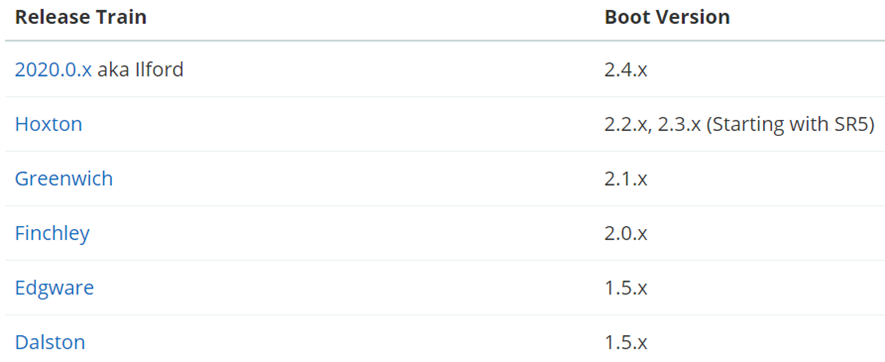</div>

我学习的版本是 Hoxton.SR10，因此对应的 Spring Boot 版本是 2.3.x 版本。

## 总结

- 单体架构：简单方便，高度耦合，扩展性差，适合小型项目。例如：学生管理系统

- 分布式架构：松耦合，扩展性好，但架构复杂，难度大。适合大型互联网项目，例如：京东、淘宝

- 微服务：一种良好的分布式架构方案

  ①优点：拆分粒度更小、服务更独立、耦合度更低

  ②缺点：架构非常复杂，运维、监控、部署难度提高

- Spring Cloud 是微服务架构的一站式解决方案，集成了各种优秀微服务功能组件

# 服务拆分和远程调用

任何分布式架构都离不开服务的拆分，微服务也是一样。

## 服务拆分原则

微服务拆分时的几个原则：

- <span style="color:green">不同微服务，不要重复开发相同业务</span>
- <span style="color:green">微服务数据独立，不要访问其它微服务的数据库</span>
- <span style="color:green">微服务可以将自己的业务暴露为接口，供其它微服务调用</span>

<div align="center"></div>

## 服务拆分示例

以微服务 cloud-demo 为例，其结构如下：

<div align="center"></div>

cloud-demo：父工程，管理依赖

- order-service：订单微服务，负责订单相关业务
- user-service：用户微服务，负责用户相关业务

要求：

- 订单微服务和用户微服务都必须有各自的数据库，相互独立
- 订单服务和用户服务都对外暴露 Restful 的接口
- 订单服务如果需要查询用户信息，只能调用用户服务的 Restful 接口，不能查询用户数据库

### 导入 SQL 语句

首先，将 `cloud-order.sql` 和 `cloud-user.sql `导入到 mysql中：

<div align="center"></div>

cloud-user 表中初始数据如下：

<div align="center"></div>

cloud-order 表中初始数据如下：

<div align="center"></div>

cloud-order 表中持有 cloud-user 表中的 id 字段。

### 导入demo工程

用 IDEA 导入课前资料提供的 Demo：

<div align="center">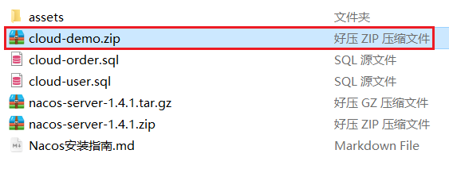</div>

项目结构如下：

<div align="center"></div>

导入后，会在IDEA右下角出现弹窗：

<div align="center">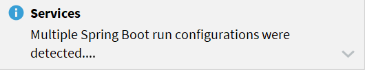</div>

点击弹窗，然后按下图选择：

<div align="center">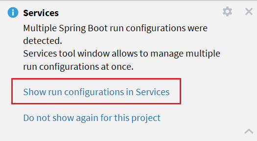</div>

会出现这样的菜单：

<div align="center"></div>

配置下项目使用的 `JDK`：

<div align="center"></div>

## 实现远程调用案例

在 order-service 服务中，有一个根据 id 查询订单的接口：

<div align="center"></div>

根据 id 查询订单，返回值是 Order 对象，如图：

<div align="center"></div>

其中的 user 为 null

在 user-service 中有一个根据 id 查询用户的接口：

<div align="center"></div>

查询的结果如图：

<div align="center"></div>

### 案例需求：

修改 order-service 中的根据 id 查询订单业务，要求在查询订单的同时，根据订单中包含的 userId 查询出用户信息，一起返回。

<div align="center">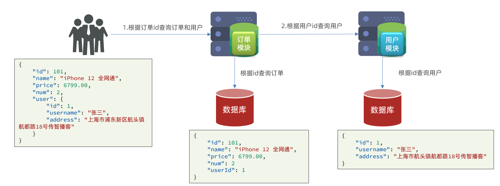</div>

因此，我们需要在 `order-service` 中向 `user-service` 发起一个 http 的请求，调用 http://localhost:8081/user/{userId} 这个接口。

大概的步骤是这样的：

- 注册一个 RestTemplate 的实例到 Spring 容器
- 修改 order-service 服务中的 OrderService 类中的 queryOrderById 方法，根据 Order 对象中的 userId 查询 User
- 将查询的 User 填充到 Order 对象，一起返回

### 注册RestTemplate

首先，我们在 `order-service` 服务中的 `OrderApplication` 启动类中，注册 `RestTemplate` 实例：

```java
package cn.itcast.order;

import org.mybatis.spring.annotation.MapperScan;
import org.springframework.boot.SpringApplication;
import org.springframework.boot.autoconfigure.SpringBootApplication;
import org.springframework.context.annotation.Bean;
import org.springframework.web.client.RestTemplate;

@MapperScan("cn.itcast.order.mapper")
@SpringBootApplication
public class OrderApplication {

    public static void main(String[] args) {
        SpringApplication.run(OrderApplication.class, args);
    }

    @Bean
    public RestTemplate restTemplate() {
        return new RestTemplate();
    }
}
```

### 实现远程调用

修改 `order-service` 服务中的 `cn.itcast.order.service` 包下的 `OrderService` 类中的 `queryOrderById` 方法：

<div align="center"></div>

## 提供者与消费者

在服务调用关系中，会有两个不同的角色：

<b>服务提供者</b>：一次业务中，被其它微服务调用的服务。（提供接口给其它微服务）

<b>服务消费者</b>：一次业务中，调用其它微服务的服务。（调用其它微服务提供的接口）

<div align="center"></div>

但是，服务提供者与服务消费者的角色并不是绝对的，而是相对于业务而言。

如果服务 A 调用了服务 B，而服务 B 又调用了服务 C，服务 B 的角色是什么？

- 对于 A 调用 B 的业务而言：A 是服务消费者，B 是服务提供者
- 对于 B 调用 C 的业务而言：B 是服务消费者，C 是服务提供者

因此，服务 B 既可以是服务提供者，也可以是服务消费者。

# Eureka注册中心

假如我们的服务提供者 `user-service` 部署了多个实例，如图：

<div align="center"></div>

> <b>思考：</b>

- `order-service` 在发起远程调用的时候，该如何得知 `user-service` 实例的 ip 地址和端口？
- 有多个 `user-service` 实例地址，`order-service` 调用时该如何选择？
- `order-service` 如何得知某个 `user-service` 实例是否依然健康，是不是已经宕机？

## Eureka的结构和作用

这些问题都需要利用 Spring Cloud 中的注册中心来解决，其中最广为人知的注册中心就是 Eureka，其结构如下：

<div align="center"></div>

> <b style="color:orange">order-service 如何得知 user-service 实例地址？</b>

获取地址信息的流程如下：

- `user-service` 服务实例启动后，将自己的信息注册到 `eureka-server`（`Eureka` 服务端）。这个叫服务注册
- `eureka-server` 保存服务名称到服务实例地址列表的映射关系。<span style="color:red">（key-->服务名称；value-->服务地址）</span>
- `order-service` 根据服务名称，拉取实例地址列表。这个叫服务发现或服务拉取

> <b style="color:orange">order-service 如何从多个 user-service 实例中选择具体的实例？</b>

- `order-service` 从实例列表中<span style="color:red">利用负载均衡算法选中一个实例地址</span>
- 向该实例地址发起远程调用

> <b style="color:orange">order-service 如何得知某个 user-service 实例是否依然健康，是不是已经宕机？</b>

- `user-service` 会每隔一段时间（默认 30 秒）向 `eureka-server` 发起请求，报告自己状态，称为心跳
- 当超过一定时间没有发送心跳时，`eureka-server` 会认为微服务实例故障，将该实例从服务列表中剔除
- `order-service` 拉取服务时，就能将故障实例排除了

<b style="color:orange">注意：一个微服务，既可以是服务提供者，又可以是服务消费者，因此 eureka 将服务注册、服务发现等功能统一封装到了eureka-client 端</b>

<div align="center">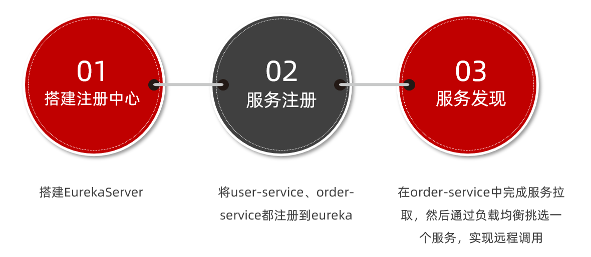</div>

## 搭建eureka-server

首先大家注册中心服务端：`eureka-server`，这必须是一个独立的微服务

### 创建eureka-server服务

在 `cloud-demo` 父工程下，创建一个子模块：

<div align="center"></div>

填写模块信息：

<div align="center"></div>

然后填写服务信息：

<div align="center">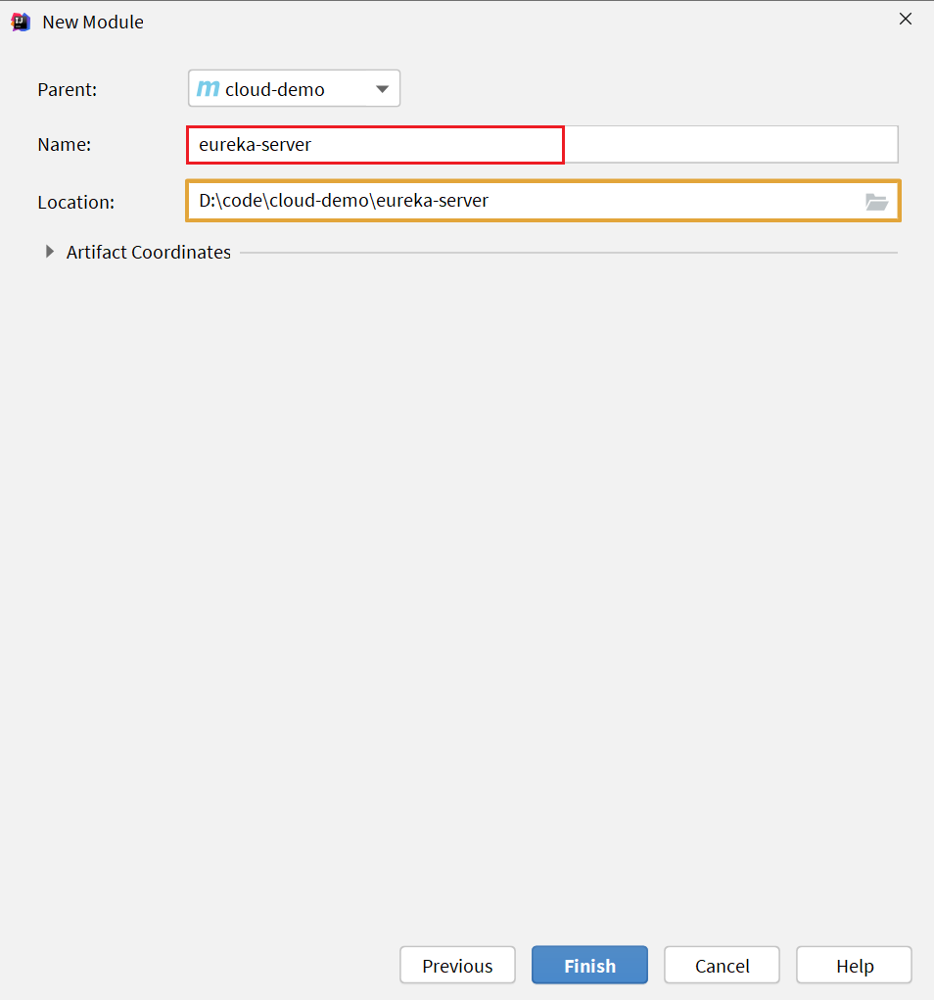</div>

### 引入eureka依赖

引入 `Spring Cloud` 为 `eureka` 提供的 `starter` 依赖：

```xml
<dependency>
    <groupId>org.springframework.cloud</groupId>
    <artifactId>spring-cloud-starter-netflix-eureka-server</artifactId>
</dependency>
```

### 编写启动类

给 `eureka-server` 服务编写一个启动类，一定要添加一个 `@EnableEurekaServer` 注解，开启 `eureka` 的注册中心功能：

```java
package cn.itcast.eureka;

import org.springframework.boot.SpringApplication;
import org.springframework.boot.autoconfigure.SpringBootApplication;
import org.springframework.cloud.netflix.eureka.server.EnableEurekaServer;

@SpringBootApplication
@EnableEurekaServer
public class EurekaApplication {
    public static void main(String[] args) {
        SpringApplication.run(EurekaApplication.class, args);
    }
}
```

### 编写配置文件

编写一个 `application.yml` 文件，内容如下：

```yaml
server:
  port: 10086
spring:
  application:
    name: eureka-server
eureka: # 配置 eureka 的地址信息。
  client:
    service-url: 
      defaultZone: http://127.0.0.1:10086/eureka
```

为什么 eureka 要自己配置自己？因为 eureka 也是一个微服务，所以会把自己也注册进去。为了以后 eureka 集群通信准备的。

### 启动服务

启动微服务，然后在浏览器访问：http://127.0.0.1:10086

看到下面结果应该是成功了：

<div align="center"></div>

## 服务注册

下面，我们将 `user-service` 注册到 `eureka-server` 中去。

### 引入依赖

在 `user-service` 的 `pom` 文件中，引入下面的 `eureka-client` 依赖：

```xml
<dependency>
    <groupId>org.springframework.cloud</groupId>
    <artifactId>spring-cloud-starter-netflix-eureka-client</artifactId>
</dependency>
```

### 配置文件

在 `user-service` 中，修改 `application.yml` 文件，添加服务名称、`eureka` 地址：

```yaml
spring:
  application:
    name: userservice
eureka: # 配置 eureka 地址，将 userservice 注册到 eureka 中
  client:
    service-url:
      defaultZone: http://127.0.0.1:10086/eureka
```

### 启动多个user-service实例

为了演示一个服务有多个实例的场景，我们添加一个 `SpringBoot` 的启动配置，再启动一个 `user-service`。

首先，复制原来的 `user-service` 启动配置：

<div align="center"></div>

然后，在弹出的窗口中，填写信息：

<div align="center"></div>

现在，`Spring Boot` 窗口会出现两个 `user-service` 启动配置：

<div align="center"></div>

不过，第一个是 `8081` 端口，第二个是 `8082` 端口。

启动两个 `user-service` 实例：

<div align="center"></div>

查看 `eureka-server` 管理页面：

<div align="center"></div>

## 服务发现

下面，我们将 `order-service` 的逻辑修改：向 `eureka-server` 拉取 `user-service` 的信息，实现服务发现。

### 引入依赖

之前说过，<span style="color:red">服务发现、服务注册统一都封装在 `eureka-client` 依赖</span>，因此这一步与服务注册时一致。

在 `order-service` 的 `pom` 文件中，引入下面的 `eureka-client` 依赖：

```xml
<dependency>
    <groupId>org.springframework.cloud</groupId>
    <artifactId>spring-cloud-starter-netflix-eureka-client</artifactId>
</dependency>
```

### 配置文件

服务发现也需要知道 eureka 地址，因此第二步与服务注册一致，都是配置 eureka 信息：

在 order-service 中，修改 application.yml 文件，添加服务名称、eureka地址：

```yaml
spring:
  application:
    name: orderservice
eureka:
  client:
    service-url:
      defaultZone: http://127.0.0.1:10086/eureka
```

### 服务拉取和负载均衡

最后，我们要去 `eureka-server` 中拉取 `user-service` 服务的实例列表，并且实现负载均衡。添加注解 @LoadBalanced 即可实现负载均衡。

在 order-service 的 `OrderApplication` 中，给 `RestTemplate` 这个Bean添加一个 `@LoadBalanced` 注解：

<div align="center"></div>

修改 `order-service` 服务中的 `cn.itcast.order.service` 包下的 `OrderService` 类中的 `queryOrderById` 方法。修改访问的 `url` 路径，用服务名代替 `ip`、端口：

<div align="center"></div>

`spring` 会自动帮助我们从 `eureka-server` 端，根据 `userservice` 这个服务名称，获取实例列表，而后完成负载均衡。<span style="color:orange">而这个服务拉取，不是每次请求服务都要进行的，服务消费者会拉取到服务列表后会进行缓存，后面的一段时间可以直接用缓存的服务列表信息。然后每隔 30 秒更新一次服务列表信息</span>

# Ribbon负载均衡

添加了`@LoadBalanced` 注解，即可实现负载均衡功能，这是什么原理呢？

## 负载均衡原理

`Spring Cloud` 底层其实是利用了一个名为 `Ribbon` 的组件，来实现负载均衡功能的。

<div align="center"></div>

我们发出的请求明明是 http://userservice/user/1，怎么变成了 http://localhost:8081 的呢？实际上是做了一个映射，将 userservice 映射到了其他地址。

## 源码跟踪

为什么我们只输入了 `service` 名称就可以访问了呢？之前还要获取 `IP` 和端口。显然有人帮我们根据 `service`  名称，获取到了服务实例的 `IP` 和端口。它就是 `LoadBalancerInterceptor`，这个类会在对 `RestTemplate` 的请求进行拦截，然后从 `Eureka` 根据服务 `id` 获取服务列表，随后利用负载均衡算法得到真实的服务地址信息，替换服务 `id`。

> 想看处理流程的可以进行源码跟踪：

### LoadBalancerIntercepor

<div align="center"></div>

可以看到这里的 intercept 方法，拦截了用户的 `HttpRequest` 请求，然后做了几件事：

- `request.getURI()`：获取请求 `uri`，本例中就是 http://user-service/user/8
- `originalUri.getHost()`：获取 `uri` 路径的主机名，其实就是服务 id，`user-service`
- `this.loadBalancer.execute()`：处理服务 id，和用户请求。

这里的 `this.loadBalancer` 是 `LoadBalancerClient` 类型，我们继续跟入。

### LoadBalancerClient

继续跟入 execute 方法：

<div align="center"></div>

代码是这样的：

- `getLoadBalancer(serviceId)：`根据服务 `id` 获取 `ILoadBalancer`，而 `ILoadBalancer` 会拿着服务 `id` 去 `eureka` 中获取服务列表并保存起来。
- `getServer(loadBalancer)：`利用内置的负载均衡算法，从服务列表中选择一个。本例中，可以看到获取了 8082 端口的服务

放行后，再次访问并跟踪，发现获取的是 8081：

<div align="center"></div>

果然实现了负载均衡。

### 负载均衡策略IRule

在刚才的代码中，可以看到获取服务使通过一个 `getServer` 方法来做负载均衡:

<div align="center"></div>

我们继续跟入：

<div align="center"></div>

继续跟踪源码 `chooseServer` 方法，发现这么一段代码：

<div align="center"></div>

我们看看这个 rule 是谁：

<div align="center"></div>

这里的 rule 默认值是一个 `RoundRobinRule`，看类的介绍：

<div align="center"></div>

这不就是轮询的意思嘛。到这里，整个负载均衡的流程我们就清楚了。

### 总结

`SpringCloudRibbon` 的底层采用了一个拦截器，拦截了 `RestTemplate` 发出的请求，对地址做了修改。用一幅图来总结一下：

<div align="center"></div>

基本流程如下：

- 拦截我们的 `RestTemplate` 请求 http://userservice/user/1
- `RibbonLoadBalancerClient` 会从请求 `url` 中获取服务名称，也就是 user-service
- `DynamicServerListLoadBalancer` 根据  `user-service` 到  `eureka` 拉取服务列表
- `eureka` 返回列表，`localhost:8081`、`localhost:8082`
- `IRule` 利用内置负载均衡规则，从列表中选择一个，例如 `localhost:8081` [ 默认的负载均衡策略是轮询 ]
- `RibbonLoadBalancerClient` 修改请求地址，用 `localhost:8081` 替代`userservice`，得到 http://localhost:8081/user/1，发起真实请求

## 负载均衡策略

### 负载均衡策略

负载均衡的规则都定义在 `IRule` 接口中，而 `IRule` 有很多不同的实现类：

<div align="center"></div>

不同规则的含义如下：

| **内置负载均衡规则类**      | **规则描述**                                                 |
| --------------------------- | ------------------------------------------------------------ |
| `RoundRobinRule`            | 简单轮询服务列表来选择服务器。它是 Ribbon 默认的负载均衡规则。 |
| `AvailabilityFilteringRule` | 对以下两种服务器进行忽略：   <br>（1）在默认情况下，这台服务器如果 3 次连接失败，这台服务器就会被设置为“短路”状态。短路状态将持续30秒，如果再次连接失败，短路的持续时间就会几何级地增加。  <br>（2）并发数过高的服务器。如果一个服务器的并发连接数过高，配置了 `AvailabilityFilteringRule` 规则的客户端也会将其忽略。并发连接数的上限，可以由客户端的 `<clientName>.<clientConfigNameSpace>.ActiveConnectionsLimit` 属性进行配置。 |
| `WeightedResponseTimeRule`  | 为每一个服务器赋予一个权重值。服务器响应时间越长，这个服务器的权重就越小。这个规则会随机选择服务器，这个权重值会影响服务器的选择。 |
| `ZoneAvoidanceRule`         | 以区域可用的服务器为基础进行服务器的选择。使用 Zone 对服务器进行分类，这个 Zone 可以理解为一个机房、一个机架等。而后再对 Zone 内的多个服务做轮询。 |
| `BestAvailableRule`         | 忽略那些短路的服务器，并选择并发数较低的服务器。             |
| `RandomRule`                | 随机选择一个可用的服务器。                                   |
| `RetryRule`                 | 重试机制的选择逻辑                                           |

默认的实现就是 `ZoneAvoidanceRule`，是一种轮询方案

### 自定义负载均衡策略

通过定义 `IRule` 实现可以修改负载均衡规则，有两种方式：

<span style="color:purple">代码方式</span>：在 <span style="color:red">order-service </span>中的 `OrderApplication` 类中，定义一个新的 `IRule`，<span style="color:green">这样 order-service 在请求服务的时候就会根据我们配置的负载均衡规则进行查找最合适的服务。</span>

```java
@Bean
public IRule randomRule(){
    return new RandomRule();
}
```

<span style="color:purple">配置文件方式</span>：在 `order-service` 的 `application.yml` 文件中，添加新的配置也可以修改规则：

```yaml
userservice: # 给某个微服务配置负载均衡规则，这里是userservice服务
  ribbon:
    NFLoadBalancerRuleClassName: com.netflix.loadbalancer.RandomRule # 负载均衡规则 
```

<b>注意，一般用默认的负载均衡规则，不做修改。</b>

## 饥饿加载

`Ribbon` 默认是采用懒加载，即第一次访问时才会去创建 `LoadBalanceClient`，因此第一次请求的时间会很长。

而饥饿加载则会在项目启动时创建，降低第一次访问的耗时，通过下面配置开启饥饿加载：

```yaml
ribbon:
  eager-load:
    enabled: true
    clients: userservice
```

## 总结

- Ribbon 负载均衡规则
  - 规则接口时 IRule
  - 默认实现时 ZoneAvoidanceRule，根据 zone 选择服务列表，然后轮询
- 负载均衡自定义方式
  - 代码方式：配置灵活，但是修改时需要重新打包发布
  - 配置方式：直观、方便，无需重新打包发布，但是无法做全局配置
- 饥饿加载
  - 开启饥饿加载
  - 指定饥饿加载的微服务名称

# Nacos注册中心

`SpringCloudAlibaba` 推出了一个名为 `Nacos` 的注册中心。

[Nacos](https://nacos.io/) 是阿里巴巴的产品，现在是 [SpringCloud](https://spring.io/projects/spring-cloud) 中的一个组件。相比 [Eureka](https://github.com/Netflix/eureka) 功能更加丰富，在国内受欢迎程度较高。

<div align="center"></div>

安装方式可以参考《Nacos安装指南.md》

## 服务注册到 nacos

`Nacos` 是 `SpringCloudAlibaba` 的组件，而 `SpringCloudAlibaba` 也遵循 `SpringCloud` 中定义的服务注册、服务发现规范。因此使用 `Nacos` 和使用 `Eureka` 对于微服务来说，并没有太大区别。

主要差异在于：

- 依赖不同
- 服务地址不同

### 引入依赖

在 `cloud-demo` 父工程的 `pom` 文件中的 `<dependencyManagement>` 中引入 `SpringCloudAlibaba` 的依赖：

```xml
<dependency>
    <groupId>com.alibaba.cloud</groupId>
    <artifactId>spring-cloud-alibaba-dependencies</artifactId>
    <version>2.2.6.RELEASE</version>
    <type>pom</type>
    <scope>import</scope>
</dependency>
```

然后在 `user-service` 和 `order-service` 中的 `pom` 文件中引入 `nacos-discovery` 依赖：

```xml
<dependency>
    <groupId>com.alibaba.cloud</groupId>
    <artifactId>spring-cloud-starter-alibaba-nacos-discovery</artifactId>
</dependency>
```

> <span style="color:red">注意：不要忘了注释掉 eureka 的依赖。</span>

### 配置nacos地址

在 `user-service` 和 `order-service` 的 `application.yml` 中添加 `nacos` 地址：

```yaml
spring:
  cloud:
    nacos:
      server-addr: localhost:8848
```

> <span style="color:red">注意：不要忘了注释掉 eureka 的地址</span>

### 重启

重启微服务后，登录 `nacos` 管理页面，可以看到微服务信息：

<div align="center"></div>

## 服务分级存储模型

一个<b>服务</b>可以有多个<b>实例</b>，例如我们的 user-service，可以有:

- 127.0.0.1:8081
- 127.0.0.1:8082
- 127.0.0.1:8083

假如这些实例分布于全国各地的不同机房，例如：

- 127.0.0.1:8081，在上海机房
- 127.0.0.1:8082，在上海机房
- 127.0.0.1:8083，在杭州机房

Nacos 就将同一机房内的实例划分为一个<b>集群</b>。

也就是说，user-service 是服务，一个服务可以包含多个集群，如杭州、上海，每个集群下可以有多个实例，形成分级模型，如图：

<div align="center"></div>


微服务互相访问时，应该尽可能访问同集群实例，因为本地访问速度更快。当本集群内不可用时，才访问其它集群。例如：

<div align="center"></div>

杭州机房内的 order-service 应该优先访问同机房的 user-service。

### 给 user-service 配置集群

修改 `user-service` 的 `application.yml` 文件，添加集群配置：

```yaml
spring:
  cloud:
    nacos:
      server-addr: localhost:8848
      discovery:
        cluster-name: HZ # 集群名称
```

重启两个 `user-service` 实例后，我们可以在 `nacos` 控制台看到下面结果：

<div align="center"></div>

我们再次复制一个 `user-service` 启动配置，添加属性：

```sh
-Dserver.port=8083 -Dspring.cloud.nacos.discovery.cluster-name=SH
```

配置如图所示：

<div align="center"></div>

启动 `UserApplication3` 后再次查看 `nacos` 控制台：

<div align="center"></div>

### 同集群优先的负载均衡

默认的 `ZoneAvoidanceRule` 并不能实现根据同集群优先来实现负载均衡，它只是首次访问是会同集群的服务，后面就是轮询，一个一个依次使用了。

因此 `Nacos` 中提供了一个 `NacosRule` 的实现，可以优先从同集群中挑选实例。

1）给 order-service 配置集群信息

修改 `order-service` 的 `application.yml` 文件，添加集群配置：

```sh
spring:
  cloud:
    nacos:
      server-addr: localhost:8848
      discovery:
        cluster-name: HZ # 集群名称
```

2）修改负载均衡规则

修改 `order-service` 的 `application.yml` 文件，修改负载均衡规则：

```yaml
userservice:
  ribbon:
    NFLoadBalancerRuleClassName: com.alibaba.cloud.nacos.ribbon.NacosRule # 负载均衡规则 
```

这样就是优先访问同集群的服务了，同集群内有多个服务的话，会随机选择一个服务进行访问。

<b>Nacos 负载均衡策略</b>

- 优先同集群服务实例列表
- 本地集群找不到提供者，才去其他集群寻找，并且会报警告
- 确定了可用实例列表后，再采用随机负载均衡挑选实例

## 权重配置

实际部署中会出现这样的场景：

服务器设备性能有差异，部分实例所在机器性能较好，另一些较差，我们希望性能好的机器承担更多的用户请求。

但默认情况下 NacosRule 是同集群内随机挑选，不会考虑机器的性能问题。

因此，Nacos 提供了权重配置来控制访问频率，权重越大则访问频率越高。

在 nacos 控制台，找到 user-service 的实例列表，点击编辑，即可修改权重：

<div align="center"></div>

在弹出的编辑窗口，修改权重：

<div align="center"></div>

> <b>注意</b>：如果权重修改为 0，则该实例永远不会被访问

可以通过权值配置，在需要进行服务升级时，先将一部分服务器的权值设置为 0，服务神升级后在将升级后的服务器权值设置成 0.1 用小批量用户测下升级后稳不稳定，稳定后再进行大批量的升级。

## 环境隔离

`Nacos` 提供了 `namespace` 来实现环境隔离功能。

- `nacos` 中可以有多个 `namespace`
- `namespace` 下可以有 group、service 等
- 不同 `namespace` 之间相互隔离，例如不同 `namespace` 的服务互相不可见

<div align="center"></div>

### 创建 namespace

默认情况下，所有 service、data、group都在同一个 `namespace`，名为public：

<div align="center"></div>

我们可以点击页面新增按钮，添加一个 `namespace`：

<div align="center"></div>

然后，填写表单：

<div align="center"></div>

就能在页面看到一个新的 `namespace`：

<div align="center"></div>

### 给微服务配置 namespace

给微服务配置 namespace 只能通过修改配置来实现。

例如，修改order-service的application.yml文件：

```yaml
spring:
  cloud:
    nacos:
      server-addr: localhost:8848
      discovery:
        cluster-name: HZ
        namespace: 492a7d5d-237b-46a1-a99a-fa8e98e4b0f9 # 命名空间，填ID
```

重启 order-service 后，访问控制台，可以看到下面的结果：

<div align="center"></div>

<div align="center"></div>

此时访问 order-service，因为 namespace 不同，会导致找不到 userservice，控制台会报错：

<div align="center"></div>

## Nacos 与 Eureka 的区别

Nacos 会把服务实例划分为两种类型：

- 一种是临时实例：如果实例宕机超过一定时间，会从服务列表剔除，默认的服务实例类型。对于临时实例，通过心跳机制检测服务的状态与 Eureka 一致。

- 另一种是非临时实例：如果实例宕机，不会从服务列表剔除，只是会将其标记为"不健康"，等待他恢复成健康状态。也可以叫永久实例。

:orange:<span style="color:orange">Eureka 做服务拉取是 30 秒更新/拉取一次服务列表，更新的可能不够及时；而 nacos 中，如果采用的是非临时实例，会有有消息推送，假设 nacos 发现有服务挂了会把主动推送变更消息到消费者那边，让消费者及时更新。但是 nacos 非临时实例的主动检测模式对服务器的压力比较大，一般都是采用临时实例。</span>

配置一个服务实例为永久实例：

```yaml
spring:
  cloud:
    nacos:
      discovery:
        ephemeral: false # 设置为非临时实例
```

Nacos 和 Eureka 整体结构类似，服务注册、服务拉取、心跳等待，但是也存在一些差异：

<div align="center"></div>

- Nacos 与 eureka 的共同点
  - 都支持服务注册和服务拉取
  - 都支持服务提供者心跳方式做健康检测

- Nacos 与 Eureka 的区别
  - Nacos 支持服务端主动检测提供者状态：临时实例采用心跳模式，非临时实例采用主动检测模式
  - 临时实例心跳不正常会被剔除，非临时实例则不会被剔除，仅仅是把他标记为不健康，等他变好。
  - Nacos 支持服务列表变更的消息推送模式，服务列表更新更及时。（eureka 是 pull 而 nacos 是 pull+push）
  - Nacos 集群默认采用 AP（强调数据的可用性，服务的可用性）方式，当集群中存在非临时实例时，采用 CP（强调数据的可靠性和一致性）模式；Eureka 采用 AP 方式。

# 实用篇概述

- Nacos 配置管理
- Feign 远程调用
- Gateway 服务网关

# Nacos配置管理

Nacos 除了可以做注册中心，同样可以做配置管理来使用。

> 主要内容

- 统一配置管理
- 配置热更新
- 配置共享
- 搭建 Nacos 集群

## 统一配置管理

当微服务部署的实例越来越多，达到数十、数百时，逐个修改微服务配置很麻烦，而且很容易出错。我们需要一种统一配置管理方案，可以集中管理所有实例的配置。

> 配置热更新

<div align="center"></div>


Nacos 一方面可以将配置集中管理，另一方可以在配置变更时，及时通知微服务，实现配置的热更新。

### 在nacos中添加配置文件

如何在 nacos 中管理配置呢？

<div align="center"></div>

然后在弹出的表单中，填写配置信息：

- Data ID 就是配置文件的名称。配置文件的名称取名：`服务名称-[profile].[后缀名]` 避免文件名字冲突。

<div align="center"></div>

> 注意：项目的核心配置，需要热更新的配置才有放到 nacos 管理的必要。基本不会变更的一些配置还是保存在微服务本地比较好。

### 从微服务拉取配置

微服务要拉取 nacos 中管理的配置，并且与本地的 application.yml 配置合并，才能完成项目启动。但如果尚未读取 application.yml，又如何得知 nacos 地址呢？

因此 spring 引入了一种新的配置文件：bootstrap.yaml 文件，会在 application.yml 之前被读取，流程如下：

<div align="center"></div>

1）引入 nacos-config 依赖

首先，在 user-service 服务中，引入 nacos-config 的客户端依赖：

```xml
<!--nacos配置管理依赖-->
<dependency>
    <groupId>com.alibaba.cloud</groupId>
    <artifactId>spring-cloud-starter-alibaba-nacos-config</artifactId>
</dependency>
```

2）添加 bootstrap.yaml

然后，在 user-service 中添加一个 bootstrap.yaml 文件，内容如下：

```yaml
spring:
  application:
    name: userservice # 服务名称
  profiles:
    active: dev #开发环境，这里是dev 
  cloud:
    nacos:
      server-addr: localhost:8848 # Nacos地址
      config:
        file-extension: yaml # 文件后缀名
```

这里会根据 spring.cloud.nacos.server-addr 获取 nacos 地址，再根据

`${spring.application.name}-${spring.profiles.active}.${spring.cloud.nacos.config.file-extension} `作为文件 id，来读取配置。

本例中，就是去读取`userservice-dev.yaml`：

<div align="center"></div>

3）读取 nacos 配置

在 user-service 中的 UserController 中添加业务逻辑，读取 pattern.dateformat 配置：

<div align="center"></div>

完整代码：

```java
package cn.itcast.user.web;

import cn.itcast.user.pojo.User;
import cn.itcast.user.service.UserService;
import lombok.extern.slf4j.Slf4j;
import org.springframework.beans.factory.annotation.Autowired;
import org.springframework.beans.factory.annotation.Value;
import org.springframework.web.bind.annotation.*;

import java.time.LocalDateTime;
import java.time.format.DateTimeFormatter;

@Slf4j
@RestController
@RequestMapping("/user")
public class UserController {

    @Autowired
    private UserService userService;

    @Value("${pattern.dateformat}")
    private String dateformat;
    
    @GetMapping("now")
    public String now(){
        return LocalDateTime.now().format(DateTimeFormatter.ofPattern(dateformat));
    }
    // ...略
}
```

在页面访问，可以看到效果：

<div align="center"></div>

## 配置热更新

我们最终的目的，是修改 nacos 中的配置后，微服务中无需重启即可让配置生效，也就是**配置热更新**。

Nacos 中的配置文件变更后，微服务无需重启就可以感知，不过需要通过下面两种配置实现：

### 方式一

在@Value注入的变量所在类上添加注解@RefreshScope：

<div align="center"></div>

### 方式二

使用 @ConfigurationProperties 注解代替 @Value 注解。

在 user-service 服务中，添加一个类，读取 patterrn.dateformat 属性：

```java
package cn.itcast.user.config;

import lombok.Data;
import org.springframework.boot.context.properties.ConfigurationProperties;
import org.springframework.stereotype.Component;

@Component
@Data
@ConfigurationProperties(prefix = "pattern")
public class PatternProperties {
    private String dateformat;
}
```

在UserController中使用这个类代替@Value：

<div align="center"></div>

完整代码：

```java
package cn.itcast.user.web;

import cn.itcast.user.config.PatternProperties;
import cn.itcast.user.pojo.User;
import cn.itcast.user.service.UserService;
import lombok.extern.slf4j.Slf4j;
import org.springframework.beans.factory.annotation.Autowired;
import org.springframework.web.bind.annotation.GetMapping;
import org.springframework.web.bind.annotation.PathVariable;
import org.springframework.web.bind.annotation.RequestMapping;
import org.springframework.web.bind.annotation.RestController;

import java.time.LocalDateTime;
import java.time.format.DateTimeFormatter;

@Slf4j
@RestController
@RequestMapping("/user")
public class UserController {

    @Autowired
    private UserService userService;

    @Autowired
    private PatternProperties patternProperties;

    @GetMapping("now")
    public String now(){
        return LocalDateTime.now().format(DateTimeFormatter.ofPattern(patternProperties.getDateformat()));
    }

    // 略
}
```

## 配置共享

其实微服务启动时，会去 nacos 读取多个配置文件，例如：

- `[spring.application.name]-[spring.profiles.active].yaml`，例如：userservice-dev.yaml

- `[spring.application.name].yaml`，例如：userservice.yaml

而 `[spring.application.name].yaml` 不包含环境，因此可以被多个环境共享。

下面我们通过案例来测试配置共享

### 添加一个环境共享配置

我们在 nacos 中添加一个 userservice.yaml 文件：

<div align="center">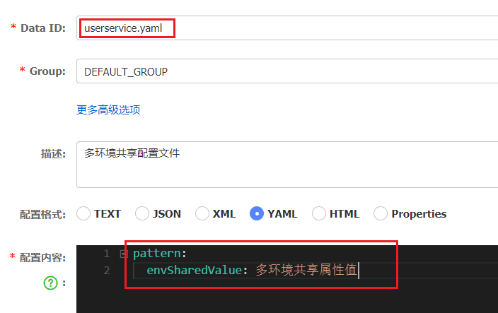</div>


### 在user-service中读取共享配置

在 user-service 服务中，修改 PatternProperties 类，读取新添加的属性：

<div align="center"></div>

在user-service服务中，修改UserController，添加一个方法：

<div align="center"></div>

### 运行两个UserApplication，使用不同的profile

修改 UserApplication2 这个启动项，改变其 profile 值：

<div align="center"></div>

<div align="center"></div>

这样，UserApplication(8081) 使用的 profile 是 dev，UserApplication2(8082) 使用的 profile 是 test。

启动 UserApplication和UserApplication2

访问 http://localhost:8081/user/prop，结果：

<div align="center"></div>

访问 http://localhost:8082/user/prop，结果：

<div align="center"></div>

可以看出来，不管是 dev，还是 test 环境，都读取到了 envSharedValue 这个属性的值。

### 配置共享的优先级

当 nacos、服务本地同时出现相同属性时，优先级有高低之分：

<div align="center"></div>

## 搭建Nacos集群

Nacos 生产环境下一定要部署为集群状态，部署方式参考课前资料中的文档：

<div align="center"></div>

# Feign远程调用

先前我们利用 RestTemplate 发起远程调用的代码：

<div align="center"></div>

但是 RestTemplate 存在下面的问题：

- 代码可读性差，编程体验不统一
- 参数复杂 URL 难以维护

Feign 是一个声明式的 http 客户端，官方地址：https://github.com/OpenFeign/feign；其作用就是帮助我们优雅的实现 http 请求的发送，解决上面提到的问题。

<div align="center"></div>

## Feign替代RestTemplate

Fegin 的使用步骤如下：

### 引入依赖

我们在 order-service 服务的 pom 文件中引入 feign 的依赖：

```xml
<dependency>
    <groupId>org.springframework.cloud</groupId>
    <artifactId>spring-cloud-starter-openfeign</artifactId>
</dependency>
```

### 添加注解

在 order-service 的启动类添加注解开启 Feign 的功能：

<div align="center"></div>

### 编写Feign的客户端

在 order-service 中新建一个接口，内容如下：

```java
package cn.itcast.order.client;

import cn.itcast.order.pojo.User;
import org.springframework.cloud.openfeign.FeignClient;
import org.springframework.web.bind.annotation.GetMapping;
import org.springframework.web.bind.annotation.PathVariable;

@FeignClient("userservice")
public interface UserClient {
    @GetMapping("/user/{id}")
    User findById(@PathVariable("id") Long id);
}
```

这个客户端主要是基于 Spring MVC 的注解来声明远程调用的信息，比如：

- 服务名称：userservice
- 请求方式：GET
- 请求路径：/user/{id}
- 请求参数：Long id
- 返回值类型：User

这样，Feign 就可以帮助我们发送 http 请求（无需我们写具体的调用代码，会自动生成？），无需自己使用 RestTemplate 来发送了。

### 测试

修改 order-service 中的 OrderService 类中的 queryOrderById 方法，使用 Feign 客户端代替 RestTemplate；看起来优雅多了。

<div align="center"></div>

### 总结

使用 Feign 的步骤

① 引入依赖

② 主程序启动类上添加 @EnableFeignClients 注解

③ 编写 FeignClient 接口（只是告诉程序要去这个远程地址请求数据，数据的返回类型是什么，因此定义一个接口，接口中声明方法即可，后面应该会自动生成对象执行方法的调用）

④ 使用 FeignClient 中定义的方法代替 RestTemplate

## 自定义配置

Feign 可以支持很多的自定义配置，如下表所示：

| 类型                      | 作用             | 说明                                                         |
| ------------------------- | ---------------- | ------------------------------------------------------------ |
| <b>feign.Logger.Level</b> | 修改日志级别     | 包含四种不同的级别：NONE、BASIC、HEADERS、FULL               |
| feign.codec.Decoder       | 响应结果的解析器 | http 远程调用的结果做解析，例如解析 json 字符串为 java 对象  |
| feign.codec.Encoder       | 请求参数编码     | 将请求参数编码，便于通过 http 请求发送                       |
| feign.Contract            | 支持的注解格式   | 默认是 Spring MVC 的注解                                     |
| feign.Retryer             | 失败重试机制     | 请求失败的重试机制，默认是没有，但是 feign 底层是依赖于 Ribbon 的，Ribbon 自己会进行重试。（如有多个服务 A，B，C，请求 A 长时间没有响应那就继续请求 B） |

一般情况下，默认值就能满足我们使用，如果要自定义时，只需要创建自定义的 @Bean 覆盖默认 Bean 即可。下面以日志为例来演示如何自定义配置。

### 配置文件方式

基于配置文件修改 feign 的日志级别可以针对单个服务：（我们在 Order 里调用了 User，那么 Feign 的配置就写在 Order 的配置文件中）

```yaml
feign:  
  client:
    config: 
      userservice: # 针对某个微服务的配置
        loggerLevel: FULL #  日志级别 
```

也可以针对所有服务

```yaml
feign:  
  client:
    config: 
      default: # 这里用default就是全局配置，如果是写服务名称，则是针对某个微服务的配置
        loggerLevel: FULL #  日志级别 
```

而日志的级别分为四种

- NONE：不记录任何日志信息，这是默认值。<span style="color:red">（记录日志用 NONE 或 BASIC）</span>
- BASIC：仅记录请求的方法，URL 以及响应状态码和执行时间。
- HEADERS：在 BASIC 的基础上，额外记录了请求和响应的头信息。
- FULL：记录所有请求和响应的明细，包括头信息、请求体、元数据。<span style="color:red">(调试错误的时候用 Full)</span>

### Java代码方式

也可以基于 Java 代码来修改日志级别，先声明一个类，然后声明一个 Logger.Level 的对象

```java
public class DefaultFeignConfiguration  {
    @Bean
    public Logger.Level feignLogLevel(){
        return Logger.Level.BASIC; // 日志级别为BASIC
    }
}
```

<b style="color:orange">如果要全局生效，将其放到启动类的 @EnableFeignClients 这个注解中</b>

```java
@EnableFeignClients(defaultConfiguration = DefaultFeignConfiguration.class) 
```

<b style="color:orange">如果是局部生效，则把它放到对应的 @FeignClient 这个注解中（uservice 只对 uservice 这个服务有效）</b>

```java
@FeignClient(value = "userservice", configuration = DefaultFeignConfiguration.class) 
```

## Feign使用优化

Feign 底层发起 http 请求，依赖于其它的框架。其底层客户端实现包括：

- URLConnection：默认实现，不支持连接池
- Apache HttpClient ：支持连接池
- OKHttp：支持连接池

<b>因此提高 Feign 的性能主要手段就是使用连接池代替默认的 URLConnection。</b>

这里我们用 Apache 的 HttpClient 来演示。

> 1）引入依赖

在 order-service 的 pom 文件中引入 Apache 的 HttpClient 依赖：

```xml
<!--httpClient的依赖 -->
<dependency>
    <groupId>io.github.openfeign</groupId>
    <artifactId>feign-httpclient</artifactId>
</dependency>
```

> 2）配置连接池

在 order-service 的 application.yml 中添加配置

```yaml
feign:
  client:
    config:
      default: # default全局的配置
        loggerLevel: BASIC # 日志级别，BASIC就是基本的请求和响应信息
  httpclient:
    enabled: true # 开启feign对HttpClient的支持
    max-connections: 200 # 最大的连接数
    max-connections-per-route: 50 # 每个路径的最大连接数
```

接下来，在 FeignClientFactoryBean 中的 loadBalance 方法中打断点

<div align="center"></div>

Debug 方式启动 order-service 服务，可以看到这里的 client，底层就是 Apache HttpClient

<div align="center"></div>

> 总结，Feign 的优化

1.日志级别尽量用 basic

2.使用 HttpClient 或 OKHttp 代替 URLConnection

①引入 feign-httpClient 依赖

②配置文件开启 httpClient 功能，设置连接池参数

> <b>HTTP 连接池复用扩展</b>

[Http持久连接与HttpClient连接池 - kingszelda - 博客园 (cnblogs.com)](https://www.cnblogs.com/kingszelda/p/8988505.html)

- HTTP/1.1 采取持久连接的方式替代了 Keep-Alive。
- HTTP/1.1 的连接默认情况下都是持久连接。如果要显式关闭，需要在报文中加上 Connection:Close 首部。即在 HTTP/1.1 中，所有的连接都进行了复用。
- 然而如同 Keep-Alive 一样，空闲的持久连接也可以随时被客户端与服务端关闭。不发送 Connection:Close 不意味着服务器承诺连接永远保持打开。

 HttpClien 中使用了连接池来管理持有连接，同一条 TCP 链路上，连接是可以复用的。HttpClient 通过连接池的方式进行连接持久化。

- 当有连接第一次使用的时候建立连接
- 结束时对应连接不关闭，归还到池中
- 下次同个目的的连接可从池中获取一个可用连接
- 定期清理过期连接

## 最佳实践

所谓最佳实践，就是使用过程中总结的经验，最好的一种使用方式。观察可以发现，Feign 的客户端与服务提供者的 Controller 代码非常相似

feign 客户端

<div align="center"></div>

UserController

<div align="center"></div>

有没有一种办法简化这种重复的代码编写呢？

> Feign 的最佳实现

- 让 Controller 和 FeignClient 继承同一接口
- 将 FeignClient、POJO、Feign 的默认配置都定义到一个项目中，供所有消费者使用。

### 继承方式

一样的代码可以通过继承来共享：

1）定义一个 API 接口，利用定义方法，并基于 Spring MVC 注解做声明。

2）Feign 客户端和 Controller 都继承接口

<div align="center"></div>

优点：

- 简单
- 实现了代码共享

缺点：

- 服务提供方、服务消费方紧耦合

- 参数列表中的注解映射并不会继承，因此 Controller 中必须再次声明方法、参数列表、注解

### 抽取方式

:orange:<span style="color:orange">将 Feign 的 Client 抽取为独立模块，并且把接口有关的 POJO、默认的 Feign 配置都放到这个模块中，提供给所有消费者使用。例如，将 UserClient、User、Feign 的默认配置都抽取到一个 feign-api 包中，所有微服务引用该依赖包，即可直接使用。</span>

<div align="center">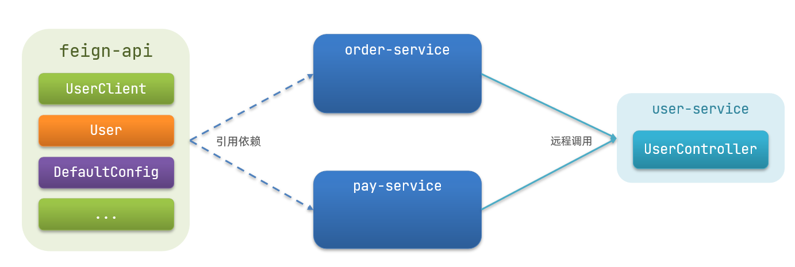</div>

### 实现基于抽取的最佳实践

#### 抽取

首先创建一个 module，命名为 feign-api：

<div align="center"></div>

项目结构：

<div align="center"></div>

在 feign-api 中然后引入 feign 的 starter 依赖

```xml
<dependency>
    <groupId>org.springframework.cloud</groupId>
    <artifactId>spring-cloud-starter-openfeign</artifactId>
</dependency>
```

然后，order-service 中编写的 UserClient、User、DefaultFeignConfiguration 都复制到 feign-api 项目中

<div align="center"></div>

#### 在order-service中使用feign-api

首先，删除 order-service 中的 UserClient、User、DefaultFeignConfiguration 等类或接口。

在 order-service 的 pom 文件中中引入 feign-api 的依赖：

```xml
<dependency>
    <groupId>cn.itcast.demo</groupId>
    <artifactId>feign-api</artifactId>
    <version>1.0</version>
</dependency>
```

修改 order-service 中的所有与上述三个组件有关的导包部分，改成导入 feign-api 中的包

#### 重启测试

重启后，发现服务报错了：

<div align="center"></div>

这是因为 UserClient 现在在 cn.itcast.feign.clients 包下，

而 order-service 的 @EnableFeignClients 注解是在 cn.itcast.order 包下，不在同一个包，无法扫描到 UserClient。

#### 解决扫描包问题

方式一，指定 Feign 应该扫描的包

```java
@EnableFeignClients(basePackages = "cn.itcast.feign.clients")
```

方式二，指定需要加载的 Client 接口

```java
@EnableFeignClients(clients = {UserClient.class})
```

# Gateway服务网关

Spring Cloud Gateway 是 Spring Cloud 的一个全新项目，该项目是基于 Spring 5.0，Spring Boot 2.0 和 Project Reactor 等响应式编程和事件流技术开发的网关，它旨在为微服务架构提供一种简单有效的统一的 API 路由管理方式。

## 为什么需要网关

Gateway 网关是所有微服务的统一入口。先判断请求是不是可以放行，可以放行才会把请求转发到对应的微服务。网关可以对请求进行校验，符合要求才放行；可以对请求进行加工，如添加/修改/删除请求头；可以做服务的负载均衡；由于请求是由网关进行分发的，且如果需要请求数据，最终也是由网关发送数据给客户端的，因此最终请求的到底是那个服务器，到底是用的那个接口对客户端来说是未知的，可以隐藏具体业务的请求地址；

<b>网关的核心功能特性</b>

- 服务路由、负载均衡（有点像权限校验+路由转发+负载均衡）
- 身份认证和权限校验
- 请求限流
- 隐藏具体业务的请求地址？

架构图如下
<div align="center"></div>

<b>权限控制：</b>网关作为微服务入口，需要校验用户是是否有请求资格，如果没有则进行拦截。

<b>路由和负载均衡：</b>一切请求都必须先经过 gateway，但网关不处理业务，而是根据某种规则，把请求转发到某个微服务，这个过程叫做路由。当然路由的目标服务有多个时，还需要做负载均衡。

<b>限流：</b>当请求流量过高时，在网关中按照下流的微服务能够接受的速度来放行请求，避免服务压力过大。

在 Spring Cloud 中网关的实现包括两种：

- gateway
- zuul

Zuul 是基于 Servlet 的实现，属于阻塞式编程。而 Spring Cloud Gateway 则是基于 Spring5 中提供的 WebFlux，属于响应式编程的实现，具备更好的性能。

## 可以搭建Gateway集群吗？

Gateway 是无法搭建集群的，不过可以配合 Nginx 实现集群的搭建及负载均衡。集群搭建很简单， Gateway 项目自己不用做改动。

- 搭建 nginx 集群
- nginx 中配置 Gateway 的地址，并配置 nginx 的负载均衡策略

[Nginx集群（负载均衡） - 休耕 - 博客园 (cnblogs.com)](https://www.cnblogs.com/xiugeng/p/10155283.html)

## gateway快速入门

下面，我们就演示下网关的基本路由功能。基本步骤如下

1. 创建 Spring Boot 工程 gateway，引入网关依赖
2. 编写启动类
3. 编写基础配置和路由规则
4. 启动网关服务进行测试

### 创建gateway服务，引入依赖

创建服务

<div align="center"></div>

引入依赖：网关本身也是一个微服务，也要注册到 nacos 中去。

```xml
<!--网关-->
<dependency>
    <groupId>org.springframework.cloud</groupId>
    <artifactId>spring-cloud-starter-gateway</artifactId>
</dependency>
<!--nacos服务发现依赖-->
<dependency>
    <groupId>com.alibaba.cloud</groupId>
    <artifactId>spring-cloud-starter-alibaba-nacos-discovery</artifactId>
</dependency>
```

### 编写启动类

```java
package cn.itcast.gateway;

import org.springframework.boot.SpringApplication;
import org.springframework.boot.autoconfigure.SpringBootApplication;

@SpringBootApplication
public class GatewayApplication {

	public static void main(String[] args) {
		SpringApplication.run(GatewayApplication.class, args);
	}
}
```

### 编写基础配置和路由规则

创建 application.yml 文件，内容如下：

```yaml
server:
  port: 10010 # 网关端口
spring:
  application:
    name: gateway # 服务名称
  cloud:
    nacos:
      server-addr: localhost:8848 # nacos地址
    gateway:
      routes: # 网关路由配置
        - id: user-service # 路由id，自定义，只要唯一即可
          # uri: http://127.0.0.1:8081 # 路由的目标地址 http就是固定地址
          uri: lb://userservice # 路由的目标地址 lb就是负载均衡，后面跟服务名称
          predicates: # 路由断言，也就是判断请求是否符合路由规则的条件
            - Path=/user/** # 这个是按照路径匹配，只要以/user/开头就符合要求
```

我们将符合 `Path` 规则的一切请求，都代理到 `uri` 参数指定的地址。

本例中，我们将 `/user/**` 开头的请求，代理到 `lb://userservice`，lb 是负载均衡，根据服务名拉取服务列表，实现负载均衡。

### 重启测试

重启网关，访问 http://localhost:10010/user/1时，符合 `/user/**` 规则，请求转发到 uri：http://userservice/user/1，得到了结果

<div align="center"></div>

### 网关路由的流程图

整个访问的流程如下

<div align="center"></div>

网关搭建步骤

1. 创建项目，引入 nacos 服务发现和 gateway 依赖

2. 配置 application.yml，包括服务基本信息、nacos 地址、路由

路由配置包括

1. 路由 id：路由的唯一标示

2. 路由目标（uri）：路由的目标地址，http 代表固定地址，lb 代表根据服务名负载均衡

3. 路由断言（predicates）：判断路由的规则，

4. 路由过滤器（filters）：对请求或响应做处理

接下来，就重点来学习路由断言和路由过滤器的详细知识

## 断言工厂

我们在配置文件中写的断言规则只是字符串，这些字符串会被 Predicate Factory 读取并处理，转变为路由判断的条件

例如 `Path=/user/**` 是按照路径匹配，这个规则是由

`org.springframework.cloud.gateway.handler.predicate.PathRoutePredicateFactory` 类来处理的，像这样的断言工厂在 Spring Cloud Gateway 还有十几个

| **名称**   | **说明**                        | **示例**                                                     |
| ---------- | ------------------------------- | ------------------------------------------------------------ |
| After      | 是某个时间点后的请求            | -  After=2037-01-20T17:42:47.789-07:00[America/Denver]       |
| Before     | 是某个时间点之前的请求          | -  Before=2031-04-13T15:14:47.433+08:00[Asia/Shanghai]       |
| Between    | 是某两个时间点之前的请求        | -  Between=2037-01-20T17:42:47.789-07:00[America/Denver],  2037-01-21T17:42:47.789-07:00[America/Denver] |
| Cookie     | 请求必须包含某些 cookie         | - Cookie=chocolate, ch.p                                     |
| Header     | 请求必须包含某些 header         | - Header=X-Request-Id, \d+                                   |
| Host       | 请求必须是访问某个 host（域名） | -  Host=<b>\*\*.somehost.org.</b>\*\*.anotherhost.org        |
| Method     | 请求方式必须是指定方式          | - Method=GET,POST                                            |
| Path       | 请求路径必须符合指定规则        | - Path=/red/{segment},/blue/**                               |
| Query      | 请求参数必须包含指定参数        | - Query=name, Jack 或者-  Query=name                         |
| RemoteAddr | 请求者的 ip 必须是指定范围      | - RemoteAddr=192.168.1.1/24                                  |
| Weight     | 权重处理                        |                                                              |

我们只需要掌握 Path 这种路由工程就可以了。

## 过滤器工厂

:orange:<span style="color:orange">Gateway Filter 是网关中提供的一种过滤器，可以对进入网关的请求和微服务返回的响应做处理，如添加请求头</span>

<div align="center"></div>

### 路由过滤器的种类

Spring 提供了 31 种不同的路由过滤器工厂。

| **名称**                  | **说明**                     |
| ------------------------- | ---------------------------- |
| AddRequestHeader          | 给当前请求添加一个请求头     |
| RemoveRequestHeader       | 移除请求中的一个请求头       |
| AddResponseHeader         | 给响应结果中添加一个响应头   |
| RemoveResponseHeader      | 从响应结果中移除有一个响应头 |
| <b>RequestRateLimiter</b> | 限制请求的流量               |

### 请头过滤器

以 AddRequestHeader 为例。

> <b>需求：</b>给所有进入 userservice 的请求添加一个请求头：Truth=itcast is freaking awesome!

只需要修改 gateway 服务的 application.yml 文件，添加路由过滤即可

```yaml
spring:
  cloud:
    gateway:
      routes:
      - id: user-service 
        uri: lb://userservice 
        predicates: 
        - Path=/user/** 
        filters: # 过滤器
        - AddRequestHeader=Truth, Itcast is freaking awesome! # 添加请求头
```

当前过滤器写在 userservice 路由下，因此仅仅对访问 userservice 的请求有效。

### 默认过滤器

如果要对所有的路由都生效，则可以将过滤器工厂写到 default 下。格式如下

```yaml
spring:
  cloud:
    gateway:
      routes:
      - id: user-service 
        uri: lb://userservice 
        predicates: 
        - Path=/user/**
      default-filters: # 默认过滤项
      - AddRequestHeader=Truth, Itcast is freaking awesome! 
```

### 总结

过滤器的作用是什么？

①对路由的请求或响应做加工处理，比如添加请求头

②配置在路由下的过滤器只对当前路由的请求生效

defaultFilters 的作用是什么？

①对所有路由都生效的过滤器

## 全局过滤器

上一节学习的过滤器，网关提供了 31 种，但每一种过滤器的作用都是固定的。如果我们希望拦截请求，做自己的业务逻辑则没办法实现。

### 全局过滤器作用

全局过滤器的作用也是处理一切进入网关的请求和微服务响应，与 Gateway Filter 的作用一样。区别在于 Gateway Filter 是通过配置定义的，处理逻辑是固定的；<b style="color:orange">而 Global Filter 的逻辑需要自己写代码实现，可以实现自定义逻辑。</b>

定义方式是实现 GlobalFilter 接口。

```java
public interface GlobalFilter {
    /**
     *  处理当前请求，有必要的话通过{@link GatewayFilterChain}将请求交给下一个过滤器处理
     *
     * @param exchange 请求上下文，里面可以获取Request、Response等信息
     * @param chain 用来把请求委托给下一个过滤器 
     * @return {@code Mono<Void>} 返回标示当前过滤器业务结束
     */
    Mono<Void> filter(ServerWebExchange exchange, GatewayFilterChain chain);
}
```

在 filter 中编写自定义逻辑，可以实现下列功能

- 登录状态判断
- 权限校验
- 请求限流等

### 自定义全局过滤器

需求：定义全局过滤器，拦截请求，判断请求的参数是否满足下面条件

- 参数中是否有 authorization，

- authorization 参数值是否为 admin

如果同时满足则放行，否则拦截

实现：在 gateway 中定义一个过滤器

```java
package cn.itcast.gateway.filters;

import org.springframework.cloud.gateway.filter.GatewayFilterChain;
import org.springframework.cloud.gateway.filter.GlobalFilter;
import org.springframework.core.annotation.Order;
import org.springframework.http.HttpStatus;
import org.springframework.stereotype.Component;
import org.springframework.web.server.ServerWebExchange;
import reactor.core.publisher.Mono;

@Order(-1)
@Component
public class AuthorizeFilter implements GlobalFilter {
    @Override
    public Mono<Void> filter(ServerWebExchange exchange, GatewayFilterChain chain) {
        // 1.获取请求参数
        MultiValueMap<String, String> params = exchange.getRequest().getQueryParams();
        // 2.获取authorization参数
        String auth = params.getFirst("authorization");
        // 3.校验
        if ("admin".equals(auth)) {
            // 放行
            return chain.filter(exchange);
        }
        // 4.拦截
        // 4.1.禁止访问，设置状态码
        exchange.getResponse().setStatusCode(HttpStatus.FORBIDDEN);
        // 4.2.结束处理
        return exchange.getResponse().setComplete();
    }
}
```

### 过滤器执行顺序

请求进入网关会碰到三类过滤器：当前路由的过滤器、DefaultFilter、GlobalFilter

<b>请求路由后</b>，会将当前路由过滤器和 DefaultFilter、GlobalFilter，合并到一个过滤器链（集合）中 [通过适配器模式让它们都变成 GlobalFilter 类型的过滤器]，排序后依次执行每个过滤器：

<div align="center"></div>

排序的规则是什么呢？

- 每一个过滤器都必须指定一个 int 类型的 order 值，<b>order 值越小，优先级越高，执行顺序越靠前</b>
- GlobalFilter 通过实现 Ordered 接口，或者添加 @Order 注解来指定 order 值，由我们自己指定
- 路由过滤器和 defaultFilter 的 order 由 Spring 指定，默认是按照声明顺序从 1 递增。
- 当过滤器的 order 值一样时，会按照 defaultFilter > 路由过滤器 > GlobalFilter 的顺序执行。

详细内容，可以查看源码：

`org.springframework.cloud.gateway.route.RouteDefinitionRouteLocator#getFilters()` 方法是先加载 defaultFilters，然后再加载某个 route 的 filters，然后合并。

`org.springframework.cloud.gateway.handler.FilteringWebHandler#handle()` 方法会加载全局过滤器，与前面的过滤器合并后根据 order 排序，组织过滤器链

## 跨域问题

### 什么是跨域问题

跨域：域名不一致就是跨域，主要包括：

- 域名不同： www.taobao.com 和 www.taobao.org 和 www.jd.com 和 miaosha.jd.com

- 域名相同，端口不同：localhost:8080 和 localhost8081

网关是基于 WebFlux 实现的，先前解决的跨域问题是解决的 Servlet 的跨域问题，在这里不一定适用。

跨域问题：客户端通过 Ajax 向服务器端发送请求时，浏览器会禁止请求的发起者与服务端发生跨。不过，多个微服务之间，不会存在跨域问题。

解决方案：CORS，浏览器询问服务器，允不允许它跨域。可查看 

- <a href="https://www.ruanyifeng.com/blog/2016/04/same-origin-policy.html">浏览器同源策略</a>：如果两个页面它们之间的协议、域名或端口有一个不一样，那么都无法访问对方的数据（Cookie）。同源政策的目的，是为了保证用户信息的安全，防止恶意的网站窃取数据。
- <a href="https://www.ruanyifeng.com/blog/2016/04/cors.html">跨域问题</a>：CORS 是一个 W3C 标准，全称是"跨域资源共享"（Cross-origin resource sharing）。它允许浏览器向跨源服务器，发出 [`XMLHttpRequest`](https://www.ruanyifeng.com/blog/2012/09/xmlhttprequest_level_2.html) 请求，从而克服了 AJAX 只能[同源](https://www.ruanyifeng.com/blog/2016/04/same-origin-policy.html)使用的限制。CORS 需要浏览器和服务器同时支持。目前，所有浏览器都支持该功能，IE 浏览器不能低于 IE10。整个 CORS 通信过程，都是浏览器自动完成，不需要用户参与。对于开发者来说， CORS 通信与同源的 AJAX 通信没有差别，代码完全一样。浏览器一旦发现 AJAX 请求跨源，就会自动添加一些附加的头信息，有时还会多出一次附加的请求，但用户不会有感觉。因此，实现 CORS 通信的关键是服务器。只要服务器实现了 CORS 接口，就可以跨源通信。

### 模拟跨域问题

找到课前资料的页面文件

<div align="center"></div>

放入 tomcat 或者 nginx 这样的 web 服务器中，启动并访问。

可以在浏览器控制台看到下面的错误：

<div align="center"></div>

从 localhost:8090 访问 localhost:10010，端口不同，显然是跨域的请求。

### 解决跨域问题

在 gateway 服务的 application.yml 文件中，添加下面的配置

```yaml
spring:
  cloud:
    gateway:
      # 。。。
      globalcors: # 全局的跨域处理
        add-to-simple-url-handler-mapping: true # 解决options请求被拦截问题
        corsConfigurations:
          '[/**]': # 拦截一切请求
            allowedOrigins: # 允许哪些网站的跨域请求 
              - "http://localhost:8090"
            allowedMethods: # 允许的跨域ajax的请求方式
              - "GET"
              - "POST"
              - "DELETE"
              - "PUT"
              - "OPTIONS"
            allowedHeaders: "*" # 允许在请求中携带的头信息
            allowCredentials: true # 是否允许携带cookie
            maxAge: 360000 # 这次跨域检测的有效期
```

# 高级篇概述

- 微服务保护-Sentinel
    - 流量控制
    - 系统保护
    - 熔断降级
    - 服务授权
- 分布式事务
    - 分布式事务
    - TCC 模型
    - AT 模型
    - Seata 实战
- 多级缓存
    - OpenResty
    - Lua
    - 多级缓存
    - 缓存安全问题
- 分布式缓存
    - 数据持久化
    - 主从复制
    - Lua 脚本
    - Redis 集群
- 可靠消息服务
    - 消息可靠性
    - 消息幂等性
    - 延迟消息
    - MQ 集群

# Sentinel限流

- 初识 Sentinel，用来做什么的
- 流量控制，避免因为突发流量导致的宕机
- 隔离和降级，避免微服务雪崩（雪崩，因为某个微服务失效导致与他相关的微服务也失效）
- 授权规则，用 Sentinel 保护微服务，避免非法请求进入微服务中
- 规则持久化，避免服务宕机/重启后规则丢失

## 初始Sentinel

- 雪崩问题及解决方案
- 服务保护技术对比
- Sentinel 介绍和安装
- 微服务整合 Sentinel

### 雪崩问题


服务 A 中依赖于服务 D 的请求就无法正常执行了，A 等待不到 D 的结果，会导致 A 的业务阻塞住，无法释放连接。如果多个依赖 D 的请求来了，会导致 A 中 tomcat 的资源耗尽，从而拖垮 A。

<b>解决雪崩问题的常见方式有四种</b>

- <span style="color:orange">超时处理：设定超时时间</span>，请求超过一定时间没有响应就返回错误信息，不会无休止等待。可以缓解雪崩问题。（如果在这个等待时间内，新来的请求数>释放请求数，最终也会导致服务 A 的资源耗尽）
- <span style="color:orange">舱壁模式：限定每个业务能使用的线程数，避免耗尽整个 tomcat 的资源，也叫线程隔离。</span>如每个业务分配 10 个线程，这样就把故障隔离在指定数的线程中了，但是还是会浪费一部分资源。
- <span style="color:orange">熔断降级：由断路由统计业务执行的异常比例，如果超出阈值则会熔断该业务，拦截访问该业务的一切请求。</span>
- <span style="color:orange">流量控制：限制业务访问的 QPS，避免服务因流量的突增而故障。</span>

流量控制是用来预防雪崩问题的，而其他三种是出现了问题用来避免故障传递到其他服务。

### 服务保护技术对比

| -                                              | Sentinel                                       | Hystrix                      |
| ---------------------------------------------- | ---------------------------------------------- | ---------------------------- |
| <span style="color:orange">隔离策略</span>     | 信号量隔离                                     | 线程池隔离 / 信号量隔离      |
| <span style="color:orange">熔断降级策略</span> | 基于慢调用比例或异常比率                       | 基于失败比率                 |
| <span style="color:orange">实时指标实现</span> | 滑动窗口                                       | 滑动窗口（基于 RxJava）      |
| 规则配置                                       | 支持多种数据源                                 | 支持多种数据源               |
| 扩展性                                         | 多个扩展点                                     | 插件形式                     |
| 基于注解的支持                                 | 支持                                           | 支持                         |
| <span style="color:orange">限流</span>         | 基于 QPS，支持基于调用关系的限流               | 有限的支持                   |
| <span style="color:orange">流量整型</span>     | 支持慢启动、匀速排队模式                       | 不支持                       |
| 系统自适应包含                                 | 支持                                           | 不支持                       |
| <span style="color:orange">控制台</span>       | 开箱即用，可配置规则、查看秒级监控、机器发现等 | 不完善                       |
| 常见框架适配                                   | Servlet、Spring Cloud、Dubbo、gRPC 等          | Servlet、Spring Cloud Netfix |

线程池隔离是为每个被隔离的业务创建独立的线程池，自然就有独立的线程，会比 tomcat 原始的处理方式多出很多线程。虽然隔离性比较好，但是线程数一多，线程上下文也会随之变多，系统的性能也就随之降低了。

信号量隔离则是限制每个业务可使用的最大线程数，没有可用的线程了就阻塞业务。这样就减少了线程的创建数，上下文切换自然也就少了，也不会影响系统的整体性能。

Sentinel 会统计慢调用的比例是认为，慢调用可能会拖垮整个系统。

### Sentinel介绍和安装

#### 认识Sentinel

Sentinel 是阿里巴巴开源的一款微服务流量控制组件。官网地址：https://sentinelguard.io/zh-cn/index.html

Sentinel 具有以下特征:

- <b>丰富的应用场景：</b>Sentinel 承接了阿里巴巴近 10 年的双十一大促流量的核心场景，例如秒杀（即突发流量控制在系统容量可以承受的范围）、消息削峰填谷、集群流量控制、实时熔断下游不可用应用等。
- <b>完备的实时监控：</b>Sentinel 同时提供实时的监控功能。您可以在控制台中看到接入应用的单台机器秒级数据，甚至 500 台以下规模的集群的汇总运行情况。
- <b>广泛的开源生态：</b>Sentinel 提供开箱即用的与其它开源框架/库的整合模块，例如与 Spring Cloud、Dubbo、gRPC 的整合。您只需要引入相应的依赖并进行简单的配置即可快速地接入 Sentinel。
- <b>完善的 SPI 扩展点：</b>Sentinel 提供简单易用、完善的 SPI 扩展接口。您可以通过实现扩展接口来快速地定制逻辑。例如定制规则管理、适配动态数据源等。

#### 安装Sentinel

1）下载

sentinel 官方提供了 UI 控制台，方便我们对系统做限流设置。大家可以在 [GitHub](https://github.com/alibaba/Sentinel/releases) 下载 `sentinel-dashboad-x.x.x.jar`。

2）运行

将 jar 包放到任意非中文目录，执行命令：

```sh
java -jar sentinel-dashboard-1.8.1.jar
```

如果要修改 Sentinel 的默认端口、账户、密码，可以通过下列配置

| 配置项                            |   默认值   | 说明       |
| -------------------------------- | ---------- | ---------- |
| server.port                      | 8080       | 服务端口    |
| sentinel.dashboard.auth.username | sentinel   | 默认用户名  |
| sentinel.dashboard.auth.password | sentinel   | 默认密码    |

例如，修改端口

```powershell
java -Dserver.port=8090 -jar sentinel-dashboard-1.8.1.jar
```

3）访问

访问 http://localhost:8080 页面，就可以看到 sentinel 的控制台了

<div align="center"></div>

需要输入账号和密码，默认都是：sentinel

登录后，发现一片空白，什么都没有

<div align="center"></div>

这是因为我们还没有与微服务整合。

### 微服务整合Sentinel

要使用 Sentinel 需要结合微服务，这里使用同级目录下的 sentinel-demo 工程。其项目结构如下


在 order-service 中整合 sentinel，并连接 sentinel 的控制台

1）引入 sentinel 依赖。

```xml
<!--sentinel-->
<dependency>
    <groupId>com.alibaba.cloud</groupId> 
    <artifactId>spring-cloud-starter-alibaba-sentinel</artifactId>
</dependency>
```

2）配置 sentinel 监控控制台的地址，让服务与 sentinel 做交互。

修改 application.yaml 文件，添加下面内容

```yaml
server:
  port: 8088
spring:
  cloud: 
    sentinel:
      transport:
        dashboard: localhost:8080
```

3）访问 order-service 的任意端点，触发 sentinel 的监控。

打开浏览器，访问 http://localhost:8088/order/101，这样才能触发 sentinel 的监控。

然后再访问 sentinel 的控制台，查看效果

<div align="center"></div>

## 流量控制

雪崩问题虽然有四种方案，但是限流是避免服务因突发的流量而发生故障，是对微服务雪崩问题的预防。我们先学习这种模式。

### 簇点链路

当请求进入微服务时，首先会访问 DispatcherServlet，然后进入 Controller、Service、Mapper，这样的一个调用链就叫做<b>簇点链路</b>。<span style="color:orange">簇点链路中被监控的每一个接口就是一个资源。</span>

簇点链路就是项目内的调用链路，链路中被监控的每个接口就是一个资源。默认情况下 sentinel 会监控 SpringMVC 的每一个端点（Endpoint，也就是 Controller 中的方法），因此 SpringMVC 的每一个端点（Endpoint）就是调用链路中的一个资源。<span style="color:orange">如果希望 Service、Mapper 也被监控，则需要使用 Sentinel 提供的注解进行监控。</span>

例如，刚才访问的 order-service 中的 OrderController 中的端点：/order/{orderId}

<div align="center"></div>

<span style="color:orange">流控、熔断等都是针对簇点链路中的资源来设置的，因此可以点击对应资源后面的按钮来设置规则</span>

- 流控：流量控制
- 降级：降级熔断
- 热点：热点参数限流，是限流的一种
- 授权：请求的权限控制

### 快速入门

#### 示例

点击资源 /order/{orderId} 后面的流控按钮，就可以弹出表单。

<div align="center"></div>

表单中可以填写限流规则，如下：

<div align="center"></div>

其含义是限制 /order/{orderId} 这个资源的单机 QPS 为 1，即每秒只允许 1 次请求，超出的请求会被拦截并报错。针对来源设置为 default 表示一切进来的请求都要被限，一般都是 default。

#### 练习

需求：给 /order/{orderId} 这个资源设置流控规则，QPS 不能超过  5，然后测试。

1）首先在 sentinel 控制台添加限流规则

<div align="center"></div>

2）利用 jmeter 测试

如果没有用过 jmeter，可以参考资料《Jmeter 快速入门.md》

课前资料提供了编写好的 Jmeter 测试样例：

<div align="center"></div>

打开 jmeter，导入提供的测试样例

<div align="center"></div>

选择

<div align="center"></div>

20 个用户，2 秒内运行完，QPS 是 10，超过了 5.

选中 `流控入门，QPS<5` 右键运行：

<div align="center"></div>


> 注意，不要点击菜单中的执行按钮来运行。

<div align="center"></div>

可以看到，成功的请求每次只有 5 个

### 流控模式

在添加限流规则时，点击高级选项，可以选择三种流控模式

- <b>直接：</b>统计当前资源的请求，触发阈值时对当前资源直接限流，也是默认的模式
- <b>关联：</b>统计与当前资源相关的另一个资源，触发阈值时，对当前资源限流；即 A、B 两种资源，A 触发了阈值，则对 B 进行限流。
- <b>链路：</b>统计从指定链路访问到本资源的请求，触发阈值时，对指定链路限流。如 A、B、C 都需要访问资源 D，但是 D 统计请求的时候只统计来自于 D 的请求。

<div align="center"></div>


快速入门测试的就是直接模式。

#### 关联模式

<b>关联模式：</b>统计与当前资源相关的另一个资源，触发阈值时，对当前资源限流。

<b>使用场景：</b>比如用户支付时需要修改订单状态，同时用户要查询订单。查询和修改操作会争抢数据库锁，产生竞争。<span style="color:orange">业务需求是优先支付和更新订单的业务</span>，因此当修改订单业务触发阈值时，需要对查询订单业务限流。

<b>配置规则</b>

<div align="center">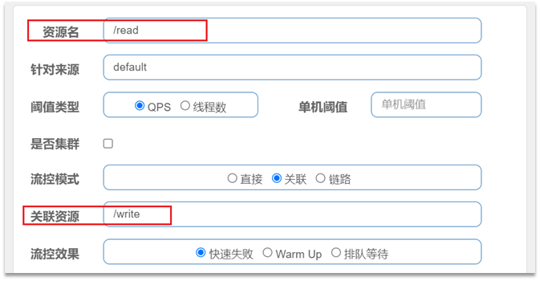</div>

<b>语法说明：</b>当 /write 资源访问量触发阈值时，就会对 /read 资源限流，避免影响 /write 资源。

<b>需求说明</b>

- 在 OrderController 新建两个端点：/order/query 和 /order/update，无需实现业务

- 配置流控规则，当 /order/update 资源被访问的 QPS 超过 5 时，对 /order/query 请求限流

1）定义 /order/query 端点，模拟订单查询

```java
@GetMapping("/query")
public String queryOrder() {
    return "查询订单成功";
}
```

2）定义 /order/update 端点，模拟订单更新

```java
@GetMapping("/update")
public String updateOrder() {
    return "更新订单成功";
}
```

重启服务，查看 sentinel 控制台的簇点链路

<div align="center"></div>

3）配置流控规则

对哪个端点限流，就点击哪个端点后面的按钮。我们是对订单查询 /order/query 限流，因此点击它后面的按钮

<div align="center"></div>

在表单中填写流控规则

<div align="center"></div>

4）在 Jmeter 测试

选择《流控模式-关联》：

<div align="center"></div>

可以看到 1000 个用户，100 秒，因此 QPS 为 10，超过了我们设定的阈值：5

查看 http 请求：

<div align="center"></div>

请求的目标是 /order/update，这样这个断点就会触发阈值。

但限流的目标是 /order/query，我们在浏览器访问，可以发现：

<div align="center"></div>

确实被限流了。

5）总结

满足下面条件可以使用关联模式

- 两个有竞争关系的资源
- 一个优先级较高，一个优先级较低

#### 链路模式

<b>链路模式：</b>只针对从指定链路访问到本资源的请求做统计，判断是否超过阈值。

<b>配置示例</b>

例如有两条请求链路

- /test1 --> /common

- /test2 --> /common

如果只希望统计从 /test2 进入到 /common 的请求，则可以这样配置

<div align="center"></div>

<b>实战案例</b>

需求：有查询订单和创建订单业务，两者都需要查询商品。针对从查询订单进入到查询商品的请求统计，并设置限流。


步骤：

1. 在 OrderService 中添加一个 queryGoods 方法，不用实现业务

2. 在 OrderController 中，改造 /order/query 端点，调用 OrderService 中的 queryGoods 方法

3. 在 OrderController 中添加一个 /order/save 的端点，调用 OrderService 的 queryGoods 方法

4. 给 queryGoods 设置限流规则，从 /order/query 进入 queryGoods 的方法限制 QPS 必须小于 2

<b>实现</b>

1）添加查询商品方法

在 order-service 服务中，给 OrderService 类添加一个 queryGoods 方法

```java
public void queryGoods(){
    System.err.println("查询商品");
}
```

2）查询订单时，查询商品

在 order-service 的 OrderController 中，修改 /order/query 端点的业务逻辑

```java
@GetMapping("/query")
public String queryOrder() {
    // 查询商品
    orderService.queryGoods();
    // 查询订单
    System.out.println("查询订单");
    return "查询订单成功";
}
```

3）新增订单，查询商品

在 order-service 的 OrderController 中，修改 /order/save 端点，模拟新增订单

```java
@GetMapping("/save")
public String saveOrder() {
    // 查询商品
    orderService.queryGoods();
    // 查询订单
    System.err.println("新增订单");
    return "新增订单成功";
}
```

4）给查询商品添加资源标记

默认情况下，OrderService 中的方法是不被 Sentinel 监控的，需要我们自己通过注解来标记要监控的方法。

<span style="color:orange">给 OrderService 的 queryGoods 方法添加 @SentinelResource 注解</span>

```java
@SentinelResource("goods")
public void queryGoods(){
    System.err.println("查询商品");
}
```

<span style="color:orange">链路模式中，是对不同来源的两个链路做监控。但是 sentinel 默认会给进入 SpringMVC 的所有请求设置同一个 root 资源，会导致链路模式失效。（不同来源是指不是父子路径？）</span>

我们需要关闭这种对 SpringMVC 的资源聚合，修改 order-service 服务的 application.yml 文件。

> （查阅相关文档，未发现相关资料，搜到的相关博客如下）
>
> 从1.6.3 版本开始，Sentinel Web filter 默认收敛所有 URL 的入口 context，因此链路限流不生效。
>
> 1.7.0 版本开始（对应 SCA 的 2.1.1.RELEASE)，官方在 CommonFilter 引入了WEB_CONTEXT_UNIFY 参数，用于控制是否收敛 context。将其配置为 false 即可根据不同的 URL 进行链路限流。
>
> 本篇文章使用的 SCA 是 2.2.5 版本，也就是可以直接用这个 web-context-unify: false 来使链路限流生效

```yaml
spring:
  cloud:
    sentinel:
      web-context-unify: false # 关闭context整合
```

重启服务，访问 /order/query 和 /order/save，可以查看到 sentinel 的簇点链路规则中，出现了新的资源：

<div align="center"></div>

5）添加流控规则

点击 goods 资源后面的流控按钮，在弹出的表单中填写下面信息：

<div align="center"></div>

只统计从 /order/query 进入 /goods 的资源，QPS 阈值为 2，超出则被限流。

6）Jmeter 测试

选择《流控模式-链路》

<div align="center">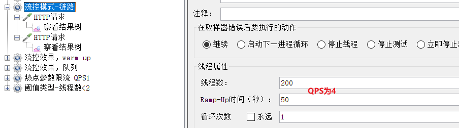</div>

可以看到这里 200 个用户，50 秒内发完，QPS 为 4，超过了我们设定的阈值 2

一个 http 请求是访问 /order/save

<div align="center"></div>

运行的结果

<div align="center"></div>

完全不受影响。

另一个是访问 /order/query

<div align="center"></div>

运行结果

<div align="center"></div>

每次只有 2 个通过。

#### 总结

流控模式有哪些？

- 直接：对当前资源限流

- 关联：高优先级资源触发阈值，对低优先级资源限流。

- 链路：阈值统计时，只统计从指定资源进入当前资源的请求，是对请求来源的限流

### 流控效果

在流控的高级选项中，还有一个流控效果选项

<div align="center">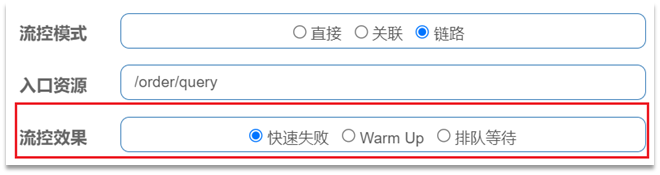</div>

流控效果是指请求达到流控阈值时应该采取的措施，包括三种

- 快速失败：达到阈值后，新的请求会被立即拒绝并抛出 FlowException 异常。是默认的处理方式。

- warm up：预热模式，对超出阈值的请求同样是拒绝并抛出异常。但这种模式阈值会动态变化，从一个较小值逐渐增加到最大阈值。

- 排队等待：让所有的请求按照先后次序排队执行，两个请求的间隔不能小于指定时长

#### warm up

阈值一般是一个微服务能承担的最大 QPS，但是一个服务刚刚启动时，一切资源尚未初始化（冷启动），如果直接将 QPS 跑到最大值，可能导致服务瞬间宕机。

warm up 也叫预热模式，是应对服务冷启动的一种方案。请求阈值初始值是  maxThreshold / coldFactor，持续指定时长后，逐渐提高到 maxThreshold 值。而 coldFactor 的默认值是 3.

例如，我设置 QPS 的 maxThreshold 为 10，预热时间为 5 秒，那么初始阈值就是  10 / 3 ，也就是 3，然后在 5 秒后逐渐增长到 10.

<div align="center"></div>


**案例**

需求：给 /order/{orderId} 这个资源设置限流，最大 QPS 为 10，利用 warm up 效果，预热时长为 5 秒

1）配置流控规则

<div align="center"></div>

2）Jmeter测试

选择《流控效果，warm up》

<div align="center"></div>

QPS 为 10.

刚刚启动时，大部分请求失败，成功的只有 3 个，说明 QPS 被限定在 3

<div align="center"></div>

随着时间推移，成功比例越来越高

<div align="center"></div>


到 Sentinel 控制台查看实时监控

<div align="center"></div>

一段时间后

<div align="center"></div>

#### 排队等待

当请求超过 QPS 阈值时，快速失败和 warm up 会拒绝新的请求并抛出异常。

而排队等待则是让所有请求进入一个队列中，然后按照阈值允许的时间间隔依次执行。后来的请求必须等待前面执行完成，如果请求预期的等待时间超出最大时长，则会被拒绝。

例如：QPS=5，意味着每 200ms 处理一个队列中的请求；timeout = 2000，意味着预期等待时长超过 2000ms 的请求会被拒绝并抛出异常。

<div align="center"></div>

那什么叫做预期等待时长呢？

比如现在一下子来了 12 个请求，因为每 200ms 执行一个请求，那么

- 第 6 个请求的预期等待时长 =  200 * （6 - 1） = 1000ms
- 第 12 个请求的预期等待时长 = 200 * （12-1） = 2200ms

现在，第 1 秒同时接收到 10 个请求，但第 2 秒只有 1 个请求，此时 QPS 的曲线这样的：

<div align="center"></div>

如果使用队列模式做流控，所有进入的请求都要排队，以固定的 200ms 的间隔执行，QPS 会变的很平滑：

<div align="center"></div>


平滑的 QPS 曲线，对于服务器来说是更友好的。

<b>案例</b>

需求：给 /order/{orderId} 这个资源设置限流，最大 QPS 为 10，利用排队的流控效果，超时时长设置为 5s

1）添加流控规则

<div align="center"></div>

2）Jmeter 测试

选择《流控效果，队列》：

<div align="center"></div>

QPS 为 15，已经超过了我们设定的 10。

如果是之前的快速失败、warm up 模式，超出的请求应该会直接报错。

但是我们看看队列模式的运行结果，全部都通过了。

<div align="center"></div>

再去 sentinel 查看实时监控的 QPS 曲线

<div align="center"></div>

QPS 非常平滑，一致保持在 10，但是超出的请求没有被拒绝，而是放入队列。因此响应时间（等待时间）会越来越长。当队列满了以后，才会有部分请求失败。

<div align="center"></div>

#### 总结

<b>流控效果有哪些？</b>

- 快速失败：QPS 超过阈值时，拒绝新的请求。

- warm up：QPS 超过阈值时，拒绝新的请求；QPS 阈值是逐渐提升的，可以避免冷启动时高并发导致服务宕机。

- 排队等待：请求会进入队列，按照阈值允许的时间间隔依次执行请求；如果请求预期等待时长大于超时时间，直接拒绝。

### 热点参数限流

之前的限流是统计访问某个资源的所有请求，判断是否超过 QPS 阈值。而热点参数限流是分别统计参数值相同的请求，判断是否超过 QPS 阈值。

#### 全局参数限流

例如，一个根据 id 查询商品的接口

<div align="center"></div>

访问 /goods/{id} 的请求中，id 参数值会有变化，热点参数限流会根据参数值分别统计 QPS，统计结果：

<div align="center"></div>

当 id=1 的请求触发阈值被限流时，id 值不为 1 的请求不受影响。

配置示例

<div align="center"></div>

代表的含义是：对 hot 这个资源的 0 号参数（第一个参数）做统计，每 1 秒相同参数值的请求数不能超过 5

#### 热点参数限流

刚才的配置中，对查询商品这个接口的所有商品一视同仁，QPS 都限定为 5.

而在实际开发中，可能部分商品是热点商品，例如秒杀商品，我们希望这部分商品的 QPS 限制与其它商品不一样，高一些。那就需要配置热点参数限流的高级选项了：

<div align="center"></div>

结合上一个配置，这里的含义是对 0 号的 long 类型参数限流，每 1 秒相同参数的 QPS 不能超过 5，有两个例外：

- 如果参数值是 100，则每 1 秒允许的 QPS 为 10

- 如果参数值是 101，则每 1 秒允许的 QPS 为 15

#### 案例

<b>案例需求：</b>给 /order/{orderId} 这个资源添加热点参数限流，规则如下

- 默认的热点参数规则是每 1 秒请求量不超过 2
- 给 102 这个参数设置例外：每 1 秒请求量不超过 4
- 给 103 这个参数设置例外：每 1 秒请求量不超过 10

<b>注意事项：</b>热点参数限流对默认的 SpringMVC 资源无效，需要利用 @SentinelResource 注解标记资源

1）标记资源

给 order-service 中的 OrderController 中的 /order/{orderId} 资源添加注解

<div align="center"></div>

2）热点参数限流规则

访问该接口，可以看到我们标记的 hot 资源出现了

<div align="center"></div>

这里不要点击 hot 后面的按钮，页面有 BUG

点击左侧菜单中热点规则菜单

<div align="center"></div>

点击新增，填写表单

<div align="center"></div>

3）Jmeter 测试

选择《热点参数限流 QPS1》：

<div align="center"></div>

这里发起请求的 QPS 为 5.

包含 3 个 http 请求：

普通参数，QPS 阈值为 2

<div align="center"></div>

运行结果：

<div align="center">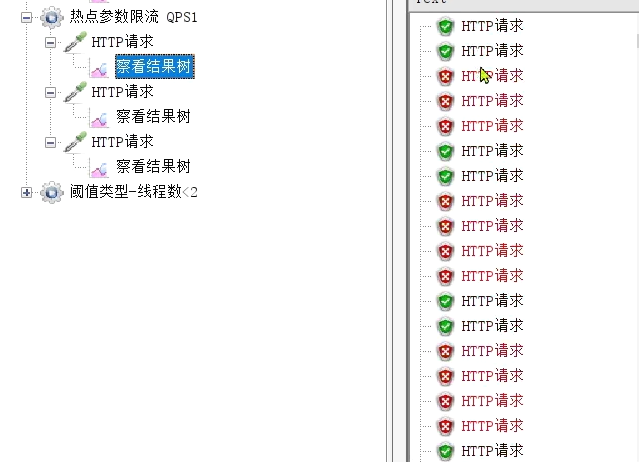</div>


例外项，QPS 阈值为 4

<div align="center"></div>

运行结果：

<div align="center"></div>


例外项，QPS 阈值为 10

<div align="center"></div>

运行结果：

<div align="center"></div>

## 隔离和降级

<span style="color:orange">限流是一种预防措施，虽然限流可以尽量避免因高并发而引起的服务故障，但服务还会因为其它原因而故障。而要将这些故障控制在一定范围，避免雪崩，就要靠<b>线程隔离（舱壁模式）和熔断降级</b>手段了。</span>

线程隔离之前讲到过，调用者在调用服务提供者时，给每个调用的请求分配独立线程池，出现故障时，最多消耗这个线程池内资源，避免把调用者的所有资源耗尽。

<div align="center"></div>


<b>熔断降级：</b>是在调用方这边加入断路器，统计对服务提供者的调用，如果调用的失败比例过高，则熔断该业务，不允许访问该服务的提供者了。

<div align="center"></div>


可以看到，不管是线程隔离还是熔断降级，都是对<b>客户端</b>（调用方）的保护。需要在<b>调用方</b>发起远程调用时做线程隔离、或者服务熔断。而我们的微服务远程调用都是基于 Feign 来完成的，因此我们需要将 Feign 与 Sentinel 整合，在 Feign 里面实现线程隔离和服务熔断。

### FeignClient整合Sentinel

<span style="color:orange">SpringCloud 中，微服务调用都是通过 Feign 来实现的，因此做客户端保护必须整合 Feign 和 Sentinel。</span>

#### 修改配置，开启sentinel功能

修改 OrderService 的 application.yml 文件，开启 Feign 的 Sentinel 功能

```yaml
feign:
  sentinel:
    enabled: true # 开启feign对sentinel的支持
```

#### 编写失败降级逻辑

业务失败后，不能直接报错，而应该返回用户一个友好提示或者默认结果，这个就是失败降级逻辑。因此，我们需要给 FeignClient 编写失败后的降级逻辑

①方式一：FallbackClass，无法对远程调用的异常做处理

②方式二：FallbackFactory，可以对远程调用的异常做处理，此处选择这种

<b>步骤一：</b>在 feing-api 项目中定义类，实现 FallbackFactory

<div align="center">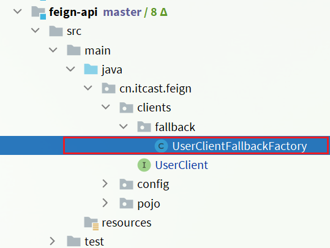</div>

```java
package cn.itcast.feign.clients.fallback;

import cn.itcast.feign.clients.UserClient;
import cn.itcast.feign.pojo.User;
import feign.hystrix.FallbackFactory;
import lombok.extern.slf4j.Slf4j;

@Slf4j
public class UserClientFallbackFactory implements FallbackFactory<UserClient> {
    @Override
    public UserClient create(Throwable throwable) {
        // UserClient 是个接口，此处定义匿名内部类，重写里面的方法，相当于编写降级逻辑了
        return new UserClient() {
            @Override
            public User findById(Long id) {
                log.error("查询用户异常", throwable);
                return new User();
            }
        };
    }
}
```

<b>步骤二：</b>在 feing-api 项目中的 DefaultFeignConfiguration 类中将 UserClientFallbackFactory 注册为一个 Bean

```java
@Bean
public UserClientFallbackFactory userClientFallbackFactory(){
    return new UserClientFallbackFactory();
}
```

<b>步骤三：</b>在 feing-api 项目中的 UserClient 接口中使用 UserClientFallbackFactory

```java
import cn.itcast.feign.clients.fallback.UserClientFallbackFactory;
import cn.itcast.feign.pojo.User;
import org.springframework.cloud.openfeign.FeignClient;
import org.springframework.web.bind.annotation.GetMapping;
import org.springframework.web.bind.annotation.PathVariable;

// 这样，编写的逻辑就生效了。
@FeignClient(value = "userservice", fallbackFactory = UserClientFallbackFactory.class)
public interface UserClient {

    @GetMapping("/user/{id}")
    User findById(@PathVariable("id") Long id);
}
```

重启后，访问一次订单查询业务，然后查看 sentinel 控制台，可以看到新的簇点链路

<div align="center"></div>

#### 总结

Sentinel 支持的雪崩解决方案

- 线程隔离（仓壁模式）
- 降级熔断

Feign 整合 Sentinel 的步骤

- 在 application.yml 中配置：feign.sentienl.enable=true
- 给 FeignClient 编写 FallbackFactory 并注册为 Bean
- 将 FallbackFactory 配置到 FeignClient

### 线程隔离（舱壁模式）

#### 线程隔离的实现方式

线程隔离有两种方式实现

- 线程池隔离

- 信号量隔离（Sentinel 默认采用）

<div align="center"></div>

<b>线程池隔离：</b>给每个服务调用业务分配一个线程池，利用线程池本身实现隔离效果

<b>信号量隔离：</b>不创建线程池，而是计数器模式，记录业务使用的线程数量，达到信号量上限时，禁止新的请求。

| 隔离方式   | 优点                         | 缺点                                                        | 场景                                                         |
| ---------- | ---------------------------- | ----------------------------------------------------------- | ------------------------------------------------------------ |
| 信号量隔离 | 轻量级，无额外开销           | 不支持主动超时（只能依赖于 Feign 的超时）<br>不支持异步调用 | 高频调用，高扇出                                             |
| 线程池隔离 | 支持主动超时<br>支持异步调用 | 线程的额外开销比较大                                        | 低扇出 (请求到 A 这里来了，然后 A 又依赖于 N 个其他的服务，这个就叫扇出) |

#### sentinel的线程隔离

<b>用法说明</b>

<span style="color:orange">在添加限流规则时，可以选择两种阈值类型，选择线程数即开启了舱壁模式。</span>

<div align="center"></div>

- QPS：就是每秒的请求数，在快速入门中已经演示过

- 线程数：是该资源能用的 tomcat 线程数的最大值。也就是通过限制线程数量，实现<b>线程隔离</b>（舱壁模式）。

> <b>案例需求</b>

给 order-service 服务中的 UserClient 的查询用户接口设置流控规则，线程数不能超过 2。然后利用 jemeter 测试。

1）配置隔离规则

选择 feign 接口后面的流控按钮

<div align="center"></div>

填写表单

<div align="center"></div>

2）Jmeter 测试

选择《阈值类型-线程数<2》

<div align="center"></div>

一次发生 10 个请求，有较大概率并发线程数超过 2，而超出的请求会走之前定义的失败降级逻辑。

查看运行结果：

<div align="center"></div>

发现虽然结果都是通过了，不过部分请求得到的响应是降级返回的 null 信息。

#### 总结

线程隔离的两种手段是？

- 信号量隔离

- 线程池隔离

信号量隔离的特点是？

- 基于计数器模式，简单，开销小

线程池隔离的特点是？

- 基于线程池模式，有额外开销，但隔离控制更强

### 熔断降级

熔断降级是解决雪崩问题的重要手段。其思路是由<b>断路器</b>统计服务调用的异常比例、慢请求比例，如果超出阈值则会<b>熔断</b>该服务。即拦截访问该服务的一切请求；而当服务恢复时，断路器会放行访问该服务的请求。

断路器控制熔断和放行是通过状态机来完成的：

<div align="center"></div>

状态机包括三个状态：

- closed：关闭状态，断路器放行所有请求，并开始统计异常比例、慢请求比例。超过阈值则切换到 open 状态
- open：打开状态，服务调用被熔断，访问被熔断服务的请求会被拒绝，快速失败，直接走降级逻辑。Open 状态 5 秒后会进入 half-open 状态
- half-open：半开状态，放行一次请求，根据执行结果来判断接下来的操作。
    - 请求成功：则切换到 closed 状态
    - 请求失败：则切换到 open 状态

断路器熔断策略有三种：慢调用、异常比例、异常数

#### 慢调用

<b>慢调用：</b>业务的响应时长（RT）大于指定时长的请求认定为慢调用请求。在指定时间内，如果请求数量超过设定的最小数量，慢调用比例大于设定的阈值，则触发熔断。

例如：

<div align="center"></div>

解读：RT 超过 500ms 的调用是慢调用，统计最近 10000ms 内的请求，如果请求量超过 10 次，并且慢调用比例不低于 0.5，则触发熔断，熔断时长为 5 秒。然后进入 half-open 状态，放行一次请求做测试。

> <b>案例</b>
>
> 需求：给 UserClient 的查询用户接口设置降级规则，慢调用的 RT 阈值为 50ms，统计时间为 1 秒，最小请求数量为 5，失败阈值比例为 0.4，熔断时长为 5

1）设置慢调用

修改 user-service 中的 /user/{id} 这个接口的业务。通过休眠模拟一个延迟时间：

<div align="center"></div>

此时，orderId=101 的订单，关联的是 id 为 1 的用户，调用时长为 60ms

<div align="center"></div>

orderId=102 的订单，关联的是 id 为 2 的用户，调用时长为非常短；

<div align="center"></div>

2）设置熔断规则

下面，给 feign 接口设置降级规则

<div align="center"></div>

<div align="center"></div>

超过 50ms 的请求都会被认为是慢请求

3）测试

在浏览器访问：http://localhost:8088/order/101，快速刷新 5 次，可以发现

<div align="center"></div>

触发了熔断，请求时长缩短至 5ms，快速失败了，并且走降级逻辑，返回的 null

在浏览器访问：http://localhost:8088/order/102，竟然也被熔断了

<div align="center"></div>

#### 异常比例、异常数

<b>异常比例或异常数：</b>统计指定时间内的调用，如果调用次数超过指定请求数，并且出现异常的比例达到设定的比例阈值（或超过指定异常数），则触发熔断。

例如，一个异常比例设置：

<div align="center"></div>

解读：统计最近 1000ms 内的请求，如果请求量超过 10 次，并且异常比例不低于 0.4，则触发熔断。

一个异常数设置：

<div align="center"></div>

解读：统计最近 1000ms 内的请求，如果请求量超过 10 次，并且异常比例不低于 2 次，则触发熔断。

> <b>案例</b>
>
> 需求：给 UserClient 的查询用户接口设置降级规则，统计时间为 1 秒，最小请求数量为 5，失败阈值比例为 0.4，熔断时长为 5s

1）设置异常请求

首先，修改 user-service 中的 /user/{id} 这个接口的业务。手动抛出异常，以触发异常比例的熔断

<div align="center"></div>

也就是说，id 为 2时，就会触发异常

2）设置熔断规则

下面，给 feign 接口设置降级规则

<div align="center"></div>

<div align="center"></div>

在 5 次请求中，只要异常比例超过 0.4，也就是有 2 次以上的异常，就会触发熔断。

3）测试

在浏览器快速访问：http://localhost:8088/order/102，快速刷新 5 次，触发熔断：

<div align="center">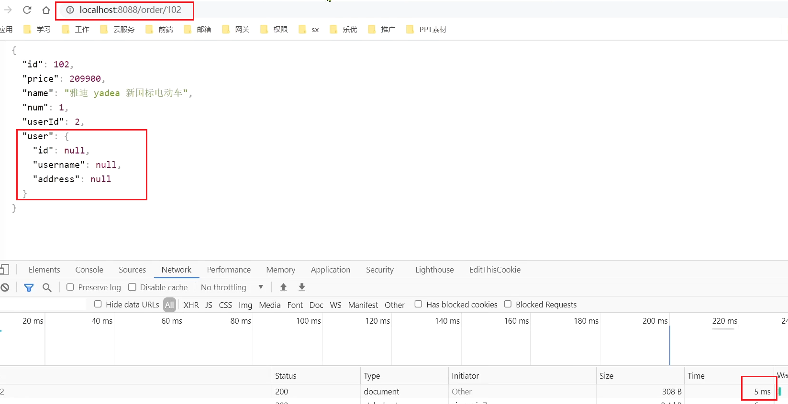</div>

此时，我们去访问本来应该正常的 103

<div align="center"></div>

## 授权规则

授权规则可以对请求方来源做判断和控制。网关也是负责校验请求的，为什么 Sentinel 也要搞一个授权规则校验呢？Gateway 拦截所有请求，然后转发给对应的微服务，但是！如果有人泄露了服务的具体地址，Gateway 的这层校验就失效了，而 Sentinel 的授权规则可以解决这个问题。

### 授权规则

#### 基本规则

授权规则可以对调用方的来源做控制，有白名单和黑名单两种方式。

- 白名单：来源（origin）在白名单内的调用者允许访问

- 黑名单：来源（origin）在黑名单内的调用者不允许访问

点击左侧菜单的授权，可以看到授权规则

<div align="center"></div>

- 资源名：就是受保护的资源，例如 /order/{orderId}

- 流控应用：是来源者的名单，
    - 如果是勾选白名单，则名单中的来源被许可访问。
    - 如果是勾选黑名单，则名单中的来源被禁止访问。

比如：

<div align="center"></div>

我们允许请求从 gateway 到 order-service，不允许浏览器访问 order-service，那么白名单中就要填写<b>网关的来源名称（origin）</b>。

#### 如何获取origin

Sentinel 是通过 RequestOriginParser 这个接口的 parseOrigin 来获取请求的来源的。

```java
public interface RequestOriginParser {
    /**
     * 从请求request对象中获取origin，获取方式自定义
     */
    String parseOrigin(HttpServletRequest request);
}
```

这个方法的作用就是从 request 对象中，获取请求者的 origin 值并返回。默认情况下，sentinel 不管请求者从哪里来，返回值永远是 default，也就是说一切请求的来源都被认为是一样的值 default。<span style="color:orange">因此，我们需要自定义这个接口的实现，让不同的请求，返回不同的 origin。只要能区分请求来自浏览器还是网关就能判断是不是跨过网关的请求了。</span>

例如 order-service 服务中，我们定义一个 RequestOriginParser 的实现类

```java
package cn.itcast.order.sentinel;

import com.alibaba.csp.sentinel.adapter.spring.webmvc.callback.RequestOriginParser;
import org.springframework.stereotype.Component;
import org.springframework.util.StringUtils;

import javax.servlet.http.HttpServletRequest;

@Component
public class HeaderOriginParser implements RequestOriginParser {
    @Override
    public String parseOrigin(HttpServletRequest request) {
        // 1.获取请求头
        String origin = request.getHeader("origin");
        // 2.非空判断
        if (StringUtils.isEmpty(origin)) {
            origin = "blank";
        }
        return origin;
    }
}
```

我们会尝试从 request-header 中获取 origin 值。

#### 给网关添加请求头

<span style="color:orange">既然获取请求 origin 的方式是从 reques-header 中获取 origin 值，我们必须让所有从 gateway 路由到微服务的请求都带上 origin 头。这个需要利用之前学习的一个 GatewayFilter 来实现，AddRequestHeaderGatewayFilter。</span>

修改 gateway 服务中的 application.yml，添加一个 defaultFilter

```yaml
spring:
  cloud:
    gateway:
      default-filters:
        - AddRequestHeader=origin,gateway # 添加名为 origin，值为 gateway 的请求头
      routes:
       # ...略
```

这样，从 gateway 路由的所有请求都会带上 origin 头，值为 gateway。而从其它地方到达微服务的请求则没有这个头。

#### 配置授权规则

接下来，我们添加一个授权规则，放行 origin 值为 gateway 的请求。

<div align="center"></div>

我们编写的代码，对来自浏览器的请求，由于 Sentinel 无法获取到 origin 的值，会返回 blank，而来自网关的请求可以获取到 origin 的值，其值为 gateway，因此配置如下：

<div align="center"></div>

现在，我们直接跳过网关，访问 order-service 服务

<div align="center"></div>

通过网关访问

<div align="center">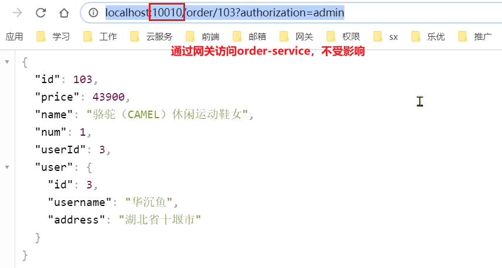</div>

### 自定义异常结果

<span style="color:orange">默认情况下，发生限流、降级、授权拦截时，都会抛出异常到调用方。异常结果都是 flow limmiting（限流）。这样不够友好，无法得知是限流还是降级还是授权拦截。</span>

#### 异常类型

而如果要自定义异常时的返回结果，需要实现 BlockExceptionHandler 接口

```java
public interface BlockExceptionHandler {
    /**
     * 处理请求被限流、降级、授权拦截时抛出的异常：BlockException
     */
    void handle(HttpServletRequest request, HttpServletResponse response, BlockException e) throws Exception;
}
```

这个方法有三个参数

- HttpServletRequest request：request 对象
- HttpServletResponse response：response 对象
- BlockException e：被 sentinel 拦截时抛出的异常

这里的 BlockException 包含多个不同的子类

| **异常**             | **说明**           |
| -------------------- | ------------------ |
| FlowException        | 限流异常           |
| ParamFlowException   | 热点参数限流的异常 |
| DegradeException     | 降级异常           |
| AuthorityException   | 授权规则异常       |
| SystemBlockException | 系统规则异常       |

#### 自定义异常处理

下面，我们就在 order-service 定义一个自定义异常处理类

```java
package cn.itcast.order.sentinel;

import com.alibaba.csp.sentinel.adapter.spring.webmvc.callback.BlockExceptionHandler;
import com.alibaba.csp.sentinel.slots.block.BlockException;
import com.alibaba.csp.sentinel.slots.block.authority.AuthorityException;
import com.alibaba.csp.sentinel.slots.block.degrade.DegradeException;
import com.alibaba.csp.sentinel.slots.block.flow.FlowException;
import com.alibaba.csp.sentinel.slots.block.flow.param.ParamFlowException;
import org.springframework.stereotype.Component;

import javax.servlet.http.HttpServletRequest;
import javax.servlet.http.HttpServletResponse;

@Component
public class SentinelExceptionHandler implements BlockExceptionHandler {
    @Override
    public void handle(HttpServletRequest request, HttpServletResponse response, BlockException e) throws Exception {
        String msg = "未知异常";
        int status = 429;

        if (e instanceof FlowException) {
            msg = "请求被限流了";
        } else if (e instanceof ParamFlowException) {
            msg = "请求被热点参数限流";
        } else if (e instanceof DegradeException) {
            msg = "请求被降级了";
        } else if (e instanceof AuthorityException) {
            msg = "没有权限访问";
            status = 401;
        }

        response.setContentType("application/json;charset=utf-8");
        response.setStatus(status);
        response.getWriter().println("{\"msg\": " + msg + ", \"status\": " + status + "}");
    }
}
```

重启测试，在不同场景下，会返回不同的异常消息

<div align="center"></div>

授权拦截时

<div align="center"></div>

#### 总结

获取请求来源的接口是什么？ ==> RequestOriginParser

处理 BlockException 的接口是什么？==> BlockExceptionHandler

## 规则持久化

现在，sentinel 的所有规则都是内存存储，重启后所有规则都会丢失。在生产环境下，我们必须确保这些规则的持久化，避免丢失。

### 规则管理模式

规则是否能持久化，取决于规则管理模式，sentinel 支持三种规则管理模式

- 原始模式：Sentinel 的默认模式，将规则保存在内存，重启服务会丢失。
- pull 模式：控制台将配置的规则推送到 Sentinel 客户端，而客户端会将配置规则保存在本地文件或数据库中。以后会定时去本地文件或数据库中查询，更新本地规则。
- push 模式

#### pull模式

pull 模式：控制台将配置的规则推送到 Sentinel 客户端，而客户端会将配置规则保存在本地文件或数据库中。以后会定时去本地文件或数据库中查询，更新本地规则。

<div align="center"></div>

因为是定时查询的，因此时效性较差。

#### push模式

push 模式：控制台将配置规则推送到远程配置中心，例如 Nacos。Sentinel 客户端监听 Nacos，获取配置变更的推送消息，完成本地配置更新。

<div align="center"></div>

### 实现push模式

#### 修改order-service服务

修改 OrderService，让其监听 Nacos 中的 sentinel 规则配置。

1）引入依赖，在 order-service 中引入 sentinel 监听 nacos 的依赖

```xml
<dependency>
    <groupId>com.alibaba.csp</groupId>
    <artifactId>sentinel-datasource-nacos</artifactId>
</dependency>
```

2）配置 nacos 地址，在 order-service 中的 application.yml 文件配置 nacos 地址及监听的配置信息

```yml
spring:
  cloud:
    sentinel:
      datasource:
        flow:
          nacos:
            server-addr: localhost:8848 # nacos地址
            dataId: orderservice-flow-rules
            groupId: SENTINEL_GROUP
            rule-type: flow # 还可以是：degrade、authority、param-flow
```

#### 修改sentinel-dashboard源码

SentinelDashboard 默认不支持 nacos 的持久化，需要修改源码。

1）解压，解压 sentinel 源码，打开项目

<div align="center"></div>

2）修改 nacos 依赖，在 sentinel-dashboard 源码的 pom 文件中，nacos 的依赖默认的 scope 是 test，只能在测试时使用，这里要去除，修改为

```xml
<dependency>
    <groupId>com.alibaba.csp</groupId>
    <artifactId>sentinel-datasource-nacos</artifactId>
</dependency>
```

3）添加 nacos 支持，在 sentinel-dashboard 的 test 包下，已经编写了对 nacos 的支持，我们需要将其拷贝到 main 下

<div align="center">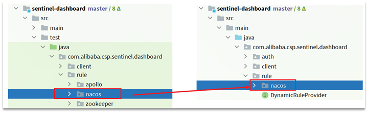</div>

4）修改 nacos 地址，然后，还需要修改测试代码中的 NacosConfig 类

<div align="center"></div>

修改其中的 nacos 地址，让其读取 application.properties 中的配置

<div align="center"></div>

在 sentinel-dashboard 的 application.properties 中添加 nacos 地址配置

```properties
nacos.addr=localhost:8848
```

5）配置 nacos 数据源，另外，还需要修改com.alibaba.csp.sentinel.dashboard.controller.v2 包下的 FlowControllerV2 类

<div align="center"></div>

让我们添加的Nacos数据源生效：

<div align="center"></div>

6）修改前端页面

接下来，还要修改前端页面，添加一个支持 nacos 的菜单。修改 src/main/webapp/resources/app/scripts/directives/sidebar/ 目录下的 sidebar.html 文件

<div align="center"></div>

将其中的这部分注释打开

<div align="center"></div>

修改其中的文本

<div align="center">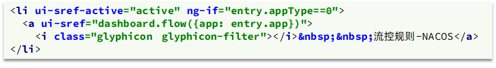</div>

7）重新编译、打包项目

运行 IDEA 中的 maven 插件，编译和打包修改好的 Sentinel-Dashboard

<div align="center"></div>

8）启动，与原先一样

```sh
java -jar sentinel-dashboard.jar
```

如果要修改 nacos 地址，需要添加参数

```sh
java -jar -Dnacos.addr=localhost:8848 sentinel-dashboard.jar
```

# 分布式事务

## 分布式事务问题

### 本地事务

<b>本地事务，也就是传统的单机事务。在传统数据库事务中，必须要满足 ACID 四个原则</b>

原子性 (A)：事务中的所有操作，要么全部成功，要么全部失败

一致性 (C)：要保证数据库内部完整性约束、声明性约束

隔离性 (I)：对同一资源操作的事务不能同时发生

持久性 (D)：对数据库做的一切修改将永久保存，不管是否出现故障

### 分布式事务

<b>分布式事务，就是指不是在单个服务或单个数据库架构下，产生的事务，例如</b>

- 跨数据源的分布式事务
- 跨服务的分布式事务
- 综合情况

> 在数据库水平拆分、服务垂直拆分之后，一个业务操作通常要跨多个数据库、服务才能完成。例如电商行业中比较常见的下单付款案例，包括下面几个行为
>
> - 创建新订单
> - 扣减商品库存
> - 从用户账户余额扣除金额

微服务下单业务，在下单时会调用订单服务，创建订单并写入数据库。然后订单服务调用账户服务和库存服务

- 账户服务负责扣减用户余额
- 库存服务负责扣减商品库存

<div align="center"></div>

在分布式系统下，一个业务跨越多个服务或数据源，每个服务都是一个分支事务，要保证所有分支事务最终状态一致，这样的事务就是分布式事务。

订单的创建、库存的扣减、账户扣款在每一个服务和数据库内是一个本地事务，可以保证 ACID 原则。

但是当我们把三件事情看做一个"业务"，要满足保证“业务”的原子性，要么所有操作全部成功，要么全部失败，不允许出现部分成功部分失败的现象，这就是分布式系统下的事务了。

此时 ACID 难以满足，这是分布式事务要解决的问题

<div align="center">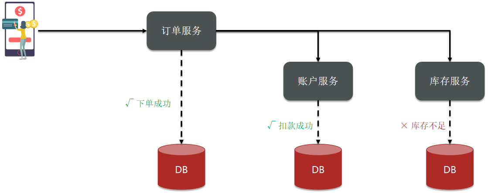</div>

### 演示分布式事务问题

1）创建数据库，名为 seata_demo，然后导入 SQL `seata-demo.sql`

2）导入微服务项目 seata-demo 

<div align="center"></div> 

项目结构介绍

seata-demo：父工程，负责管理项目依赖

- account-service：账户服务，负责管理用户的资金账户。提供扣减余额的接口
- storage-service：库存服务，负责管理商品库存。提供扣减库存的接口
- order-service：订单服务，负责管理订单。创建订单时，需要调用 account-service 和 storage-service

3）启动 nacos、所有微服务

4）测试下单功能，发出 Post 请求

```sh
curl --location --request POST 'http://localhost:8082/order?userId=user202103032042012&commodityCode=100202003032041&count=20&money=200'
```

<div align="center"></div>


测试发现，当库存不足时，如果余额已经扣减，并不会回滚，出现了分布式事务问题。

### 分布式事务思想

全局事务：定义全局事务的范围、开始全局事务、提交或回滚全局事务。

分支事务管理器：管理分支事务处理的资源，与 TC 交谈以注册分支事务和报告分支事务的状态，并驱动分支事务提交或回滚。

事务协调者：维护全局和分支事务的状态，协调全局事务提交或回滚。

一个全局事务内包括若干个相关联操作的子事务。子事务将自己的信息注册到事务协调者中，事务的操作结果：可正常提交、回滚都会报告给事务协调者。事务协调者如果发现所有事务都操作成功了，则提交全局事务；如果发现有事务操作失败，则回滚所有子事务。事务提交的结果应该也需要给事务协调者一个回执，如果有一方事务提交失败，其他子事务也应该做出相应操作。

## 理论基础

解决分布式事务问题，需要一些分布式系统的基础知识作为理论指导。

### CAP定理

1998 年，加州大学的计算机科学家 Eric Brewer 提出，分布式系统有三个指标。

> - Consistency（一致性）
> - Availability（可用性）
> - Partition tolerance （分区容错性）

<div align="center"></div>

它们的第一个字母分别是 C、A、P。

Eric Brewer 说，这三个指标不可能同时做到。这个结论就叫做 CAP 定理。

#### 一致性

Consistency（一致性）：用户访问分布式系统中的任意节点，得到的数据必须一致。

比如现在包含两个节点，其中的初始数据是一致的

<div align="center"></div>

当我们修改其中一个节点的数据时，两者的数据产生了差异

<div align="center"></div>

要想保住一致性，就必须实现 node01 到 node02 的数据同步

<div align="center"></div>

#### 可用性

Availability （可用性）：用户访问集群中的任意健康节点，必须能得到响应，而不是超时或拒绝。

如图，有三个节点的集群，访问任何一个都可以及时得到响应

<div align="center"></div>

当有部分节点因为网络故障或其它原因无法访问时，代表节点不可用

<div align="center"></div>


#### 分区容错

<b>Partition（分区）：</b>因为网络故障或其它原因导致分布式系统中的部分节点与其它节点失去连接，形成独立分区。

<div align="center"></div>

<b>Tolerance（容错）：</b>在集群出现分区时，整个系统也要持续对外提供服务。

这时候 node01 和 node03 的数据是不一致的，没有满足一致性。如果一定要满足一致性，那么可以让 node03 等待 node02 网络的恢复和数据同步。在恢复之前所有来访问我的请求都阻塞住，等 node03 数据同步完成之后再放行请求。这样 node03 明明是监控的，但是在数据恢复前却是不可用的，就不满足可用性了。

#### 矛盾★

在分布式系统中，系统间的网络不能 100% 保证健康，一定会有故障的时候，而服务有必须对外保证服务。因此 Partition Tolerance 不可避免。

当节点接收到新的数据变更时，就会出现问题了

<div align="center"></div>

如果此时要保证<b>一致性</b>，就必须等待网络恢复，完成数据同步后，整个集群才对外提供服务，服务处于阻塞状态，不可用。

如果此时要保证<b>可用性</b>，就不能等待网络恢复，那 node01、node02 与 node03 之间就会出现数据不一致。

也就是说，在 P 一定会出现的情况下，A 和 C 之间只能实现一个。

#### 总结

CAP 定理内容

- 分布式系统节点通过网络连接，一定会出现分区问题（P）
- 当分区出现时，系统的一致性（C）和可用性（A）就无法同时满足

思考：elasticsearch 集群是 CP 还是 AP。

elasticsearch 集群是服务不可用时就剔除这个服务，牺牲了可用性来保证一致性。即，es 集群出现分区时，故障节点会被剔出集群，数据分片会重新分配到其它节点，保证数据一致性。因此时低可用性，高一致性，属于 CP。

### BASE理论

BASE 理论是对 CAP 的一种解决思路，包含三个思想

- <b>Basically Available（基本可用）：</b>分布式系统在出现故障时，允许损失部分可用性，即保证核心可用。
- <b>Soft State（软状态）：</b>在一定时间内，允许出现中间状态，比如临时的不一致状态。
- <b>Eventually Consistent（最终一致性）：</b>虽然无法保证强一致性，但是在软状态结束后，最终达到数据一致。

### 解决思路

分布式事务最大的问题是各个子事务的一致性问题，因此可以借鉴 CAP 定理和 BASE 理论，有两种解决思路：

- AP 模式：各子事务分别执行和提交，允许出现结果不一致，然后采用弥补措施恢复数据即可（如新增一条数据的恢复措施是删除这条数据），<span style="color:orange">实现最终一致。</span>

- CP 模式：各个子事务执行后互相等待，同时提交，同时回滚，<span style="color:orange">达成强一致。</span>但事务等待过程中，处于弱可用状态。

但不管是哪一种模式，都需要在子系统事务之间互相通讯，协调事务状态，也就是需要一个事务协调者 (TC)

<div align="center"></div>


这里的子系统事务，称为<b>分支事务</b>；有关联的各个分支事务在一起称为<b>全局事务</b>。

### 总结

BASE 理论的三个思想

- 基本可用
- 软状态
- 最终一致

解决分布式事务的思想和模型

- 全局事务：整个分布式事务
- 分支事务：分布式事务中包含的每个子系统的事务
- 最终一致思想：各分支事务分别执行并提交，如果有不一致的情况，再想办法恢复数据
- 强一致思想：各分支事务执行完业务不要提交，等待彼此结果。而后统一提交或回滚。

## 初识Seata

Seata 是 2019 年 1 月份蚂蚁金服和阿里巴巴共同开源的分布式事务解决方案。致力于提供高性能和简单易用的分布式事务服务，为用户打造一站式的分布式解决方案。

官网地址：http://seata.io/，其中的文档、博客中提供了大量的使用说明、源码分析。

### Seata的架构

> Seata 事务管理中有三个重要的角色

- <b>TC (Transaction Coordinator) - 事务协调者：</b>维护全局和分支事务的状态，协调全局事务提交或回滚。

- <b>TM (Transaction Manager) - 事务管理器：</b>定义全局事务的范围、开始全局事务、提交或回滚全局事务。

- <b>RM (Resource Manager) - 资源管理器：</b>管理分支事务处理的资源，与 TC 交谈以注册分支事务和报告分支事务的状态，并驱动分支事务提交或回滚。

整体的架构如图

<div align="center"></div>


TM 定义全局事务的范围，开启全局事务后，在这个全局事务内的分支事务会注册到 TC（事务协调者，负责维护全局事务和分支事务的状态）中。如果注册到 TC 的事务都执行成功了则提交事务，如果有任何一个分支事务执行失败，则进行事务回滚。（如何设置 xx 事务为某全局事务的分支事务？分支事务的注册和报告的对象是否是分布式机器，如果机器宕机又如何处理？）

> Seata 基于上述架构提供了四种不同的分布式事务解决方案

- XA 模式：强一致性分阶段事务模式，牺牲了一定的可用性，无业务侵入。
- TCC 模式：最终一致的分阶段事务模式，有业务侵入。
- AT 模式：最终一致的分阶段事务模式，无业务侵入，也是 Seata 的默认模式。
- SAGA 模式：长事务模式，有业务侵入。

无论哪种方案，都离不开 TC，也就是事务的协调者。

### 部署TC服务

#### 下载

下载 seata-server 包，[http](http://seata.io/zh-cn/blog/download.html)[://seata.io/zh-cn/blog/download](http://seata.io/zh-cn/blog/download.html)[.](http://seata.io/zh-cn/blog/download.html)[html](http://seata.io/zh-cn/blog/download.html)

#### 解压

在非中文目录解压缩这个 zip 包，其目录结构如下

<div align="center"></div>

#### 修改配置

修改 conf 目录下的 registry.conf 文件

<div align="center"></div>

内容如下

```properties
registry {
  # tc服务的注册中心类型
  # 这里选择nacos，也可以是 eureka、zookeeper 等
  type = "nacos"

  nacos {
    # seata tc 服务注册到 nacos的服务名称，可以自定义
    application = "seata-tc-server"
    serverAddr = "127.0.0.1:8848"
    group = "DEFAULT_GROUP"
    namespace = ""
    cluster = "SH"
    username = "nacos"
    password = "nacos"
  }
}

config {
  # 读取tc服务端的配置文件的方式，这里是从nacos配置中心读取
  # 如果tc是集群，可以共享配置
  # 将 seata 的配置信息放到 nacos 注册中心
  type = "nacos"
  # 配置nacos地址等信息
  nacos {
    serverAddr = "127.0.0.1:8848"
    namespace = ""
    # 配置管理的组
    group = "SEATA_GROUP"
    username = "nacos"
    password = "nacos"
    # nacos 注册中心的配置文件名
    dataId = "seataServer.properties"
  }
}
```

#### 在nacos添加配置

特别注意，为了让 tc 服务的集群可以共享配置，我们选择了 nacos 作为统一配置中心。因此服务端配置文件 seataServer.properties 文件需要在 nacos 中配好。

格式如下：

<div align="center"></div>


配置内容如下：

```properties
# 数据存储方式，db代表数据库，分支事务注册的信息保存在哪里
# 此处选择的是保存到 db，数据库中，也可以选择 redis
store.mode=db
store.db.datasource=druid
store.db.dbType=mysql
store.db.driverClassName=com.mysql.jdbc.Driver
store.db.url=jdbc:mysql://127.0.0.1:3306/seata?useUnicode=true&rewriteBatchedStatements=true
store.db.user=root
store.db.password=123
store.db.minConn=5
store.db.maxConn=30
store.db.globalTable=global_table
store.db.branchTable=branch_table
store.db.queryLimit=100
store.db.lockTable=lock_table
store.db.maxWait=5000

# 事务、日志等配置
server.recovery.committingRetryPeriod=1000
server.recovery.asynCommittingRetryPeriod=1000
server.recovery.rollbackingRetryPeriod=1000
server.recovery.timeoutRetryPeriod=1000
server.maxCommitRetryTimeout=-1
server.maxRollbackRetryTimeout=-1
server.rollbackRetryTimeoutUnlockEnable=false
server.undo.logSaveDays=7
server.undo.logDeletePeriod=86400000

# 客户端与服务端传输方式
transport.serialization=seata
transport.compressor=none
# 关闭metrics功能，提高性能
metrics.enabled=false
metrics.registryType=compact
metrics.exporterList=prometheus
metrics.exporterPrometheusPort=9898
```

其中的数据库地址、用户名、密码都需要修改成你自己的数据库信息。

### 创建数据库表

特别注意：tc 服务在管理分布式事务时，需要记录事务相关数据到数据库中，你需要提前创建好这些表。

新建一个名为 seata 的数据库，运行 sql 文件 `seata-tc-server.sql`

<div align="center"></div>

这些表主要记录全局事务、分支事务、全局锁信息

```mysql
SET NAMES utf8mb4;
SET FOREIGN_KEY_CHECKS = 0;

-- ----------------------------
-- 分支事务表
-- ----------------------------
DROP TABLE IF EXISTS `branch_table`;
CREATE TABLE `branch_table`  (
  `branch_id` bigint(20) NOT NULL,
  `xid` varchar(128) CHARACTER SET utf8 COLLATE utf8_general_ci NOT NULL,
  `transaction_id` bigint(20) NULL DEFAULT NULL,
  `resource_group_id` varchar(32) CHARACTER SET utf8 COLLATE utf8_general_ci NULL DEFAULT NULL,
  `resource_id` varchar(256) CHARACTER SET utf8 COLLATE utf8_general_ci NULL DEFAULT NULL,
  `branch_type` varchar(8) CHARACTER SET utf8 COLLATE utf8_general_ci NULL DEFAULT NULL,
  `status` tinyint(4) NULL DEFAULT NULL,
  `client_id` varchar(64) CHARACTER SET utf8 COLLATE utf8_general_ci NULL DEFAULT NULL,
  `application_data` varchar(2000) CHARACTER SET utf8 COLLATE utf8_general_ci NULL DEFAULT NULL,
  `gmt_create` datetime(6) NULL DEFAULT NULL,
  `gmt_modified` datetime(6) NULL DEFAULT NULL,
  PRIMARY KEY (`branch_id`) USING BTREE,
  INDEX `idx_xid`(`xid`) USING BTREE
) ENGINE = InnoDB CHARACTER SET = utf8 COLLATE = utf8_general_ci ROW_FORMAT = Compact;

-- ----------------------------
-- 全局事务表
-- ----------------------------
DROP TABLE IF EXISTS `global_table`;
CREATE TABLE `global_table`  (
  `xid` varchar(128) CHARACTER SET utf8 COLLATE utf8_general_ci NOT NULL,
  `transaction_id` bigint(20) NULL DEFAULT NULL,
  `status` tinyint(4) NOT NULL,
  `application_id` varchar(32) CHARACTER SET utf8 COLLATE utf8_general_ci NULL DEFAULT NULL,
  `transaction_service_group` varchar(32) CHARACTER SET utf8 COLLATE utf8_general_ci NULL DEFAULT NULL,
  `transaction_name` varchar(128) CHARACTER SET utf8 COLLATE utf8_general_ci NULL DEFAULT NULL,
  `timeout` int(11) NULL DEFAULT NULL,
  `begin_time` bigint(20) NULL DEFAULT NULL,
  `application_data` varchar(2000) CHARACTER SET utf8 COLLATE utf8_general_ci NULL DEFAULT NULL,
  `gmt_create` datetime NULL DEFAULT NULL,
  `gmt_modified` datetime NULL DEFAULT NULL,
  PRIMARY KEY (`xid`) USING BTREE,
  INDEX `idx_gmt_modified_status`(`gmt_modified`, `status`) USING BTREE,
  INDEX `idx_transaction_id`(`transaction_id`) USING BTREE
) ENGINE = InnoDB CHARACTER SET = utf8 COLLATE = utf8_general_ci ROW_FORMAT = Compact;

SET FOREIGN_KEY_CHECKS = 1;
```

#### 启动TC服务

进入 bin 目录，运行其中的 seata-server.bat 即可

<div align="center"></div>

启动成功后，seata-server 应该已经注册到nacos注册中心了。

打开浏览器，访问 nacos 地址：http://localhost:8848，然后进入服务列表页面，可以看到 seata-tc-server 的信息

<div align="center">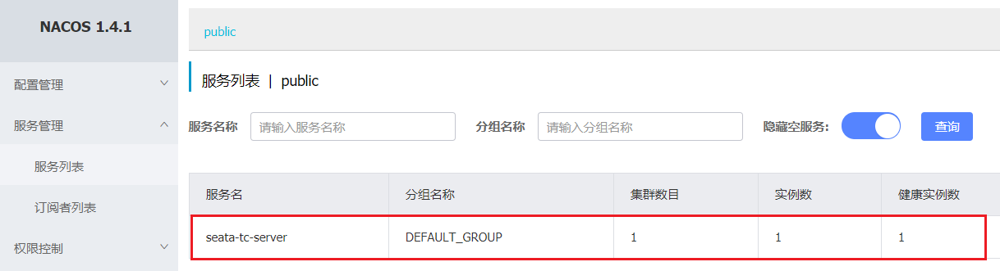</div>

### 微服务集成Seata

以 order-service 为例来演示。

#### 引入依赖

首先，在 order-service 中引入依赖

```xml
<!--seata-->
<dependency>
    <groupId>com.alibaba.cloud</groupId>
    <artifactId>spring-cloud-starter-alibaba-seata</artifactId>
    <exclusions>
        <!--版本较低，1.3.0，因此排除--> 
        <exclusion>
            <artifactId>seata-spring-boot-starter</artifactId>
            <groupId>io.seata</groupId>
        </exclusion>
    </exclusions>
</dependency>
<dependency>
    <groupId>io.seata</groupId>
    <artifactId>seata-spring-boot-starter</artifactId>
    <!--seata starter 采用1.4.2版本-->
    <version>${seata.version}</version>
</dependency>
```

#### 配置TC地址

在 order-service 中的 application.yml 中，配置 TC 服务信息，通过注册中心 nacos，结合服务名称获取 TC 地址

```yaml
seata:
  registry: # TC服务注册中心的配置，微服务根据这些信息去注册中心获取tc服务地址
    type: nacos # 注册中心类型 nacos
    nacos:
      server-addr: 127.0.0.1:8848 # nacos地址
      namespace: "" # namespace，默认为空
      group: DEFAULT_GROUP # 分组，默认是DEFAULT_GROUP
      application: seata-tc-server # seata服务名称
      username: nacos
      password: nacos
  tx-service-group: seata-demo # 事务组名称
  service:
    vgroup-mapping: # 事务组与cluster的映射关系
      seata-demo: SH
```

微服务如何根据这些配置寻找 TC 的地址呢？

我们知道注册到 Nacos 中的微服务，确定一个具体实例需要四个信息：

- namespace：命名空间
- group：分组
- application：服务名
- cluster：集群名

以上四个信息，在刚才的 yaml 文件中都能找到

<div align="center"></div>

namespace 为空，就是默认的 public。

TC 地址的查找规则如下：先找属于那个事务组，再根据事务组查找对应的集群映射关系。

结合起来，TC 服务的信息就是：public@DEFAULT_GROUP@seata-tc-server@SH，这样就能确定 TC 服务集群了。然后就可以去 Nacos 拉取对应的实例信息了。

<b>注意：seata 并未做好与 spring cloud nacos 的集成关系，因此 seata 中还是需要配置一下 nacos 注册中心的地址</b>

#### 其它服务

其它两个微服务也都参考 order-service 的步骤来做，完全一样。

### 总结

nacos 服务名称组成包括

- namespace + group + serviceName + cluster

seata 客户端获取 tc 的 cluster 名称方式

- 以 tx-group-service 的值为 key 到 vgroupMapping 中查找映射关系，从而找到集群名称

## 动手实践

学习 Seata 中的四种不同的事务模式。

### XA模式

XA 规范是 X/Open 组织定义的分布式事务处理（DTP，Distributed Transaction Processing）标准，XA 规范描述了全局的 TM 与局部的 RM 之间的接口，几乎所有主流的数据库都对 XA 规范提供了支持。(XA 标准中 RM 是由数据库来实现的)

#### 两阶段提交

XA 是规范，目前主流数据库都实现了这种规范，实现的原理都是基于两阶段提交。

正常情况

<div align="center"></div>

异常情况

<div align="center"></div>

<b>一阶段</b>

- 事务协调者通知每个事物参与者执行本地事务
- 本地事务执行完成后报告事务执行状态给事务协调者，<span style="color:orange">此时事务不提交，继续持有数据库锁</span>

<b>二阶段</b>

- 事务协调者基于一阶段的报告来判断下一步操作
    - <span style="color:orange">如果一阶段都成功，则通知所有事务参与者，提交事务</span>
    - <span style="color:orange">如果一阶段任意一个参与者失败，则通知所有事务参与者回滚事务</span>

### Seata的XA模型

Seata 对原始的 XA 模式做了简单的封装和改造，以适应自己的事务模型，基本架构如图（不看 TM 部分和前面说的 XA 模式基本一样，只不过是多了 TM 做整个事务的注册和管理）：

<div align="center"></div>

<b>RM 一阶段的工作：</b>

​	① 注册分支事务到 TC

​	② 执行分支业务 sql 但不提交

​	③ 报告执行状态到 TC

<b>TC 二阶段的工作：</b>

- TC 检测各分支事务执行状态

    a.如果都成功，通知所有 RM 提交事务

    b.如果有失败，通知所有 RM 回滚事务

<b>RM 二阶段的工作：</b>

- 接收 TC 指令，提交或回滚事务

#### 优缺点

<b>XA 模式的优点是什么？</b>

- 事务的强一致性，满足 ACID 原则。
- 常用数据库都支持，实现简单，并且没有代码侵入

<b>XA 模式的缺点是什么？</b>

- 因为一阶段需要锁定数据库资源，等待二阶段结束才释放，性能较差
- 依赖关系型数据库实现事务，如果采用 redis 这种，就不支持了。

#### 实现XA模式

Seata 的 starter 已经完成了 XA 模式的自动装配，实现非常简单，步骤如下：

1）修改 application.yml 文件（每个参与事务的微服务），开启 XA 模式：

```yaml
seata:
  data-source-proxy-mode: XA
```

2）给发起全局事务的入口方法添加 @GlobalTransactional 注解，这样全局事务就交由 TM 管理了。

本例中是 OrderServiceImpl 中的 create 方法

<div align="center"></div>

3）重启服务并测试

重启 order-service，再次测试，发现无论怎样，三个微服务都能成功回滚。

### AT模式

AT 模式同样是分阶段提交的事务模型，不过缺弥补了 XA 模型中资源锁定周期过长的缺陷。执行完业务 SQL 后会直接提交事务，不用等待其他分支 SQL 的执行结果。

#### Seata的AT模型

基本流程图

<div align="center"></div>

<b>阶段一 RM 的工作：</b>

- 注册分支事务
- 记录 undo-log（数据快照）
- 执行业务 sql 并提交
- 报告事务状态

<b>阶段二提交时 RM 的工作：</b>

- 删除 undo-log 即可

<b>阶段二回滚时 RM 的工作：</b>

- 根据 undo-log 恢复数据到更新前

#### 流程梳理

我们用一个真实的业务来梳理下 AT 模式的原理。

比如，现在又一个数据库表，记录用户余额

| **id** | **money** |
| ------ | --------- |
| 1      | 100       |

其中一个分支业务要执行的 SQL 为

```sql
update tb_account set money = money - 10 where id = 1
```

AT 模式下，当前分支事务执行流程如下

<b>一阶段：</b>

1）TM 发起并注册全局事务到 TC

2）TM 调用分支事务

3）分支事务准备执行业务 SQL

4）RM 拦截业务 SQL，根据 where 条件查询原始数据，形成快照。

```json
{
    "id": 1, "money": 100
}
```

5）RM 执行业务 SQL，提交本地事务，释放数据库锁。此时 `money = 90`

6）RM 报告本地事务状态给 TC

<b>二阶段：</b>

1）TM 通知 TC 事务结束

2）TC 检查分支事务状态

​	 a）如果都成功，则立即删除快照

​	 b）如果有分支事务失败，需要回滚。读取快照数据（`{"id": 1, "money": 100}`），将快照恢复到数据库。此时数据库再次恢复为 100

<div align="center"></div>

#### AT与XA的区别

简述 AT 模式与 XA 模式最大的区别是什么？

- XA 模式一阶段不提交事务，锁定资源；AT 模式一阶段直接提交，不锁定资源。
- XA 模式依赖数据库机制实现回滚；AT 模式利用数据快照实现数据回滚。
- XA 模式强一致；AT 模式最终一致

#### 脏写问题

因为“提前”释放了锁，因此在多线程并发访问 AT 模式的分布式事务时，有可能出现脏写问题，如图

<div align="center"></div>


解决思路就是引入了全局锁的概念。在释放 DB 锁之前，先拿到全局锁。避免同一时刻有另外一个事务来操作当前数据。

<div align="center"></div>

#### 优缺点

<b>AT 模式的优点</b>

- 一阶段完成直接提交事务，释放数据库资源，性能比较好
- 利用全局锁实现读写隔离
- 没有代码侵入，框架自动完成回滚和提交

<b>AT 模式的缺点</b>

- 两阶段之间属于软状态，属于最终一致
- 框架的快照功能会影响性能，但比 XA 模式要好很多

#### 实现AT模式

AT 模式中的快照生成、回滚等动作都是由框架自动完成，没有任何代码侵入，因此实现非常简单。

只不过，AT 模式需要一个表来记录全局锁、另一张表来记录数据快照 undo_log。

1）导入数据库表，记录全局锁

导入课前资料提供的 sql 文件：seata-at.sql，其中 lock_table 导入到 TC 服务关联的数据库，undo_log 表导入到微服务关联的数据库

<div align="center"></div>

2）修改 application.yml 文件，将事务模式修改为 AT 模式即可

```yaml
seata:
  data-source-proxy-mode: AT # 默认就是AT
```

3）重启服务并测试

### TCC模式

TCC 模式与 AT 模式非常相似，每阶段都是独立事务，不同的是 TCC 通过人工编码来实现数据恢复。需要实现三个方法

- Try：资源的检测和预留； 

- Confirm：完成资源操作业务；要求 Try 成功 Confirm 一定要能成功。

- Cancel：预留资源释放，可以理解为 try 的反向操作。

#### 流程分析

举例，一个扣减用户余额的业务。假设账户 A 原来余额是 100，需要余额扣减 30 元。

<b>阶段一(Try)：</b>检查余额是否充足，如果充足则冻结金额增加 30 元，可用余额扣除 30

初始余额

<div align="center"></div>

余额充足，可以冻结

<div align="center"></div>


此时，总金额 = 冻结金额 + 可用金额，数量依然是 100 不变。事务直接提交无需等待其它事务。

<b>阶段二(Confirm)：</b>假如要提交（Confirm），则冻结金额扣减30

确认可以提交，不过之前可用金额已经扣减过了，这里只要清除冻结金额就好了

<div align="center"></div>

此时，总金额 = 冻结金额 + 可用金额 = 0 + 70  = 70元

<b>阶段二(Canncel)：</b>如果要回滚（Cancel），则冻结金额扣减 30，可用余额增加 30

需要回滚，那么就要释放冻结金额，恢复可用金额：

<div align="center"></div>

#### Seata的TCC模型

Seata 中的 TCC 模型依然延续之前的事务架构

<div align="center"></div>

#### 优缺点

<b>TCC 模式的每个阶段是做什么的？</b>

- Try：资源检查和预留
- Confirm：业务执行和提交
- Cancel：预留资源的释放

<b>TCC 的优点是什么？</b>

- 一阶段完成直接提交事务，释放数据库资源，性能好
- 相比 AT 模型，无需生成快照，无需使用全局锁，性能最强
- 不依赖数据库事务，而是依赖补偿操作，可以用于非事务型数据库

<b>TCC 的缺点是什么？</b>

- 有代码侵入，需要人为编写 try、Confirm 和 Cancel 接口，太麻烦
- 软状态，事务是最终一致
- 需要考虑 Confirm 和 Cancel 的失败情况，做好幂等处理

#### 事务悬挂和空回滚

##### 1）空回滚

当某分支事务的 try 阶段<b>阻塞</b>时，可能导致全局事务超时而触发二阶段的 cancel 操作。在未执行 try 操作时先执行了 cancel 操作，这时 cancel 不能做回滚，就是<b>空回滚</b>。

<div align="center"></div>

执行 cancel 操作时，应当判断 try 是否已经执行，如果尚未执行，则应该空回滚。

##### 2）业务悬挂

对于已经空回滚的业务，之前被阻塞的 try 操作恢复，继续执行 try，就永远不可能 confirm 或 cancel ，事务一直处于中间状态，这就是<b>业务悬挂</b>。

执行 try 操作时，应当判断 cancel 是否已经执行过了，如果已经执行，应当阻止空回滚后的 try 操作，避免悬挂

#### 实现TCC模式

解决空回滚和业务悬挂问题，必须要记录当前事务状态，是在 try、还是 cancel？

##### 1）思路分析

这里我们定义一张表：

```sql
CREATE TABLE `account_freeze_tbl` (
  `xid` varchar(128) NOT NULL,
  `user_id` varchar(255) DEFAULT NULL COMMENT '用户id',
  `freeze_money` int(11) unsigned DEFAULT '0' COMMENT '冻结金额',
  `state` int(1) DEFAULT NULL COMMENT '事务状态，0:try，1:confirm，2:cancel',
  PRIMARY KEY (`xid`) USING BTREE
) ENGINE=InnoDB DEFAULT CHARSET=utf8 ROW_FORMAT=COMPACT;
```

- xid：是全局事务 id
- freeze_money：用来记录用户冻结金额
- state：用来记录事务状态

那此时，我们的业务开怎么做呢？

- Try 业务：
    - 记录冻结金额和事务状态到 account_freeze 表
    - 扣减 account 表可用金额
- Confirm 业务
    - 根据 xid 删除 account_freeze 表的冻结记录
- Cancel 业务
    - 修改 account_freeze 表，冻结金额为 0，state 为 2
    - 修改 account 表，恢复可用金额
- 如何判断是否空回滚？
    - cancel 业务中，根据 xid 查询 account_freeze，如果为 null 则说明 try 还没做，需要空回滚
- 如何避免业务悬挂？
    - try 业务中，根据 xid 查询 account_freeze ，如果已经存在则证明 Cancel 已经执行，拒绝执行 try 业务

接下来，我们改造 account-service，利用 TCC 实现余额扣减功能。

##### 2）声明TCC接口

TCC 的 Try、Confirm、Cancel 方法都需要在接口中基于注解来声明，

我们在 account-service 项目中的 `cn.itcast.account.service` 包中新建一个接口，声明 TCC 三个接口：

```java
package cn.itcast.account.service;

import io.seata.rm.tcc.api.BusinessActionContext;
import io.seata.rm.tcc.api.BusinessActionContextParameter;
import io.seata.rm.tcc.api.LocalTCC;
import io.seata.rm.tcc.api.TwoPhaseBusinessAction;

@LocalTCC
public interface AccountTCCService {

    @TwoPhaseBusinessAction(name = "deduct", commitMethod = "confirm", rollbackMethod = "cancel")
    void deduct(@BusinessActionContextParameter(paramName = "userId") String userId,
                @BusinessActionContextParameter(paramName = "money")int money);

    boolean confirm(BusinessActionContext ctx);

    boolean cancel(BusinessActionContext ctx);
}
```

##### 3）编写实现类

在 account-service 服务中的 `cn.itcast.account.service.impl` 包下新建一个类，实现 TCC 业务

```java
package cn.itcast.account.service.impl;

import cn.itcast.account.entity.AccountFreeze;
import cn.itcast.account.mapper.AccountFreezeMapper;
import cn.itcast.account.mapper.AccountMapper;
import cn.itcast.account.service.AccountTCCService;
import io.seata.core.context.RootContext;
import io.seata.rm.tcc.api.BusinessActionContext;
import lombok.extern.slf4j.Slf4j;
import org.springframework.beans.factory.annotation.Autowired;
import org.springframework.stereotype.Service;
import org.springframework.transaction.annotation.Transactional;

@Service
@Slf4j
public class AccountTCCServiceImpl implements AccountTCCService{

    @Autowired
    private AccountMapper accountMapper;
    @Autowired
    private AccountFreezeMapper freezeMapper;

    @Override
    @Transactional
    public void deduct(String userId, int money) {
        // 0.获取事务id
        String xid = RootContext.getXID();
        // 1.扣减可用余额
        accountMapper.deduct(userId, money);
        // 2.记录冻结金额，事务状态
        AccountFreeze freeze = new AccountFreeze();
        freeze.setUserId(userId);
        freeze.setFreezeMoney(money);
        freeze.setState(AccountFreeze.State.TRY);
        freeze.setXid(xid);
        freezeMapper.insert(freeze);
    }

    @Override
    public boolean confirm(BusinessActionContext ctx) {
        // 1.获取事务id
        String xid = ctx.getXid();
        // 2.根据id删除冻结记录
        int count = freezeMapper.deleteById(xid);
        return count == 1;
    }

    @Override
    public boolean cancel(BusinessActionContext ctx) {
        // 0.查询冻结记录
        String xid = ctx.getXid();
        AccountFreeze freeze = freezeMapper.selectById(xid);

        // 1.恢复可用余额
        accountMapper.refund(freeze.getUserId(), freeze.getFreezeMoney());
        // 2.将冻结金额清零，状态改为CANCEL
        freeze.setFreezeMoney(0);
        freeze.setState(AccountFreeze.State.CANCEL);
        int count = freezeMapper.updateById(freeze);
        return count == 1;
    }
}
```

### SAGA模式

Saga 模式是 Seata 即将开源的长事务解决方案，将由蚂蚁金服主要贡献。

其理论基础是 Hector & Kenneth  在 1987 年发表的论文 [Sagas](https://microservices.io/patterns/data/saga.html)。

Seata 官网对于 Saga 的指南：https://seata.io/zh-cn/docs/user/saga.html

#### 原理

在 Saga 模式下，分布式事务内有多个参与者，每一个参与者都是一个冲正补偿服务，需要用户根据业务场景实现其正向操作和逆向回滚操作。

分布式事务执行过程中，依次执行各参与者的正向操作，如果所有正向操作均执行成功，那么分布式事务提交。如果任何一个正向操作执行失败，那么分布式事务会去退回去执行前面各参与者的逆向回滚操作，回滚已提交的参与者，使分布式事务回到初始状态。

<div align="center"></div>

Saga 也分为两个阶段：

- 一阶段：直接提交本地事务
- 二阶段：成功则什么都不做；失败则通过编写补偿业务来回滚

#### 优缺点

<b>优点</b>

- 事务参与者可以基于事件驱动实现异步调用，吞吐高
- 一阶段直接提交事务，无锁，性能好
- 不用编写 TCC 中的三个阶段，实现简单

<b>缺点</b>

- 软状态持续时间不确定，时效性差
- 没有锁，没有事务隔离，会有脏写

### 四种模式对比

我们从以下几个方面来对比四种实现

- 一致性：能否保证事务的一致性？强一致还是最终一致？
- 隔离性：事务之间的隔离性如何？
- 代码侵入：是否需要对业务代码改造？
- 性能：有无性能损耗？
- 场景：常见的业务场景

| -        | XA                             | AT                                           | TCC                                                  | SAGA                                                         |
| -------- | ------------------------------ | -------------------------------------------- | ---------------------------------------------------- | ------------------------------------------------------------ |
| 一致性   | 强一致                         | 弱一致                                       | 弱一致                                               | 最终一致                                                     |
| 隔离性   | 完全隔离                       | 基于全局锁隔离                               | 基于资源预留隔离                                     | 无隔离                                                       |
| 代码入侵 | 无                             | 无                                           | 有，要编写三个接口                                   | 有，要编写状态机和补偿业务                                   |
| 性能     | 差                             | 好                                           | 非常好                                               | 非常好                                                       |
| 场景     | 对一致性、隔离性有高要求的业务 | 基于关系型数据库的大多数分布式事务场景都可以 | 对性能要求较高的事务<br>有非关系型数据库要参与的事务 | 业务流程长、业务流程多<br>参与者包含其他公司或遗留系统服务，无法提供 TCC 模式要求的三个接口 |

## 高可用

Seata 的 TC 服务作为分布式事务核心，一定要保证集群的高可用性。

### 高可用架构模型

搭建 TC 服务集群非常简单，启动多个 TC 服务，注册到 nacos 即可。

但集群并不能确保 100% 安全，万一集群所在机房故障怎么办？所以如果要求较高，一般都会做异地多机房容灾。

比如一个 TC 集群在上海，另一个 TC 集群在杭州

<div align="center"></div>


微服务基于事务组（tx-service-group) 与 TC 集群的映射关系，来查找当前应该使用哪个 TC 集群。当 SH 集群故障时，只需要将 vgroup-mapping 中的映射关系改成 HZ。则所有微服务就会切换到 HZ 的 TC 集群了。

### 实现高可用

#### 模拟异地容灾的TC集群

计划启动两台 seata 的 tc 服务节点

| 节点名称 | ip地址    | 端口号 | 集群名称 |
| -------- | --------- | ------ | -------- |
| seata    | 127.0.0.1 | 8091   | SH       |
| seata2   | 127.0.0.1 | 8092   | HZ       |

之前我们已经启动了一台 seata 服务，端口是 8091，集群名为 SH。

现在，将 seata 目录复制一份，起名为 seata2

修改 seata2/conf/registry.conf 内容如下

```nginx
registry {
  # tc服务的注册中心类，这里选择nacos，也可以是eureka、zookeeper等
  type = "nacos"

  nacos {
    # seata tc 服务注册到 nacos的服务名称，可以自定义
    application = "seata-tc-server"
    serverAddr = "127.0.0.1:8848"
    group = "DEFAULT_GROUP"
    namespace = ""
    cluster = "HZ"
    username = "nacos"
    password = "nacos"
  }
}

config {
  # 读取tc服务端的配置文件的方式，这里是从nacos配置中心读取，这样如果tc是集群，可以共享配置
  type = "nacos"
  # 配置nacos地址等信息
  nacos {
    serverAddr = "127.0.0.1:8848"
    namespace = ""
    group = "SEATA_GROUP"
    username = "nacos"
    password = "nacos"
    dataId = "seataServer.properties"
  }
}
```

进入 seata2/bin 目录，然后运行命令

```powershell
seata-server.bat -p 8092
```

打开 nacos 控制台，查看服务列表

<div align="center"></div>

点进详情查看

<div align="center"></div>

#### 将事务组映射配置到nacos

接下来，我们需要将 tx-service-group 与 cluster 的映射关系都配置到 nacos 配置中心。

新建一个配置

<div align="center"></div>

配置的内容如下

```properties
# 事务组映射关系
service.vgroupMapping.seata-demo=SH

service.enableDegrade=false
service.disableGlobalTransaction=false
# 与TC服务的通信配置
transport.type=TCP
transport.server=NIO
transport.heartbeat=true
transport.enableClientBatchSendRequest=false
transport.threadFactory.bossThreadPrefix=NettyBoss
transport.threadFactory.workerThreadPrefix=NettyServerNIOWorker
transport.threadFactory.serverExecutorThreadPrefix=NettyServerBizHandler
transport.threadFactory.shareBossWorker=false
transport.threadFactory.clientSelectorThreadPrefix=NettyClientSelector
transport.threadFactory.clientSelectorThreadSize=1
transport.threadFactory.clientWorkerThreadPrefix=NettyClientWorkerThread
transport.threadFactory.bossThreadSize=1
transport.threadFactory.workerThreadSize=default
transport.shutdown.wait=3
# RM配置
client.rm.asyncCommitBufferLimit=10000
client.rm.lock.retryInterval=10
client.rm.lock.retryTimes=30
client.rm.lock.retryPolicyBranchRollbackOnConflict=true
client.rm.reportRetryCount=5
client.rm.tableMetaCheckEnable=false
client.rm.tableMetaCheckerInterval=60000
client.rm.sqlParserType=druid
client.rm.reportSuccessEnable=false
client.rm.sagaBranchRegisterEnable=false
# TM配置
client.tm.commitRetryCount=5
client.tm.rollbackRetryCount=5
client.tm.defaultGlobalTransactionTimeout=60000
client.tm.degradeCheck=false
client.tm.degradeCheckAllowTimes=10
client.tm.degradeCheckPeriod=2000

# undo日志配置
client.undo.dataValidation=true
client.undo.logSerialization=jackson
client.undo.onlyCareUpdateColumns=true
client.undo.logTable=undo_log
client.undo.compress.enable=true
client.undo.compress.type=zip
client.undo.compress.threshold=64k
client.log.exceptionRate=100
```

#### 微服务读取nacos配置

接下来，需要修改每一个微服务的 application.yml 文件，让微服务读取 nacos 中的 client.properties 文件

```yaml
seata:
  config:
    type: nacos
    nacos:
      server-addr: 127.0.0.1:8848
      username: nacos
      password: nacos
      group: SEATA_GROUP
      data-id: client.properties
```

重启微服务，现在微服务到底是连接 tc 的 SH 集群，还是 tc 的 HZ 集群，都统一由 nacos 的 client.properties 来决定了。

# 分布式缓存

单点 Redis 的问题：

- 数据丢失问题，服务器重启可能会丢失数据；Redis 数据持久化可以解决该问题
- 并发能力问题，单节点的 Redis 无法满足高并发场景；<span style="color:red">搭建主从集群，实现读写分离</span>
- 故障回复问题，如果 Redis 宕机，则服务不可用，需要一种自动的故障恢复手段；<span style="color:red">利用 Redis 哨兵，实现健康检测和自动恢复</span>
- 存储能力问题，Redis 基于内存，单节点的存储难以满足海里数据需求；<span style="color:red">搭建分片集群，利用插槽机制实现动态扩容</span>

水平扩展和垂直扩展

- 水平扩展，就是添加机器。一台不够，就加两台。以数量弥补质量的不足
- 垂直扩展，就是升级机器，加强装备。换一台更贵更豪华的机器。

## Redis的持久化

- RDB 持久化
- AOF 持久化

### RDB持久化

RDB 全称 Redis Database Backup file（Redis 数据备份文件），也被叫做 Redis 数据快照。简单来说就是把内存中的所有数据都记录到磁盘中。当 Redis 实例故障重启后，从磁盘读取快照文件，恢复数据。快照文件称为 RDB 文件，默认是保存在当前运行目录。

#### 执行时机

RDB 持久化在四种情况下会执行：

- 执行 save 命令
- 执行 bgsave 命令
- Redis 停机时
- 触发 RDB 条件时

<b>1）save 命令</b>

执行下面的命令，可以立即执行一次 RDB：

<div align="center"></div>

save 命令会导致主进程执行 RDB，这个过程中其它所有命令都会被阻塞。适合用在 Redis 即将停止时，比如在数据迁移时可能用到。

<b>2）bgsave 命令</b>

下面的命令可以异步执行 RDB：

<div align="center"></div>

这个命令执行后会开启独立进程完成 RDB，主进程可以持续处理用户请求，不受影响。

<b>3）停机时</b>

Redis 停机时会执行一次 save 命令，实现 RDB 持久化。

<b>4）触发 RDB 条件</b>

Redis 内部有触发 RDB 的机制，可以在 redis.conf 文件中找到，格式如下：

```properties
# 900秒内，如果至少有1个key被修改，则执行bgsave ， 如果是save "" 则表示禁用RDB
save 900 1  
save 300 10  
save 60 10000 
```

RDB 的其它配置也可以在 redis.conf 文件中设置：

```properties
# 是否压缩 ,建议不开启，压缩也会消耗 cpu，磁盘的话不值钱
rdbcompression yes

# RDB文件名称
dbfilename dump.rdb  

# 文件保存的路径目录
dir ./ 
```

RDB 的频率不要太高，频率太高会一直处于写入数据的状态，影响性能，一般用默认的就好。

#### RDB原理

bgsave 开始时会 fork 主进程得到子进程，子进程共享主进程的内存数据。完成 fork 后读取内存数据并写入 RDB 文件。注意：fork 这个操作过程要拷贝页表是阻塞的。

fork 采用的是 copy-on-write 技术：

- 当主进程执行读操作时，访问共享内存；
- 当主进程执行写操作时，则会拷贝一份数据，执行写操作。

<div align="center"></div>

Linux 中，所有的进程都没办法直接操作物理内存而是由操作系统给每个进程分配一个虚拟内存，主进程操作虚拟内存，操作系统维护一个虚拟内存与物理内存直接的映射关系（页表）。fork 主进程实际上是 fork 页表（页表中保存了物理内存与虚拟内存的映射关系）的过程，让子进程和主进程拥有一样的映射关系。这样就实现了子进程和主进程一样的内存共享。这样就无需拷贝内存中的数据，直接实现数据共享。

但这样会有一个问题，就是一个读一个写，会有并发问题。如果子进程在拷贝数据的时候，主进程还在写怎么办？fork 底层会采用 copy-on-write 的技术。源数据只读，如果需要修改就复制一份数据，在复制的数据中进行修改，如果每次修改要复制的数据很大，那么这样的开销是很大的。<span style="color:red">JVM 垃圾回收算法的标记如果标记在对象上，修改对象的 GC 标记的频繁复制对象对内存的压力特别大，具体可看《垃圾回收的算法与实现》与写时复制技术不兼容。[JVM 笔记#标记清除](../Java-Virtual-Machine/03-垃圾回收.md###标记-清除)</span>（后面好像是等持久化结束后，在写入源数据。MySQL 也有一个类似的操作，查下 MySQL 的笔记）

#### 小结

RDB 方式 bgsave 的基本流程？

- fork 主进程得到一个子进程，共享内存空间
- 子进程读取内存数据并写入新的 RDB 文件
- 用新 RDB 文件替换旧的 RDB 文件

RDB 会在什么时候执行？save 60 1000 代表什么含义？

- 默认是服务停止时才会执行
- 代表 60 秒内至少执行 1000 次修改则触发 RDB

RDB 的缺点？

- RDB 执行间隔时间长，两次 RDB 之间写入数据有丢失的风险（要速度快的话就牺牲数据的一致性）
- fork 子进程、压缩、写出 RDB 文件都比较耗时

### AOF持久化

AOF 全称为 Append Only File（追加文件）。Redis 处理的每一个写命令都会记录在 AOF 文件，可以看做是命令日志文件。

<div align="center"></div>

#### AOF配置

AOF 默认是关闭的，需要修改 redis.conf 配置文件来开启 AOF：

```properties
# 是否开启AOF功能，默认是no
appendonly yes
# AOF文件的名称
appendfilename "appendonly.aof"
```

AOF 的命令记录的频率也可以通过 redis.conf 文件来配：

```properties
# 表示每执行一次写命令，立即记录到AOF文件，Redis 主进程完成磁盘写入操作。
appendfsync always 
# 写命令执行完先放入AOF缓冲区，然后表示每隔1秒将缓冲区数据写到AOF文件，是默认方案，子进程完成磁盘写入操作
appendfsync everysec 
# 写命令执行完先放入AOF缓冲区，由操作系统决定何时将缓冲区内容写回磁盘
appendfsync no
```

用配置文件的方式启动 Redis

```shell
sudo ./redis-server ../redis.conf
```

向 Redis 中写入数据可以发现，每次执行的命令都被写入到了 aof 文件中

```shell
→ cat appendonly.aof
*2
$6
SELECT
$1
0
*3
$3
set
$4
name
$3
ljw
*3
$3
set
$4
name
$3
kkx
```

三种策略对比：

| 配置项   | 刷盘时机     | 优点                   | 缺点                         |
| -------- | ------------ | ---------------------- | ---------------------------- |
| Always   | 同步刷盘     | 可靠性高，几乎不丢数据 | 性能影响大                   |
| everysec | 每秒刷盘     | 性能适中               | 最多丢失 1 秒数据            |
| no       | 操作系统控制 | 性能最好               | 可靠性较差，可能丢失大量数据 |

#### AOF文件重写

因为是记录命令，AOF 文件会比 RDB 文件大的多。而且 AOF 会记录对同一个 key 的多次写操作，但只有最后一次写操作才有意义。通过执行 bgrewriteaof 命令，可以让 AOF 文件执行重写功能，用最少的命令达到相同效果。

<div align="center"></div>

如图，AOF 原本有三个命令，但是 `set num 123 和 set num 666` 都是对 num 的操作，第二次会覆盖第一次的值，因此第一个命令记录下来没有意义。

所以重写命令后，AOF 文件内容就是：`mset name jack num 666`。实际测试，AOF 文件重写后内容被压缩了，命令也被简化了~

Redis 也会在触发阈值时自动去重写 AOF 文件。阈值也可以在 redis.conf 中配置：

```properties
# AOF文件比上次文件增长超过 100%（翻了一倍）则触发重写
auto-aof-rewrite-percentage 100
# AOF文件体积超过 64mb 就触发重写 
auto-aof-rewrite-min-size 64mb 
```

### 混合RDB和AOF

Redis 4.0 中提出了一个混合使用 AOF 日志和内存快照的方法。内存快照以一定的频率执行，在两次快照之间，使用 AOF 日志记录这期间的所有命令操作。这样，不用频繁执行快照，避免了频繁 fork 对主线程的影响。且，AOF 日志也只用记录两次快照间的操作，无需记录所有操作了，不会出现文件过大的情况，也可以避免重写开销。如下图所示，T1 和 T2 时刻的修改，用 AOF 日志记录，等到第二次做全量快照时，就可以清空 AOF 日志，因为此时的修改都已经记录到快照中了，恢复时就不再用日志了。

<div align="center">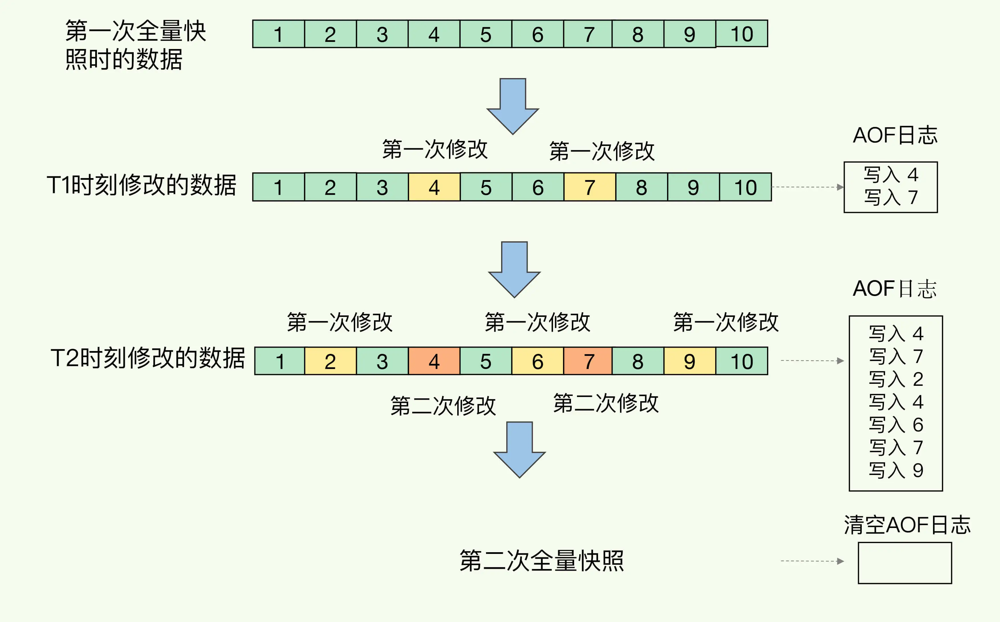</div>

### RDB与AOF对比

RDB 和 AOF 各有自己的优缺点，如果对数据安全性要求较高，在实际开发中往往会<b>结合</b>两者来使用。

| -              | RDB                                          | AOF                                                          |
| -------------- | -------------------------------------------- | ------------------------------------------------------------ |
| 持久化方式     | 定时对整个内存做快照                         | 记录每一次执行的命令                                         |
| 数据完整性     | 不完整，两次备份之间会丢失                   | 相对完整，取决于刷盘策略                                     |
| 文件大小       | 会有压缩，文件体积小                         | 记录命令，文件体积大                                         |
| 宕机恢复速度   | 很快                                         | 慢                                                           |
| 数据恢复优先级 | 低，因为数据完整性不如 AOF                   | 高，数据完整性高                                             |
| 系统资源占用   | 高，大量的 CPU 和内存消耗                    | 低，主要是磁盘 IO 资源，但是 AOF 重写时会占用大量 CPU 和内存资源 |
| 使用场景       | 可以容忍数分钟的数据丢失，追求更快的启动速度 | 对数据安全性要求较高场景                                     |

## Redis主从

### 搭建主从架构

单节点 Redis 的并发能力是有上限的，要进一步提高 Redis 的并发能力，就需要搭建主从集群，实现读写分离。

<div align="center"></div>

多个从结点承担读的请求，Redis 读取数据的能力可以得到极大的提升。

将 redis.conf 文件复制多份，分别启动多个 Redis。此时这样启动的还只是一个一个孤立的 Redis。

### 开启主从关系

要配置主从关系可以使用 replicaof 或 slaveof（5.0 以前的命令）。

有临时和永久两种模式

- 修改配置文件，永久生效。在 redis.conf 中添加一行配置 `slaveof <masterip> <masterport>`
- 使用 redis-cli 客户端连接到 redis 服务，执行 slaveof 命令（重启后失效）`slaveof masterip masterport`

此处采用临时模式配置主从关系。

1️⃣用不同配置文件开启多个 redis 服务；

```shell
# 在 6370 端口开启一个 redis 实例
sudo ./bin/redis-server redis.conf
# 连接 6739 端口的 redis 实例
./bin/redis-cli -p 6379

# 在 7000 端口开启一个 redis 实例
sudo ./bin/redis-server 7000.conf
# 连接 7000 端口的 redis 实例
./bin/redis-cli -p 7000
```

2️⃣配置主从节点（只要指定从节点即可）

```shell
# 在 7000 redis-cli 中执行命令，将 7000 端口的 redis 指定为
# 6379 端口的从节点。
127.0.0.1:7000> SLAVEOF  172.26.26.72 6379
OK
```

3️⃣查看从节点的 key，然后在主节点中写入一些数据，看是否会同步到从节点中

```shell
# 主节点和从节点此时数据都为空
127.0.0.1:6379> keys *
(empty array)

127.0.0.1:7000> keys *
(empty array)

# 主节点中写数据
127.0.0.1:6379> set master somevalue
OK

# 从节点同步到了主节点的数据
127.0.0.1:7000> keys *
1) "master"
```

4️⃣查看集群状态信息 `info replication`

```shell
127.0.0.1:7000> info replication
# Replication
role:slave
master_host:127.0.0.1
master_port:6379
master_link_status:up
master_last_io_seconds_ago:3
master_sync_in_progress:0
slave_repl_offset:423
slave_priority:100
slave_read_only:1
connected_slaves:0
master_failover_state:no-failover
master_replid:b6811140f497c5bbe6f0ddd27c46b39a091fb7ac
master_replid2:0000000000000000000000000000000000000000
master_repl_offset:423
second_repl_offset:-1
repl_backlog_active:1
repl_backlog_size:1048576
repl_backlog_first_byte_offset:1
repl_backlog_histlen:423
```

### 主从同步原理

#### 全量同步

主从第一次建立连接时，会执行<b>全量同步</b>，将 master 节点的所有数据都拷贝给 slave 节点，流程：

<div align="center"></div>

这里有一个问题，master 如何得知 salve 是第一次来连接呢？？

有几个概念，可以作为判断依据：

- <b>Replication Id</b>：简称 replid，是数据集的标记，id 一致则说明是同一数据集。每一个 master 都有唯一的 replid，slave 则会继承 master 节点的 replid
- <b>offset</b>：偏移量，随着记录在 repl_baklog 中的数据增多而逐渐增大。slave 完成同步时也会记录当前同步的 offset。如果 slave 的 offset 小于 master 的 offset，说明 slave 数据落后于 master，需要更新。

因此 slave 做数据同步，必须向 master 声明自己的 replication id  和 offset，master 才可以判断到底需要同步哪些数据。

因为 slave 原本也是一个 master，有自己的 replid 和 offset，当第一次变成 slave，与 master 建立连接时，发送的 replid 和 offset 是自己的 replid 和 offset。

master 判断发现 slave 发送来的 replid 与自己的不一致，说明这是一个全新的 slave，就知道要做全量同步了。

master 会将自己的 replid 和 offset 都发送给这个 slave，slave 保存这些信息。以后 slave 的 replid 就与 master 一致了。

因此，<b>master 判断一个节点是否是第一次同步的依据，就是看 replid 是否一致</b>。

<div align="center"></div>

完整流程描述：

- slave 节点请求增量同步
- master 节点判断 replid，发现不一致，拒绝增量同步
- master 将完整内存数据生成 RDB，发送 RDB 到 slave
- slave 清空本地数据，加载 master 的 RDB
- master 将 RDB 期间的命令记录在 repl_baklog，并持续将 log 中的命令发送给 slave
- slave 执行接收到的命令，保持与 master 之间的同步

#### 增量同步

全量同步需要先做 RDB，然后将 RDB 文件通过网络传输个 slave，成本太高了。因此除了第一次做全量同步，其它大多数时候 slave 与 master 都是做<b>增量同步</b>。

增量同步就是只更新 slave 与 master 存在差异的部分数据。如图：

<div align="center"></div>

那么 master 怎么知道 slave 与自己的数据差异在哪里呢？简单来说是根据 master 和 slave 的 offset 的差值来判断的，如果 master 和 slave 的 offset 不一样，则说明主从需要进行同步。如果 master 的 offset 覆盖了未同步的数据，就得进行全增量同步了。具体原理请看 “repl_backlog 原理”

#### repl_backlog原理

master 怎么知道 slave 与自己的数据差异在哪里呢？这就要靠全量同步时的 repl_baklog 文件了。

这个文件是一个固定大小的数组，只不过数组是环形，也就是说<b>角标到达数组末尾后，会再次从 0 开始读写</b>，这样数组头部的数据就会被覆盖。

repl_baklog 中会记录 Redis 处理过的命令日志及 offset，包括 master 当前的 offset，和 slave 已经拷贝到的 offset（红色部分是尚未同步的内容）：

<div align="center"></div>

slave 与 master 的 offset 之间的差异，就是 slave 需要增量拷贝的数据了。随着不断有数据写入，master 的 offset 逐渐变大， slave 也不断的拷贝，追赶 master 的 offset

<div align="center"></div>

直到数组被填满

<div align="center"></div>

此时，如果有新的数据写入，就会覆盖数组中的旧数据。不过，旧的数据只要是绿色的，说明是已经被同步到 slave 的数据，即便被覆盖了也没什么影响。因为未同步的仅仅是红色部分。

但是，如果 slave 出现网络阻塞，导致 master 的 offset 远远超过了 slave 的 offset： 

<div align="center">
</div>

如果 master 继续写入新数据，其 offset 就会覆盖旧的数据，直到将 slave 现在的 offset 也覆盖：

<div align="center"></div>

棕色框中的红色部分，就是尚未同步，但是却已经被覆盖的数据。此时如果 slave 恢复，需要同步，却发现自己的 offset 都没有了，无法完成增量同步了。只能做全量同步。

<b style="color:orange">repl_baklog 大小有上限，写满后会覆盖最早的数据。如果 slave 断开时间过久，导致尚未备份的数据被覆盖，则无法基于 log 做增量同步，智能再次全量同步。</b>

<div align="center"></div>

### 主从同步优化

> 主从同步可以保证主从数据的一致性，非常重要。可以从以下几个方面来优化 Redis 主从集群（如尽可能的避免全量同步，少做磁盘 IO）：

- 在 master 中配置 repl-diskless-sync yes 启用无磁盘复制，<span style="color:orange">（即，不是先在磁盘中生成 RDB 然后再通过网络发送出去，而是直接通过网络发送，不再经过磁盘了。适合磁盘 IO 速度慢，网络速度快。）</span>，避免全量同步时的磁盘 IO。
- Redis 单节点上的内存占用不要太大，这样 RDB 的文件也就比较小了。有点像用多个小的 RDB 替代一个超大的 RDB（有点 GC 的味道了）。

> 上面两个都是在提高全量同步的性能，下面两点是从减少全量同步出发的。

- 适当提高 repl_baklog 的大小，允许主从数据的差异更大，就可以减少全量同步发生的几率了。发现 slave 宕机时尽快实现故障恢复，尽可能避免全量同步
- 限制一个 master 上的 slave 节点数量，如果实在是太多 slave，则可以采用主-从-从链式结构，减少 master 压力<span style="color:orange">（后面的 slave 同步中间的 slave 的数据）</span>

<div align="center"></div>

### 小结

<b>简述全量同步和增量同步区别？</b>

- 全量同步：master 将完整内存数据生成 RDB，发送 RDB 到 slave。后续命令则记录在 repl_baklog，逐个发送给 slave。
- 增量同步：slave 提交自己的 offset 到 master，master 获取 repl_baklog 中从 offset 之后的命令给 slave

<b>什么时候执行全量同步？</b>

- slave 节点第一次连接 master 节点时
- slave 节点断开时间太久，repl_baklog 中的 offset 已经被覆盖时

<b>什么时候执行增量同步？</b>

- slave 节点断开又恢复，并且在 repl_baklog 中能找到 offset 时

<b>实际使用是全量同步+增量同步一起使用。</b>

## Redis哨兵

slave 节点宕机恢复后可以找 master 节点同步数据，那 master 节点宕机该如何处理？

<span style="color:orange">Redis 提供了哨兵（Sentinel）机制来实现主从集群的自动故障恢复。而哨兵是用于监控整个集群做故障恢复的。</span>

- 哨兵的作用和原理
- 搭建哨兵集群
- RedisTemplate 的哨兵模式

### 哨兵原理

#### 集群的结构和作用

<b style="color:red">哨兵的作用如下：</b>

- <b>监控</b>：Sentinel 会不断检查 master 和 slave 是否按预期工作。
- <b>自动故障恢复</b>：如果 master 故障，Sentinel 会将一个 slave 提升为 master。当故障实例恢复后也以新的 master 为主。
- <b>通知</b>：Sentinel 充当 Redis 客户端的服务发现来源，当集群发生故障转移时，会将最新信息推送给 Redis 的客户端。<span style="color:orange">（Redis 客户端找主从服务的时候，是从 Sentinel 中找的，由 Sentinel 告诉客户端主的地址在哪里，从的地址在哪里；此时 Sentinel 就充当了 Redis 客户端服务发现的来源了。）</span>

<div align="center"></div>

#### 服务状态监控

Sentinel 基于心跳机制监测服务状态，每隔 1 秒向集群的每个实例发送 ping 命令：

- 主观下线：如果某 sentinel 节点发现某实例未在规定时间响应，则认为该实例<b>主观下线</b>，sentinel 认为你下线了，所以是主观下线。
- 客观下线：若超过指定数量（quorum）的 sentinel 都认为该实例主观下线，则该实例<b>客观下线</b>。 quorum 值最好超过 Sentinel 实例数量的一半。

<div align="center"></div>

#### 故障恢复原理

<b>一旦发现 master 故障，sentinel 需要在 slave 中选择一个作为新的 master，选择依据是这样的：</b>

- 首先会判断 slave 节点与 master 节点断开时间长短，如果超过指定值（down-after-milliseconds \* 10）则会排除该 slave 节点<span style="color:orange">（断开时间越长，未同步的数据就越多，这样的节点就不具备选举的资格）</span>
- 然后判断 slave 节点的 slave-priority 值（默认都是 1），越小优先级越高，如果是 0 则永不参与选举
- 如果 slave-prority 一样，则判断 slave 节点的 offset 值，越大说明数据越新，优先级越高
- 最后是判断 slave 节点的运行 id 大小，越小优先级越高。（是为了避免 offset 都一样，难以抉择，因此依靠 id 随便选一个）

<b>当选出一个新的 master 后，该如何实现切换呢？流程如下：</b>

- sentinel 给备选的 slave1 节点发送 slaveof no one 命令，让该节点成为 master
- sentinel 给所有其它 slave 发送 slaveof 192.168.150.101 7002 命令，让这些 slave 成为新 master 的从节点，开始从新的 master 上同步数据。
- 最后，sentinel 将故障节点标记为 slave（就是在配置文件中加入一行 `slaveof master_ip port`），当故障节点恢复后会自动成为新的 master 的 slave 节点

<div align="center"></div>

#### 小结

Sentinel 的三个作用是什么？

- 监控
- 故障转移
- 通知

Sentinel 如何判断一个 redis 实例是否健康？

- 每隔 1 秒发送一次 ping 命令，如果超过一定时间没有相向则认为是主观下线
- 如果大多数 sentinel 都认为实例主观下线，则判定服务下线

故障转移步骤有哪些？

- 首先选定一个 slave 作为新的 master，执行 slaveof no one（自己不再是 slave，要变成 master）
- 然后让所有节点都执行 slaveof 新 master
- 修改故障节点配置，添加 slaveof 新 master

### 搭建哨兵集群

#### 集群结构

先按之前的方式搭建好主从集群，然后继续搭建一个三节点形成的 Sentinel 集群，来监管之前的 Redis 主从集群。

<div align="center">
    
</div>

三个 sentinel 实例信息如下：

| 节点 |       IP        | PORT  |
| ---- | :-------------: | :---: |
| s1   | 192.168.150.101 | 27001 |
| s2   | 192.168.150.101 | 27002 |
| s3   | 192.168.150.101 | 27003 |

#### 准备实例和配置

要在同一台虚拟机开启 3 个实例，必须准备三份不同的配置文件和目录，配置文件所在目录也就是工作目录。

我们创建三个文件夹，名字分别叫 s1、s2、s3：

```sh
# 进入/tmp目录
cd /tmp
# 创建目录
mkdir s1 s2 s3
```

然后我们在 s1 目录创建一个 sentinel.conf 文件，添加下面的内容：

```ini
port 27001
sentinel announce-ip 172.26.26.72
sentinel monitor mymaster 172.26.26.72 27001 2
sentinel down-after-milliseconds mymaster 5000
sentinel failover-timeout mymaster 60000
dir "/tmp/s1"
```

解读：

- `port 27001`：是当前 sentinel 实例的端口
- `sentinel monitor mymaster 172.26.26.72 2`：指定主节点信息
    - `mymaster`：主节点名称，自定义，任意写
    - `172.26.26.72 27001`：主节点的 ip 和端口
    - `2`：选举 master 时的 quorum 值

然后将 s1/sentinel.conf 文件拷贝到 s2、s3 两个目录中（在 /tmp 目录执行下列命令）：

```sh
# 方式一：逐个拷贝
cp s1/sentinel.conf s2
cp s1/sentinel.conf s3
# 方式二：管道组合命令，一键拷贝
echo s2 s3 | xargs -t -n 1 cp s1/sentinel.conf
```

修改 s2、s3 两个文件夹内的配置文件，将端口分别修改为 27002、27003：

```sh
sed -i -e 's/27001/27002/g' -e 's/s1/s2/g' s2/sentinel.conf
sed -i -e 's/27001/27003/g' -e 's/s1/s3/g' s3/sentinel.conf
```

#### 启动

为了方便查看日志，我们打开 3 个 ssh 窗口，分别启动 3 个 redis 实例，启动命令：

```sh
# 第1个
redis-sentinel s1/sentinel.conf
# 第2个
redis-sentinel s2/sentinel.conf
# 第3个
redis-sentinel s3/sentinel.conf
```

#### 测试

如果哨兵选举的时候一直失败，可能是没开发所有主从服务器和哨兵节点的端口 `systemctl stop firewalld.service`，如果是 ubuntu 系统则执行 `sudo ufw disable` 关闭防火墙。

尝试让 master 节点 7001 宕机，查看 sentinel 日志：

<div align="center"></div>

查看 7003 的日志：

<div align="center"></div>

查看 7002 的日志：

<div align="center"></div>

### RedisTemplate

在 Sentinel 集群监管下的 Redis 主从集群，其节点会因为自动故障转移而发生变化，Redis 的客户端必须感知这种变化，及时更新连接信息。Spring 的 RedisTemplate 底层利用 lettuce 实现了节点的感知和自动切换。

#### 导入Demo工程

redis-demo 这个文件夹

#### 引入依赖

在项目的 pom 文件中引入依赖：

```xml
<dependency>
    <groupId>org.springframework.boot</groupId>
    <artifactId>spring-boot-starter-data-redis</artifactId>
</dependency>
```

#### 配置Redis地址

在配置文件 application.yml 中指定 redis 的 sentinel 相关信息：

```yaml
spring:
  redis:
    sentinel:
      master: mymaster
      nodes:
        - 192.168.150.101:27001
        - 192.168.150.101:27002
        - 192.168.150.101:27003
```

#### 配置读写分离

在项目的启动类中，添加一个新的 bean：

```java
@Bean
public LettuceClientConfigurationBuilderCustomizer clientConfigurationBuilderCustomizer(){
    return clientConfigurationBuilder -> clientConfigurationBuilder.readFrom(ReadFrom.REPLICA_PREFERRED);
}
```

这个 bean 中配置的就是读写策略，包括四种：

- MASTER：从主节点读取
- MASTER_PREFERRED：优先从 master 节点读取，master 不可用才读取 replica
- REPLICA：从 slave（replica）节点读取
- REPLICA _PREFERRED：优先从 slave（replica）节点读取，所有的 slave 都不可用才读取 master

## Redis分片集群

- 搭建分片集群
- 散列插槽
- 集群伸缩
- 故障转移
- RedisTemplate 访问分片集群

### 搭建分片集群

主从和哨兵可以解决高可用、高并发读的问题。但是依然有两个问题没有解决：

- 海量数据存储问题

- 高并发写的问题

使用分片集群可以解决上述问题，如图：

<div align="center"></div>

分片集群特征：

- 集群中有多个 master，每个 master 保存不同数据

- 每个 master 都可以有多个 slave 节点

- master 之间通过 ping 监测彼此健康状态

- 客户端请求可以访问集群任意节点，最终都会被转发到正确节点

#### 集群结构

片集群需要的节点数量较多，这里我们搭建一个最小的分片集群，包含 3 个 master 节点，每个 master 包含一个 slave 节点，结构如下

<div align="center"></div>

这里我们会在同一台虚拟机中开启 6 个 redis 实例，模拟分片集群，信息如下：

|       IP        | PORT |  角色  |
| :-------------: | :--: | :----: |
| 192.168.150.101 | 7001 | master |
| 192.168.150.101 | 7002 | master |
| 192.168.150.101 | 7003 | master |
| 192.168.150.101 | 8001 | slave  |
| 192.168.150.101 | 8002 | slave  |
| 192.168.150.101 | 8003 | slave  |

#### 准备实例和配置

删除之前的 7001、7002、7003 这几个目录，重新创建出 7001、7002、7003、8001、8002、8003 目录：

```sh
# 进入/tmp目录
cd /tmp
# 删除旧的，避免配置干扰
rm -rf 7001 7002 7003
# 创建目录
mkdir 7001 7002 7003 8001 8002 8003
```

在 /tmp 下准备一个新的 redis.conf 文件，内容如下：

```ini
port 6379
# 开启集群功能
cluster-enabled yes
# 集群的配置文件名称，不需要我们创建，由redis自己维护
cluster-config-file /tmp/6379/nodes.conf
# 节点心跳失败的超时时间
cluster-node-timeout 5000
# 持久化文件存放目录
dir /tmp/6379
# 绑定地址
bind 0.0.0.0
# 让redis后台运行
daemonize yes
# 注册的实例ip
replica-announce-ip 192.168.150.101
# 保护模式
protected-mode no
# 数据库数量
databases 1
# 日志
logfile /tmp/6379/run.log
```

将这个文件拷贝到每个目录下：

```sh
# 进入/tmp目录
cd /tmp
# 执行拷贝
echo 7001 7002 7003 8001 8002 8003 | xargs -t -n 1 cp redis.conf
```

修改每个目录下的 redis.conf，将其中的 6379 修改为与所在目录一致：

```sh
# 进入/tmp目录
cd /tmp
# 修改配置文件
printf '%s\n' 7001 7002 7003 8001 8002 8003 | xargs -I{} -t sed -i 's/6379/{}/g' {}/redis.conf
```

#### 启动

因为已经配置了后台启动模式，所以可以直接启动服务：

```sh
# 进入/tmp目录
cd /tmp
# 一键启动所有服务
printf '%s\n' 7001 7002 7003 8001 8002 8003 | xargs -I{} -t redis-server {}/redis.conf
```

通过 ps 查看状态：

```sh
ps -ef | grep redis
```

发现服务都已经正常启动：

<div align="center"></div>

如果要关闭所有进程，可以执行命令：

```sh
ps -ef | grep redis | awk '{print $2}' | xargs kill
```

或者（推荐这种方式）：

```sh
printf '%s\n' 7001 7002 7003 8001 8002 8003 | xargs -I{} -t redis-cli -p {} shutdown
```

#### 创建集群

虽然服务启动了，但是目前每个服务之间都是独立的，没有任何关联。

我们需要执行命令来创建集群，在 Redis5.0 之前创建集群比较麻烦，5.0 之后集群管理命令都集成到了 redis-cli 中。

> 1）Redis5.0 之前

Redis5.0 之前集群命令都是用 redis 安装包下的 src/redis-trib.rb 来实现的。因为 redis-trib.rb 是有 ruby 语言编写的所以需要安装 ruby 环境。

 ```sh
# 安装依赖
yum -y install zlib ruby rubygems
gem install redis
 ```

然后通过命令来管理集群：

```sh
# 进入 redis 的 src 目录
cd /tmp/redis-6.2.4/src
# 创建集群
./redis-trib.rb create --replicas 1 192.168.150.101:7001 192.168.150.101:7002 192.168.150.101:7003 192.168.150.101:8001 192.168.150.101:8002 192.168.150.101:8003
```

> 2）Redis5.0 以后

我们使用的是 Redis6.2.4 版本，集群管理以及集成到了 redis-cli 中，格式如下：

```sh
redis-cli --cluster create --cluster-replicas 1 192.168.150.101:7001 192.168.150.101:7002 192.168.150.101:7003 192.168.150.101:8001 192.168.150.101:8002 192.168.150.101:8003
```

命令说明：

- `redis-cli --cluster` 或者 `./redis-trib.rb`：代表集群操作命令
- `create`：代表是创建集群
- `--replicas 1` 或者 `--cluster-replicas 1` ：指定集群中每个 master 的副本个数为 1，此时`节点总数 ÷ (replicas + 1)` 得到的就是 master 的数量。因此节点列表中的前 n 个就是 master，其它节点都是 slave 节点，随机分配到不同 master


运行后的样子：

<div align="center">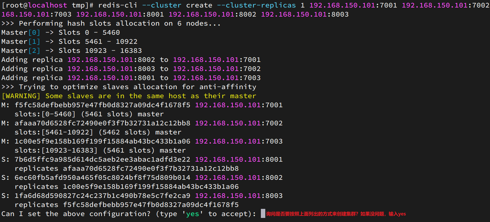</div>

这里输入 yes，则集群开始创建：

<div align="center"></div>


通过命令可以查看集群状态：

```sh
redis-cli -p 7001 cluster nodes
```

<div align="center"></div>

#### 测试

尝试连接 7001 节点，存储一个数据：

```sh
# 连接
redis-cli -p 7001
# 存储数据
set num 123
# 读取数据
get num
# 再次存储
set a 1
```

结果悲剧了：

<div align="center"></div>

集群操作时，需要给 `redis-cli` 加上 `-c` 参数才可以：

```sh
redis-cli -c -p 7001
```

这次可以了：

<div align="center"></div>

### 散列插槽

#### 插槽原理

Redis 会把每一个 master 节点映射到 0~16383 共 16384 个插槽（hash slot）上，查看集群信息时就能看到：

<div align="center"></div>

数据 key 不是与节点绑定，而是与插槽绑定。redis 会根据 key 的有效部分计算插槽值。<span style="color:red">简单说就是根据 key 的哈希映射判断，这个 key 存储在哪里。</span>

key 的有效部分分两种情况：

- key 中包含 "{}"，且 “{}” 中至少包含 1 个字符，“{}” 中的部分是有效部分
- key 中不包含 “{}”，整个 key 都是有效部分

例如：key 是 num，那么就根据 num 计算，如果是 {itcast} num，则根据 itcast 计算。计算方式是利用 CRC16 算法得到一个 hash 值，然后对 16384 取余，得到的结果就是 slot 值。

<div align="center"></div>

如图，在 7001 这个节点执行 set a 1 时，对 a 做 hash 运算，对 16384 取余，得到的结果是 15495，因此要存储到 103 节点。

到了 7003 后，执行 `get num` 时，对 num 做 hash 运算，对 16384 取余，得到的结果是 2765 插槽的范围不在 7003 内，而是在 7001 的插槽范围内，因此需要切换到 7001 节点。

为什么 Redis 的 key 要和插槽绑定而不是直接和 Redis 实例绑定呢？因为 Redis 的实例可能会宕机，key 直接和实例绑定的话，宕机了 key 就没有对应的实例了。如果和插槽绑定的话，插槽对应的实例是可以进行更替（更方便）的，数据跟着插槽走，永远都可以找到插槽的位置。

#### 小结

Redis 如何判断某个 key 应该在哪个实例？

- 将 16384 个插槽分配到不同的实例
- 根据 key 的有效部分计算哈希值，对 16384 取余
- 余数作为插槽，寻找插槽所在实例即可

如何将同一类数据固定的保存在同一个 Redis 实例？

- 这一类数据使用相同的有效部分，例如 key 都以 {typeId} 为前缀

  ```sh
  set {a}num 111 # 让他们拥有相同的有效部分
  ```

### 集群伸缩

redis-cli --cluster 提供了很多操作集群的命令，可以通过下面方式查看：

<div align="center"></div>

添加节点的命令

<div align="center">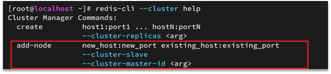</div>

#### 需求分析

需求：向集群中添加一个新的 master 节点，并向其中存储 num = 10

- 启动一个新的 redis 实例，端口为 7004
- 添加 7004 到之前的集群，并作为一个 master 节点
- 给 7004 节点分配插槽，使得 num 这个 key 可以存储到 7004 实例

这里需要两个新的功能：

- 添加一个节点到集群中
- 将部分插槽分配到新插槽

<b>创建 Redis 实例</b>

创建一个文件夹：

```sh
mkdir 7004
```

拷贝配置文件：

```sh
cp redis.conf /7004
```

修改配置文件：

```sh
sed /s/6379/7004/g 7004/redis.conf
```

启动

```sh
redis-server 7004/redis.conf
```

<b>添加新节点到 redis</b>

<div align="center"></div>

执行命令：

```sh
redis-cli --cluster add-node  192.168.150.101:7004 192.168.150.101:7001
```

通过命令查看集群状态：

```sh
redis-cli -p 7001 cluster nodes
```

如图，7004 加入了集群，并且默认是一个 master 节点：

<div align="center"></div>

但是，可以看到 7004 节点的插槽数量为 0，因此没有任何数据可以存储到 7004 上

<b>转移插槽</b>

我们要将 num 存储到 7004 节点，因此需要先看看 num 的插槽是多少：

<div align="center"></div>

如上图所示，num 的插槽为 2765.

我们可以将 0~3000 的插槽从 7001 转移到 7004，命令格式如下：

<div align="center"></div>

具体命令如下：

建立连接：

<div align="center"></div>

得到下面的反馈：

<div align="center"></div>

询问要移动多少个插槽，我们计划是 3000 个：

新的问题来了：

<div align="center"></div>

那个 node 来接收这些插槽？？

显然是 7004，那么 7004 节点的 id 是多少呢？

<div align="center"></div>

复制这个 id，然后拷贝到刚才的控制台后：

<div align="center"></div>

这里询问，你的插槽是从哪里移动过来的？

- all：代表全部，也就是三个节点各转移一部分
- 具体的 id：目标节点的 id
- done：没有了

这里我们要从 7001 获取，因此填写 7001 的 id：

<div align="center"></div>

填完后，点击 done，这样插槽转移就准备好了：

<div align="center"></div>

确认要转移吗？输入 yes：

然后，通过命令查看结果：

<div align="center"></div>

可以看到： 

<div align="center"></div>

目的达成。

### 故障转移

集群初识状态是这样的：

<div align="center"></div>

其中 7001、7002、7003 都是 master，我们计划让 7002 宕机。

#### 自动故障转移

当集群中有一个master宕机会发生什么呢？比如直接停止一个 redis 实例，例如 7002：

```sh
redis-cli -p 7002 shutdown
```

1）首先是该实例与其它实例失去连接

2）然后是疑似宕机：

<div align="center"></div>

3）最后是确定下线，自动提升一个 slave 为新的 master：

<div align="center"></div>

4）当 7002 再次启动，就会变为一个 slave 节点了：

<div align="center"></div>

#### 手动故障转移

利用 cluster failover 命令可以手动让集群中的某个 master 宕机，切换到执行 cluster failover 命令的这个 slave 节点，实现无感知的数据迁移。其流程如下：

<div align="center"></div>

这种 failover 命令可以指定三种模式：

- 缺省：默认的流程，如图 1~6 歩
- force：省略了对 offset 的一致性校验
- takeover：直接执行第 5 歩，忽略数据一致性、忽略 master 状态和其它 master 的意见

<b>案例需求</b>：在 7002 这个 slave 节点执行手动故障转移，重新夺回 master 地位。

步骤如下：

1）利用 redis-cli 连接 7002 这个节点

2）执行 cluster failover 命令

如图：

<div align="center"></div>

效果：

<div align="center"></div>

### RedisTemplate访问分片集群

RedisTemplate 底层同样基于 lettuce 实现了分片集群的支持，而使用的步骤与哨兵模式基本一致：

1）引入 redis 的 starter 依赖

2）配置分片集群地址

3）配置读写分离

与哨兵模式相比，其中只有分片集群的配置方式略有差异，如下：

```yaml
spring:
  redis:
    cluster:
      nodes:
        - 192.168.150.101:7001
        - 192.168.150.101:7002
        - 192.168.150.101:7003
        - 192.168.150.101:8001
        - 192.168.150.101:8002
        - 192.168.150.101:8003
```