# elasticsearch基础

- 了解 elasticsearch
- 索引库操作
- 文档操作
- RestAPI

## 了解ES

### elasticsearch的作用

elasticsearch 是一款非常强大的开源搜索引擎，具备非常多强大功能，可以帮助我们从海量数据中快速找到需要的内容

例如：

- 在 GitHub 搜索代码

<div align="center">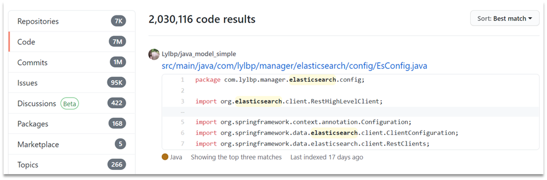</div>

- 在电商网站搜索商品


<div align="center"></div>

- 在百度搜索答案


<div align="center"></div>

- 在打车软件搜索附近的车


<div align="center"></div>

### ELK技术栈

elasticsearch 结合 kibana、Logstash、Beats，也就是 elastic stack（ELK）。被广泛应用在日志数据分析、实时监控等领域：

<div align="center"></div>

<span style="color:red">而 elasticsearch 是 elastic stack 的核心，负责存储、搜索、分析数据。</span>数据可视化，数据抓取都可以用其他替代，而 es 是整个 elastic stack 的核心。

<div align="center"></div>

### elasticsearch 和 lucene

elasticsearch 底层是基于 <b>lucene</b> 来实现的。

<b>Lucene</b> 是一个 Java 语言的搜索引擎类库，是 Apache 公司的顶级项目，由 DougCutting 于 1999 年研发。官网地址：https://lucene.apache.org/ 。

> Lucene 的优点

- 易扩展
- 高性能（基于倒排索引）

> Lucene 的缺点

- 只限于 Java 语义开发
- 学习曲线陡峭
- 不支持水平扩展

> <b>elasticsearch</b> 的发展历史：

- 2004 年 Shay Banon 基于 Lucene 开发了 Compass
- 2010 年 Shay Banon 重写了 Compass，取名为 Elasticsearch。
- 相对于 lucene 的优点
    - 支持分布式、可水平扩展
    - 支持 Restful 接口，可多语言使用
- 官网 https://www.elastic.co/cn/

### 为什么不是其他搜索技术？

目前比较知名的搜索引擎技术排名：

<div align="center"></div>

虽然在早期，Apache Solr 是最主要的搜索引擎技术，但随着发展 elasticsearch 已经渐渐超越了 Solr，独占鳌头：

<div align="center">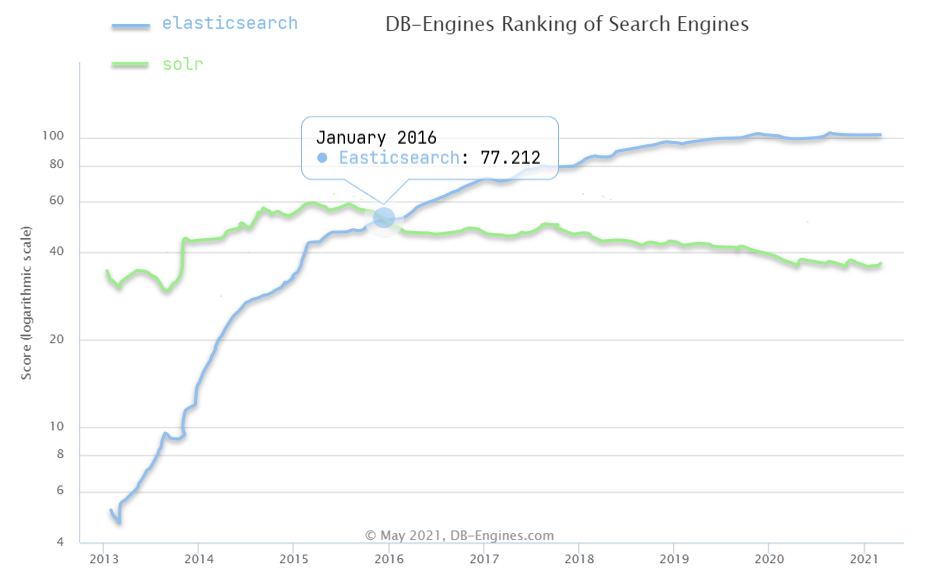</div>

### 总结

- elasticsearch：一个开源的分布式搜索引擎，可以用来实现搜索、日志统计、分析、系统监控等功能
- elastic stack（ELK）：以 elasticsearch 为核心的技术栈，包括 beats、Logstash、kibana、elasticsearch
- Lucene：Apache 的开源搜索引擎类库，提供了搜索引擎的核心 API

## 倒排索引

倒排索引的概念是基于 MySQL 这样的正向索引而言的。

### 正向索引

那么什么是正向索引呢？例如给下表（tb_goods）中的 id 创建索引：

<div align="center"></div>

如果是根据 id 查询，那么直接走索引，查询速度非常快。但如果是基于 title 做模糊查询，只能是逐行扫描数据，流程如下：

1）用户搜索数据，条件是 title 符合`"%手机%"`

2）逐行获取数据，比如 id 为 1 的数据

3）判断数据中的 title 是否符合用户搜索条件

4）如果符合则放入结果集，不符合则丢弃。回到步骤 1

逐行扫描，也就是全表扫描，随着数据量增加，其查询效率也会越来越低。当数据量达到数百万时，就是一场灾难。

### 倒排索引

倒排索引中有两个非常重要的概念：

- <span style="color:green">文档（Document）：用来搜索的数据</span>，其中的每一条数据就是一个文档。例如一个网页、一个商品信息
- <span style="color:green">词条（Term）：对文档数据或用户搜索数据，利用某种算法分词，得到的具备含义的词语就是词条</span>。例如：我是中国人，就可以分为：我、是、中国人、中国、国人这样的几个词条

<b>创建倒排索引</b>是对正向索引的一种特殊处理，流程如下：

- 将每一个文档的数据利用算法分词，得到一个个词条
- 创建表，每行数据包括词条、词条所在文档 id、位置等信息
- 因为词条唯一性，可以给词条创建索引，例如 hash 表结构索引

如图：

<div align="center"></div>

倒排索引的<b>搜索流程</b>如下（以搜索"华为手机"为例）：

1）用户输入条件`"华为手机"`进行搜索。

2）对用户输入内容<b>分词</b>，得到词条：`华为`、`手机`。

3）拿着词条在倒排索引中查找，可以得到包含词条的文档 id：1、2（由手机得到的文档 id）2、3（由华为得到的文档 id）。

4）拿着文档 id 到正向索引中查找具体文档。

如图：

<div align="center"></div>

虽然要先查询倒排索引，再查询倒排索引，但是无论是词条、还是文档id都建立了索引，查询速度非常快！无需全表扫描。

### 1.2.3.正向和倒排

那么为什么一个叫做正向索引，一个叫做倒排索引呢？

- <b>正向索引</b>是最传统的，根据id索引的方式。但根据词条查询时，必须先逐条获取每个文档，然后判断文档中是否包含所需要的词条，是<b>根据文档找词条的过程</b>。

- 而<b>倒排索引</b>则相反，是先找到用户要搜索的词条，根据词条得到保护词条的文档的id，然后根据id获取文档。是<b>根据词条找文档的过程</b>。

是不是恰好反过来了？那么两者方式的优缺点是什么呢？

<b>正向索引</b>：

- 优点：
    - 可以给多个字段创建索引
    - 根据索引字段搜索、排序速度非常快
- 缺点：
    - 根据非索引字段，或者索引字段中的部分词条查找时，只能全表扫描。

<b>倒排索引</b>：

- 优点：
    - 根据词条搜索、模糊搜索时，速度非常快
- 缺点：
    - 只能给词条创建索引，而不是字段
    - 无法根据字段做排序

## es的一些概念

elasticsearch 中有很多独有的概念，与 MySQL 中略有差别，但也有相似之处。

### 文档和字段

elasticsearch 是面向<b>文档（Document）</b>存储的，可以是数据库中的一条商品数据，一个订单信息。文档数据会被序列化为 json格式后存储在 elasticsearch 中：

<div align="center"></div>

而 Json 文档中往往包含很多的<b>字段（Field）</b>，类似于数据库中的列。

### 索引和映射

<b>索引（Index）</b>，就是相同类型的文档的集合。

例如：

- 所有用户文档，就可以组织在一起，称为用户的索引；
- 所有商品的文档，可以组织在一起，称为商品的索引；
- 所有订单的文档，可以组织在一起，称为订单的索引；

<div align="center"></div>

因此，我们可以把索引当做是数据库中的表。

数据库的表会有约束信息，用来定义表的结构、字段的名称、类型等信息。因此，索引库中就有<b>映射（mapping）</b>，是索引中文档的字段约束信息，类似表的结构约束。

### MySQL 与 elasticsearch

我们统一的把 MySQL 与 elasticsearch 的概念做一下对比：

| MySQL | Elasticsearch | 说明                                                     |
| --------- | ----------------- | ------------------------------------------------------------ |
| Table     | Index             | 索引(index)，就是文档的集合，类似数据库的表(table)           |
| Row       | Document          | 文档（Document），就是一条条的数据，类似数据库中的行（Row），文档都是JSON格式 |
| Column    | Field             | 字段（Field），就是JSON文档中的字段，类似数据库中的列（Column） |
| Schema    | Mapping           | Mapping（映射）是索引中文档的约束，例如字段类型约束。类似数据库的表结构（Schema） |
| SQL       | DSL               | DSL是elasticsearch提供的JSON风格的请求语句，用来操作elasticsearch，实现CRUD |

- MySQL：擅长事务类型操作，可以确保数据的安全和一致性

- Elasticsearch：擅长海量数据的搜索、分析、计算

往往是两者结合使用：

- 对安全性要求较高的写操作，使用 MySQL 实现
- 对查询性能要求较高的搜索需求，使用 elasticsearch 实现
- 两者再基于某种方式，实现数据的同步，保证一致性

<div align="center"></div>

## 安装es、kibana

参考资料：

<div align="center"></div>

### 总结

分词器的作用是什么？

- 创建倒排索引时对文档分词
- 用户搜索时，对输入的内容分词

IK 分词器有几种模式？

- ik_smart：智能切分，粗粒度
- ik_max_word：最细切分，细粒度

IK 分词器如何拓展词条？如何停用词条？

- 利用 config 目录的 IkAnalyzer.cfg.xml 文件添加拓展词典和停用词典
- 在词典中添加拓展词条或者停用词条

# 索引库操作

索引库就类似数据库表，mapping 映射就类似表的结构。

我们要向 es 中存储数据，必须先创建“库”和“表”。

## mapping 映射属性

mapping 是对索引库中文档的约束，常见的 mapping 属性包括：

- type：字段数据类型，常见的简单类型有：
    - 字符串：text（可分词的文本）、keyword（精确值，例如：品牌、国家、ip地址）
    - 数值：long、integer、short、byte、double、float、
    - 布尔：boolean
    - 日期：date
    - 对象：object
- index：是否创建索引，默认为 true
- analyzer：使用哪种分词器
- properties：该字段的子字段

例如下面的 json 文档：

```json
{
    "age": 21,
    "weight": 52.1,
    "isMarried": false,
    "info": "黑马程序员Java讲师",
    "email": "zy@itcast.cn",
    "score": [99.1, 99.5, 98.9],
    "name": {
        "firstName": "云",
        "lastName": "赵"
    }
}
```

对应的每个字段映射（mapping）：

- age：类型为 integer；参与搜索，因此需要 index 为 true；无需分词器
- weight：类型为 float；参与搜索，因此需要 index 为 true；无需分词器
- isMarried：类型为 boolean；参与搜索，因此需要 index 为 true；无需分词器
- info：类型为字符串，需要分词，因此是 text；参与搜索，因此需要 index 为 true；分词器可以用 ik_smart
- email：类型为字符串，但是不需要分词，因此是 keyword；不参与搜索，因此需要 index 为 false；无需分词器
- score：虽然是数组，但是我们只看元素的类型，类型为 float；参与搜索，因此需要 index 为 true；无需分词器
- name：类型为 object，需要定义多个子属性
    - name.firstName；类型为字符串，但是不需要分词，因此是 keyword；参与搜索，因此需要 index 为 true；无需分词器
    - name.lastName；类型为字符串，但是不需要分词，因此是 keyword；参与搜索，因此需要 index 为 true；无需分词器

## 索引库的 CRUD

这里我们统一使用 Kibana 编写 DSL 的方式来演示。

### 创建索引库和映射

#### 基本语法：

- 请求方式：PUT
- 请求路径：/索引库名，可以自定义
- 请求参数：mapping 映射

格式：

```json
PUT /索引库名称
{
  "mappings": { // 映射
    "properties": { // 具体字段
      "字段名":{
        "type": "text",
        "analyzer": "ik_smart" // 分词的方式
      },
      "字段名2":{
        "type": "keyword", // 
        "index": "false"
      },
      "字段名3":{
        "properties": {
          "子字段": {
            "type": "keyword"
          }
        }
      },
      // ...略
    }
  }
}
```

#### 示例：

```json
PUT /heima
{
  "mappings": { // 映射
    "properties": { // 包含的属性
      "info":{ // 信息字段
        "type": "text",
        "analyzer": "ik_smart" // 需要指定中文分词器
      },
      "email":{
        "type": "keyword",
        "index": "falsae" // 无需参与搜索
      },
      "name":{
        "type":"object",
        "properties": {
          "firstName": {
            "type": "keyword"
          }
        }
      },
      // ... 略
    }
  }
}
```

### 查询索引库

<b>基本语法</b>：

- 请求方式：GET

- 请求路径：/索引库名

- 请求参数：无

<b>格式</b>：

```
GET /索引库名
```

<b>示例</b>：

<div align="center"></div>

### 修改索引库

倒排索引结构虽然不复杂，但是一旦数据结构改变（比如改变了分词器），就需要重新创建倒排索引，这简直是灾难。因此索引库<b>一旦创建，无法修改 mapping</b>。

虽然无法修改 mapping 中已有的字段，但是却允许添加新的字段到 mapping 中，因为不会对倒排索引产生影响。

<b>语法说明</b>：

```json
PUT /索引库名/_mapping
{
  "properties": {
    "新字段名":{
      "type": "integer"
    }
  }
}
```

<b>示例</b>：

<div align="center">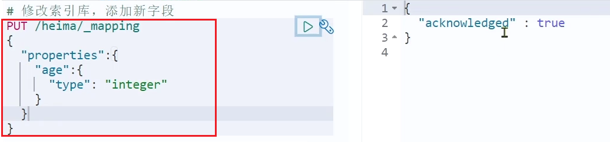</div>

### 删除索引库

<b>语法：</b>

- 请求方式：DELETE

- 请求路径：/索引库名

- 请求参数：无

<b>格式：</b>

```
DELETE /索引库名
```

在 kibana 中测试：

<div align="center"></div>

### 总结

索引库操作有哪些？

- 创建索引库：PUT /索引库名
- 查询索引库：GET /索引库名
- 删除索引库：DELETE /索引库名
- 添加字段：PUT /索引库名/_mapping

# 文档操作

## 新增文档

<b>语法：</b>

```json
POST /索引库名/_doc/文档id // _doc 是固定写法
{
    "字段1": "值1",
    "字段2": "值2",
    "字段3": {
        "子属性1": "值3",
        "子属性2": "值4"
    },
    // ...
}
```

<b>示例：</b>

```json
POST /heima/_doc/1
{
    "info": "黑马程序员Java讲师",
    "email": "zy@itcast.cn",
    "name": {
        "firstName": "云",
        "lastName": "赵"
    }
}
```

<b>响应：</b>

<div align="center"></div>

## 查询文档

根据 rest 风格，新增是 post，查询应该是 get，不过查询一般都需要条件，这里我们把文档 id 带上。

<b>语法：</b>

```json
GET /{索引库名称}/_doc/{id}
```

<b>通过kibana查看数据：</b>

```js
GET /heima/_doc/1
```

<b>查看结果：</b>

<div align="center"></div>

## 删除文档

删除使用 DELETE 请求，同样，需要根据 id 进行删除：

<b>语法：</b>

```json
DELETE /{索引库名}/_doc/id值
```

<b>示例：</b>

```json
# 根据id删除数据
DELETE /heima/_doc/1
```

<b>结果：</b>

<div align="center"></div>

## 修改文档

修改有两种方式：

- 全量修改：直接覆盖原来的文档（全部字段；删除原文档，把新文档插入）
- 增量修改：修改文档中的部分字段

### 全量修改

全量修改是覆盖原来的文档，其本质是：

- 根据指定的id删除文档
- 新增一个相同id的文档

<b>注意</b>：如果根据 id 删除时，id 不存在，第二步的新增也会执行，从修改变成了新增。

<b>语法：</b>

```json
PUT /{索引库名}/_doc/文档id
{    "字段1": "值1",    "字段2": "值2",    // ... 略}
```

<b>示例：<b>

```json
PUT /heima/_doc/1
{"info": "黑马程序员高级Java讲师","email": "zy@itcast.cn","name": {"firstName": "云","lastName": "赵"}}
```

### 增量修改

增量修改是只修改指定id匹配的文档中的部分字段。

<b>语法：</b>

```json
POST /{索引库名}/_update/文档id
{"doc": {"字段名": "新的值",}}
```

<b>示例：</b>

```json
POST /heima/_update/1
{
    "doc": {
        "email": "ZhaoYun@itcast.cn" // 只修改 email 这个局部字段
    }
}
```

## 总结

文档操作有哪些？

- 创建文档：POST /{索引库名}/_doc/文档id   { json文档 }
- 查询文档：GET /{索引库名}/_doc/文档id
- 删除文档：DELETE /{索引库名}/_doc/文档id
- 修改文档：
    - 全量修改：PUT /{索引库名}/_doc/文档id { json文档 }
    - 增量修改：POST /{索引库名}/_update/文档id { "doc": {字段}}

# RestAPI

ES 官方提供了各种不同语言的客户端，用来操作 ES。这些客户端的本质就是组装 DSL 语句，通过 http 请求发送给 ES。官方文档地址：https://www.elastic.co/guide/en/elasticsearch/client/index.html

其中的 Java Rest Client 又包括两种：

- Java Low Level Rest Client
- Java High Level Rest Client

<div align="center"></div>

我们学习的是 Java HighLevel Rest Client 客户端API

## 导入Demo工程

### 导入数据

首先导入课前资料提供的数据库数据：

<div align="center"></div> 

数据结构如下：

```sql
CREATE TABLE `tb_hotel` (  `id` bigint(20) NOT NULL COMMENT '酒店id',  `name` varchar(255) NOT NULL COMMENT '酒店名称；例：7天酒店',  `address` varchar(255) NOT NULL COMMENT '酒店地址；例：航头路',  `price` int(10) NOT NULL COMMENT '酒店价格；例：329',  `score` int(2) NOT NULL COMMENT '酒店评分；例：45，就是4.5分',  `brand` varchar(32) NOT NULL COMMENT '酒店品牌；例：如家',  `city` varchar(32) NOT NULL COMMENT '所在城市；例：上海',  `star_name` varchar(16) DEFAULT NULL COMMENT '酒店星级，从低到高分别是：1星到5星，1钻到5钻',  `business` varchar(255) DEFAULT NULL COMMENT '商圈；例：虹桥',  `latitude` varchar(32) NOT NULL COMMENT '纬度；例：31.2497',  `longitude` varchar(32) NOT NULL COMMENT '经度；例：120.3925',  `pic` varchar(255) DEFAULT NULL COMMENT '酒店图片；例:/img/1.jpg',  PRIMARY KEY (`id`)) ENGINE=InnoDB DEFAULT CHARSET=utf8mb4;
```

### 导入项目

然后导入课前资料提供的项目:

<div align="center"></div> 

项目结构如图：

<div align="center"></div>

### mapping映射分析

创建索引库，最关键的是 mapping 映射，而 mapping 映射要考虑的信息包括：

- 字段名
- 字段数据类型
- 是否参与搜索
- 是否需要分词
- 如果分词，分词器是什么？

其中：

- 字段名、字段数据类型，可以参考数据表结构的名称和类型
- 是否参与搜索要分析业务来判断，例如图片地址，就无需参与搜索
- 是否分词呢要看内容，内容如果是一个整体就无需分词，反之则要分词
- 分词器，我们可以统一使用 ik_max_word

来看下酒店数据的索引库结构:

```json
PUT /hotel{  "mappings": {"properties": {"id": { "type": "keyword"}, "name":{"type": "text","analyzer": "ik_max_word","copy_to": "all"},"address":{"type": "keyword", "index": false},"price":{"type": "integer"},"score":{"type": "integer"},"brand":{"type": "keyword","copy_to": "all"      },      "city":{        "type": "keyword",        "copy_to": "all"      },      "starName":{        "type": "keyword"      },      "business":{        "type": "keyword"      },      "location":{        "type": "geo_point"      },      "pic":{        "type": "keyword",        "index": false      },      "all":{        "type": "text",        "analyzer": "ik_max_word"      }    }  }}
```

几个特殊字段说明：

- location：地理坐标，里面包含精度、纬度
- all：一个组合字段，其目的是将多字段的值 利用 copy_to 合并，提供给用户搜索

地理坐标说明：

<div align="center"></div>

copy_to 说明：

<div align="center"></div>

### 初始化 RestClient

在 elasticsearch 提供的 API 中，与 elasticsearch 一切交互都封装在一个名为 RestHighLevelClient 的类中，必须先完成这个对象的初始化，建立与 elasticsearch 的连接。

分为三步：

1）引入 es 的 RestHighLevelClient 依赖：

```xml
<dependency>
    <groupId>org.elasticsearch.client</groupId>
    <artifactId>elasticsearch-rest-high-level-client</artifactId>
</dependency>
```

<span style="color:red">2）因为 Spring Boot 默认的 ES 版本是 7.6.2，所以我们需要覆盖默认的 ES 版本：</span>

```xml
<properties>
    <java.version>1.8</java.version>
    <elasticsearch.version>7.12.1</elasticsearch.version>
</properties>
```

3）初始化 RestHighLevelClient：

初始化的代码如下：

```java
RestHighLevelClient client = new RestHighLevelClient(RestClient.builder(HttpHost.create("http://192.168.150.101:9200")));
```

这里为了单元测试方便，我们创建一个测试类 HotelIndexTest，然后将初始化的代码编写在 @BeforeEach 方法中：

```java
package cn.itcast.hotel;
import org.apache.http.HttpHost;
import org.elasticsearch.client.RestHighLevelClient;
import org.junit.jupiter.api.AfterEach;
import org.junit.jupiter.api.BeforeEach;
import org.junit.jupiter.api.Test;
import java.io.IOException;

public class HotelIndexTest {    
    private RestHighLevelClient client;  
    
    @BeforeEach    
    void setUp() {        
        this.client = new RestHighLevelClient(RestClient.builder(
            HttpHost.create("http://192.168.150.101:9200") // 可以指定多个地址，如果是集群的话。
        ));
    }
    
    @AfterEach void tearDown() throws IOException {
        this.client.close();    
    }
}
```

## 创建索引库

### 代码解读

创建索引库的API如下：

<div align="center"></div>

代码分为三步：

- 1）创建 Request 对象。因为是创建索引库的操作，因此 Request 是 CreateIndexRequest。
- 2）添加请求参数，其实就是DSL的JSON参数部分。因为 json 字符串很长，这里是定义了静态字符串常量MAPPING_TEMPLATE，让代码看起来更加优雅。
- 3）发送请求，client.indices() 方法的返回值是 IndicesClient 类型，封装了所有与索引库操作有关的方法。

### 完整示例

在 hotel-demo 的 cn.itcast.hotel.constants 包下，创建一个类，定义 mapping 映射的 JSON 字符串常量：

```java
package cn.itcast.hotel.constants;
public class HotelConstants {    
    public static final String MAPPING_TEMPLATE = "{\n" 
        +            "  \"mappings\": {\n" 
        +            "    \"properties\": {\n" 
        +            "      \"id\": {\n" 
        +            "        \"type\": \"keyword\"\n" 
        +            "      },\n" 
        +            "      \"name\":{\n" 
        +            "        \"type\": \"text\",\n" 
        +            "        \"analyzer\": \"ik_max_word\",\n" 
        +            "        \"copy_to\": \"all\"\n" 
        +            "      },\n" 
        +            "      \"address\":{\n" 
        +            "        \"type\": \"keyword\",\n" 
        +            "        \"index\": false\n" 
        +            "      },\n" 
        +            "      \"price\":{\n" 
        +            "        \"type\": \"integer\"\n" 
        +            "      },\n" 
        +            "      \"score\":{\n" 
        +            "        \"type\": \"integer\"\n" 
        +            "      },\n" 
        +            "      \"brand\":{\n" 
        +            "        \"type\": \"keyword\",\n" 
        +            "        \"copy_to\": \"all\"\n" 
        +            "      },\n" 
        +            "      \"city\":{\n" 
        +            "        \"type\": \"keyword\",\n" 
        +            "        \"copy_to\": \"all\"\n" 
        +            "      },\n" 
        +            "      \"starName\":{\n" 
        +            "        \"type\": \"keyword\"\n" 
        +            "      },\n" 
        +            "      \"business\":{\n" 
        +            "        \"type\": \"keyword\"\n" 
        +            "      },\n" 
        +            "      \"location\":{\n" 
        +            "        \"type\": \"geo_point\"\n" 
        +            "      },\n" 
        +            "      \"pic\":{\n" 
        +            "        \"type\": \"keyword\",\n" 
        +            "        \"index\": false\n" 
        +            "      },\n" 
        +            "      \"all\":{\n" 
        +            "        \"type\": \"text\",\n" 
        +            "        \"analyzer\": \"ik_max_word\"\n" 
        +            "      }\n" 
        +            "    }\n" 
        +            "  }\n" 
        +            "}";
}
```

在 hotel-demo 中的 HotelIndexTest 测试类中，编写单元测试，实现创建索引：

```java
@Test
void createHotelIndex() throws IOException {    
    // 1.创建Request对象    
    CreateIndexRequest request = new CreateIndexRequest("hotel");    
    // 2.准备请求的参数：DSL语句    
    request.source(MAPPING_TEMPLATE, XContentType.JSON);  // 数据、数据类型   
    // 3.发送请求    
    client.indices().create(request, RequestOptions.DEFAULT);
}
```

## 删除索引库

删除索引库的DSL语句非常简单：

```json
DELETE /hotel
```

与创建索引库相比：

- 请求方式从 PUT 变为 DELTE
- 请求路径不变
- 无请求参数

所以代码的差异，注意体现在 Request 对象上。依然是三步走：

- 1）创建 Request 对象。这次是 DeleteIndexRequest 对象
- 2）准备参数。这里是无参
- 3）发送请求。改用 delete 方法

在 hotel-demo 中的 HotelIndexTest 测试类中，编写单元测试，实现删除索引：

```java
@Test
void testDeleteHotelIndex() throws IOException {    
    // 1.创建Request对象    
    DeleteIndexRequest request = new DeleteIndexRequest("hotel");    
    // 2.发送请求    
    client.indices().delete(request, RequestOptions.DEFAULT);
}
```

## 判断索引库是否存在

判断索引库是否存在，本质就是查询，对应的DSL是：

```json
GET /hotel
```

因此与删除的Java代码流程是类似的。依然是三步走：

- 1）创建 Request 对象。这次是 GetIndexRequest 对象
- 2）准备参数。这里是无参
- 3）发送请求。改用 exists 方法

```java
@Test
void testExistsHotelIndex() throws IOException {    
    // 1.创建Request对象    
    GetIndexRequest request = new GetIndexRequest("hotel");    
    // 2.发送请求    
    boolean exists = client.indices().exists(request, RequestOptions.DEFAULT);    
    // 3.输出    
    System.err.println(exists ? "索引库已经存在！" : "索引库不存在！");
}
```

## 总结

JavaRestClient 操作 elasticsearch 的流程基本类似。核心是 client.indices() 方法来获取索引库的操作对象。

索引库操作的基本步骤：

- 初始化 RestHighLevelClient
- 创建 XxxIndexRequest。XXX 是 Create、Get、Delete
- 准备 DSL（ Create 时需要，其它是无参）
- 发送请求。调用 RestHighLevelClient#indices().xxx() 方法，xxx 是 create、exists、delete

<span style="color:red">es 难在如何定义 mapping，如何根据业务写逻辑，需要好好分析下才行。</span>

# RestClient 操作文档

为了与索引库操作分离，我们再次参加一个测试类，做两件事情：

- 初始化 RestHighLevelClient
- 我们的酒店数据在数据库，需要利用 IHotelService 去查询，所以注入这个接口

```java
package cn.itcast.hotel;
import cn.itcast.hotel.pojo.Hotel;
import cn.itcast.hotel.service.IHotelService;
import org.junit.jupiter.api.AfterEach;
import org.junit.jupiter.api.BeforeEach;
import org.junit.jupiter.api.Test;
import org.springframework.beans.factory.annotation.Autowired;
import org.springframework.boot.test.context.SpringBootTest;
import java.io.IOException;
import java.util.List;@SpringBootTestpublic 
class HotelDocumentTest {    
    @Autowired    
    private IHotelService hotelService;    
    private RestHighLevelClient client;
    
    @BeforeEach    
    void setUp() {        
        this.client = new RestHighLevelClient(RestClient.builder(HttpHost.create("http://192.168.150.101:9200")));    
    }    
    
    @AfterEach    
    void tearDown() throws IOException {        
        this.client.close();    
    }
}
```

## 新增文档

我们要将数据库的酒店数据查询出来，写入 elasticsearch 中。

### 索引库实体类

数据库查询后的结果是一个 Hotel 类型的对象。结构如下：

```java
@Data
@TableName("tb_hotel")
public class Hotel {    
    @TableId(type = IdType.INPUT)    
    private Long id;    
    private String name;    
    private String address;    
    private Integer price;    
    private Integer score;    
    private String brand;    
    private String city;    
    private String starName;    
    private String business;    
    private String longitude;    
    private String latitude;    
    private String pic;
}
```

与我们的索引库结构存在差异：

- longitude 和 latitude 需要合并为 location

因此，我们需要定义一个新的类型，与索引库结构吻合：

```java
package cn.itcast.hotel.pojo;
import lombok.Data;
import lombok.NoArgsConstructor;@Data@NoArgsConstructorpublic 
class HotelDoc {    
    private Long id;    
    private String name;    
    private String address;    
    private Integer price;    
    private Integer score;   
    private String brand;    
    private String city;    
    private String starName;  
    private String business;  
    private String location;  
    private String pic;   
    public HotelDoc(Hotel hotel) {        
        this.id = hotel.getId();        
        this.name = hotel.getName();        
        this.address = hotel.getAddress();        
        this.price = hotel.getPrice();        
        this.score = hotel.getScore();        
        this.brand = hotel.getBrand();        
        this.city = hotel.getCity();        
        this.starName = hotel.getStarName();        
        this.business = hotel.getBusiness();        
        this.location = hotel.getLatitude() + ", " + hotel.getLongitude();        
        this.pic = hotel.getPic();    
    }
}
```

### 语法说明

新增文档的 DSL 语句如下：

```json
POST /{索引库名}/_doc/1{    "name": "Jack",    "age": 21}
```

对应的java代码如图：

<div align="center"></div>

可以看到与创建索引库类似，同样是三步走：

- 1）创建 Request 对象
- 2）准备请求参数，也就是 DSL 中的 JSON 文档
- 3）发送请求

变化的地方在于，这里直接使用 client.xxx() 的 API，不再需要 client.indices() 了。

### 完整代码

我们导入酒店数据，基本流程一致，但是需要考虑几点变化：

- 酒店数据来自于数据库，我们需要先查询出来，得到 hotel 对象
- hotel 对象需要转为 HotelDoc 对象
- HotelDoc 需要序列化为 json 格式

因此，代码整体步骤如下：

- 1）根据 id 查询酒店数据 Hotel
- 2）将 Hotel 封装为 HotelDoc
- 3）将 HotelDoc 序列化为 JSON
- 4）创建 IndexRequest，指定索引库名和 id
- 5）准备请求参数，也就是 JSON 文档
- 6）发送请求

在 hotel-demo 的 HotelDocumentTest 测试类中，编写单元测试：

```java
@Test
void testAddDocument() throws IOException {    
    // 1.根据id查询酒店数据    
    Hotel hotel = hotelService.getById(61083L);    
    // 2.转换为文档类型    
    HotelDoc hotelDoc = new HotelDoc(hotel);   
    // 3.将HotelDoc转json    
    String json = JSON.toJSONString(hotelDoc);    
    // 1.准备Request对象    
    IndexRequest request = new IndexRequest("hotel").id(hotelDoc.getId().toString());    
    // 2.准备Json文档    
    request.source(json, XContentType.JSON);    
    // 3.发送请求    
    client.index(request, RequestOptions.DEFAULT);
}
```

## 查询文档

### 语法说明

查询的 DSL 语句如下：

```json
GET /hotel/_doc/{id}
```

非常简单，因此代码大概分两步：

- 准备 Request 对象
- 发送请求

不过查询的目的是得到结果，解析为HotelDoc，因此难点是结果的解析。完整代码如下：

<div align="center"></div>

可以看到，结果是一个 JSON，其中文档放在一个 `_source` 属性中，因此解析就是拿到 `_source` ，反序列化为 Java 对象即可。

与之前类似，也是三步走：

- 1）准备 Request 对象。这次是查询，所以是 GetRequest
- 2）发送请求，得到结果。因为是查询，这里调用 client.get() 方法
- 3）解析结果，就是对 JSON 做反序列化

### 完整代码

在 hotel-demo 的 HotelDocumentTest 测试类中，编写单元测试：

```java
@Test
void testGetDocumentById() throws IOException {    
    // 1.准备Request   
    GetRequest request = new GetRequest("hotel", "61082");  
    // 2.发送请求，得到响应   
    GetResponse response = client.get(request, RequestOptions.DEFAULT); 
    // 3.解析响应结果    
    String json = response.getSourceAsString();   
    HotelDoc hotelDoc = JSON.parseObject(json, HotelDoc.class);  
    System.out.println(hotelDoc);
}
```

## 删除文档

删除的 DSL 为是这样的：

```json
DELETE /hotel/_doc/{id}
```

与查询相比，仅仅是请求方式从 DELETE 变成 GET，可以想象 Java 代码应该依然是三步走：

- 1）准备 Request 对象，因为是删除，这次是 DeleteRequest 对象。要指定索引库名和 id
- 2）准备参数，无参
- 3）发送请求。因为是删除，所以是 client.delete() 方法

在 hotel-demo 的 HotelDocumentTest 测试类中，编写单元测试：

```java
@Test
void testDeleteDocument() throws IOException {   
    // 1.准备Request    
    DeleteRequest request = new DeleteRequest("hotel", "61083");  
    // 2.发送请求    
    client.delete(request, RequestOptions.DEFAULT);
}
```

## 修改文档

### 语法说明

修改我们讲过两种方式：

- 全量修改：本质是先根据 id 删除，再新增
- 增量修改：修改文档中的指定字段值

在 RestClient 的 API 中，全量修改与新增的 API 完全一致，判断依据是 ID：

- 如果新增时，ID 已经存在，则修改
- 如果新增时，ID 不存在，则新增

这里不再赘述，我们主要关注增量修改。

代码示例如图：

<div align="center"></div>

与之前类似，也是三步走：

- 1）准备 Request 对象。这次是修改，所以是 UpdateRequest
- 2）准备参数。也就是 JSON 文档，里面包含要修改的字段
- 3）更新文档。这里调用 client.update() 方法

### 完整代码

在 hotel-demo 的 HotelDocumentTest 测试类中，编写单元测试：

```java
@Test
void testUpdateDocument() throws IOException {    
    // 1.准备Request    
    UpdateRequest request = new UpdateRequest("hotel", "61083");   
    // 2.准备请求参数    
    request.doc( "price", "952","starName", "四钻");   
    // 3.发送请求    
    client.update(request, RequestOptions.DEFAULT);
}
```

## 批量导入文档

案例需求：利用 BulkRequest 批量将数据库数据导入到索引库中。

步骤如下：

- 利用 mybatis-plus 查询酒店数据

- 将查询到的酒店数据（Hotel）转换为文档类型数据（HotelDoc）

- 利用 JavaRestClient 中的 BulkRequest 批处理，实现批量新增文档

### 语法说明

批量处理 BulkRequest，其本质就是将多个普通的 CRUD 请求组合在一起发送。

其中提供了一个 add 方法，用来添加其他请求：

<div align="center"></div>

可以看到，能添加的请求包括：

- IndexRequest，也就是新增
- UpdateRequest，也就是修改
- DeleteRequest，也就是删除

因此 Bulk 中添加了多个 IndexRequest，就是批量新增功能了。示例：

<div align="center"></div>

其实还是三步走：

- 1）创建 Request 对象。这里是 BulkRequest
- 2）准备参数。批处理的参数，就是其它 Request 对象，这里就是多个 IndexRequest
- 3）发起请求。这里是批处理，调用的方法为 client.bulk() 方法

我们在导入酒店数据时，将上述代码改造成 for 循环处理即可。

### 完整代码

在 hotel-demo 的 HotelDocumentTest 测试类中，编写单元测试：

```java
@Test
void testBulkRequest() throws IOException {    
    // 批量查询酒店数据    
    List<Hotel> hotels = hotelService.list();    
    // 1.创建Request    
    BulkRequest request = new BulkRequest();    
    // 2.准备参数，添加多个新增的Request    
    for (Hotel hotel : hotels) {        
        // 2.1.转换为文档类型HotelDoc        
        HotelDoc hotelDoc = new HotelDoc(hotel);        
        // 2.2.创建新增文档的Request对象        
        request.add(new IndexRequest("hotel").id(hotelDoc.getId().toString())
                    .source(JSON.toJSONString(hotelDoc), XContentType.JSON));    
    }    
    // 3.发送请求    
    client.bulk(request, RequestOptions.DEFAULT);
}
```

## 小结

文档操作的基本步骤：

- 初始化 RestHighLevelClient
- 创建 XxxRequest。XXX 是 Index、Get、Update、Delete、Bulk
- 准备参数（Index、Update、Bulk 时需要）
- 发送请求。调用 RestHighLevelClient#.xxx() 方法，xxx 是 index、get、update、delete、bulk
- 解析结果（Get 时需要）

# DSL查询文档

elasticsearch 的数据搜索功能。分别使用 <b>DSL</b> 和 <b>RestClient</b> 实现搜索。

elasticsearch 的查询依然是基于 JSON 风格的 DSL 来实现的。

## DSL查询分类

Elasticsearch 提供了基于 JSON 的 DSL（[Domain Specific Language](https://www.elastic.co/guide/en/elasticsearch/reference/current/query-dsl.html)）来定义查询。常见的查询类型包括：

- <b>查询所有</b>：查询出所有数据，一般测试用，不加条件限制的查询，实际上还是会有一个分页的限制，一次查多少条数据。例如：match_all

- <b>全文检索（full text）查询</b>：利用分词器对用户输入内容分词，得到词条，然后去倒排索引库中匹配。例如：
    - match_query
    - multi_match_query
- <b>精确查询</b>：根据精确词条值查找数据，一般是查找 keyword、数值、日期、boolean 等类型字段（这些字段无需分词）。例如：
    - ids
    - range
    - term
- <b>地理（geo）查询</b>：根据经纬度查询。例如：
    - geo_distance
    - geo_bounding_box
- <b>复合（compound）查询</b>：复合查询可以将上述各种查询条件组合起来，合并查询条件。例如：
    - bool
    - function_score

查询的语法基本一致：

```json
GET /indexName/_search
{
  "query": {
    "查询类型": {
      "查询条件": "条件值"
    }
  }
}
```

我们以查询所有为例，其中：

- 查询类型为 match_all
- 没有查询条件

```json
// 查询所有
// GET 请求; 索引库名称 indexName; _search 固定写法
GET /indexName/_search
{
  "query": {
    "match_all": {
    }
  }
}
```

其它查询无非就是<b>查询类型</b>、<b>查询条件</b>的变化。

## 全文检索查询

### 使用场景

全文检索查询的基本流程如下：

- 对用户搜索的内容做分词，得到词条
- 根据词条去倒排索引库中匹配，得到文档 id
- 根据文档 id 找到文档，返回给用户

比较常用的场景包括：

- 商城的输入框搜索
- 百度输入框搜索

例如京东：

<div align="center"></div>

因为是拿着词条去匹配，因此参与搜索的字段也必须是可分词的 text 类型的字段。

### 基本语法

常见的全文检索查询包括：

- match 查询：单字段查询
- multi_match 查询：多字段查询，任意一个字段符合条件就算符合查询条件

match 查询语法如下：

```json
GET /indexName/_search
{
  "query": {
    "match": {
      "FIELD": "TEXT"
    }
  }
}
```

mulit_match 语法如下：

```json
GET /indexName/_search
{
  "query": {
    "multi_match": {
      "query": "TEXT",
      "fields": ["FIELD1", " FIELD12"]
    }
  }
}
```

### 示例

match 查询示例：

<div align="center">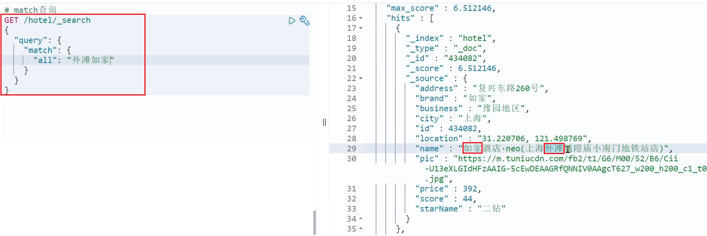</div>

multi_match 查询示例：

<div align="center"></div>

可以看到，两种查询结果是一样的，为什么？

因为我们将 brand、name、business 值都利用 copy_to 复制到了 all 字段中。因此你根据三个字段搜索，和根据 all 字段搜索效果当然一样了。

但是，搜索字段越多，对查询性能影响越大，因此建议采用 copy_to，然后单字段查询的方式。（<span style="color:red">性能为什么更好，不是很理解</span>）

### 总结

match 和 multi_match 的区别是什么？

- match：根据一个字段查询
- multi_match：根据多个字段查询，参与查询字段越多，查询性能越差

## 精准查询

精确查询一般是查找 keyword、数值、日期、boolean 等类型字段。所以<b>不会</b>对搜索条件分词。常见的有：

- term：根据词条精确值查询
- range：根据值的范围查询

### term查询

<span style="color:red">因为精确查询的字段搜是不分词的字段，因此查询的条件也必须是<b>不分词<b>的词条。</span>查询时，用户输入的内容跟自动值完全匹配时才认为符合条件。如果用户输入的内容过多，反而搜索不到数据。

语法说明：

```json
// term查询
GET /indexName/_search
{
  "query": {
    "term": {
      "FIELD": {
        "value": "VALUE"
      }
    }
  }
}
```

示例：

当我搜索的是精确词条时，能正确查询出结果：

<div align="center"></div>

但是，当我搜索的内容不是词条，而是多个词语形成的短语时，反而搜索不到：

<div align="center">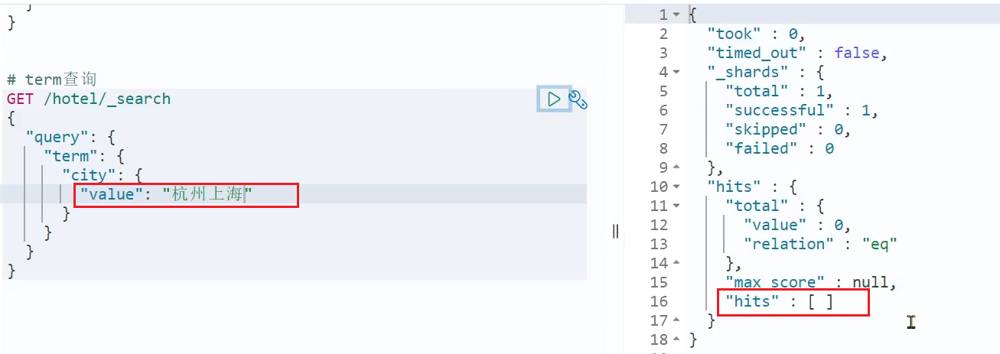</div>

### 1.3.2.range查询

范围查询，一般应用在对数值类型做范围过滤的时候。比如做价格范围过滤。

基本语法：

```json
// range查询
GET /indexName/_search
{
  "query": {
    "range": {
      "FIELD": {
        "gte": 10, // 这里的gte代表大于等于，gt则代表大于
        "lte": 20 // lte代表小于等于，lt则代表小于
      }
    }
  }
}
```

示例：

<div align="center"></div>

### 总结

精确查询常见的有哪些？

- term 查询：根据词条精确匹配，一般搜索 keyword 类型、数值类型、布尔类型、日期类型字段
- range 查询：根据数值范围查询，可以是数值、日期的范围

## 地理坐标查询

所谓的地理坐标查询，其实就是根据经纬度查询，官方文档：https://www.elastic.co/guide/en/elasticsearch/reference/current/geo-queries.html

常见的使用场景包括：

- 携程：搜索我附近的酒店
- 滴滴：搜索我附近的出租车
- 微信：搜索我附近的人

附近的酒店：

<div align="center"></div>

附近的车：

<div align="center"></div>

### 矩形范围查询

矩形范围查询，也就是 geo_bounding_box 查询，查询坐标落在某个矩形范围的所有文档：

<div align="center">

查询时，需要指定矩形的<b>左上</b>、<b>右下</b>两个点的坐标，然后画出一个矩形，落在该矩形内的都是符合条件的点。

语法如下：

```json
// geo_bounding_box查询
GET /indexName/_search
{
  "query": {
    "geo_bounding_box": {
      "FIELD": {
        "top_left": { // 左上点
          "lat": 31.1,
          "lon": 121.5
        },
        "bottom_right": { // 右下点
          "lat": 30.9,
          "lon": 121.7
        }
      }
    }
  }
}
```

这种并不符合“附近的人”这样的需求，所以我们就不做了。

### 1.4.2.附近查询

附近查询，也叫做距离查询（geo_distance）：查询到指定中心点小于某个距离值的所有文档。

换句话来说，在地图上找一个点作为圆心，以指定距离为半径，画一个圆，落在圆内的坐标都算符合条件：

<div align="center">

语法说明：

```json
// geo_distance 查询
GET /indexName/_search
{
  "query": {
    "geo_distance": {
      "distance": "15km", // 半径
      "FIELD": "31.21,121.5" // 圆心
    }
  }
}
```

示例：

我们先搜索陆家嘴附近 15km 的酒店：

<div align="center"></div>

发现共有 47 家酒店。

然后把半径缩短到 3 公里：

<div align="center"></div>

可以发现，搜索到的酒店数量减少到了5家。

## 复合查询

复合（compound）查询：复合查询可以将其它简单查询组合起来，实现更复杂的搜索逻辑。常见的有两种：

- fuction score：算分函数查询，可以控制文档相关性算分，控制文档排名
- bool query：布尔查询，利用逻辑关系组合多个其它的查询，实现复杂搜索

### 相关性算分

当我们利用 match 查询时，文档结果会根据与搜索词条的关联度打分（_score），返回结果时按照分值降序排列。

例如，我们搜索 "虹桥如家"，结果如下：

```json
[  {    "_score" : 17.850193,    "_source" : {      "name" : "虹桥如家酒店真不错",    }  },  {    "_score" : 12.259849,    "_source" : {      "name" : "外滩如家酒店真不错",    }  },  {    "_score" : 11.91091,    "_source" : {      "name" : "迪士尼如家酒店真不错",    }  }]
```

在 elasticsearch 中，早期使用的打分算法是 TF-IDF 算法，公式如下：

<div align="center"></div>

在后来的 5.1 版本升级中，elasticsearch 将算法改进为 BM25 算法，公式如下：

<div align="center"></div>

TF-IDF 算法有一各缺陷，就是词条频率越高，文档得分也会越高，单个词条对文档影响较大。而 BM25 则会让单个词条的算分有一个上限，曲线更加平滑：

<div align="center"></div>

小结：elasticsearch 会根据词条和文档的相关度做打分，算法由两种：

- TF-IDF 算法
- BM25 算法，elasticsearch5.1 版本后采用的算法

### 算分函数查询

根据相关度打分是比较合理的需求，但<b>合理的不一定是产品经理需要</b>的。

以百度为例，你搜索的结果中，并不是相关度越高排名越靠前，而是谁掏的钱多排名就越靠前。如图：

<div align="center"></div>

要想认为控制相关性算分，就需要利用 elasticsearch 中的 function score 查询了。

#### 1）语法说明

<div align="center"></div>

function score 查询中包含四部分内容：

- <b>原始查询</b>条件：query 部分，基于这个条件搜索文档，并且基于 BM25 算法给文档打分，<b>原始算分</b>（query score)
- <b>过滤条件</b>：filter 部分，符合该条件的文档才会重新算分
- <b>算分函数</b>：符合 filter 条件的文档要根据这个函数做运算，得到的<b>函数算分</b>（function score），有四种函数
    - weight：函数结果是常量
    - field_value_factor：以文档中的某个字段值作为函数结果
    - random_score：以随机数作为函数结果
    - script_score：自定义算分函数算法
- <b>运算模式</b>：算分函数的结果、原始查询的相关性算分，两者之间的运算方式，包括：
    - multiply：相乘
    - replace：用 function score 替换 query score
    - 其它，例如：sum、avg、max、min

function score 的运行流程如下：

- 1）根据<b>原始条件</b>查询搜索文档，并且计算相关性算分，称为<b>原始算分</b>（query score）
- 2）根据<b>过滤条件</b>，过滤文档
- 3）符合<b>过滤条件</b>的文档，基于<b>算分函数</b>运算，得到<b>函数算分</b>（function score）
- 4）将<b>原始算分</b>（query score）和<b>函数算分</b>（function score）基于<b>运算模式</b>做运算，得到最终结果，作为相关性算分。

因此，其中的关键点是：

- 过滤条件：决定哪些文档的算分被修改
- 算分函数：决定函数算分的算法
- 运算模式：决定最终算分结果

#### 2）示例

需求：给“如家”这个品牌的酒店排名靠前一些

翻译一下这个需求，转换为之前说的四个要点：

- 原始条件：不确定，可以任意变化
- 过滤条件：brand = "如家"
- 算分函数：可以简单粗暴，直接给固定的算分结果，weight
- 运算模式：比如求和

因此最终的DSL语句如下：

```json
GET /hotel/_search{  "query": {    "function_score": {      "query": {  .... }, // 原始查询，可以是任意条件      "functions": [ // 算分函数        {          "filter": { // 满足的条件，品牌必须是如家            "term": {              "brand": "如家"            }          },          "weight": 2 // 算分权重为2        }      ],      "boost_mode": "sum" // 加权模式，求和    }  }}
```

测试，在未添加算分函数时，如家得分如下：

<div align="center"></div>

添加了算分函数后，如家得分就提升了：

<div align="center"></div>

#### 3）小结

function score query 定义的三要素是什么？

- 过滤条件：哪些文档要加分
- 算分函数：如何计算 function score
- 加权方式：function score 与 query score 如何运算

### 布尔查询

布尔查询是一个或多个查询子句的组合，每一个子句就是一个<b>子查询</b>。子查询的组合方式有：

- must：必须匹配每个子查询，类似“与”
- should：选择性匹配子查询，类似“或”
- must_not：必须不匹配，<b>不参与算分</b>，类似“非”
- filter：必须匹配，<b>不参与算分</b>

比如在搜索酒店时，除了关键字搜索外，我们还可能根据品牌、价格、城市等字段做过滤：

<div align="center"></div>

每一个不同的字段，其查询的条件、方式都不一样，必须是多个不同的查询，而要组合这些查询，就必须用 bool 查询了。

需要注意的是，搜索时，参与<b>打分的字段越多，查询的性能也越差</b>。因此这种多条件查询时，建议这样做：

- 搜索框的关键字搜索，是全文检索查询，使用must查询，参与算分
- 其它过滤条件，采用filter查询。不参与算分

#### 1）语法示例：

```json
GET /hotel/_search{  "query": {    "bool": {      "must": [        {"term": {"city": "上海" }}      ],      "should": [        {"term": {"brand": "皇冠假日" }},        {"term": {"brand": "华美达" }}      ],      "must_not": [        { "range": { "price": { "lte": 500 } }}      ],      "filter": [        { "range": {"score": { "gte": 45 } }}      ]    }  }}
```

#### 2）示例

需求：搜索名字包含“如家”，价格不高于400，在坐标31.21,121.5周围10km范围内的酒店。

分析：

- 名称搜索，属于全文检索查询，应该参与算分。放到 must 中
- 价格不高于 400，用 range 查询，属于过滤条件，不参与算分。放到 must_not 中
- 周围 10km 范围内，用 geo_distance 查询，属于过滤条件，不参与算分。放到 filter 中

<div align="center"></div>

#### 3）小结

bool查询有几种逻辑关系？

- must：必须匹配的条件，可以理解为“与”
- should：选择性匹配的条件，可以理解为“或”
- must_not：必须不匹配的条件，不参与打分
- filter：必须匹配的条件，不参与打分

# 搜索结果处理

搜索的结果可以按照用户指定的方式去处理或展示。

## 排序

elasticsearch 默认是根据相关度算分（_score）来排序，但是也支持自定义方式对搜索[结果排序](https://www.elastic.co/guide/en/elasticsearch/reference/current/sort-search-results.html)。可以排序字段类型有：keyword 类型、数值类型、地理坐标类型、日期类型等。

### 普通字段排序

keyword、数值、日期类型排序的语法基本一致。

<b>语法</b>：

```json
GET /indexName/_search{  "query": {    "match_all": {}  },  "sort": [    {      "FIELD": "desc"  // 排序字段、排序方式ASC、DESC    }  ]}
```

排序条件是一个数组，也就是可以写多个排序条件。按照声明的顺序，当第一个条件相等时，再按照第二个条件排序，以此类推

<b>示例</b>：

需求描述：酒店数据按照用户评价 (score) 降序排序，评价相同的按照价格 (price) 升序排序

<div align="center"></div>

### 地理坐标排序

地理坐标排序略有不同。

<b>语法说明</b>：

```json
GET /indexName/_search{  "query": {    "match_all": {}  },  "sort": [    {      "_geo_distance" : {          "FIELD" : "纬度，经度", // 文档中geo_point类型的字段名、目标坐标点          "order" : "asc", // 排序方式          "unit" : "km" // 排序的距离单位      }    }  ]}
```

这个查询的含义是：

- 指定一个坐标，作为目标点
- 计算每一个文档中，指定字段（必须是geo_point类型）的坐标 到目标点的距离是多少
- 根据距离排序

<b>示例：</b>

需求描述：实现对酒店数据按照到你的位置坐标的距离升序排序

提示：获取你的位置的经纬度的方式：https://lbs.amap.com/demo/jsapi-v2/example/map/click-to-get-lnglat/

假设我的位置是：31.034661，121.612282，寻找我周围距离最近的酒店。

<div align="center"></div>

## 分页

elasticsearch 默认情况下只返回 top10 的数据。而如果要查询更多数据就需要修改分页参数了。elasticsearch 中通过修改 from、size 参数来控制要返回的分页结果：

- from：从第几个文档开始
- size：总共查询几个文档

类似于 MySQL 中的 `limit ?, ?`

### 基本的分页

分页的基本语法如下：

```json
GET /hotel/_search{  "query": {    "match_all": {}  },  "from": 0, // 分页开始的位置，默认为0  "size": 10, // 期望获取的文档总数  "sort": [    {"price": "asc"}  ]}
```

### 深度分页问题

现在，我要查询 990~1000 的数据，查询逻辑要这么写：

```json
GET /hotel/_search{  "query": {    "match_all": {}  },  "from": 990, // 分页开始的位置，默认为0  "size": 10, // 期望获取的文档总数  "sort": [    {"price": "asc"}  ]}
```

这里是查询 990 开始的数据，也就是第 990~第 1000 条数据。

不过，elasticsearch 内部分页时，必须先查询 0~1000 条，然后截取其中的 990 ~ 1000 的这 10 条：

<div align="center"></div>

查询 TOP1000，如果 es 是单点模式，这并无太大影响。

但是 elasticsearch 将来一定是集群，例如我集群有 5 个节点，我要查询 TOP1000 的数据，并不是每个节点查询 200 条就可以了。

因为节点 A 的 TOP200，在另一个节点可能排到 10000 名以外了。

因此要想获取整个集群的 TOP1000，必须先查询出每个节点的 TOP1000，汇总结果后，重新排名，重新截取 TOP1000。

<div align="center"></div>


那如果我要查询 9900~10000 的数据呢？是不是要先查询 TOP10000 呢？那每个节点都要查询 10000 条？汇总到内存中？

当查询分页深度较大时，汇总数据过多，对内存和 CPU 会产生非常大的压力，因此 elasticsearch 会禁止 from+ size 超过 10000的请求。

针对深度分页，ES 提供了两种解决方案，[官方文档](https://www.elastic.co/guide/en/elasticsearch/reference/current/paginate-search-results.html)：

- search after：分页时需要排序，原理是从上一次的排序值开始，查询下一页数据。官方推荐使用的方式。
- scroll：原理将排序后的文档 id 形成快照，保存在内存。官方已经不推荐使用。

### 小结

分页查询的常见实现方案以及优缺点：

- `from + size`：
    - 优点：支持随机翻页
    - 缺点：深度分页问题，默认查询上限（from + size）是 10000
    - 场景：百度、京东、谷歌、淘宝这样的随机翻页搜索
- `after search`：
    - 优点：没有查询上限（单次查询的 size 不超过 10000）
    - 缺点：只能向后逐页查询，不支持随机翻页
    - 场景：没有随机翻页需求的搜索，例如手机向下滚动翻页

- `scroll`：
    - 优点：没有查询上限（单次查询的 size 不超过 10000）
    - 缺点：会有额外内存消耗，并且搜索结果是非实时的
    - 场景：海量数据的获取和迁移。从 ES7.1 开始不推荐，建议用 after search 方案。

## 高亮

### 高亮原理

什么是高亮显示呢？

我们在百度，京东搜索时，关键字会变成红色，比较醒目，这叫高亮显示：

<div align="center"></div>

高亮显示的实现分为两步：

- 1）给文档中的所有关键字都添加一个标签，例如 `<em>` 标签
- 2）页面给 `<em>` 标签编写 CSS 样式

### 实现高亮

<b>高亮的语法</b>：

```json
GET /hotel/_search{  "query": {    "match": {      "FIELD": "TEXT" // 查询条件，高亮一定要使用全文检索查询    }  },  "highlight": {    "fields": { // 指定要高亮的字段      "FIELD": {        "pre_tags": "<em>",  // 用来标记高亮字段的前置标签        "post_tags": "</em>" // 用来标记高亮字段的后置标签      }    }  }}
```

<b>注意：</b>

- 高亮是对关键字高亮，因此<b>搜索条件必须带有关键字</b>，而不能是范围这样的查询。
- 默认情况下，<b>高亮的字段，必须与搜索指定的字段一致</b>，否则无法高亮
- 如果要对非搜索字段高亮，则需要添加一个属性：required_field_match=false

<b>示例</b>：

<div align="center"></div>

## 总结

查询的 DSL 是一个大的 JSON 对象，包含下列属性：

- query：查询条件
- from 和 size：分页条件
- sort：排序条件
- highlight：高亮条件

示例：

<div align="center"></div>

# RestClient查询文档

文档的查询同样适用昨天学习的 RestHighLevelClient 对象，基本步骤包括：

- 1）准备 Request 对象
- 2）准备请求参数
- 3）发起请求
- 4）解析响应

## 快速入门

我们以 match_all 查询为例

### 发起查询请求

<div align="center"></div>

代码解读：

- 第一步，创建 `SearchRequest` 对象，指定索引库名

- 第二步，利用 `request.source()` 构建 DSL，DSL 中可以包含查询、分页、排序、高亮等
    - `query()`：代表查询条件，利用 `QueryBuilders.matchAllQuery()` 构建一个 match_all 查询的 DSL
- 第三步，利用 client.search() 发送请求，得到响应

这里关键的 API 有两个，一个是 `request.source()`，其中包含了查询、排序、分页、高亮等所有功能：

<div align="center"></div>

另一个是 `QueryBuilders`，其中包含 match、term、function_score、bool 等各种查询：

<div align="center"></div>

### 解析响应

响应结果的解析：

<div align="center"></div>

elasticsearch 返回的结果是一个 JSON 字符串，结构包含：

- `hits`：命中的结果
    - `total`：总条数，其中的 value 是具体的总条数值
    - `max_score`：所有结果中得分最高的文档的相关性算分
    - `hits`：搜索结果的文档数组，其中的每个文档都是一个 JSON 对象
        - `_source`：文档中的原始数据，也是 JSON 对象

因此，我们解析响应结果，就是逐层解析 JSON 字符串，流程如下：

- `SearchHits`：通过 response.getHits() 获取，就是 JSON 中的最外层的 hits，代表命中的结果
    - `SearchHits#getTotalHits().value`：获取总条数信息
    - `SearchHits#getHits()`：获取 SearchHit 数组，也就是文档数组
        - `SearchHit#getSourceAsString()`：获取文档结果中的 _source，也就是原始的 JSON 文档数据

### 完整代码

完整代码如下：

```java
@Test
void testMatchAll() throws IOException {    
    // 1.准备Request    
    SearchRequest request = new SearchRequest("hotel");    
    // 2.准备DSL    
    request.source().query(QueryBuilders.matchAllQuery());    
    // 3.发送请求    
    SearchResponse response = client.search(request, RequestOptions.DEFAULT);    
    // 4.解析响应    
    handleResponse(response);
}
private void handleResponse(SearchResponse response) {    
    // 4.解析响应    
    SearchHits searchHits = response.getHits();    
    // 4.1.获取总条数    
    long total = searchHits.getTotalHits().value;    System.out.println("共搜索到" + total + "条数据");    // 4.2.文档数组    
    SearchHit[] hits = searchHits.getHits();    
    // 4.3.遍历    
    for (SearchHit hit : hits) {        
        // 获取文档source        
        String json = hit.getSourceAsString();        
        // 反序列化        
        HotelDoc hotelDoc = JSON.parseObject(json, HotelDoc.class);
        System.out.println("hotelDoc = " + hotelDoc);    
    }
}
```

### 小结

查询的基本步骤是：

1. 创建 SearchRequest 对象

2. 准备 Request.source()，也就是 DSL。

    ① QueryBuilders 来构建查询条件

    ② 传入 Request.source() 的 query() 方法

3. 发送请求，得到结果

4. 解析结果（参考 JSON 结果，从外到内，逐层解析）

## match查询

全文检索的 match 和 multi_match 查询与 match_all 的 API 基本一致。差别是查询条件，也就是 query 的部分。

<div align="center"></div>

因此，Java代码上的差异主要是request.source().query()中的参数了。同样是利用QueryBuilders提供的方法：

<div align="center"></div>

而结果解析代码则完全一致，可以抽取并共享。

完整代码如下：

```java
@Test
void testMatch() throws IOException {    
    // 1.准备Request    
    SearchRequest request = new SearchRequest("hotel");    
    // 2.准备DSL    
    request.source().query(QueryBuilders.matchQuery("all", "如家"));    
    // 3.发送请求    
    SearchResponse response = client.search(request, RequestOptions.DEFAULT);    
    // 4.解析响应    
    handleResponse(response);
}
```

## 精确查询

精确查询主要是两者：

- term：词条精确匹配
- range：范围查询

与之前的查询相比，差异同样在查询条件，其它都一样。

查询条件构造的 API 如下：

<div align="center"></div>

## 布尔查询

布尔查询是用 must、must_not、filter 等方式组合其它查询，代码示例如下：

<div align="center"></div>

可以看到，API 与其它查询的差别同样是在查询条件的构建，QueryBuilders，结果解析等其他代码完全不变。

完整代码如下：

```java
@Test 
void testBool() throws IOException {    
    // 1.准备Request    
    SearchRequest request = new SearchRequest("hotel");    
    // 2.准备DSL    
    // 2.1.准备BooleanQuery    
    BoolQueryBuilder boolQuery = QueryBuilders.boolQuery();    
    // 2.2.添加term    
    boolQuery.must(QueryBuilders.termQuery("city", "杭州"));    
    // 2.3.添加range    
    boolQuery.filter(QueryBuilders.rangeQuery("price").lte(250));
    request.source().query(boolQuery);    
    // 3.发送请求    
    SearchResponse response = client.search(request, RequestOptions.DEFAULT);    
    // 4.解析响应    
    handleResponse(response);}
```

## 排序、分页

搜索结果的排序和分页是与 query 同级的参数，因此同样是使用 request.source() 来设置。

对应的API如下：

<div align="center"></div>

完整代码示例：

```java
@Test
void testPageAndSort() throws IOException {    
    // 页码，每页大小    
    int page = 1, size = 5;    
    // 1.准备Request    
    SearchRequest request = new SearchRequest("hotel");    
    // 2.准备DSL    
    // 2.1.query    
    request.source().query(QueryBuilders.matchAllQuery());    
    // 2.2.排序 sort    
    request.source().sort("price", SortOrder.ASC);    
    // 2.3.分页 from、size    
    request.source().from((page - 1) * size).size(5);    
    // 3.发送请求    
    SearchResponse response = client.search(request, RequestOptions.DEFAULT);    
    // 4.解析响应    
    handleResponse(response);
}
```

## 高亮

高亮的代码与之前代码差异较大，有两点：

- 查询的 DSL：其中除了查询条件，还需要添加高亮条件，同样是与 query 同级。
- 结果解析：结果除了要解析 _source 文档数据，还要解析高亮结果

### 高亮请求构建

高亮请求的构建 API 如下：

<div align="center"></div>

上述代码省略了查询条件部分，但是大家不要忘了：高亮查询必须使用全文检索查询，并且要有搜索关键字，将来才可以对关键字高亮。

完整代码如下：

```java
@Test
void testHighlight() throws IOException {    
    // 1.准备Request    
    SearchRequest request = new SearchRequest("hotel");    
    // 2.准备DSL    
    // 2.1.query    
    request.source().query(QueryBuilders.matchQuery("all", "如家"));    
    // 2.2.高亮    
    request.source().highlighter(new HighlightBuilder().field("name").requireFieldMatch(false));    
    // 3.发送请求    
    SearchResponse response = client.search(request, RequestOptions.DEFAULT);    
    // 4.解析响应    
    handleResponse(response);
}
```

### 高亮结果解析

高亮的结果与查询的文档结果默认是分离的，并不在一起。

因此解析高亮的代码需要额外处理：

<div align="center"></div>

代码解读：

- 第一步：从结果中获取source。hit.getSourceAsString()，这部分是非高亮结果，json字符串。还需要反序列为HotelDoc对象
- 第二步：获取高亮结果。hit.getHighlightFields()，返回值是一个Map，key是高亮字段名称，值是HighlightField对象，代表高亮值
- 第三步：从map中根据高亮字段名称，获取高亮字段值对象HighlightField
- 第四步：从HighlightField中获取Fragments，并且转为字符串。这部分就是真正的高亮字符串了
- 第五步：用高亮的结果替换HotelDoc中的非高亮结果

完整代码如下：

```java
private void handleResponse(SearchResponse response) {    // 4.解析响应    SearchHits searchHits = response.getHits();    // 4.1.获取总条数    long total = searchHits.getTotalHits().value;    System.out.println("共搜索到" + total + "条数据");    // 4.2.文档数组    SearchHit[] hits = searchHits.getHits();    // 4.3.遍历    for (SearchHit hit : hits) {        // 获取文档source        String json = hit.getSourceAsString();        // 反序列化        HotelDoc hotelDoc = JSON.parseObject(json, HotelDoc.class);        // 获取高亮结果        Map<String, HighlightField> highlightFields = hit.getHighlightFields();        if (!CollectionUtils.isEmpty(highlightFields)) {            // 根据字段名获取高亮结果            HighlightField highlightField = highlightFields.get("name");            if (highlightField != null) {                // 获取高亮值                String name = highlightField.getFragments()[0].string();                // 覆盖非高亮结果                hotelDoc.setName(name);            }        }        System.out.println("hotelDoc = " + hotelDoc);    }}
```

# 黑马旅游案例

下面，我们通过黑马旅游的案例来实战演练下之前学习的知识。

我们实现四部分功能：

- 酒店搜索和分页
- 酒店结果过滤
- 我周边的酒店
- 酒店竞价排名

启动我们提供的hotel-demo项目，其默认端口是8089，访问http://localhost:8090，就能看到项目页面了：

<div align="center"></div>

## 酒店搜索和分页

案例需求：实现黑马旅游的酒店搜索功能，完成关键字搜索和分页

### 需求分析

在项目的首页，有一个大大的搜索框，还有分页按钮：

<div align="center">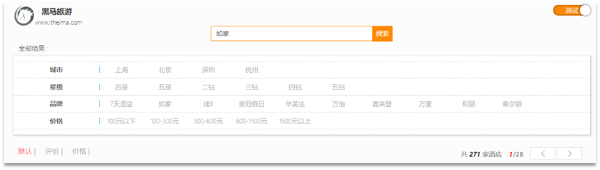</div>

点击搜索按钮，可以看到浏览器控制台发出了请求：

<div align="center"></div>

请求参数如下：

<div align="center">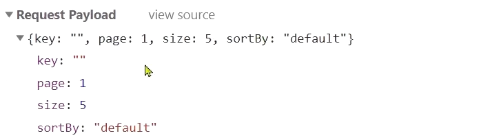</div>


由此可以知道，我们这个请求的信息如下：

- 请求方式：POST
- 请求路径：/hotel/list
- 请求参数：JSON 对象，包含 4 个字段：
    - key：搜索关键字
    - page：页码
    - size：每页大小
    - sortBy：排序，目前暂不实现
- 返回值：分页查询，需要返回分页结果 PageResult，包含两个属性：
    - `total`：总条数
    - `List<HotelDoc>`：当前页的数据

因此，我们实现业务的流程如下：

- 步骤一：定义实体类，接收请求参数的 JSON 对象
- 步骤二：编写 controller，接收页面的请求
- 步骤三：编写业务实现，利用 RestHighLevelClient 实现搜索、分页

### 定义实体类

实体类有两个，一个是前端的请求参数实体，一个是服务端应该返回的响应结果实体。

1）请求参数

前端请求的json结构如下：

```json
{    "key": "搜索关键字",    "page": 1,    "size": 3,    "sortBy": "default"}
```

因此，我们在`cn.itcast.hotel.pojo`包下定义一个实体类：

```java
package cn.itcast.hotel.pojo;
import lombok.Data;
@Data
public class RequestParams {    
    private String key;    
    private Integer page;    
    private Integer size;    
    private String sortBy;
}
```

2）返回值

分页查询，需要返回分页结果 PageResult，包含两个属性：

- `total`：总条数
- `List<HotelDoc>`：当前页的数据

因此，我们在 `cn.itcast.hotel.pojo` 中定义返回结果：

```java
package cn.itcast.hotel.pojo;
import lombok.Data;
import java.util.List;
@Data
public class PageResult {    
    private Long total;    
    private List<HotelDoc> hotels;    
    public PageResult() {}    
    public PageResult(Long total, List<HotelDoc> hotels) {
        this.total = total;        
        this.hotels = hotels;    
    }
}
```

### 定义controller

定义一个 HotelController，声明查询接口，满足下列要求：

- 请求方式：Post
- 请求路径：/hotel/list
- 请求参数：对象，类型为 RequestParam
- 返回值：PageResult，包含两个属性
    - `Long total`：总条数
    - `List<HotelDoc> hotels`：酒店数据

因此，我们在 `cn.itcast.hotel.web` 中定义 HotelController：

```java
@RestController@RequestMapping("/hotel")
public class HotelController {    
    @Autowired    
    private IHotelService hotelService;	
    // 搜索酒店数据    
    @PostMapping("/list")    
    public PageResult search(@RequestBody RequestParams params){        
        return hotelService.search(params);    
    }
}
```

### 实现搜索业务

我们在 controller 调用了 IHotelService，并没有实现该方法，因此下面我们就在 IHotelService 中定义方法，并且去实现业务逻辑。

1）在 `cn.itcast.hotel.service` 中的 `IHotelService` 接口中定义一个方法：

```java
/*** 根据关键字搜索酒店信息 
* @param params 请求参数对象，包含用户输入的关键字  
* @return 酒店文档列表 
**/
PageResult search(RequestParams params);
```

2）实现搜索业务，肯定离不开 RestHighLevelClient，我们需要把它注册到 Spring 中作为一个Bean。在 `cn.itcast.hotel` 中的 `HotelDemoApplication` 中声明这个 Bean：

```java
@Bean
public RestHighLevelClient client(){    
    return  new RestHighLevelClient(RestClient.builder(HttpHost.create("http://192.168.150.101:9200")));
}
```

3）在 `cn.itcast.hotel.service.impl` 中的 `HotelService` 中实现 search 方法：

```java
@Override
public PageResult search(RequestParams params) {    
    try {        
        // 1.准备Request        
        SearchRequest request = new SearchRequest("hotel");        
        // 2.准备DSL        
        // 2.1.query        
        String key = params.getKey();        
        if (key == null || "".equals(key)) {            
            boolQuery.must(QueryBuilders.matchAllQuery());        
        } else {            
            boolQuery.must(QueryBuilders.matchQuery("all", key));        
        }        
        // 2.2.分页        
        int page = params.getPage();        
        int size = params.getSize();        
        request.source().from((page - 1) * size).size(size);        
        // 3.发送请求        
        SearchResponse response = client.search(request, RequestOptions.DEFAULT);        
        // 4.解析响应        
        return handleResponse(response);    
    } catch (IOException e) {        
        throw new RuntimeException(e);    
    }
}
// 结果解析
private PageResult handleResponse(SearchResponse response) {    
    // 4.解析响应    
    SearchHits searchHits = response.getHits();    
    // 4.1.获取总条数    
    long total = searchHits.getTotalHits().value;    
    // 4.2.文档数组    
    SearchHit[] hits = searchHits.getHits();    
    // 4.3.遍历    
    List<HotelDoc> hotels = new ArrayList<>();    
    for (SearchHit hit : hits) {        
        // 获取文档source        
        String json = hit.getSourceAsString();        
        // 反序列化        
        HotelDoc hotelDoc = JSON.parseObject(json, HotelDoc.class);		
        // 放入集合        
        hotels.add(hotelDoc);    
    }    // 4.4.封装返回    return new PageResult(total, hotels);}
```

## 酒店结果过滤

需求：添加品牌、城市、星级、价格等过滤功能

### 需求分析

在页面搜索框下面，会有一些过滤项：


传递的参数如图：

 

包含的过滤条件有：

- brand：品牌值
- city：城市
- minPrice~maxPrice：价格范围
- starName：星级

我们需要做两件事情：

- 修改请求参数的对象RequestParams，接收上述参数
- 修改业务逻辑，在搜索条件之外，添加一些过滤条件

### 修改实体类

修改在`cn.itcast.hotel.pojo`包下的实体类RequestParams：

```java
@Datapublic class RequestParams {    private String key;    private Integer page;    private Integer size;    private String sortBy;    // 下面是新增的过滤条件参数    private String city;    private String brand;    private String starName;    private Integer minPrice;    private Integer maxPrice;}
```

### 修改搜索业务

在HotelService的search方法中，只有一个地方需要修改：requet.source().query( ... )其中的查询条件。

在之前的业务中，只有match查询，根据关键字搜索，现在要添加条件过滤，包括：

- 品牌过滤：是keyword类型，用term查询
- 星级过滤：是keyword类型，用term查询
- 价格过滤：是数值类型，用range查询
- 城市过滤：是keyword类型，用term查询

多个查询条件组合，肯定是boolean查询来组合：

- 关键字搜索放到must中，参与算分
- 其它过滤条件放到filter中，不参与算分

因为条件构建的逻辑比较复杂，这里先封装为一个函数：


buildBasicQuery的代码如下：

```java
private void buildBasicQuery(RequestParams params, SearchRequest request) {    // 1.构建BooleanQuery    BoolQueryBuilder boolQuery = QueryBuilders.boolQuery();    // 2.关键字搜索    String key = params.getKey();    if (key == null || "".equals(key)) {        boolQuery.must(QueryBuilders.matchAllQuery());    } else {        boolQuery.must(QueryBuilders.matchQuery("all", key));    }    // 3.城市条件    if (params.getCity() != null && !params.getCity().equals("")) {        boolQuery.filter(QueryBuilders.termQuery("city", params.getCity()));    }    // 4.品牌条件    if (params.getBrand() != null && !params.getBrand().equals("")) {        boolQuery.filter(QueryBuilders.termQuery("brand", params.getBrand()));    }    // 5.星级条件    if (params.getStarName() != null && !params.getStarName().equals("")) {        boolQuery.filter(QueryBuilders.termQuery("starName", params.getStarName()));    }	// 6.价格    if (params.getMinPrice() != null && params.getMaxPrice() != null) {        boolQuery.filter(QueryBuilders                         .rangeQuery("price")                         .gte(params.getMinPrice())                         .lte(params.getMaxPrice())                        );    }	// 7.放入source    request.source().query(boolQuery);}
```

## 我周边的酒店

需求：我附近的酒店

### 需求分析

在酒店列表页的右侧，有一个小地图，点击地图的定位按钮，地图会找到你所在的位置：

 

并且，在前端会发起查询请求，将你的坐标发送到服务端：

 

我们要做的事情就是基于这个location坐标，然后按照距离对周围酒店排序。实现思路如下：

- 修改RequestParams参数，接收location字段
- 修改search方法业务逻辑，如果location有值，添加根据geo_distance排序的功能

### 修改实体类

修改在`cn.itcast.hotel.pojo`包下的实体类RequestParams：

```java
package cn.itcast.hotel.pojo;import lombok.Data;@Datapublic class RequestParams {    private String key;    private Integer page;    private Integer size;    private String sortBy;    private String city;    private String brand;    private String starName;    private Integer minPrice;    private Integer maxPrice;    // 我当前的地理坐标    private String location;}
```

### 距离排序API

我们以前学习过排序功能，包括两种：

- 普通字段排序
- 地理坐标排序

我们只讲了普通字段排序对应的java写法。地理坐标排序只学过DSL语法，如下：

```json
GET /indexName/_search{  "query": {    "match_all": {}  },  "sort": [    {      "price": "asc"      },    {      "_geo_distance" : {          "FIELD" : "纬度，经度",          "order" : "asc",          "unit" : "km"      }    }  ]}
```

对应的java代码示例：

### 添加距离排序

在`cn.itcast.hotel.service.impl`的`HotelService`的`search`方法中，添加一个排序功能：


完整代码：

```java
@Overridepublic PageResult search(RequestParams params) {    try {        // 1.准备Request        SearchRequest request = new SearchRequest("hotel");        // 2.准备DSL        // 2.1.query        buildBasicQuery(params, request);        // 2.2.分页        int page = params.getPage();        int size = params.getSize();        request.source().from((page - 1) * size).size(size);        // 2.3.排序        String location = params.getLocation();        if (location != null && !location.equals("")) {            request.source().sort(SortBuilders                                  .geoDistanceSort("location", new GeoPoint(location))                                  .order(SortOrder.ASC)                                  .unit(DistanceUnit.KILOMETERS)                                 );        }        // 3.发送请求        SearchResponse response = client.search(request, RequestOptions.DEFAULT);        // 4.解析响应        return handleResponse(response);    } catch (IOException e) {        throw new RuntimeException(e);    }}
```

### 排序距离显示

重启服务后，测试我的酒店功能：


发现确实可以实现对我附近酒店的排序，不过并没有看到酒店到底距离我多远，这该怎么办？

排序完成后，页面还要获取我附近每个酒店的具体<b>距离<b>值，这个值在响应结果中是独立的：


因此，我们在结果解析阶段，除了解析source部分以外，还要得到sort部分，也就是排序的距离，然后放到响应结果中。

我们要做两件事：

- 修改HotelDoc，添加排序距离字段，用于页面显示
- 修改HotelService类中的handleResponse方法，添加对sort值的获取

1）修改HotelDoc类，添加距离字段

```java
package cn.itcast.hotel.pojo;import lombok.Data;import lombok.NoArgsConstructor;@Data@NoArgsConstructorpublic class HotelDoc {    private Long id;    private String name;    private String address;    private Integer price;    private Integer score;    private String brand;    private String city;    private String starName;    private String business;    private String location;    private String pic;    // 排序时的 距离值    private Object distance;    public HotelDoc(Hotel hotel) {        this.id = hotel.getId();        this.name = hotel.getName();        this.address = hotel.getAddress();        this.price = hotel.getPrice();        this.score = hotel.getScore();        this.brand = hotel.getBrand();        this.city = hotel.getCity();        this.starName = hotel.getStarName();        this.business = hotel.getBusiness();        this.location = hotel.getLatitude() + ", " + hotel.getLongitude();        this.pic = hotel.getPic();    }}
```

2）修改HotelService中的handleResponse方法


重启后测试，发现页面能成功显示距离了：


## 酒店竞价排名

需求：让指定的酒店在搜索结果中排名置顶

### 需求分析

要让指定酒店在搜索结果中排名置顶，效果如图：


页面会给指定的酒店添加<b>广告<b>标记。

那怎样才能让指定的酒店排名置顶呢？

我们之前学习过的function_score查询可以影响算分，算分高了，自然排名也就高了。而function_score包含3个要素：

- 过滤条件：哪些文档要加分
- 算分函数：如何计算function score
- 加权方式：function score 与 query score如何运算

这里的需求是：让<b>指定酒店<b>排名靠前。因此我们需要给这些酒店添加一个标记，这样在过滤条件中就可以<b>根据这个标记来判断，是否要提高算分<b>。

比如，我们给酒店添加一个字段：isAD，Boolean类型：

- true：是广告
- false：不是广告

这样function_score包含3个要素就很好确定了：

- 过滤条件：判断isAD 是否为true
- 算分函数：我们可以用最简单暴力的weight，固定加权值
- 加权方式：可以用默认的相乘，大大提高算分

因此，业务的实现步骤包括：

1. 给HotelDoc类添加isAD字段，Boolean类型

2. 挑选几个你喜欢的酒店，给它的文档数据添加isAD字段，值为true

3. 修改search方法，添加function score功能，给isAD值为true的酒店增加权重

### 修改HotelDoc实体

给`cn.itcast.hotel.pojo`包下的HotelDoc类添加isAD字段：

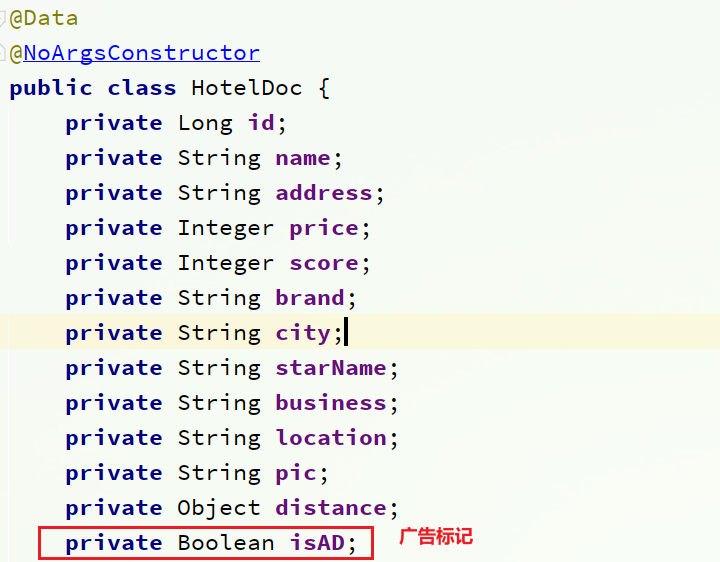


### 添加广告标记

接下来，我们挑几个酒店，添加isAD字段，设置为true：

```json
POST /hotel/_update/1902197537{    "doc": {        "isAD": true    }}POST /hotel/_update/2056126831{    "doc": {        "isAD": true    }}POST /hotel/_update/1989806195{    "doc": {        "isAD": true    }}POST /hotel/_update/2056105938{    "doc": {        "isAD": true    }}
```

### 添加算分函数查询

接下来我们就要修改查询条件了。之前是用的boolean 查询，现在要改成function_socre查询。

function_score查询结构如下：


对应的JavaAPI如下：


我们可以将之前写的boolean查询作为<b>原始查询<b>条件放到query中，接下来就是添加<b>过滤条件<b>、<b>算分函数<b>、<b>加权模式<b>了。所以原来的代码依然可以沿用。

修改`cn.itcast.hotel.service.impl`包下的`HotelService`类中的`buildBasicQuery`方法，添加算分函数查询：

```java
private void buildBasicQuery(RequestParams params, SearchRequest request) {    // 1.构建BooleanQuery    BoolQueryBuilder boolQuery = QueryBuilders.boolQuery();    // 关键字搜索    String key = params.getKey();    if (key == null || "".equals(key)) {        boolQuery.must(QueryBuilders.matchAllQuery());    } else {        boolQuery.must(QueryBuilders.matchQuery("all", key));    }    // 城市条件    if (params.getCity() != null && !params.getCity().equals("")) {        boolQuery.filter(QueryBuilders.termQuery("city", params.getCity()));    }    // 品牌条件    if (params.getBrand() != null && !params.getBrand().equals("")) {        boolQuery.filter(QueryBuilders.termQuery("brand", params.getBrand()));    }    // 星级条件    if (params.getStarName() != null && !params.getStarName().equals("")) {        boolQuery.filter(QueryBuilders.termQuery("starName", params.getStarName()));    }    // 价格    if (params.getMinPrice() != null && params.getMaxPrice() != null) {        boolQuery.filter(QueryBuilders                         .rangeQuery("price")                         .gte(params.getMinPrice())                         .lte(params.getMaxPrice())                        );    }    // 2.算分控制    FunctionScoreQueryBuilder functionScoreQuery =        QueryBuilders.functionScoreQuery(        // 原始查询，相关性算分的查询        boolQuery,        // function score的数组        new FunctionScoreQueryBuilder.FilterFunctionBuilder[]{            // 其中的一个function score 元素            new FunctionScoreQueryBuilder.FilterFunctionBuilder(                // 过滤条件                QueryBuilders.termQuery("isAD", true),                // 算分函数                ScoreFunctionBuilders.weightFactorFunction(10)            )        });    request.source().query(functionScoreQuery);}
```

# 数据聚合

<b>[聚合（](https://www.elastic.co/guide/en/elasticsearch/reference/current/search-aggregations.html)[aggregations](https://www.elastic.co/guide/en/elasticsearch/reference/current/search-aggregations.html)[）](https://www.elastic.co/guide/en/elasticsearch/reference/current/search-aggregations.html)<b>可以让我们极其方便的实现对数据的统计、分析、运算。例如：

- 什么品牌的手机最受欢迎？
- 这些手机的平均价格、最高价格、最低价格？
- 这些手机每月的销售情况如何？

实现这些统计功能的比数据库的sql要方便的多，而且查询速度非常快，可以实现近实时搜索效果。

## 聚合的种类

聚合常见的有三类：

- <b>桶（Bucket）<b>聚合：用来对文档做分组
    - TermAggregation：按照文档字段值分组，例如按照品牌值分组、按照国家分组
    - Date Histogram：按照日期阶梯分组，例如一周为一组，或者一月为一组

- <b>度量（Metric）<b>聚合：用以计算一些值，比如：最大值、最小值、平均值等
    - Avg：求平均值
    - Max：求最大值
    - Min：求最小值
    - Stats：同时求max、min、avg、sum等
- <b>管道（pipeline）<b>聚合：其它聚合的结果为基础做聚合

> <b>注意：<b>参加聚合的字段必须是keyword、日期、数值、布尔类型

## DSL实现聚合

现在，我们要统计所有数据中的酒店品牌有几种，其实就是按照品牌对数据分组。此时可以根据酒店品牌的名称做聚合，也就是Bucket聚合。

### Bucket聚合语法

语法如下：

```json
GET /hotel/_search{  "size": 0,  // 设置size为0，结果中不包含文档，只包含聚合结果  "aggs": { // 定义聚合    "brandAgg": { //给聚合起个名字      "terms": { // 聚合的类型，按照品牌值聚合，所以选择term        "field": "brand", // 参与聚合的字段        "size": 20 // 希望获取的聚合结果数量      }    }  }}
```

结果如图：


### 聚合结果排序

默认情况下，Bucket聚合会统计Bucket内的文档数量，记为_count，并且按照_count降序排序。

我们可以指定order属性，自定义聚合的排序方式：

```json
GET /hotel/_search{  "size": 0,   "aggs": {    "brandAgg": {      "terms": {        "field": "brand",        "order": {          "_count": "asc" // 按照_count升序排列        },        "size": 20      }    }  }}
```

### 限定聚合范围

默认情况下，Bucket聚合是对索引库的所有文档做聚合，但真实场景下，用户会输入搜索条件，因此聚合必须是对搜索结果聚合。那么聚合必须添加限定条件。

我们可以限定要聚合的文档范围，只要添加query条件即可：

```json
GET /hotel/_search{  "query": {    "range": {      "price": {        "lte": 200 // 只对200元以下的文档聚合      }    }  },   "size": 0,   "aggs": {    "brandAgg": {      "terms": {        "field": "brand",        "size": 20      }    }  }}
```

这次，聚合得到的品牌明显变少了：


### Metric聚合语法

上节课，我们对酒店按照品牌分组，形成了一个个桶。现在我们需要对桶内的酒店做运算，获取每个品牌的用户评分的min、max、avg等值。

这就要用到Metric聚合了，例如stat聚合：就可以获取min、max、avg等结果。

语法如下：

```json
GET /hotel/_search{  "size": 0,   "aggs": {    "brandAgg": {       "terms": {         "field": "brand",         "size": 20      },      "aggs": { // 是brands聚合的子聚合，也就是分组后对每组分别计算        "score_stats": { // 聚合名称          "stats": { // 聚合类型，这里stats可以计算min、max、avg等            "field": "score" // 聚合字段，这里是score          }        }      }    }  }}
```

这次的score_stats聚合是在brandAgg的聚合内部嵌套的子聚合。因为我们需要在每个桶分别计算。

另外，我们还可以给聚合结果做个排序，例如按照每个桶的酒店平均分做排序：


### 小结

aggs代表聚合，与query同级，此时query的作用是？

- 限定聚合的的文档范围

聚合必须的三要素：

- 聚合名称
- 聚合类型
- 聚合字段

聚合可配置属性有：

- size：指定聚合结果数量
- order：指定聚合结果排序方式
- field：指定聚合字段

## RestAPI实现聚合

### API语法

聚合条件与query条件同级别，因此需要使用request.source()来指定聚合条件。

聚合条件的语法：


聚合的结果也与查询结果不同，API也比较特殊。不过同样是JSON逐层解析：


### 业务需求

需求：搜索页面的品牌、城市等信息不应该是在页面写死，而是通过聚合索引库中的酒店数据得来的：


分析：

目前，页面的城市列表、星级列表、品牌列表都是写死的，并不会随着搜索结果的变化而变化。但是用户搜索条件改变时，搜索结果会跟着变化。

例如：用户搜索“东方明珠”，那搜索的酒店肯定是在上海东方明珠附近，因此，城市只能是上海，此时城市列表中就不应该显示北京、深圳、杭州这些信息了。

也就是说，搜索结果中包含哪些城市，页面就应该列出哪些城市；搜索结果中包含哪些品牌，页面就应该列出哪些品牌。

如何得知搜索结果中包含哪些品牌？如何得知搜索结果中包含哪些城市？

使用聚合功能，利用Bucket聚合，对搜索结果中的文档基于品牌分组、基于城市分组，就能得知包含哪些品牌、哪些城市了。

因为是对搜索结果聚合，因此聚合是<b>限定范围的聚合<b>，也就是说聚合的限定条件跟搜索文档的条件一致。

查看浏览器可以发现，前端其实已经发出了这样的一个请求：


请求<b>参数与搜索文档的参数完全一致<b>。

返回值类型就是页面要展示的最终结果：


结果是一个Map结构：

- key是字符串，城市、星级、品牌、价格
- value是集合，例如多个城市的名称

### 业务实现

在`cn.itcast.hotel.web`包的`HotelController`中添加一个方法，遵循下面的要求：

- 请求方式：`POST`
- 请求路径：`/hotel/filters`
- 请求参数：`RequestParams`，与搜索文档的参数一致
- 返回值类型：`Map<String, List<String>>`

代码：

```java
    @PostMapping("filters")    public Map<String, List<String>> getFilters(@RequestBody RequestParams params){        return hotelService.getFilters(params);    }
```

这里调用了IHotelService中的getFilters方法，尚未实现。

在`cn.itcast.hotel.service.IHotelService`中定义新方法：

```java
Map<String, List<String>> filters(RequestParams params);
```

在`cn.itcast.hotel.service.impl.HotelService`中实现该方法：

```java
@Overridepublic Map<String, List<String>> filters(RequestParams params) {    try {        // 1.准备Request        SearchRequest request = new SearchRequest("hotel");        // 2.准备DSL        // 2.1.query        buildBasicQuery(params, request);        // 2.2.设置size        request.source().size(0);        // 2.3.聚合        buildAggregation(request);        // 3.发出请求        SearchResponse response = client.search(request, RequestOptions.DEFAULT);        // 4.解析结果        Map<String, List<String>> result = new HashMap<>();        Aggregations aggregations = response.getAggregations();        // 4.1.根据品牌名称，获取品牌结果        List<String> brandList = getAggByName(aggregations, "brandAgg");        result.put("品牌", brandList);        // 4.2.根据品牌名称，获取品牌结果        List<String> cityList = getAggByName(aggregations, "cityAgg");        result.put("城市", cityList);        // 4.3.根据品牌名称，获取品牌结果        List<String> starList = getAggByName(aggregations, "starAgg");        result.put("星级", starList);        return result;    } catch (IOException e) {        throw new RuntimeException(e);    }}private void buildAggregation(SearchRequest request) {    request.source().aggregation(AggregationBuilders                                 .terms("brandAgg")                                 .field("brand")                                 .size(100)                                );    request.source().aggregation(AggregationBuilders                                 .terms("cityAgg")                                 .field("city")                                 .size(100)                                );    request.source().aggregation(AggregationBuilders                                 .terms("starAgg")                                 .field("starName")                                 .size(100)                                );}private List<String> getAggByName(Aggregations aggregations, String aggName) {    // 4.1.根据聚合名称获取聚合结果    Terms brandTerms = aggregations.get(aggName);    // 4.2.获取buckets    List<? extends Terms.Bucket> buckets = brandTerms.getBuckets();    // 4.3.遍历    List<String> brandList = new ArrayList<>();    for (Terms.Bucket bucket : buckets) {        // 4.4.获取key        String key = bucket.getKeyAsString();        brandList.add(key);    }    return brandList;}
```

# 自动补全

当用户在搜索框输入字符时，我们应该提示出与该字符有关的搜索项，如图：


这种根据用户输入的字母，提示完整词条的功能，就是自动补全了。

因为需要根据拼音字母来推断，因此要用到拼音分词功能。

## 拼音分词器

要实现根据字母做补全，就必须对文档按照拼音分词。在GitHub上恰好有elasticsearch的拼音分词插件。地址：https://github.com/medcl/elasticsearch-analysis-pinyin


课前资料中也提供了拼音分词器的安装包：

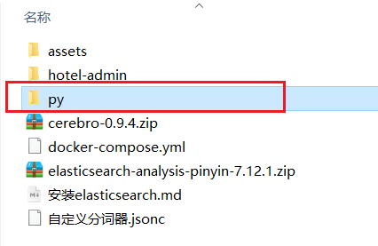 

安装方式与IK分词器一样，分三步：

​	①解压

​	②上传到虚拟机中，elasticsearch的plugin目录

​	③重启elasticsearch

​	④测试

详细安装步骤可以参考IK分词器的安装过程。

测试用法如下：

```json
POST /_analyze{  "text": "如家酒店还不错",  "analyzer": "pinyin"}
```

结果：

 

## 自定义分词器

默认的拼音分词器会将每个汉字单独分为拼音，而我们希望的是每个词条形成一组拼音，需要对拼音分词器做个性化定制，形成自定义分词器。

elasticsearch中分词器（analyzer）的组成包含三部分：

- character filters：在tokenizer之前对文本进行处理。例如删除字符、替换字符
- tokenizer：将文本按照一定的规则切割成词条（term）。例如keyword，就是不分词；还有ik_smart
- tokenizer filter：将tokenizer输出的词条做进一步处理。例如大小写转换、同义词处理、拼音处理等

文档分词时会依次由这三部分来处理文档：


声明自定义分词器的语法如下：

```json
PUT /test{  "settings": {    "analysis": {      "analyzer": { // 自定义分词器        "my_analyzer": {  // 分词器名称          "tokenizer": "ik_max_word",          "filter": "py"        }      },      "filter": { // 自定义tokenizer filter        "py": { // 过滤器名称          "type": "pinyin", // 过滤器类型，这里是pinyin		  "keep_full_pinyin": false,          "keep_joined_full_pinyin": true,          "keep_original": true,          "limit_first_letter_length": 16,          "remove_duplicated_term": true,          "none_chinese_pinyin_tokenize": false        }      }    }  },  "mappings": {    "properties": {      "name": {        "type": "text",        "analyzer": "my_analyzer",        "search_analyzer": "ik_smart"      }    }  }}
```

测试：


总结：

如何使用拼音分词器？

- ①下载pinyin分词器

- ②解压并放到elasticsearch的plugin目录

- ③重启即可

如何自定义分词器？

- ①创建索引库时，在settings中配置，可以包含三部分

- ②character filter

- ③tokenizer

- ④filter

拼音分词器注意事项？

- 为了避免搜索到同音字，搜索时不要使用拼音分词器

## 自动补全查询

elasticsearch提供了[Completion Suggester](https://www.elastic.co/guide/en/elasticsearch/reference/7.6/search-suggesters.html)查询来实现自动补全功能。这个查询会匹配以用户输入内容开头的词条并返回。为了提高补全查询的效率，对于文档中字段的类型有一些约束：

- 参与补全查询的字段必须是completion类型。

- 字段的内容一般是用来补全的多个词条形成的数组。

比如，一个这样的索引库：

```json
// 创建索引库PUT test{  "mappings": {    "properties": {      "title":{        "type": "completion"      }    }  }}
```

然后插入下面的数据：

```json
// 示例数据POST test/_doc{  "title": ["Sony", "WH-1000XM3"]}POST test/_doc{  "title": ["SK-II", "PITERA"]}POST test/_doc{  "title": ["Nintendo", "switch"]}
```

查询的DSL语句如下：

```json
// 自动补全查询GET /test/_search{  "suggest": {    "title_suggest": {      "text": "s", // 关键字      "completion": {        "field": "title", // 补全查询的字段        "skip_duplicates": true, // 跳过重复的        "size": 10 // 获取前10条结果      }    }  }}
```

## 实现酒店搜索框自动补全

现在，我们的hotel索引库还没有设置拼音分词器，需要修改索引库中的配置。但是我们知道索引库是无法修改的，只能删除然后重新创建。

另外，我们需要添加一个字段，用来做自动补全，将brand、suggestion、city等都放进去，作为自动补全的提示。

因此，总结一下，我们需要做的事情包括：

1. 修改hotel索引库结构，设置自定义拼音分词器

2. 修改索引库的name、all字段，使用自定义分词器

3. 索引库添加一个新字段suggestion，类型为completion类型，使用自定义的分词器

4. 给HotelDoc类添加suggestion字段，内容包含brand、business

5. 重新导入数据到hotel库

### 修改酒店映射结构

代码如下：

```json
// 酒店数据索引库PUT /hotel{  "settings": {    "analysis": {      "analyzer": {        "text_anlyzer": {          "tokenizer": "ik_max_word",          "filter": "py"        },        "completion_analyzer": {          "tokenizer": "keyword",          "filter": "py"        }      },      "filter": {        "py": {          "type": "pinyin",          "keep_full_pinyin": false,          "keep_joined_full_pinyin": true,          "keep_original": true,          "limit_first_letter_length": 16,          "remove_duplicated_term": true,          "none_chinese_pinyin_tokenize": false        }      }    }  },  "mappings": {    "properties": {      "id":{        "type": "keyword"      },      "name":{        "type": "text",        "analyzer": "text_anlyzer",        "search_analyzer": "ik_smart",        "copy_to": "all"      },      "address":{        "type": "keyword",        "index": false      },      "price":{        "type": "integer"      },      "score":{        "type": "integer"      },      "brand":{        "type": "keyword",        "copy_to": "all"      },      "city":{        "type": "keyword"      },      "starName":{        "type": "keyword"      },      "business":{        "type": "keyword",        "copy_to": "all"      },      "location":{        "type": "geo_point"      },      "pic":{        "type": "keyword",        "index": false      },      "all":{        "type": "text",        "analyzer": "text_anlyzer",        "search_analyzer": "ik_smart"      },      "suggestion":{          "type": "completion",          "analyzer": "completion_analyzer"      }    }  }}
```

### 修改HotelDoc实体

HotelDoc中要添加一个字段，用来做自动补全，内容可以是酒店品牌、城市、商圈等信息。按照自动补全字段的要求，最好是这些字段的数组。

因此我们在HotelDoc中添加一个suggestion字段，类型为`List<String>`，然后将brand、city、business等信息放到里面。

代码如下：

```java
package cn.itcast.hotel.pojo;import lombok.Data;import lombok.NoArgsConstructor;import java.util.ArrayList;import java.util.Arrays;import java.util.Collections;import java.util.List;@Data@NoArgsConstructorpublic class HotelDoc {    private Long id;    private String name;    private String address;    private Integer price;    private Integer score;    private String brand;    private String city;    private String starName;    private String business;    private String location;    private String pic;    private Object distance;    private Boolean isAD;    private List<String> suggestion;    public HotelDoc(Hotel hotel) {        this.id = hotel.getId();        this.name = hotel.getName();        this.address = hotel.getAddress();        this.price = hotel.getPrice();        this.score = hotel.getScore();        this.brand = hotel.getBrand();        this.city = hotel.getCity();        this.starName = hotel.getStarName();        this.business = hotel.getBusiness();        this.location = hotel.getLatitude() + ", " + hotel.getLongitude();        this.pic = hotel.getPic();        // 组装suggestion        if(this.business.contains("/")){            // business有多个值，需要切割            String[] arr = this.business.split("/");            // 添加元素            this.suggestion = new ArrayList<>();            this.suggestion.add(this.brand);            Collections.addAll(this.suggestion, arr);        }else {            this.suggestion = Arrays.asList(this.brand, this.business);        }    }}
```

### 重新导入

重新执行之前编写的导入数据功能，可以看到新的酒店数据中包含了suggestion：


### 自动补全查询的JavaAPI

之前我们学习了自动补全查询的DSL，而没有学习对应的JavaAPI，这里给出一个示例：

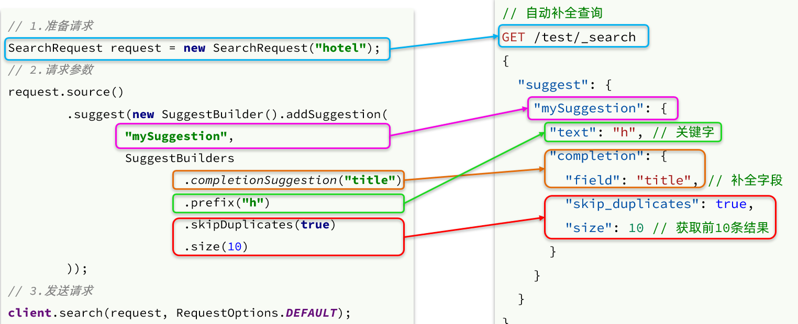

而自动补全的结果也比较特殊，解析的代码如下：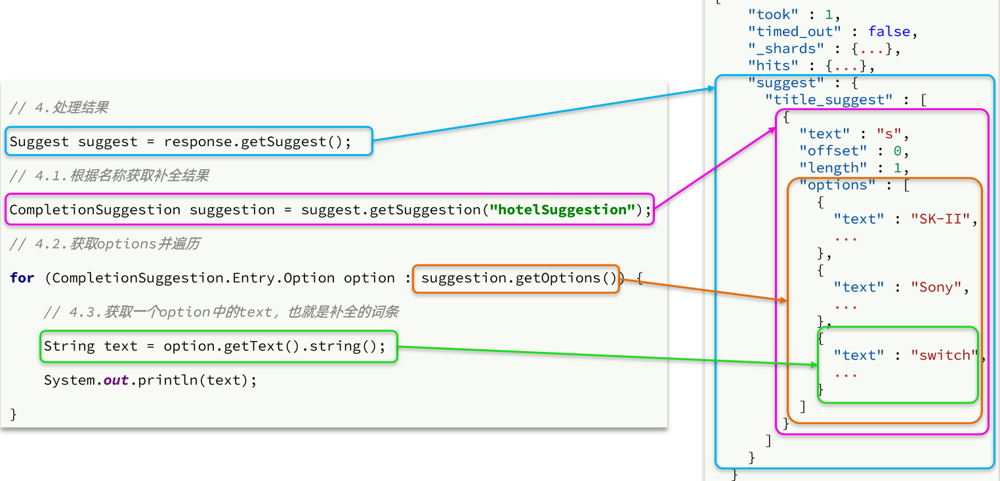

### 实现搜索框自动补全

查看前端页面，可以发现当我们在输入框键入时，前端会发起ajax请求：


返回值是补全词条的集合，类型为`List<String>`

1）在`cn.itcast.hotel.web`包下的`HotelController`中添加新接口，接收新的请求：

```java
@GetMapping("suggestion")public List<String> getSuggestions(@RequestParam("key") String prefix) {    return hotelService.getSuggestions(prefix);}
```

2）在`cn.itcast.hotel.service`包下的`IhotelService`中添加方法：

```java
List<String> getSuggestions(String prefix);
```

3）在`cn.itcast.hotel.service.impl.HotelService`中实现该方法：

```java
@Overridepublic List<String> getSuggestions(String prefix) {    try {        // 1.准备Request        SearchRequest request = new SearchRequest("hotel");        // 2.准备DSL        request.source().suggest(new SuggestBuilder().addSuggestion(            "suggestions",            SuggestBuilders.completionSuggestion("suggestion")            .prefix(prefix)            .skipDuplicates(true)            .size(10)        ));        // 3.发起请求        SearchResponse response = client.search(request, RequestOptions.DEFAULT);        // 4.解析结果        Suggest suggest = response.getSuggest();        // 4.1.根据补全查询名称，获取补全结果        CompletionSuggestion suggestions = suggest.getSuggestion("suggestions");        // 4.2.获取options        List<CompletionSuggestion.Entry.Option> options = suggestions.getOptions();        // 4.3.遍历        List<String> list = new ArrayList<>(options.size());        for (CompletionSuggestion.Entry.Option option : options) {            String text = option.getText().toString();            list.add(text);        }        return list;    } catch (IOException e) {        throw new RuntimeException(e);    }}
```

# 数据同步

elasticsearch中的酒店数据来自于mysql数据库，因此mysql数据发生改变时，elasticsearch也必须跟着改变，这个就是elasticsearch与mysql之间的<b>数据同步<b>。


## 思路分析

常见的数据同步方案有三种：

- 同步调用
- 异步通知
- 监听binlog

### 同步调用

方案一：同步调用


基本步骤如下：

- hotel-demo对外提供接口，用来修改elasticsearch中的数据
- 酒店管理服务在完成数据库操作后，直接调用hotel-demo提供的接口，

### 异步通知

方案二：异步通知


流程如下：

- hotel-admin对mysql数据库数据完成增、删、改后，发送MQ消息
- hotel-demo监听MQ，接收到消息后完成elasticsearch数据修改

### 监听binlog

方案三：监听binlog


流程如下：

- 给mysql开启binlog功能
- mysql完成增、删、改操作都会记录在binlog中
- hotel-demo基于canal监听binlog变化，实时更新elasticsearch中的内容

### 选择

方式一：同步调用

- 优点：实现简单，粗暴
- 缺点：业务耦合度高

方式二：异步通知

- 优点：低耦合，实现难度一般
- 缺点：依赖mq的可靠性

方式三：监听binlog

- 优点：完全解除服务间耦合
- 缺点：开启binlog增加数据库负担、实现复杂度高

## 实现数据同步

### 思路

利用课前资料提供的hotel-admin项目作为酒店管理的微服务。当酒店数据发生增、删、改时，要求对elasticsearch中数据也要完成相同操作。

步骤：

- 导入课前资料提供的hotel-admin项目，启动并测试酒店数据的CRUD

- 声明exchange、queue、RoutingKey

- 在hotel-admin中的增、删、改业务中完成消息发送

- 在hotel-demo中完成消息监听，并更新elasticsearch中数据

- 启动并测试数据同步功能

### 导入demo

导入课前资料提供的hotel-admin项目：


运行后，访问 http://localhost:8099


其中包含了酒店的CRUD功能：

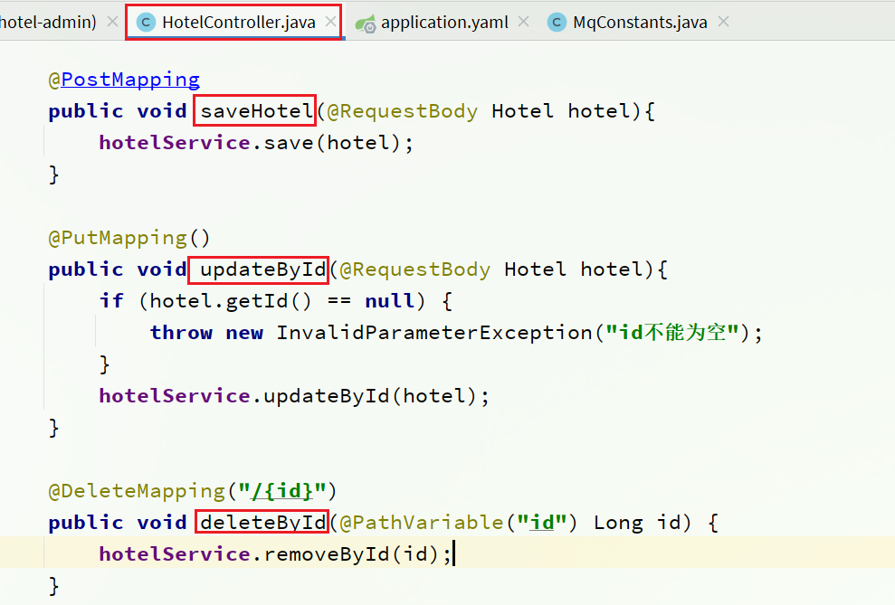

### 声明交换机、队列

MQ结构如图：


#### 1）引入依赖

在hotel-admin、hotel-demo中引入rabbitmq的依赖：

```xml
<!--amqp--><dependency>    <groupId>org.springframework.boot</groupId>    <artifactId>spring-boot-starter-amqp</artifactId></dependency>
```

#### 2）声明队列交换机名称

在hotel-admin和hotel-demo中的`cn.itcast.hotel.constatnts`包下新建一个类`MqConstants`：

```java
package cn.itcast.hotel.constatnts;    public class MqConstants {    /<b>     * 交换机     */    public final static String HOTEL_EXCHANGE = "hotel.topic";    /<b>     * 监听新增和修改的队列     */    public final static String HOTEL_INSERT_QUEUE = "hotel.insert.queue";    /<b>     * 监听删除的队列     */    public final static String HOTEL_DELETE_QUEUE = "hotel.delete.queue";    /<b>     * 新增或修改的RoutingKey     */    public final static String HOTEL_INSERT_KEY = "hotel.insert";    /<b>     * 删除的RoutingKey     */    public final static String HOTEL_DELETE_KEY = "hotel.delete";}
```

#### 3）声明队列交换机

在hotel-demo中，定义配置类，声明队列、交换机：

```java
package cn.itcast.hotel.config;import cn.itcast.hotel.constants.MqConstants;import org.springframework.amqp.core.Binding;import org.springframework.amqp.core.BindingBuilder;import org.springframework.amqp.core.Queue;import org.springframework.amqp.core.TopicExchange;import org.springframework.context.annotation.Bean;import org.springframework.context.annotation.Configuration;@Configurationpublic class MqConfig {    @Bean    public TopicExchange topicExchange(){        return new TopicExchange(MqConstants.HOTEL_EXCHANGE, true, false);    }    @Bean    public Queue insertQueue(){        return new Queue(MqConstants.HOTEL_INSERT_QUEUE, true);    }    @Bean    public Queue deleteQueue(){        return new Queue(MqConstants.HOTEL_DELETE_QUEUE, true);    }    @Bean    public Binding insertQueueBinding(){        return BindingBuilder.bind(insertQueue()).to(topicExchange()).with(MqConstants.HOTEL_INSERT_KEY);    }    @Bean    public Binding deleteQueueBinding(){        return BindingBuilder.bind(deleteQueue()).to(topicExchange()).with(MqConstants.HOTEL_DELETE_KEY);    }}
```

### 发送MQ消息

在hotel-admin中的增、删、改业务中分别发送MQ消息：


### 接收MQ消息

hotel-demo接收到MQ消息要做的事情包括：

- 新增消息：根据传递的hotel的id查询hotel信息，然后新增一条数据到索引库
- 删除消息：根据传递的hotel的id删除索引库中的一条数据

1）首先在hotel-demo的`cn.itcast.hotel.service`包下的`IHotelService`中新增新增、删除业务

```java
void deleteById(Long id);void insertById(Long id);
```

2）给hotel-demo中的`cn.itcast.hotel.service.impl`包下的HotelService中实现业务：

```java
@Overridepublic void deleteById(Long id) {    try {        // 1.准备Request        DeleteRequest request = new DeleteRequest("hotel", id.toString());        // 2.发送请求        client.delete(request, RequestOptions.DEFAULT);    } catch (IOException e) {        throw new RuntimeException(e);    }}@Overridepublic void insertById(Long id) {    try {        // 0.根据id查询酒店数据        Hotel hotel = getById(id);        // 转换为文档类型        HotelDoc hotelDoc = new HotelDoc(hotel);        // 1.准备Request对象        IndexRequest request = new IndexRequest("hotel").id(hotel.getId().toString());        // 2.准备Json文档        request.source(JSON.toJSONString(hotelDoc), XContentType.JSON);        // 3.发送请求        client.index(request, RequestOptions.DEFAULT);    } catch (IOException e) {        throw new RuntimeException(e);    }}
```

3）编写监听器

在hotel-demo中的`cn.itcast.hotel.mq`包新增一个类：

```java
package cn.itcast.hotel.mq;import cn.itcast.hotel.constants.MqConstants;import cn.itcast.hotel.service.IHotelService;import org.springframework.amqp.rabbit.annotation.RabbitListener;import org.springframework.beans.factory.annotation.Autowired;import org.springframework.stereotype.Component;@Componentpublic class HotelListener {    @Autowired    private IHotelService hotelService;    /<b>     * 监听酒店新增或修改的业务     * @param id 酒店id     */    @RabbitListener(queues = MqConstants.HOTEL_INSERT_QUEUE)    public void listenHotelInsertOrUpdate(Long id){        hotelService.insertById(id);    }    /<b>     * 监听酒店删除的业务     * @param id 酒店id     */    @RabbitListener(queues = MqConstants.HOTEL_DELETE_QUEUE)    public void listenHotelDelete(Long id){        hotelService.deleteById(id);    }}
```

# 集群

单机的elasticsearch做数据存储，必然面临两个问题：海量数据存储问题、单点故障问题。

- 海量数据存储问题：将索引库从逻辑上拆分为N个分片（shard），存储到多个节点
- 单点故障问题：将分片数据在不同节点备份（replica ）

<b>ES集群相关概念<b>:

* 集群（cluster）：一组拥有共同的 cluster name 的 节点。

* <font color="red">节点（node)</font>   ：集群中的一个 Elasticearch 实例

* <font color="red">分片（shard）</font>：索引可以被拆分为不同的部分进行存储，称为分片。在集群环境下，一个索引的不同分片可以拆分到不同的节点中

    解决问题：数据量太大，单点存储量有限的问题。

    

    > 此处，我们把数据分成3片：shard0、shard1、shard2

* 主分片（Primary shard）：相对于副本分片的定义。

* 副本分片（Replica shard）每个主分片可以有一个或者多个副本，数据和主分片一样


数据备份可以保证高可用，但是每个分片备份一份，所需要的节点数量就会翻一倍，成本实在是太高了！

为了在高可用和成本间寻求平衡，我们可以这样做：

- 首先对数据分片，存储到不同节点
- 然后对每个分片进行备份，放到对方节点，完成互相备份

这样可以大大减少所需要的服务节点数量，如图，我们以3分片，每个分片备份一份为例：


现在，每个分片都有1个备份，存储在3个节点：

- node0：保存了分片0和1
- node1：保存了分片0和2
- node2：保存了分片1和2

## 搭建ES集群

参考课前资料的文档：

 

其中的第四章节：

 

## 集群脑裂问题

### 集群职责划分

elasticsearch中集群节点有不同的职责划分：


默认情况下，集群中的任何一个节点都同时具备上述四种角色。

但是真实的集群一定要将集群职责分离：

- master节点：对CPU要求高，但是内存要求第
- data节点：对CPU和内存要求都高
- coordinating节点：对网络带宽、CPU要求高

职责分离可以让我们根据不同节点的需求分配不同的硬件去部署。而且避免业务之间的互相干扰。

一个典型的es集群职责划分如图：


### 脑裂问题

脑裂是因为集群中的节点失联导致的。

例如一个集群中，主节点与其它节点失联：


此时，node2和node3认为node1宕机，就会重新选主：


当node3当选后，集群继续对外提供服务，node2和node3自成集群，node1自成集群，两个集群数据不同步，出现数据差异。

当网络恢复后，因为集群中有两个master节点，集群状态的不一致，出现脑裂的情况：


解决脑裂的方案是，要求选票超过 ( eligible节点数量 + 1 ）/ 2 才能当选为主，因此eligible节点数量最好是奇数。对应配置项是discovery.zen.minimum_master_nodes，在es7.0以后，已经成为默认配置，因此一般不会发生脑裂问题

例如：3个节点形成的集群，选票必须超过 （3 + 1） / 2 ，也就是2票。node3得到node2和node3的选票，当选为主。node1只有自己1票，没有当选。集群中依然只有1个主节点，没有出现脑裂。

### 小结

master eligible节点的作用是什么？

- 参与集群选主
- 主节点可以管理集群状态、管理分片信息、处理创建和删除索引库的请求

data节点的作用是什么？

- 数据的CRUD

coordinator节点的作用是什么？

- 路由请求到其它节点

- 合并查询到的结果，返回给用户

## 集群分布式存储

当新增文档时，应该保存到不同分片，保证数据均衡，那么coordinating node如何确定数据该存储到哪个分片呢？

### 分片存储测试

插入三条数据：


测试可以看到，三条数据分别在不同分片：


结果：


### 分片存储原理

elasticsearch会通过hash算法来计算文档应该存储到哪个分片：


说明：

- _routing默认是文档的id
- 算法与分片数量有关，因此索引库一旦创建，分片数量不能修改！

新增文档的流程如下：


解读：

- 1）新增一个id=1的文档
- 2）对id做hash运算，假如得到的是2，则应该存储到shard-2
- 3）shard-2的主分片在node3节点，将数据路由到node3
- 4）保存文档
- 5）同步给shard-2的副本replica-2，在node2节点
- 6）返回结果给coordinating-node节点

## 集群分布式查询

elasticsearch的查询分成两个阶段：

- scatter phase：分散阶段，coordinating node会把请求分发到每一个分片

- gather phase：聚集阶段，coordinating node汇总data node的搜索结果，并处理为最终结果集返回给用户


## 集群故障转移

集群的master节点会监控集群中的节点状态，如果发现有节点宕机，会立即将宕机节点的分片数据迁移到其它节点，确保数据安全，这个叫做故障转移。

1）例如一个集群结构如图：


现在，node1是主节点，其它两个节点是从节点。

2）突然，node1发生了故障：


宕机后的第一件事，需要重新选主，例如选中了node2：


node2成为主节点后，会检测集群监控状态，发现：shard-1、shard-0没有副本节点。因此需要将node1上的数据迁移到node2、node3：


