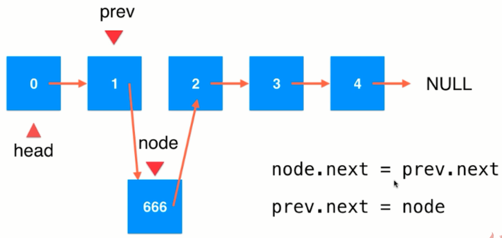

# 概述

实现基本的数据结构并掌握常用套路。

# 基础知识

## 位运算

- 如何用位运算得到最低位：x & ((~x)+1) = x 的最低位

    ```shell
    # 假设x是 0111
    ~x = 1000
    ~x + 1 = 1001
    x&(~x)+1 = 1000 & 1001 = 0001 # 与操作，相同才为1
    ```

- 如何用位运算得到最低位：x & (-x) = x 的最低位

    - -x = ~x + 1

- 数状数组

    ```shell
                  o
          o       o
      o   o   o   o
    1 2 3 4 5 6 7 8
    ```

    [树状数组详解 - Xenny - 博客园 (cnblogs.com)](https://www.cnblogs.com/xenny/p/9739600.html)


# 数组

## 数组基础

- 优点：查询快。scores[2]
- 最好应用于“索引有语意”的情况。
- 但并非所有语义的索引都适用于数组。

## 实现数组

# 链表

## 链表介绍

- 动态数据结构 
- 具有递归机制
- 辅助组成其他数据结构
- 数据存储在`节点（Node）`中

```java
class Node{
    E e;
    Node next;
}
```


- 优点：真正的动态，不需要处理固定容量的问题。
- 缺点：丧失了随机访问的能力。

## 数组与链表的对比

- 数组最好用于有索引有语意的情况
- 最大优点：支持快速查询
- 链表不适合用于索引有语意的情况
- 最大优点：动态

## 链表的操作

> 插入元素

- head指向当前链表的第一个节点（元素）


`node.next = head`

`head = node`

> 中间插入元素

- 找到待插入索引的前一个结点。
- 如，你要在索引为2的位置插入元素，则你只需要从head走1步，则当前点的next就是索引为2的点。



> 引入虚拟头节点进行操作更方便。

```java
package ds.list;

// 这个链表的实现 无虚拟头节点。
public class LinkedList<E> {
    private int size;
    // 指向链表的第一个元素
    private Node dummy;

    // 开始没有元素，所以是null。
    public LinkedList() {
        dummy = new Node();
        size = 0;
    }

    public int getSize() {
        return size;
    }

    public boolean isEmpty() {
        return size == 0;
    }

    public void addFirst(E e) {
        /**
         Node node = new Node(e);
         node.next = head;
         head = node;
         **/
        add(0, e);
        size++;
    }

    public void add(int index, E element) {
        if (index < 0 || index > this.size) throw new IllegalArgumentException("index should xx");
        // 如果是索引0插入的话。

        Node prev = dummy;
        for (int i = 0; i < index; i++) {
            prev = prev.next;
        }
        /**
         * Node node = new Node(element);
         * node.next = prev.next;
         * prev.next = node;
         **/
        prev.next = new Node(element, prev.next);
        size++;
    }

    public void print() {
        Node tmp = dummy;
        while (tmp != null) {
            System.out.format("%d\t", tmp.element);
            tmp = tmp.next;
        }
    }

    public static void main(String[] args) {
        LinkedList<Integer> list = new LinkedList<>();
        list.addFirst(1);
        list.addFirst(2);
        list.addFirst(3);
        list.add(2, 5);
        list.add(0, -1);
        list.print();
    }

    private class Node {
        public E element;
        public Node next;

        public Node(E element, Node next) {
            this.element = element;
            this.next = next;
        }

        public Node(E e) {
            this(e, null);
        }

        public Node() {
            this(null, null);
        }

        @Override
        public String toString() {
            return "Node{" +
                    "element=" + element +
                    ", next=" + next +
                    '}';
        }
    }
}
```

# 链表与递归

> 递归

- 本质上，将原来的问题，转化为更小的同一问题。
- 举例：数组求和。
    - Sum( arr[0...n-1] ) = arr[0] + Sum( arr[1...n-1] ) `<--` 更小的同一问题

```java
package ds.recursion;

public class Sum {
    public static int sum(int[] arr) {
        return sum(arr, 0);
    }

    // 计算arr[1...n]这个区间的所有数组的和
    private static int sum(int[] arr, int l) {
        // 递归边界
        if (l == arr.length) return 0;
        // 递归表达式
        return arr[l] + sum(arr, l + 1);
    }

    public static void main(String[] args) {
        int[] arr = {1, 2, 3, 4, 5, 5, 6, 7, 6, 6, 5, 5, 6};
        System.out.println(Sum.sum(arr));
    }
}
```

> 链表具有天然的递归结构


解决链表中删除元素的问题。

```java
class Solution {
    public ListNode removeElements(ListNode head, int val) {
        if (head == null)
            return head;
        // 分为head 和 head后面两部分。
        // 链表 = head + head后面的链表，删除值为val后的链表。一直递归。
        head.next = removeElements(head.next, val);
        return head.val == val ? head.next : head;
    }
}
```

> 递归函数的"微观"解读

入栈嘛。


# 二分搜索树

## 树结构

- 树结构，高效！


----


## 二叉树

- 动态数据结构

```java
class Node{
    E e;
    Node left;
    Node right;
}
```

- 二叉树
    - 有唯一的根节点
    - 天然的递归结构
        - 每个节点的左子树也是二叉树
        - 每个节点的右子树也是二叉树

## 二分搜索树

- 二分搜索树
    - 二分搜索树的每个节点的值大于左子树的所有节点的值，小于其右子树的所有节点的值。【左边值小，右边值大】
    - 每一颗子树也是二分搜索树。
    - 存储的元素必须有可比较性。‘
- 代码方面，以递归写法为主，非递归写法自行书写。
- BST的递归比非递归实现简单。

----

### 插入

- 默认不包含重复元素！
- 如果想包含重复元素的话，只需要定义：
    - 左子树小于等于节点；或者右子树大于等于节点
    - 注意：之前讲的数组和链表是可以有重复元素的

```java
public void add(E e) {
    root = add(root, e);
}

// 为空时，才创建。这样递归条件就少了。

private Node add(Node node, E e) {
    if (node == null) {
        size++;
        return new Node(e);
    }
    if (e.compareTo(node.e) < 0) {
        node.left = add(node.left, e);
    } else if (e.compareTo(node.e) > 0) {
        node.right = add(node.right, e);
    }
    return node;
}
```

### 查找

```java
public boolean contains(E e) {
    return contains(root, e);
}

private boolean contains(Node node, E e) {
    if (node == null) return false;
    if (e.compareTo(node.e) == 0) return true;
    else if (e.compareTo(node.e) < 0) {
        return contains(node.left, e);
    } else {
        return contains(node.left, e);
    }
}
```

### 遍历

```java
/**
 * 二叉树的前序遍历
 */
public void preOrder(Node node) {
    if (node == null) return;
    if (node != null) {
        System.out.println(node.e);
        preOrder(node.left);
        preOrder(node.right);
    }
}

/**
 * 二叉树的中序遍历
 */
public void midOrder(Node node) {
    if (node != null) {
        midOrder(node.left);
        System.out.println(node.e);
        midOrder(node.right);
    }
}

/**
 * 二叉树的中序遍历
 */
public void afterOrder(Node node) {
    if (node != null) {
        afterOrder(node.left);
        afterOrder(node.right);
        System.out.println(node.e);
    }
}
```

----

> 遍历图解

每个点都会被访问三次！前序是第一次就遍历！中序是第二次才遍历！后续是第三次才遍历！


----

前序遍历，第一次访问点时就遍历。中后同理。


### 删除


# 优先队列

