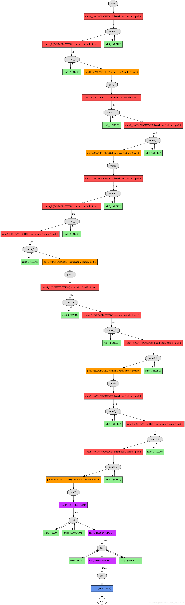
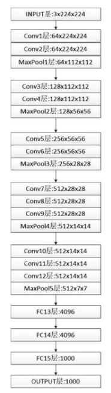

# VGGNet模型

==分类网络==

在VGGNet模型中统一了卷积中使用的参数，比如卷积核滑动窗口的高度和宽度统一为3×3，卷积核步长统一为1, Padding统一为1，等等。增加了卷积神经网络模型架构的深度，分别定义了16层的VGG16模型和19层的VGG19模型。一般深度更深，如果可以收敛的话，效果会更好，但是深层次的网络收敛难度大（梯度消失，梯度爆炸）.

黑盒子，，，，，，

- input的输入是规定大小的
- 卷积层的卷积核滑动窗口为3×3×3，步长为1, Padding为1
- MaxPool层的最大池化层的滑动窗口为2×2×64，步长为2
- 全连接层：进行扁平化处理，得到1 x 25088的数据。输出数据的维度要求是1×4096，所以需要一个维度为25088×4096的矩阵完成输入数据和输出数据的全连接，最后得到输出数据的维度为1×4096。为什么是变成4096呢？最开始那个用的4096所以一直沿用4096？？