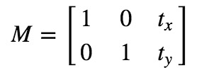

# OpenCV部分API解释

## 小白专用Demo

> **读取图片，显示图片，查看图片信息**

```python
class image_object:

    def __init__(self, pic_name, path='../img/'):
        self.pic_name = pic_name
        self.path = "../img/"
        self.pic_path = self.path + self.pic_name
        self.obj = cv.imread(self.pic_path)

    def show_img(self):
        cv.imshow(self.pic_name, self.obj)
        cv.waitKey()
        cv.destroyAllWindows()

    """获取图片的信息 宽 高 通道数"""

    def get_img_info(self):
        result = self.obj.shape
        print(result)

    """获取图片的信息 宽 高 通道数"""

    def change_img_info(self):
        pass


if __name__ == '__main__':
    obj = image_object("001.jpg")
    obj.show_img()
```

> **图片裁剪，颜色填充**

```python
import cv2 as cv
import numpy as np

"""不要想太多"""


class demo02:

    # 一些初始化操作
    def __init__(self, pic_name="001.jpg", path="../img/"):
        self.path = path
        self.pic_name = pic_name
        self.pic_path = self.path + self.pic_name
        self.obj = cv.imread(self.pic_path)

    def show_image(self):
        cv.imshow(self.pic_name, self.obj)
        # 防止图片一闪而过
        cv.waitKey()
        cv.destroyAllWindows()

    def image_info(self):
        # 高，宽，通道数,若图像非彩色则只返回高  宽
        H, W, C = self.obj.shape
        print(H, W, C)

    def pixel(self):
        print(self.obj.size)
        print(self.obj.dtype)

    # 生成和原图一样的空白图 然后颜色填充 作为分割效果
    def gene_blank_img(self):
        img = np.zeros(self.obj.shape, np.uint8)
        cv.imshow("11", img)
        cv.waitKey()
        cv.destroyAllWindows()

    # 访问图片的像素 为图像赋予颜色. 为像素进行分类后，可以通过hashmap映射到对应的像素点。 hashmap的计算方式
    # 写个测试demo，遍历一张标记好的图，为一张空白的图赋予颜色。
    def visit_pixel1(self):
        img = np.zeros((640, 640, 3), np.uint8)
        # 图像是二维的，但是有三个通道 BGR三色
        for i in range(20):
            for j in range(20):
                img[i, j] = (0, 0, 255)
        cv.imshow("11", img)
        cv.waitKey()
        cv.destroyAllWindows()

    # 通过切片 为图片赋值
    def visit_pixel2(self):
        img = np.zeros((640, 640, 3), np.uint8)
        img[0:100, 0:50] = (1, 2, 23)
        img[0:100, 70:100] = (2, 3, 23)
        cv.imshow("11", img)
        cv.waitKey()
        cv.destroyAllWindows()

    def visit_pixel3(self):
        img = np.zeros((640, 640, 3), np.uint8)
        img = 0
        cv.imshow("11", img)
        cv.waitKey()
        cv.destroyAllWindows()

    # opencv 为 BGR， 正常图像为RGB
    def split_channel(self):
        img = self.obj
        b, g, r = cv.split(img)
        merge = cv.merge([r, g, b])
        cv.imshow("blue", b)
        cv.imshow("green", g)
        cv.imshow("red", r)
        cv.waitKey()
        cv.destroyAllWindows()

    # 图片的缩放 放大 所需要的 策略不一样。
    def resize(self):
        new_obj = cv.resize(self.obj, (256, 256))
        cv.imshow("11", new_obj)
        cv.waitKey()
        cv.destroyAllWindows()

    # opencv 采用的 numpy存储的数据 所以可以将Numpy当做图像类型操作，操作之前还需进行类型转换，转换到int8类型
    def opencv_numpy(self):
        # 使用numpy方式创建一个二维数组
        img = np.ones((100, 100))
        # 转换成int8类型
        img = np.int8(img)
        # 颜色空间转换，单通道转换成多通道， 可选可不选
        img = cv.cvtColor(img)
        cv.imwrite("d.jpg", img)


if __name__ == '__main__':
    d2 = demo02("001.jpg")
    d2.opencv_numpy()
```

> **图片数据增强**

```python
import cv2 as cv
import matplotlib.pyplot as plt
import numpy as np
import torch

"""不要想太多"""


class demo03:

    # 一些初始化操作
    def __init__(self, pic_name="001.jpg", path="../img/"):
        self.path = path
        self.pic_name = pic_name
        self.pic_path = self.path + self.pic_name
        self.obj = cv.imread(self.pic_path)

    def show_image(self):
        print(self.obj)
        cv.imshow(self.pic_name, self.obj)
        # 防止图片一闪而过
        cv.waitKey()
        cv.destroyAllWindows()

    def image_info(self):
        # 高，宽，通道数,若图像非彩色则只返回高  宽
        H, W, C = self.obj.shape
        print(H, W, C)

    """图像平移变换"""

    def translational(self):
        rows, cols, channel = self.obj.shape
        M = np.float32([[1, 0, 100],
                        [0, 1, 50]])
        # x轴平移100 y轴平移50
        copy = cv.warpAffine(self.obj, M, (cols, rows))
        cv.imshow('img', copy)
        cv.waitKey()
        cv.destroyAllWindows()

    """等比缩放为原来的0.8倍"""

    def translational2(self):
        rows, cols, channel = self.obj.shape  # 原图的大小
        # 矩阵，用来缩放
        M = np.float32([[0.8, 0, 0],
                        [0, 0.8, 0]])
        # 图片缩放成原来的0.8倍
        copy = cv.warpAffine(self.obj, M, (int(cols * 0.8), int(rows * 0.8)))
        cv.imshow("11", copy)
        cv.imwrite("hello.png", copy)
        cv.waitKey()
        cv.destroyAllWindows()

    """旋转图片"""

    def rotate(self):
        self.obj = cv.resize(self.obj, dsize=(256, 256))
        cols, rows, channel = self.obj.shape
        M = cv.getRotationMatrix2D((cols / 2, rows / 2), 45, 1)
        print("rotate matrix M is : {}".format(M))
        warp = cv.warpAffine(self.obj, M, (cols, rows))
        cv.imshow("ss", warp)
        cv.waitKey()
        cv.destroyAllWindows()

    """仿射变换"""

    # 仿射变换是一种二维坐标到二维坐标之间的线性变换，并保持二维图形的“平直性”。转换前平行的线，在转换后依然平行。如下图
    def affine(self):
        rows, cols, channel = self.obj.shape
        pts1 = np.float32([[50, 50], [200, 50], [50, 200]])
        pts2 = np.float32([[10, 100], [200, 50], [100, 250]])
        M = cv.getAffineTransform(pts1, pts2)
        dst = cv.warpAffine(self.obj, M, (cols, rows))
        cv.imshow("123", dst)
        cv.waitKey()
        cv.destroyAllWindows()

    # 没什么用的测试
    def affine2(self):
        pic = np.random.randint(low=0, high=250, size=(255, 255, 3))
        print(pic)
        print(pic.shape)
        for i in range(50):
            for j in range(50):
                out = np.random.randint(low=100, high=255, size=1)
                pic[i, j] = (out, out, out)
        cv.imshow("1", np.int8(pic))
        cv.waitKey()
        cv.destroyAllWindows()

    """BRG <---> RGB"""

    def demo1(self):
        # BGR to RGB self.obj是BGR形式的
        rgb = self.obj[..., ::-1]
        plt.imshow(rgb)
        plt.show()
        # RGB tp BGR
        bgr = rgb[..., ::-1]
        plt.imshow(bgr)
        plt.show()
        # gbr = rgb[...,[2,0,1]]
        # r放在2号索引 g放在0号索引  b放在1号索引 rgb-->gbr
        gbr = rgb[..., [2, 0, 1]]

    def demo2(self):
        b, g, r = cv.split(self.obj)
        # numpy
        rgb1 = np.stack((r, g, b), axis=2)
        # torch
        rgb2 = torch.stack((torch.from_numpy(r), torch.from_numpy(g), torch.from_numpy(b)), dim=2)
        plt.figure()
        plt.imshow(rgb1)
        plt.figure()
        plt.imshow(rgb2)
        plt.show()

    def demo3(self):
        # 注意是 COLOR_BGRA2RGB  有A2!!! COLOR_BGRA2RGB = 3 3通道！
        ret = cv.cvtColor(self.obj, cv.COLOR_BGRA2RGB)
        plt.figure()
        plt.imshow(ret)
        plt.show()


if __name__ == '__main__':
    d1 = demo03("001.jpg")
    d1.demo3()
    # d1.show_image()
    # d1.image_info()  # 429*665*3
    # d1.piex()
    # d1.gene_blank_img()
    # d1.opencv_numpy()
    # d1.BRG_to_RGB01()
    # d1.BRG_to_RGB02()
    # d1.translational2()
    # d1.rotate()
    # d1.affine()
    # d1.affine2()
    # d1.BGR_to_RGB()
    # d1.show_image()
```


## reszie策略

细胞存在变形，所以细胞有所扭曲问题不大。

resize函数用来调整图像大小。

opencv提供五种方法供选择：

- 最近邻插值——INTER_NEAREST
- 线性插值  ——INTER_LINEAR；（默认值）<span style="color:red">适合放大,速度较快</span>
- 区域插值  ——INTER_AREA；(利用像素区域关系的重采样插值),<span style="color:red">适合缩小</span>
- 三次样条插值——INTER_CUBIC（超过4*4像素邻域内的双三次插值）<span style="color:red">适合放大,但是速度较慢</span>
- Lanczos插值——INTER_LANCZOS4（超过8*8像素邻域的Lanczos插值）

<span style="color:green">**一般来说要缩小图像用区域插值（INTER_AREA）；要放大图像一般用三次样条插值（INTER_CUBIC）或者线性插值（INTER_LINEAR）；**</span>

## 图像几何变换（★）

> **平移变换**

平移变换是物体位置的移动。如果知道 **（x，y）** 方向的偏移量，假设为 **(t_x,t_y)，则可以创建如下转换矩阵 M**：

看到下面那个图没有，计算方法很简单

$M * [x,y,1]^T得出的结果是$

$\left[ \begin{matrix} x+t_x \\ y+t_y \end{matrix} \right]$ 就是每个x、y的值平移多少。



```python
"""图像平移变换"""
def translational(self):
    # self.obj是已经读取到的图片对象
    # rows,clos = self.obj.shape[:2]
    rows, cols, channel = self.obj.shape
    M = np.float32([[1, 0, 100],
                    [0, 1, 50]]) # 100对应t_x 50 对应 t_y
    # x轴平移100 y轴平移50
    copy = cv.warpAffine(self.obj, M, (cols, rows))
    cv.imshow('img', copy)
    cv.waitKey()
    cv.destroyAllWindows()
```

> **等比缩放**

```python
"""等比缩放为原来的0.8倍"""
def translational2(self):
    rows, cols, channel = self.obj.shape  # 原图的大小
    # 矩阵，用来缩放,看那个计算的公式即可
    M = np.float32([[0.8, 0, 0],
                    [0, 0.8, 0]])
    # 图片缩放成原来的0.8倍 
    # dsize = (int(cols * 0.8), int(rows * 0.8))
    # dsize是输出图片的大小,有黑色部分没事，因为我们保存的是图片的真实大小
    copy = cv.warpAffine(self.obj, M, (int(cols * 0.8), int(rows * 0.8)))
    cv.imshow("11", copy)
    cv.imwrite("hello.png", copy)
    cv.waitKey()
    cv.destroyAllWindows()
```

> **旋转**

原理不清楚好吧，反正他会给我们算出M的大小

<a href="https://blog.csdn.net/hu_hao/article/details/105711592">值得参考的博客</a>

```python
"""旋转图片"""
def rotate(self):
    # 对图片进行裁剪
    self.obj = cv.resize(self.obj, dsize=(256, 256))
    # 可以只获取cols 和 rows self.ojb.shape[:2]
    cols, rows, channel = self.obj.shape
    # 第一个元组参数是用来确定旋转的中心点，/2大致就是以圆点为中心进行旋转，旋转45° scale=1,scale=0.5表示缩放到0.5倍哦！
    M = cv.getRotationMatrix2D((cols / 2, rows / 2), 45, 1)
    warp = cv.warpAffine(self.obj, M, (cols, rows))
    cv.imshow("ss", warp)
    cv.waitKey()
    cv.destroyAllWindows()
```

> **仿射变换**

<a href="https://www.cnblogs.com/happystudyeveryday/p/10547316.html">值得参考的博客</a>

<span style="color:red">**PS：**</span>将随机生成的数据通过OpenCV进行输出的时候，需要对数据进行类型转换，转为`np.int8`

不知道数学推导，只能说说大概的意思。

<span style="color:green">先确定三个点ABC，然后调整这三个点的位置到A~ B~ C~，我们可以找到一个变换，从A --> A~ , B-->B~ , C-->C~. 其它点的位置也会发生变化。【仿射变换，大概就这意思。】</span>

```python
"""仿射变换"""

# 仿射变换是一种二维坐标到二维坐标之间的线性变换，并保持二维图形的“平直性”。转换前平行的线，在转换后依然平行。如下图
def affine(self):
    rows, cols, channel = self.obj.shape
    pts1 = np.float32([[50, 50], [200, 50], [50, 200]])
    pts2 = np.float32([[10, 100], [200, 50], [100, 250]])
    M = cv.getAffineTransform(pts1, pts2)
    dst = cv.warpAffine(self.obj, M, (cols, rows))
    cv.imshow("123", dst)
    cv.waitKey()
    cv.destroyAllWindows()
```

----

## 通道转换 BRG <----> RGB

OpenCV的图像默认是按BRG通道读取的，正常图片是RGB三色，需要机械能转换，以下提供几种转换的Demo.

<span style="color:green">**提供多种是为了以后看得懂别人的代码哦！**</span>

```python
def demo1(self):
    # BGR to RGB self.obj是BGR形式的
    rgb = self.obj[..., ::-1]
    plt.imshow(rgb)
    plt.show()
    # RGB tp BGR
    bgr = rgb[..., ::-1]
    plt.imshow(bgr)
    plt.show()
    # gbr = rgb[...,[2,0,1]]
    # r放在2号索引 g放在0号索引  b放在1号索引 rgb-->gbr
    gbr = rgb[..., [2, 0, 1]]
```

```python
def demo2(self):
    b, g, r = cv.split(self.obj)
    # numpy
    rgb1 = np.stack((r, g, b), axis=2)
    # torch
    rgb2 = torch.stack((torch.from_numpy(r), torch.from_numpy(g), torch.from_numpy(b)), dim=2)
    plt.figure()
    plt.imshow(rgb1)
    plt.figure()
    plt.imshow(rgb2)
    plt.show()

```

```python
def demo3(self):
    # 注意是 COLOR_BGRA2RGB  有A2!!! COLOR_BGRA2RGB = 3 3通道！
    ret = cv.cvtColor(self.obj, cv.COLOR_BGRA2RGB)
    plt.figure()
    plt.imshow(ret)
    plt.show()
```

----

# 一个没什么用的Demo

## 安裝

ubuntu环境【这个安装好麻烦】

```shell
conda install -c https://conda.anaconda.org/menpo opencv 
```

pip install opencv-python  

pip install opencv-contrib-python  识别物体用的

opencv官网下载安装 https://nchc.dl.sourceforge.net/project/opencvlibrary/4.4.0/opencv-4.4.0-vc14_vc15.exe

直接看视频写个Demo

检测图片中的人脸

```python
import cv2 as cv

CV_URL = "D:\Program Files\opencv\opencv\sources\data\haarcascades\haarcascade_frontalface_default.xml"

class demo:
    def __init__(self, img_src):
        self.img = cv.imread(img_src)

    # 先要获取人脸特征 再进行检测
    # 提取出图像的细节【特征】，用两个图像对应特征的欧式距离来度量相似度
    def face_detection(self):
        gray = cv.cvtColor(self.img, code=cv.COLOR_BGR2GRAY)
        face_obj = cv.CascadeClassifier(CV_URL)
        faces = face_obj.detectMultiScale(gray)
        for x, y, w, h in faces:
            cv.rectangle(self.img, (x, y), (x + w, y + h), color=(0, 255, 0), thickness=2)
        cv.imshow('result', self.img)
        cv.waitKey(0)
        cv.destroyAllWindows()


if __name__ == '__main__':
    d = demo('gray_img.jpg')
    d.face_detection()
```

检测图片中的多张人脸

````python
import cv2 as cv

CV_URL = "D:\Program Files\opencv\opencv\sources\data\haarcascades\haarcascade_frontalface_default.xml"

class demo:
    def __init__(self, img_src):
        self.img = cv.imread(img_src)

    # 先要获取人脸特征 再进行检测
    # 提取出图像的细节【特征】，用两个图像对应特征的欧式距离来度量相似度
    def face_detection(self):
        gray = cv.cvtColor(self.img, code=cv.COLOR_BGR2GRAY)
        face_obj = cv.CascadeClassifier(CV_URL)
        faces = face_obj.detectMultiScale(gray, scaleFactor=1.005, minNeighbors=3, maxSize=(88, 88), minSize=(24, 24))
        for x, y, w, h in faces:
            cv.rectangle(self.img, (x, y), (x + w, y + h), color=(0, 255, 0), thickness=2)
            cv.circle(self.img, center=(int(x + w / 2), int(y + h / 2)), radius=int(w / 2), color=(255, 0, 0))
            print(w, h)
        cv.imshow('result', self.img)
        cv.waitKey(0)
        cv.destroyAllWindows()

if __name__ == '__main__':
    d = demo('mult_face.jpg')
    d.face_detection()
````

检测视频中的人脸

```python
import cv2 as cv

CV_URL = "D:\Program Files\opencv\opencv\sources\data\haarcascades\haarcascade_frontalface_default.xml"

def face_detection(img):
    gray = cv.cvtColor(img, code=cv.COLOR_BGR2GRAY)
    face_obj = cv.CascadeClassifier(CV_URL)
    faces = face_obj.detectMultiScale(gray)
    for x, y, w, h in faces:
        cv.rectangle(img, (x, y), (x + w, y + h), color=(0, 255, 0), thickness=2)
    cv.imshow("result", img)

c_video = cv.VideoCapture("face.mp4")
while True:
    flag, frame = c_video.read()
    if not flag:
        break
    face_detection(frame)
    if ord('q') == cv.waitKey(10):
        break
cv.destroyAllWindows()
c_video.release()
```

# OpenCV与PyTorch

## 内容概述

在 PyTorch 中，对张量 (Tensor) 进行拆分通常会用到两个函数：

-  torch.split [按块大小拆分张量]
-  torch.chunk [按块数拆分张量]

而对张量 (Tensor) 进行拼接通常会用到另外两个函数：

-  torch.cat    <span style="color:green">**[按已有维度拼接张量]**</span>
-  torch.stack <span style="color:green">**[按新维度拼接张量]**</span>

张量的升维和降维

- torch.unsequeeze  <span style="color:green">**[升高维度一般式unsequeeze(0)]**</span>
  - 大致意思就是原来的shape = （2，2）
  - unsequeeze(0) 后 shape = （1，2，2）
  - <span style="color:green">**unsqueeze（arg）是增添第arg个维度为1，以插入的形式填充**</span>
- torch.sequeeze
  - <span style="color:green">**squeeze（arg）是删除第arg个维度(如果当前维度不为1，则不会进行删除)**</span>
  - 这样是为了防止删除数据

## numpy与tensor的转换

OpenCV用到了numpy存储图像的数据！

```python
import torch
import numpy as np

class demo01:
    def __init__(self):
        self.data_np = np.array([1, 2, 3, 4, 5, 6])
        self.data_ts = torch.tensor([1, 2, 3, 4, 5, 6])

    def numpyToTensor(self):
        out = torch.from_numpy(self.data_np)
        print("numpy to tensor {}\t the data is {}".format(type(out), out))

    def tensorToNumpy(self):
        out = self.data_ts.numpy()
        print("tensor to numpy {}\t the data is {}".format(type(out), out))


if __name__ == '__main__':
    d1 = demo01()
    d1.numpyToTensor()
    print("**" * 20)
    d1.tensorToNumpy()
```

## cat拼接

```python
import torch as t

"""
cat 中 dim = 0 的意思是这样的,在shape 索引为0的地方进行扩展
比如原始数据的shape=(1,3,5)
cat((data1,data1), 0) dim = 0 的意思是(1,3,5)中索引为0的那维度进行扩张，最后变成shape=(2,3,5)
cat((data1,data1), 1) dim = 1 的意思是(1,3,5)中索引为1的那维度进行扩张，最后变成shape=(1,4,5)
"""


class catDemo:
    def __init__(self):
        self.data1 = t.tensor([1, 1, 1, 1])
        self.data2 = t.tensor([[2, 2, 2, 2]])
        self.data3 = t.tensor([[[3, 3, 3, 3]]])

    def cat1(self):
        print(self.data1.shape)
        ret = t.cat((self.data1, self.data1), dim = 0)
        print(ret)
        print(ret.shape)

    def cat2(self):
        print(self.data2.shape)
        ret = t.cat((self.data2, self.data2), dim = 0)
        print(ret)
        print(ret.shape)

    def cat3(self):
        print(self.data3.shape)
        ret = t.cat((self.data3, self.data3), dim = 1)
        print(ret)
        print(ret.shape)


"""
cat 中 dim = 0 的意思是这样的,在shape 索引为0的地方进行扩展
比如原始数据的shape=(1,3,5)
cat((data1,data1), 0) dim = 0 的意思是(1,3,5)中索引为0的那维度进行扩张，最后变成shape=(2,3,5)
cat((data1,data1), 1) dim = 1 的意思是(1,3,5)中索引为1的那维度进行扩张，最后变成shape=(1,4,5)
"""
if __name__ == '__main__':
    cat = catDemo()
    cat.cat1()
    print("=" * 20)
    cat.cat2()
    print("=" * 20)
    cat.cat3()
    print("=" * 20)
```

## stack拼接

```python
import torch as t

"""来补一下stack的操作，写代码的时候遇到过，继续捡起来"""
"""stack按新维度进行拼接张量"""
"""
来看看合并的规则
    data shape is [4]
    out = t.stack( (data,data),dim=0 )
    out shape is [ 2 , 4 ] 在第0维进行维度扩充
    
    out = t.stack( (data,data),dim=1 )
    out shape is [ 4, 2 ] 在第1维进行维度扩充
    
    data shape is [ 1 ,4 ]
    out = t.stack( (data,data),dim=0 )
    out shape is [ 2 , 1 , 4 ] 在第0维进行维度扩充
    
    out = t.stack( (data,data),dim=1 )
    out shape is [ 1 , 2 , 4 ] 在第1维进行维度扩充
    
    out = t.stack( (data,data),dim=2 )
    out shape is [ 1 , 4, 2 ] 在第1维进行维度扩充
    
    原shape= (1,1) 那么dim最大为2（0,1,2）
"""


class stackDemo:

    def __init__(self):
        self.data1 = t.tensor([1, 1, 1, 1])
        self.data2 = t.tensor([[2, 2, 2, 2]])
        self.data3 = t.tensor([[[3, 3, 3, 3]]])

    def stack1(self):
        print(self.data1.shape)
        out = t.stack((self.data1, self.data1), dim=0)
        print(out.shape)

    def stack2(self):
        print(self.data1.shape)
        out = t.stack((self.data1, self.data1), dim=1)
        print(out.shape)

    def stack3(self):
        print(self.data2.shape)
        out = t.stack((self.data2, self.data2), dim=2)
        print(out.shape)


if __name__ == '__main__':
    s1 = stackDemo()
    s1.stack1()
    print("=" * 50)
    s1.stack2()
    print("=" * 50)
    s1.stack3()
```

## unsequeeze&sequeeze

```python
"""torch升维 减维"""
import torch as t

"""升维的方式 和 stack 基本一样"""

class unsqueezeDemo:
    def __init__(self):
        self.dim1 = t.tensor([1, 1, 1])
        self.dim2 = t.tensor([[1, 1, 1], [2, 2, 2]])
        self.dim3 = t.tensor([[[1, 1, 1], [2, 2, 2], [3, 3, 3]]])

    def un1(self):
        print(self.dim1.shape)  # (3)
        self.dim2.squeeze()
        out = self.dim1.unsqueeze(0)
        print(out.shape)  # (1,3)

    def un2(self):
        print(self.dim1.shape)  # (3)
        out = self.dim1.unsqueeze(1)
        print(out.shape)  # (1,3)

    def un3(self):
        print(self.dim2.shape)  # (3)
        out = self.dim2.unsqueeze(2)
        print(out.shape)  # (1,3)

    def se1(self):
        print("dim2.shape is {}\t dim2 data is {}".format(self.dim3.shape, self.dim3))
        """要删除的第0个维度 维度为1 可以删除"""
        out = self.dim3.squeeze(0)
        print("dim2.shape is {}\t dim2 data is {}".format(out.shape, out))

if __name__ == '__main__':
    d = unsqueezeDemo()
    d.se1()
```

