# 随记

> 数据标注工具

库：`labelimg`

> 采用的文件格式

- `xml`
- `json`
- `yaml`

> 均值滤波器

- 存在边缘模糊的情况
- 适用于处理随机噪声

> `sklearn`官网

<a href="[scikit-learn: machine learning in Python — scikit-learn 0.23.2 documentation (scikit-learn.org)](https://scikit-learn.org/stable/)">sklearn官网</a>

# 一、机器学习基础

> **按可解决的问题**

## 1.1 分类问题

- 二分类问题：是xx，不是xx；两种情况
- 多分类问题：多种情况可供选择
- 多标签分类：

一些算法只支持完成二分类的任务

但是多分类的任务可以转换为二分类的任务

有一些算法天然可以完成多分类任务

## 1.2 回归任务

> 结果是一个连续数字的值，而非一个列表

如房屋价格；市场分析；学生成绩；股票价格

有些算法只能解决回归问题

有些算法只能解决分类问题

有一些算法的思路既能解决回归问题，又能解决分类问题。

一些情况，回归任务可以简化为分类任务

> **机器学习算法分类**

## 1.3 监督学习

> 机器的训练数据拥有==标记==或==答案==

## 1.4 非监督学习

> 对==没有标记==的数据进行分类 - 聚类分析

- 对数据进行降维处理，方便可视化。
- 特征提取：信用卡的信用评级和人的胖瘦无关？
- 特征压缩：`PCA`

可用来对异常数据进行检测。

## 1.5 半监督学习

> 一部分数据有标记或答案，另一部分数据没有

各种原因产生的标记缺失。

通常先使用无监督学习手段对数据做处理，之后使用监督学习手段做模型的训练和预测。

## 1.6 增强学习

> 根据周围环境的情况，采取行动，根据采取行动的结果，学习行动方式。

- 无人驾驶
- 机器人

监督学习和半监督学习是基础！

> **从其他维度看机器学习的分类方式**

## 1.7 在线学习和批量学习（离线学习）

**批量学习**：只用当时输入的学习资料进行学习，之后的使用，该算法模型都不会变化。

优点：简单

问题：如何适应环境变化

解决方案：定时重新批量学习

缺点：每次重新批量学习，运算量巨大；在某些环境变化非常快的情况下，甚至不可能。

----

**在线学习**：输入的样例以学习资料的形式迭代进学习算法中，还在不断训练算法。

优点：及时反映新的环境变化

问题：新的数据带来不好的变化？

解决方案：需要加强对数据进行监控

其他：也适用于数据量巨大，完全无法批量学习的环境。

## 1.8 参数学习和非参数学习

**参数学习**：一旦学到了参数，就不再需要原有的数据集。

如通过学习，得到了一个方程，将x带入就可以得到y了。

**非参数学习**：不对模型进行过多假设；非参数不等于没参数！

## 1.9 哲学思考

没有免费的午餐定理：可以严格地数学推导出，任意两个算法，他们的期望性能是相同的！

具体到某个特定问题，有些算法可能更好。

但是没有一种算法，绝对比另一种算法好。

脱离具体问题，谈那个算法好是没有意义的。

在面对一个具体问题的时候，尝试使用更多种算法进行对比实验，是必要的。

## 2.0 环境搭建

- 安装anaconda
- 直接在cmd下输入”jupyter notebook”,系统将自动弹出notebook窗口。【我之前安装过】
- 如果选择其他盘的话，先进入xx盘，再执行命令！

使用的主要三方库

`numpy；matplotlib；sklearn；pandas`

# 二、基本`API`/工具使用

## 1.1 `jupyter`的使用

Run cells 运行代码

添加单元格 a，向前添加；b，向后添加；光标要蓝色的时候哦！

按m变成markdown语法，按y变成code；也要在蓝色光标下哦！

## 1.2 `Jupyter`魔法命令

- `%run py`文件的目录，将该python文件加载进了`jupyter notebook`

- `%timeit` 后面接语句

  - `%timeit L = [i**2 for i in range(1000)]` 测试一句话的运行效率

  - `%%time` 程序段；测试一段程序的效率

    ```python
    %%timeit
    L = []
    for n in range(1000):
        L.append(n**2)
    ```

- `%time L = [i**2 for i in range(1000)]` 测试一句话的运行效率，只测了一次！

- 其他魔法命令 `%lsmagic`

- %run?

  - 看run的命令文档

## 1.3`numpy`的基本使用

### 1.3.1 `numpy.array`基础

> **生成array对象**

```python
# 查看版本
numpy.__version__
# python的list是一个对类型不做具体限定的；list种每个元素可以是不同元素；缺点是效率低，对于每个元素都要检测是什么类型。
# array则元素类型要统一
import array
arr = array.array('i',[i for i in range(10)])
# output array('i',[0,1,2,3,4,5,6,7,8,9])

# numpy.array
nparr = np.array([i for i in range(10)])
# output array([0,1,2,3,4,5,6,7,8,9])
```

> **查看array中的元素类型**

```python
# 且array中的类型要一致
nparr.dtype # 查看类型，会有隐式的类型转换
```

> **创建指定值和形状的矩阵**

```python
# 创建大小为10的全是0的数组；默认是float64
np.zeros(10)

# 创建int类型
np.zeros(10,dtype=int)

# 创建三行五列，值为0的矩阵
np.zeos((3,5))
np.zeros(shape=(3,5),dtype=int)

# 创建元素全为1的
np.ones(10)

# 创建三行五列；元素全为1
np.ones(shape=(3,5))

# 创建为指定值的,若fill_value=666.0则为浮点型
np.full(shape=(3,5),fill_value=666)


```

>**按步长创建array**

```python
# arange
# 创建0-20且步长为2的一个列表
[i for i in range(0,20,2)]
# 意思同上，不过步长可为浮点数
np.arange(0,20,2)

#linspace
# 从0-20截取 10个数构成等差数列 范围[0-20]
np.inspace(0,20,10)
```

> **用随机数创建array对象**

```python


#random
# 生成一个0-10的随机数；不包括10
np.random.randint(0,10)
# 生成 10 个4-8的随机数
np.random.randint(4,8,size=10)
# 生成一个3*5的矩阵
np.random.randint(4,8,size=(3,5))

# 设置随机种子
np.random.seed(666)
# 这样生成的随机数就是一样的了

# 生成浮点数,默认是0-1，不包括1
np.random.random(10)
```

> **创建符合正态分布的array**

```python
# 生成符合正态分布的浮点数
np.random.normal()
# 生成均值为10，方差为100的随机数
np.random.normal(10,100)
# 指定shape
np.random.normal(10,100,(3,5))
```

> **查看文档，查阅用法**

```python
# 查看对应方法的文档
np.random.normal?
```

> **array的基本属性**

```python
# 15个元素，并reshape为3*5的矩阵
x = np.arange(15).reshape(3,5)

# 维数，几维数组
x.ndim

# 形状，返回的是元组
x.shape

# 元素数目
x.size
```

> **array的数据访问**

```python
x[0][0] # 不推荐
x[2,2] # 推荐
x[0:5] # 切片 从0-5，不包括5
x[5:] # 从5到最后
x[::2] # 开始到结尾 步长为2
x[::-1] # 倒序访问
x[:2,:3] # 前两行，前三列
x[:2,::2] # 前两行，列步长为2
x[::-1,::-1] # 全部访问
x[:,0] # 取所有行，每列只取索引为0的

python的list创建的切片是一个新的矩阵！但是在numpy中切片用的是矩阵！
# 创建不相关的矩阵
subX = x[:2,:3].copy()
```

> **array的Reshape**

```python
# 变成2*5的矩阵，但是x本身不会改变
A = x.reshape(2,5)

# x=[0,1,2,3,4,5]变成 6行，每行只有一列的数据;x是不会改变的哦 -1表示列数有函数自己处理
A = x.reshape(6,-1)
```

> **array的合并操作**

```python
x = np.array([1,2,3,4])
y = np.array([4,3,2,1])
A = np.concatenate([x,y])
print(A)
#output: [1 2 3 4 4 3 2 1]

# 按列拼接
print(np.concatenate([A,A],axis=1))
"""
[[1 2 3 1 2 3]
 [4 5 6 4 5 6]]
"""

# 不同维度拼接
z = np.array([i for i in range(5)])
a = np.full(shape=(3,5),fill_value=5)
np.concatenate([a,z.reshape(1,-2)])
"""
array([[5, 5, 5, 5, 5],
       [5, 5, 5, 5, 5],
       [5, 5, 5, 5, 5],
       [0, 1, 2, 3, 4]])
"""
# 垂直叠加 （行顺序） vertical 垂直
np.vstack([a,z])
# 水平叠加 （列顺序） horizontal 水平
np.hstack([x,y])
```

> **array的分割操作**

```python
x = np.array([2,35,345,23,345,56,123,445,66,778,89])
# 切成3段
x1,x2,x3 = np.split(x,[3,7])
# x1 = [  2  35 345]
# x2 = [ 23 345  56 123]
# x3 = [445  66 778  89]
```

```python
A = np.arange(16).reshape(4,4)
# 以索引2为点，进行分割
A1,A2 = np.split(A,[2])
print(A1)
"""
默认以行为维度
[[0 1 2 3]
 [4 5 6 7]]
"""
# axis 默认为0，以行；axis = 1 以列
A1,A2 = np.split(A,[2]，axis=1)
```

```python
# 垂直叠加 （行顺序）
up,down = np.vsplit(A,[2])
# 水平叠加 （列顺序）
left,right = np.hsplit(A,[2])
```

### 1.3.2 array的运算

> 不同于list，它支持直接加减乘除

```python
A = np.arange(16).reshape(4,4)
A+3
array([[ 3,  4,  5,  6],
       [ 7,  8,  9, 10],
       [11, 12, 13, 14],
       [15, 16, 17, 18]])
# 求3的x次方
np.power(3,x)
# 以e为底
np.log(x)
# 以2为底
np.log2(x)
```

> **矩阵运算**

```python
# 矩阵A*B的结果
A.dot(B)
# 求转置
A.T
# 
```

> **向量和矩阵的运算**

```python
v = np.array([1,2])
A = ([[0,1],
      [2,3]])
v + A
array([[1,2],
       [3,4]])
# 这样计算不合理，可以先把向量填充成矩阵哦！
np.vstack([v] * A.shape[0])
# shape[0] 多少行，shape[1] 多少列
np.vstack([v]*A.shape[0]) + A
# v的行向量堆叠2次，列向量堆叠1次
np.tile(v,(2,1))
"""
v = [1,2]
A = [[0,1],
	[2,3]]
"""
v.dot(A)
[1,2] * [0,1],  = [4,7]
		[2,3]
# output [4,7]

# 会自动判别那个乘法符合
A.dot(v)
[0,1], * [1] = [2]
[2,3]	 [2]   [8]
```

> **矩阵的逆**

```python
np.linalg.inv(A)
```

> **伪逆矩阵**

```python
pinvX = np.linalg.pinv(x)# x是8*2的矩阵
```

### 1.3.3 聚合操作

> 一组值变成一个值

```python
L是np创建的矩阵
np.sum(L)
# axis=0代表行，沿着行这个维度进行计算
np.sum(x,axis=0)
# axis=1代表列，沿着列这个维度进行计算
np.sum(x,axis=1)

# x中所有元素的乘积
np.prod(x)
# x中所有元素+1 然后再计算乘积
np.prod(x+1)
# 平均值
np.mean(x)
# 中位数
np.median(x)
# 求百分位
np.percentile(x,q=50)
# 求方差
np.var(x)
# 求标准差
x = np.std(x)
```

### 1.3.4 `arg运算`

```python
# x中最小数所在的索引
np.argmin(x)
# 同理xxx
np.argmax(x)
```

> **排序和索引**

```python
x = np.arange(16)
np.random.shuffle(x)
# 返回一个排好序的数组
np.sort(x)
# 对数组本身进行排序
x.sort()

# 对二维数组而言，是对每一行中的元素进行排序
np.sort(mirx,axis=0)
np.sort(mirx,axis=1)

# 排序后返回所有元素的索引位置
np.argsort(x)
```

```python
# 大于3的放左边，小于三的放右边
np.partition(x,3)
# 返回的是索引
np.argpartition(x,3)
# 按x还是y进行排序
np.argsort(x,axis=1)
```

### 1.3.5 比较和`fancyindex`

```python
index = [3,5,8]
list = [i**2 for i in range(100)]
list = np.array(list)
# 访问索引为 3 5 8的元素
list[index]
```

```python
row = np.array([0,1,2])
col = np.array([0,1,2])
x = np.array([i for i in range(16)]).reshape(4,4)
# 得到了[0,0] [1,1] [2,2]位置的数据
x[row,col]
```

> **存放布尔值的数组**

```python
col = [True,True,False,False]
# 意思时x坐标满足切片1:3,y取值为Treu表示对该数据感兴趣
x[1:3,col]
"""
array([[4, 5],
       [8, 9]])
"""
```

> **大小比较**

```python
x = np.array([1,2,3,4,5,56,7,8])
# 把x中所有的元素与3比较，得到一个布尔数组
x<3 
```

> **统计非0个数**

```python
np.count_nonzero(x)
```

> **是否有0**

```python
np.any(x==0)
```

> **是所有元素都符合条件【为True】**

```python
np.all(x>0)
# 沿着列的方向，看每一行是否都大于0
np.all(x>0,axis=1)
```

> **统计符合要求的元素**

```python
np.sum(x%2,axis=0)
# 不是&&，使用的是位运算。我们需要的是对应索引的元素的比较。索引为1的，看它是否大于3小于10
np.sum( (x>3) & (x<10) )
np.sum( (x%2==0) | (x>10) )
np.sum( ~(x==0) )
```

> **布尔数组作为索引**

```python
x[x<5]
x[x%2==0]
```

# 三、`matplotlib`

> **基本使用**

```python
import matplotlib.pyplot as mpl
import numpy as np
line = np.linspace(1,50,200)
value = np.sin(line)
# 绘制折线图
mpl.plot(line,value)
mpl.show()
```

> **一个表绘制多个图**

```python
mpl.plot(line,value1)
mpl.plot(line,value2)
```

> **改变颜色和线条样式**

```
'b'	蓝色
'g'	绿色
'r'	红色
'c'	青色
'm'	品红色
'y'	黄色
'k'	黑色
'w'	白色
```

----

```
'-'	实线样式
'--'	短横线样式
'-.'	点划线样式
':'	虚线样式
```

> **限制坐标轴范围**

```python
mpl.plot(line,value1)
mpl.plot(line,value2)
mpl.xlim(0,15)
# x范围-11~11 y范围 -2~11
# mpl.axis([-1,11,-2,11])
mpl.show()
```

> **设置x，y的`lable`**

```python
mpl.plot(line,value1)
mpl.plot(line,value2)
mpl.xlable("x xxx")
# 加上图示
mpl.legend()
# 加上标题
mpl.title("welcome to the ml world!")
mpl.show()
```

> **绘制散点图**

```python
# 一般二维特征用散点图
mpl.scatter(x,sinx)
plt.show()
```

> **绘制标准正态分布散点图**

```python
import matplotlib.pyplot as plt
import numpy as np
x = np.random.normal(0,1,1000)
y = np.random.normal(0,1,1000)
# 设置半透明
plt.scatter(x,y,alpha=0.5)
plt.legend()
plt.xlabel('x axis')
plt.ylabel('y axis')
```

## 1.4 数据加载

```python
import numpy as np
import matplotlib.pyplot as plt
from sklearn import datasets

iris = datasets.load_iris()
iris.keys()
# output dict_keys(['data', 'target', 'target_names', 'DESCR', 'feature_names', 'filename'])

# 数据集描述
iris.DESCR
# 数据集特征的名称
iris.feature_names
# 数据集的标记
iris.target
iris.target.shape
# 数据集标记的含义
iris.target_names

x = iris.data[:,:2]
plt.scatter(x[:,0],x[:,1])

y = iris.target
# 绘制散点图
# 筛选出符合y==0的xxx
plt.scatter(x[y==0,0],x[y==0,1],color='red')
plt.scatter(x[y==1,0],x[y==1,1],color='blue',marker='+')
plt.scatter(x[y==2,0],x[y==2,1],color='black')
```

# 四、`KNN`算法

回顾：什么是机器学习

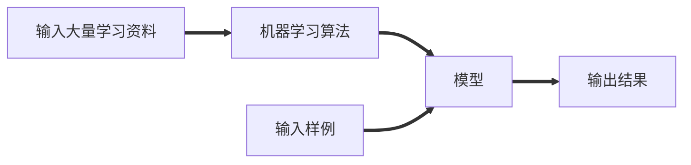

> **K近邻算法**

- 计算欧式距离，并存入数组
- 将距离数组进行排序，并得到排序后的索引数组
- 求距离样本最近的K个点
- 统计这k个点中，什么类别最多
- 该类别就是分类结果

`KNN`算法非常特殊，可认为是没有模型的算法

为了和其他算法统一，可以认为训练数据集就是模型本身！

## 4.1 手写`KNN`

```python
import numpy as np
import matplotlib.pyplot as plt
from math import sqrt
from collections import Counter

# 数据集
raw_data_x = [
             [3.3333,2.3333],
             [3.1111,1.1781],
             [1.3456,3.3686],
             [3.5822,4.6791],
             [2.2800,2.8666],
             [7.4234,4.6965],
             [5.7450,3.5339],
             [9.1711,2.5111],
             [7.7927,3.4240],
             [7.9398,0.7916]
            ]
# 数据集对应的标记
raw_data_y = [0,0,0,0,0,1,1,1,1,1]

#转为numpy的array对象 方便计算
x_train = np.array(raw_data_x)
y_train = np.array(raw_data_y)

# 绘制散点图预览数据
# numpy的布尔切片
plt.scatter(x_train[y_train==0,0],x_train[y_train==0,1],color='g')
plt.scatter(x_train[y_train==1,0],x_train[y_train==1,1],color='r')
plt.show();

# 待分类的点
wait = np.array([8.997,3.456])
# 存储计算出的欧式距离
distance = []

for x in x_train:
    # 求每个二维向量的欧式距离
    # 相当于 [(x[0]-wait[0])^2 +(x[1]-wait[1])^2]^(1/2)
    d = sqrt(np.sum((x-wait)**2))
    distance.append(d)
# 列表生成式的写法 可替代上面的for循环
# distance=[sqrt(np.sum((x-wait)**2)) for x in x_train]
# 距离wati从近到远的点
nearest = np.argsort(distance)

# 对distance进行排序，并返回原序列的索引 
# 排序规则：距离wati从近到远的点
nearest = np.argsort(distance)
# 假设KNN中的K为6
k = 6
# 求距离wait最近的6个点
topK_y = [y_train[i] for i in nearest[:k]]
# 统计相同值出现的次数
votes = Counter(topK_y)
# 查看频次前x的几个
votes.most_common(1) # [(1, 5)]
# 存储预测结果
predict_y = votes.most_common(1)[0][0]
```

## 4.2 `sklearn`的`knn`

```python
from sklearn.neighbors import KNeighborsClassifier
import numpy as np
knn = KNeighborsClassifier(n_neighbors=6)

# 初始数据
row_x_data = [
             [3.3333,2.3333],
             [3.1111,1.1781],
             [1.3456,3.3686],
             [3.5822,4.6791],
             [2.2800,2.8666],
             [7.4234,4.6965],
             [5.7450,3.5339],
             [9.1711,2.5111],
             [7.7927,3.4240],
             [7.9398,0.7916]
            ]
row_y_data = [0,0,0,0,0,1,1,1,1,1]

# 处理数据
x_train = np.array(row_x_data)
y_train = np.array(row_y_data)
# 待分类数据 sklearn要求传入矩阵我们把向量改成矩阵 -1表示有函数自己决定列数
wait = np.array([8.997,3.456]).reshape(1,-1)
# 训练算法
knn.fit(x_train,y_train)
# 得到预测结果
knn.predict(wait)
```

## 4.3 模仿`sklearn`封装`KNN`

```python
import numpy as np
from math import sqrt
from collections import Counter
from .metrics import accuracy_score

class KNNClassifier:

    def __init__(self, k):
        """初始化kNN分类器"""
        assert k >= 1, "k must be valid"
        self.k = k
        self._X_train = None
        self._y_train = None

    def fit(self, X_train, y_train):
        """根据训练数据集X_train和y_train训练kNN分类器"""
        assert X_train.shape[0] == y_train.shape[0], \
            "the size of X_train must be equal to the size of y_train"
        assert self.k <= X_train.shape[0], \
            "the size of X_train must be at least k."

        self._X_train = X_train
        self._y_train = y_train
        return self

    def predict(self, X_predict):
        """给定待预测数据集X_predict，返回表示X_predict的结果向量"""
        assert self._X_train is not None and self._y_train is not None, \
                "must fit before predict!"
        assert X_predict.shape[1] == self._X_train.shape[1], \
                "the feature number of X_predict must be equal to X_train"

        y_predict = [self._predict(x) for x in X_predict]
        return np.array(y_predict)

    def _predict(self, x):
        """给定单个待预测数据x，返回x的预测结果值"""
        assert x.shape[0] == self._X_train.shape[1], \
            "the feature number of x must be equal to X_train"

        distances = [sqrt(np.sum((x_train - x) ** 2))
                     for x_train in self._X_train]
        nearest = np.argsort(distances)

        topK_y = [self._y_train[i] for i in nearest[:self.k]]
        votes = Counter(topK_y)

        return votes.most_common(1)[0][0]

    def score(self, X_test, y_test):
        """根据测试数据集 X_test 和 y_test 确定当前模型的准确度"""
        y_predict = self.predict(X_test)
        return accuracy_score(y_test, y_predict)

    def __repr__(self):
        return "KNN(k=%d)" % self.k
```


# 五、算法性能

## 5.1 判断算法性能

我们需要判断算法的性能，所以需要对训练的数据集进行进一步的划分。

- 可划分了train set 和 validation set. 
- 进行随机划分，比例一般为`9:1`或者`8:2`或者`7:3`

`sklearn`采用的数据集和package

- `from sklearn datasets`
- `from sklearn.neighbords import KNeighborsClassifier`

训练数据和测试数据的划分。

```python
import numpy as np
import matplotlib.pyplot as plt
from sklearn import datasets
from sklearn.neighbors import KNeighborsClassifier

# 加载数据集
iris = datasets.load_iris()
# 获得数据和标记
x = iris.data
y = iris.target

# 将数据集中的索引随机排列，方便划分训练集和测试集
shuffle_index = np.random.permutation(len(x))

# 设置测试集的比例
test_ration = 0.2
test_size = int(len(x)*test_ration)

# 得到划分的索引
test_index = shuffle_index[:test_size]
train_index = shuffle_index[test_size:]

# 用索引进行切片，获得数据
x_train = x[train_index] # 原始数据
y_train = y[train_index] # 原始数对应的label
x_test = x[test_index]
y_test = y[test_index]

knn = KNeighborsClassifier(n_neighbors=6)
knn.fit(x_train,y_train)
y_predict = knn.predict(x_test)
# 统计预测值符合真实值的比例
np.sum(y_predict==y_test)/len(y_test)
```

## 5.2 `sklearn`的划分

```python
from sklearn.model_selection import train_test_split
# test_size 测试集所占的比例  random_state是随机数种子
x_train,x_test,y_train,y_test = train_test_split(x,y,test_size=0.2,random_state=666)
```

## 5.3 分类的准确度

测试集中的结果与期望结果的对比，并统计符合预期的结果，把符合预期的结果/总的测试结果。

简而言之：符合预期/总数

> **`sklearn`中的划分**

```python
from sklearn.metrics import accuracy_score
# y_pretice是预测的结果 y_test是测试集的正确结果 顺序无所谓！
accuracy_score(y_pretice,y_test)
```

## 5.4 超参数和模型参数

超参数：在算法运行前需要决定的参数

模型参数：算法过程中学习的参数

KNN没有模型参数，只有超参数

一般我们调参，调的是超参数~

**寻找好的参数**

一般通过如下的知识进行寻找

- 领域知识
- 经验数值
- 实验搜索

> **KNN如何寻找最好的K？**

循环测试，找到最好的K，如果K在搜索范围的边缘取得最好值，则需要考虑扩大搜索范围。

> **KNN有什么超参数？**

- K的取值。

- distance的权重，一般情況是取distance的倒数。

- 默认使用的欧式距离，可以考虑使用其他距离，如曼哈顿距离，明可夫斯基距离。相当于我们又获得了一个超参数P.

  $明可夫斯距离 (\sum|X_i^{(a)}-X_i^{(b)}|^p)^{\frac{1}{p}}$

我们自己测试使用的是for循环（网格搜索），`sklearn`为我们封装了网格搜索。

更多的距离定义

- 向量空间余弦相似度Cosine Similarity
- 调整余弦相似度 Adjusted Cosine Similarity
- 皮尔森相关系数 Pearson Correlation Coefficient
- `Jaccard`相似系数 `Jaccard` Coefficient

`sklearn`的metric可以指定使用何种距离，具体可以看官方文档~~

### `sklearn`的网格搜索

<a href="https://scikit-learn.org/stable/modules/generated/sklearn.model_selection.GridSearchCV.html?highlight=grid#sklearn.model_selection.GridSearchCV">API链接</a>

```python
param_grid = [
    {
        'weights':['uniform'],
        'n_neighbors':[i for i in range(1,11)]
    },
    {
        'weights':['distance'],
        'n_neighbors':[i for i in range(1,11)],
        'p':[i for i in range(1,6)]
    }
]

knn = KNeighborsClassifier()
from sklearn.modle_selection import GridSearchCV
# n_jobs 意思时计算机中用几个核去跑
grid_search = GridSearchCV(knn, param_grid, n_jobs = 2)

grid_search.best_params_ #[使用的交叉验证获得的最合适的超参数]
best_knn = grid_search.best_estimator_  #[返回最合适的分类器]

```

## 5.5 数据归一化

> **将所有数据映射到同一尺度**

> **为什么要进行归一化/标准化。**

- 特征的单位或者大小相差较大，或者某特征的方差比其他的特征要大出几个数量级，容易影响目标结果，使得一些算法无法学习到其他的特征。
- 比如：有三个条件，同等重要，但是数量级不同，则进行归一化/标注化【理科，文科排名比较，标准分】。

> **例子说明：**

| .      | 肿瘤大小（厘米） | 发现时间（天） |
| ------ | ---------------- | -------------- |
| 样本一 | 1                | 200            |
| 样本二 | 5                | 100            |

这些值之间的差距过大，计算的话很不友好，值被发现天数所主导。我们可以将其进行归一化处理~

200天 = 0.55年；100天 = 0.27年；这样数据又被肿瘤大小主导；因此我们要把数据进行归一化处理。把所有数据映射到同一尺度~

**最值归一化**[normalization]：把所有数据映射到0-1之间

$X_scale = \frac{X-X_{min}}{X_{max}-X_{min}}$

<span style="color:green">适用于分布有明显边界的情况；</span>==但是受`outlier`影响较大，极端值会影响结果！==

`eg：`多数人的收入是5000~10000，个别人收入是100w+，那么使用最值归一化就显得很不合理了。我们期望的是数据的分布尽量均匀

对于每一个特征，求出他的最大值最小值。由于每个样本的特征值是一行一行存储的，所以每种特征的最大值是要按列进行筛选的！


**均值方差归一化**[standardization]：把所有数据归一到均值为0方差为1的分布中

$X_{scale} = \frac{X-X_{mean}}{S}$

适用于数据分布没有明显边界；有可能存在极端数据值，但由于数据量大，个别极端数据带来的影响可忽略不记。

> **Coding**

```python
import numpy as np
import matplotlib.pyplot as plt


def test1():
    # 50条数据，每条数据2种特征。
    x = np.random.randint(low=0, high=100, size=50)
    x = np.array(x, dtype=float)
    x_nor = (x - np.min(x)) / (np.max(x) - np.min(x))
    print(x_nor)


def test2():
    # 50条数据，每条数据2种特征。我们要对每一维特征分别进行归一化处理
    x = np.random.randint(low=0, high=100, size=(50, 2))
    x = np.array(x, dtype=float)
    # 实话实说，计算过程很容易乱
    for i in range(x.shape[1]):
        x[:, i] = (x[:, i] - np.min(x[:, i])) / (np.max(x[:, i]) - np.min(x[:, i]))
    print(f"第0列 mean is {np.mean(x[:, 0])} std is {np.std(x[:, 0])}")
    print(f"第1列 mean is {np.mean(x[:, 1])} std is {np.std(x[:, 0])}")
    plt.figure()
    plt.scatter(x[:, 0], x[:, 1], c='r')
    plt.show()


"""均值方差归一化"""


def test3():
    x = np.random.randint(low=0, high=100, size=(500, 2))
    x = np.array(x, dtype=float)
    for i in range(x.shape[1]):
        x[:, i] = (x[:, i] - np.mean(x[:, i])) / np.std(x[:, i])
    print(f"第0列 mean is {np.mean(x[:, 0])} std is {np.std(x[:, 0])}")
    print(f"第1列 mean is {np.mean(x[:, 1])} std is {np.std(x[:, 0])}")
    plt.figure()
    plt.scatter(x[:, 0], x[:, 1], c='r')
    plt.show()

if __name__ == '__main__':
    test3()
```

> **`sklearn`中的数据归一化处理**

对测试数据集如何归一化？

训练数据：mean_train, std_train

测试数据：很难得到测试的mean和std，所以测试数据集的归一化处理是使用mean_train和std_train而不是算测试的mean和std。

原因：

- 测试数据是模拟真实环境
  - 真实环境很有可能无法得到所有测试数据的均值和方差
  - 对数据的归一化也是算法的一部分

我们需要保存训练数据集得到的均值和方差

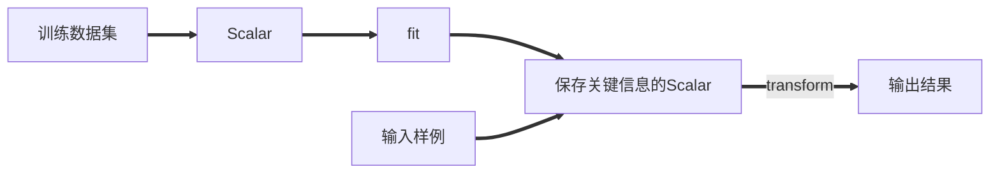

```python

```


**总结**

- 对于<span style="color:green">**最值归一化**</span>：如果出现异常点，影响了最大值最小值，那么结果显然会发生改变。
- 对于**<span style="color:green">均值方差归一</span>**：如果出现异常点，由于具有一定数据量，少量的异常点对平均值的影响并不大，从而方差改变较小。

# 六、`KNN`及ML流程总结

`KNN`可解决分类问题，且天然可解决多分类问题，思想简单，效果强大。

- `KNN`最大的缺点是效率低下。若训练集中有m个样本，n个特征，则预测每一个新数据需要$O(m*n)$

  可采用树结构就行优化：`KD-Tree`，`Ball-Tree`

- 高度数据相关

- 预测结果不具有可解释性

- 维数灾难

  随着维度的增加，看似相近的两个点之间的距离越来越大

  可用降维的方法解决。【`PCA`】

流程回顾图：视频截图哦~

# 五、线性回归算法

## 概述

- 解决回归问题
- 思想简单，实现容易
- 许多强大的非线性模型的基础
- 结果具有很好的可解释性
- 蕴含机器学习中的很多重要思想

## 简单线性回归

样本特征只有一个，称为简单线性回归~

### 理论讲解


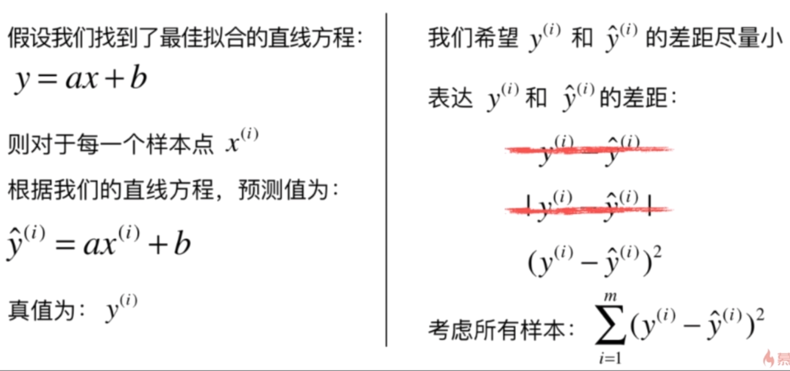

 使差距（损失Loss）尽量小

目标：找到a和b，使得$\sum_{i=1}^{m}{(y^{(i)}-ax^{(i)}-b)^2}$尽可能小，我们称之为损失函数（loss function），如果是度量拟合程度，我们称之为效用函数（utility function）

通过分析问题，确定问题的损失函数或者效用函数；

通过最优化损失函数或者效用函数，获得机器学习的模型。

近乎所有参数学习算法都是这样的套路~

- 线性回归~
- 多项式回归~
- 逻辑回归~
- `SVM~`
- 神经网络~
- 最优化原理~
- 凸优化~

目标：找到a和b，使得$\sum_{i=1}^{m}{(y^{(i)}-ax^{(i)}-b)^2}$尽可能小

典型的最小二乘法问题：最小化误差的平方

$a = \frac{\sum_{i=1}^m(x^{(i)}-\overline{x})(y^{(i)}*\overline{y})}{\sum_{i=1}^m(x^{(i)}-\overline{x})^2}$

$b = \overline{y} - a\overline{x}$

注意哦，a和b是未知数，我们要求a和b。

<span style="color:green">**求解b的表达式**</span>

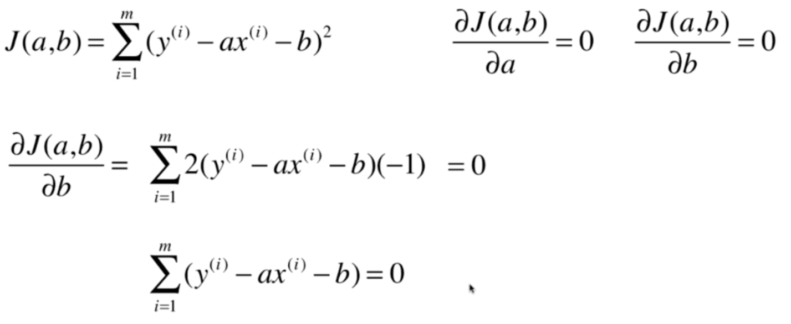

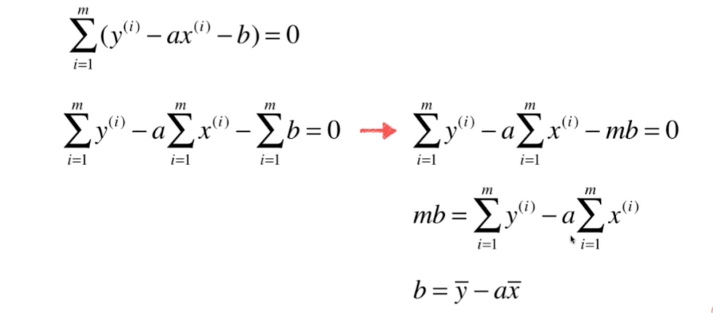

<span style="color:green">**求解a的表达式**</span>

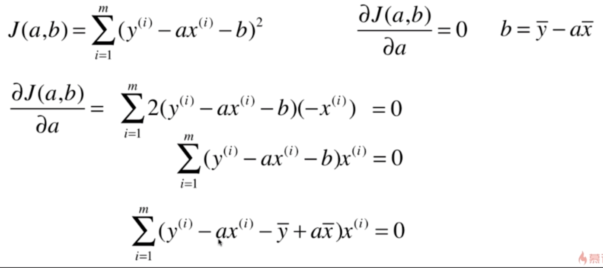

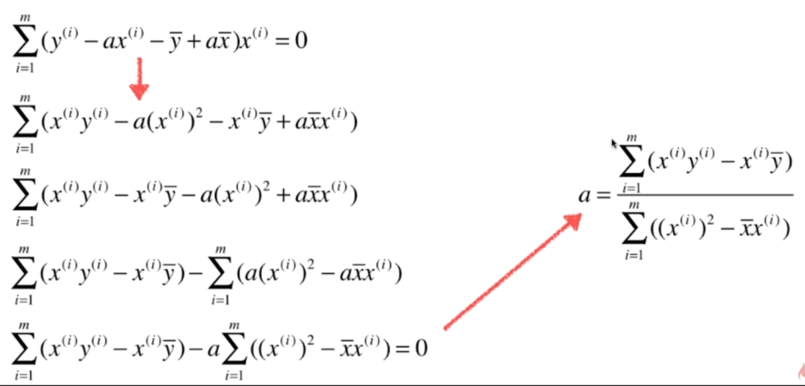

<span style="color:green">**a表达式的简化**</span>


----

**==最终结论==**

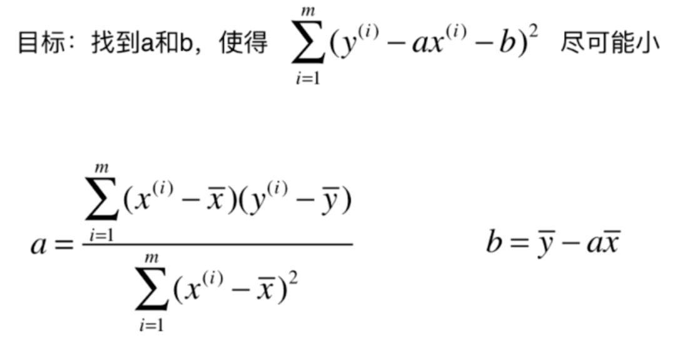

### 代码实现

#### 简陋版

```python
import numpy as np
import matplotlib.pyplot as plt

# fake data
x = np.array([1., 2., 3., 4., 5.])
y = np.array([1., 3., 2., 3., 5.])


def show():
    plt.figure()
    plt.scatter(x, y, c='g')
    plt.show()

"""知道公式，求解a和b的值~ 强力的理论支撑"""
def test1():
    x_mean = np.mean(x)
    y_mean = np.mean(y)
    num = 0.0
    d = 0.0
    for x_i, y_i in zip(x, y):
        num += (x_i - x_mean) * (y_i - y_mean)
        d += (x_i - x_mean) ** 2
    # 求解出a 和 b
    a = num / d
    b = y_mean - a * x_mean
    # 用求解出的a和b 求出 y_hat (预测值)
    y_hat = a * x + b
    plt.figure()
    plt.scatter(x, y, c='g') 
    plt.plot(x, y_hat, c='r')
    plt.show()

if __name__ == '__main__':
    test1()
```

### 向量化运算


将$\sum(x^{(i)}-\overline x)$用向量表示；$\sum(y^{(i)}-\overline y)$用向量表示，利用`np`的向量运算快速实现运算。速度得到了极大的提升！！

```python
import numpy as np

class SimpleLinearRegression2:
    def __init__(self):
        """初始化simple linear regression模型"""
        self.a_ = None
        self.b_ = None

    def fit(self, x_train, y_train):
        assert x_train.ndim == 1, "Simple linear regression can not only solve single feature training data"
        assert len(x_train) == len(y_train), "the size of x_train must be equal to the size of y_train"

        x_mean = np.mean(x_train)
        y_mean = np.mean(y_train)

        num = 0.0
        d = 0.0
        """
        使用向量化运算
        numpy.dot() 
        对于两个一维的数组，计算的是这两个数组对应下标元素的乘积和(数学上称之为内积)；
        对于二维数组，计算的是两个数组的矩阵乘积；
        """
        num = (x_train - x_mean).dot(y_train - y_mean)
        d = (x_train - x_mean).dot(x_train - x_mean)
        # for x, y in zip(x_train, y_train):
        #     num += (x - x_mean) * (y - y_mean)
        #     d += (x - x_mean) ** 2
        self.a_ = num / d
        self.b_ = y_mean - self.a_ * x_mean
        return self

    def predict(self, x_predict):
        assert x_predict.ndim == 1, "Simple linear regression can not only solve single feature training data"
        assert self.a_ is not None and self.b_ is not None, "must fit before predict"

        return np.array([self._predict(x) for x in x_predict])

    def _predict(self, x_single):
        return self.a_ * x_single + self.b_

    def __repr__(self):
        return "simpleLinearRegression1"
```

### 回归算法的评价

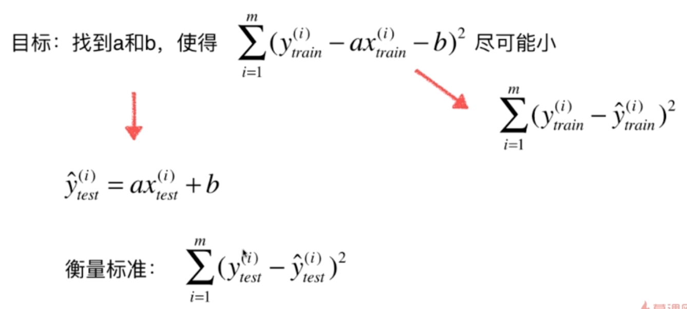

 这个衡量标准和m有关，故我们取均值，1/m 更为合理（让衡量标准与测试样本数无关）

<span style="color:green">**衡量标准：均方误差MSE（Mean Squared Error）**</span>

$\frac{1}{m} \sum(y_{test}^{(i)} - \hat y_{test}^{(i)})^2$

<span style="color:green">**衡量标准：均方根误差RMSE（Root Mean Squared Error）**</span>

- 可以放大预测结果很真实结果之间较大差距的趋势。
- **我们尽量让`RMSE`更小**，即可以让误差大的数据尽量的缩小误差。
- **一般我们是用`RMSE`而非MAE~**

$\sqrt{\frac{1}{m} \sum(y_{test}^{(i)} - \hat y_{test}^{(i)})^2}$

<span style="color:green">**衡量标准：平均绝对误差MAE（Mean Absolute Error）**</span>

$\frac{1}{m} \sum|y_{test}^{(i)} - \hat y_{test}^{(i)}|$

<span style="color:red">**我们评价算法的标准和训练模型时最优化的目标函数是可以完全不一致的！！！**</span>

PS：$\hat y$是预测值 $y$ 是真实值

PS：`python`模块导入问题，文件名和类目不是一一对应。

```python
from 包名.文件名 import 类名
```

-----

问题：分类的准确度：1最好，0最差

<span style="color:green">**R Squared**</span>

$R^2 = 1 - \frac{SS_{residual}}{SS_{total}}$

$R^2 = 1- \frac{\sum(\hat y^{(i)} -y^{(i)})^2} {\sum(\overline y - y^{(i)})^2}$

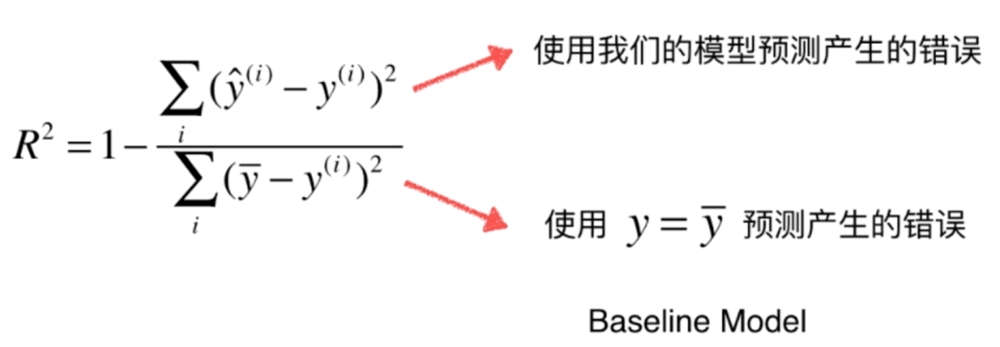

 ${\sum(\overline y - y^{(i)})^2}$ 我们可以把它理解成一个模型，这个模型就是$y = \overline y$, 这个模型与$x$无关，不管来什么$x$ 我都预测这个结果就是样本的均值。这是一个非常朴素的预测结果，我们称之为`Baseline Model`，这个的错误是比较多的，因为我们没有考虑$x$,直接生硬的预测$x$的值都等于均值，我们的模型预测产生的错误是比较少的，因为我们考虑了输入的$x$.

<span style="color:green">**把回归问题的衡量结果规约到0~1之间。**</span>

<span style="color:red">**$R^2$这个还是没理解。。。**</span>

**百度搜了一下：**

$R^2$越接近1，说明回归方程对于样本数据点的拟合优度越高；反之，$R^2$越接近0，说明回归方程对于样本数据点的拟合优度越低.

- $R^2<=1$
- $R^2$ 越大越好。当我们的预测模型不犯任何错误时，$R^2$得到最大值1
- 当我们的模型等于基准模型时，（$\hat y^{(i)} = \overline y$）,$R^2$为0，
- 如果$R^2<0$，说明我们学习到的模型还不如基准模型。此时很有可能我们的数据不存在任何线性关系。不该使用线性回归法进行预测~

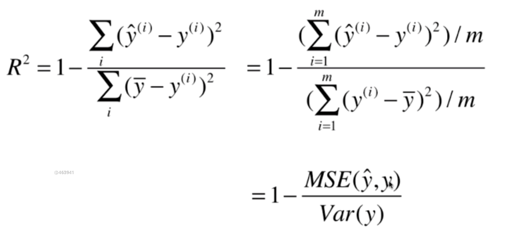

$Var(y)$ 指的是方差。$y$是原始值，$\hat y$是预测值，$\overline y$是均值。

$\sigma ^2 = \frac{\sum{(X-\mu)^2}}{N}$    $\sigma 为总体方差，X为变量，\mu 为总体均值， N为总体例数$

<span style="color:green">**$R^2$衡量的是我们的模型，对比基准模型的效果~**</span>

```python
"""我们自己算R^2"""
    """sklearn中的库"""
    from sklearn.metrics import mean_squared_error, mean_absolute_error
    R = 1 - mean_squared_error(y_test, y_predict) / np.var(y_test)
    print("=================")
    print(R)
    print("=================")
```

```python
"""sklearn库"""
    """sklearn计算 R Square"""
    from sklearn.metrics import r2_score

    """
    def r2_score(y_true, y_pred, *, sample_weight=None,
            multioutput="uniform_average"):
    """
    r2 = r2_score(y_test, y_predict)
    print(f"r^2 is {r2}")
```

`sklearn.linear_model.LinearRegression`的`score`默认是 $  R^2  $

## 多元线性回归

### 理论讲解

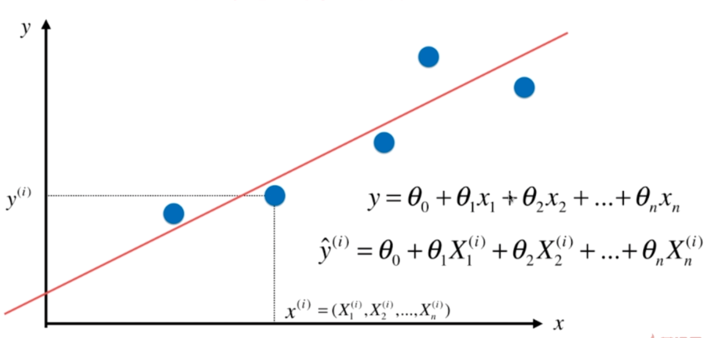

求解问题的思路和简单线性回归一样。

-----

**目标：使$\sum(y^{(i)}-\hat y^{(i)})^2$尽可能小**

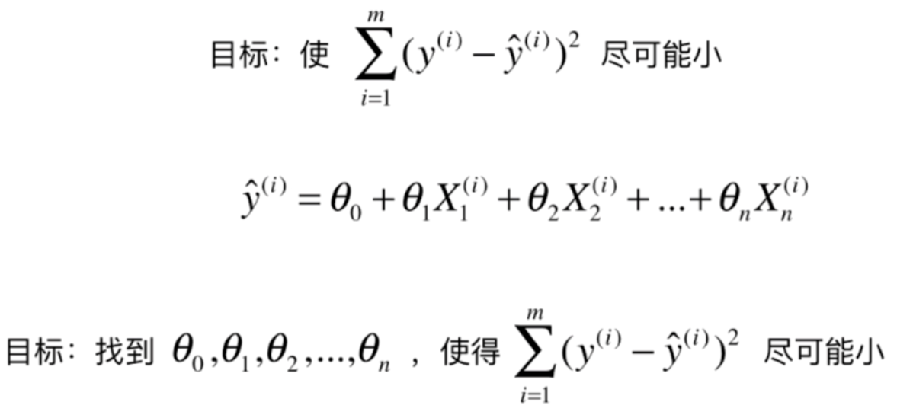

-----

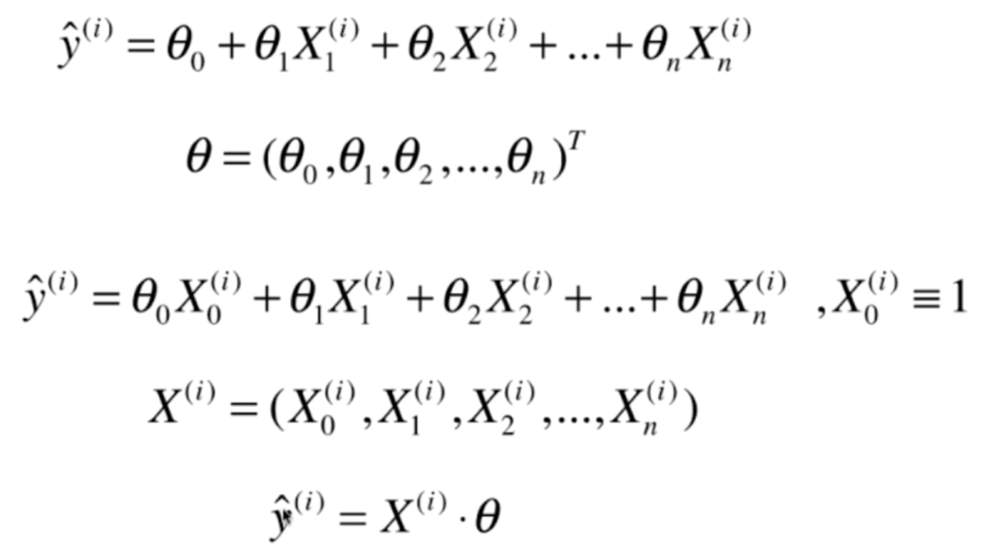

-----


**$\hat y$是预测值**

----

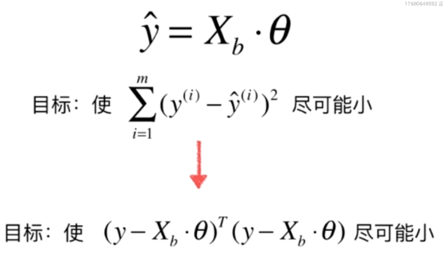

-----

**具体推导看统计学习方法或西瓜书吧~**

------

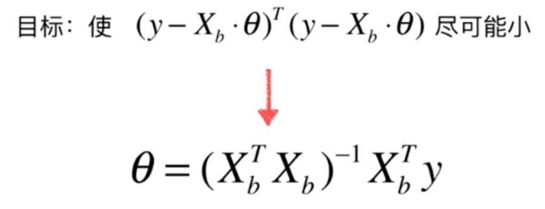

-----

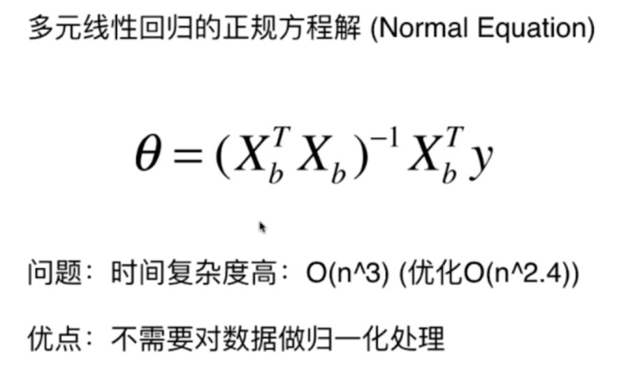

----

`KNN`的数据需要进行归一化，线性回归的数据不用进行归一化。

### 代码实现

我们为了形式上的统一，引入了一个$X_0 \equiv 1$. $\theta_0 * X_0 = \theta_0$

每个系数都对应数据中的一个特征。

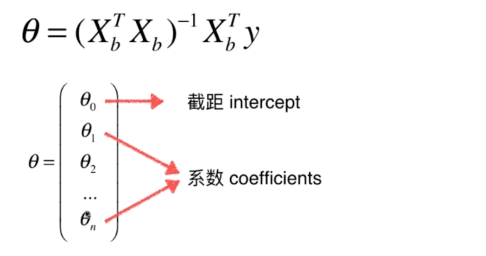

在实际的代码编写中，截距$\theta_0$和系数可能会分开返回。因为$\theta_0$只是一个偏移量，不是特征，对最终样本贡献的程度不一样。故把这两部分分开。