# 常用的网络

- resnet
- vgg
- FCN（语义分割划时代的网络？？）
- deeplab （目前知道有三种）
- unet（目前知道有很多种）

----

# PyTorch基本操作

## 矩阵操作

### 取随机矩阵

api的基本使用方式为：

- 创建各种随机数据  torch.methodName(行，列)

- 给定数据创建 torch.methodName([数据])

**常用api**

**表示元组**

| methodName                        | describe                  |
| --------------------------------- | ------------------------- |
| Tensor(*sizes)                    | 基础构造函数              |
| tensor(data,)                     | 类似np.array的构造函数    |
| ones(*sizes)                      | 全1Tensor                 |
| zeros(*sizes)                     | 全0Tensor                 |
| eye(*sizes)                       | 对⻆角线为1，其他为0      |
| arange(s,e,step)                  | 从s到e，步⻓长为step      |
| linspace(s,e,steps)               | 从s到e，均匀切分成steps份 |
| rand/randn(*sizes)                | 均匀/标准分布             |
| normal(mean,std)/uniform(from,to) | 正态分布/均匀分布         |
| randperm(m)                       | 随机排列列                |

----

### 算术&矩阵运算

- a+b

- torch.add（num1,num2）

- torch.add(x,y,out=result)

- y.add_(x) 创建的那些数据也是一个对象。 <span style="color:red">带下划线表示原地操作</span>

- torch.matmul() 矩阵乘法

  ```python
  # b.T 表示b的转置
  torch.matmul(a,b.T)
  ```

----

### 索引

pytorch的索引赋值为浅拷贝，指向同一块内存。

以下为代码验证

```python
import torch
x = torch.ones(3,3)
# 取每行数据的第一列
y = x[:,0]
y[1] = 5
# out put
"""
tensor([[1., 1., 1.],
        [5., 1., 1.],
        [1., 1., 1.]])
"""
```

### 索引高级函数

| 函数                            | 功能                                                         |
| ------------------------------- | ------------------------------------------------------------ |
| index_select(input, dim, index) | 指定维度选取，如选某些行/列，返回一个新矩阵，深拷贝，互不影响。 |
| masked_select(input, mask)      |                                                              |
| nonzero(input)                  | 非0元素下标                                                  |
| gather(input, dim, index)       |                                                              |

> **index_select(input, dim , index)**

- input 需要选择的那个矩阵

- dim 维数 0为选择每一行，1为选择每一列

- index 为需要选择另一维的那些数据。

  - 如 dim = 0 选择行
  - index = [1 ,3]
  - 选择第一行和第三行的数据

  ```python
  tensor([[0.3346, 0.2801, 0.6146, 0.6209, 0.8886], 第0行
          [0.8055, 0.8360, 0.0765, 0.8212, 0.8358], 第1行
          [0.0052, 0.8295, 0.0566, 0.4908, 0.3620], 第2行
          [0.6363, 0.6391, 0.1611, 0.9173, 0.6518], 第3行
          [0.2913, 0.0361, 0.7733, 0.4480, 0.7769]]) 第4行
  # index = [1,3]
  torch.index_select(data,0,index)
  tensor([[0.8055, 0.8360, 0.0765, 0.8212, 0.8358],
          [0.6363, 0.6391, 0.1611, 0.9173, 0.6518]])
  
  ```

> **nonzoer(input)**

```python
zoers = torch.zeros(3,4)

zoers[0][1] = 1
zoers[1][2] = 2

torch.nonzero(zoers)
```

---

### 改变形状

- view(行，列)
- reshape(行，列)

都是浅拷贝，共用内存。

- clone() 后再改变形状

```python
data = torch.randint(0,1000,size=(3,4))
copy_data = data.clone()
reshape_data = copy_data.reshape(4,3)
print(reshape_data)
```

---

### tensor 转python数据

```python
# 当个数的转
x = torch.randn(1)
x.item()
```

## 线性代数操作

直接看官方文档就是。随用随学。

---

### 广播机制

不同形状做计算，会进行适当的广播（增加维数，一致后再计算）

```python
x = torch.arange(1,3).view(1,2)
print(x)
y = torch.arange(1,4).view(3,1)
print(y)
x + y
```

## Numpy与Tensor

### 不熟悉的方法

#### np.random中的方法

| 函数                          | 说明                    |
| ----------------------------- | ----------------------- |
| random.randint(1,20,10)       | 1-20,左闭右开，10个数据 |
| random.normal(0,1,size=(5,5)) | 0 1正态分布，5*5的矩阵  |
| random.randn(2,3)             | 2*3的标准状态分布       |
| random.randn(100,2,3)         | 100组2*3的标准状态分布  |
| random.shuffle(data)          | 打乱data数据            |

```python
import numpy as np

x = np.random.randint(10, 20, 10)
# replace 不可重复抽取
np.random.choice(x, size=(2, 2), replace=False)
x = np.random.normal(0, 1, size=(5, 5))
# numpy几个记得不是很清楚的方法
r = np.random
# 标准正态分布
x1 = r.randn(3, 2)
# 1000组2*3的矩阵
x_1 = r.random.randn(1000,2,3)
# 符合0 10 状态分布的 形状为3 2 的随机数
x2 = r.normal(0, 10, size=(3, 2))
# 打乱数据
r.shuffle(x2)
```

#### 算数运算&矩阵运算

```python
data1 = np.random.randint(0, 10, size=(2, 2))
data2 = np.random.randint(0, 10, size=(2, 2))
print(data1)
print(data2)
# 数乘
print(data1 * data2)
print(np.multiply(data1, data2))
# 数加
data1 + data2
# 矩阵运算
print(np.dot(data1, data2))
```

#### 数组变形

- reshape() 调整维度，不修改本身
- resize() 会修改本身
- ravel() 多维变一维，不修改本身
- flatten() 多维变一维，不修改本身

#### 合并数组【处理数据常用 】

| 函数           | 描述                                                         |
| -------------- | ------------------------------------------------------------ |
| np.append      | 内存占用大                                                   |
| np.concatenate | 没有内存问题,不会提升维数                                    |
| np.stack       | 沿着新的轴加入一系列数组，会提升维数，把传入的参数当整体哦！ |
| np.hstack      | 堆栈数组垂直顺序<span style="color:red">(行)</span>  horizontal 水平的英文，和concatenate类似 |
| np.vstack      | 堆栈数组垂直顺序<span style="color:red">(列)</span> vertical 垂直的英文，和concatenate类似 |
| np.dstack      | 堆栈数组按顺序深入（沿第三维）                               |
| np.vsplit      | 将数组分解成垂直的多个子数组列表                             |

**注意**

- append、concatenate以及stack都有一个axis参数，用于控制数组合并方式.
  - axis的意思是轴。
  - 向量默认为列向量
  - <span style="color:red">axis = 0为默认值，默认以列向量（y轴自顶向下合并）</span>
  - <span style="color:red">axis = 1，以行向量（x轴，自左向右合并）</span>
- 对应append和concatenate，待合并数组必须有相同的行数或列数（满足一个即可）
- stack、hstack、dstack 要求待合并的数组必须具有相同的形状（shape）

```python
import numpy as np

data1 = np.random.randint(0, 100, size=(2, 2))
data2 = np.random.randint(0, 100, size=(2, 2))
# print(data1, data2)
print("=====================\n")
# 直接追加，返回一个新数组，耗内存
# copy = np.append(data1, data2)
# print(copy)
# 测试发现 不是同一个对象
# print(id(copy), id(data2))

print("=" * 50)
print(data1, "\n===\n===\n", data2)
copy = np.concatenate((data1, data2), axis=0)

copy1 = np.stack((data1, data2), axis=0)

print("=" * 50)
# y轴，自顶向下 合并
print(np.vstack((data1, data2)))
# x轴，自左向右 合并
print(np.hstack((data1, data2)))

```

### numpy与Tensor

很相似。numpy通过cup加速计算，Tensor通过GPU加速计算。

- Tensor为类 ==C

- tensor为方法==function

- 带下划线的方法会修改本身【这样命名清晰啊！】

  - ```python
    x = torch.tensor([2,3])
    y = torch.tensor([2,9])
    # 修改原数组
    x.add_(y)
    ```

> **注意点**

- torch.Tensor是torch.empty() 和 torch.tensor 之间的一种混合。全局默认使用dtype（FloatTensor），而torch.tensor是从数据中推断数据类型

- torch.tensor(1)返回一个固定值1，而torch.Tensor(1)返回一个大小为1的张量，它是随机初始化值。

  ```python
  print(torch.tensor(1).type())
  print(torch.Tensor(1).type())
  torch.LongTensor
  torch.FloatTensor
  ```

### Tensor不熟悉的操作

- numel(input) 计算Tensor的元素个数

- view(*shape) 共享内存，共享内存。。那他的表示岂不是只是修改了访问的索引，这样访问不是特别耗时吗

- view(-1) 展平数组

  ```python
  import torch
  
  x = torch.randn((3, 2))
  
  print(x.view(2,3))
  print(x.view(-1))
  
  x[1][1] = 10
  # output 发现共享内存
  print(x)
  print(x.view(3,2))
  ```

- item() 为单个变量则放回Python的标量

---

## 求梯度

```python
import torch
"""
自动求梯度
.requires_grad 属性 为是否被跟踪
张量的梯度会自动累加到 .grad
阻止跟踪可以使用 .detach()

下面的看不懂
为了防止跟踪历史记录(和使用内存），可以将代码块包装在 with torch.no_grad(): 中。
在评估模型时特别有用，因为模型可能具有 requires_grad = True 的可训练的参数，但是
我们不需要在此过程中对他们进行梯度计算。
"""
class grad:

    def __init__(self):
        self.x = torch.randint(0, 100, (2, 2), dtype=torch.float32, requires_grad=True)
        self.y = self.x + 2
        self.z = self.y * self.y * 3

    def demo_1(self):
        # 暂且不管为何种意思
        out = self.z.mean()
        print(self.z, out)
        out.backward()  # 进行求导
        print(self.x.grad)  # 输出对x倒数

    def demo_2(self):
        # 目前测试结果就是把导数的值累加了一下而已。
        out = self.z.sum()
        out.backward()
        print(self.x.grad)

    def demo_3(self):
        # 这里似乎必须调用一个z的方法才可，不然会报错
        # 原因：需要变成标量，所以要做一个处理，如求mean，sum
        out = self.z
        out.backward()
        print(self.x.grad)

    def demo_4(self):
        out = self.z.mean()
        out.backward()
        print(self.x.grad)

    def demo_5(self):
        x = torch.tensor(5.0, dtype=torch.float32, requires_grad=True)
        print(x)
        y = x * x * 2
        y.backward()
        # 对x的求导结果为20. 之前那些都是向量求导，还不会好吧。
        # xx.mean()这种链式调用应该是和求导的结果有关，暂时不看
        # 等学了矩阵论再说。
        print(x.grad)

    def help_docs(self, obj):
        help(obj)


if __name__ == '__main__':
    obj = grad()
    # obj.demo_2()
    # obj.help_docs(obj.z)
    obj.demo_5()
```

**pytorch的数据类型。与numpy的array类似。**


```python
import torch
a = torch.tensor([1,2,3],dtype=int)
print(a)
print(a.dtype)
# output
# tensor([1, 2, 3])
# torch.int64
```

**定义二维数据并查看数据类型**


```python
tensor = torch.tensor([[1,2,3],[4,5,6]])
print(tensor.shape)
print(tensor.size())
# torch.Size([2, 3])
# torch.Size([2, 3])
```

**查看维度**


```python
print(tensor.ndim)
# output
# 2
```

**生成数据**


```python
print(torch.zeros(2,3))# 都是0
print(torch.ones(2,3)) # 都是1
print(torch.rand(3,4)) # 生成0-1的随机的3*4的数据
print(torch.randint(0,100,(3,4)))
print(torch.randn(3,4)) # 生成符合正态分布的数据
a = torch.randn(3,4)
b = torch.rand_like(a,dtype=float) #生成和a形状一样的 float类型的随机数
print(a)
print(b)

"""
output
tensor([[0., 0., 0.],
        [0., 0., 0.]])
tensor([[1., 1., 1.],
        [1., 1., 1.]])
tensor([[0.2974, 0.5818, 0.2805, 0.6552],
        [0.7131, 0.6139, 0.5760, 0.5053],
        [0.1240, 0.3698, 0.2391, 0.9218]])
tensor([[85, 47, 54, 52],
        [ 6,  3, 18, 36],
        [15, 83,  5, 53]])
tensor([[ 0.7933,  0.8227, -0.4664, -0.1945],
        [ 0.2067, -1.3382,  0.6787,  0.2010],
        [ 1.0566, -1.4890,  0.9925, -1.3757]])
tensor([[-1.2703,  0.4650,  0.2521,  0.0509],
        [ 0.7025,  0.1780,  0.2240, -0.4364],
        [ 2.5631, -0.3438,  1.0812, -0.0662]])
tensor([[0.4620, 0.6949, 0.0714, 0.5057],
        [0.7386, 0.6092, 0.3711, 0.6469],
        [0.2036, 0.4890, 0.6017, 0.4017]], dtype=torch.float64)
"""
```

**查看形状并修改**


```python
print(b.shape)
print(b.size())
# output
# torch.Size([3, 4])
# torch.Size([3, 4])
```

**重新调整大小**

```python
c = b.reshape(4,3)
d = b.view(4,3)
print(c)
print(d)
"""
output
tensor([[0.4620, 0.6949, 0.0714],
        [0.5057, 0.7386, 0.6092],
        [0.3711, 0.6469, 0.2036],
        [0.4890, 0.6017, 0.4017]], dtype=torch.float64)
tensor([[0.4620, 0.6949, 0.0714],
        [0.5057, 0.7386, 0.6092],
        [0.3711, 0.6469, 0.2036],
        [0.4890, 0.6017, 0.4017]], dtype=torch.float64)
"""
```

**tensor数据变为python数据**


```python
d[0][0].item() # 只能转换单个值
# output
# 0.46197234568033185
```

**np和pytorch之间的矩阵转换**


```python
import numpy as np
np.array(d) # 把tensor变成numpy array
# output 
# dtype('float64')
tensor = torch.tensor(np.array(d)) # numpy 变为 tensor
print(tensor)
# output
# tensor([[0.4620, 0.6949, 0.0714],
        [0.5057, 0.7386, 0.6092],
        [0.3711, 0.6469, 0.2036],
        [0.4890, 0.6017, 0.4017]], dtype=torch.float64)
```

## GPU计算

```python
# python语法
# 这个算列表推导式吗？
value = "cuda:0" if torch.cuda.is_available() else "cpu"

devices = torch.device("cuda:0" if torch.cuda.is_available() else "cpu")
print(torch.device("cuda:0"))
print(torch.device("cpu"))
```

```python
# demo
devices = torch.device("cuda:0" if torch.cuda.is_available() else "cpu")
for batch_idx, (img,label) in enumerate(train_loader):
    img = img.to(devices)
    label = label.to(devices)
    
model = Net()
model.to(devices)
```

# PyTorch常用API

核心组件：

- 层：神经网络的基本结构，并输入张量转换为输出张量
- 模型：层构成的网络
- 损失函数：参数学习的目标函数，通过最小化损失函数来学习各种参数
- 优化器：如何使损失函数最小，这涉及优化器

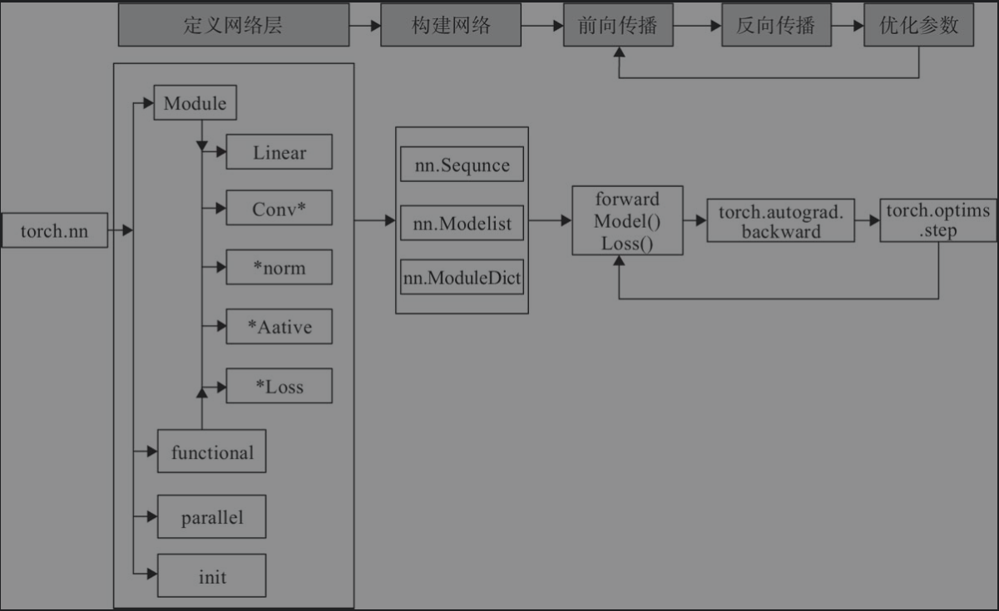

## torch.nn模块构建网络

### Module直接构建

```python
class Net(torch.nn.Module):
    
    def __init__(self):
        super().__init__()  # python2.7的继承才要在super里写方法
        self.conv1 = torch.nn.Conv2d(3, 32, 3, 1, 1)
        self.dense1 = torch.nn.Linear(32 * 3 * 3, 128)
        self.dense2 = torch.nn.Linear(128, 10)

    def forward(self, x):
        x = torch.max_pool2d(torch.relu(self.conv(x)), kernel_size=2)
        x = x.view(x.size(0), -1)
        x = torch.relu(self.dense1(x))
        x = self.dense2(x)
        return x


model1 = Net1()
print(model1)

```

### Sequential构建

输入输出的参数可能对不上，后面再修改。

```python
class Net(torch.nn.Module):
    def __init__(self):
        super().__init__()
        # in_channels, out_channels, kernel_size
        self.conv = torch.nn.Sequential(
            torch.nn.Conv2d(3, 32, 3, 1, 1),
            torch.nn.ReLU(),
            torch.nn.MaxPool2d(2, 1)
        )
        self.dense = torch.nn.Sequential(
            torch.nn.Linear(1984, 128),
            torch.nn.ReLU(),
            torch.nn.Linear(128, 10)
        )

    def forward(self, x):
        conv_out = self.conv(x)
        conv_out.view(conv_out.size(0), -1)
        out = self.dense(conv_out)
        return out
```

### 逐步向Sequential添加

```python
self.conv=torch.nn.Sequential()
self.conv.add_module("conv1",torch.nn.Conv2d(3, 32, 3, 1, 1))
```

### Sequential字典构建

```python
class Net4(torch.nn.Module):
    def __init__(self):
        super(Net4, self).__init__()
        self.conv = torch.nn.Sequential(
            OrderedDict(
                [
                    ("conv1", torch.nn.Conv2d(3, 32, 3, 1, 1)),
                    ("relu1", torch.nn.ReLU()),
                    ("pool", torch.nn.MaxPool2d(2))
                ]
            ))
 
        self.dense = torch.nn.Sequential(
            OrderedDict([
                ("dense1", torch.nn.Linear(32 * 3 * 3, 128)),
                ("relu2", torch.nn.ReLU()),
                ("dense2", torch.nn.Linear(128, 10))
            ])
        )
```

## optim

### 常见优化器汇总

<a href="https://pytorch.org/docs/stable/optim.html#">PyTorch中的优化器文档</a>

常用优化器都在`torch.optim`

> **基本使用**

```python
from torch import optim
# 或
import torch.optim as optim

optimizer = optim.Adagrad(params, lr=0.01, lr_decay=0, weight_decay=0, initial_accumulator_value=0, eps=1e-10)

optimizer = optim.Adam(params, lr=0.001, betas=(0.9, 0.999), eps=1e-08, weight_decay=0, amsgrad=False)

optimizer = AdamW(params, lr=0.001, betas=(0.9, 0.999), eps=1e-08, weight_decay=0.01, amsgrad=False)

optimizer = optim.ASGD(params, lr=0.01, lambd=0.0001, alpha=0.75, t0=1000000.0, weight_decay=0)

optimizer = optim.RMSprop(params, lr=0.01, alpha=0.99, eps=1e-08, weight_decay=0, momentum=0, centered=False)

optimizer = optim.SGD(params, lr=<required parameter>, momentum=0, dampening=0, weight_decay=0, nesterov=False)
```

### SGD算法

使用参数的梯度，沿梯度方向更新参数，并重复这个步骤多次，从而逐渐靠近最优参数，这个过程称为随机梯度下降法。SGD好像是是随机选择样本进行判断梯度的走向。

缺点：SGD的取值可视化查看一般都是呈“之”字形移动，这是一个相当低效的路径。即SGD的缺点是，如果函数的形状非均匀向，比如呈延伸状，搜索的路径就会非常低效。根本原因在于，梯度的方向并没有指向最小值的方向。

改进：加上动量，会减轻“之”字型的程度。

### AdaGrad算法

传统梯度下降算法对学习率这个超参数非常敏感，难以驾驭，对参数空间的某些方向也没有很好的方法。<span  style="color:red">AdaGrad算法通过参数来调整合适的学习率r,能独立地自动调整模型参数的学习率，对稀疏参数进行大幅更新和对频繁参数进行小幅更新。因此AdaGrad算法非常适合处理稀疏数据。</span>

**缺点：**

- 可能因其累积梯度平方导致学习率过早或过量的减少。

- AdaGrad会记录过去所有梯度地平方和。因此，学习越深入，更新的幅度就越小。如果无止境地学习，更新量就会变为0，完全不再更新。为改善这个问题，可以使用RMRSProp方法。

### RMSProp算法

通过修改AdaGrad算法而来，其目的是在非凸背景下效果更好。不将过去所有的梯度都一视同仁地相加，而是逐渐忘记过去的梯度，在做加法运算时将梯度的信息更多地反映出来。这种操作称为“指数平均移动”，呈指数函数式地减小过去的梯度的尺寸。为了使移动平均，还引入了一个新的超参数，来控制移动平均的长度范围。

### Adam算法

融合了Momentum和AdaGrad的方法。组合前两个方法的优点，有望实现参数空间的高效搜索。此外还会进行超参数的“偏置校正”。

它利用梯度的一阶矩估计和二阶矩估计动态调整每个参数的学习速率。

## Loss

### 介绍

- **sigmod**是一个阶跃函数，用于二分类。
- **softmax**计算每个数据可能的概率，里面概率最大就是预测值。
- **logsoftmax**是对softmax进行了一个与log等价的操作，但是不是直接log。
- <span style="color:red">**博客回答：**</span>我的理解是这样的：理论上对于单标签多分类问题，直接经过softmax求出概率分布，然后把这个概率分布用crossentropy做一个似然估计误差。但是softmax求出来的概率分布，每一个概率都是(0,1)的，这就会导致有些概率过小，导致下溢。 考虑到这个概率分布总归是要经过crossentropy的，而crossentropy的计算是把概率分布外面套一个-log 来似然，那么直接在计算概率分布的时候加上log,把概率从（0，1）变为（-∞，0），这样就防止中间会有下溢出。 所以log_softmax说白了就是将本来应该由crossentropy做的套log的工作提到预测概率分布来，跳过了中间的存储步骤，防止中间数值会有下溢出，使得数据更加稳定。 正是由于把log这一步从计算误差提到前面，所以用log_softmax之后，下游的计算误差的function就应该变成NLLLoss(它没有套log这一步，直接将输入取反，然后计算和label的乘积求和平均)

### 常见损失函数汇总

```python
# 均方误差损失函数 用于回归问题
torch.nn.MSELoss(size_average=None, reduce=None, reduction: str = 'mean')

# 与BCELoss的不同：将sigmoid函数和BCELoss方法结合到一个类中
torch.nn.BCEWithLogitsLoss(weight=None, size_average=None, reduce=None, reduction='mean', pos_weight=None)


# NLLLoss的全称是Negative Log Likelihood Loss，也就是最大似然函数。 用于多分类问题
torch.nn.NLLLoss(weight: Optional[torch.Tensor] = None, size_average=None, ignore_index: int = -100, reduce=None, reduction: str = 'mean')

# CrossEntropyLoss 交叉熵损失函数，适用于多分类问题  This criterion combines nn.LogSoftmax() and nn.NLLLoss() in one single class.
torch.nn.CrossEntropyLoss(weight: Optional[torch.Tensor] = None, size_average=None, ignore_index: int = -100, reduce=None, reduction: str = 'mean')
```

PS：当使用sigmoid作为激活函数的时候，常用**交叉熵损失函数**而不用**均方误差损失函数**，因为它可以**完美解决平方损失函数权重更新过慢**的问题，具有“误差大的时候，权重更新快；误差小的时候，权重更新慢”的良好性质。

### BCELoss

==二分类==

```python
CLASS torch.nn.BCELoss(weight=None, size_average=None, reduce=None, reduction='mean')
```

创建一个衡量目标和输出之间二进制交叉熵的criterion

- 参数
  - **weight** (*Tensor**,**可选*) – 每批元素损失的手工重标权重。如果给定，则必须是一个大小为“nbatch”的张量。
  - **reduction** (*string**,**可选*) – 指定要应用于输出的`reduction`操作:' none ' | 'mean' | ' sum '。“none”:表示不进行任何`reduction`，“mean”:输出的和除以输出中的元素数，即求平均值，“sum”:输出求和。
  - 其他的被弃用了

```python
import torch.nn

input = torch.tensor([
    [0.3585, 0.5973, -0.4429, -0.0270, 0.2480, 0.3332, -2.0774, 0.1682,
                       1.5812, -1.5677],
    [0.3585, 0.5973, -0.4429, -0.0270, 0.2480, 0.3332, -2.0774, 0.1682,
                       1.1252, -1.5677]
])
target = torch.tensor([[1., 0., 0., 0., 1., 0., 0., 0., 0., 0.], [1., 0., 0., 0., 1., 0., 0., 0., 0., 0.]])


# 可以一个一个标记的算
def test1(input, target):
    """
    :param input: 单纯的数据
    :param target: 数据对应的标签
    :return:
    """
    loss = torch.nn.BCELoss()
    out = loss(torch.sigmoid(input), target)
    return out.data


# 也可以批处理算
def test2(input, target):
    """
    批量计算 一次处理batch_size数目的data
    :param input: [batch_size , data]
    :param target:[batch_size , data]
    :return:
    """
    loss = torch.nn.BCELoss()
    out = loss(torch.sigmoid(input), target)
    print(out.data)


if __name__ == '__main__':
    count = 0.0
    for epoch in range(input.shape[0]):
        for i, t in zip(input[epoch], target[epoch]):
            count += test1(i, t)
    print(count / 20)
    test2(input, target)
    print(input.shape)
```

### BCEWithLogitsLoss

==二分类==

```python
torch.nn.BCEWithLogitsLoss(weight=None, size_average=None, reduce=None, reduction='mean', pos_weight=None)
```

与BCELoss的不同：

将sigmoid函数和BCELoss方法结合到一个类中

这个版本在数值上比使用一个带着BCELoss损失函数的简单的Sigmoid函数更稳定，通过将操作合并到一层中，我们利用log-sum-exp技巧来实现数值稳定性。

- 多出的参数
  - **pos_weight** ([*Tensor*](https://pytorch.org/docs/stable/tensors.html#torch.Tensor)*,**可选*) –正值例子的权重，必须是有着与分类数目相同的长度的向量

```python
import torch
import torch.nn as nn

m = nn.Sigmoid()
loss = nn.BCELoss()
input = torch.randn(3, requires_grad=True)
target = torch.empty(3).random_(2)
output = loss(m(input), target)
print(output)

loss = nn.BCEWithLogitsLoss()
input = torch.randn(3,requires_grad=True)
target = torch.empty(3).random_(2)
output = loss(input, target)
print(output)
```

```python
import torch
import torch.nn as nn

import torch.nn

input = torch.tensor([
    [0.3585, 0.5973, -0.4429, -0.0270, 0.2480, 0.3332, -2.0774, 0.1682,
     1.5812, -1.5677],
    [0.3585, 0.5973, -0.4429, -0.0270, 0.2480, 0.3332, -2.0774, 0.1682,
     1.1252, -1.5677]
])
target = torch.tensor([[1., 0., 0., 0., 1., 0., 0., 0., 0., 0.], [1., 0., 0., 0., 1., 0., 0., 0., 0., 0.]])


# 可以一个一个标记的算
def test1(input, target):
    """
    :param input: 单纯的数据
    :param target: 数据对应的标签
    :return:
    """
    loss = torch.nn.BCEWithLogitsLoss()
    out = loss(input, target)
    return out.data


# 也可以批处理算
def test2(input, target):
    """
    批量计算 一次处理batch_size数目的data
    :param input: [batch_size , data]
    :param target:[batch_size , data]
    :return:
    """
    loss = torch.nn.BCEWithLogitsLoss()
    out = loss(input, target)
    print(out.data)


if __name__ == '__main__':
    count = 0.0
    for epoch in range(input.shape[0]):
        for i, t in zip(input[epoch], target[epoch]):
            count += test1(i, t)
    print(count / 20)
    test2(input, target)
    print(input.shape)
```

### NLLLoss

**NLLLoss的全称是Negative Log Likelihood Loss，也就是最大似然函数。**

<a href="https://blog.csdn.net/qq_22210253/article/details/85229988">博客</a>

多分类

```python
CLASS torch.nn.NLLLoss(weight=None, size_average=None, ignore_index=-100, reduce=None, reduction='mean')
```

多出参数：

- **ignore_index** ([*int*](https://docs.python.org/3/library/functions.html#int)*,* *optional*) – 指定一个被忽略的目标值，该目标值不影响输入梯度。当size_average为真时，对非忽略目标的损失进行平均。

 形状：

- 输入：*(N,C), C*代表类别的数量；或者在计算高维损失函数例子中输入大小为(N,C,d1,d2,...,dK)，k>=1
- 目标：*(N)*，与输入拥有同样的形状，每一个值大小为为 0≤targets[i]≤C−1 ；或者在计算高维损失函数例子中输入大小为(N,C,d1,d2,...,dK)，k>=1
- 输出:标量scalar。如果reduction='none',则其大小与目标相同，为(N)或(N,C,d1,d2,...,dK)，k>=1

## 激活函数

神经网络层数不多，选择sigmoid、tanh、relu、softmax都可以。如果搭建的网络层次较多，激活函数选择不当可能会导致梯度消失问题。此时一般不宜选择sigmoid、tanh激活函数，因为它们的导数都小于1，尤其是sigmoid的导数在0~1/4之间。导数过小的容易梯度消失，导数过大的容易梯度爆炸，层数多的选择导数为1的激活函数是比较合适的如$relu$函数。

激活函数输入维度与输出维度是一样的。激活函数的输入维度一般包括批量数N，即输入数据的维度一般是4维，如$(N,C,W,H)$

<a href="https://pytorch.org/docs/stable/nn.functional.html#non-linear-activation-functions">torch中实现的激活函数</a>

> 将线性函数变为非线性函数。如果不用激活函数进行激活的话，多层神经网络最后是可以用一层来表示的。这样设置多层网络的意义就存在了。所有要用非线性的激活函数进行激活。所以<span style="color:red">激活函数必须为非线性函数</span>

> **sigmoid**

公式如下：$σ(x) = \frac{1}{1+e^{-x}}$

- 优点
  - 便于求导的平滑函数
  - 能压缩数据，保证数据幅度不会有问题
  - 适合用于前向传播
- 缺点
  - 容易出现<span style="color:red">梯度消失的现象</span>：当激活函数接近饱和区时，变化太缓慢，导数接近0，根据后向传递的数学依据是微积分求导的链式法则，当前导数需要之前各层导数的乘积，几个比较小的数相乘，导数结果很接近0，从而无法完成深层网络的训练。
  - Sigmoid的输出不是0均值（zero-centered）的：这会导致后层的神经元的输入是非0均值的信号，这会对梯度产生影响。以 f=sigmoid(wx+b)为例， 假设输入均为正数（或负数），那么对w的导数总是正数（或负数），这样在反向传播过程中要么都往正方向更新，要么都往负方向更新，导致有一种捆绑效果，使得收敛缓慢。

> **tanh**

公式如下：$tanhx = \frac{e^x -e^{-x}}{e^x+e^{-x}}$

tanh函数将输入值压缩到 -1~1 的范围，因此它是0均值的，解决了Sigmoid函数的非zero-centered问题，但是它也存在梯度消失和幂运算的问题。

> **ReLU**

公式：$ReLU = max(0,x)$

- 优点
  - ReLu的收敛速度比 sigmoid 和 tanh 快；（梯度不会饱和，解决了梯度消失问题）
  - 计算复杂度低，不需要进行指数运算；
  - 适合用于后向传播。
- 缺点
  - ReLU的输出不是zero-centered；
  - Dead  ReLU  Problem（神经元坏死现象）：某些神经元可能永远不会被激活，导致相应参数永远不会被更新（在负数部分，梯度为0）。产生这种现象的两个原因：参数初始化问题；learning  rate太高导致在训练过程中参数更新太大。 解决方法：采用Xavier初始化方法，以及避免将learning  rate设置太大或使用adagrad等自动调节learning  rate的算法。【**这个所谓的缺点，也是其优点，丢弃一些参数，加快收敛。**】
  - ReLU不会对数据做幅度压缩，所以数据的幅度会随着模型层数的增加不断扩张。

> **Leakly ReLU**

公式：$f(x) = max(0.01x,x)$

此激活函数的提出是<span style="color:red">用来解决ReLU带来的神经元坏死的问题</span>，可以将0.01设置成一个变量a，其中a可以由后向传播学习。<span style="color:red">但是其表现并不一定比ReLU好</span>

> **ELU函数（指数线性函数）**

$f(x) = x \  \ if \  x>0$

$f(x) = a(e^x-1), \ otherwise$

ELU有ReLU的所有优点，并且不会有 Dead  ReLU问题，输出的均值接近0（zero-centered）。但是计算量大，其表现并不一定比ReLU好。

## 正则化

机器学习中容易发送过拟合，过拟合的原因主要有这两个

- 模型拥有大量参数、表现力强
- 训练数据少

权值衰减常被用来抑制过拟合。该方法通过在学习过程中对最大权值进行惩罚，来抑制过拟合。很多过拟合原本就是因为权值参数取值过大才发生的。

为损失函数加权重的L2范数的权值衰减方法。该方法可以简单地实现，在某种程度上能够抑制过拟合，但是如果模型复杂，只用权值衰减就很难应付了。这时候可以用正则化！！

### Dropout

学习过程中随机删除一些神经元。减少参数的数量，加快收敛速度，避免过拟合。一般好像是设置成丢弃50%的数据。

## 数据处理

### 概述

- utils.data
- torchvision
- tensorboardX

### utils.data

utils.data主要包括Dataset和DataLoader。

torch.utils.data.Dataset为抽象类，自定义数据集需要继承这个类。并实现两个函数

- `__len__`
- `__getitem__`一次只能对一个数据，所以来通过torch.utils.data.DataLoader定义一个新的迭代器，实现batch读取。

```python
import torch
import numpy as np
from torch.utils import data

class TestDataset(data.Dataset):
    def __init__():
        self.Data = np.asarray([[1,2],[3,4],[2,1],[3,4],[4,5]])
        self.Label = np.asarray([0,1,0,1,2]) # 数据集对应的标签
    
    def __getitem__(self,index):
        txt = torch.from_numpy(self.Data[index])
        label = torch.tensor(self.Label[index])
        return txt,label
    def __len__(self):
        return len(self.Data)
    
Test = TestDataset()
print(Test[2])
print(Test.__len__())

train_data = data.DataLoader(
	dataset,
    batch_size=1,
    shuffle=False,
    sampler=None,
    batch_sampler=None,
    num_workers=0,
    collate_fn = <function default_collate at 地址值>,
    pin_memory=False,
    timeout=0,
    worker_init_fn=None,
)

for i,item_data in enumerate(test_loader):
    print("i:",i)
    data,label = item_data
    print("data:",item_data)
    print("i:",i)
```

- dataset：加载的数据集
- batch_size：批大小
- shuffle：是否将数据打乱
- sampler：样本抽样
- num_workers：使用多进程加载的进程数，0代表不使用多进程
- pin_memory：是否将数据保存在pin_memory中的数据转到GPU
- drop_last：dataset中的数据个数可能不是batch_size的整数被，drop_last为True将多出来不足一个batch的数据丢弃

### torchvision

包含4个功能模块：model、datasets、transforms和utils。

datasets可以下载一些经典数据集

transforms提供了对PIL Image对象和Tensor对象的常用操作。

对PIL Image的常见操作如下：

- Scale/Resize：调整尺寸，长宽比保持不变。
- CenterCrop、RandomCrop、RandomSizedCrop：裁剪图片，CenterCrop和RandomCrop在crop时是固定size，RandomSizedCrop则是random size的crop。
- Pad：填充
- ToTensor：把一个取值范围是 [0,255]的PIL.Image转换成Tensor。形状为（H，W，C）的Numpy.ndarray转换成形状为 [ C，H，W ]，取值范围是 [ 0，1，0 ]的torch.FloatTensor。
- RandomHorizontalFlip：图片随机水平翻转，翻转概率为0.5
- RandomVerticalFlip：图像随机垂直翻转。
- ColorJitter：修改亮度、对比度和饱和度。

对Tensor的常见操作如下：

- Normalize：标准化，即，减均值，除以标准差
- ToPILImage：将Tensor转为PIL Image。

如果要对数据集进行多个操作，可以通过Compose将这些操作像管道一样拼接起来，类似于`nn.Sequential`.

```python
transforms.Compose([
    # 将给定的PIL.Image 进行中心切割，得到给的的size
    # size 可以是 tuple, (target_height, target_witdh)
    # size 也可以是一个 Integer，在这种情况下，切出来的图片形状是正方形。
    transforms.CenterCrop(10),
    # 切割中心点的位置随机选取
    transforms.RandomCrop(20,padding=0),
    # 把一个取值范围是 [0,255] 的PIL.Image 或者 shape 为(H,W,C)的numpy.ndarray
    # 转换为形状为(C,H,W)，取值范围为[0,1]的torch.FloatTensor
    transforms.ToTensor(),
    # 规范化到[-1,1]
    transforms.Normalize(mean=(0.5,0.5,0.5), std=(0.5,0.5,0.5))
])
```


### tensorboardX

安装 `pip install tensorboardX`

```python
from tensorboardX import SummaryWriter

writer = SummaryWriter(log_dir='logs')
writer.add_xxx()
writer.close()
```

# PyTorch视觉处理基础

全连接参数过大，且容易过拟合。采用卷积神经网络，减少参数。

- 卷积神经网络
- 卷积定义
- 卷积运算
- 卷积层
- 池化层
- 现代经典网络架构

## 卷积神经网络介绍

在图像和语音识别方面能给出更好的结果。更少参数，更高的性能。


# NN基本步骤

## NN基本搭建流程

### 文字描述

前馈，反馈，循环。前馈算损失，反馈算梯度，循环找最优解。

用pytorch构建自己的深度学习模型的时候，可考虑采用以下流程：

- 找数据定义
- 找model定义（找损失函数、优化器定义）
- 主循环代码逻辑

深度学习模型过程

- 输入处理模块（把输入的数据变成网络能够处理的Tensor类型）
- 模型构建模块（根据输入的数据得到预测的y，【前向过程】）
  - 前向过程只会得到模型预测结果，不会自动求导和更新
- 定义代价函数和优化器模块
- 构建训练过程（迭代训练过程）

### 代码举例

#### 数据处理

```python
from torch.utils.data import Dataset
# 继承Dataset方法，Override以下方法
class trainDataset(Dataset):
    def __init__(self):
        # 构造函数，初始化常用数据
    
    def __getitem__(self,index):
        # 获得第index号的数据和标签
        
    def __len__(self):
        # 获得数据量   
        
        
# 假设我们把数据集 和 标签 放在了一起，这样我们就可以十分方便地同时遍历数据集和标签了
data_items = torch.utils.data.DataLoader(dataset, batch_size=1, shuffle=False)

for label,data in data_items
	print(label,data)
    break # 只输出一组
```

#### 构建模型

所有模型都需要继承torch.nn.Module,需要实现以下方法.

其中forward() ⽅法是前向传播的过程。在实现模型时，我们不需要考虑反向传播。

```python
class MyModel(torch.nn.Module):
    def __init__(self):
        super(MyModel,self).__init__()
        
    def forward(self,x):
        return
    
 model = MyModel()
```

####  定义代价函数和优化器

```python
criterion = torch.nn.BCELoss(reduction='sum') # 代价函数
optimizer = torch.optim.Adam(model.paramenters(), lr=0.001, betas=(0.9,0.999), eps=1e-08, weight_decay=0, amsgrad=False) # 优化器
```

#### 构建训练过程

```python
def train(epoch):
    for i,data in data_items:
        x,y = i,data
        y_pred = model(x) # 前向传播
        loss = criterion(y_pred, y) # 计算代价函数
        optimizer.zero_grad() # 清理梯度准备计算
        loss.backward() # 反向传播
        optimizer.step() # 更新训练参数
```

#### 流程图如下

```flow
flow
st=>start: Prepare dataset
op1=>operation: Design model using class
op2=>operation: Construct loss and optimizer
op3=>operation: Training cycle
e=>end
st->op1->op2->op3->e
```

#### 代码模板

```python
import torch
from torch.nn import Module

# 步骤一 预定义数据  建议定义一个类 专门处理数据
x_data = torch.tensor([[1.0], [2.0], [3.0]])
y_data = torch.tensor([[0.0], [0.0], [1.0]])


# 步骤二 Design model using class  建议定义一个类 专门定义模型
class LogisticRegressionModel(Module):
    def __init__(self):
        super(LogisticRegressionModel, self).__init__()
        self.linear = torch.nn.Linear(1, 1)

    def forward(self, x):
        return torch.sigmoid(self.linear(x))


if __name__ == '__main__':  
    model = LogisticRegressionModel()
    # 步骤三 construct loss and optimizer 
    criterion = torch.nn.BCELoss(reduction='sum')
    optimizer = torch.optim.SGD(model.parameters(), lr=0.01)

    # 步骤四 training cycle
    for epoch in range(1500):
        y_pred = model.forward(x_data)
        loss = criterion(y_pred, y_data)
        print(epoch, loss.item())

        optimizer.zero_grad()
        loss.backward()
        optimizer.step()
```

## NN基本概念&优化器&损失函数

### 反向传播

反向传播：求偏导数。神经网络层数过高的话，求导很麻烦，故采用反向传播。反向传播的核心是计算图。

就是链式法则。

### 激活函数

- sigmoid（常用）
- tanh
- ReLU（NN中常用）只压缩了小于0的数，可有效降低每一层训练神经元的活跃度，能够降低训练的复杂的。
- Leaky ReLU（弥补了ReLU丢弃一半参数的缺陷）
- Maxout
- ELU

### 损失函数

- 均方差损失Mean Squared Error Loss

  ```python
  torch.nn.MSELoss
  ```

- 对数损失-交叉熵

  ```python
  torch.nn.CrossEntropyLoss
  ```

  交叉熵损失函数，刻画的是实际输出（概率）与期望输出（概率）分布的距离，也就是交叉熵的值越小，两个**概率分布就越接近**。

- 二分类交叉熵

  ```python
  torch.nn.BCELoss
  ```

  二分类交叉熵把 y , 1 − y {y, 1-y}*y*,1−*y* 当做两项分布，计算出来的loss就比交叉熵大（因为包含了正类和负类的交叉熵了）。

###  优化器

**梯度下降介绍**

梯度：求偏导。
$$
\frac{\partial cost}{\partial ω}
$$

$$
ω = ω - a\frac{\partial cost}{\partial ω}
$$

a是学习率

梯度下降：朝梯度下降的地方走，片面来说就是朝导数下降的地方走。

梯度下降 局部最优。如何尽量避免这种片面的情况？

随机取起始点，梯度下降，取最优的。

- 随机梯度下降优化器SGD
  - SGD的问题
    - （W，b）的每一个分量获得的梯度绝对值有大有小，一些情况下，将会迫使路径变成Z字形状。
    - SGD求梯度的策略过于随机，由于上一次和下一次用的是完全不同的BATCH数据，将会出现优化的方向随机的情况。
- AdaGrad&RMSProp解决了各个方向梯度不一致的问题

- 解决梯度随机性问题：
  - Momentum 
- 以上的综合，解决了两个问题
  - Adam
- <a href="https://zhuanlan.zhihu.com/p/32230623">推荐博客</a>

### 学习建议

深度学习的模型很多，不必部学。学其精髓，即如何构造模型/构造模型的套路。可以把某些模型当作基本块，用这些基本块进行组装。

CUDA的安装，如果安装过vs 可能会出错，所以cuda建议选择自定义安装，不要勾选vs支持。

##  NN的参数设置

### 分类

- **随机梯度下降**

  - 不用每输入一个样本就去变换参数，而是输入一批样本（叫做一个BATCH或MINI-BATCH），求出这些样本的梯度平均值后，根据这个平均值改变参数。
  - 在神经网络训练中，BATCH的样本数大致设置为50-200不等。    

- **激活函数选择**

  - 常见非线性函数选择 sigmoid、tanh、ReLU

- **训练数据初始化**

  - 建议做均值和方差归一化，防止使用激活函数时，很多数据集中在边缘，大的数据和很大的数据之间看不到什么差异（给数据做归一化，让数据均匀分布，充分利用信息？）

- **（W，b)的初始化**

  - 梯度消失现象：如果$W^T X$一开始很大或很小，那么梯度将趋近于0，反向传播后前面与之相关的梯度也趋近于0，导致训练缓慢。 
    因此，我们要使       一开始在零附近。

    一种比较简单有效的方法是：（W,b）初始化从区间$(- \frac{1}{\sqrt{d}},\frac{1}{\sqrt{d}})$均匀随机取值。其中d为（W,b）所在层的神经元个数。

    可以证明，如果X服从正态分布，均值0，方差1，且各个维度

    无关，而（W,b）是$(- \frac{1}{\sqrt{d}},\frac{1}{\sqrt{d}})$的均匀分布，则$W^T X + b$是均值为0， 方差为1/3的正态分布。

- **Batch normalization**

  - 既然我们希望每一层获得的值都在0附近，从而避免梯度消失现象，那么我们为什么不直接把每一层的值做基于均值和方差的归一化呢？

  - 每一层FC（Fully Connected Layer）接一个BN（Batch Normalization）层

    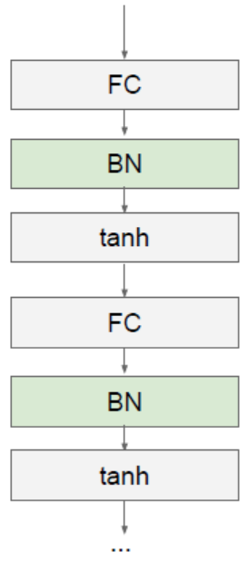

- **目标函数选择**

  - 可加正则项（Regulation Term）
  - 如果是分类问题，F(W) 可以采用SOFTMAX函数和交叉熵

- **参数更新策略**

  - SGD梯度过于随机，可采用上面提到过的一些梯度下降策略
  - 解决梯度随机性问题
    - momentum （角动量）
      每一次更新一个v（速度），第一次算出的方向让他第二次还有一点点影响（让上一次的方向对这次有影响）

- **训练建议**

  - 1）一般情况下，在训练集上的目标函数的平均值（cost）会随着训练的深入而不断减小，如果这个指标有增大情况，停下来。有两种情况：第一是采用的模型不够复杂，以致于不能在训练集上完全拟合；第二是已经训练很好了。
  - 2）分出一些验证集（Validation Set）,训练的本质目标是在验证集上获取最大的识别率。因此训练一段时间后，必须在验证集上测试识别率，保存使验证集上识别率最大的模型参数，作为最后结果。
  - 3）注意调整学习率（Learning Rate）,如果刚训练几步cost就增加，一般来说是学习率太高了；如果每次cost变化很小，说明学习率太低。
  - 4） Batch Normalization 比较好用，用了这个后，对学习率、参数更新策略等不敏感。建议如果用Batch Normalization, 更新策略用最简单的SGD即可，我的经验是加上其他反而不好。
  - 5）如果不用Batch Normalization, 我的经验是，合理变换其他参数组合，也可以达到目的。
  - 6）由于梯度累积效应，AdaGrad, RMSProp, Adam三种更新策略到了训练的后期会很慢，可以采用提高学习率的策略来补偿这一效应。

----

# 深度学习介绍

## 概念科普（CV）

### 图片

图片分为彩色图片和黑白图片。

彩色图片的通道数为3（RGB三色，每个色一个通道）

黑白图片的通道数为1

CWH 

- C ===> Channle
- W ===> Widthh
- H ===> High

### 采样

#### 下采样（池化）

下采样可以降低计算复杂度（图片像素变小了）

把图片的像素进行缩小。常见的下采样（池化）方式有

- **一般池化**

  

  我们定义池化窗口的大小为sizeX，即下图中红色正方形的边长，定义两个相邻池化窗口的水平位移/竖直位移为stride。一般池化由于每一池化窗口都是不重复的，所以sizeX=stride

- **重叠池化**

  - 有重叠。

- **最大池化（Max Pooling）**：选择Pooling窗口中的最大值作为采样值（选特征最强的）

- **均值池化（Mean Pooling）**：将Pooling窗口中的所有值相加取平均，以平均值作为采样值。

- **全局最大（或均值）池化**：与平常最大或最小池化相对而言，全局池化是对整个特征图的池化而不是在移动窗口范围内的池化

  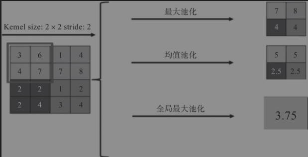

  池化层在CNN中可用来减小尺寸，提高运算速度及减小噪声影响，让各特征更具有健壮性。池化层比卷积层更简单，它没有卷积运算，只是在滤波器算子滑动区域内取最大值或平均值。而池化的作用则体现在降采样：保留显著特征、降低特征维度，增大感受野。深度网络越往后面越能捕捉到物体的语义信息，这种语义信息是建立在较大的感受野基础上。

**采样举例**

- 图片 channel W H = 3 * 5 * 5

- 3个3 * 3的卷积核（通道数为3）给图片做步长为1，卷积后，图片变为【<span style="color:red">几个核（不同的核），就几个通道！</span>】

  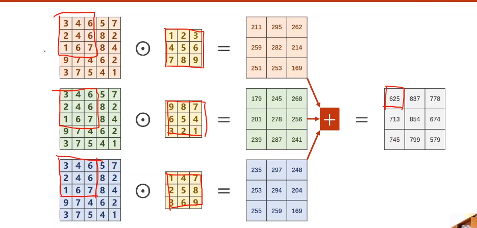

#### 上采样

- 双线性插值（FCN用的这个）

- 转置卷积（也叫反卷积）

  

- 上采样（unsampling）

  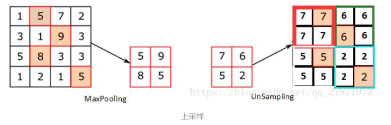

  其中右侧为unsampling，可以看出unsampling就是将输入feature map中的某个值映射填充到输出上采样的feature map的某片对应区域中，而且是全部填充的一样的值

- 上池化（unpooling）

  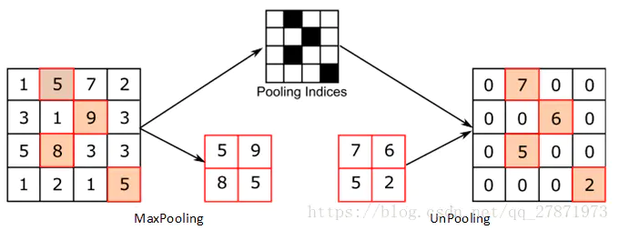

  unpooling的操作与unsampling类似，区别是unpooling记录了原来pooling是取样的位置，在unpooling的时候将输入feature map中的值填充到原来记录的位置上，而其他位置则以0来进行填充。

- <a href="https://www.jianshu.com/p/587c3a45df67">参考博客</a>

### 感受野

感受野用来表示网络内部的不同神经元对原图像的感受范围的大小。

### 卷积的三种模式

full、same、valid

通常用外部api进行卷积的时候，会面临mode选择。

本文清晰展示三种模式的不同之处，其实这三种不同模式是对卷积核移动范围的不同限制。

设 image的大小是7x7，filter的大小是3x3（图片有误 其实是7*6，影响不大）

#### full mode


中间那个橘黄色的是图像，边上蓝色的是卷积核

full的意思是，卷积核和image刚开始相交就做卷积。白色部分为人为填充的0，pytorch中用padding。卷积核的运动范围如上图所示。

#### same mode


当filter的中心(K)与image的边角重合时，开始做卷积运算，可见filter的运动范围比full模式小了一圈。**注意**：这里的same还有一个意思，卷积之后输出的feature map尺寸保持不变(相对于输入图片)。当然，same模式不代表完全输入输出尺寸一样，也跟卷积核的步长有关系。same模式也是最常见的模式，因为这种模式可以在前向传播的过程中让特征图的大小保持不变，调参师不需要精准计算其尺寸变化(因为尺寸根本就没变化)。

#### valid

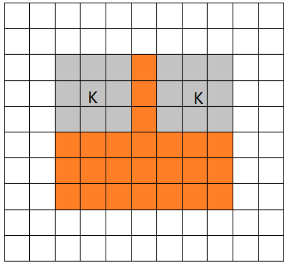

当filter全部在image里面的时候，进行卷积运算，可见filter的移动范围较same更小了。

- <a href="https://blog.csdn.net/leviopku/article/details/80327478">参考的博客</a>

##  多层神经网络

###  优势

- 基本单元简单，多个基本单元可扩展为非常复杂的非线性函数。因此易于构建，同时模型有很强的表达能力。

- 训练和测试的计算并行性非常好，有利于在分布式系统上的应用。

- 模型构建来源于对人脑的仿生，话题丰富，各种领域的研究人员都有兴趣，都能做贡献。

### 劣势

数学不漂亮，优化算法只能获得局部极值，算法性能与初始值有关。

- 不可解释。训练神经网络获得的参数与实际任务的关联性非常模糊。

- 模型可调整的参数很多 （网络层数、每层神经元个数、非线性函数、学习率、优化方法、终止条件等等），使得训练神经网络变成了一门“艺术”。

- 如果要训练相对复杂的网络，需要大量的训练样本。

## 自编码器（Auto-encoder）

解决了（W，b）参数初始化问题。

##  卷积神经网络

### 语义分割常用的神经网络

- FCN 语义分割开山之作
  - FCN把CNN的全连接层改为了卷积层
- U-Net
  - 基于FCN，适合做医学图像分割
- SegNet---encoder-decoder结构的卷积神经网络
- DeepLab V1
- DeepLab V2
- DeepLab V3
- resnet
- vgg【分类网络】
- GoogLeNet【分类网络】

#### FCN

传统CNN通过卷积提取特征，减少了特征图的分辨率，利于分类，当对分割不利。FCN改变了CNN最后的全连接操作，把全连接改为了卷积。【卷积过程中】

#### U-Net

- 简单地将编码器地特征图拼接至每个阶段解码器地上采样特征图，从而形成一个梯形结构。
- 通过跳跃拼接地架构，在每个阶段都允许解码器学习在编码器池化中丢失地相关特征。
- 上采样采用转置卷积
- 推断速度快

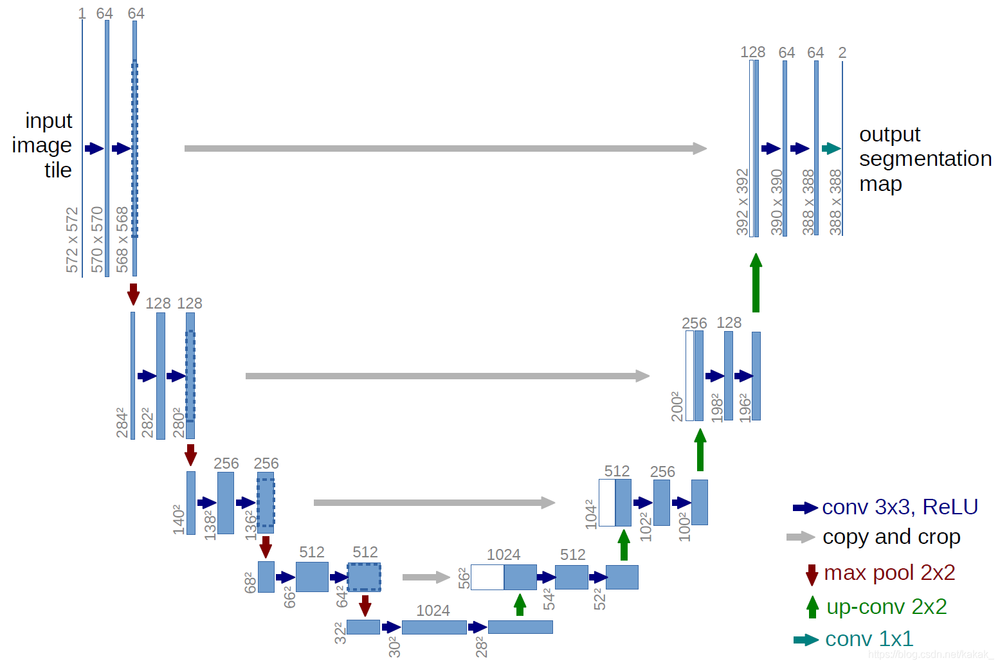

#### PSPNet

利用基于不同区域地信息集合，通过金字塔池化模块，使用金字塔场景解析网络来发挥上下文信息的能力。

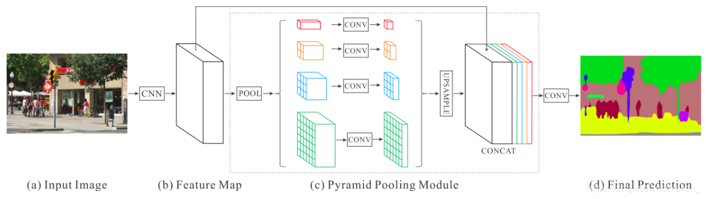

**特点**

- PSPNet 通过引入空洞卷积来修改基础的ResNet架构，特征经过最初的池化，在整个编码器网络中以相同的分辨率进行处理（原始图像输入的1/4），直到到达空间池化模块。
- 在 ResNet 的中间层中引入辅助损失，以优化整体学习。
- 在修改后的 ResNet 编码器顶部的空间金字塔池化聚合全局信息。

#### DeepLab V1 [ 好像不好优化 ]

DCNN 最后一层的响应不足以精确定位目标边界，Deeplab通过在最后一层网络后结合全连接条件随机场（CRF）来解决该定位问题。 FCN + denseCRF.

**特点：**

- 提出空洞卷积（atrous convolution）（又称扩张卷积（dilated convolution））
- 在最后两个最大池化操作中不降低特征图的分辨率，并在倒数第二个最大池化之后的卷积中使用空洞卷积。
- 使用 CRF（条件随机场） 作为后处理，恢复边界细节，达到准确定位效果。
- 附加输入图像和前四个最大池化层的每个输出到一个两层卷积，然后拼接到主网络的最后一层，达到多尺度预测效果。

#### DeepLab V2  [ 好像不好优化 ]

论文中提出了语义分割中的三个挑战：

- 由于池化和卷积而减少的特征分辨率。
- 多尺度目标的存在。
- 由于 DCNN 不变性而减少的定位准确率。

对应解决方法：

- 减少特征图下采样的次数，但是会增加计算量。
- 使用图像金字塔、空间金字塔等多尺度方法获取多尺度上下文信息。
- 使用跳跃连接或者引入条件随机场。


#### DeepLab V3

DeepLab v3 使用 ResNet 作为主干网络

**特点：**

- 为了解决多尺度目标的分割问题，在残差块中使用了多尺度网格方法（MultiGrid），从而引入不同的空洞率。
- 在空洞空间金字塔池化模块中加入图像级（Image-level）特征，并且使用了BatchNormalization 技巧。

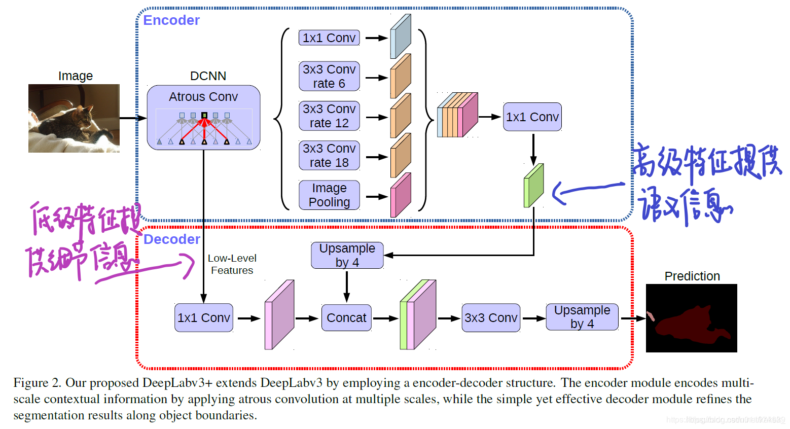

#### VGG

证明了增加网络的深度可以在一定程度上影响网络最终的性能。

VGG16相比AlexNet的一个改进是**采用连续的几个3x3的卷积核代替AlexNet中的较大卷积核（11x11，7x7，5x5）**。对于给定的==感受野==（与输出有关的输入图片的局部大小），采用堆积的小卷积核是优于采用大的卷积核，因为多层非线性层可以增加网络深度来保证学习更复杂的模式，而且代价还比较小（参数更少）。

简单来说，在VGG中，使用了3个3x3卷积核来代替7x7卷积核，使用了2个3x3卷积核来代替5*5卷积核，这样做的主要目的是在保证具有相同感知野的条件下，提升了网络的深度，在一定程度上提升了神经网络的效果。

2个3 * 3 代替 一个 5 * 5 的原因。图示就是两个三乘三。

最顶层的那一块 用了一个 3 * 3

中间那层的用了 一个 3 * 3

这样一算（用心去感觉） 相当于一个5 * 5

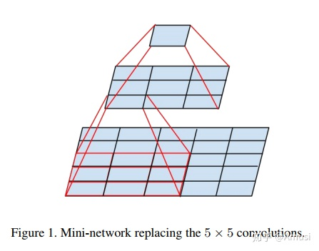

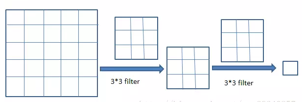

感受野，直观感受。5 * 5的经过两次3 * 3的卷积后，变成了1，所以说，两个3 * 3的卷积核 感受野大小为5.

VGG网络的结构非常一致，从头到尾全部使用的是3x3的卷积和2x2的max pooling。

**VGG优点**

- VGGNet的结构非常简洁，整个网络都使用了同样大小的卷积核尺寸（3x3）和最大池化尺寸（2x2）。
- 几个小滤波器（3x3）卷积层的组合比一个大滤波器（5x5或7x7）卷积层好：
- 验证了通过不断加深网络结构可以提升性能。

**VGG缺点**

- VGG耗费更多计算资源，并且使用了更多的参数（这里不是3x3卷积的锅），导致更多的内存占用（140M）。其中绝大多数的参数都是来自于第一个全连接层。VGG可是有3个全连接层啊！

PS：有的文章称：发现这些全连接层即使被去除，对于性能也没有什么影响，这样就显著降低了参数数量。

注：很多pretrained的方法就是使用VGG的model（主要是16和19），VGG相对其他的方法，参数空间很大，最终的model有500多m，AlexNet只有200m，GoogLeNet更少，所以train一个vgg模型通常要花费更长的时间，所幸有公开的pretrained model让我们很方便的使用。

#### Inception

如何提升网络性能？

- 增加网络的深度和宽度。
  - 容易过拟合【正则化丢弃部分参数】
  - 均匀增加网络的大小会导致计算量加大
- 解决上述不足的方案是：
  - 引入稀疏特性和将全连接层转换成稀疏连接。
- 但是非均匀的稀疏数据计算效率低下。（查找和缓存开销），设计成对称的试试？

**inception结构**

主要思路：使用一个密集成分来近似或者代替最优的局部稀疏结构。

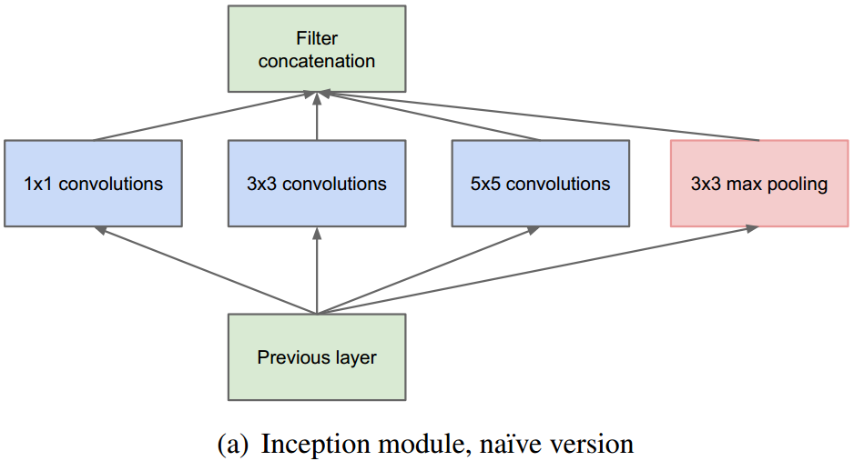


对于上图中的（a）做出几点解释：

　　a）采用不同大小的卷积核意味着不同大小的感受野，最后拼接意味着不同尺度特征的融合； 

　　b）之所以卷积核大小采用1、3和5，主要是为了方便对齐；

　　c）文章说很多地方都表明pooling挺有效，所以Inception里面也嵌入了；

　　d）网络越到后面，特征越抽象，而且每个特征所涉及的感受野也更大了，因此随着层数的增加，3x3和5x5卷积的比例也要增加。

但是，使用5x5的卷积核仍然会带来巨大的计算量。 为此，文章借鉴NIN，采用1x1卷积核来进行降维，如图中（b）所示。
例如：上一层的输出为100x100x128，经过具有256个输出的5x5卷积层之后(stride=1，pad=2)，输出数据的大小为100x100x256。其中，卷积层的参数为5x5x128x256。假如上一层输出先经过具有32个输出的1x1卷积层，再经过具有256个输出的5x5卷积层，那么最终的输出数据的大小仍为100x100x256，但卷积参数量已经减少为1x1x128x32 + 5x5x32x256，大约减少了4倍。

在inception结构中，大量采用了1x1的矩阵，主要是两点作用：1）对数据进行降维；2）引入更多的非线性，提高泛化能力，因为卷积后要经过ReLU激活函数。

<a href="https://www.cnblogs.com/dengshunge/p/10808191.html">inception博客</a>

<a href="https://zhuanlan.zhihu.com/p/41423739">vgg博客</a>

<a href="https://blog.csdn.net/JianqiuChen/article/details/105332206?utm_medium=distribute.pc_relevant_t0.none-task-blog-BlogCommendFromMachineLearnPai2-1.add_param_isCf&depth_1-utm_source=distribute.pc_relevant_t0.none-task-blog-BlogCommendFromMachineLearnPai2-1.add_param_isCf">一些博客</a>

## 循环神经网络

RNN让神经网络有了记忆，<span style="color:red">对于序列化的数据，RNN网络能达到更好的效果。</span>

### 神经网络回顾

神经网络可以当做是能够拟合任意函数的黑盒子，只要训练数据足够，给定特定的x，就能得到希望的y，结构图如下：

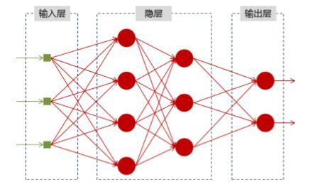

将神经网络模型训练好之后，在输入层给定一个x，通过网络之后就能够在输出层得到特定的y，那么既然有了这么强大的模型，为什么还需要RNN（循环神经网络）呢？

### 为什么要RNN？

普通的神经网络只能单独的取处理一个个的输入，前一个输入和后一个输入是完全没有关系的。<span style="color:red">但是，某些任务需要能够更好的处理**序列**的信息，即前面的输入和后面的输入是有关系的。</span>典型的例子是NLP处理。

### RNN结构

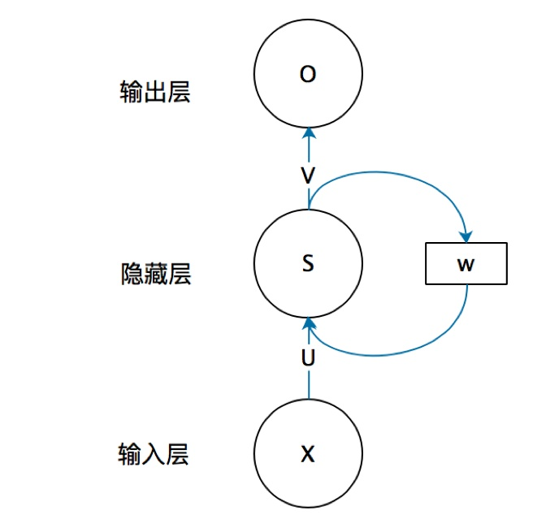

x是一个向量，它表示**输入层**的值（这里面没有画出来表示神经元节点的圆圈）；s是一个向量，它表示**隐藏层**的值（这里隐藏层面画了一个节点，你也可以想象这一层其实是多个节点，节点数与向量s的维度相同）；

U是输入层到隐藏层的**权重矩阵**，o也是一个向量，它表示**输出层**的值；V是隐藏层到输出层的**权重矩阵**。

那么，现在我们来看看W是什么。**循环神经网络**的**隐藏层**的值s不仅仅取决于当前这次的输入x，还取决于上一次**隐藏层**的值s。**权重矩阵** W就是**隐藏层**上一次的值作为这一次的输入的权重。

我们给出这个抽象图对应的具体图：

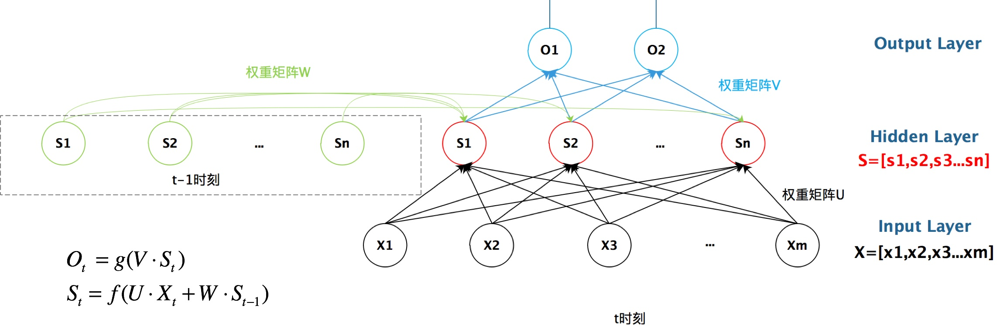

把上图按时间线展开的话：

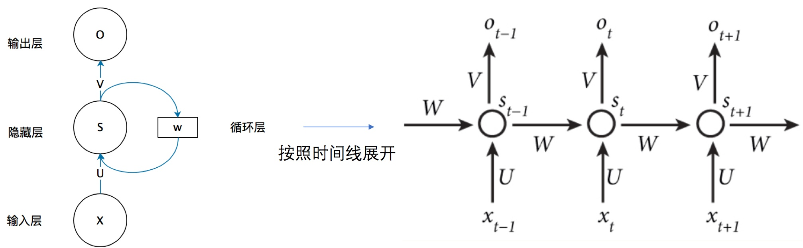

用公式表示如下：

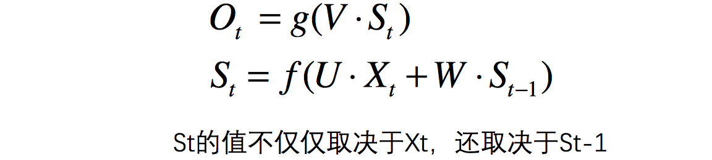

注意：为了简单说明问题，偏置都没有包含在公式里面

### 普通RNN的弊端

RNN会对之前发生的事情进行记忆，但是它的记忆能力并不好，会发生记忆丢失。为什么？

信息源可能需要多次传播才可以到达目标点，我们可以得到误差，但是在反向传播的时候，他会乘以一个参数，这种操作可能会导致误差消失（梯度消失）或误差无限放大（梯度爆炸）所以RNN可能无法回忆久远的事物。

### 解决方案LSTM

LSTM Long Short-Term Memory

比起RNN，它多出了三个控制器，输入/出 & 忘记。

多了一个控制全局的记忆，会将分线剧情，根据其重要程度写入主线中。忘记方面，若分线剧情改变了，忘记就会更新主线中的对应内容。输出根据主线和支线进行判断。

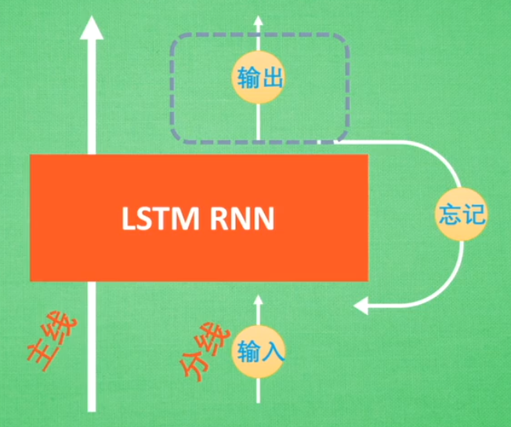

### RNN 分类

demo概述：用RNN对MNIST数据集进行分类。

RNN一般用在时间序列方面的数据，如何用它处理图片？

<span style="color:red">用 RNN 的最后一个时间点输出来判断之前看到的图片属于哪一类</span>

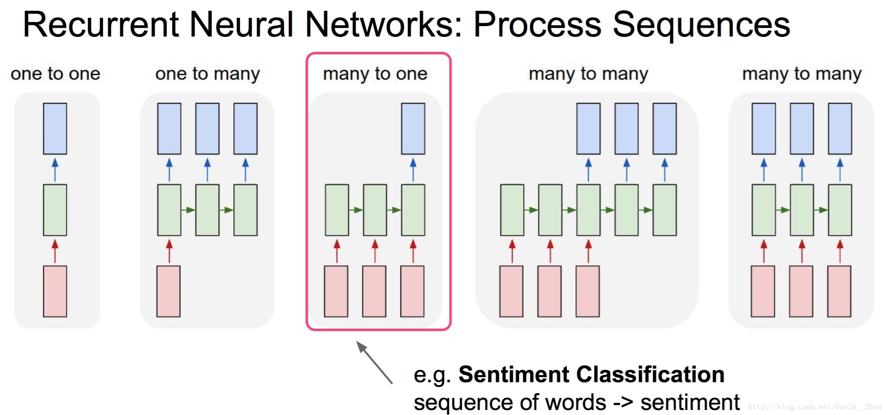

图像的分类对应上图就是个`many to one`的问题. 对于mnist来说其图像的size是28*28，如果将其看成28个step，每个step的size是28的话，是不是刚好符合上图. 当我们得到最终的输出的时候将其做一次线性变换就可以加softmax来分类了

# 其他

## DQN

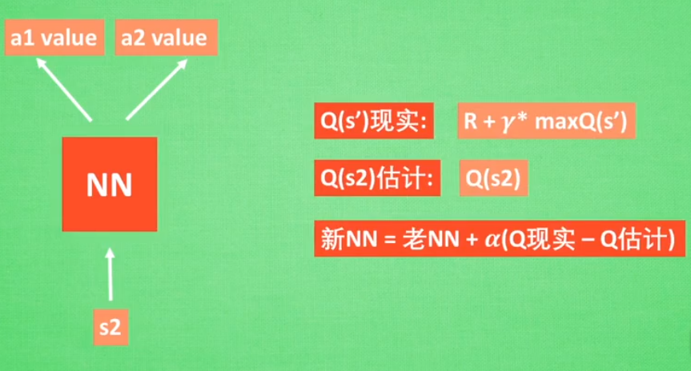

## GAN

Generative Adversarial Nets

## 回顾

神经网络分类回顾【输入数据 得到结果】

- 普通前向传播网络
- 分析图片的CNN
- 分析语音文字的RNN网络

## 生成网络

凭空生成数据。没有意义的数字  生成数据。

生成对抗网络


Generator 会根据随机数来生成有意义的数据 , Discriminator 会学习如何判断哪些是真实数据 , 哪些是生成数据, 然后将学习的经验反向传递给 Generator, 让 Generator 能根据随机数生成更像真实数据的数据. 这样训练出来的 Generator 可以有很多用途, 比如最近有人就拿它来生成各种卧室的图片.

## GPU加速

把tensor数据放在GPU上

- 数据.cuda()

把神经网络放在GPU上

- cnn = CNN()
- cnn.cuda()

把数据移动到cuda里。

把cnn的模块移动到cuda里。

train_data 计算图纸 都移动到cuda里去。

----

# 过拟合

训练过度，把非特征的数据当作特征来训练。

如何解决？

- 增加数据量
- 运用正规化
  - y = Wx 【W为学习参数】
  - L1: `cost = （Wx - realy）^2 + abs(W)`
  - L2: `cost = （Wx - realy）^2 + (W)^2`
- Dropout regularization (丢弃正则化)

官方文档

```python
torch.nn.Dropout(0.5) # 随机有 50% 的神经元会被关闭/丢弃.
"""
dropout神经网络的建立
"""
net_dropped = torch.nn.Sequential(
    torch.nn.Linear(1, N_HIDDEN),
    torch.nn.Dropout(0.5),  # drop 50% of the neuron
    torch.nn.ReLU(),
    torch.nn.Linear(N_HIDDEN, N_HIDDEN),
    torch.nn.Dropout(0.5),  # drop 50% of the neuron
    torch.nn.ReLU(),
    torch.nn.Linear(N_HIDDEN, 1),
)
```

---

#  Batch Normalization

## 概述

**批标准化**

**为什么要标准化？**

具有统一规格的数据, 能让机器学习更容易学习到数据之中的规律.

**如何处理**

Batch normalization 的 batch 是批数据, 把数据分成小批小批进行 stochastic gradient descent. 而且在每批数据进行前向传递 forward propagation 的时候, 对每一层都进行 normalization 的处理。计算结果值的分布对于激励函数很重要

**Normalization公式**

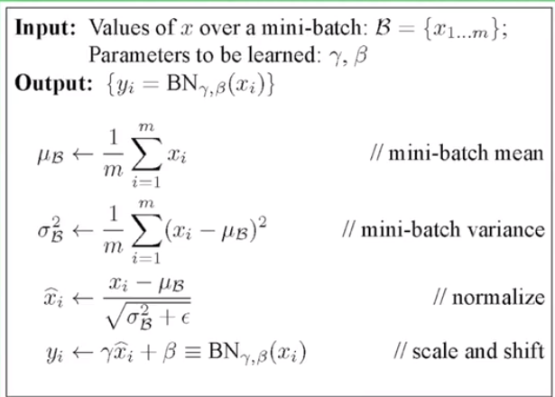

我们引入一些 batch normalization 的公式. 这三步就是我们在刚刚一直说的 normalization 工序, 但是公式的后面还有一个反向操作, 将 normalize 后的数据再扩展和平移. 原来这是为了让神经网络自己去学着使用和修改这个扩展参数 gamma, 和 平移参数 β, 这样神经网络就能自己慢慢琢磨出前面的 normalization 操作到底有没有起到优化的作用, 如果没有起到作用, 我就使用 gamma 和 belt 来抵消一些 normalization 的操作.

demo概述：用 `sin` 的曲线预测出 `cos` 的曲线.

----

# 简单案例

## 线性模型

主要是熟悉API的使用，具体理论方面去看书。

- 准备数据集
- 选择模型（根据数据集进行选择）
- 训练（个别可以不做训练，eg：KNN）
- inferring，看模型的效果

有标签：监督学习

无标签：无监督学习

有些有，有些无：半监督学习。

判断模型的优劣

将数据分为测试集和训练集，进行模型训练和模型效果检测。关于测试集和训练集的划分看书。数据集尽量和真实的环境保持一致。这让我想起了NLP中语料库的重要性。

随机猜测权重，对权重进行评估，然后重新调整。

评估找到的模型与数据集的误差有多大。这种评估模型称之为<span style="color:red">损失</span>
$$
损失函数
loss = (\hat{y}-y)^2 = (x * \omega - y)^2
$$
y_hat 是预测值

ω是权重。

对于整个训练集，我们需要把累加每一个样本的损失函数求均值。
$$
cost = \frac{1}{N}\sum^{n}_{1\to n} (\hat y_n - y_n)^2
$$
根据不同的权重计算MSE 平均平方误差 ，选取最优的ω。通过穷举来做【准确的来说，是通过类似于二分的方式来做吧】。

视频里真的是定义好步长，穷举。

请通过以下数据集，和以下方程计算出一个较优的ω

```shell
x_data = [1,2,3,4]
y_data = [2,4,6,8]

y = x * ω
loss = （y_hat -y）^2
# 拓展 增加一个b（bais）
```

训练的结果通过可视化工具，直观的展示训练效果，看那个区间最优，继续缩小范围进行调参【论可视化工具的重要性 visdom】

深度学习的代码 跑的周期可能很长。怕程序奔溃，丢失训练的部分结果，最好是存盘。

## 线性回归

- 准备数据
- 设计模型，计算y_hat
- 构造损失函数和构造器
- 训练周期
  - forward：算损失
  - backward：算损失的梯度
  - update：更新权重

$$
\hat y = ω*x + b
$$

​				需要确定 ω和b的大小

```python
import torch

x_data = torch.tensor([[1.0], [2.0], [3.0]])
y_data = torch.tensor([[2.0], [4.0], [6.0]])


class LinearModel(torch.nn.Module):
    def __init__(self):
        # 调用父类的构造
        super(LinearModel, self).__init__()
        # torch.nn.Linear(1, 1) 构造一个对象，包含权重和偏置
        self.linear = torch.nn.Linear(1, 1)

    def forward(self, x):
        # 实现了一个__call__
        y_pred = self.linear(x)
        return y_pred


model = LinearModel()
# 标准
criterion = torch.nn.MSELoss(size_average=False)
# 优化器   lr是学习率，应该是每次梯度下降的步长
optimizer = torch.optim.SGD(model.parameters(), lr=0.01)

for epoch in range(2000):
    y_pred = model(x_data) # 模型
    loss = criterion(y_pred, y_data) # 损失
    print(epoch, loss.item())

    # 更新的时候需要相应的优化器
    optimizer.zero_grad()
    # 反馈 得到梯度 然后进行优化
    loss.backward()
    optimizer.step()

print('w=', model.linear.weight.item())
print('b=', model.linear.bias.item())

x_test = torch.tensor([[4, 0]])
y_test = model(x_test)
print('y_pred', y_test.data)


# * 元组
# ** 字典
def func(*args, **kwargs):
    print(args)
    print(kwargs)
```

**步骤**

- 准备数据
- 定义模型
- 计算损失
- 优化

## 实现逻辑斯蒂回归

```python
import torchvision # 集成了常用的那些数据集

# 从里面找数据集 root应该是下载的文件存放在哪里
tran_set = torchvision.datasets.MNIST(root='../dataset/mnist', train=True, download=True)
test_set = torchvision.datasets.MNIST(root='../dataset/mnist', train=False, download=True)
```

## Logistic Regression Model

$$
\hat y = σ(x*ω+b)
$$

加了一个xx函数（名字忘了哈哈哈），让值分布在0-1之间

- Loss Function for Linear Regression
  $$
  loss = (\hat y - y)^2 = (x*ω-y)^2
  $$

- Loss Function for Binary Classification
  $$
  loss = -(y log\hat y + (1-y)log(1-\hat y))
  $$

- 优化器公式【梯度下降】
  $$
  ω = ω - a \frac {\partial cost}{\partial ω}
  $$

```python
import torch
import torch.nn.functional as F
import torch.nn.modules

x_data = torch.Tensor([[1.0], [2.0], [3.0]])
y_data = torch.Tensor([[0], [0], [1]])

class LogisiticRegressionModel(torch.nn.Module):
    def __init__(self):
        super(LogisiticRegressionModel, self).__init__()
        self.linear = torch.nn.Linear(1, 1)

    def forward(self, x):
        y_pred = F.sigmoid(self.linear(x))
        return y_pred


model = LogisiticRegressionModel()

criterion = torch.nn.BCELoss(size_average=False)
optimizer = torch.optim.SGD(model.parameters(), lr=0.01)
for epoch in range(1200):
    y_pred = model(x_data)
    loss = criterion(y_pred, y_data)
    print(epoch, loss.item())

    optimizer.zero_grad()  # 清理
    loss.backward()
    optimizer.step()
```

基本就是这四个步骤。

- 准备数据
- 选择模型
- 构造loss 和 优化器
- 不断迭代

```text
损失最低 就是效果好

一般  实验 要看指标

损失就是通过计算  准确呢  可以作为参考

越不准确  loss越大

实验中  效果最好也不是看你的训练数据

你要用验证数据 去验证

不然损失很低  训练时候过拟合  但是 在测试集上效果非常差

一般是 训练集 训练  指标看验证集的

同时看
```

## Dataset&Dataloader

### API概述

```python
DataLoader: batch_size=2, shuffle=True
# batch_size = 2 2个数据分为一组
# shuffle 打乱数据。
```

### 定义自己的Dataset

```python
# 来看一手源码注释
r"""
    Data loader. Combines a dataset and a sampler, and provides an iterable over
    the given dataset.

    The :class:`~torch.utils.data.DataLoader` supports both map-style and
    iterable-style datasets with single- or multi-process loading, customizing
    loading order and optional automatic batching (collation) and memory pinning.

    See :py:mod:`torch.utils.data` documentation page for more details.

    Arguments:
        dataset (Dataset): dataset from which to load the data.
        batch_size (int, optional): how many samples per batch to load
            (default: ``1``).
        shuffle (bool, optional): set to ``True`` to have the data reshuffled
            at every epoch (default: ``False``).
        num_workers (int, optional): how many subprocesses to use for data
"""
    def __init__(self, dataset, batch_size=1, shuffle=False, sampler=None,
                 batch_sampler=None, num_workers=0, collate_fn=None,
                 pin_memory=False, drop_last=False, timeout=0,
                 worker_init_fn=None, multiprocessing_context=None,
                 generator=None):
```

### 代码

```python
import torch
import numpy as np
from torch.utils.data import Dataset
from torch.utils.data import DataLoader


class Model(torch.nn.Module):
    def __init__(self):
        super(Model, self).__init__()
        # in_features: int, out_features: int
        # 8是特征的数量  1时输出结果的数目
        self.linear1 = torch.nn.Linear(8, 6)  # 第一层
        self.linear2 = torch.nn.Linear(6, 4)  # 第二层
        self.linear3 = torch.nn.Linear(4, 1)  # 第三层
        self.sigmoid = torch.nn.Sigmoid()  # 阶跃函数

    def forward(self, x):
        # 一层一层正向传播
        x = self.sigmoid(self.linear1(x))
        x = self.sigmoid(self.linear2(x))
        x = self.sigmoid(self.linear3(x))
        return x


# 自定义的Dataset需要几次 torch的Dataset
class DiabetesDataset(Dataset):
    # 初始化数据集
    def __init__(self, filepath):
        xy = np.loadtxt(filepath, delimiter=',', dtype=np.float32)
        self.len = xy.shape[0]
        self.x_data = xy[:, :-1]
        self.y_data = xy[:, [-1]]

    # The expression dataset[item] will call this magic function
    # 得看看python的高級语法了····
    def __getitem__(self, item):
        return self.x_data[item], self.y_data[item]

    def __len__(self):
        return self.len


model = Model()
criterion = torch.nn.BCELoss(reduction='mean')
optimizer = torch.optim.SGD(model.parameters(), lr=0.010)

dataset = DiabetesDataset('diabetes.csv.gz')
# dataset 加载的数据集
# batch_size 多少数据为一个batch
# shuffle 是否打乱原始的数据
# num_workers 使用多少子程序处理数据
train_loader = DataLoader(dataset=dataset,
                          batch_size=32,
                          shuffle=True,
                          num_workers=2)

if __name__ == '__main__':
    for epoch in range(100):
        # 补充 enumerate语法
        # debug 看看
        for i, data in enumerate(train_loader, 0):
            inputs, labels = data
            y_pred = model(inputs)
            loss = criterion(y_pred, labels)
            print(epoch, loss.item())
            optimizer.zero_grad()
            loss.backward()
            optimizer.step()
```

## 多分类问题

### Softmax概述

多分类要输出多个。二分类输出两个即可。 

有10个分类，有9个参数就够了。第10个分类用1-前面的求和，但是这样不利于并行计算。

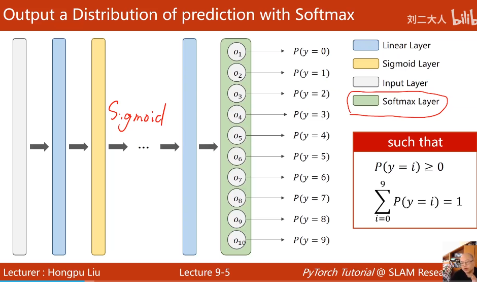

归一化？

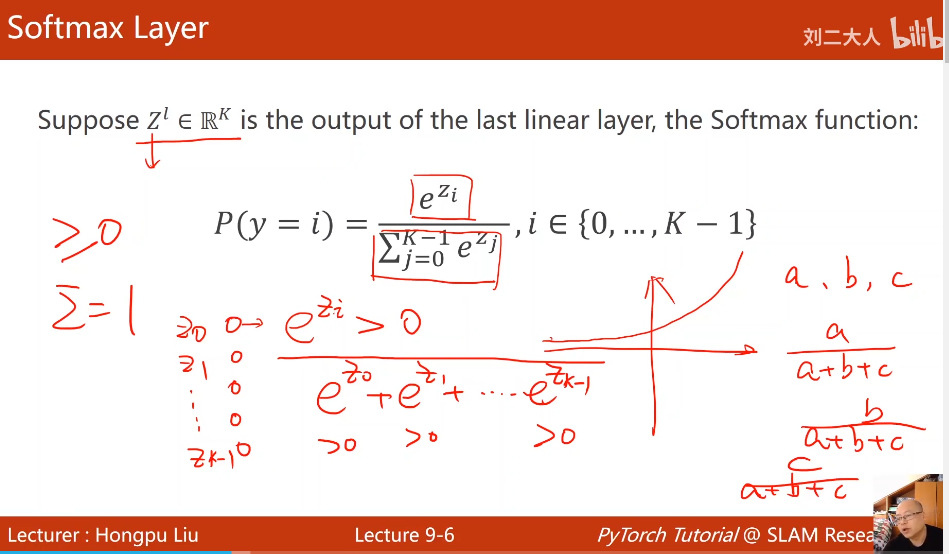

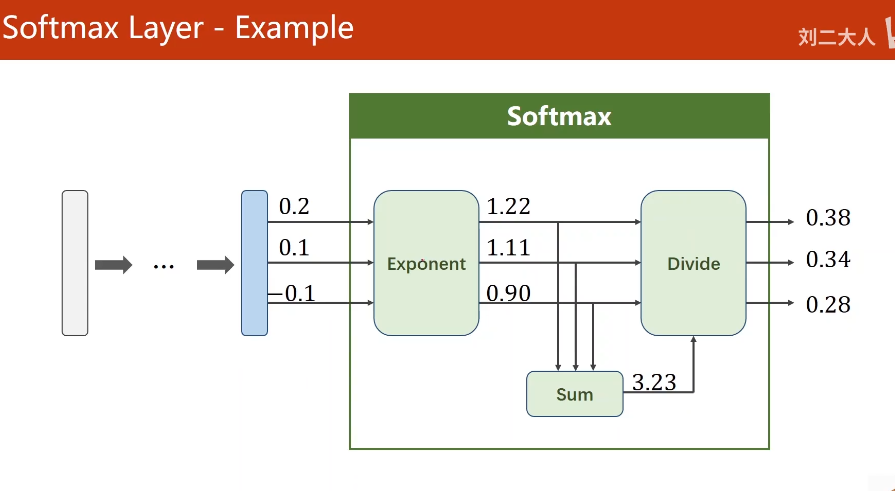

激活的操作，在交叉熵损失中完成了。

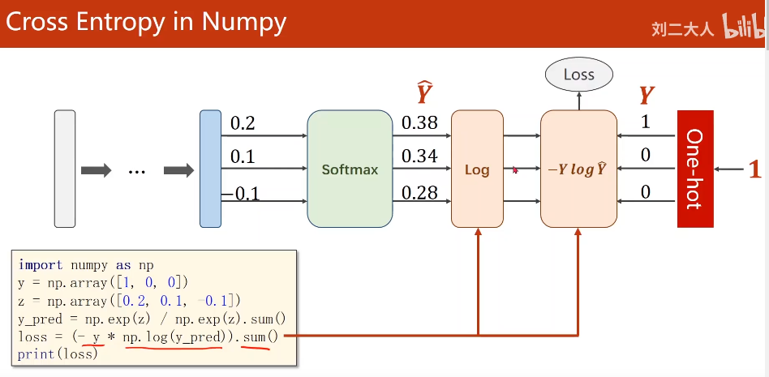

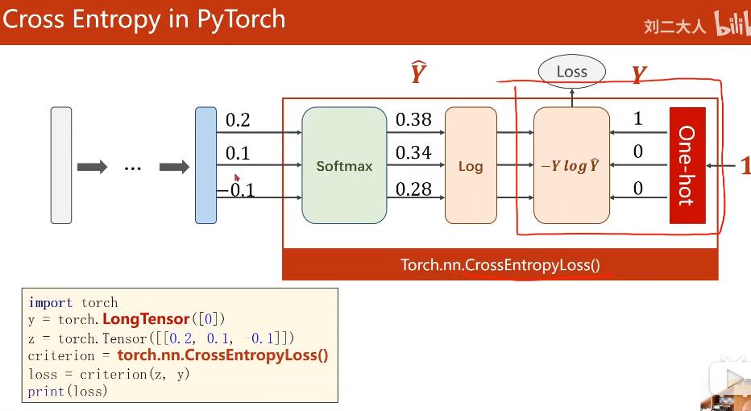

**交叉熵损失demo测试**

```python
import torch

criterion = torch.nn.CrossEntropyLoss()
y = torch.LongTensor([2, 0, 1])

y_pred1 = torch.Tensor([[0.1, .02, 0.9],
                        [1.1, 0.1, 0.2],
                        [0.2, 2.1, 0.1]])
y_pred2 = torch.Tensor([[0.8, 0.2, 0.3],
                        [0.2, 0.3, 0.5],
                        [0.2, 0.2, 0.5]])
# 1的loss是比较小的 2的loss是比较大的
l1 = criterion(y_pred1, y)
l2 = criterion(y_pred2, y)
print(l1, l2)
```

### MNIST

拿到图像后先把他变成Tensor数据类型

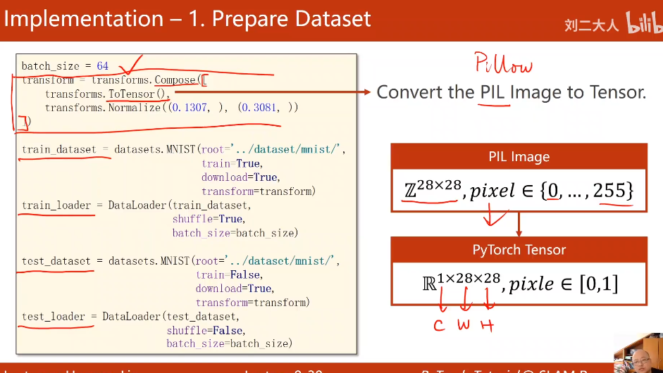

- 1x28x28 1维 28*28 == 把三阶张量变成一阶，一张图片一共784个像素数。
- ToTensor 把图像变成Tensor类型
- Normalize(mean,σ) 让数据满足0 1 分布

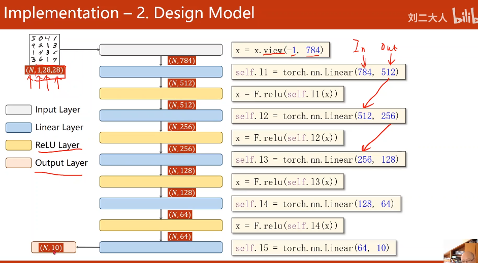

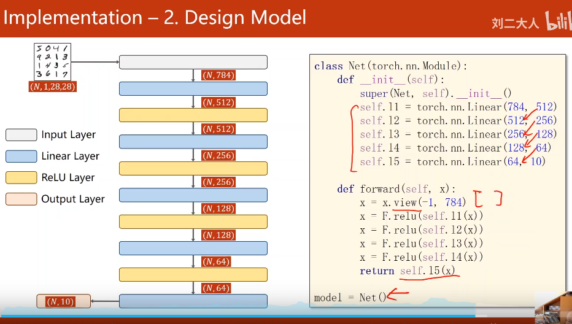

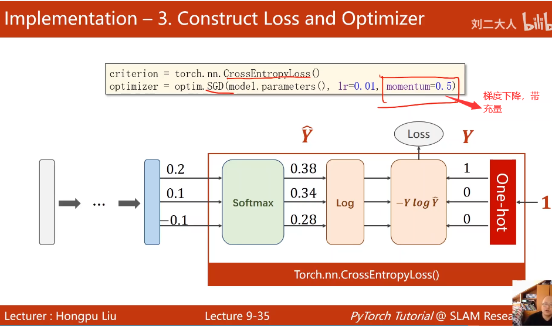

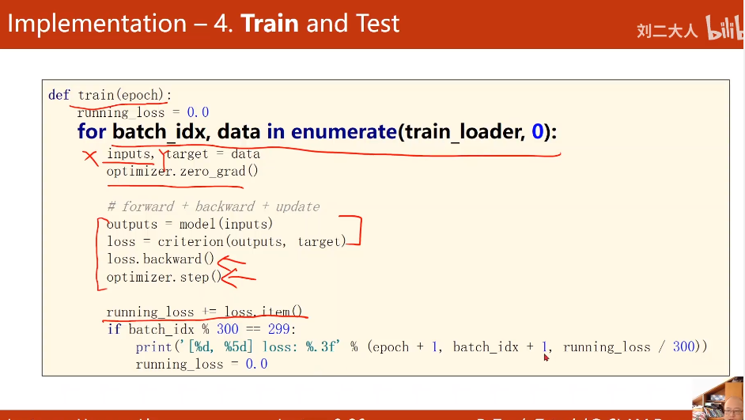

---


