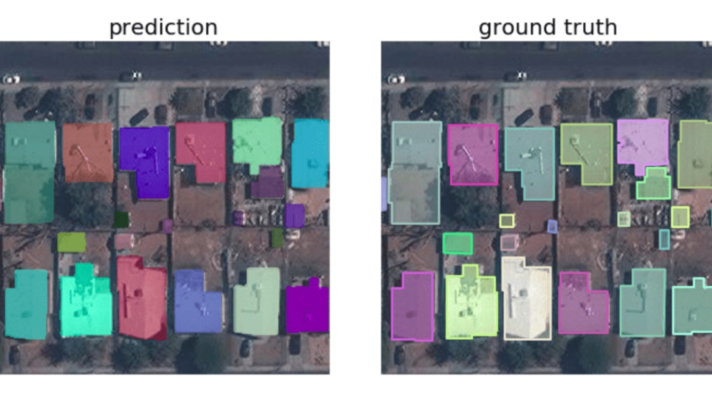
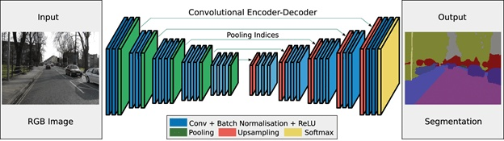
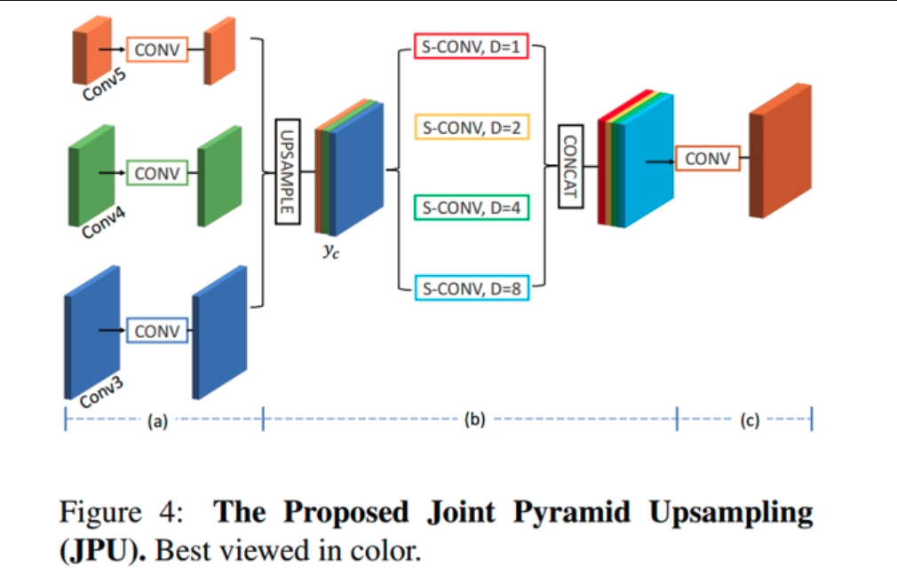

> **概念科普**

prediction 预测值

ground truth 真实值

> **图像分割架构**

编码器通滤波器从图像中提取特征。解码器负责生成最终的输出，通常是一个包含目标轮廓的分割掩码。大多数体系结构都有这种体系结构或其变体。[滤波器这块好好补一补]

> **U-Net**

为分割生物医学图像而开发。

下采样捕获上下文【提取图像特征】

上采样帮助精确定位【还原图片，定位==分割】

下采样块，两个$3*3$卷积+ReLU函数，再进行$2*2$的最大池化 [要进行适当的裁剪]

> **FastFCN**

联合上采样模块 JPU（Joint Pyramid Upsampling）

用JPU模块代替空洞卷积，核心是全连接网络，使用JPU进行上采样。JPU将低分辨率特征图提升为高分辨率特征图。[怎么提的？]

上采样模块JPU图片及解释

其中，
a) 将来自Conv3、Conv4和Conv5的卷积降维输出；
b) 将(a)中生成的feature map上采样后concatenate，接着使用四个膨胀率（dilation rates）分别为1、2、4和8的空洞卷积分别提取特征并concatenate；
c) 将(b)提出的特征映射到最后的预测层。