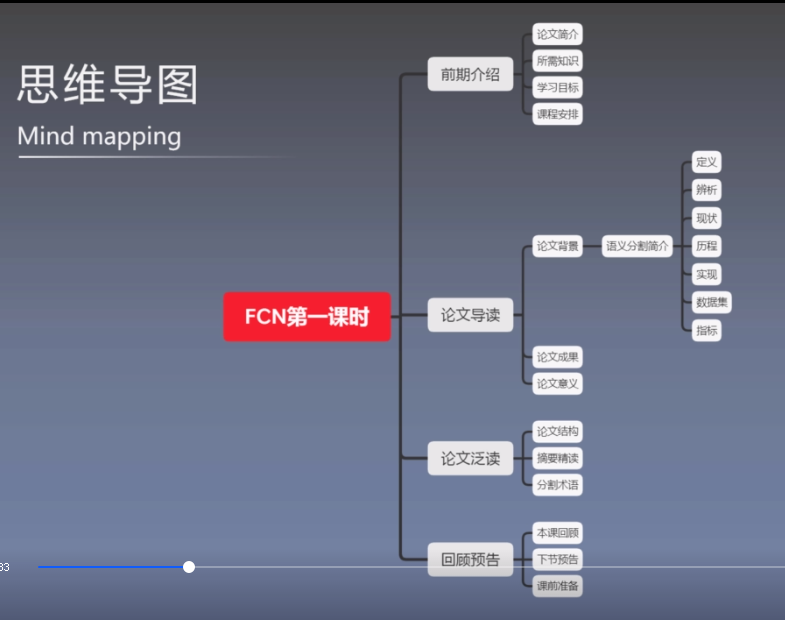
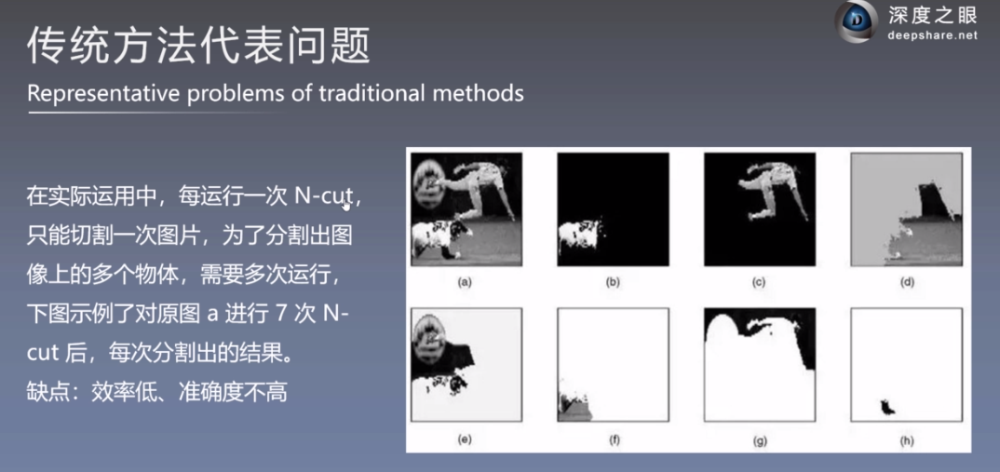
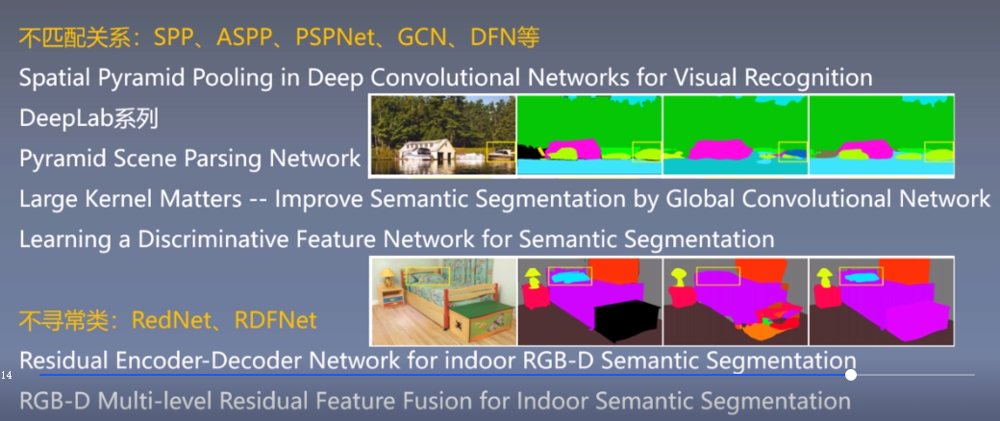
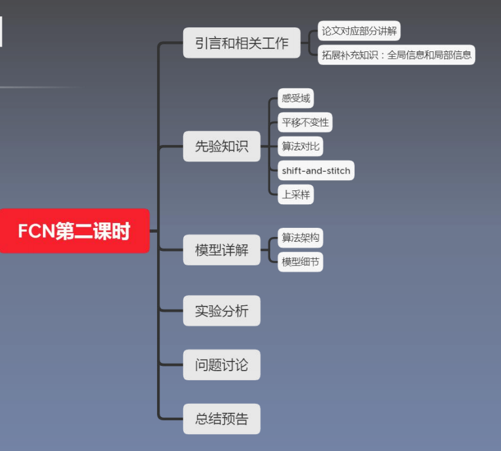
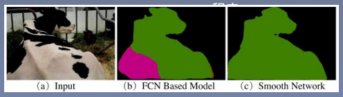
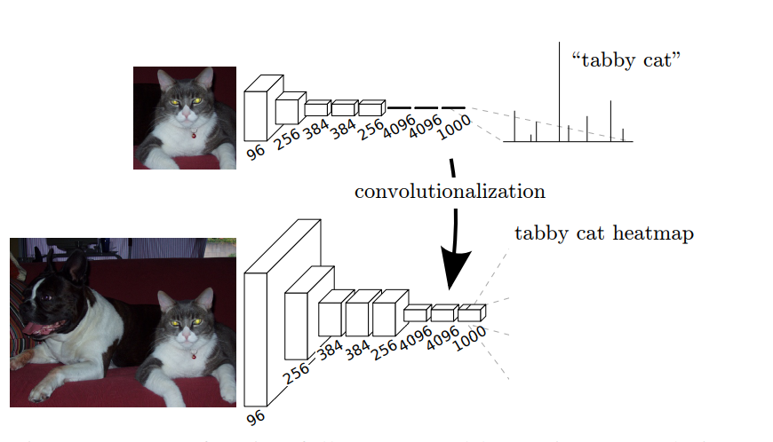
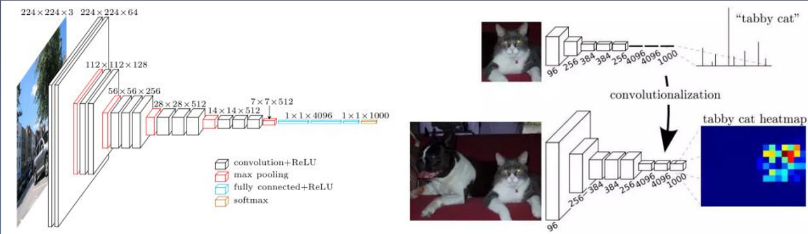

# FCN

## 思维导图



## 前期知识储备

- 神经网络：NN的基本概念以及前向传播和反向传播的大致过程
- 卷积神经网络：掌握CNN基本原理，包括卷积、池化、上采样等
- 分类网络：掌握经典分类算法思想，包括VGG net、AlexNet、GoogLeNet
- PyTorch基础


## 学习目标

- 掌握语义分割常识性知识：概念、术语、应用   **( 0.5天 )** √ 
- 熟练掌握FCN算法模型：结构、意义、补充知识点  **( 1~2天 )**  √ 
- 熟练掌握FCN模型的代码定义：训练、验证、测试、预处理、模型定义、结果输出  **( 2~5 天)** √ 

## 论文导读

- 论文研究背景、成果及意义
- 论文泛读
- 回顾

###  概念&定义

语义分割，具体到抽象的定义。

语义：图片表达的意思。

分割：把图片中关系的对象 用不同的颜色标记出来

概念辨析

- 语义分割
- 实例分割：无需分割背景，不同种类之间颜色不一样，同种类之间颜色也不一样。
- 全景分割：背景和目标都进行细分

主要成就：s端到端、像素到像素训练方式下的卷积神经网络超过了现有语义分割方向最先进的技术

核心思想：搭建了一个全卷积网络，输入任意尺寸的图像，经过有效推理和学习得到相同尺寸的输出

主要方法：将当前分类网络改编成全卷积网络（AlexNet、VGGNet和GoogLeNet）并进行微调设计了跳跃连接将全局信息和局部信息连接起来，相互补偿

实验结果：在PASCALVOC、NYUDv2和SIFTFlow数据集上得到了state-of-the-art的结果

### 研究现状

- 传统方法（慢）
  - Normalized cut 
  - Structured Random Forests 容易过拟合，准确率不高
  - SVM
- 深度学习卷积神经网络：
  - FCN
  - SegNet
  - LinkNet ...

#### 传统方法



#### 深度学习代表问题

- 不匹配关系：融合局部信息和全局信息进行判断，代表性的有金字塔卷积，空洞金字塔卷积
- 不寻常类：RedNet、RDFNet



### 实现流程

#### 训练

根据batch size大小，将数据集中的训练样本和标签读入卷积神经网络。根据实际需要，应先对训练图片及标签进行预处理，如裁剪、数据增强等。这有利于深层网络的的训练，加速收敛过程，同时也避免过拟合问题并增强了模型的泛化能力。

#### 验证

训练一个epoch结束后,将数据集中的验证样本和标签读入卷积神经网络，并载入训练权重。根据编写好割指标进行验证，得到当前训的语义分练过程中的指标分数，保存对应权重。常用一次训练一次验证的方法更好的监督模型表现。

#### 测试

所有训练结束后，将数据集中的测试样本和标签读入卷积神经网络，并将保存的最好权重值载入模型，进行测试.测试结果分为两种，一种是根据常用指标分数衡量网络性能，另一种是将网络的预测结果以图片的形式保存下来，直观感受分割的精确程度。

### 常用数据集介绍

Common datasets of semantic segmentation  https://github.com/shelhamer/fcn.berkeleyvision.org

- SUNRGBD 室内场景 37个类别， 10335张图片
- NYUDv2 室内场景 40个类别 1449张图片
- PASCAL VOC 综合场景 21个类别，2913张图片
- CityScapes  道路场景 规模较大，5000张图片，30个类别。（比较完整，这个很不错）
- CamVid   道路场景 小规模数据集，直接以图片形式保存。不需要读数据，直接导进来就可以了。

### 语义分割常用指标

综述中做了笔记，不在赘述。主要是MIOU的值。

### 研究成果

- 将分类网络改编为**全卷积神经网络**，具体包括全连接层转化为卷积层以及通过反卷积进行**上采样**
- 使用**迁移学习**（利用前面的分类算法，对后面做一个调整）的方法进行微调
- 使用**跳跃结构**使得**语义信息**可以和**表征信息**相结合，产生准确而精细的分割
- FCN证明了**端到端**、**像素到像素**训练方式下的卷积神经网络超过了现有语义分割方向最先进的技术
- FCN成为了PASCAL VOC最出色的分割方法，较201 1和2012分割算法的MIoU提高了将进20%

### 研究意义

**FCN历史意义**

- 深度学习用在语义分割领域的开山之作。
- 端到端训练为后续语义分割算法的发展铺平了道路。

**应用**

- 地理信息系统

- 无人车驾驶

- 医疗影像分析

- 机器人等领域

## 论文泛读

### 论文结构

- 摘要：介绍论文的背景、核心观点、方法途径、最终成果。
- Introduction：语义分割研究现状、本文贡献、文章整体结构。
- Related Work：文章思想来源、先前方法的特点、本文的不同之处。

- Prior knowledge：卷积网络基本定义、与分类网络间的联系和区别、Shift- and-stitch.Deconvolution、Patchwise training。
- Details of learning：算法结构、创新点、设计细节
- Result：指标定义、多种数据集中的实验分析
- Conclusion：实验结论
- References：参考文献 【<span style="color:green">**提到的问题很感兴趣，那么可以读参考文献，建议看看参考文献哦！**</span>】

文献积累？

- 读引言
- introduction
- 参考文献
- 做记录、整理

#### 摘要

- 端到端 end-to-end

- 核心观点（key insight）

  - 构建full convolutional networks.
  - 输入是图，输出也是图！【图片到图片的推理过程】
  - 能容纳任意尺寸的东西。输入尺寸任意，并且最后给你还原尺寸。

- dense prediction tasks, 密集预测任务 = 像素预测任务

- 论文的手段和方法：改变经典的分类算法

  ```java
   We adapt contemporary classification networks (AlexNet [19],the VGG net [31], and GoogLeNet [32]) into fully convolutional networks and transfer their learned representations by fine-tuning [4] to the segmentation task.
  ```

- 两个创新点

  ```java
  We then define a novel architecture that combines semantic information from a deep, coarse layer with appearance information from a shallow, fine layer to produce accurate and detailed segmentations.
  ```

  把浅层的表征信息和深层的特征信息进行融合。【如何融合？怎么的浅层和怎样的深层】

**总结**

- 主要成就：
  - <span style="color:green">**端到端**</span>：像素到像素训练方式下的卷积神经网络超过了现有语义分割方向最先进的技术
  - <span style="color:green">**核心思想**</span>：搭建了一个全卷积网络，输入任意尺寸的图像，经过有效推理和学习得到相同尺寸的输出。
  - <span style="color:green">**主要方法**</span>：将当前分类网络改变成全卷积网络（AlexNet，VGGNet和GoogleNet）并进行微调设计了跳跃连接将全局信息和局部信息连接起来，相互补偿。
  - <span style="color:green">**实验结果**</span>：在PASCAL VOC、NYUv2和SIFT Flow数据集上得到了<span style="color:red">state-of-the-art</span>结果（得到了最好的结果）

**名词解释**

端到端：输入是图片，输出也是图片，输入输出的大小一样。

所有的分割都是端到端的。

端到端网络的最主要特点就是根据设计好的算法自己学习特征，而不需要人为干预。（是所有DL network的特点，不只是端到端的特点）

**分割术语**

- pixel-wise ( pixels-to-pixels )：像素级别
  - 每张图片都是由一个个pixel组成的，pixel是图像的基本单位
- image-wise：图像级别
  - 比如一张图片的标签是狗，即“狗”是对整个图片的标注
- patch-wise：块级别
  - 介于像素级别和图像级别之间，每个patch都是由好多个pixel组成的
- patchwise training：
  - 是指对每一个感兴趣的像素，以它为中心取一个patch(小块)，然后输入网络，输出则为该像素的 标签

## 论文精读

### 目录

- 引言和相关工作
- 先验知识
- 论文算法模型详解
- 论文算法模型细节
- 实验设置和结果分析
- 讨论和总结
- 回顾



### Introduction

不感兴趣部分的参考文献可不看。

- 大致讲述背景

####  全局信息与局部信息

**局部信息**

- 提取位置：浅层网络中提取局部信息 

- 特点：物体的几何信息比较丰富 对应的感受野较小 

- 目的：有助于分割尺寸较小的目标 有利于提高分割的精确程 度

**全局信息**

- 提取位置：深层网络中提取全局信息 
- 特点：物体的空间信息比较丰富 对应的感受野较大 
- 目的：有助于分割尺寸较大的目标 有利于提高分割的精确

用局部信息不好判断物体的大致轮廓，用全局信息划分的又太粗糙？



FCN：感受野小了，把整体轮廓划分错误？

**矛盾**

全局信息与局部信息存在矛盾。

网络越来越深，信息丢失的越来越多，不做备份的话，信息就丢了。只剩下全局信息了。

### Related work

提到的一些文章都不常用了。

从那些论文中获得灵感，想出了什么解决办法/思路。（介绍和我这篇论文有关的相关知识或相关问题从何而来。）

- 迁移学习：从经典的分类网络中把参数导进来，做改编。

**引言&相关工作** 

Introduction & Related work 

在以往的分割方法中，主要有两大类缺点： 

- 基于图像块的分割虽然常见，但是效率低，且往往需要前期或者后期处理（例如超像素、检测框、 局部预分类等） 

- 语义分割面临着语义和位置信息不可兼得的问题。全局信息解决的“是什么” ，而局部信息解决 的是“在哪里” 

**为了解决上面这两个问题，本文主要有三个创新点：** 

- 将分类网络改编为全卷积神经网络，具体包括全连接层转化为卷积层以及通过反卷积进行上采样 
- 使用迁移学习的方法进行微调 
- 使用跳跃结构使得语义信息（全局信息）可以和表征信息（局部信息）相结合，产生准确而精细的分割 

对应论文1.Introduction & 2.Related work

### Fully convolutional networks

 Locations in higher layers correspond to the locations in the image they are path-connected to, which are called their receptive fields. == 第一次提出感受域/感受野的概念

#### 感受野/域

- **感受域/野：**一个点对应的区域，就是这个点的感受野/域

通常来说，大感受野的效果要比小感受野的效果 更好。由公式可见，stride越大，感受野越大。 但是过大的stride会使feature map保留的信息 变少。因此，在减小stride的情况下，如何增大 感受野或使其保持不变，成为了分割中的一大问题。$RF_{l+1} = RF_{l}+(kernelSize - 1)*stride$ 这个的计算结果是对应原始图像的区域大小哦！

- $l+1$表示层数

- kernelSize表示卷积核大小

- stride表示步长大小
- <span style="color:green">**约定俗成**</span>，感受域/野的大小对应的是原图的区域大小（统一！好！）

感受域过大的话，保存的信息就少了。

对应原文3.Fully convolutional networks第一段结尾处

#### 平移不变性

不适用于CNN。被证伪了。。。。

《why do deep convolutional networks generalize so poorly to small image transformations?》它忽略了采样定律，过多的下采样导致了这个问题。步长的变化。破坏原始空间。

卷积网络是建立在平移不变性的基础上的。

**宏观结果：**图像中的目标无论被移到图片中的哪个位置，分类结果都应该 是相同的 

**具体过程：**卷积 & 最大池化 ≈ 平移不变图像中的目标有移动时，得到的特征图也会产生相同移动

对应原文3.Fully convolutional networks第二段开头处

<span style="color:green">**原文**</span>：The fully connected layers of these nets have fixed dimensions and throw away spatial coordinates. FC需要固定尺寸，丢弃空间坐标（输出一维向量，它怎么着都不会变成二维的，损失了图像的空间特点）。

<span style="color:green">**原文**</span>：However, these fully connected layers can also be viewed as convolutions with kernels that cover their entire input regions. Doing so casts them into fully convolutional networks that take input of any size and output classification maps. This transformation is illustrated in Figure. 【上帝视角啊】

FCN与经典网络的对比，图示：



**经典算法 VS 本文算法**



FCN网络中，将CNN网络的后三层全部转化为1*1的卷积核所对应等同向量长度的多通道卷积层。整 个网络模型全部都由卷积层组成，没有全连接层产生的向量。CNN是图像级的识别，也就是从图像 到结果。而FCN是像素级的识别，标注出输入图像上的每一个像素最可能属于哪一类别。

对应原文3.1 Adapting classifiers for dense prediction


## **摘要**

背景：

存在的问题：之前未将深层，粗糙层的语义信息与浅层，精细层的外观信息相结合，无法生成准确而详细的细分。分割准确率不高。推理时间长。

`FCN`是如何解决这些问题的？

将全连接改为完全卷积。全连接需要训练的参数过多，效率低。完全卷积需要训练的参数少，效率高些。

## 介绍

介绍了卷积网络（Convolutional networks）在分类上取得的成果：提高了图片的识别率，在结构化输出的本地任务上取得了进展（这句话不理解）。

之前使用卷积网络进行语义分割，其中每个像素被标记为其封闭对象或区域的类别。

证明了FCN端到端，像素到像素的语义分割超过了现在的无further machinery。

FCN高效。Patchwise很常见，但是没FCN高效。

FCN简单，不需要复杂的处理。

语义分割的共有问题，语义分割面临语义和位置之间的内在张力。

- 全局信息解析，本地信息解析

FCN定义了一种新的跳跃架构，将深层、粗糙、语义信息和浅层信息结合起来。

## 相关工作

