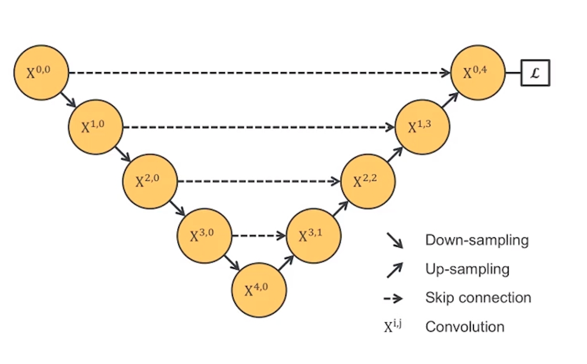

# UNet

## 博客

**受FCN的启发，U型结构。分为编码解码。**

**简化的示意图**

**完整的示意图**

**详解：**

> **注意**

- 蓝色箭头代表3x3的卷积操作，并且stride是1，padding策略是vaild，因此，每个该操作以后，featuremap的大小会减2。

- 红色箭头代表2x2的maxpooling操作，需要注意的是，此时的padding策略也是vaild（same 策略会在边缘填充0，保证featuremap的每个值都会被取到，vaild会忽略掉不能进行下去的pooling操作，而不是进行填充），这就会导致如果pooling之前featuremap的大小是奇数，那么就会损失一些信息 。

- 绿色箭头代表2x2的反卷积操作，这个只要理解了反卷积操作，就没什么问题，操作会将featuremap的大小乘2。

- 灰色箭头表示复制和剪切操作，可以发现，在同一层左边的最后一层要比右边的第一层要大一些，这就导致了，想要利用浅层的feature，就要进行一些剪切，也导致了最终的输出是输入的中心某个区域。

- 输出的最后一层，使用了1x1的卷积层做了分类。

----

> **具体说明**

- 输入 $572*572$，经过$3*3$的卷积和ReLU激活后，变为$570*570$了。$570*570$，经过$3*3$的卷积和ReLU激活后，变为$568*568$了。
- $568*568$经过最大池化后，图片大小缩小一半，变为$284*284$ 后面依次类推。不再赘述。
- 32-->30-->28,28经过$2*2$的上采样，然后和（64裁剪成56）的进行特征融合（重叠通道），后面依次类推。
- 输出的最后一层用$1*1$的卷积做了分类的操作（像素级别的分类）

----

> **其他**

U-net网络比较简单，前半部分也就是图中左边部分的作用是**特征提取**，后半部分也就是图中的右边部分是上采样。

在一些文献中也把这样的结构叫做编码器-解码器结构。由于此网络整体结构类似于大写的英文字母U，故得名U-net。

U-net与其他常见的分割网络有一点非常不同的地方：**U-net采用了完全不同的特征融合方式：拼接，U-net采用将特征在channel维度拼接在一起，形成更厚的特征。而FCN融合时使用的对应点相加，并不形成更厚的特征。**

总结一下：U-net建立在FCN的网络架构上，作者修改并扩大了这个网络框架，使其能够使用很少的训练图像就得到很 精确的分割结果。添加上采样阶段，并且添加了很多的特征通道，允许更多的原图像纹理的信息在高分辨率的layers中进行传播。U-net没有FC层，且全程使用valid来进行卷积，这样的话可以保证分割的结果都是基于没有缺失的上下文特征得到的，因此输入输出的图像尺寸不太一样

## 学习目标

- 为什么要提出UNet？

- UNet的基本结构与FCN的区别，有何改进，提升如何？
- 适用场景，特点，缺陷。
- UNet准确读的衡量指标。

论文的细节可能受数据集的影响/作者的个人爱好 ect.

## 论文泛读

读Abstract、小标题、图标

Abstract感觉理解有误。

**效果自测**

- 论文要解决什么问题：少量数据的有效分割，无缝分割任意大图像？
- 采用了什么方法：
  - 对称的网络结构
  - 三次卷积一次池化，且卷积核大小统一。
  - 特征融合对称？
- 达到了什么效果：2015年ISBI细胞跟踪挑战赛的冠军。

原文：that relies on the strong use of data augmentation（数据增强） to use the available annotated samples more efficiently.

原文：We show that such a network can be trained end-to-end from very few images and outperforms the prior best method (a sliding-window convolutional network) on the ISBI challenge for segmentation of neuronal structures in electron microscopic stacks. 【在少量数据上的效果也很好】

原文：Moreover, the network is fast. 【速度很快】

## 论文精读

知识不足阶段，建议整篇都好好读一下。后期知识充足了，选出文章中感兴趣的部分。仔细阅读即可。

**目标及效果自测**：

- 所读段落是否详细掌握。

###  Introduction

#### 分析不足

- 介绍了卷积的发展史，视觉的任务和现有不足，引出分割中的不足
- 他人策略的不足，Obviously, the strategy in Ciresan et al. [1] has two drawbacks. 
  - 速度慢，patch直接重叠，重复计算
  - 位置的准确率和视野无法兼得
    - Larger patches范围大，准确率低
    - small patches范围又太小不合适
    - 两者理应兼得

#### 本文网络特点

- elegant   architecture，优雅的结构
- 修改了网络结构，可以适用于少量数据集上的分割
- 应用取得成功的经典网络，pooling operators被替换为upsampling operators.【与FCN类似】
- 原文：In order to localize, high resolution features from the contracting path are combined with the upsampled output. 为了解决定位问题，将收缩路径中的高分辨率特征与上采样的输出结合在一起。【U型结构中 统一水平线的进行融合】
- 原文：One important modification in our architecture is that in the upsampling part we have also a large number of feature channels, which allow the network to propagate context information to higher resolution layers. 低层的特征信息会被一级一级传递上去进行融合，上下文的信息可以传播到更高的分辨率层。
- 无全连接层
- 推断缺失上下文【the missing context is extrapolated by mirroring the input image（怎么推断？重叠拼贴策略（请参见图2）。 预测边界区域中的像素）】
- 切片策略进行分割，避开GPU的限制（医疗图像的分辨率好像特别大）【网络的小技巧？】

----

#### 挑战

- 任务中可用的数据集很小，所以没办法，过渡使用了【data augmentation by applying elastic deformations】这在细胞中很重要，因为细胞的变形是很常见的。
- 许多细胞分割任务中的另一个挑战是分离同一类别的接触对象
  - To this end, we propose the use of a weighted loss, where the separating background labels between touching cells obtain a large weight in the loss function。【设置权重，以便分离】为此，我们建议使用加权损失，其中触摸单元之间的分离背景标签在损失函数中获得较大的权重。

#### 结果

FCN【DL 语义分割的鼻祖？】

2015年ISBI细胞追踪挑战赛冠军。【细胞分割的鼻祖？】

### Network Architecture

与博客中的描述一致，网络结构比较简单。

都是用$3*3$的卷积核，padding=0，$2*2$的max-pooling，无 全连接。

**注意：对输入图片的尺寸有要求！**

## 总结

总览全文，归纳总结。总结文中创新点，关键点，启发点等重要信息。