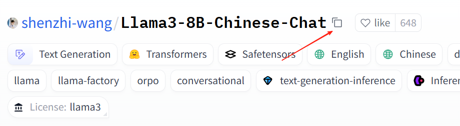

# HuggingFace

HuggingFace 是 AI 届的 github。HuggingFace 的模型需要使用魔法才可以流程下载，否则容易出现连接超时。建议设置国内镜像。

```shell
# 配置环境变量
vim ~/.bashrc
 
# 在打开文件中的最后一行添加
export HF_ENDPOINT="https://hf-mirror.com"
 
# 使得更改生效
source ~/.bashrc
```

在 conda / pip 等环境中安装 huggingface

```shell
pip install -U huggingface_hub -i https://mirrors.tuna.tsinghua.edu.cn/pypi/web/simple
```

然后就可以在这个环境里下载对应的模型了。下载模型的语法如下：

```shell
huggingface-cli download --resume-download {huggingface官网上的模型ID} --local-dir {想要下载到的目录}
```

模型 ID 直接在网页上复制即可，比如，我想下载 

<div align="center"></div>

复制后，可以得到 ID

```shell
shenzhi-wang/Llama3-8B-Chinese-Chat
```

```shell
huggingface-cli download --resume-download shenzhi-wang/Llama3-8B-Chinese-Chat --local-dir /home/Payphone/dir
```

