# 前置知识

- Linux
- git
- Python
- PyTorch

[(22 封私信) 随缘 - 知乎](https://www.zhihu.com/people/xu-shi-fang-35/posts)

# GPT系列

[3W字长文带你轻松入门视觉transformer - 知乎](https://zhuanlan.zhihu.com/p/308301901)

[GPT-1, GPT-2, GPT-3, GPT-3.5, GPT-4论文内容解读_gpt3.5是175b-CSDN博客](https://blog.csdn.net/BGoodHabit/article/details/130134446)

[李沐论文精度系列之八：视频理解论文串讲 - 知乎](https://zhuanlan.zhihu.com/p/639251630)

[李沐论文精度系列之九：InstructGPT - 知乎](https://zhuanlan.zhihu.com/p/639252063)

[大模型超详细解读 (目录) - 知乎](https://zhuanlan.zhihu.com/p/625926419)

- 2017/06 transformer
- 2018/06 GPT -- 只用到了 Transformer 的解码器！在没有标记的语言文本上训练了一个模型。然后在子任务上做微调，得到不同任务的分类器（与 CV 类似）
- 2018/10 BERT -- 把 Transformer 的编码器拿过来，用更大的数据集做预训练。
- 2019/02 GPT-2 -- 吸取教训，用更大的数据集做预训练，然后发现很适合做 zero-shot
- 2020/05 GPT-3 -- 数据和模型都大了一百倍。

## GPT-1

[LLM 系列超详细解读 (一)：GPT：无标注数据的预训练生成式语言模型 - 知乎](https://zhuanlan.zhihu.com/p/616667762)

GPT 与其他 NLP 任务不同的是，GPT 是通过改变输入的形式来完成对应的任务【如何实现的？】

GPT 优化器的选择是一个棘手的问题。因为 NLP 不同任务的差异很大，有些优化器适用于任务 A，有些适用于 B，如何选择适用于多种任务的有效的优化器？

另一个问题是如何把学到的表征迁移到下游子任务中？

### GPT模型的选择和训练

在当时，NLP 中比较主流的模型有 RNN、Transformer。GPT 选的 transoformer 而非 RNN。因为 transoformer  学到的特征迁移到下游任务的时候，比 RNN 更稳定（在当时并不是显而易见的）。

在训练方式上，GPT 采用的训练方式是：在无标签数据预训练，然后用少量有标签的数据微调各个子任务。

模型结构上，GPT **只用 Transformer 的解码器**没有用编码器

- 编码器编码，对第 i 个元素抽特征的时候可以看到整个序列的所有元素；但是对解码器来说，由于掩码的存在，对第 i 个元素抽特征的时候只能看到当前元素和之前的元素，后面的元素被 mask 掩住了。
- BERT 的预训练采用的是完形填空的方式，预测需要填空的位置时，模型既可以看到它前面的内容，又可以看到它后面的内容；所以用的是 Transformer 的编码器+解码器。

很明显，GPT 的难度更大，因为 BERT 是知道过去和未来，推测中间；而 GPT 是在了解过去的基础上来预测未来。因此 GPT 在最开始的时候效果比 BERT 弱一些。但是 GPT 这种模式训练的模型会比 BERT 的能力更强，天花板更高？

### 微调

微调部分有两个目标函数

- 给的一个序列，让模型预测下一个输出
- 给定一个序列和它对应的标号，让它预测这个标号

两个一起训练效果最佳。

问题来了，如何把 NLP 中不同的任务表示成 **“给定一个序列和它对应的标签，让它预测这个标号”** 这种形式？

## GPT-2

[LLM 系列超详细解读 (二)：GPT-2：GPT 在零样本多任务学习的探索 - 知乎](https://zhuanlan.zhihu.com/p/616975731)

做了个更大的数据集，训练了一个更大的模型。并且迁移到 zero-shot 任务上，部分主流任务表现不错。新意度很高，但是效果一般

### Introduce

现在的模型大多是拿上游任务大模型，收集少量下游任务的数据来做微调。GPT-2 依旧是这样做，不过在做下游任务的时候，用 zero-shot 的设定，做下游任务的时候不用任何有标注的数据（即不训练模型）。

### method

GPT-2 和 GPT-1 模型结构是一样的。但是在做下游任务的时候，GPT-2 对模型的输入进行了构造，加入了开始符号，结束符和中间的分隔符。

在做下游任务的时候，要确保这些符号模型在预训练的时候也要看到过。

### dataset

去 reddit 上选取用户评价度比较高的网页（这种网页的质量比较高，信噪比低，用来训练模型比较合适），筛选出了 4500w 个链接，然后爬虫爬取这些链接，抽取里面的文本数据。800w个文本，40TB的文字。以英语翻法语这个任务而言，在这些数据集里，包含了很多英语翻法语的例子。我们用这些文本训练模型的话，模型很有可能就可以完成英语翻译成法语的任务。

### Exp

和其他 zero-shot 方法作比较。在一些任务上 GPT 比之前的模型效果好，一些任务上比其他模型还是差点意思。但是可以观察到，随着模型的增大，模型的性能还是在上升的。还是有希望用更多的数据训练更大的模型，让模型的性能达到更高，超越现有有监督模型的。

## GPT-3

[LLM 系列超详细解读 (三)：GPT-3：大型语言模型是少样本学习器 - 知乎](https://zhuanlan.zhihu.com/p/622067372)

Language Models are Few-Shot Learners。比 GPT-2 大十倍。在将 GPT-3 迁移到子任务上时（即便是 few shot），不对模型做任何梯度更新。

### Introduce

比 GPT-2 大十倍。在将 GPT-3 迁移到子任务上时（即便是 few shot），不对模型做任何梯度更新。并且在做新闻摘要的时候，难以分辨出是人写的还是 GPT 写的。

GPT-3 Zero-shot、One-Shot、Few-Shot 均不会微调模型，而是以下面的形式给出，指导模型。

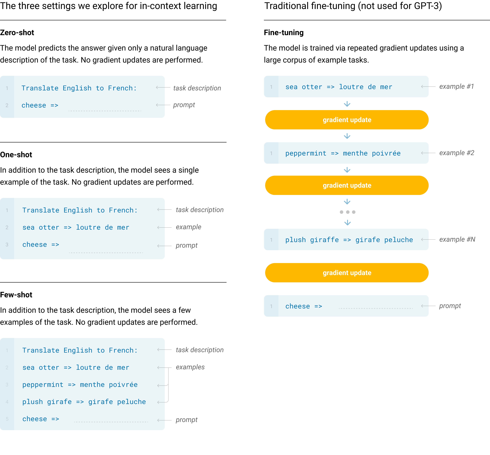

## Instruct-GPT

[李沐论文精度系列之九：InstructGPT - 知乎](https://zhuanlan.zhihu.com/p/639252063)

[LLM 系列超详细解读 (四)：InstructGPT：训练语言模型以遵从人类指令 - 知乎](https://zhuanlan.zhihu.com/p/637419868)

## 复刻 GPT-3

[LLM 系列超详细解读 (五)：OPT：完整开源的 GPT-3 复刻版 - 知乎](https://zhuanlan.zhihu.com/p/643335978)

## GPT-4

## LLama

[LLM 系列超详细解读 (六)：LLaMa：开源高效的大语言模型 - 知乎](https://zhuanlan.zhihu.com/p/643894722)

[LLM 系列超详细解读 (七)：LLaMa 2：开源微调的聊天大语言模型 - 知乎](https://zhuanlan.zhihu.com/p/644994939)

## LLLM

[LLM 系列超详细解读 (七)：LLaMa 2：开源微调的聊天大语言模型 - 知乎](https://zhuanlan.zhihu.com/p/644994939)

[LLM 系列超详细解读 (九)：MobileLLM：优化 1B 参数之下的语言模型 - 知乎](https://zhuanlan.zhihu.com/p/689006901)

[LLM 系列超详细解读 (十)：帝江大模型：频域角度降低 LLM 的成本 - 知乎](https://zhuanlan.zhihu.com/p/692469499)

[LLM 系列超详细解读 (十一)：大语言模型中的超大激活值 - 知乎](https://zhuanlan.zhihu.com/p/689959264)

## 参数计算

### 参数存储

- **FP32（全精度）**：每参数4字节
- **FP16（半精度）**：每参数2字节
- **INT8量化**：每参数1字节

$$
显存（GB）= 参数数量 × 每参数字节数 ÷ 1e9
$$

### 训练阶段总显存

需额外存储梯度、优化器状态和激活值：

- **梯度**：与参数同类型（如 FP32 需 4 字节/参数）
- **优化器状态**：Adam 优化器需存储动量和方差（FP32，共 8 字节/参数）
- **激活值**：与批次大小、序列长度强相关（约占20%~50%总显存）

经验公式（FP16混合精度下，优化器状态仍为FP32）
$$
训练显存 ≈ 参数数量 × 20字节
$$

### 推理阶段总显存

仅需加载参数和少量激活值（激活值占额外20%~50%）
$$
推理显存 ≈ 参数存储 × 1.2~1.5
$$

### 部署模型所需参数

以 70B 的模型为例。70B 中的 B 代表十亿（Billion）。70B = 700亿参数。

> 以 float32 部署 70B 的模型

- 每个参数以 float32 存储（4 字节）
- 700 * 4 = 2800 亿字节 ≈ 280 GB

> 以 float16 部署 70B 的模型

- 每个参数以 float16 存储（2 字节）
- 700 * 2 = 1400 亿字节 ≈ 140 GB

> 以 int8 部署 70B 的模型

- 每个参数以 int8 存储（1 字节）
- 700 * 1 = 700 亿字节 ≈ 70 GB

> 以 int4 部署 70B 的模型

- 每个参数以 int4 存储（0.5 字节）

- 700 * 0.5 = 350 亿字节 ≈ 35 GB

实际部署时，得益于部署框架对显存的优化，所需的显存可能少于上述的计算结果。


# LLM博文

[万字长文——这次彻底了解LLM大语言模型-腾讯云开发者社区-腾讯云 (tencent.com)](https://cloud.tencent.com/developer/article/2368425)

[使用LLaMA Factory来训练智谱ChatGLM3-6B模型-CSDN博客](https://xiaoxiang113.blog.csdn.net/article/details/138772373)

[智谱ChatGLM3本地私有化部署（Linux）_chatglm 3 私有化部署-CSDN博客](https://xiaoxiang113.blog.csdn.net/article/details/138967468)

[2024 年 8 个顶级开源 LLM（大语言模型）_开源llm-CSDN博客](https://blog.csdn.net/yugongpeng/article/details/135084958)

# 书生大模型实战营第三期

## [部署书生大模型Demo](https://github.com/InternLM/Tutorial/tree/camp3/docs/L1/Demo)

这部分主要介绍了如何搭建 `InternLM2-Chat-1.8B`、`InternLM-XComposer2-VL-2B`、`InternVL2-2B`

### 模型介绍

<b>各个模型的介绍如下</b>

- InternLM2-Chat-1.8B：18亿参数的语言模型，可以进行问答、总结文本、生成文本、编写故事、分析情感、提供推荐、开发算法、编写代码等任何基于语言的任务。
- InternLM-XComposer2-VL-2B：20亿参数的视觉语言大模型（Vision Language），也就是我们经常说的多模态模型。能够同时从图像和文本中学习。这类模型也属于生成模型，输入为图像和文本，输出为文本。具有良好的零样本能力和泛化能力，能够处理包括文档、网页等在内的多种类型的图像。
- InternVL2-2B：20亿参数的视觉语言大模型，首个综合性能媲美国际闭源商业模型的开源多模态大模型。

简单说，里面有一个语言大模型（LLM）InternLM2-Chat-1.8B，两个视觉语言大模型。

### 模型部署的技术介绍

官方给出了三种模型部署的方式，分别是：无任何量化的 Cli（控制台）部署、Streamlit 的 Web 端部署、LMDeploy 的量化部署。

- Streamlit 是一个基于 Python 的 Web 应用程序框架
- LMDeploy 是一个用于压缩、部署、服务 LLM 的工具包，并且提供了一套完整的服务解决方案。
  - 高效的推理：LMDeploy 通过引入持久化批处理、块 KV 缓存、动态分割与融合、张量并行、高性能 CUDA 内核等关键技术，提供了比 vLLM 高 1.8 倍的推理性能。
  - 有效的量化：LMDeploy 支持仅权重量化和 k/v 量化，4bit 推理性能是 FP16 的 2.4 倍。量化后模型质量已通过 OpenCompass 评估确认。
  - 轻松的分发：利用请求分发服务，LMDeploy 可以在多台机器和设备上轻松高效地部署多模型服务。
  - 交互式推理模式：通过缓存多轮对话过程中注意力的 k/v，推理引擎记住对话历史，从而避免重复处理历史会话。
  - 优秀的兼容性：LMDeploy支持 KV Cache Quant，AWQ 和自动前缀缓存同时使用。

### 配置部署环境

这部分没什么好说的，就是搭建一个运行环境。

```shell
# 创建环境
conda create -n GPT python=3.9 -y
# 激活环境
conda activate GPT
# 安装 torch
conda install pytorch==2.1.2 torchvision==0.16.2 torchaudio==2.1.2 pytorch-cuda=12.1 -c pytorch -c nvidia -y
# 安装其他依赖
pip install transformers==4.38
pip install sentencepiece==0.1.99
pip install einops==0.8.0
pip install protobuf==5.27.2
pip install accelerate==0.33.0
pip install streamlit==1.37.0
```

transformers、sentencepiece 库需要特殊说明。

transformers‌ 是由 [Hugging Face](https://www.baidu.com/s?sa=re_dqa_generate&wd=Hugging Face&rsv_pq=eacac621003cee60&oq=transformers 库介绍&rsv_t=8bacAmHWtyc375RXVhiQEj+v97NWktjcamKZ8Z+EPlytwUjekkxjIoZP7xOfq5PVyHlIOoA&tn=15007414_18_dg&ie=utf-8) 开发的一个 Python 库，专门用于[自然语言处理](https://www.baidu.com/s?sa=re_dqa_generate&wd=自然语言处理&rsv_pq=eacac621003cee60&oq=transformers 库介绍&rsv_t=8bacAmHWtyc375RXVhiQEj+v97NWktjcamKZ8Z+EPlytwUjekkxjIoZP7xOfq5PVyHlIOoA&tn=15007414_18_dg&ie=utf-8)(NLP)任务。它提供了大量的预训练模型。如果我们要加载 [HuggingFace 网站](https://huggingface.co/)的已经训练好的 torch 网络参数或 tensorflow 网络参数必须使用它。

sentencepiece ‌是用于文本分词和编码的开源工具。

### Cli部署InternLM2-Chat-1.8B

下面我们用 Cli 部署一个 InternLM2-Chat-1.8B 的语言模型。

- 任意创建一个工程目录
- 创建一个 cli_deploy.py
- 在 ~.py 中编写部署代码

部署的代码也非常简单。

```python
import torch
from transformers import AutoTokenizer, AutoModelForCausalLM


model_name_or_path = "/root/share/new_models/Shanghai_AI_Laboratory/internlm2-chat-1_8b"

tokenizer = AutoTokenizer.from_pretrained(model_name_or_path, trust_remote_code=True, device_map='cuda:0')
model = AutoModelForCausalLM.from_pretrained(model_name_or_path, trust_remote_code=True, torch_dtype=torch.bfloat16, device_map='cuda:0')
model = model.eval()

system_prompt = """You are an AI assistant whose name is InternLM (书生·浦语).
- InternLM (书生·浦语) is a conversational language model that is developed by Shanghai AI Laboratory (上海人工智能实验室). It is designed to be helpful, honest, and harmless.
- InternLM (书生·浦语) can understand and communicate fluently in the language chosen by the user such as English and 中文.
"""

messages = [(system_prompt, '')]

print("=============Welcome to InternLM chatbot, type 'exit' to exit.=============")

while True:
    input_text = input("\nUser  >>> ")
    input_text = input_text.replace(' ', '')
    if input_text == "exit":
        break

    length = 0
    for response, _ in model.stream_chat(tokenizer, input_text, messages):
        if response is not None:
            print(response[length:], flush=True, end="")
            length = len(response)
```

代码非常简单，唯一需要解释的是 BFloat16。

BFloat16 (Brain Floating Point)是一种 16 bit 的浮点数格式，动态表达范围和 float 32 是一样的，但是精度低。BF16 的指数位与 FP32 相同，但小数位较少，旨在通过牺牲一定的精度来换取更大的数值空间（Dynamic Range）。

使用 `torch.bfloat16` 的主要优势包括：

- ‌**性能优化**‌：通过减少数据类型的大小，可以加快计算速度并减少内存使用，这对于大规模模型和数据处理非常有益。
- ‌**数值稳定性**‌：与FP16相比，BF16提供了更大的数值范围，这对于某些计算来说是必要的，尤其是在涉及大量数值范围变化的计算中。

`torch.bfloat16` 也有下面的缺点：

- ‌**精度问题**‌：由于牺牲了一定的精度，对于需要高精度计算的场景，BF16 可能不是最佳选择。
- ‌**兼容性问题**‌：不是所有的操作都支持 BF16 数据类型，因此在转换数据类型时可能会遇到不支持的操作，这可能导致运行时错误。
- ‌**混合数据类型处理**‌：在某些情况下，可能需要同时处理多种数据类型，如 FP32 和 BF16 的混合使用，这需要特别注意数值的转换和兼容性。

### streamlit Web部署InternLM2-Chat-1.8B

书生浦语官方已经给我们准备好了[代码](https://github.com/InternLM/Tutorial/blob/camp3/tools/streamlit_demo.py)。创建文件 web_depoly.py，将代码复制到该文件中。然后使用下面的命令启动 Web 服务。

```shell
cd /root/demo
streamlit run ./web_depoly.py --server.address 127.0.0.1 --server.port 6006
```

这样，web 服务就部署好了，我们可以使用 curl 来验证。

```shell
curl localhost:6006
```

如果想要在本地浏览器，通过（localhost）访问远程服务器部署的web服务，可以使用端口转发技术。

```shell
ssh -CNg -L 6006:127.0.0.1:6006 root@ssh.intern-ai.org.cn -p 远程服务器的ssh端口号
```

在完成端口映射后，我们就可以通过浏览器访问 `http://localhost:6006` 来启动我们的 Demo。

### LMDeploy部署

部署前需要完善环境，安装 LMDeploy。

```shell
conda activate GPT
pip install lmdeploy[all]==0.5.1
pip install timm==1.0.7
```

<b>部署 InternLM-XComposer2-VL-1.8B</b>

使用 LMDeploy 启动一个与模型交互的 Gradio 服务（Web 服务），启动的时候指定模型文件的路径即可。

```shell
lmdeploy serve gradio /share/new_models/Shanghai_AI_Laboratory/internlm-xcomposer2-vl-1_8b --cache-max-entry-count 0.1
```

上面的命令中，我们需要注意的是 `--cache-max-entry-count 0.1`，这是用于设置 K/V 缓存比例的，会占用一定的显存，但是可以提升模型推理速度。如果模型显存非常富裕，可以设置的大一些。

<b>部署 InternVL2-2B模型</b>

部署方式同上，换一下模型参数的路径即可

```shell
lmdeploy serve gradio /share/new_models/OpenGVLab/InternVL2-2B --cache-max-entry-count 0.1
```

<b>InternVL2-2B 模型参数文件</b>

可以去 HuggingFace 下。

```shell
.
|-- README.md
|-- added_tokens.json
|-- config.json
|-- configuration_intern_vit.py
|-- configuration_internlm2.py
|-- configuration_internvl_chat.py
|-- conversation.py
|-- examples
|   |-- image1.jpg
|   |-- image2.jpg
|   `-- red-panda.mp4
|-- generation_config.json
|-- model.safetensors
|-- modeling_intern_vit.py
|-- modeling_internlm2.py
|-- modeling_internvl_chat.py
|-- preprocessor_config.json
|-- special_tokens_map.json
|-- tokenization_internlm2.py
|-- tokenization_internlm2_fast.py
|-- tokenizer.model
`-- tokenizer_config.json
```

### 练习部署其他模型

LMDeploy 部署 internlm2_5-7b-chat（24G 显存）

```shell
lmdeploy serve gradio /root/share/new_models/Shanghai_AI_Laboratory/internlm2_5-7b-chat --cache-max-entry-count 0.1
```

### 学习总结

学会了上面的部署方式，就可以部署任何 internlm 已经发布的 huggingface 格式的模型了。

后面就是学如何微调属于自己的、特定领域的模型了。

## 提示词工程

### 确定角色

先确定角色，然后在提问：你是一个作家，写一段描述春天的话。

 提示词策略

- 写清楚说明
- 复杂任务拆解成子任务
- 提供参考文本（样例）
- 反复修改

### 思维链提示

给他一个例子，写出完整的思考过程，告诉他该怎么做，怎么思考；然后再提问。

## RAG检索增强生成

InternLM + LlamaIndex RAG 实践。

检索增强生成（Retrieval Augmented Generation，RAG）。

2022 年训练的模型无法回答 2024 年的新问题？如何让 LLM 能够获得最新的知识？有两种方式，一种是微调，另一种是 RAG。微调算力成本和数据成本较高，而 RAG 则比较经济实惠，成本低，可以实时更新。就一种方式。

<b>RAG VS Finetune</b>

RAG

- 低成本
- 可实时更新
- 受基座模型影响大
- 单次回答知识有限

Finetune

- 可个性化微调
- 知识覆盖面广
- 成本高昂
- 无法实时更新

<b>RAG 检索增强生成的处理流程</b>


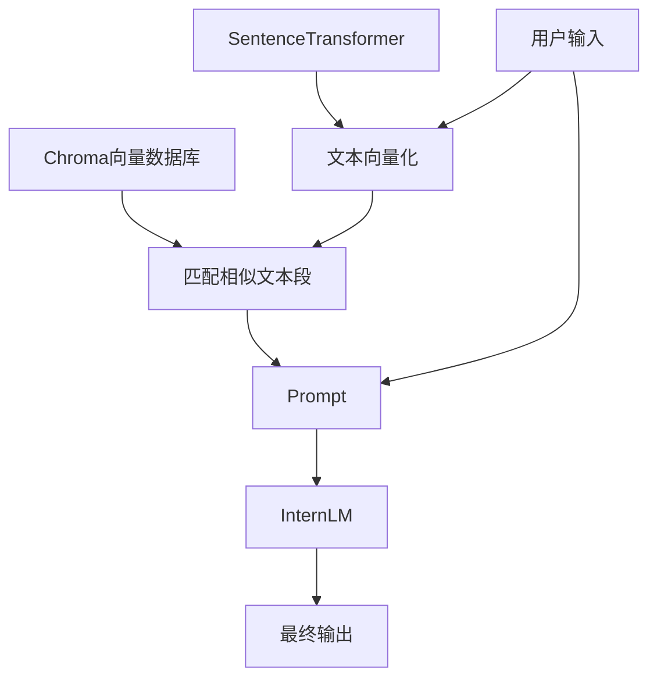


## XTuner微调模型


# Hugging Face
Hugging Face 是一家专注于自然语言处理和机器学习的公司，以其开源的Transformers库而闻名。该平台提供了丰富的预训练模型，支持多种语言任务，如文本生成、翻译和情感分析。Hugging Face 还致力于推动 AI 的民主化，鼓励开发者和研究人员共享和合作。

作为 Hugging Face 最核心的项目，Transformers 无疑是这个社区的灵魂。

> Transformers 提供 API 和工具，可轻松下载和训练最先进的预训练模型。使用预训练模型可以降低计算成本，并节省从头开始训练模型所需的时间和资源。这些模型支持不同模式的常见任务：

- 自然语言处理：文本分类、命名实体识别、问答、语言建模、摘要、翻译、多项选择和文本生成。
- 计算机视觉：图像分类、对象检测和分割。
- 音频：自动语音识别和音频分类。
- 多模态：表格问答、光学字符识别、扫描文档信息提取、视频分类和视觉问答。

此外，Hugging Face官方还提供免费的课程，如何利用社区生态(Transformers等项目)来进行 NLP 的学习

> Hugging Face 中检索模型。

Files and Versions 里包含了模型文件和模型的版本管理。我们如果想要使用模型，需要把里面所有的文件都下载过来。

## GitHub CodeSpace 的使用
GitHub Codespace 通过 GitHub 原生的完全配置、安全的云开发环境，可以更快地启动和写代码，它提供了一系列模板，我们在跑机器学习深度学习相关的实验的时候，可以选择它的 Jupyter NoteBook 模板。

- [Create new codespace](https://github.com/codespaces/new?skip_quickstart=true&geo=SoutheastAsia)
- 根据已有的 github 仓库创建一个 Code Space 空间


## ModelScope

ModelScope 可以认为是国内版的 HuggingFace，其用法与 HuggingFace 类似。我们先安装 ModelScope 必备的环境，安装了必备环境我们才能用它下载模型、数据集、微调模型。

> pip 安装

ModelScope Library 由核心 hub 支持，框架，以及不同领域模型的对接组件组成。根据您实际使用的场景，可以选择不同的安装选项。如果只需要通过 ModelScope SDK，或者 ModelScope 命令行工具来[下载模型](https://www.modelscope.cn/docs/models/download)，可以只最轻量化的安装 ModelScope 的核心 hub 支持：

```shell
pip install modelscope
```

如果需要更完整的使用 ModelScope 平台上的一系列框架能力，包括**数据集的加载**，外部模型的使用等，则推荐使用 "framework" 的安装选项，也就是：

```shell
pip install modelscope[framework]
```

安装好后，我们使用 ModelScope 来下载 deepseek-ai/DeepSeek-R1-Distill-Qwen-7B 模型。

```shell
# 下载整个模型到指定目录
modelscope download --model 'deepseek-ai/DeepSeek-R1-Distill-Qwen-7B'  --local_dir './'

# 下载单个文件
modelscope download --model 'Qwen/Qwen2-7b' tokenizer.json
    
# 下载多个    
modelscope download --model 'Qwen/Qwen2-7b' tokenizer.json config.json
modelscope download --model 'Qwen/Qwen2-7b' --include '*.safetensors'

# 过滤指定文件
modelscope download --model 'Qwen/Qwen2-7b' --exclude '*.safetensors'
```

更多内容可以参考官方文档 [模型的下载 · 文档中心](https://www.modelscope.cn/docs/models/download)

> **下载好后我们尝试部署该模型**

怎么让这个模型跑起来呢？我们可以参照模型 readme 来部署 [How to Run Locally](https://huggingface.co/deepseek-ai/DeepSeek-R1)，也可以去 HuggingFace 找到这个模型，然后找到 Use this modle，这里有加载模型的方式。

```python
# Use a pipeline as a high-level helper
from transformers import pipeline

messages = [
    {"role": "user", "content": "Who are you?"},
]
pipe = pipeline("text-generation", model="deepseek-ai/DeepSeek-R1", trust_remote_code=True)
pipe(messages)
```

```python
# Load model directly
from transformers import AutoModelForCausalLM
model = AutoModelForCausalLM.from_pretrained("deepseek-ai/DeepSeek-R1", trust_remote_code=True)
```

现在模型跑起来了，接下来我们怎么用模型做预测/推理呢？这个代码应该怎么写呢？

## Fundation Model推理

> 此处，我们指的是 Fundation Model 的推理，包括但并不局限于 LLM（大语言模型）的推理

- LLM 的加载和推理：即纯对话/问答式的大语言生成式模型。模型的输入和输出都是文本，不包含其他模态的数据。
- VLLM 的加载和推理：VLLM 视觉语言大模型。VLLM 是一种结合了视觉和语言信息的预训练模型，通过将视觉和语言信息相结合，使模型能够同时处理文本和图像数据。以 Qwen2.5s-VL 为例，我们来看看它具备什么能力。
  - 视觉理解：Qwen2.5-VL 不仅擅长识别常见物体，如花、鸟、鱼和昆虫，还能够分析图像中的文本、图表、图标、图形和布局。
  - Agent：Qwen2.5-VL 直接作为一个视觉 Agent，可以推理并动态地使用工具，初步具备了使用电脑和使用手机的能力。
  - 理解长视频和捕捉事件：Qwen2.5-VL 能够理解超过 1 小时的视频，并且这次它具备了通过精准定位相关视频片段来捕捉事件的新能力。
  - 视觉定位：Qwen2.5-VL 可以通过生成 bounding boxes 或者 points 来准确定位图像中的物体，并能够为坐标和属性提供稳定的 JSON 输出。
  - 结构化输出：对于发票、表单、表格等数据，Qwen2.5-VL 支持其内容的结构化输出，惠及金融、商业等领域的应用。

## LLM部署

> LLM 的部署比较简单，我们来理一下它的流程。

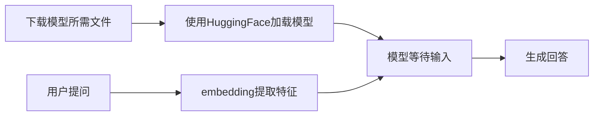

从上面的流程图我们可以看到，我们需要做两大步骤

- 利用框架将模型跑起来（ModelScope 或 HuggingFace）
- 准备好问题，利用 embedding 模型提取词向量特征

做好后将准备好的词向量模型送入模型，等待其生成回答即可。

> 明白了 LLM 部署的流程，那我们应该怎么加载模型，怎么对问题做特征提取，有需要怎么组织数据输入给模型呢？

首先，我们要确定使用什么 LLM；然后去 github 看他的开源代码，一般开源代码中会告诉我们如何部署。以 Qwen2.5 为例

[Qwen2.5 官方部署教程](https://github.com/QwenLM/Qwen2.5)

### Qwen2.5部署-HuggingFace

### Qwen2.5部署-OpenAI

### Qwen2.5部署-ollama

### Qwen2.5部署-量化


## 模型上传

Hugging Face 同样是跟 Git 相关联，对于大文件，我们需要安装 git-lfs，对大文件系统支持。使用 huggingface-cli login 命令进行登录，登录过程中需要输入用户的 Access Tokens

## Spaces 的使用

Hugging Face Spaces 是一个允许我们轻松地托管、分享和发现基于机器学习模型的应用的平台。Spaces 使得开发者可以快速将我们的模型部署为可交互的 web 应用，且无需担心后端基础设施或部署的复杂性。

# LLM

## LLM介绍

专用模型==>通用模型。通用大模型，一个模型应对多种任务，多种模态。

LLM（Large Language Model）大语言模型。大型语言模型 (LLM) 是一类基础模型，经过大量数据训练，使其能够理解和生成自然语言和其他类型的内容，以执行各种任务。

LLM 使用一种被称为无监督学习的方法来理解语言。这个过程要向机器学习模型提供大规模的数据集，其中包含数百亿个单词和短语，供模型学习和模仿。这种无监督的预训练学习阶段是开发 LLM（如 GPT-3（Generative Pre-trained Transformer ）和 BERT（Bidirectional Encoder Representations from Transformers）的基本步骤。 

<b>如何让模型落地</b>

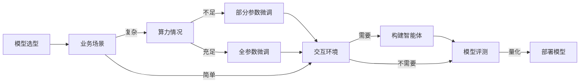

<b>框架选择：书生浦语（方便，开箱即用）</b>

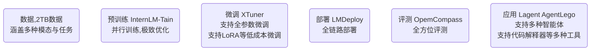

<b>数据</b>

- 文本数据：50 亿个文档，数据量 1TB+
- 图像-文本数据：2200w 文件+，数据量 140GB+
- 视频数据：1000 文件+，数据量 900GB+

- 多模态融合
  万卷包含文本、图像和视频等多模态数据，涵盖科技、文学、媒体、教育和法律等
  多个领域。该数据集对模型的知识内容、逻辑推理和泛化能力的提升有显著效果。
- 精细化处理
  万卷经过语言筛选、文本提取、格式标准化、数据过滤和清洗(基于规则和模型)、多
  尺度去重和数据质量评估等精细数据处理环节，能够很好地适应后续模型训练的要求。
- 价值观对齐
  在万卷的构建过程中，研究人员注重将数据内容与主流中国价值观进行对齐，并通
  过算法和人工评估的结合提高语料库的纯净度。

<b>微调</b>

- 支持增量续训：让基座模型学习到一-些新知识，如某个垂类领域知识。（训练数据:文章、书籍、代码等）
- 有监督微调：让模型学会理解和遵循各种指令，或者注入少量领域知识（训练数据:高质量的对话、问答数据）这种方式要用到的数据量会比增量续训要小一些。
- 8G 显存就可以微调 7B 模型。（支持微调百川、通义千问等模型）

<b>部署</b>

- Python、gRPC、RESTful 接口
- 4bit 量化

<b>OpenCompass 评测体系</b>

<div align="center"></div>

<b>LLM==>智能体</b>

Lagent 是一个轻量级、开源的基于大语言模型的智能体(agent) 框架，用户可以快速地将一个大语言模型转变为多种类型的智能体。通过 Lagent 框架可以更好的发挥 InternLM 模型的全部性能。

## LLM 部署

常规部署

量化部署

## LLM 微调

不同的微调范式

微调后模型的量化、融合

[手把手教学，DeepSeek-R1微调全流程拆解 - 雨梦山人 - 博客园](https://www.cnblogs.com/shanren/p/18707513)

[如何通过unSloth 微调(Fine-tuning)专业大模型_unsloth本地微调-CSDN博客](https://blog.csdn.net/python1222_/article/details/145749857)

## LLM RAG

RAG 检索增强生成。

### RAG

思路：RAG ≈ 开卷考试。用户向 LLM 提问。在回答问题前，先从知识库中找到和提问相似的内容；将问题和可能的答案一起送到 LLM 中让 LLM 回答问题。

基于普通的 RAG 的 LLM 一般包含两种阶段：检索阶段和生成阶段。

- 检索阶段：从预先向量化的知识库或文档集合中，检索与用户查询语义相似的文档片段。
- 生成阶段：LLM 根据检索到的信息生成最终回答。

普通 RAG 的缺点

- 相似度高的内容相关性不一定高（相似性高，但是不相关的文档）
- 参考的信息可能不完整

### GraphRAG

在 RAG 的基础上做了两个层面的增强

- 实体知识图谱构建：从源文档中提取实体及关系，构建知识图谱。
- 社区摘要生成：使用社区检测算法识别图谱中的模块化社区，并生成摘要，提供高层次的理解。

通过知识图谱和文本索引的方式增强查询的质量。

提取实体用比较好的模型~

GraphRAG 的缺点

- 高成本、复杂性高、响应时间较慢、数据更新和维护成本高

## LLM Agent


# LLM开发

LlamaIndex 和 LangChain 有点笨重，封装的有点深，建议主要业务代码还是自己写。

[(27 封私信 / 80 条消息) 神洛 - 知乎](https://www.zhihu.com/people/shen-luo-74-23/posts)

## HuggingFace

通过前面的学习我们可以知道，大模型由于训练数据的时效性（知识截至），对最近的一些信息、问题无法正确回答；有时候 LLM 还会出现幻视，自行的做出错误的回答。这两个缺点都可以用 RAG 来进行改进。

RAG（检索增强生成），从大堆的文档（知识库）中查找和问题比较相关的数据，然后将这些相关的**数据和问题一并送到 LLM**，让 LLM 根据这些数据进行回答。

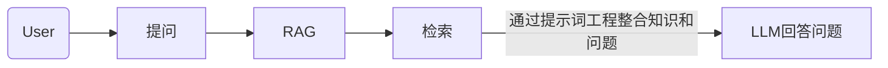

下面是一个典型的提示词模板

```
prompt_template = """
你是一个专业的企业知识库问答助手。我会给你一些相关的文档片段、对话历史和一个问题。
请你基于这些信息，以专业、准确、简洁的方式回答问题。
如果文档片段中没有足够的信息来回答问题，请明确指出。

相关文档片段：
{context}

最近的对话历史：
{history}

当前问题：{question}

请给出你的回答：
"""
```

这意味着我们需要做“问题”和“知识库”的一个检索/匹配。如何做这种匹配呢？一般是将文字向量化（embedding）然后计算问题和知识库中向量的相似度。

- 余弦相似度
- 内积
- 欧式距离
- 曼哈顿距离
- 杰卡尔德系数

### HuggingFace初步

<span style="color:blue">我们使用 huggingface 上的 embeddings 模型（特征提取模型）对文本进行向量化。</span>

先安装使用 HuggingFace 的必备库：`transformers`

```python
pip install transformers
# transformers 个别库需要依赖 pytorch，需要用到时候再安装即可。
pip install torch==2.5.0 torchvision==0.20.0 torchaudio==2.5.0 --index-url https://download.pytorch.org/whl/cu121
```

[Models - Hugging Face](https://huggingface.co/models?pipeline_tag=feature-extraction&language=zh&sort=trending)

[The Tasks Manager](https://huggingface.co/docs/optimum/exporters/task_manager)

<div align="center"></div>

1️⃣下载 huggingface 上的模型，这里我们下载两个模型：

```python
import os

# 设置环境变量，从国内镜像下载
os.environ['HF_ENDPOINT'] = 'https://hf-mirror.com'

# 下载模型
os.system('huggingface-cli download --resume-download sentence-transformers/all-MiniLM-L6-v2 --local-dir ./all-MiniLM-L6-v2')
os.system('huggingface-cli download --resume-download BAAI/bge-large-zh-v1.5 --local-dir ./bge-large-zh-v1.5')
```

如果你熟悉 Linux，可以直接把环境变量配置到当前用户的 .bashrc 文件中。

```shell
export HF_ENDPOINT="https://hf-mirror.com"

$ source ~/.bashrc

# 然后就可以在终端直接使用命令下载 huggingface 中的模型
# --resume-download 表示启用断点下载
# sentence-transformers/all-MiniLM-L6-v2 是我们下载的模型
# --local-dir ./all-MiniLM-L6-v2 下载的模型保存在当前目录的 all-MiniLM-L6-v2 目录下
huggingface-cli download --resume-download sentence-transformers/all-MiniLM-L6-v2 --local-dir ./all-MiniLM-L6-v2
```

2️⃣我们来观察下，下载了那些文件，各自代表什么含义。

```shell
1_Pooling
README.md
config.json			# 模型的配置信息，如层数、隐藏层大小、激活函数等。
config_sentence_transformers.json	# 专门为 sentence-transformers 库定制的配置文件，包含了额外的配置信息
data_config.json
model.safetensors	  # 模型权重文件，使用了 safetensors 格式，这是一种安全的张量序列化格式。
modules.json		 # 模型中使用的模块或组件的信息
onnx				# onnx 模型
openvino			# openvino 模型
pytorch_model.bin	 # PyTorch 模型 
rust_model.ot		# Rust 模型文件
sentence_bert_config.json	# Sentence BERT 的配置文件，可能包含与句子嵌入生成相关的配置
special_tokens_map.json # 模型使用的特殊标记（如 [CLS], [SEP] 等）
tf_model.h5			# tf 模型
tokenizer.json		# 包含分词器配置和词汇表的文件，用于将文本转换为模型可以理解的输入格式。
tokenizer_config.json # 包含分词器配置信息的文件，如分词器类型、特殊标记等。
train_script.py
vocab.txt			# 包含分词器词汇表的文件，列出了分词器可以识别的所有单词或子词。
```

其实最重要的就是：模型权重、tokenizer*、vocab.txt 这些文件。

> 现在，我们尝试加载本地下载好的 HuggingFace 的模型，使用 sentence_transformers 对文本进行向量化。

- sentence_transformers 是一个基于 PyTorch 和 Transformers 的库，提供了大量预训练模型。
- `pip install sentence_transformers`

```shell
from sentence_transformers import SentenceTransformer

sentences = [
    "我喜欢在公园散步",
    "公园里散步很舒服",
    "今天天气真不错",
    "这个苹果很甜",
    "我最喜欢吃水果了"
]
# cache_folder 表示从本地的指定目录加载模型参数
model = SentenceTransformer('all-MiniLM-L6-v2', cache_folder='/home/hp/Code/rag-demo/all-MiniLM-L6-v2')
model_bge = SentenceTransformer('bge-large-zh-v1.5', cache_folder='/home/hp/Code/rag-demo/bge-large-zh-v1.5')

embeddings = model.encode(sentences)
embeddings_bge = model_bge.encode(sentences)
print(embeddings)
print(embeddings_bge)
```

也可以直接使用 huggingface 的 transformers 库对文本进行向量化。利用 bge-large-zh-v1.5 对句子进行向量化：

```python
from transformers import AutoTokenizer, AutoModel
import torch
# Sentences we want sentence embeddings for
sentences = [
    "我喜欢在公园散步",
    "公园里散步很舒服",
    "今天天气真不错",
    "这个苹果很甜",
    "我最喜欢吃水果了"
]

# 获取与该模型匹配的分词器，会加载 tokenizer.json、tokenizer_config.json、vocab.txt
tokenizer = AutoTokenizer.from_pretrained('bge-large-zh-v1.5')

# 无需知道模型细节，加载和运行各种预训练模型
model = AutoModel.from_pretrained('bge-large-zh-v1.5')
model.eval()

# 分词器，对句子进行分词，将其转为计算机可以识别的数字 对象() 实际上是调用的 __call__ 方法
encoded_input = tokenizer(sentences, padding=True, truncation=True, return_tensors='pt')

# Compute token embeddings
with torch.no_grad():
    model_output = model(**encoded_input)
    # Perform pooling. In this case, cls pooling.
    # 拿到句子的特征。官方示例的写法，这个位置的数据是进行了全局池化的数据（需要查看模型内部结构）
    sentence_embeddings = model_output[0][:, 0]
# normalize embeddings
sentence_embeddings = torch.nn.functional.normalize(sentence_embeddings, p=2, dim=1)
print("Sentence embeddings:", sentence_embeddings)
```

transformers 的写法要复杂点，但是有助于我们理解如何得到 sentence_embedding，后面的 ONNX 加速需要用的这些内容。

### HuggingFace加速

传统的深度学习模型参数推理速度比较慢，如果想将其应用到生产环境，建议将模型转换为其他加速格式，如 ONNX。这里我们使用 HuggingFace 提供的 optimum 将 HuggingFace 上的模型转成 ONNX（可以跳过，目前不太会自定义 LlamaIndex 的 Embedding，它内部做了多核处理器加速，我自定义的不如它自带的~）

```shell
# 安装 optimum
pip install optimum
```

[HuggingFace 模型导出成 ONNX 官方文档](https://huggingface.co/docs/optimum/exporters/task_manager)

[The Tasks Manager](https://huggingface.co/docs/transformers/main/zh/serialization)

```shell
# 将 xxx 文件夹下的模型参数转为 onnx。这里没有指定 task 参数，将默认导出不带特定任务头的模型架构。
# 简单说就是，如果你这个模型支持两个任务（文本分类、问答），那么一般这个模型会有两个任务头，不指定 task 参数
# 导出模型的时候就不会导出这两个任务头，只导出编码器（encode）
optimum-cli export onnx --model BAAI/bge-large-zh-v1.5 bge_onnx/ --task feature-extraction
```

生成的 `model.onnx` 文件可以在支持 ONNX 标准的 [许多加速引擎（accelerators）](https://onnx.ai/supported-tools.html#deployModel) 之一上运行。例如，可以使用 [ONNX Runtime](https://onnxruntime.ai/) 加载和运行模型，下面是 HuggingFace 上 ONNX 推理的示例代码：

```python
from transformers import AutoTokenizer
from onnxruntime import InferenceSession

tokenizer = AutoTokenizer.from_pretrained("distilbert/distilbert-base-uncased")
session = InferenceSession("onnx/model.onnx")
# ONNX Runtime expects NumPy arrays as input
inputs = tokenizer("Using DistilBERT with ONNX Runtime!", return_tensors="np")

# onnx 推理的时候需要定义好输出的名字和输入的数据
outputs = session.run(output_names=["last_hidden_state"], input_feed=dict(inputs))
```

从上面的代码我们可以看到，需要定义模型的输入（input_feed）和输出（output_names），我们如何得知 onnx 模型需要什么输入，什么输出呢？使用 netron 来查看 onnx 结构，进而得知 onnx 模型需要什么输入和输出。[netron](https://netron.app/)

<div align="center"></div>

```python
from transformers import AutoTokenizer
from onnxruntime import InferenceSession
import numpy as np

tokenizer = AutoTokenizer.from_pretrained("/home/hp/Code/rag-demo/bge_onnx")
session = InferenceSession("/home/hp/Code/rag-demo/bge_onnx/model.onnx")
# ONNX Runtime expects NumPy arrays as input
sentences = [
    "我喜欢在公园散步",
    "公园里散步很舒服",
    "今天天气真不错",
    "这个苹果很甜",
    "我最喜欢吃水果了"
]

encoded_input = tokenizer(sentences, padding=True, truncation=True, return_tensors='np')

inputs = dict(encoded_input) 
del inputs['token_type_ids']

sentence_embedding = session.run(output_names=["token_embeddings", "sentence_embedding"], input_feed=dict(inputs))[1]
```

## LlamaIndex

[LlamaIndex - LlamaIndex](https://docs.llamaindex.ai/en/stable/#introduction)

LlamaIndex 是一个上下文增强的 LLM 框架，旨在通过将其与特定上下文数据集集成，增强大型语言模型（LLMs）的能力。它允许您构建应用程序，既利用 LLMs 的优势，又融入您的私有或领域特定信息。LlamaIndex 支持文本、图片等多种数据的向量化存储和检索。

简单说：LlamaIndex 可以帮助我们快速构建基于 RAG、Agent、WorkFlow 的 LLM。

<b>什么是向量化存储?</b>

向量化存储就是指把文本、图像这种数据转换成为<b>向量/特征</b>，存储到特定的向量数据库中，便于快速检索。

<b>如何利用 LlamaIndex 构建向量数据库，从向量数据库中检索相关信息，一并送入 LLM 中，增强 LLM 的能力呢？</b>

### LlamaIndex初步

[安装必备库](https://www.aidoczh.com/llamaindex/getting_started/installation/)

```shell
pip install llama-index	# llamaindex 必备库
pip install llama-index-embeddings-huggingface # 我们需要使用 huggingface 上的 embedding 模型对文件进行向量化
pip install llama-index-openllm	# 使用国产大模型的在线服务所需要的库
```

使用 LlamaIndex 提供的 OpenLLM 来使用国产大模型 [DeepSeek](https://www.deepseek.com/) 的 API 服务。

```python
from llama_index.llms.openllm import OpenLLM

# deepseek 提供了 OpenAI 风格的 API 接口。
llm = OpenLLM(model="deepseek-chat", api_base="https://api.deepseek.com", api_key="sk-d94daa", is_chat_model=True)

# stream_complete 采用的流式风格，模型每输出一个字，它就会捕捉模型的输出传递过来
for it in llm.stream_complete("请你结合这些内容作答，你是萍乡学院的助教模型。现在我向你说：你好呀"):
    print(it, end="\n", flush=True)
```

### 配置Settings

我们是希望集成 RAG 进来的。通过前面的学习，我们知道构建 RAG 的第一步：**将文本进行向量化**。

LlamaIndex 默认是使用 OpenAI 提供的 Embedding 模型，这里我不使用（也不方便）在线的 Embedding 服务，使用本地的离线 Embedding。因此，在这里我们需要创建一个本地的 Embedding 模型，然后指定 LlamaIndex 在对文本数据进行向量化的时候，使用我们指定的 Embeddings 模型。

**我们通过 LlamaIndex 的 Settings 类来进行配置。**

```python
from llama_index.llms.openllm import OpenLLM
from llama_index.embeddings.huggingface import HuggingFaceEmbedding

from llama_index.core import VectorStoreIndex, SimpleDirectoryReader, Settings


# 配置 embeddings，llm
Settings.embed_model = HuggingFaceEmbedding(model_name="/home/hp/Code/rag-demo/bge-large-zh-v1.5")
Settings.llm = OpenLLM(model="deepseek-chat", api_base="https://api.deepseek.com", api_key="sk-d94daa05fc82", is_chat_model=True)

# 将文档加载到向量数据库
documents = SimpleDirectoryReader("data").load_data()
index = VectorStoreIndex.from_documents(documents,)

query_engine = index.as_query_engine()
response = query_engine.query("给我介绍下萍乡学院")
print(response)
```

### 自定义Ebedding

前面我们尝试过将 HuggingFace 的模型转为 ONNX 格式加速推理。这里，我们尝试自定义一个 Embedding，使用 ONNX 的 bge-large 进行 Embeddings。**（可跳过，速度比不上 LlamaIndex 的）**

后面我发现，原来 LlamaIndex 支持使用 ONNX 模型~

[Custom Embeddings - LlamaIndex](https://docs.llamaindex.ai/en/stable/examples/embeddings/custom_embeddings/)

```python
from typing import Any, List
from InstructorEmbedding import INSTRUCTOR

from llama_index.core.bridge.pydantic import PrivateAttr
from llama_index.core.embeddings import BaseEmbedding
from transformers import AutoTokenizer
from onnxruntime import InferenceSession
import numpy as np

class ONNXEmbeddings(BaseEmbedding):
    _model = PrivateAttr()
    _instruction: str = PrivateAttr()
    
    def __init__(
        self,
        instruction: str = "Represent a document for semantic search:",
        **kwargs: Any,
    ) -> None:
        super().__init__(**kwargs)
        self._model = InferenceSession("/home/hp/Code/rag-demo/bge_onnx/model.onnx")
        self._tokenizer =  AutoTokenizer.from_pretrained("/home/hp/Code/rag-demo/bge_onnx")
        self._instruction = instruction

    @classmethod
    def class_name(cls) -> str:
        return "onnx"

    async def _aget_query_embedding(self, query: str) -> List[float]:
        return self._get_query_embedding(query)

    async def _aget_text_embedding(self, text: str) -> List[float]:
        return self._get_text_embedding(text)

    def _get_query_embedding(self, query: str) -> List[float]:
        encoded_input = self._tokenizer([self._instruction+"\n"+query], padding=True, truncation=True, return_tensors='np')

        inputs = dict(encoded_input) 
        del inputs['token_type_ids']
        return self._model.run(output_names=["token_embeddings", "sentence_embedding"], input_feed=dict(inputs))[1][0].tolist()

    def _get_text_embedding(self, text: str) -> List[float]:
        encoded_input = self._tokenizer([self._instruction+"\n"+text], padding=True, truncation=True, return_tensors='np')
        inputs = dict(encoded_input) 
        del inputs['token_type_ids']
        return self._model.run(output_names=["token_embeddings", "sentence_embedding"], input_feed=dict(inputs))[1][0].tolist()

    def _get_text_embeddings(self, texts: List[str]) -> List[List[float]]:
        encoded_input = self._tokenizer([self._instruction+"\n"+text for text in texts], padding=True, truncation=True, return_tensors='np')
        inputs = dict(encoded_input) 
        del inputs['token_type_ids']
        return self._model.run(output_names=["token_embeddings", "sentence_embedding"], input_feed=dict(inputs))[1].tolist()
    

from llama_index.core import VectorStoreIndex, SimpleDirectoryReader, Settings
from llama_index.embeddings.huggingface import HuggingFaceEmbedding
from llama_index.llms.openllm import OpenLLM


# 配置 embeddings，llm
Settings.embed_model = ONNXEmbeddings()
Settings.llm = OpenLLM(model="deepseek-chat", api_base="https://api.deepseek.com", api_key="sk-d94daa05fc82406", is_chat_model=True)

# 将文档加载到向量数据库
documents = SimpleDirectoryReader("data").load_data()
index = VectorStoreIndex.from_documents(documents,)

query_engine = index.as_query_engine()
response = query_engine.query("给我介绍下萍乡学院")
print(response)
```

### HuggingFace ONNX

LlamaIndex 支持使用 HuggingFace 导出的 ONNX 模型进行 embedding！

```python
from llama_index.embeddings.huggingface_optimum import OptimumEmbedding

OptimumEmbedding.create_and_save_optimum_model("BAAI/bge-small-en-v1.5", "./bge_onnx")
embed_model = OptimumEmbedding(folder_name="./bge_onnx")
```

明天探索一下~LlamaIndex 官方测过，ONNX 更快一些~

[Local Embeddings with HuggingFace - LlamaIndex](https://docs.llamaindex.ai/en/stable/examples/embeddings/huggingface/)

### 多轮对话

我们进行多轮对话的时候，希望大模型可以看到我们之前的对话记录，这样也可以减小模型的幻世，提高对话的质量。这时候我们可以指定，在这次对话的时候传递多少条之前的聊天给 LLM。

**（聊天记录是包括用户提问和模型回答的，传递的聊天记录多了，其实很耗费 token）。**

我们配置下，最多传递 5 条历史对话。

```python
import logging
import sys

from llama_index.core import VectorStoreIndex, SimpleDirectoryReader, Settings
from llama_index.embeddings.huggingface import HuggingFaceEmbedding
from llama_index.llms.openllm import OpenLLM

logging.basicConfig(stream=sys.stdout, level=logging.INFO)
logging.getLogger().addHandler(logging.StreamHandler(stream=sys.stdout))


# 配置 embeddings，llm
Settings.embed_model = HuggingFaceEmbedding(model_name="/home/hp/Code/rag-demo/bge-large-zh-v1.5")
Settings.llm = OpenLLM(model="deepseek-chat", api_base="https://api.deepseek.com", api_key="sk-d94daa05fc8", is_chat_model=True)

# 加载文档
documents = SimpleDirectoryReader("/home/hp/Code/rag-demo/data").load_data()
index = VectorStoreIndex.from_documents(documents)

# 构建聊天模型的引擎（streaming=True 表示开启 streaming 模式，模型生成一个 token 就拿一个 token）
chat_engine = index.as_chat_engine(chat_mode="condense_question", streaming=True)
response_stream = chat_engine.stream_chat("你好呀！")
response_stream.print_response_stream() # 流式打印输出（模型生成一个我就输出一个）

# 获取 LlamaIndex 的聊天历史记录
print(chat_engine.chat_history)

# 只传递最近的5条聊天记录给 LLM
response_stream = chat_engine.stream_chat("介绍下萍乡学院",chat_history=chat_engine.chat_history[-5:])
response_stream.print_response_stream()

response_stream = chat_engine.stream_chat("那你认识再里面读书的人吗")
response_stream.print_response_stream()

response_stream = chat_engine.stream_chat("我刚刚问了你啥问题")
response_stream.print_response_stream()
print(chat_engine.chat_history)
```

### 向量数据库

[Storing - LlamaIndex](https://docs.llamaindex.ai/en/stable/understanding/storing/storing/)

下面，我们使用 LlamaIndex 提供的 VectorStoreIndex 来体验下 RAG。

先准备知识

```markdown
萍乡学院是位于江西省萍乡市的一所高等学府
萍乡学院每年的经费约2个亿
```

创建知识库

```python
import logging
import sys

from llama_index.core import VectorStoreIndex, SimpleDirectoryReader, Settings
from llama_index.embeddings.huggingface import HuggingFaceEmbedding
from llama_index.llms.openllm import OpenLLM

logging.basicConfig(stream=sys.stdout, level=logging.INFO)
logging.getLogger().addHandler(logging.StreamHandler(stream=sys.stdout))

# 配置 embeddings，llm
Settings.embed_model = HuggingFaceEmbedding(model_name="/home/hp/Code/rag-demo/bge-large-zh-v1.5")
Settings.llm = OpenLLM(model="deepseek-chat", api_base="https://api.deepseek.com", api_key=os.environ['DEEPSEEK_API_KEY'], is_chat_model=True)

# 加载文档
documents = SimpleDirectoryReader("/home/hp/Code/rag-demo/data").load_data()
# 利用文档和 Settings 的 embed_model 对文件进行向量化，然后存储到 LlamaIndex 默认的向量数据库中，同时返回一个会 index
# 该 index 会先根据问题执行 RAG，然后将 RAG 查询到的内容和问题组成一个提示词，让 LLM 根据提示词来回答问题
index = VectorStoreIndex.from_documents(documents)

# 构建一个聊天的引擎，同时开启流式模型
chat_engine = index.as_chat_engine(chat_mode="condense_question", streaming=True)
response_stream = chat_engine.stream_chat("介绍下萍乡学院！")
response_stream.print_response_stream()
```

之前我们使用了 LlamaIndex 自带的 VectorStoreIndex 构建 RAG，并使用流式打印输出内容。现在我们来使用 Chroma 来构建向量数据库，并实现数据的持久化。

<b>安装库</b>

```shell
pip install llama-index-vector-stores-chroma
pip install chromadb
```

将 ChromaDB 集成到 LlamaIndex 中。

```python
import chromadb
from llama_index.core import VectorStoreIndex, SimpleDirectoryReader, Settings

from llama_index.embeddings.huggingface import HuggingFaceEmbedding
from llama_index.llms.openllm import OpenLLM

from llama_index.vector_stores.chroma import ChromaVectorStore
from llama_index.core import StorageContext


Settings.embed_model = HuggingFaceEmbedding(model_name="/home/hp/Code/rag-demo/bge-large-zh-v1.5")
Settings.llm = OpenLLM(model="deepseek-chat", api_base="https://api.deepseek.com", api_key=os.environ['DEEPSEEK_API_KEY'], is_chat_model=True)

documents = SimpleDirectoryReader("./data").load_data()

# 初始化了一个持久化的 Chroma 数据库客户端，数据库将存储在"./chroma_db"路径下
db = chromadb.PersistentClient(path="./chroma_db")

# 在Chroma数据库中获取或创建名为"linux"的集合，用于存储文本向量。
chroma_collection = db.get_or_create_collection("linux")

# 创建了一个向量存储实例
vector_store = ChromaVectorStore(chroma_collection=chroma_collection)
# 并将其设置为存储上下文的默认向量存储。
storage_context = StorageContext.from_defaults(vector_store=vector_store)

# 使用加载的文档和存储上下文创建了一个向量存储索引
index = VectorStoreIndex.from_documents(documents, storage_context=storage_context)

# 创建了一个查询引擎。注意，这个查询引擎的工作流程是，先执行RAG，然后把RAG找到的内容和问题一起拼接成 prompt
query_engine = index.as_query_engine()
response = query_engine.query("介绍下萍乡学院")
print(response)
```

如果我们有多个不同的知识库，我们为了保证知识库的专业性，希望将不同类型的知识存储到不同的知识库，这时候需要为每个知识库创建一个 `ChromaVectorStore`。

例如，我要制作三门课程的知识库，这些知识如果放在一起会影响 RAG 的效果，这时候就可以创建三个不同的 `ChromaVectorStore`，查询 Linux 知识的时候用 Linux 的 VectorStoreIndex，查询 OS 知识的时候用 OS 的 VectorStoreIndex 。**（可以定义一个工作流，用工作流判断是什么类型的问题，然后用对应的 RAG 进行检索）**

### 文档向量化

### 提升RAG

RAG 检索一般有三种方式（Dify）

- 向量检索：这种模式下，会将知识库的内容进行切分，转换成 embeddings，然后存储向量数据库。用户提问后，先从向量数据库中检索相似的内容，然后将问题和检索的内容一并送模型，让模型根据内容进行回答。

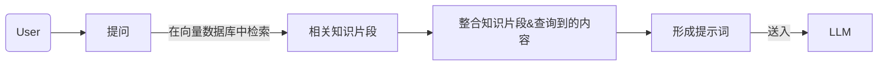

- 全文检索：这种模式下，索引文档中的所有词汇，从而允许用户查询任意词汇，并返回包含这些词汇的文本片段（ES）

- 混合检索：同时执行全文检索和向量检索，并应用重排序步骤，从两类查询结果中选择匹配用户问题的最佳结果。


### Agent

大模型遇到问题时，先对问题进行规划/拆解。执行问题的过程中，如果可以自己解决就自己解决，无法解决就借助外部工具解决。

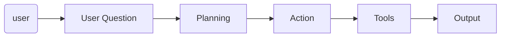

下面是一个 Agent 的流程图，大模型自行解析用户输入，拆解任务。

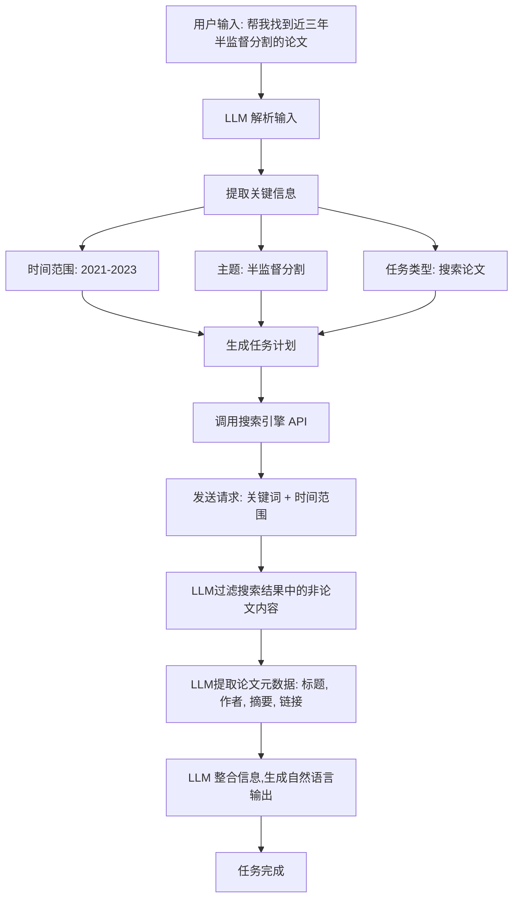

如：对于提问“帮我找到近三年半监督分割的论文”，大模型无法独立完成这个任务。因此，大模型会先拆解问题，分析要做什么，按什么流程做，如果自身无法完成，则会调用对应的外部工具来完成对应的任务。

<b>智能体</b>是依靠模型自己理解问题，拆分任务，然后判断是否需要调用外部工具，完成问答。下面所讨论的<b>工作流</b>则是固定了流程。

```python
# Agent

from llama_index.core import VectorStoreIndex, SimpleDirectoryReader, Settings
from llama_index.embeddings.huggingface import HuggingFaceEmbedding
from llama_index.llms.openllm import OpenLLM

from lagent.agents import ReAct
from lagent.actions import BingBrowser, ArxivSearch, GoogleSearch, PythonInterpreter
from lagent.actions.bing_browser import BingSearch, BingBrowser
from llama_index.core.agent import ReActAgent
from llama_index.core.tools import FunctionTool

def multiply(a: float, b: float) -> float:
    """Multiply two numbers and returns the product"""
    return a * b


def add(a: float, b: float) -> float:
    """Add two numbers and returns the sum"""
    return a + b


multiply_tool = FunctionTool.from_defaults(fn=multiply)
add_tool = FunctionTool.from_defaults(fn=add)
python_tools = FunctionTool.from_defaults(PythonInterpreter().run)


# pip install lagent
# 配置 embeddings，llm
Settings.embed_model = HuggingFaceEmbedding(model_name="/home/hp/Code/rag-demo/bge-large-zh-v1.5")
Settings.llm = OpenLLM(model="deepseek-chat", api_base="https://api.deepseek.com", api_key="sk-d94daa05fc82406082", is_chat_model=True)

agent = ReActAgent.from_tools([multiply_tool, add_tool, python_tools], llm=Settings.llm , verbose=True)

response = agent.chat("这段代码的运行结果是什么 \
                      import numpy as np \
                      data = np.array([0,1,2,3,4]) \
                      data[3]")

print(response)
```

我们可以在 LLM 中集成 Web 检索功能。现在 Web 中检索数据，然后将数据向量化存到向量数据库中，再从数据库中找出相关的内容一起返回给后面的插件。

如何在 agent 中集成 RAG 呢？

[Usage Pattern - LlamaIndex](https://docs.llamaindex.ai/en/stable/module_guides/deploying/agents/usage_pattern/)

```python
from llama_index import SimpleDirectoryReader, VectorStoreIndex, StorageContext, ChromaVectorStore
from llama_index.tools import QueryEngineTool
from llama_index.agents import OpenAIAgent
from langchain.llms import OpenAI
import chromadb

# 1. 加载数据
documents = SimpleDirectoryReader('data').load_data()

# 2. 初始化 ChromaDB 客户端
client = chromadb.PersistentClient(path="./chroma_db")

# 3. 创建或获取 ChromaDB 集合
collection = client.get_or_create_collection("my_collection")

# 4. 创建向量存储
vector_store = ChromaVectorStore(chroma_collection=collection)

# 5. 创建存储上下文
storage_context = StorageContext.from_defaults(vector_store=vector_store)

# 6. 构建索引
index = VectorStoreIndex.from_documents(documents, storage_context=storage_context)

# 7. 创建查询引擎
query_engine = index.as_query_engine()

# 8. 创建查询引擎工具
query_engine_tool = QueryEngineTool.from_defaults(query_engine=query_engine, name="RAG Tool", description="Tool for retrieving information from the knowledge base")

# 9. 创建 Agent
agent = OpenAIAgent.from_tools([query_engine_tool], llm=OpenAI(temperature=0.7), verbose=True)

# 10. 使用 Agent 回答问题
response = agent.chat("请问什么是 RAG?")
print(response)
```


### WorkFlow

<b>Workflow</b>（工作流）是指一系列按照特定顺序执行的任务或步骤，用于完成一个特定的目标或流程。工作流的每个步骤都按照预定义的规则和顺序执行。

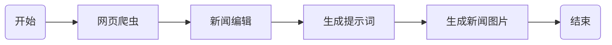

- **Agent** 是一个具有自主性和决策能力的实体，适用于复杂、动态的环境。
- **Workflow** 则是一个固定的任务序列，适用于规则明确、流程固定的场景。

### 多Agent

多 Agent 则是对用户的问题进行拆解，判断它需要调用那个智能体。然后再利用对应的智能体执行任务。

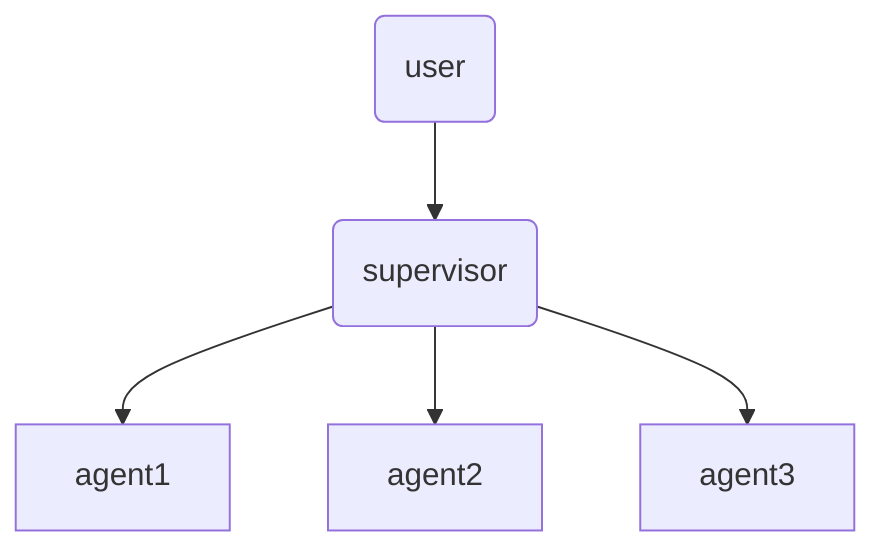

<b>比较</b>

| 类型        | 优点               | 缺点       |
| ----------- | ------------------ | ---------- |
| Agent       | 动态规划、灵活     | 缺乏稳定性 |
| Workflow    | 静态规划、稳定性高 | 缺乏灵活性 |
| Multi Agent | 完成较复杂的任务   | 缺乏稳定性 |


## 向量数据库

[LangChain教程 - 支持的向量数据库列举_langchain支持的向量数据库-CSDN博客](https://blog.csdn.net/fenglingguitar/article/details/142436241)

市面上的向量数据库有很多，这里我们主要学习 Chroma。

### Chroma

Chroma 是一个开源且轻量级，易于本地部署，专门为检索增强生成 (RAG) 应用设计的向量数据库。不过目前 Chroma 的功能较为基础，缺乏大规模分布式支持；比较适合用于开发和测试阶段的小型项目或个人应用。

快速入门

```python
from langchain.vectorstores import Chroma
from langchain.embeddings.openai import OpenAIEmbeddings

embedding_model = OpenAIEmbeddings()
texts = ["这是一个例子", "另一个例子"]
vectorstore = Chroma.from_texts(texts, embedding_model)
docs = vectorstore.similarity_search("这是查询")
print(docs)
```

## LangChain

[构建检索增强生成（RAG）应用：第一部分 | 🦜️🔗 LangChain 框架](https://python.langchain.ac.cn/docs/tutorials/rag/)

LangChain 提供了一个模块化和适应性强的框架，用于构建各种 NLP 应用程序，包括聊天机器人、内容生成工具和复杂的流程自动化系统。

通过 LangChain，我们可以方便快捷的调用 LLM 的 API 接口，并集成 RAG 增强 LLM。LangChain 内部也集成了一个非常简易的向量数据库 `InMemoryVectorStore`。

`InMemoryVectorStore` 将向量数据存储在内存中，提供了快速的访问速度，但不具备数据持久化的能力。这种实现方式适合于数据量较小且需要快速访问的场景，例如原型开发、测试或小型应用。由于数据存储在内存中，一旦程序终止，内存中的数据将会丢失。因此，`InMemoryVectorStore` 不适合需要长期存储和大规模数据处理的生产环境。

- 使用 PyPDF2 解析 pdf，`pip install pypdf2`
- openai
- langchain，`pip install langchain`

```python
import PyPDF2

"""
RAG 文字切分方式
- 按行
- 按句号
- 按长度切分
- 按长度 + 滑动窗口切分（确保知识重叠。）
"""

pdf_dir = "程序员代码面试指南（第2版） (左程云) (Z-Library).pdf"
def extract_pdf():
    with open(pdf_dir, 'rb') as file:
        reader = PyPDF2.PdfReader(file)
        text = ""
        for page in reader.pages:
            text += page.extract_text()
    return text

def split_by_sliding_window(text, window_size=300, step_size=100):
    chunks = []
    start = 0
    while start<len(text):
        end = start + window_size
        if end > len(text):
            end = len(text)
        chunks.append(text[start:end])
        start+=step_size
    return chunks

"""
测试split
text = extract_pdf()
text_list = split_by_sliding_window(text)
print(text_list[2])
"""

"""
openai 调用开源模型进行embedding
"""
from openai import OpenAI
client = OpenAI(api_key="") 
```

## Dify

免费版本的能力有限。如何需要达到比较好的效果需要去购买三方 API 接口，或者自己本地部署一个比较好的 Embedding 模型、Rerank 模型等。搭建基本知识库供内网的人员使用还是很合适的。用来体验 agent 也非常棒，自带了很多 agent 工具，无需自己去 github / gitee 搜索相关的项目。

[保姆教程篇：手把手教你从零开始本地部署Dify - 知乎](https://zhuanlan.zhihu.com/p/713902500)

## 工程化实现

茴香豆[InternLM/HuixiangDou: HuixiangDou: Overcoming Group Chat Scenarios with LLM-based Technical Assistance](https://github.com/InternLM/HuixiangDou/tree/main)

[后端研发Marion/rag-demo](https://gitee.com/zeus-maker/rag-demo#注意事项-1)

[【小白学大模型】强推！两小时彻底掌握LlamaIndex，从原理讲解到实战练习，全程干货无废话！_哔哩哔哩_bilibili](https://www.bilibili.com/video/BV1jUq3Y8Ey6/?spm_id_from=333.1387.favlist.content.click&vd_source=cb8bc4312b30b416beadaad7244940ac)

[10-大模型应用开发框架LangChain：开干_哔哩哔哩_bilibili](https://www.bilibili.com/video/BV16dzRYhEUM?spm_id_from=333.788.videopod.episodes&vd_source=cb8bc4312b30b416beadaad7244940ac&p=9)

[如何选择RAG的Embedding模型？_哔哩哔哩_bilibili](https://www.bilibili.com/video/BV1h142197Fm?spm_id_from=333.788.videopod.sections&vd_source=cb8bc4312b30b416beadaad7244940ac)

### 技术栈

基于 LLM 和 RAG 的助教问答系统

<b>模型层面</b>

- LLM 模型，回答问题；支持调用外部模型或使用本地模型
- Embedding 模型，将文本进行向量化；可以调用外部模型（选用中文支持好的）

<b>技术框架层面</b>

- Web 展示框架：streamlit、<b>chainlit</b>、gradio
- 数据存储：聊天历史记录 postgresql
- 文件存储：minio 服务器或持久化到本地
- 向量数据库：向量数据库，用于快速检索出和问题相关的信息
  - chroma（首选）
  - milvus
- LLM 开发框架
  - Llamaindex 即可：RAG、Agent、业务流都支持。
- 链接到搜索引擎：使用三方搜索引擎的开放 API
- 数据质量问题（后期扩充）
  - 开发 ocr 识别系统解决
  - 借助多模态系统对多媒体处理
  - 借助多模态嵌入模型及向量数据库直接处理


 


