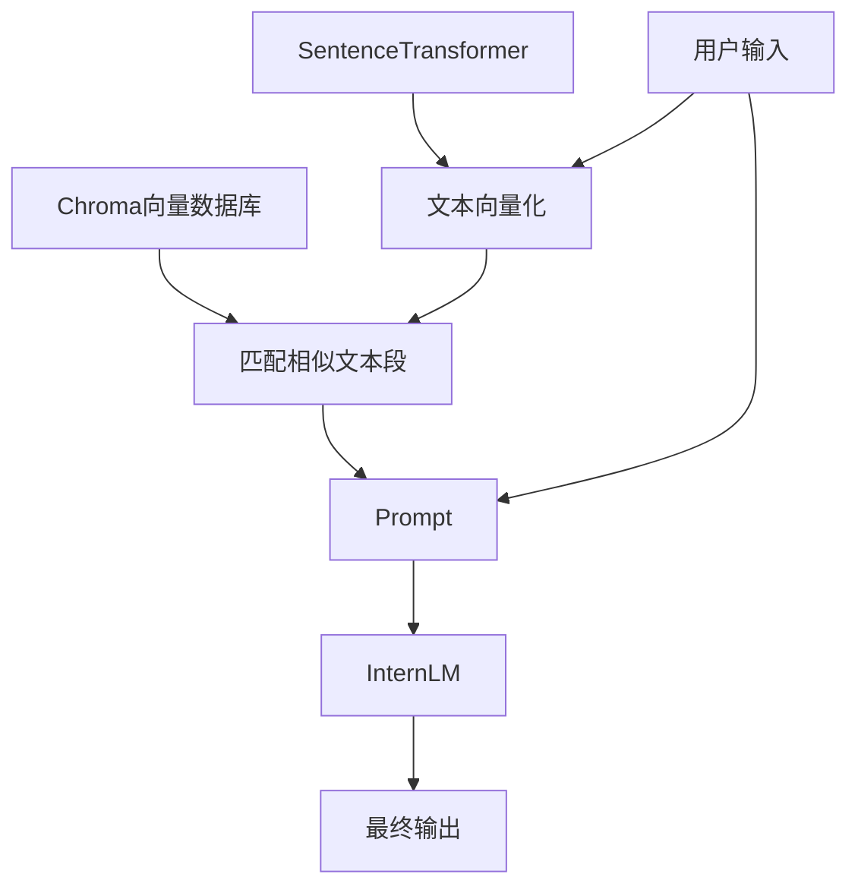
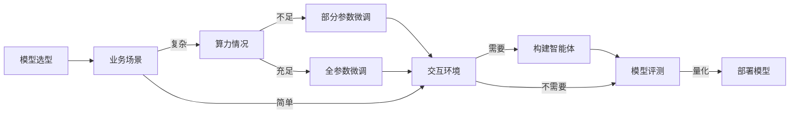
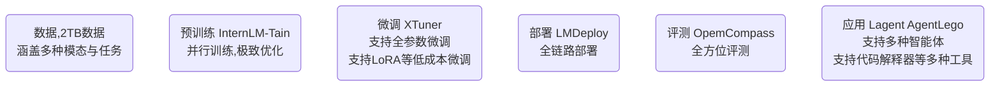
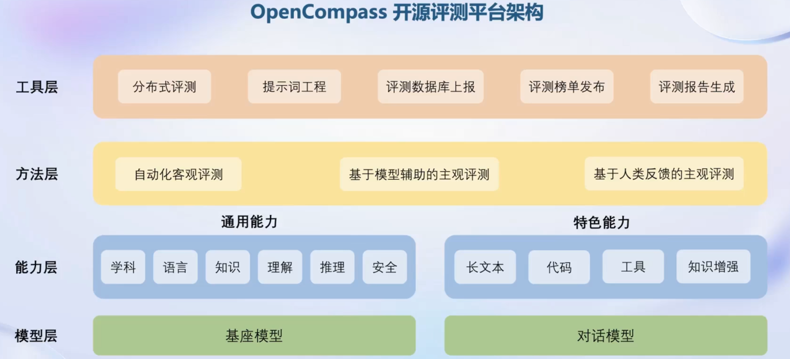
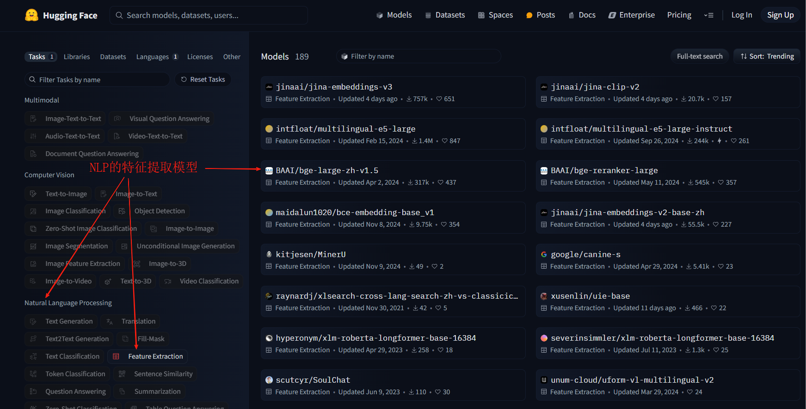
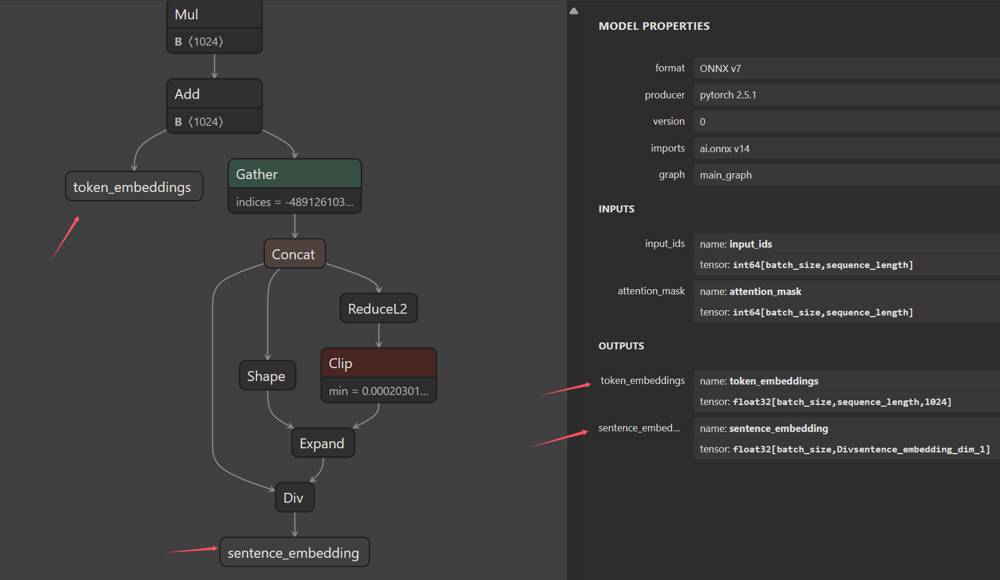

# 前置知识

- Linux
- git
- Python
- PyTorch

# LLM博文

[万字长文——这次彻底了解LLM大语言模型-腾讯云开发者社区-腾讯云 (tencent.com)](https://cloud.tencent.com/developer/article/2368425)

[使用LLaMA Factory来训练智谱ChatGLM3-6B模型-CSDN博客](https://xiaoxiang113.blog.csdn.net/article/details/138772373)

[智谱ChatGLM3本地私有化部署（Linux）_chatglm 3 私有化部署-CSDN博客](https://xiaoxiang113.blog.csdn.net/article/details/138967468)

[2024 年 8 个顶级开源 LLM（大语言模型）_开源llm-CSDN博客](https://blog.csdn.net/yugongpeng/article/details/135084958)

# 书生大模型实战营第三期

## [部署书生大模型Demo](https://github.com/InternLM/Tutorial/tree/camp3/docs/L1/Demo)

这部分主要介绍了如何搭建 `InternLM2-Chat-1.8B`、`InternLM-XComposer2-VL-2B`、`InternVL2-2B`

### 模型介绍

<b>各个模型的介绍如下</b>

- InternLM2-Chat-1.8B：18亿参数的语言模型，可以进行问答、总结文本、生成文本、编写故事、分析情感、提供推荐、开发算法、编写代码等任何基于语言的任务。
- InternLM-XComposer2-VL-2B：20亿参数的视觉语言大模型（Vision Language），也就是我们经常说的多模态模型。能够同时从图像和文本中学习。这类模型也属于生成模型，输入为图像和文本，输出为文本。具有良好的零样本能力和泛化能力，能够处理包括文档、网页等在内的多种类型的图像。
- InternVL2-2B：20亿参数的视觉语言大模型，首个综合性能媲美国际闭源商业模型的开源多模态大模型。

简单说，里面有一个语言大模型（LLM）InternLM2-Chat-1.8B，两个视觉语言大模型。

### 模型部署的技术介绍

官方给出了三种模型部署的方式，分别是：无任何量化的 Cli（控制台）部署、Streamlit 的 Web 端部署、LMDeploy 的量化部署。

- Streamlit 是一个基于 Python 的 Web 应用程序框架
- LMDeploy 是一个用于压缩、部署、服务 LLM 的工具包，并且提供了一套完整的服务解决方案。
  - 高效的推理：LMDeploy 通过引入持久化批处理、块 KV 缓存、动态分割与融合、张量并行、高性能 CUDA 内核等关键技术，提供了比 vLLM 高 1.8 倍的推理性能。
  - 有效的量化：LMDeploy 支持仅权重量化和 k/v 量化，4bit 推理性能是 FP16 的 2.4 倍。量化后模型质量已通过 OpenCompass 评估确认。
  - 轻松的分发：利用请求分发服务，LMDeploy 可以在多台机器和设备上轻松高效地部署多模型服务。
  - 交互式推理模式：通过缓存多轮对话过程中注意力的 k/v，推理引擎记住对话历史，从而避免重复处理历史会话。
  - 优秀的兼容性：LMDeploy支持 KV Cache Quant，AWQ 和自动前缀缓存同时使用。

### 配置部署环境

这部分没什么好说的，就是搭建一个运行环境。

```shell
# 创建环境
conda create -n GPT python=3.9 -y
# 激活环境
conda activate GPT
# 安装 torch
conda install pytorch==2.1.2 torchvision==0.16.2 torchaudio==2.1.2 pytorch-cuda=12.1 -c pytorch -c nvidia -y
# 安装其他依赖
pip install transformers==4.38
pip install sentencepiece==0.1.99
pip install einops==0.8.0
pip install protobuf==5.27.2
pip install accelerate==0.33.0
pip install streamlit==1.37.0
```

transformers、sentencepiece 库需要特殊说明。

transformers‌ 是由 [Hugging Face](https://www.baidu.com/s?sa=re_dqa_generate&wd=Hugging Face&rsv_pq=eacac621003cee60&oq=transformers 库介绍&rsv_t=8bacAmHWtyc375RXVhiQEj+v97NWktjcamKZ8Z+EPlytwUjekkxjIoZP7xOfq5PVyHlIOoA&tn=15007414_18_dg&ie=utf-8) 开发的一个 Python 库，专门用于[自然语言处理](https://www.baidu.com/s?sa=re_dqa_generate&wd=自然语言处理&rsv_pq=eacac621003cee60&oq=transformers 库介绍&rsv_t=8bacAmHWtyc375RXVhiQEj+v97NWktjcamKZ8Z+EPlytwUjekkxjIoZP7xOfq5PVyHlIOoA&tn=15007414_18_dg&ie=utf-8)(NLP)任务。它提供了大量的预训练模型。如果我们要加载 [HuggingFace 网站](https://huggingface.co/)的已经训练好的 torch 网络参数或 tensorflow 网络参数必须使用它。

sentencepiece ‌是用于文本分词和编码的开源工具。

### Cli部署InternLM2-Chat-1.8B

下面我们用 Cli 部署一个 InternLM2-Chat-1.8B 的语言模型。

- 任意创建一个工程目录
- 创建一个 cli_deploy.py
- 在 ~.py 中编写部署代码

部署的代码也非常简单。

```python
import torch
from transformers import AutoTokenizer, AutoModelForCausalLM


model_name_or_path = "/root/share/new_models/Shanghai_AI_Laboratory/internlm2-chat-1_8b"

tokenizer = AutoTokenizer.from_pretrained(model_name_or_path, trust_remote_code=True, device_map='cuda:0')
model = AutoModelForCausalLM.from_pretrained(model_name_or_path, trust_remote_code=True, torch_dtype=torch.bfloat16, device_map='cuda:0')
model = model.eval()

system_prompt = """You are an AI assistant whose name is InternLM (书生·浦语).
- InternLM (书生·浦语) is a conversational language model that is developed by Shanghai AI Laboratory (上海人工智能实验室). It is designed to be helpful, honest, and harmless.
- InternLM (书生·浦语) can understand and communicate fluently in the language chosen by the user such as English and 中文.
"""

messages = [(system_prompt, '')]

print("=============Welcome to InternLM chatbot, type 'exit' to exit.=============")

while True:
    input_text = input("\nUser  >>> ")
    input_text = input_text.replace(' ', '')
    if input_text == "exit":
        break

    length = 0
    for response, _ in model.stream_chat(tokenizer, input_text, messages):
        if response is not None:
            print(response[length:], flush=True, end="")
            length = len(response)
```

代码非常简单，唯一需要解释的是 BFloat16。

BFloat16 (Brain Floating Point)是一种 16 bit 的浮点数格式，动态表达范围和 float 32 是一样的，但是精度低。BF16 的指数位与 FP32 相同，但小数位较少，旨在通过牺牲一定的精度来换取更大的数值空间（Dynamic Range）。

使用 `torch.bfloat16` 的主要优势包括：

- ‌**性能优化**‌：通过减少数据类型的大小，可以加快计算速度并减少内存使用，这对于大规模模型和数据处理非常有益。
- ‌**数值稳定性**‌：与FP16相比，BF16提供了更大的数值范围，这对于某些计算来说是必要的，尤其是在涉及大量数值范围变化的计算中。

`torch.bfloat16` 也有下面的缺点：

- ‌**精度问题**‌：由于牺牲了一定的精度，对于需要高精度计算的场景，BF16 可能不是最佳选择。
- ‌**兼容性问题**‌：不是所有的操作都支持 BF16 数据类型，因此在转换数据类型时可能会遇到不支持的操作，这可能导致运行时错误。
- ‌**混合数据类型处理**‌：在某些情况下，可能需要同时处理多种数据类型，如 FP32 和 BF16 的混合使用，这需要特别注意数值的转换和兼容性。

### streamlit Web部署InternLM2-Chat-1.8B

书生浦语官方已经给我们准备好了[代码](https://github.com/InternLM/Tutorial/blob/camp3/tools/streamlit_demo.py)。创建文件 web_depoly.py，将代码复制到该文件中。然后使用下面的命令启动 Web 服务。

```shell
cd /root/demo
streamlit run ./web_depoly.py --server.address 127.0.0.1 --server.port 6006
```

这样，web 服务就部署好了，我们可以使用 curl 来验证。

```shell
curl localhost:6006
```

如果想要在本地浏览器，通过（localhost）访问远程服务器部署的web服务，可以使用端口转发技术。

```shell
ssh -CNg -L 6006:127.0.0.1:6006 root@ssh.intern-ai.org.cn -p 远程服务器的ssh端口号
```

在完成端口映射后，我们就可以通过浏览器访问 `http://localhost:6006` 来启动我们的 Demo。

### LMDeploy部署

部署前需要完善环境，安装 LMDeploy。

```shell
conda activate GPT
pip install lmdeploy[all]==0.5.1
pip install timm==1.0.7
```

<b>部署 InternLM-XComposer2-VL-1.8B</b>

使用 LMDeploy 启动一个与模型交互的 Gradio 服务（Web 服务），启动的时候指定模型文件的路径即可。

```shell
lmdeploy serve gradio /share/new_models/Shanghai_AI_Laboratory/internlm-xcomposer2-vl-1_8b --cache-max-entry-count 0.1
```

上面的命令中，我们需要注意的是 `--cache-max-entry-count 0.1`，这是用于设置 K/V 缓存比例的，会占用一定的显存，但是可以提升模型推理速度。如果模型显存非常富裕，可以设置的大一些。

<b>部署 InternVL2-2B模型</b>

部署方式同上，换一下模型参数的路径即可

```shell
lmdeploy serve gradio /share/new_models/OpenGVLab/InternVL2-2B --cache-max-entry-count 0.1
```

<b>InternVL2-2B 模型参数文件</b>

可以去 HuggingFace 下。

```shell
.
|-- README.md
|-- added_tokens.json
|-- config.json
|-- configuration_intern_vit.py
|-- configuration_internlm2.py
|-- configuration_internvl_chat.py
|-- conversation.py
|-- examples
|   |-- image1.jpg
|   |-- image2.jpg
|   `-- red-panda.mp4
|-- generation_config.json
|-- model.safetensors
|-- modeling_intern_vit.py
|-- modeling_internlm2.py
|-- modeling_internvl_chat.py
|-- preprocessor_config.json
|-- special_tokens_map.json
|-- tokenization_internlm2.py
|-- tokenization_internlm2_fast.py
|-- tokenizer.model
`-- tokenizer_config.json
```

### 练习部署其他模型

LMDeploy 部署 internlm2_5-7b-chat（24G 显存）

```shell
lmdeploy serve gradio /root/share/new_models/Shanghai_AI_Laboratory/internlm2_5-7b-chat --cache-max-entry-count 0.1
```

### 学习总结

学会了上面的部署方式，就可以部署任何 internlm 已经发布的 huggingface 格式的模型了。

后面就是学如何微调属于自己的、特定领域的模型了。

## 提示词工程

### 确定角色

先确定角色，然后在提问：你是一个作家，写一段描述春天的话。

 提示词策略

- 写清楚说明
- 复杂任务拆解成子任务
- 提供参考文本（样例）
- 反复修改

### 思维链提示

给他一个例子，写出完整的思考过程，告诉他该怎么做，怎么思考；然后再提问。

## RAG检索增强生成

InternLM + LlamaIndex RAG 实践。

检索增强生成（Retrieval Augmented Generation，RAG）。

2022 年训练的模型无法回答 2024 年的新问题？如何让 LLM 能够获得最新的知识？有两种方式，一种是微调，另一种是 RAG。微调算力成本和数据成本较高，而 RAG 则比较经济实惠，成本低，可以实时更新。就一种方式。

<b>RAG VS Finetune</b>

RAG

- 低成本
- 可实时更新
- 受基座模型影响大
- 单次回答知识有限

Finetune

- 可个性化微调
- 知识覆盖面广
- 成本高昂
- 无法实时更新

<b>RAG 检索增强生成的处理流程</b>





## XTuner微调模型


# Hugging Face
Hugging Face 是一家专注于自然语言处理和机器学习的公司，以其开源的Transformers库而闻名。该平台提供了丰富的预训练模型，支持多种语言任务，如文本生成、
翻译和情感分析。Hugging Face 还致力于推动A!的民主化，鼓励开发者和研究人员共享和合作。

作为 Hugging Face 最核心的项目，Transformers 无疑是这个社区的灵魂。

Transformers 提供 API 和工具，可轻松下载和训练最先进的预训练模型。使用预训练模型可以降低计算成本
并节省从头开始训练模型所需的时间和资源。这些模型支持不同模式的常见任务:

- 自然语言处理:文本分类、命名实体识别、问答、语言建模、摘要、翻译、多项选择和文本生成。
- 计算机视觉:图像分类、对象检测和分割。
- 音频:自动语音识别和音频分类。
- 多模态:表格问答、光学字符识别、扫描文档信息提取、视频分类和视觉问答。

此外，Hugging Face官方还提供免费的课程，如何利用社区生态(Transformers等项目)来进行NLP的学习

Hugging Face 中检索模型。

- Files and Versions 里包含了模型文件和模型的版本管理。我们如果想要使用模型，需要把里面所有的文件都下载过来。

## GitHub CodeSpace 的使用
GitHub Codespace 通过 GitHub 原生的完全配置、安全的云开发环境，可以更快地启动和写代码
它提供了一系列模板，我们在跑机器学习深度学习相关的实验的时候，可以选择它的 Jupyter NoteBook 模板

## 模型上传

Hugging Face 同样是跟 Git 相关联，对于大文件，我们需要安装 git-lfs，对大文件系统支持。
使用 huggingface-cli login 命令进行登录，登录过程中需要输入用户的 Access Tokens

## Spaces 的使用

Hugging Face Spaces 是一个允许我们轻松地托管、分享和发现基于机器学习模型的应用的平台。
Spaces 使得开发者可以快速将我们的模型部署为可交互的 web 应用，且无需担心后端基础设施或部署的复杂性。

# LLM

## LLM介绍

专用模型==>通用模型。通用大模型，一个模型应对多种任务，多种模态。

LLM（Large Language Model）大语言模型。大型语言模型 (LLM) 是一类基础模型，经过大量数据训练，使其能够理解和生成自然语言和其他类型的内容，以执行各种任务。

LLM 使用一种被称为无监督学习的方法来理解语言。这个过程要向机器学习模型提供大规模的数据集，其中包含数百亿个单词和短语，供模型学习和模仿。这种无监督的预训练学习阶段是开发 LLM（如 GPT-3（Generative Pre-trained Transformer ）和 BERT（Bidirectional Encoder Representations from Transformers）的基本步骤。 

<b>如何让模型落地</b>



<b>框架选择：书生浦语（方便，开箱即用）</b>



<b>数据</b>

- 文本数据：50 亿个文档，数据量 1TB+
- 图像-文本数据：2200w 文件+，数据量 140GB+
- 视频数据：1000 文件+，数据量 900GB+

- 多模态融合
  万卷包含文本、图像和视频等多模态数据，涵盖科技、文学、媒体、教育和法律等
  多个领域。该数据集对模型的知识内容、逻辑推理和泛化能力的提升有显著效果。
- 精细化处理
  万卷经过语言筛选、文本提取、格式标准化、数据过滤和清洗(基于规则和模型)、多
  尺度去重和数据质量评估等精细数据处理环节，能够很好地适应后续模型训练的要求。
- 价值观对齐
  在万卷的构建过程中，研究人员注重将数据内容与主流中国价值观进行对齐，并通
  过算法和人工评估的结合提高语料库的纯净度。

<b>微调</b>

- 支持增量续训：让基座模型学习到一-些新知识，如某个垂类领域知识。（训练数据:文章、书籍、代码等）
- 有监督微调：让模型学会理解和遵循各种指令，或者注入少量领域知识（训练数据:高质量的对话、问答数据）这种方式要用到的数据量会比增量续训要小一些。
- 8G 显存就可以微调 7B 模型。（支持微调百川、通义千问等模型）

<b>部署</b>

- Python、gRPC、RESTful 接口
- 4bit 量化

<b>OpenCompass 评测体系</b>

<div align="center"></div>

<b>LLM==>智能体</b>

Lagent 是一个轻量级、开源的基于大语言模型的智能体(agent) 框架，用户可以快速地将一个大语言模型转变为多种类型的智能体。通过 Lagent 框架可以更好的发挥 InternLM 模型的全部性能。

## LLM 部署

常规部署

量化部署

## LLM 微调

不同的微调范式

微调后模型的量化、融合

## LLM RAG

RAG 检索增强生成。

### RAG

思路：RAG ≈ 开卷考试。用户向 LLM 提问。在回答问题前，先从知识库中找到和提问相似的内容；将问题和可能的答案一起送到 LLM 中让 LLM 回答问题。

基于普通的 RAG 的 LLM 一般包含两种阶段：检索阶段和生成阶段。

- 检索阶段：从预先向量化的知识库或文档集合中，检索与用户查询语义相似的文档片段。
- 生成阶段：LLM 根据检索到的信息生成最终回答。

普通 RAG 的缺点

- 相似度高的内容相关性不一定高（相似性高，但是不相关的文档）
- 参考的信息可能不完整

### GraphRAG

在 RAG 的基础上做了两个层面的增强

- 实体知识图谱构建：从源文档中提取实体及关系，构建知识图谱。
- 社区摘要生成：使用社区检测算法识别图谱中的模块化社区，并生成摘要，提供高层次的理解。

通过知识图谱和文本索引的方式增强查询的质量。

提取实体用比较好的模型~

GraphRAG 的缺点

- 高成本、复杂性高、响应时间较慢、数据更新和维护成本高

## LLM Agent


# 工程化

LlamaIndex 和 LangChain 太笨重了，封装的太深，变化太大了。主要业务代码还是自己编写。

## HuggingFace

我们是要将 RAG 集成到 LLM 中。因此需要制作一个知识库，并且在向 LLM 提问时，先向 RAG 中检索信息，将检索到的信息和问题一起送入到 LLM 中。

这意味着我们需要做“问题”和“知识库”的一个检索/匹配。如何计算呢？一般是将文字向量化然后算这些向量的相似度。

### HuggingFace初步

<span style="color:blue">我们使用 huggingface 上的 embeddings 模型（特征提取模型）对文本进行向量化。</span>

[Models - Hugging Face](https://huggingface.co/models?pipeline_tag=feature-extraction&language=zh&sort=trending)

[The Tasks Manager](https://huggingface.co/docs/optimum/exporters/task_manager)

<div align="center"></div>

1️⃣下载 huggingface 上的模型，这里我们下载两个模型，

```python
import os

# 设置环境变量，从国内镜像下载
os.environ['HF_ENDPOINT'] = 'https://hf-mirror.com'

# 下载模型
os.system('huggingface-cli download --resume-download sentence-transformers/all-MiniLM-L6-v2 --local-dir ./all-MiniLM-L6-v2')
os.system('huggingface-cli download --resume-download BAAI/bge-large-zh-v1.5 --local-dir ./bge-large-zh-v1.5')
```

2️⃣下载好后我们就可以加载本地下载好的 HuggingFace 的模型，使用 sentence_transformers 对文本进行向量化。

```shell
from sentence_transformers import SentenceTransformer

sentences = [
    "我喜欢在公园散步",
    "公园里散步很舒服",
    "今天天气真不错",
    "这个苹果很甜",
    "我最喜欢吃水果了"
]
# cache_folder 表示从本地的指定目录加载模型参数
model = SentenceTransformer('all-MiniLM-L6-v2', cache_folder='/home/hp/Code/rag-demo/all-MiniLM-L6-v2')
model_bge = SentenceTransformer('bge-large-zh-v1.5', cache_folder='/home/hp/Code/rag-demo/bge-large-zh-v1.5')

embeddings = model.encode(sentences)
embeddings_bge = model_bge.encode(sentences)
print(embeddings)
print(embeddings_bge)
```

也可以使用 transformers 对文本进行向量化，我们对 bge-large-zh-v1.5 的句子进行向量化 

```python
from transformers import AutoTokenizer, AutoModel
import torch
# Sentences we want sentence embeddings for
sentences = [
    "我喜欢在公园散步",
    "公园里散步很舒服",
    "今天天气真不错",
    "这个苹果很甜",
    "我最喜欢吃水果了"
]

# Load model from HuggingFace Hub
tokenizer = AutoTokenizer.from_pretrained('bge-large-zh-v1.5')
model = AutoModel.from_pretrained('bge-large-zh-v1.5')
model.eval()

# Tokenize sentences
encoded_input = tokenizer(sentences, padding=True, truncation=True, return_tensors='pt')

# Compute token embeddings
with torch.no_grad():
    model_output = model(**encoded_input)
    # Perform pooling. In this case, cls pooling.
    # 拿到句子的特征
    sentence_embeddings = model_output[0][:, 0]
# normalize embeddings
sentence_embeddings = torch.nn.functional.normalize(sentence_embeddings, p=2, dim=1)
print("Sentence embeddings:", sentence_embeddings)
```

transformers 的写法要复杂点，但是有助于我们理解如何得到 sentence_embedding，后面的 ONNX 加速需要用的这些内容。

### HuggingFace加速

传统的深度学习模型参数推理速度比较慢，如果想将其应用到生产环境，建议将模型转换为其他加速格式，如 ONNX。这里我们使用 HuggingFace 提供的 optimum 将 HuggingFace 上的模型转成 ONNX。

```shell
# 安装 optimum
pip install optimum
```

[HuggingFace 模型导出成 ONNX 官方文档](https://huggingface.co/docs/optimum/exporters/task_manager)

[The Tasks Manager](https://huggingface.co/docs/transformers/main/zh/serialization)

```shell
# 将 xxx 文件夹下的模型参数转为 onnx。这里没有指定 task 参数，将默认导出不带特定任务头的模型架构。
# 简单说就是，如果你这个模型支持两个任务（文本分类、问答），那么一般这个模型会有两个任务头，不指定 task 参数
# 导出模型的时候就不会导出这两个任务头，只导出编码器（encode）
optimum-cli export onnx --model BAAI/bge-large-zh-v1.5 bge_onnx/ --task feature-extraction
```

生成的 `model.onnx` 文件可以在支持 ONNX 标准的 [许多加速引擎（accelerators）](https://onnx.ai/supported-tools.html#deployModel) 之一上运行。例如，可以使用 [ONNX Runtime](https://onnxruntime.ai/) 加载和运行模型，下面是 HuggingFace 上 ONNX 推理的示例代码：

```python
from transformers import AutoTokenizer
from onnxruntime import InferenceSession

tokenizer = AutoTokenizer.from_pretrained("distilbert/distilbert-base-uncased")
session = InferenceSession("onnx/model.onnx")
# ONNX Runtime expects NumPy arrays as input
inputs = tokenizer("Using DistilBERT with ONNX Runtime!", return_tensors="np")

# onnx 推理的时候需要定义好输出的名字和输入的数据
outputs = session.run(output_names=["last_hidden_state"], input_feed=dict(inputs))
```

从上面的代码我们可以看到，需要定义模型的输入（input_feed）和输出（output_names），我们如何得知 onnx 模型需要什么输入，什么输出呢？使用 netron 来查看 onnx 结构，进而得知 onnx 模型需要什么输入和输出。[netron](https://netron.app/)

<div align="center"></div>

```python
from transformers import AutoTokenizer
from onnxruntime import InferenceSession
import numpy as np

tokenizer = AutoTokenizer.from_pretrained("/home/hp/Code/rag-demo/bge_onnx")
session = InferenceSession("/home/hp/Code/rag-demo/bge_onnx/model.onnx")
# ONNX Runtime expects NumPy arrays as input
sentences = [
    "我喜欢在公园散步",
    "公园里散步很舒服",
    "今天天气真不错",
    "这个苹果很甜",
    "我最喜欢吃水果了"
]

encoded_input = tokenizer(sentences, padding=True, truncation=True, return_tensors='np')

inputs = dict(encoded_input) 
del inputs['token_type_ids']

sentence_embedding = session.run(output_names=["token_embeddings", "sentence_embedding"], input_feed=dict(inputs))[1]
```

## LlamaIndex

[LlamaIndex - LlamaIndex](https://docs.llamaindex.ai/en/stable/#introduction)

LlamaIndex 是一个上下文增强的 LLM 框架，旨在通过将其与特定上下文数据集集成，增强大型语言模型（LLMs）的能力。它允许您构建应用程序，既利用 LLMs 的优势，又融入您的私有或领域特定信息。LlamaIndex 支持文本、图片等多种数据的向量化存储和检索。

<b>什么是向量化存储?</b>

向量化存储就是指把文本、图像这种数据转换成为<b>向量/特征</b>，存储到特定的向量数据库中，便于快速检索。

<b>如何利用 LlamaIndex 构建向量数据库，并从向量数据库中检索相关信息，一并送入 LLM 中，增强 LLM 的能力</b>

### LlamaIndex初步

安装必备库

[安装和设置 - LlamaIndex](https://www.aidoczh.com/llamaindex/getting_started/installation/)

```shell
pip install llama-index
pip install llama-index-embeddings-huggingface
pip install llama-index-openllm
```

使用 LlamaIndex 提供的 OpenLLM 来使用国产大模型的 API 服务。

```python
from llama_index.llms.openllm import OpenLLM

llm = OpenLLM(model="deepseek-chat", api_base="https://api.deepseek.com", api_key="sk-d94daa", is_chat_model=True)

for it in llm.stream_complete("请你结合这些内容作答，你是萍乡学院的助教模型。现在我向你说：你好呀"):
    print(it, end="\n", flush=True)
```

### 配置Settings

我们是希望集成 RAG 进来的。通过前面的学习，我们知道需要将文本进行向量化然后再计算相似度，因此，在这里我们需要为 LlamaIndex 配置 Embeddings 模型。

```python
from llama_index.core import VectorStoreIndex, SimpleDirectoryReader, Settings
from llama_index.embeddings.huggingface import HuggingFaceEmbedding
from llama_index.llms.openllm import OpenLLM


# 配置 embeddings，llm
Settings.embed_model = HuggingFaceEmbedding(model_name="/home/hp/Code/rag-demo/bge-large-zh-v1.5")
Settings.llm = OpenLLM(model="deepseek-chat", api_base="https://api.deepseek.com", api_key="sk-d94daa05fc82", is_chat_model=True)

# 将文档加载到向量数据库
documents = SimpleDirectoryReader("data").load_data()
index = VectorStoreIndex.from_documents(documents,)

query_engine = index.as_query_engine()
response = query_engine.query("给我介绍下萍乡学院")
print(response)
```

前面我们尝试过将 HuggingFace 的模型转为 ONNX 格式加速推理。这里，我们尝试自定义一个 Embedding，使用 ONNX 的 bge-large 进行 Embeddings。

[Custom Embeddings - LlamaIndex](https://docs.llamaindex.ai/en/stable/examples/embeddings/custom_embeddings/)

```python
from typing import Any, List
from InstructorEmbedding import INSTRUCTOR

from llama_index.core.bridge.pydantic import PrivateAttr
from llama_index.core.embeddings import BaseEmbedding
from transformers import AutoTokenizer
from onnxruntime import InferenceSession
import numpy as np

class ONNXEmbeddings(BaseEmbedding):
    _model = PrivateAttr()
    _instruction: str = PrivateAttr()
    
    def __init__(
        self,
        instruction: str = "Represent a document for semantic search:",
        **kwargs: Any,
    ) -> None:
        super().__init__(**kwargs)
        self._model = InferenceSession("/home/hp/Code/rag-demo/bge_onnx/model.onnx")
        self._tokenizer =  AutoTokenizer.from_pretrained("/home/hp/Code/rag-demo/bge_onnx")
        self._instruction = instruction

    @classmethod
    def class_name(cls) -> str:
        return "onnx"

    async def _aget_query_embedding(self, query: str) -> List[float]:
        return self._get_query_embedding(query)

    async def _aget_text_embedding(self, text: str) -> List[float]:
        return self._get_text_embedding(text)

    def _get_query_embedding(self, query: str) -> List[float]:
        encoded_input = self._tokenizer([self._instruction+"\n"+query], padding=True, truncation=True, return_tensors='np')

        inputs = dict(encoded_input) 
        del inputs['token_type_ids']
        return self._model.run(output_names=["token_embeddings", "sentence_embedding"], input_feed=dict(inputs))[1][0].tolist()

    def _get_text_embedding(self, text: str) -> List[float]:
        encoded_input = self._tokenizer([self._instruction+"\n"+text], padding=True, truncation=True, return_tensors='np')
        inputs = dict(encoded_input) 
        del inputs['token_type_ids']
        return self._model.run(output_names=["token_embeddings", "sentence_embedding"], input_feed=dict(inputs))[1][0].tolist()

    def _get_text_embeddings(self, texts: List[str]) -> List[List[float]]:
        encoded_input = self._tokenizer([self._instruction+"\n"+text for text in texts], padding=True, truncation=True, return_tensors='np')
        inputs = dict(encoded_input) 
        del inputs['token_type_ids']
        return self._model.run(output_names=["token_embeddings", "sentence_embedding"], input_feed=dict(inputs))[1].tolist()
    

from llama_index.core import VectorStoreIndex, SimpleDirectoryReader, Settings
from llama_index.embeddings.huggingface import HuggingFaceEmbedding
from llama_index.llms.openllm import OpenLLM


# 配置 embeddings，llm
Settings.embed_model = ONNXEmbeddings()
Settings.llm = OpenLLM(model="deepseek-chat", api_base="https://api.deepseek.com", api_key="sk-d94daa05fc82406", is_chat_model=True)

# 将文档加载到向量数据库
documents = SimpleDirectoryReader("data").load_data()
index = VectorStoreIndex.from_documents(documents,)

query_engine = index.as_query_engine()
response = query_engine.query("给我介绍下萍乡学院")
print(response)
```

### 结合向量数据库


## 向量数据库

[LangChain教程 - 支持的向量数据库列举_langchain支持的向量数据库-CSDN博客](https://blog.csdn.net/fenglingguitar/article/details/142436241)

市面上的向量数据库有很多，这里我们主要学习 Chroma。

### Chroma

Chroma 是一个开源且轻量级，易于本地部署，专门为检索增强生成 (RAG) 应用设计的向量数据库。不过目前 Chroma 的功能较为基础，缺乏大规模分布式支持；比较适合用于开发和测试阶段的小型项目或个人应用。

快速入门

```python
from langchain.vectorstores import Chroma
from langchain.embeddings.openai import OpenAIEmbeddings

embedding_model = OpenAIEmbeddings()
texts = ["这是一个例子", "另一个例子"]
vectorstore = Chroma.from_texts(texts, embedding_model)
docs = vectorstore.similarity_search("这是查询")
print(docs)
```

## LlamaIndex

## LangChain

[构建检索增强生成（RAG）应用：第一部分 | 🦜️🔗 LangChain 框架](https://python.langchain.ac.cn/docs/tutorials/rag/)

LangChain 提供了一个模块化和适应性强的框架，用于构建各种 NLP 应用程序，包括聊天机器人、内容生成工具和复杂的流程自动化系统。

通过 LangChain，我们可以方便快捷的调用 LLM 的 API 接口，并集成 RAG 增强 LLM。LangChain 内部也集成了一个非常简易的向量数据库 `InMemoryVectorStore`。

`InMemoryVectorStore` 将向量数据存储在内存中，提供了快速的访问速度，但不具备数据持久化的能力。这种实现方式适合于数据量较小且需要快速访问的场景，例如原型开发、测试或小型应用。由于数据存储在内存中，一旦程序终止，内存中的数据将会丢失。因此，`InMemoryVectorStore` 不适合需要长期存储和大规模数据处理的生产环境。

- 使用 PyPDF2 解析 pdf，`pip install pypdf2`
- openai
- langchain，`pip install langchain`

```python
import PyPDF2

"""
RAG 文字切分方式
- 按行
- 按句号
- 按长度切分
- 按长度 + 滑动窗口切分（确保知识重叠。）
"""

pdf_dir = "程序员代码面试指南（第2版） (左程云) (Z-Library).pdf"
def extract_pdf():
    with open(pdf_dir, 'rb') as file:
        reader = PyPDF2.PdfReader(file)
        text = ""
        for page in reader.pages:
            text += page.extract_text()
    return text

def split_by_sliding_window(text, window_size=300, step_size=100):
    chunks = []
    start = 0
    while start<len(text):
        end = start + window_size
        if end > len(text):
            end = len(text)
        chunks.append(text[start:end])
        start+=step_size
    return chunks

"""
测试split
text = extract_pdf()
text_list = split_by_sliding_window(text)
print(text_list[2])
"""

"""
openai 调用开源模型进行embedding
"""
from openai import OpenAI
client = OpenAI(api_key="") 
```

## 工程化实现

茴香豆[InternLM/HuixiangDou: HuixiangDou: Overcoming Group Chat Scenarios with LLM-based Technical Assistance](https://github.com/InternLM/HuixiangDou/tree/main)

[后端研发Marion/rag-demo](https://gitee.com/zeus-maker/rag-demo#注意事项-1)

[【小白学大模型】强推！两小时彻底掌握LlamaIndex，从原理讲解到实战练习，全程干货无废话！_哔哩哔哩_bilibili](https://www.bilibili.com/video/BV1jUq3Y8Ey6/?spm_id_from=333.1387.favlist.content.click&vd_source=cb8bc4312b30b416beadaad7244940ac)

[10-大模型应用开发框架LangChain：开干_哔哩哔哩_bilibili](https://www.bilibili.com/video/BV16dzRYhEUM?spm_id_from=333.788.videopod.episodes&vd_source=cb8bc4312b30b416beadaad7244940ac&p=9)

[如何选择RAG的Embedding模型？_哔哩哔哩_bilibili](https://www.bilibili.com/video/BV1h142197Fm?spm_id_from=333.788.videopod.sections&vd_source=cb8bc4312b30b416beadaad7244940ac)

### 技术栈

基于 LLM 和 RAG 的助教问答系统

<b>模型层面</b>

- LLM 模型，回答问题；支持调用外部模型或使用本地模型
- Embedding 模型，将文本进行向量化；可以调用外部模型（选用中文支持好的）

<b>技术框架层面</b>

- Web 展示框架：streamlit、<b>chainlit</b>、gradio
- 数据存储：聊天历史记录 postgresql
- 文件存储：minio 服务器或持久化到本地
- 向量数据库：向量数据库，用于快速检索出和问题相关的信息
  - chroma（首选）
  - milvus
- LLM 开发框架
  - Llamaindex 即可：RAG、Agent、业务流都支持。
- 链接到搜索引擎：使用三方搜索引擎的开放 API
- 数据质量问题（后期扩充）
  - 开发 ocr 识别系统解决
  - 借助多模态系统对多媒体处理
  - 借助多模态嵌入模型及向量数据库直接处理


 


