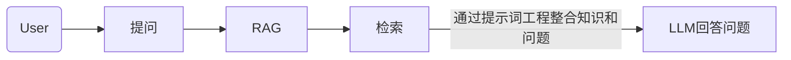
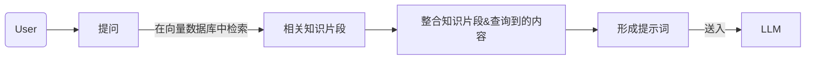
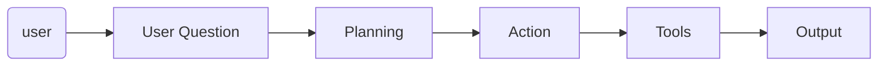
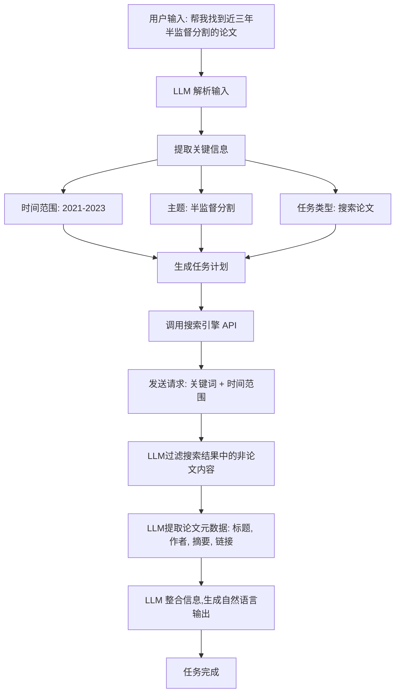
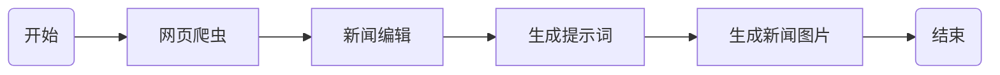
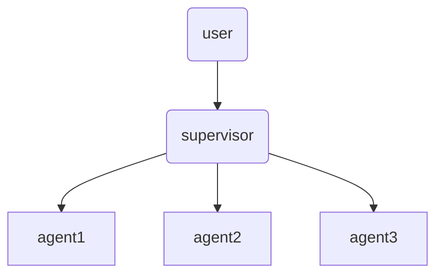

# LLM开发

LlamaIndex 和 LangChain 有点笨重，封装的有点深，建议主要业务代码还是自己写。

[(27 封私信 / 80 条消息) 神洛 - 知乎](https://www.zhihu.com/people/shen-luo-74-23/posts)

## HuggingFace

通过前面的学习我们可以知道，大模型由于训练数据的时效性（知识截至），对最近的一些信息、问题无法正确回答；有时候 LLM 还会出现幻视，自行的做出错误的回答。这两个缺点都可以用 RAG 来进行改进。

RAG（检索增强生成），从大堆的文档（知识库）中查找和问题比较相关的数据，然后将这些相关的**数据和问题一并送到 LLM**，让 LLM 根据这些数据进行回答。



下面是一个典型的提示词模板

```
prompt_template = """
你是一个专业的企业知识库问答助手。我会给你一些相关的文档片段、对话历史和一个问题。
请你基于这些信息，以专业、准确、简洁的方式回答问题。
如果文档片段中没有足够的信息来回答问题，请明确指出。

相关文档片段：
{context}

最近的对话历史：
{history}

当前问题：{question}

请给出你的回答：
"""
```

这意味着我们需要做“问题”和“知识库”的一个检索/匹配。如何做这种匹配呢？一般是将文字向量化（embedding）然后计算问题和知识库中向量的相似度。

- 余弦相似度
- 内积
- 欧式距离
- 曼哈顿距离
- 杰卡尔德系数

### HuggingFace初步

<span style="color:blue">我们使用 huggingface 上的 embeddings 模型（特征提取模型）对文本进行向量化。</span>

先安装使用 HuggingFace 的必备库：`transformers`

```python
pip install transformers
# transformers 个别库需要依赖 pytorch，需要用到时候再安装即可。
pip install torch==2.5.0 torchvision==0.20.0 torchaudio==2.5.0 --index-url https://download.pytorch.org/whl/cu121
```

[Models - Hugging Face](https://huggingface.co/models?pipeline_tag=feature-extraction&language=zh&sort=trending)

[The Tasks Manager](https://huggingface.co/docs/optimum/exporters/task_manager)

<div align="center"></div>

1️⃣下载 huggingface 上的模型，这里我们下载两个模型：

```python
import os

# 设置环境变量，从国内镜像下载
os.environ['HF_ENDPOINT'] = 'https://hf-mirror.com'

# 下载模型
os.system('huggingface-cli download --resume-download sentence-transformers/all-MiniLM-L6-v2 --local-dir ./all-MiniLM-L6-v2')
os.system('huggingface-cli download --resume-download BAAI/bge-large-zh-v1.5 --local-dir ./bge-large-zh-v1.5')
```

如果你熟悉 Linux，可以直接把环境变量配置到当前用户的 .bashrc 文件中。

```shell
export HF_ENDPOINT="https://hf-mirror.com"

$ source ~/.bashrc

# 然后就可以在终端直接使用命令下载 huggingface 中的模型
# --resume-download 表示启用断点下载
# sentence-transformers/all-MiniLM-L6-v2 是我们下载的模型
# --local-dir ./all-MiniLM-L6-v2 下载的模型保存在当前目录的 all-MiniLM-L6-v2 目录下
huggingface-cli download --resume-download sentence-transformers/all-MiniLM-L6-v2 --local-dir ./all-MiniLM-L6-v2
```

2️⃣我们来观察下，下载了那些文件，各自代表什么含义。

```shell
1_Pooling
README.md
config.json			# 模型的配置信息，如层数、隐藏层大小、激活函数等。
config_sentence_transformers.json	# 专门为 sentence-transformers 库定制的配置文件，包含了额外的配置信息
data_config.json
model.safetensors	  # 模型权重文件，使用了 safetensors 格式，这是一种安全的张量序列化格式。
modules.json		 # 模型中使用的模块或组件的信息
onnx				# onnx 模型
openvino			# openvino 模型
pytorch_model.bin	 # PyTorch 模型 
rust_model.ot		# Rust 模型文件
sentence_bert_config.json	# Sentence BERT 的配置文件，可能包含与句子嵌入生成相关的配置
special_tokens_map.json # 模型使用的特殊标记（如 [CLS], [SEP] 等）
tf_model.h5			# tf 模型
tokenizer.json		# 包含分词器配置和词汇表的文件，用于将文本转换为模型可以理解的输入格式。
tokenizer_config.json # 包含分词器配置信息的文件，如分词器类型、特殊标记等。
train_script.py
vocab.txt			# 包含分词器词汇表的文件，列出了分词器可以识别的所有单词或子词。
```

其实最重要的就是：模型权重、tokenizer*、vocab.txt 这些文件。

> 现在，我们尝试加载本地下载好的 HuggingFace 的模型，使用 sentence_transformers 对文本进行向量化。

- sentence_transformers 是一个基于 PyTorch 和 Transformers 的库，提供了大量预训练模型。
- `pip install sentence_transformers`

```shell
from sentence_transformers import SentenceTransformer

sentences = [
    "我喜欢在公园散步",
    "公园里散步很舒服",
    "今天天气真不错",
    "这个苹果很甜",
    "我最喜欢吃水果了"
]
# cache_folder 表示从本地的指定目录加载模型参数
model = SentenceTransformer('all-MiniLM-L6-v2', cache_folder='/home/hp/Code/rag-demo/all-MiniLM-L6-v2')
model_bge = SentenceTransformer('bge-large-zh-v1.5', cache_folder='/home/hp/Code/rag-demo/bge-large-zh-v1.5')

embeddings = model.encode(sentences)
embeddings_bge = model_bge.encode(sentences)
print(embeddings)
print(embeddings_bge)
```

也可以直接使用 huggingface 的 transformers 库对文本进行向量化。利用 bge-large-zh-v1.5 对句子进行向量化：

```python
from transformers import AutoTokenizer, AutoModel
import torch
# Sentences we want sentence embeddings for
sentences = [
    "我喜欢在公园散步",
    "公园里散步很舒服",
    "今天天气真不错",
    "这个苹果很甜",
    "我最喜欢吃水果了"
]

# 获取与该模型匹配的分词器，会加载 tokenizer.json、tokenizer_config.json、vocab.txt
tokenizer = AutoTokenizer.from_pretrained('bge-large-zh-v1.5')

# 无需知道模型细节，加载和运行各种预训练模型
model = AutoModel.from_pretrained('bge-large-zh-v1.5')
model.eval()

# 分词器，对句子进行分词，将其转为计算机可以识别的数字 对象() 实际上是调用的 __call__ 方法
encoded_input = tokenizer(sentences, padding=True, truncation=True, return_tensors='pt')

# Compute token embeddings
with torch.no_grad():
    model_output = model(**encoded_input)
    # Perform pooling. In this case, cls pooling.
    # 拿到句子的特征。官方示例的写法，这个位置的数据是进行了全局池化的数据（需要查看模型内部结构）
    sentence_embeddings = model_output[0][:, 0]
# normalize embeddings
sentence_embeddings = torch.nn.functional.normalize(sentence_embeddings, p=2, dim=1)
print("Sentence embeddings:", sentence_embeddings)
```

transformers 的写法要复杂点，但是有助于我们理解如何得到 sentence_embedding，后面的 ONNX 加速需要用的这些内容。

### HuggingFace加速

传统的深度学习模型参数推理速度比较慢，如果想将其应用到生产环境，建议将模型转换为其他加速格式，如 ONNX。这里我们使用 HuggingFace 提供的 optimum 将 HuggingFace 上的模型转成 ONNX（可以跳过，目前不太会自定义 LlamaIndex 的 Embedding，它内部做了多核处理器加速，我自定义的不如它自带的~）

```shell
# 安装 optimum
pip install optimum
```

[HuggingFace 模型导出成 ONNX 官方文档](https://huggingface.co/docs/optimum/exporters/task_manager)

[The Tasks Manager](https://huggingface.co/docs/transformers/main/zh/serialization)

```shell
# 将 xxx 文件夹下的模型参数转为 onnx。这里没有指定 task 参数，将默认导出不带特定任务头的模型架构。
# 简单说就是，如果你这个模型支持两个任务（文本分类、问答），那么一般这个模型会有两个任务头，不指定 task 参数
# 导出模型的时候就不会导出这两个任务头，只导出编码器（encode）
optimum-cli export onnx --model BAAI/bge-large-zh-v1.5 bge_onnx/ --task feature-extraction
```

生成的 `model.onnx` 文件可以在支持 ONNX 标准的 [许多加速引擎（accelerators）](https://onnx.ai/supported-tools.html#deployModel) 之一上运行。例如，可以使用 [ONNX Runtime](https://onnxruntime.ai/) 加载和运行模型，下面是 HuggingFace 上 ONNX 推理的示例代码：

```python
from transformers import AutoTokenizer
from onnxruntime import InferenceSession

tokenizer = AutoTokenizer.from_pretrained("distilbert/distilbert-base-uncased")
session = InferenceSession("onnx/model.onnx")
# ONNX Runtime expects NumPy arrays as input
inputs = tokenizer("Using DistilBERT with ONNX Runtime!", return_tensors="np")

# onnx 推理的时候需要定义好输出的名字和输入的数据
outputs = session.run(output_names=["last_hidden_state"], input_feed=dict(inputs))
```

从上面的代码我们可以看到，需要定义模型的输入（input_feed）和输出（output_names），我们如何得知 onnx 模型需要什么输入，什么输出呢？使用 netron 来查看 onnx 结构，进而得知 onnx 模型需要什么输入和输出。[netron](https://netron.app/)

<div align="center"></div>

```python
from transformers import AutoTokenizer
from onnxruntime import InferenceSession
import numpy as np

tokenizer = AutoTokenizer.from_pretrained("/home/hp/Code/rag-demo/bge_onnx")
session = InferenceSession("/home/hp/Code/rag-demo/bge_onnx/model.onnx")
# ONNX Runtime expects NumPy arrays as input
sentences = [
    "我喜欢在公园散步",
    "公园里散步很舒服",
    "今天天气真不错",
    "这个苹果很甜",
    "我最喜欢吃水果了"
]

encoded_input = tokenizer(sentences, padding=True, truncation=True, return_tensors='np')

inputs = dict(encoded_input) 
del inputs['token_type_ids']

sentence_embedding = session.run(output_names=["token_embeddings", "sentence_embedding"], input_feed=dict(inputs))[1]
```

## LlamaIndex

[LlamaIndex - LlamaIndex](https://docs.llamaindex.ai/en/stable/#introduction)

LlamaIndex 是一个上下文增强的 LLM 框架，旨在通过将其与特定上下文数据集集成，增强大型语言模型（LLMs）的能力。它允许您构建应用程序，既利用 LLMs 的优势，又融入您的私有或领域特定信息。LlamaIndex 支持文本、图片等多种数据的向量化存储和检索。

简单说：LlamaIndex 可以帮助我们快速构建基于 RAG、Agent、WorkFlow 的 LLM。

<b>什么是向量化存储?</b>

向量化存储就是指把文本、图像这种数据转换成为<b>向量/特征</b>，存储到特定的向量数据库中，便于快速检索。

<b>如何利用 LlamaIndex 构建向量数据库，从向量数据库中检索相关信息，一并送入 LLM 中，增强 LLM 的能力呢？</b>

### LlamaIndex初步

[安装必备库](https://www.aidoczh.com/llamaindex/getting_started/installation/)

```shell
pip install llama-index	# llamaindex 必备库
pip install llama-index-embeddings-huggingface # 我们需要使用 huggingface 上的 embedding 模型对文件进行向量化
pip install llama-index-openllm	# 使用国产大模型的在线服务所需要的库
```

使用 LlamaIndex 提供的 OpenLLM 来使用国产大模型 [DeepSeek](https://www.deepseek.com/) 的 API 服务。

```python
from llama_index.llms.openllm import OpenLLM

# deepseek 提供了 OpenAI 风格的 API 接口。
llm = OpenLLM(model="deepseek-chat", api_base="https://api.deepseek.com", api_key="sk-d94daa", is_chat_model=True)

# stream_complete 采用的流式风格，模型每输出一个字，它就会捕捉模型的输出传递过来
for it in llm.stream_complete("请你结合这些内容作答，你是萍乡学院的助教模型。现在我向你说：你好呀"):
    print(it, end="\n", flush=True)
```

### 配置Settings

我们是希望集成 RAG 进来的。通过前面的学习，我们知道构建 RAG 的第一步：**将文本进行向量化**。

LlamaIndex 默认是使用 OpenAI 提供的 Embedding 模型，这里我不使用（也不方便）在线的 Embedding 服务，使用本地的离线 Embedding。因此，在这里我们需要创建一个本地的 Embedding 模型，然后指定 LlamaIndex 在对文本数据进行向量化的时候，使用我们指定的 Embeddings 模型。

**我们通过 LlamaIndex 的 Settings 类来进行配置。**

```python
from llama_index.llms.openllm import OpenLLM
from llama_index.embeddings.huggingface import HuggingFaceEmbedding

from llama_index.core import VectorStoreIndex, SimpleDirectoryReader, Settings


# 配置 embeddings，llm
Settings.embed_model = HuggingFaceEmbedding(model_name="/home/hp/Code/rag-demo/bge-large-zh-v1.5")
Settings.llm = OpenLLM(model="deepseek-chat", api_base="https://api.deepseek.com", api_key="sk-d94daa05fc82", is_chat_model=True)

# 将文档加载到向量数据库
documents = SimpleDirectoryReader("data").load_data()
index = VectorStoreIndex.from_documents(documents,)

query_engine = index.as_query_engine()
response = query_engine.query("给我介绍下萍乡学院")
print(response)
```

### 自定义Ebedding

前面我们尝试过将 HuggingFace 的模型转为 ONNX 格式加速推理。这里，我们尝试自定义一个 Embedding，使用 ONNX 的 bge-large 进行 Embeddings。**（可跳过，速度比不上 LlamaIndex 的）**

后面我发现，原来 LlamaIndex 支持使用 ONNX 模型~

[Custom Embeddings - LlamaIndex](https://docs.llamaindex.ai/en/stable/examples/embeddings/custom_embeddings/)

```python
from typing import Any, List
from InstructorEmbedding import INSTRUCTOR

from llama_index.core.bridge.pydantic import PrivateAttr
from llama_index.core.embeddings import BaseEmbedding
from transformers import AutoTokenizer
from onnxruntime import InferenceSession
import numpy as np

class ONNXEmbeddings(BaseEmbedding):
    _model = PrivateAttr()
    _instruction: str = PrivateAttr()
    
    def __init__(
        self,
        instruction: str = "Represent a document for semantic search:",
        **kwargs: Any,
    ) -> None:
        super().__init__(**kwargs)
        self._model = InferenceSession("/home/hp/Code/rag-demo/bge_onnx/model.onnx")
        self._tokenizer =  AutoTokenizer.from_pretrained("/home/hp/Code/rag-demo/bge_onnx")
        self._instruction = instruction

    @classmethod
    def class_name(cls) -> str:
        return "onnx"

    async def _aget_query_embedding(self, query: str) -> List[float]:
        return self._get_query_embedding(query)

    async def _aget_text_embedding(self, text: str) -> List[float]:
        return self._get_text_embedding(text)

    def _get_query_embedding(self, query: str) -> List[float]:
        encoded_input = self._tokenizer([self._instruction+"\n"+query], padding=True, truncation=True, return_tensors='np')

        inputs = dict(encoded_input) 
        del inputs['token_type_ids']
        return self._model.run(output_names=["token_embeddings", "sentence_embedding"], input_feed=dict(inputs))[1][0].tolist()

    def _get_text_embedding(self, text: str) -> List[float]:
        encoded_input = self._tokenizer([self._instruction+"\n"+text], padding=True, truncation=True, return_tensors='np')
        inputs = dict(encoded_input) 
        del inputs['token_type_ids']
        return self._model.run(output_names=["token_embeddings", "sentence_embedding"], input_feed=dict(inputs))[1][0].tolist()

    def _get_text_embeddings(self, texts: List[str]) -> List[List[float]]:
        encoded_input = self._tokenizer([self._instruction+"\n"+text for text in texts], padding=True, truncation=True, return_tensors='np')
        inputs = dict(encoded_input) 
        del inputs['token_type_ids']
        return self._model.run(output_names=["token_embeddings", "sentence_embedding"], input_feed=dict(inputs))[1].tolist()
    

from llama_index.core import VectorStoreIndex, SimpleDirectoryReader, Settings
from llama_index.embeddings.huggingface import HuggingFaceEmbedding
from llama_index.llms.openllm import OpenLLM


# 配置 embeddings，llm
Settings.embed_model = ONNXEmbeddings()
Settings.llm = OpenLLM(model="deepseek-chat", api_base="https://api.deepseek.com", api_key="sk-d94daa05fc82406", is_chat_model=True)

# 将文档加载到向量数据库
documents = SimpleDirectoryReader("data").load_data()
index = VectorStoreIndex.from_documents(documents,)

query_engine = index.as_query_engine()
response = query_engine.query("给我介绍下萍乡学院")
print(response)
```

### HuggingFace ONNX

LlamaIndex 支持使用 HuggingFace 导出的 ONNX 模型进行 embedding！

```python
from llama_index.embeddings.huggingface_optimum import OptimumEmbedding

OptimumEmbedding.create_and_save_optimum_model("BAAI/bge-small-en-v1.5", "./bge_onnx")
embed_model = OptimumEmbedding(folder_name="./bge_onnx")
```

明天探索一下~LlamaIndex 官方测过，ONNX 更快一些~

[Local Embeddings with HuggingFace - LlamaIndex](https://docs.llamaindex.ai/en/stable/examples/embeddings/huggingface/)

### 多轮对话

我们进行多轮对话的时候，希望大模型可以看到我们之前的对话记录，这样也可以减小模型的幻世，提高对话的质量。这时候我们可以指定，在这次对话的时候传递多少条之前的聊天给 LLM。

**（聊天记录是包括用户提问和模型回答的，传递的聊天记录多了，其实很耗费 token）。**

我们配置下，最多传递 5 条历史对话。

```python
import logging
import sys

from llama_index.core import VectorStoreIndex, SimpleDirectoryReader, Settings
from llama_index.embeddings.huggingface import HuggingFaceEmbedding
from llama_index.llms.openllm import OpenLLM

logging.basicConfig(stream=sys.stdout, level=logging.INFO)
logging.getLogger().addHandler(logging.StreamHandler(stream=sys.stdout))


# 配置 embeddings，llm
Settings.embed_model = HuggingFaceEmbedding(model_name="/home/hp/Code/rag-demo/bge-large-zh-v1.5")
Settings.llm = OpenLLM(model="deepseek-chat", api_base="https://api.deepseek.com", api_key="sk-d94daa05fc8", is_chat_model=True)

# 加载文档
documents = SimpleDirectoryReader("/home/hp/Code/rag-demo/data").load_data()
index = VectorStoreIndex.from_documents(documents)

# 构建聊天模型的引擎（streaming=True 表示开启 streaming 模式，模型生成一个 token 就拿一个 token）
chat_engine = index.as_chat_engine(chat_mode="condense_question", streaming=True)
response_stream = chat_engine.stream_chat("你好呀！")
response_stream.print_response_stream() # 流式打印输出（模型生成一个我就输出一个）

# 获取 LlamaIndex 的聊天历史记录
print(chat_engine.chat_history)

# 只传递最近的5条聊天记录给 LLM
response_stream = chat_engine.stream_chat("介绍下萍乡学院",chat_history=chat_engine.chat_history[-5:])
response_stream.print_response_stream()

response_stream = chat_engine.stream_chat("那你认识再里面读书的人吗")
response_stream.print_response_stream()

response_stream = chat_engine.stream_chat("我刚刚问了你啥问题")
response_stream.print_response_stream()
print(chat_engine.chat_history)
```

### 向量数据库

[Storing - LlamaIndex](https://docs.llamaindex.ai/en/stable/understanding/storing/storing/)

下面，我们使用 LlamaIndex 提供的 VectorStoreIndex 来体验下 RAG。

先准备知识

```markdown
萍乡学院是位于江西省萍乡市的一所高等学府
萍乡学院每年的经费约2个亿
```

创建知识库

```python
import logging
import sys

from llama_index.core import VectorStoreIndex, SimpleDirectoryReader, Settings
from llama_index.embeddings.huggingface import HuggingFaceEmbedding
from llama_index.llms.openllm import OpenLLM

logging.basicConfig(stream=sys.stdout, level=logging.INFO)
logging.getLogger().addHandler(logging.StreamHandler(stream=sys.stdout))

# 配置 embeddings，llm
Settings.embed_model = HuggingFaceEmbedding(model_name="/home/hp/Code/rag-demo/bge-large-zh-v1.5")
Settings.llm = OpenLLM(model="deepseek-chat", api_base="https://api.deepseek.com", api_key=os.environ['DEEPSEEK_API_KEY'], is_chat_model=True)

# 加载文档
documents = SimpleDirectoryReader("/home/hp/Code/rag-demo/data").load_data()
# 利用文档和 Settings 的 embed_model 对文件进行向量化，然后存储到 LlamaIndex 默认的向量数据库中，同时返回一个会 index
# 该 index 会先根据问题执行 RAG，然后将 RAG 查询到的内容和问题组成一个提示词，让 LLM 根据提示词来回答问题
index = VectorStoreIndex.from_documents(documents)

# 构建一个聊天的引擎，同时开启流式模型
chat_engine = index.as_chat_engine(chat_mode="condense_question", streaming=True)
response_stream = chat_engine.stream_chat("介绍下萍乡学院！")
response_stream.print_response_stream()
```

之前我们使用了 LlamaIndex 自带的 VectorStoreIndex 构建 RAG，并使用流式打印输出内容。现在我们来使用 Chroma 来构建向量数据库，并实现数据的持久化。

<b>安装库</b>

```shell
pip install llama-index-vector-stores-chroma
pip install chromadb
```

将 ChromaDB 集成到 LlamaIndex 中。

```python
import chromadb
from llama_index.core import VectorStoreIndex, SimpleDirectoryReader, Settings

from llama_index.embeddings.huggingface import HuggingFaceEmbedding
from llama_index.llms.openllm import OpenLLM

from llama_index.vector_stores.chroma import ChromaVectorStore
from llama_index.core import StorageContext


Settings.embed_model = HuggingFaceEmbedding(model_name="/home/hp/Code/rag-demo/bge-large-zh-v1.5")
Settings.llm = OpenLLM(model="deepseek-chat", api_base="https://api.deepseek.com", api_key=os.environ['DEEPSEEK_API_KEY'], is_chat_model=True)

documents = SimpleDirectoryReader("./data").load_data()

# 初始化了一个持久化的 Chroma 数据库客户端，数据库将存储在"./chroma_db"路径下
db = chromadb.PersistentClient(path="./chroma_db")

# 在Chroma数据库中获取或创建名为"linux"的集合，用于存储文本向量。
chroma_collection = db.get_or_create_collection("linux")

# 创建了一个向量存储实例
vector_store = ChromaVectorStore(chroma_collection=chroma_collection)
# 并将其设置为存储上下文的默认向量存储。
storage_context = StorageContext.from_defaults(vector_store=vector_store)

# 使用加载的文档和存储上下文创建了一个向量存储索引
index = VectorStoreIndex.from_documents(documents, storage_context=storage_context)

# 创建了一个查询引擎。注意，这个查询引擎的工作流程是，先执行RAG，然后把RAG找到的内容和问题一起拼接成 prompt
query_engine = index.as_query_engine()
response = query_engine.query("介绍下萍乡学院")
print(response)
```

如果我们有多个不同的知识库，我们为了保证知识库的专业性，希望将不同类型的知识存储到不同的知识库，这时候需要为每个知识库创建一个 `ChromaVectorStore`。

例如，我要制作三门课程的知识库，这些知识如果放在一起会影响 RAG 的效果，这时候就可以创建三个不同的 `ChromaVectorStore`，查询 Linux 知识的时候用 Linux 的 VectorStoreIndex，查询 OS 知识的时候用 OS 的 VectorStoreIndex 。**（可以定义一个工作流，用工作流判断是什么类型的问题，然后用对应的 RAG 进行检索）**

### 文档向量化

### 提升RAG

RAG 检索一般有三种方式（Dify）

- 向量检索：这种模式下，会将知识库的内容进行切分，转换成 embeddings，然后存储向量数据库。用户提问后，先从向量数据库中检索相似的内容，然后将问题和检索的内容一并送模型，让模型根据内容进行回答。



- 全文检索：这种模式下，索引文档中的所有词汇，从而允许用户查询任意词汇，并返回包含这些词汇的文本片段（ES）

- 混合检索：同时执行全文检索和向量检索，并应用重排序步骤，从两类查询结果中选择匹配用户问题的最佳结果。


### Agent

大模型遇到问题时，先对问题进行规划/拆解。执行问题的过程中，如果可以自己解决就自己解决，无法解决就借助外部工具解决。



下面是一个 Agent 的流程图，大模型自行解析用户输入，拆解任务。



如：对于提问“帮我找到近三年半监督分割的论文”，大模型无法独立完成这个任务。因此，大模型会先拆解问题，分析要做什么，按什么流程做，如果自身无法完成，则会调用对应的外部工具来完成对应的任务。

<b>智能体</b>是依靠模型自己理解问题，拆分任务，然后判断是否需要调用外部工具，完成问答。下面所讨论的<b>工作流</b>则是固定了流程。

```python
# Agent

from llama_index.core import VectorStoreIndex, SimpleDirectoryReader, Settings
from llama_index.embeddings.huggingface import HuggingFaceEmbedding
from llama_index.llms.openllm import OpenLLM

from lagent.agents import ReAct
from lagent.actions import BingBrowser, ArxivSearch, GoogleSearch, PythonInterpreter
from lagent.actions.bing_browser import BingSearch, BingBrowser
from llama_index.core.agent import ReActAgent
from llama_index.core.tools import FunctionTool

def multiply(a: float, b: float) -> float:
    """Multiply two numbers and returns the product"""
    return a * b


def add(a: float, b: float) -> float:
    """Add two numbers and returns the sum"""
    return a + b


multiply_tool = FunctionTool.from_defaults(fn=multiply)
add_tool = FunctionTool.from_defaults(fn=add)
python_tools = FunctionTool.from_defaults(PythonInterpreter().run)


# pip install lagent
# 配置 embeddings，llm
Settings.embed_model = HuggingFaceEmbedding(model_name="/home/hp/Code/rag-demo/bge-large-zh-v1.5")
Settings.llm = OpenLLM(model="deepseek-chat", api_base="https://api.deepseek.com", api_key="sk-d94daa05fc82406082", is_chat_model=True)

agent = ReActAgent.from_tools([multiply_tool, add_tool, python_tools], llm=Settings.llm , verbose=True)

response = agent.chat("这段代码的运行结果是什么 \
                      import numpy as np \
                      data = np.array([0,1,2,3,4]) \
                      data[3]")

print(response)
```

我们可以在 LLM 中集成 Web 检索功能。现在 Web 中检索数据，然后将数据向量化存到向量数据库中，再从数据库中找出相关的内容一起返回给后面的插件。

如何在 agent 中集成 RAG 呢？

[Usage Pattern - LlamaIndex](https://docs.llamaindex.ai/en/stable/module_guides/deploying/agents/usage_pattern/)

```python
from llama_index import SimpleDirectoryReader, VectorStoreIndex, StorageContext, ChromaVectorStore
from llama_index.tools import QueryEngineTool
from llama_index.agents import OpenAIAgent
from langchain.llms import OpenAI
import chromadb

# 1. 加载数据
documents = SimpleDirectoryReader('data').load_data()

# 2. 初始化 ChromaDB 客户端
client = chromadb.PersistentClient(path="./chroma_db")

# 3. 创建或获取 ChromaDB 集合
collection = client.get_or_create_collection("my_collection")

# 4. 创建向量存储
vector_store = ChromaVectorStore(chroma_collection=collection)

# 5. 创建存储上下文
storage_context = StorageContext.from_defaults(vector_store=vector_store)

# 6. 构建索引
index = VectorStoreIndex.from_documents(documents, storage_context=storage_context)

# 7. 创建查询引擎
query_engine = index.as_query_engine()

# 8. 创建查询引擎工具
query_engine_tool = QueryEngineTool.from_defaults(query_engine=query_engine, name="RAG Tool", description="Tool for retrieving information from the knowledge base")

# 9. 创建 Agent
agent = OpenAIAgent.from_tools([query_engine_tool], llm=OpenAI(temperature=0.7), verbose=True)

# 10. 使用 Agent 回答问题
response = agent.chat("请问什么是 RAG?")
print(response)
```


### WorkFlow

<b>Workflow</b>（工作流）是指一系列按照特定顺序执行的任务或步骤，用于完成一个特定的目标或流程。工作流的每个步骤都按照预定义的规则和顺序执行。



- **Agent** 是一个具有自主性和决策能力的实体，适用于复杂、动态的环境。
- **Workflow** 则是一个固定的任务序列，适用于规则明确、流程固定的场景。

### 多Agent

多 Agent 则是对用户的问题进行拆解，判断它需要调用那个智能体。然后再利用对应的智能体执行任务。



<b>比较</b>

| 类型        | 优点               | 缺点       |
| ----------- | ------------------ | ---------- |
| Agent       | 动态规划、灵活     | 缺乏稳定性 |
| Workflow    | 静态规划、稳定性高 | 缺乏灵活性 |
| Multi Agent | 完成较复杂的任务   | 缺乏稳定性 |


## 向量数据库

[LangChain教程 - 支持的向量数据库列举_langchain支持的向量数据库-CSDN博客](https://blog.csdn.net/fenglingguitar/article/details/142436241)

市面上的向量数据库有很多，这里我们主要学习 Chroma。

### Chroma

Chroma 是一个开源且轻量级，易于本地部署，专门为检索增强生成 (RAG) 应用设计的向量数据库。不过目前 Chroma 的功能较为基础，缺乏大规模分布式支持；比较适合用于开发和测试阶段的小型项目或个人应用。

快速入门

```python
from langchain.vectorstores import Chroma
from langchain.embeddings.openai import OpenAIEmbeddings

embedding_model = OpenAIEmbeddings()
texts = ["这是一个例子", "另一个例子"]
vectorstore = Chroma.from_texts(texts, embedding_model)
docs = vectorstore.similarity_search("这是查询")
print(docs)
```

## LangChain

[构建检索增强生成（RAG）应用：第一部分 | 🦜️🔗 LangChain 框架](https://python.langchain.ac.cn/docs/tutorials/rag/)

LangChain 提供了一个模块化和适应性强的框架，用于构建各种 NLP 应用程序，包括聊天机器人、内容生成工具和复杂的流程自动化系统。

通过 LangChain，我们可以方便快捷的调用 LLM 的 API 接口，并集成 RAG 增强 LLM。LangChain 内部也集成了一个非常简易的向量数据库 `InMemoryVectorStore`。

`InMemoryVectorStore` 将向量数据存储在内存中，提供了快速的访问速度，但不具备数据持久化的能力。这种实现方式适合于数据量较小且需要快速访问的场景，例如原型开发、测试或小型应用。由于数据存储在内存中，一旦程序终止，内存中的数据将会丢失。因此，`InMemoryVectorStore` 不适合需要长期存储和大规模数据处理的生产环境。

- 使用 PyPDF2 解析 pdf，`pip install pypdf2`
- openai
- langchain，`pip install langchain`

```python
import PyPDF2

"""
RAG 文字切分方式
- 按行
- 按句号
- 按长度切分
- 按长度 + 滑动窗口切分（确保知识重叠。）
"""

pdf_dir = "程序员代码面试指南（第2版） (左程云) (Z-Library).pdf"
def extract_pdf():
    with open(pdf_dir, 'rb') as file:
        reader = PyPDF2.PdfReader(file)
        text = ""
        for page in reader.pages:
            text += page.extract_text()
    return text

def split_by_sliding_window(text, window_size=300, step_size=100):
    chunks = []
    start = 0
    while start<len(text):
        end = start + window_size
        if end > len(text):
            end = len(text)
        chunks.append(text[start:end])
        start+=step_size
    return chunks

"""
测试split
text = extract_pdf()
text_list = split_by_sliding_window(text)
print(text_list[2])
"""

"""
openai 调用开源模型进行embedding
"""
from openai import OpenAI
client = OpenAI(api_key="") 
```

## Dify

免费版本的能力有限。如何需要达到比较好的效果需要去购买三方 API 接口，或者自己本地部署一个比较好的 Embedding 模型、Rerank 模型等。搭建基本知识库供内网的人员使用还是很合适的。用来体验 agent 也非常棒，自带了很多 agent 工具，无需自己去 github / gitee 搜索相关的项目。

[保姆教程篇：手把手教你从零开始本地部署Dify - 知乎](https://zhuanlan.zhihu.com/p/713902500)

## 工程化实现

茴香豆[InternLM/HuixiangDou: HuixiangDou: Overcoming Group Chat Scenarios with LLM-based Technical Assistance](https://github.com/InternLM/HuixiangDou/tree/main)

[后端研发Marion/rag-demo](https://gitee.com/zeus-maker/rag-demo#注意事项-1)

[【小白学大模型】强推！两小时彻底掌握LlamaIndex，从原理讲解到实战练习，全程干货无废话！_哔哩哔哩_bilibili](https://www.bilibili.com/video/BV1jUq3Y8Ey6/?spm_id_from=333.1387.favlist.content.click&vd_source=cb8bc4312b30b416beadaad7244940ac)

[10-大模型应用开发框架LangChain：开干_哔哩哔哩_bilibili](https://www.bilibili.com/video/BV16dzRYhEUM?spm_id_from=333.788.videopod.episodes&vd_source=cb8bc4312b30b416beadaad7244940ac&p=9)

[如何选择RAG的Embedding模型？_哔哩哔哩_bilibili](https://www.bilibili.com/video/BV1h142197Fm?spm_id_from=333.788.videopod.sections&vd_source=cb8bc4312b30b416beadaad7244940ac)

### 技术栈

基于 LLM 和 RAG 的助教问答系统

<b>模型层面</b>

- LLM 模型，回答问题；支持调用外部模型或使用本地模型
- Embedding 模型，将文本进行向量化；可以调用外部模型（选用中文支持好的）

<b>技术框架层面</b>

- Web 展示框架：streamlit、<b>chainlit</b>、gradio
- 数据存储：聊天历史记录 postgresql
- 文件存储：minio 服务器或持久化到本地
- 向量数据库：向量数据库，用于快速检索出和问题相关的信息
  - chroma（首选）
  - milvus
- LLM 开发框架
  - Llamaindex 即可：RAG、Agent、业务流都支持。
- 链接到搜索引擎：使用三方搜索引擎的开放 API
- 数据质量问题（后期扩充）
  - 开发 ocr 识别系统解决
  - 借助多模态系统对多媒体处理
  - 借助多模态嵌入模型及向量数据库直接处理


