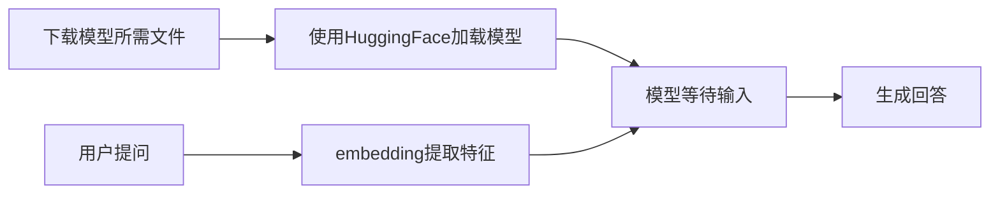

# HuggingFace

使用 HuggingFace 的必备库

FireCrawl 爬虫工具库

```shell
# 安装下载模型的工具 huggingface-cli
pip install -U huggingface_hub -i https://mirrors.tuna.tsinghua.edu.cn/pypi/web/simple

# 核心库 transfomers，用于加载模型，微调模型
pip install transformers -i https://mirrors.tuna.tsinghua.edu.cn/pypi/web/simple

# huggingface 生态下的高效增量微调库 peft
pip install peft -i https://mirrors.tuna.tsinghua.edu.cn/pypi/web/simple

# huggingface 生态下的加载数据集的库 datasets
pip install datasets -i https://mirrors.tuna.tsinghua.edu.cn/pypi/web/simple

# torch 相关的库（推理/训练要用到）
pip install torch==2.5.0 torchvision==0.20.0 torchaudio==2.5.0 --index-url https://download.pytorch.org/whl/cu118

# 加速库
# Using `low_cpu_mem_usage=True` or a `device_map` requires Accelerate: `pip install 'accelerate>=0.26.0'`
pip install accelerate>=0.26.0 -i https://mirrors.tuna.tsinghua.edu.cn/pypi/web/simple
```

## 简介&配置

Hugging Face 是一家专注于自然语言处理和机器学习的公司，以其开源的 Transformers 库而闻名。该平台提供了丰富的预训练模型，支持多种语言任务，如文本生成、翻译和情感分析，是 AI 届的 github。改公司最核心的项目是 `Transformers`

> Transformers 提供 API 和工具，可轻松下载和训练最先进的预训练模型。使用预训练模型可以降低计算成本，并节省从头开始训练模型所需的时间和资源。这些模型支持不同模式的常见任务：

- <b>自然语言处理：</b>文本分类、命名实体识别、问答、语言建模、摘要、翻译、多项选择和文本生成。
- <b>计算机视觉：</b>图像分类、对象检测和分割。
- <b>音频：</b>自动语音识别和音频分类。
- <b>多模态：</b>表格问答、光学字符识别、扫描文档信息提取、视频分类和视觉问答。

此外，Hugging Face 官方还提供免费的课程，如何利用社区生态来进行 NLP 的学习。

> HuggingFace 的模型需要使用魔法才可以流程下载，否则容易出现连接超时。建议设置国内镜像。

Linux 中通过编辑 ~/.bashrc 变量设置国内镜像

```shell
# 配置环境变量
vim ~/.bashrc
 
# 在打开文件中的最后一行添加
export HF_ENDPOINT="https://hf-mirror.com"
 
# 使得更改生效
source ~/.bashrc
```

Windows 中通过添加环境变量设置国内镜像

```shell
HF_ENDPOINT 
https://hf-mirror.com
```

在 conda / pip 等环境中安装 huggingface

```shell
pip install -U huggingface_hub -i https://mirrors.tuna.tsinghua.edu.cn/pypi/web/simple
```

然后就可以在这个环境里使用 huggingface-cli 命令下载对应的模型了。下载模型的语法如下：

```shell
huggingface-cli download --resume-download {huggingface官网上的模型ID} --local-dir {想要下载到的目录}
huggingface-cli download --resume-download Qwen/Qwen2.5-0.5B-Instruct --local-dir ./Qwen2.5-0.5B-Instruct
```

模型 ID 直接在网页上复制即可，比如，我想下载  Llama3-8B-Chinese-Chat

<div align="center"></div>

复制后，可以得到 ID `shenzhi-wang/Llama3-8B-Chinese-Chat`，使用 huggingface-cli 下载

```shell
huggingface-cli download --resume-download shenzhi-wang/Llama3-8B-Chinese-Chat --local-dir /home/Payphone/dir
```

下载完成后，我们观察 /home/Payphone/dir 目录会发现目录里包含了 Files and Versions 中所有的文件 (PS： Files and Versions 里包含了模型文件和模型的版本管理。我们如果想要使用模型，需要把里面所有的文件都下载过来 )

## CodeSpace

GitHub Codespace 通过 GitHub 原生的完全配置、安全的云开发环境，可以更快地启动和写代码，它提供了一系列模板，我们在跑机器学习深度学习相关的实验的时候，可以选择它的 Jupyter NoteBook 模板。

- [Create new codespace](https://github.com/codespaces/new?skip_quickstart=true&geo=SoutheastAsia)
- 根据已有的 github 仓库创建一个 Code Space 空间

<div align="center"></div>

## 模型推理

> LLM 的推理比较简单，我们来理一下它的流程。



从上面的流程图我们可以看到，我们需要做两大步骤：

- 利用框架将模型跑起来（HuggingFace / ModelScope）
- 准备好问题，利用 embedding 模型提取词向量特征

做好后将准备好的词向量模型送入模型，等待其生成回答即可。

> 明白了 LLM 部署的流程，那我们应该怎么加载模型，怎么对问题做特征提取，有需要怎么组织数据输入给模型呢？

### 通过 transformers 库推理

```shell
# 安装必备库
pip install transformers -i https://mirrors.tuna.tsinghua.edu.cn/pypi/web/simple

# torch 相关的库
pip install torch==2.5.0 torchvision==0.20.0 torchaudio==2.5.0 --index-url https://download.pytorch.org/whl/cu118

# 加速库
# Using `low_cpu_mem_usage=True` or a `device_map` requires Accelerate: `pip install 'accelerate>=0.26.0'`
pip install accelerate>=0.26.0 -i https://mirrors.tuna.tsinghua.edu.cn/pypi/web/simple
```

HuggingFace 中模型 modelcard 页面中有一个 use this model，点击它可以看到基本的使用方式。

> 使用高层级的 API 推理模型

```python
# Use a pipeline as a high-level helper
from transformers import pipeline
import torch
messages = [
    {"role": "user", "content": "你是谁"},
]
pipe = pipeline("text-generation", model="Qwen2.5-0.5B-Instruct", torch_dtype=torch.float16)
print(pipe(messages))
```

输出结果

```json
[{'generated_text': [{'role': 'user', 'content': '你是谁'}, {'role': 'assistant', 'content': '我是阿里云开发的一种超大规模语言模型，我叫通义千问。我是由阿里'}]}]
```

> 直接加载模型-推理

```python
# Load model directly
from transformers import AutoTokenizer, AutoModelForCausalLM

tokenizer = AutoTokenizer.from_pretrained("Qwen/Qwen2.5-0.5B")
model = AutoModelForCausalLM.from_pretrained("Qwen/Qwen2.5-0.5B")
```

对于这种方式， use this model 里并未给出完整的推理代码。查阅 Transformers 文档发现完整的推理代码如下（暂不考虑量化）：

```python
# https://huggingface.co/docs/transformers/model_doc/qwen2

from transformers import AutoModelForCausalLM, AutoTokenizer, AutoConfig
import torch

device = "cuda:0" # the device to load the model onto

config = AutoConfig.from_pretrained("Qwen2.5-0.5B-Instruct")
config.attention_window = None  # 禁用滑动窗口

model = AutoModelForCausalLM.from_pretrained("Qwen2.5-0.5B-Instruct",   # 模型文件的路径
                                             config=config,
                                             device_map="auto",         # gpu 的使用方式
                                             torch_dtype=torch.float16, # 使用 fp16 加载模型，减少显存使用
                                             trust_remote_code=True)    # 加载自定义模型代码)

tokenizer = AutoTokenizer.from_pretrained("Qwen2.5-0.5B-Instruct")

prompt = "你是谁."

messages = [{"role": "user", "content": prompt}]

text = tokenizer.apply_chat_template(messages, tokenize=False, add_generation_prompt=True)

model_inputs = tokenizer([text], return_tensors="pt").to(device)

generated_ids = model.generate(model_inputs.input_ids, max_new_tokens=512, do_sample=True)

generated_ids = [output_ids[len(input_ids):] for input_ids, output_ids in zip(model_inputs.input_ids, generated_ids)]

response = tokenizer.batch_decode(generated_ids, skip_special_tokens=True)[0]
print(response)
```

### 根据Readme提示进行推理

首先，我们要确定使用什么 LLM；然后去 github 看他的开源代码，一般开源代码中会告诉我们如何部署。以 Qwen2.5 为例，官方提供了 huggingface、modelscope、ollama、vllm、llama.cpp 的推理/部署方式。

[Qwen2.5 官方部署教程](https://github.com/QwenLM/Qwen2.5)

### Qwen系列的推理

阿里 Qwen 系列部署的文档写的很细致，直接看文档就可以了。

[Qwen](https://qwen.readthedocs.io/en/latest/)

# 模型微调

## 微调的方式

[DeepSeek-R1微调三种方法（DeepSeek-R1-Distill-Qwen-7B） - 知乎](https://zhuanlan.zhihu.com/p/21587866352)

  > 根据参数量进行划分

  - 全量微调：对模型的所有参数进行更新，使其适应特定任务。能够充分利用模型的全部能力，但是需要大量的计算资源和时间。极有可能导致模型的通用能力极大地退化
  - 部分微调：仅更新模型的部分参数，冻结模型的大部分层，只微调最后几层或特定模块。
  - 参数高效微调（PEFT）：在预训练模型中添加少量可训练的参数或模块，仅训练这些新增的参数，减少资源消耗，提高效率。

  > 按训练目标划分的微调方式

| **类型**                        | **核心思想**                                                 | **适用场景**                   |
| ------------------------------- | ------------------------------------------------------------ | ------------------------------ |
| **监督微调（SFT）**‌             | 基于标注数据直接优化模型，提升模型在特定任务上的性能         | 1k+ 的高质量的对话数据         |
| **强化学习微调（RLFT）**‌        | 如果智能客服的应用场景涉及到与用户的复杂交互，并希望通过用户反馈持续改进服务质量（例如，根据用户满意度调整回复），则可以考虑采用这种方法。 | 需对齐人类价值观（如对话生成） |
| **提示词微调（Prompt Tuning）** | 设计有效的提示模板，通过少量样本优化这些提示，使其能够引导模型给出正确的答复。 | 已有预训练的语言模型表现良好   |

监督微调和提示词微调是比较合适的微调方式，实现相对简单，易于管理和评估。强化学习微调实现复杂度较高，需要设计合适的奖励机制和环境设置，通常不作为首选方案，除非有明确的需求和足够的资源来支持这种复杂的微调策略。

这里主要介绍 SFT！

## SFT

**SFT - 监督微调**

监督微调我们根据对话可以分成单论对话微调和多轮对话微调。

- 单轮对话微调更适合于任务明确、交互简短的应用场景，重点在于提高模型对单一问题的理解和回答能力。
- 多轮对话微调则更适合于需要维护对话历史、理解和回应基于上下文信息的复杂交互，其挑战在于如何有效地管理和利用对话历史来维持对话的连贯性和准确性。

LIMA: Less Is More for Alignment[1] 指出，LLM 在预训练阶段就已经学习到了大部分的能力，该论文进行了相关实验，发现**1000条的高质量对话数据**就可以让模型在 SFT 阶段学习得很好。

因此，我们可以通过对大量的 SFT 数据进行**质量筛选**，选择出少量高质量的部分用于微调。一方面既有效利用了这些 SFT 数据集，另一方面又减少了微调数据量，降低了微调成本。

> 如何生成高质量的 STF 数据集？

- 使用开源的公共数据集。
- 设计良好的提示词，利用更大的 LLM 生成高质量的数据集，然后人工进行筛选和纠错。
- 构建 RAG 系统，让 LLM 根据 RAG 提供的知识生成数据集。
- 数据增强：同义词替换，利用不同的方式进行提问。

> 利用 QwQ 生成高质量的数据

```python
# 编码....
```

## 微调工具

> 市面上有很多微调工具，这里只介绍四种

  - LLaMA-Factory，支持海量模型和各种主流微调方法，包括 LoRA。它提供了运行脚本微调和基于 Web 端微调的能力，自带基础训练数据集，并支持增量预训练和全量微调。
  - Hugging Face 的 PEFT 和 Transformers，支持 LoRA、AdaLoRA 等。
  - XTuner，支持在几乎所有 GPU 上对 LLM 和 VLM 进行预训练和微调，包括在 8GB GPU 上微调 7B 模型。它支持多种模型（如 InternLM、Llama2、ChatGLM、Qwen、Baichuan 等）和训练算法（如 QLoRA、LoRA、全参数微调），并提供从微调到部署、评测的完整工具链。
  - Unsloth，它可以将微调速度提升 2 倍，内存占用减少 80%，支持多种主流 LLM，如 Llama 3.1、Mistral、Phi-3.5 和 Gemma 等。Unsloth 提供完整的 Colab 教程，支持 Hugging Face 生态，适合 AI 开发者、学术研究者、企业技术团队和学生爱好者使用。

## HuggingFace 微调

> 安装必备库

  ```shell
# 安装下载模型的工具 huggingface-cli
pip install -U huggingface_hub -i https://mirrors.tuna.tsinghua.edu.cn/pypi/web/simple

# 核心库 transfomers，用于加载模型，微调模型
pip install transformers -i https://mirrors.tuna.tsinghua.edu.cn/pypi/web/simple

# huggingface 生态下的高效增量微调库 peft
pip install peft -i https://mirrors.tuna.tsinghua.edu.cn/pypi/web/simple

# huggingface 生态下的加载数据集的库 datasets
pip install datasets -i https://mirrors.tuna.tsinghua.edu.cn/pypi/web/simple

# torch 相关的库（推理/训练要用到）
pip install torch==2.5.0 torchvision==0.20.0 torchaudio==2.5.0 --index-url https://download.pytorch.org/whl/cu118

# 加速库
# Using `low_cpu_mem_usage=True` or a `device_map` requires Accelerate: `pip install 'accelerate>=0.26.0'`
pip install accelerate>=0.26.0 -i https://mirrors.tuna.tsinghua.edu.cn/pypi/web/simple
  ```

  > 全量微调代码

  ```shell
from transformers import AutoTokenizer, AutoModelForCausalLM, Trainer, TrainingArguments
from datasets import load_dataset

# 加载预训练模型和分词器
model_name = "Qwen/Qwen-0.5B"  # 确保这是正确的模型名称或路径
tokenizer = AutoTokenizer.from_pretrained(model_name)
model = AutoModelForCausalLM.from_pretrained(model_name)

# 假设你的数据集已经在Hugging Face Datasets库中或者你可以通过load_dataset加载
dataset = load_dataset("your_dataset_name")  # 替换为你的实际数据集名称

# 数据预处理
def preprocess_function(examples):
    return tokenizer(examples['text'], padding="max_length", truncation=True, max_length=128)  # 根据实际情况调整参数

encoded_dataset = dataset.map(preprocess_function, batched=True)

# 设置训练参数
training_args = TrainingArguments(
    output_dir="./results",
    evaluation_strategy="epoch",
    learning_rate=2e-5,
    per_device_train_batch_size=8,
    per_device_eval_batch_size=8,
    num_train_epochs=3,
    weight_decay=0.01,
)

# 创建Trainer实例
trainer = Trainer(
    model=model,
    args=training_args,
    train_dataset=encoded_dataset["train"],
    eval_dataset=encoded_dataset["test"],  # 如果有测试集的话
)

# 开始训练
trainer.train()

# 训练完成后保存模型
model.save_pretrained("./humorous_model")
tokenizer.save_pretrained("./humorous_model")
  ```

  > 增量微调代码

  增量微调（LoRA、QLoRA）需要安装 PEFT 库

  ```shell
pip install peft
  ```

  增量微调代码如下

  ```shell
from transformers import AutoTokenizer, AutoModelForCausalLM, Trainer, TrainingArguments
from peft import get_peft_model, LoraConfig, prepare_model_for_int8_training
from datasets import load_dataset

# 加载预训练模型和分词器
model_name = "Qwen/Qwen-0.5B"  # 确保这是正确的模型名称或路径
tokenizer = AutoTokenizer.from_pretrained(model_name)
model = AutoModelForCausalLM.from_pretrained(model_name)

# 准备模型以适应int8训练（如果适用）
model = prepare_model_for_int8_training(model)

# 设置LoRA配置
lora_config = LoraConfig(
    r=16,  # LoRA attention dimension
    lora_alpha=32,  # Alpha parameter for LoRA scaling
    target_modules=["q_proj", "v_proj"],  # 目标模块名称可能需要根据具体模型调整
    lora_dropout=0.05,  # Dropout概率
    bias="none",  # 'none', 'all' or 'lora_only'
    task_type="CAUSAL_LM",  # 指定任务类型
)

# 使用LoRA配置创建微调模型
model = get_peft_model(model, lora_config)

# 假设你的数据集已经在Hugging Face Datasets库中或者你可以通过load_dataset加载
dataset = load_dataset("your_dataset_name")  # 替换为你的实际数据集名称

# 数据预处理
def preprocess_function(examples):
    return tokenizer(examples['text'], padding="max_length", truncation=True, max_length=128)  # 根据实际情况调整参数

encoded_dataset = dataset.map(preprocess_function, batched=True)

# 设置训练参数
training_args = TrainingArguments(
    output_dir="./results",
    evaluation_strategy="epoch",
    learning_rate=2e-5,
    per_device_train_batch_size=8,
    per_device_eval_batch_size=8,
    num_train_epochs=3,
    weight_decay=0.01,
)

# 创建Trainer实例
trainer = Trainer(
    model=model,
    args=training_args,
    train_dataset=encoded_dataset["train"],
    eval_dataset=encoded_dataset["test"],  # 如果有测试集的话
)

# 开始训练
trainer.train()

# 训练完成后保存模型
model.save_pretrained("./humorous_model_lora")
tokenizer.save_pretrained("./humorous_model_lora")
  ```

## Unsloth 微调

## XTuner 微调

## LlamaFactory 微调

# 模型部署

> 此处，我们指的是 Fundation Model 的推理，包括但并不局限于 LLM（大语言模型）的推理

- LLM 的加载和推理：即纯对话/问答式的大语言生成式模型。模型的输入和输出都是文本，不包含其他模态的数据。
- VLLM 的加载和推理：VLLM 视觉语言大模型。VLLM 是一种结合了视觉和语言信息的预训练模型，通过将视觉和语言信息相结合，使模型能够同时处理文本和图像数据。以 Qwen2.5s-VL 为例，我们来看看它具备什么能力。
  - 视觉理解：Qwen2.5-VL 不仅擅长识别常见物体，如花、鸟、鱼和昆虫，还能够分析图像中的文本、图表、图标、图形和布局。
  - Agent：Qwen2.5-VL 直接作为一个视觉 Agent，可以推理并动态地使用工具，初步具备了使用电脑和使用手机的能力。
  - 理解长视频和捕捉事件：Qwen2.5-VL 能够理解超过 1 小时的视频，并且这次它具备了通过精准定位相关视频片段来捕捉事件的新能力。
  - 视觉定位：Qwen2.5-VL 可以通过生成 bounding boxes 或者 points 来准确定位图像中的物体，并能够为坐标和属性提供稳定的 JSON 输出。
  - 结构化输出：对于发票、表单、表格等数据，Qwen2.5-VL 支持其内容的结构化输出，惠及金融、商业等领域的应用。

## HuggingFace转换模型

## Ollama

## vLLM

## Lmdeploy

# ModelScope

ModelScope 可以认为是国内版的 HuggingFace，其用法与 HuggingFace 类似。我们先安装 ModelScope 必备的环境，安装了必备环境我们才能用它下载模型、数据集、微调模型。

> pip 安装

ModelScope Library 由核心 hub 支持，框架，以及不同领域模型的对接组件组成。根据您实际使用的场景，可以选择不同的安装选项。如果只需要通过 ModelScope SDK，或者 ModelScope 命令行工具来[下载模型](https://www.modelscope.cn/docs/models/download)，可以只最轻量化的安装 ModelScope 的核心 hub 支持：

```shell
pip install modelscope
```

如果需要更完整的使用 ModelScope 平台上的一系列框架能力，包括**数据集的加载**，外部模型的使用等，则推荐使用 "framework" 的安装选项，也就是：

```shell
pip install modelscope[framework]
```

安装好后，我们使用 ModelScope 来下载 Qwen/Qwen2.5-0.5B-Instruct 模型。

```shell
# 下载整个模型到指定目录
modelscope download --model 'Qwen/Qwen2.5-0.5B-Instruct'  --local_dir './'

# 下载单个文件
modelscope download --model 'Qwen/Qwen2.5-0.5B-Instruct' tokenizer.json
    
# 下载多个    
modelscope download --model 'Qwen/Qwen2.5-0.5B-Instruct' tokenizer.json config.json
modelscope download --model 'Qwen/Qwen2.5-0.5B-Instruct' --include '*.safetensors'

# 过滤指定文件
modelscope download --model 'Qwen/Qwen2.5-0.5B-Instruct' --exclude '*.safetensors'
```

更多内容可以参考官方文档 [模型的下载 · 文档中心](https://www.modelscope.cn/docs/models/download)

# vLLM

# Lmdeploy

