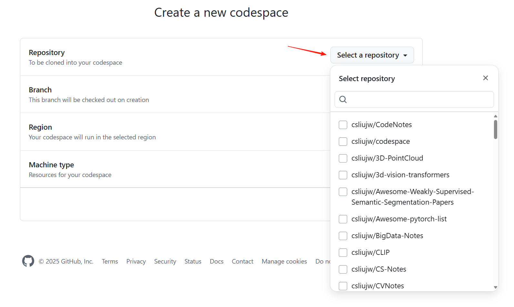
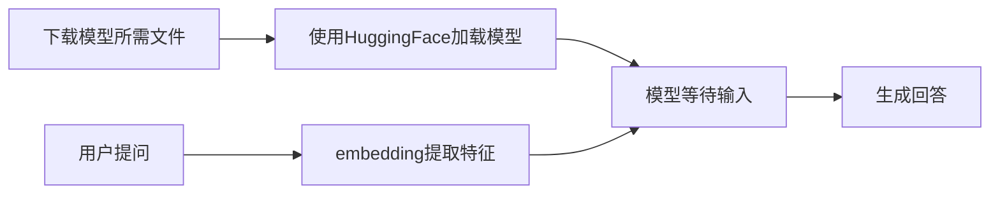
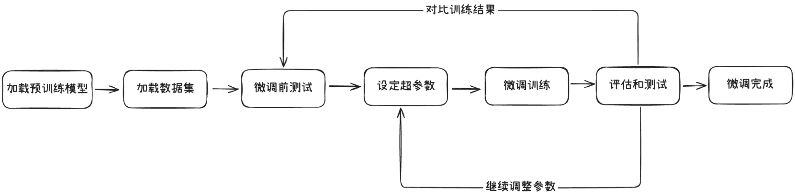
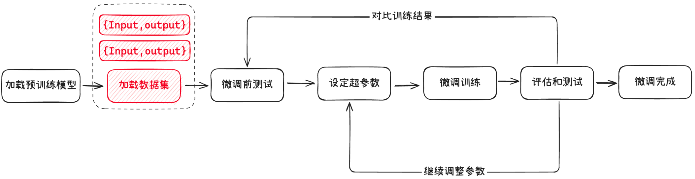

# HuggingFace

使用 HuggingFace 的必备库

FireCrawl 爬虫工具库

```shell
# 安装下载模型的工具 huggingface-cli
pip install -U huggingface_hub -i https://mirrors.tuna.tsinghua.edu.cn/pypi/web/simple

# 核心库 transfomers，用于加载模型，微调模型
pip install transformers -i https://mirrors.tuna.tsinghua.edu.cn/pypi/web/simple

# huggingface 生态下的高效增量微调库 peft
pip install peft -i https://mirrors.tuna.tsinghua.edu.cn/pypi/web/simple

# huggingface 生态下的加载数据集的库 datasets
pip install datasets -i https://mirrors.tuna.tsinghua.edu.cn/pypi/web/simple

# torch 相关的库（推理/训练要用到）
pip install torch==2.5.0 torchvision==0.20.0 torchaudio==2.5.0 --index-url https://download.pytorch.org/whl/cu118

# 加速库
# Using `low_cpu_mem_usage=True` or a `device_map` requires Accelerate: `pip install 'accelerate>=0.26.0'`
pip install accelerate>=0.26.0 -i https://mirrors.tuna.tsinghua.edu.cn/pypi/web/simple
```

## 简介&配置

Hugging Face 是一家专注于自然语言处理和机器学习的公司，以其开源的 Transformers 库而闻名。该平台提供了丰富的预训练模型，支持多种语言任务，如文本生成、翻译和情感分析，是 AI 届的 github。改公司最核心的项目是 `Transformers`

> Transformers 提供 API 和工具，可轻松下载和训练最先进的预训练模型。使用预训练模型可以降低计算成本，并节省从头开始训练模型所需的时间和资源。这些模型支持不同模式的常见任务：

- <b>自然语言处理：</b>文本分类、命名实体识别、问答、语言建模、摘要、翻译、多项选择和文本生成。
- <b>计算机视觉：</b>图像分类、对象检测和分割。
- <b>音频：</b>自动语音识别和音频分类。
- <b>多模态：</b>表格问答、光学字符识别、扫描文档信息提取、视频分类和视觉问答。

此外，Hugging Face 官方还提供免费的课程，如何利用社区生态来进行 NLP 的学习。

> HuggingFace 的模型需要使用魔法才可以流程下载，否则容易出现连接超时。建议设置国内镜像。

Linux 中通过编辑 ~/.bashrc 变量设置国内镜像

```shell
# 配置环境变量
vim ~/.bashrc
 
# 在打开文件中的最后一行添加
export HF_ENDPOINT="https://hf-mirror.com"
 
# 使得更改生效
source ~/.bashrc
```

Windows 中通过添加环境变量设置国内镜像

```shell
HF_ENDPOINT 
https://hf-mirror.com
```

在 conda / pip 等环境中安装 huggingface

```shell
pip install -U huggingface_hub -i https://mirrors.tuna.tsinghua.edu.cn/pypi/web/simple
```

然后就可以在这个环境里使用 huggingface-cli 命令下载对应的模型了。下载模型的语法如下：

```shell
huggingface-cli download --resume-download {huggingface官网上的模型ID} --local-dir {想要下载到的目录}
huggingface-cli download --resume-download Qwen/Qwen2.5-0.5B-Instruct --local-dir ./Qwen2.5-0.5B-Instruct
```

模型 ID 直接在网页上复制即可，比如，我想下载  Llama3-8B-Chinese-Chat

<div align="center"></div>

复制后，可以得到 ID `shenzhi-wang/Llama3-8B-Chinese-Chat`，使用 huggingface-cli 下载

```shell
huggingface-cli download --resume-download shenzhi-wang/Llama3-8B-Chinese-Chat --local-dir /home/Payphone/dir
```

下载完成后，我们观察 /home/Payphone/dir 目录会发现目录里包含了 Files and Versions 中所有的文件 (PS： Files and Versions 里包含了模型文件和模型的版本管理。我们如果想要使用模型，需要把里面所有的文件都下载过来 )

## CodeSpace

GitHub Codespace 通过 GitHub 原生的完全配置、安全的云开发环境，可以更快地启动和写代码，它提供了一系列模板，我们在跑机器学习深度学习相关的实验的时候，可以选择它的 Jupyter NoteBook 模板。

- [Create new codespace](https://github.com/codespaces/new?skip_quickstart=true&geo=SoutheastAsia)
- 根据已有的 github 仓库创建一个 Code Space 空间

<div align="center"></div>

## 模型推理

> LLM 的推理比较简单，我们来理一下它的流程。



从上面的流程图我们可以看到，我们需要做两大步骤：

- 利用框架将模型跑起来（HuggingFace / ModelScope）
- 准备好问题，利用 embedding 模型提取词向量特征

做好后将准备好的词向量模型送入模型，等待其生成回答即可。

> 明白了 LLM 部署的流程，那我们应该怎么加载模型，怎么对问题做特征提取，有需要怎么组织数据输入给模型呢？

### 通过 transformers 库推理

```shell
# 安装必备库
pip install transformers -i https://mirrors.tuna.tsinghua.edu.cn/pypi/web/simple

# torch 相关的库
pip install torch==2.5.0 torchvision==0.20.0 torchaudio==2.5.0 --index-url https://download.pytorch.org/whl/cu118

# 加速库
# Using `low_cpu_mem_usage=True` or a `device_map` requires Accelerate: `pip install 'accelerate>=0.26.0'`
pip install accelerate>=0.26.0 -i https://mirrors.tuna.tsinghua.edu.cn/pypi/web/simple
```

HuggingFace 中模型 modelcard 页面中有一个 use this model，点击它可以看到基本的使用方式。

> 使用高层级的 API 推理模型

```python
# Use a pipeline as a high-level helper
from transformers import pipeline
import torch
messages = [
    {"role": "user", "content": "你是谁"},
]
pipe = pipeline("text-generation", model="Qwen2.5-0.5B-Instruct", torch_dtype=torch.float16)
print(pipe(messages))
```

输出结果

```json
[{'generated_text': [{'role': 'user', 'content': '你是谁'}, {'role': 'assistant', 'content': '我是阿里云开发的一种超大规模语言模型，我叫通义千问。我是由阿里'}]}]
```

> 直接加载模型-推理

```python
# Load model directly
from transformers import AutoTokenizer, AutoModelForCausalLM

tokenizer = AutoTokenizer.from_pretrained("Qwen/Qwen2.5-0.5B")
model = AutoModelForCausalLM.from_pretrained("Qwen/Qwen2.5-0.5B")
```

对于这种方式， use this model 里并未给出完整的推理代码。查阅 Transformers 文档发现完整的推理代码如下（暂不考虑量化）：

```python
# https://huggingface.co/docs/transformers/model_doc/qwen2

from transformers import AutoModelForCausalLM, AutoTokenizer, AutoConfig
import torch

device = "cuda:0" # the device to load the model onto

config = AutoConfig.from_pretrained("Qwen2.5-0.5B-Instruct")
config.attention_window = None  # 禁用滑动窗口

model = AutoModelForCausalLM.from_pretrained("Qwen2.5-0.5B-Instruct",   # 模型文件的路径
                                             config=config,
                                             device_map="auto",         # gpu 的使用方式
                                             torch_dtype=torch.float16, # 使用 fp16 加载模型，减少显存使用
                                             trust_remote_code=True)    # 加载自定义模型代码)

tokenizer = AutoTokenizer.from_pretrained("Qwen2.5-0.5B-Instruct")

prompt = "你是谁."

messages = [{"role": "user", "content": prompt}]

text = tokenizer.apply_chat_template(messages, tokenize=False, add_generation_prompt=True)

model_inputs = tokenizer([text], return_tensors="pt").to(device)

generated_ids = model.generate(model_inputs.input_ids, max_new_tokens=512, do_sample=True)

generated_ids = [output_ids[len(input_ids):] for input_ids, output_ids in zip(model_inputs.input_ids, generated_ids)]

response = tokenizer.batch_decode(generated_ids, skip_special_tokens=True)[0]
print(response)
```

### 根据Readme提示进行推理

首先，我们要确定使用什么 LLM；然后去 github 看他的开源代码，一般开源代码中会告诉我们如何部署。以 Qwen2.5 为例，官方提供了 huggingface、modelscope、ollama、vllm、llama.cpp 的推理/部署方式。

[Qwen2.5 官方部署教程](https://github.com/QwenLM/Qwen2.5)

### Qwen系列的推理

阿里 Qwen 系列部署的文档写的很细致，直接看文档就可以了。

[Qwen](https://qwen.readthedocs.io/en/latest/)

# ModelScope

ModelScope 可以认为是国内版的 HuggingFace，其用法与 HuggingFace 类似。我们先安装 ModelScope 必备的环境，安装了必备环境我们才能用它下载模型、数据集、微调模型。

> pip 安装

ModelScope Library 由核心 hub 支持，框架，以及不同领域模型的对接组件组成。根据您实际使用的场景，可以选择不同的安装选项。如果只需要通过 ModelScope SDK，或者 ModelScope 命令行工具来[下载模型](https://www.modelscope.cn/docs/models/download)，可以只最轻量化的安装 ModelScope 的核心 hub 支持：

```shell
pip install modelscope
```

如果需要更完整的使用 ModelScope 平台上的一系列框架能力，包括**数据集的加载**，外部模型的使用等，则推荐使用 "framework" 的安装选项，也就是：

```shell
pip install modelscope[framework]
```

安装好后，我们使用 ModelScope 来下载 Qwen/Qwen2.5-0.5B-Instruct 模型。

```shell
# 下载整个模型到指定目录
modelscope download --model 'Qwen/Qwen2.5-0.5B-Instruct'  --local_dir './'

# 下载单个文件
modelscope download --model 'Qwen/Qwen2.5-0.5B-Instruct' tokenizer.json
    
# 下载多个    
modelscope download --model 'Qwen/Qwen2.5-0.5B-Instruct' tokenizer.json config.json
modelscope download --model 'Qwen/Qwen2.5-0.5B-Instruct' --include '*.safetensors'

# 过滤指定文件
modelscope download --model 'Qwen/Qwen2.5-0.5B-Instruct' --exclude '*.safetensors'
```

更多内容可以参考官方文档 [模型的下载 · 文档中心](https://www.modelscope.cn/docs/models/download)

# 模型微调

大模型的微调代码其实很简单，微调的工具非常成熟了。

> <b>何时需要微调？</b>

我们平常接触到的大模型如 Qwen、DeepSeek 都是基于海量的通用数据训练的，这些大模型具备非常强大的语言理解和生成能力，能够处理多种自然语言任务。但是，它们在某些特定领域或任务上的表现可能并不理想，这种时候可能就需要进行微调了。

- 领域专业化，让模型掌握行业知识
- 调整模型的语言风格
- 提示模型在个别方面的能力

## 知识库&微调

现在各大模型都支持超长上下文，从最开始的 4K 到现在的 200K，上面的有些问题我们是可以用一个比较完善的提示词来解的，有些问题可以通过搭建一个全面的知识库来解决。我们可以先尝试搭建知识库看能否解决上述问题，如果知识库的效果不理想，这时候可以尝试微调模型。

### <b>知识库</b>

我们可以将知识库理解成开卷考试。我们带了一堆资料进去，考试的时候，根据问题去查找对应的信息，然后结合这些信息来回答问题。模型回答的质量受知识库（查找到的相关信息）和模型本身能力的影响。

<b>优点</b>

- 灵活性高：可以随时更新知识库中的内容，让模型获取最新的信息。
- 扩展性强：不需要重新训练模型，只需要更新知识库，就能让模型回答新的问题。

<b>缺点</b>

- 依赖检索：如果知识库中的信息不准确或不完整，模型的回答也会受影响。
- 实时性要求高：需要快速检索和整合知识库中的信息，对性能有一定要求。

<b>适用场景</b>

- 智能客服：快速查找解决方案，回答用户的问题。
- 问答系统：结合知识库回答复杂的、需要背景知识的问题。
- 研究辅助：帮助研究人员快速查找相关文献或数据。

现有大模型的联网搜索其实就是一种在线知识库，通过搜索引擎找到相关的文档，然后阅读文档，根据文档内容进行回复。

### <b>微调</b>

微调可以理解为，我们在考试之前参加了一个课外辅导班，专门学习了考试相关的知识和技巧。这个辅导班帮你复习了重点内容，还教你如何更好地答题。

微调就是让模型提前学习一些特定的知识，比如某个领域的专业术语或者特定任务的技巧，这样它在考试(也就是实际任务)中就能表现得更好。比如，你让模型学习了医学知识，那么它在回答医学相关的问题时就能更准确。

<b>优点</b>

- 性能提升：显著提升模型在特定任务或领域的表现。
- 定制化强：可以根据需求调整模型的行为，比如改变回答风格或优化任务性能。

<b>缺点</b>

- 需要标注数据：需要准备特定领域的标注数据，这可能需要时间和精力。
- 硬件要求高：微调需要一定的计算资源，尤其是 GPU。

<b>适用场景</b>

- 专业领域：如医疗、法律、金融等，让模型理解专业术语和逻辑。
- 特定任务：如文本分类、情感分析等，优化模型的性能。
- 风格定制：让模型生成符合某种风格的内容，比如幽默、正式或古风。

### 对比

| **维度**           | **模型微调**                             | **知识库（如RAG）**                              |
| ------------------ | ---------------------------------------- | ------------------------------------------------ |
| **知识更新成本**   | 需重新训练模型（高成本，需计算资源）     | 修改知识库内容即可（低成本，实时更新）           |
| **专业准确性**     | 依赖训练数据质量（可能有幻觉风险）       | 依赖知识库内容质量（可保证100%保真）             |
| **推理能力**       | 支持复杂推理（如多步骤逻辑、隐含关系）   | 仅能复现已有知识，无法推理未明确记录的内容       |
| **硬件与资源需求** | 需GPU算力（如7B模型需24GB显存）          | 仅需存储和检索系统（低资源需求）                 |
| **长尾问题处理**   | 可通过泛化能力尝试回答未见过的问题       | 无法回答知识库未收录的内容                       |
| **适用场景**       | 需深度领域适配、复杂任务、数据安全的场景 | 需快速检索、严格准确、高频更新或低计算资源的场景 |

<b>优先选择模型微调的场景</b>

- 需求：需要模型具备复杂推理能力或深度领域适配。
- 特点：
  - 领域知识需内化到模型中（如医疗诊断、法律逻辑推理）。
  - 需要处理未明确记录的长尾问题（如生成个性化方案）。
  - 数据安全要求高（如银行内部数据训练）。
- 示例：
  - 医疗领域：微调模型理解医学术语（如ICD-10编码），用于电子病历分析。
  - 金融领域：基于内部风险数据微调模型，识别合同中的违规行为（如SEC文件分析）。

<b>优先选择知识库的场景</b>

- 需求：需要快速检索、严格准确或高频更新的知识。
- 特点：
  - 知识需严格遵循既定内容（如法律条款、药品说明书）。
  - 内容更新频繁（如实时股价、政策变动）。
  - 资源有限或缺乏标注数据（如中小企业文档管理）。
- 示例：
  - 企业内部知识库：员工查询公司政策、操作手册，确保答案与官方文档一致。
  - 法律咨询：根据用户问题检索法律条文，避免模型生成错误解释。
  - 智能客服：快速匹配常见问题的标准答案，提升响应速度。

## 微调入门

#### 微调介绍

>- 选定一款用于微调的预训练模型，并加载
>- 准备好用于模型微调的数据集，并加载
>- 准备一些问题（验证集），对微调前的模型进行测试(用于后续对比)
>- 设定模型微调需要的超参数
>- 执行模型微调训练
>- 使用验证集，对微调后的模型进行测试，并对比效果
>- 如果效果不满意，继续调整前面的数据集以及各种超参数，直到达到满意效果
>- 得到微调好的模型

<div align="center"></div>

> <b>模型选择</b>

一般选择小模型进行微调。推荐微调 Qwen 系列的模型，Qwen 系列模型的结构设计可以说是一种模型里最佳的。

> <b>获取数据集</b>

数据集就是我们用于模型微调的数据，就像是“补课”时用的教材，它包含了特定领域的知识和任务要求。这些数据需要经过标注和整理，以便模型能够学习到特定领域的模式和规律。比如，如果我们想让模型学会看病，就需要准备一些标注好的医学知识作为数据集。

<div align="center"></div>

⼀般情况下，用于模型训练的数据集是没有对格式强要求的，但是最常用的还是这些结构化格式的数据：JSON、JSONL。一般和我们日常与 AI 的对话类似，都会包括输入、输出。下面是⼀个最简单的数据集。

```json
[
    {
        "input":"你好",
        "outout":"你好，我是xxx，有什么可以帮助你的吗？"
    },
    {
        "input":"你好呀",
        "outout":"你好，我是你的小助手，有什么可以帮助你的吗？"
    }
]
```

为了模型的训练效果，有时候我们也会为数据集添加更丰富的上下文，比如在下面的数据集中，以消息 (messages) 进行组织，增加了 System (系统消息，类似于角色设定)，user (用户消息) assistant (助手回复消息) 的定义，这样就可以支持存放多轮对话的数据，这也是 OPENAI 官方推荐的数据集格式：

```json
[
    {
        "messages": [
            {
				"role": "system", 
        		"content": "你是一位专业的客服助手，回答简洁专业，语气友好。如果不确定答案，诚实承认并提供可能的解决方向。"
            },
            {
                "role": "user",
                "content": "你好呀"
            },
            {
                "role": "assistant",
                "content": "你好，我是你的专属客服助手，有什么需要帮助的吗?"
            },
            {
                "role": "user",
                "content": "你可以做什么呢？"
            },
            {
				"role": "assistant",
                "content": "我可以回答常见的问题哦~"
            }
]
# 后续对话会受到系统消息的引导
```

我们可以去 huggingface / modelscope / GitCode 上找公开的数据集训练模型。建议去 modelscope / GitCode 上找，这里面的中文数据集比较多。

很多平台提供了在线微调的功能，这些平台一般是推荐将数据组织成 JSONL 格式。 JSONL 文件 (JSON Lines) 是一种特殊的 JSON 格式，每一行是一个独立的 JSON 对象JSONL 文件是“扁平化”的，彼此之间没有嵌套关系

> JSONL 数据的格式要求如下：

```json
{"messages": [ { "role": "system", "content": "你是一位专业的客服助手。"},{ "role": "user", "content": "你好呀" },{ "role": "assistant", "content": "你好，有什么需要帮助的吗?"}}
{"messages": [ { "role": "system", "content": "你是一位专业的客服助手。"},{ "role": "user", "content": "你好呀" },{ "role": "assistant", "content": "你好，有什么需要帮助的吗?"}}
{"messages": [ { "role": "system", "content": "你是一位专业的客服助手。"},{ "role": "user", "content": "你好呀" },{ "role": "assistant", "content": "你好，有什么需要帮助的吗?"}}
```

- 每行都是一个独立的 JSON 对象
- 每个对象必须包含键名为 messages 的数组，数组不能为空;
- messages 中每个元素必须包含 role 和 content 两个字段
- role 只能是 system、user 或 assistant 
- 如果有 system 角色消息，必须在数组首位
- 第一条非 system 消息必须是 user 角色;
- user 和 assistant 角色的消息应当交替、成对出现，不少于 1 对

<b>设置微调的超参数</b>

与其他普通深度学习模型一致。

#### 微调的方式

[DeepSeek-R1微调三种方法（DeepSeek-R1-Distill-Qwen-7B） - 知乎](https://zhuanlan.zhihu.com/p/21587866352)

  > <b>根据参数量进行划分</b>

  - 全量微调：对模型的所有参数进行更新，使其适应特定任务。能够充分利用模型的全部能力，但是需要大量的计算资源和时间。极有可能导致模型的通用能力极大地退化。
  - 部分微调：仅更新模型的部分参数，冻结模型的大部分层，只微调最后几层或特定模块。
  - 参数高效微调（PEFT）：在预训练模型中添加少量可训练的参数或模块，仅训练这些新增的参数，减少资源消耗，提高效率。最典型的高效微调方式就是 LoRA 和 QLoRA。

  > <b>按训练目标划分的微调方式</b>

| **类型**                    | **核心思想**                                                 | **适用场景**                   |
| --------------------------- | ------------------------------------------------------------ | ------------------------------ |
| 监督微调（SFT）             | 基于标注数据直接优化模型，提升模型在特定任务上的性能         | 1k+ 的高质量的对话数据         |
| 强化学习微调（RLFT）        | 如果智能客服的应用场景涉及到与用户的复杂交互，并希望通过用户反馈持续改进服务质量（例如，根据用户满意度调整回复），则可以考虑采用这种方法。 | 需对齐人类价值观（如对话生成） |
| 提示词微调（Prompt Tuning） | 设计有效的提示模板，通过少量样本优化这些提示，使其能够引导模型给出正确的答复。 | 已有预训练的语言模型表现良好   |

监督微调和提示词微调是比较合适的微调方式，实现相对简单，易于管理和评估。强化学习微调实现复杂度较高，需要设计合适的奖励机制和环境设置，通常不作为首选方案，除非有明确的需求和足够的资源来支持这种复杂的微调策略。

> <b>监督微调 - SFT</b>

监督微调我们根据对话可以分成单论对话微调和多轮对话微调。

- 单轮对话微调更适合于任务明确、交互简短的应用场景，重点在于提高模型对单一问题的理解和回答能力。
- 多轮对话微调则更适合于需要维护对话历史、理解和回应基于上下文信息的复杂交互，其挑战在于如何有效地管理和利用对话历史来维持对话的连贯性和准确性。

LIMA: Less Is More for Alignment[1] 指出，LLM 在预训练阶段就已经学习到了大部分的能力，该论文进行了相关实验，发现**1000条的高质量对话数据**就可以让模型在 SFT 阶段学习得很好。

因此，我们可以通过对大量的 SFT 数据进行**质量筛选**，选择出少量高质量的部分用于微调。一方面既有效利用了这些 SFT 数据集，另一方面又减少了微调数据量，降低了微调成本。

> <b>如何生成高质量的 STF 数据集？</b>

- 使用开源的公共数据集。
- 设计良好的提示词，利用更大的 LLM 生成高质量的数据集，然后人工进行筛选和纠错。
- 构建 RAG 系统，让 LLM 根据 RAG 提供的知识生成数据集。
- 数据增强：同义词替换，利用不同的方式进行提问。

> <b>利用 QwQ 生成高质量的数据</b>

```python
# 编码....
```

## 微调工具

> <b>市面上有很多微调工具</b>
>
>   - LLaMA-Factory，支持海量模型和各种主流微调方法，包括 LoRA。它提供了运行脚本微调和基于 Web 端微调的能力，自带基础训练数据集，并支持增量预训练和全量微调。
>   - Hugging Face 的 PEFT 和 Transformers，支持 LoRA、AdaLoRA 等。
>   - XTuner，支持在几乎所有 GPU 上对 LLM 和 VLM 进行预训练和微调，包括在 8GB GPU 上微调 7B 模型。它支持多种模型（如 InternLM、Llama2、ChatGLM、Qwen、Baichuan 等）和训练算法（如 QLoRA、LoRA、全参数微调），并提供从微调到部署、评测的完整工具链。
>   - <span style="color:red">Unsloth</span>，它可以将微调速度提升 2 倍，内存占用减少 80%，支持多种主流 LLM，如 Llama 3.1、Mistral、Phi-3.5 和 Gemma 等。Unsloth 提供完整的 Colab 教程，支持 Hugging Face 生态，适合 AI 开发者、学术研究者、企业技术团队和学生爱好者使用。

### HuggingFace 微调

> <b>安装必备库</b>

  ```shell
# 安装下载模型的工具 huggingface-cli
pip install -U huggingface_hub -i https://mirrors.tuna.tsinghua.edu.cn/pypi/web/simple

# 核心库 transfomers，用于加载模型，微调模型
pip install transformers -i https://mirrors.tuna.tsinghua.edu.cn/pypi/web/simple

# huggingface 生态下的高效增量微调库 peft
pip install peft -i https://mirrors.tuna.tsinghua.edu.cn/pypi/web/simple

# huggingface 生态下的加载数据集的库 datasets
pip install datasets -i https://mirrors.tuna.tsinghua.edu.cn/pypi/web/simple

# torch 相关的库（推理/训练要用到）
pip install torch==2.5.0 torchvision==0.20.0 torchaudio==2.5.0 --index-url https://download.pytorch.org/whl/cu118

# 加速库
# Using `low_cpu_mem_usage=True` or a `device_map` requires Accelerate: `pip install 'accelerate>=0.26.0'`
pip install accelerate>=0.26.0 -i https://mirrors.tuna.tsinghua.edu.cn/pypi/web/simple
  ```

  > <b>全量微调代码</b>

  ```shell
from transformers import AutoTokenizer, AutoModelForCausalLM, Trainer, TrainingArguments
from datasets import load_dataset

# 加载预训练模型和分词器
model_name = "Qwen/Qwen-0.5B"  # 确保这是正确的模型名称或路径
tokenizer = AutoTokenizer.from_pretrained(model_name)
model = AutoModelForCausalLM.from_pretrained(model_name)

# 假设你的数据集已经在Hugging Face Datasets库中或者你可以通过load_dataset加载
dataset = load_dataset("your_dataset_name")  # 替换为你的实际数据集名称

# 数据预处理
def preprocess_function(examples):
    return tokenizer(examples['text'], padding="max_length", truncation=True, max_length=128)  # 根据实际情况调整参数

encoded_dataset = dataset.map(preprocess_function, batched=True)

# 设置训练参数
training_args = TrainingArguments(
    output_dir="./results",
    evaluation_strategy="epoch",
    learning_rate=2e-5,
    per_device_train_batch_size=8,
    per_device_eval_batch_size=8,
    num_train_epochs=3,
    weight_decay=0.01,
)

# 创建Trainer实例
trainer = Trainer(
    model=model,
    args=training_args,
    train_dataset=encoded_dataset["train"],
    eval_dataset=encoded_dataset["test"],  # 如果有测试集的话
)

# 开始训练
trainer.train()

# 训练完成后保存模型
model.save_pretrained("./humorous_model")
tokenizer.save_pretrained("./humorous_model")
  ```

  > 增量微调代码

  增量微调（LoRA、QLoRA）需要安装 PEFT 库

  ```shell
pip install peft
  ```

  增量微调代码如下

  ```shell
from transformers import AutoTokenizer, AutoModelForCausalLM, Trainer, TrainingArguments
from peft import get_peft_model, LoraConfig, prepare_model_for_int8_training
from datasets import load_dataset

# 加载预训练模型和分词器
model_name = "Qwen/Qwen-0.5B"  # 确保这是正确的模型名称或路径
tokenizer = AutoTokenizer.from_pretrained(model_name)
model = AutoModelForCausalLM.from_pretrained(model_name)

# 准备模型以适应int8训练（如果适用）
model = prepare_model_for_int8_training(model)

# 设置LoRA配置
lora_config = LoraConfig(
    r=16,  # LoRA attention dimension
    lora_alpha=32,  # Alpha parameter for LoRA scaling
    target_modules=["q_proj", "v_proj"],  # 目标模块名称可能需要根据具体模型调整
    lora_dropout=0.05,  # Dropout概率
    bias="none",  # 'none', 'all' or 'lora_only'
    task_type="CAUSAL_LM",  # 指定任务类型
)

# 使用LoRA配置创建微调模型
model = get_peft_model(model, lora_config)

# 假设你的数据集已经在Hugging Face Datasets库中或者你可以通过load_dataset加载
dataset = load_dataset("your_dataset_name")  # 替换为你的实际数据集名称

# 数据预处理
def preprocess_function(examples):
    return tokenizer(examples['text'], padding="max_length", truncation=True, max_length=128)  # 根据实际情况调整参数

encoded_dataset = dataset.map(preprocess_function, batched=True)

# 设置训练参数
training_args = TrainingArguments(
    output_dir="./results",
    evaluation_strategy="epoch",
    learning_rate=2e-5,
    per_device_train_batch_size=8,
    per_device_eval_batch_size=8,
    num_train_epochs=3,
    weight_decay=0.01,
)

# 创建Trainer实例
trainer = Trainer(
    model=model,
    args=training_args,
    train_dataset=encoded_dataset["train"],
    eval_dataset=encoded_dataset["test"],  # 如果有测试集的话
)

# 开始训练
trainer.train()

# 训练完成后保存模型
model.save_pretrained("./humorous_model_lora")
tokenizer.save_pretrained("./humorous_model_lora")
  ```

### <b>Unsloth 微调实战</b>

#### Unsloth 简介

> <b>Unsloth 是一个开源工具，专门用来加速大语言模型 (LLM) 的微调过程。</b>
>
> - 高效微调：Unsloth 的微调速度比传统方法快 2-5 倍，内存占用减少 50%-80%。这意味着你可以用更少的资源完成微调任务。
> - 低显存需求：即使是消费级 GPU (如 RTX3090)，也能轻松运行 Unsloth。例如，仅需 3.5GB 显存就可以微调 3B 参数模型（4-bit 量化 + LoRA 微调）。[Unsloth Requirements | Unsloth Documentation](https://docs.unsloth.ai/get-started/beginner-start-here/unsloth-requirements)
> - 支持多种模型和量化：Unsloth 支持 Llama、Mistral、Phi、Gemma等主流模型，并且通过动态4-bit 量化技术，显著降低显存占用，同时几乎不损失型精度。
> - 开源与免费：Unsloth 提供免费的 Colab Notebook，用户只需添加数据集并运行代码即可完成微调。

> <b>Unsloth 官方文档</b>
>
> - [Unsloth AI - Open Source Fine-Tuning for LLMs](https://unsloth.ai/)
> - [Welcome | Unsloth Documentation](https://docs.unsloth.ai/)
> - [Unsloth Notebooks | Unsloth Documentation](https://docs.unsloth.ai/get-started/unsloth-notebooks)

> <b>如果我们本地没有 GPU，可以使用 Google 的 Colab。Colab 是一个基于云端的编程环境，由 Google 提供。</b>
>
> - 免费的 GPU 资源：Colab 提供免费的 GPU，适合进行模型微调。虽然免费资源有一定时间限制，但对于大多数微调任务来说已经足够。
> - 易于上手：Colab 提供了一个基于网页的 Jupyter Notebook环境，用户无需安装任何软件，直接在浏览器中操作。
> - 丰富的社区支持：Unsloth 在 Colab 上提供了许多现成的代码示例和教程，可以帮助新手快速入门。
>
> <b>简而言之，Colab 上的算力资源足够我们学习微调模型了。</b>

<b>使用 unsloth 微调算命大师。</b>在开始微调之前，先用一个算命相关的问题来测试一下模型的能力，方便在训练完后进行对比。

[Qwen2.5_(7B) -- Colab, 2025-04-05 Colab 安装的环境有问题，建议直接在本地微调 1.5B 的模型](https://colab.research.google.com/github/unslothai/notebooks/blob/main/nb/Qwen2.5_(7B)-Alpaca.ipynb)

> <b>安装环境</b>

```shell
# 安装环境
pip install unsloth
# 会自动安装 torch、huggingface、bitsandbytes、unsloth_zoo
# bitsandbytes 是一个用于量化和优化模型的库，可以帮助减少模型占用的内存。
# unsloth_z00 可能包含了一些预训练模型或其他工具，方便我们使用。
```

#### 微调代码详解

1️⃣加载预训练模型

```python
from unsloth import FastLanguageModel # FastLanguageModel 用于加载和使用模型
import torch

max_seq_length = 2048 # 可以填任意值，自动支持 RoPE Scaling，支持处理任意长度的输入序列，即使输入比训练时的序列更长或更短。
dtype = None # 模型权重的数据类型. None for auto detection. Float16 for Tesla T4, V100, Bfloat16 for Ampere+
load_in_4bit = True # 启用 4-bit 量化，可以有效减少显存，且训练速度更快

# https://huggingface.co/unsloth unsloth 支持的微调模型的种类

model, tokenizer = FastLanguageModel.from_pretrained(
    model_name = "unsloth/DeepSeek-R1-Distill-Qwen-1.5B", # 加载 Qwen2.5-1.5B
    max_seq_length = max_seq_length,
    dtype = dtype,
    load_in_4bit = load_in_4bit, # 4bit量化加载模型
    # token = "hf_...", # use one if using gated models like meta-llama/Llama-2-7b-hf
)
```

2️⃣微调前测试模型性能

```python
prompt_style = """以下是描述任务的指令，以及提供进一步上下文的输入。请写出一个适当完成请求的回答。在回答之前，请仔细思考问题，并创建一个逻辑连贯的思考过程，以确保回答准确无误。
### 指令:
你是一位精通卜卦、星象和运势预测的算命大师。
请回答以下算命问题。
### 问题:
{}
### 回答:
<think>{}"""

question ="1996年闰四月初二已时生人，男，想了解事业运势"

model, tokenizer = FastLanguageModel.from_pretrained(
    model_name = "unsloth/DeepSeek-R1-Distill-Qwen-1.5B", # 加载 Qwen2.5-1.5B
    max_seq_length = max_seq_length,
    dtype = dtype,
    load_in_4bit = load_in_4bit, # 4bit量化加载模型
    # token = "hf_...", # use one if using gated models like meta-llama/Llama-2-7b-hf
)

def test_model_ab(question):
    FastLanguageModel.for_inference(model)

    inputs = tokenizer( [prompt_style.format(question,"")], return_tensors="pt").to("cuda")
    outputs = model.generate(input_ids=inputs.input_ids, attention_mask=inputs.attention_mask, max_new_tokens=2048, use_cache=True)
    #使用模型生成回答
    response = tokenizer.batch_decode(outputs)# 解码模型生成的输出为可读文本
    print(response[0])# 打印生成的回答部分

test_model_ab(question)
```

```md
<｜begin▁of▁sentence｜>...
### 指令:
...
### 问题:
1996年闰四月初二已时生人，男，想了解事业运势
### 回答:
<think>
...省略
</think>

### 事业运势分析

#### 1. **年龄与职业背景**
- **年龄**：1996年，年轻且可能处于职业生涯初期。
- **性别**：男性，可能在职业生涯早期或处于某个特定阶段。
- **生日**：四月初二（1996年4月2日），这是一个具体的出生日期，可能对事业运势有一定影响。

#### 2. **职业发展阶段**
- **早期阶段**：1996年可能是一个职业发展的关键点，但具体职业阶段需要根据个人经历和数据来确定。
- **关键点**：可能涉及职业转型、技术学习、项目完成或重大突破等关键点。
- **成功与失败**：需要分析可能遇到的挑战和成功因素，可能包括领导力、团队合作、职业规划等。

#### 3. **个人经历与影响**
- **遗传因素**：可能受到父母的教育和遗传因素的影响。
- **环境因素**：工作环境、职业结构、公司文化等对事业运势的影响。
- **心理因素**：个人的健康状况、工作态度、压力等可能影响事业运势。

#### 4. **职业规划建议**
- **明确目标**：制定清晰的职业规划，明确目标和方向。
- **持续学习**：在工作中持续学习新技能、提升能力。
- **团队合作**：增强与团队的沟通和合作能力。
- **保持积极心态**：保持积极心态，面对挑战和压力。

#### 5. **未来展望**
- **长期发展**：根据个人能力和职业规划，展望未来的职业发展方向。
- **持续进步**：持续努力，不断进步和提升。

### 总结
1996年已时生人，男，事业运势需要根据年龄、性别、生日、职业背景、个人经历和环境因素等多方面因素综合分析。建议明确目标、持续学习、增强团队合作和保持积极心态，为未来职业发展提供支持。<｜end▁of▁sentence｜>
```

3️⃣准备数据集

这里使用 HuggingFace 的 `Conard/fortune-telling` 数据集，数据集是 json 格式的

```json
[
  { "Question": "", "Response": "", "Complex_CoT": ""},
  { "Question": "", "Response": "", "Complex_CoT": ""},
]
```

定义一个用户格式化提示的多行字符串模板用于生成训练数据

```python
train_prompt_style = """以下是描述任务的指令，以及提供进一步上下文的输入。
请写出一个适当完成请求的回答。
在回答之前，请仔细思考问题，并创建一个逻辑连贯的思考过程，以确保回答准确无误。
### 指令:
你是一位精通卜卦、星象和运势预测的算命大师。请回答以下算命问题。
### 问题:
{}
### 回答:
<think>
{}
</think>
{}"""
```

加载本地下载好的 json 数据

```python
EOS_TOKEN = tokenizer.eos_token # 必须添加结束标记，用于指示文本已经结束

from datasets import load_dataset
# 加载指定的数据集。
# data_files 可以直接添 huggingface 的 ID Conard/fortune-telling，会自动下载
# dataset = load_dataset("Conard/fortune-telling", split = "train[:200]")
# 直接加载本地的 json 文件
dataset = load_dataset("json",data_files="/content/all_details.json", split = "train[:200]")
# 打印数据集中的列名，查看数据集中有那些字段
print(dataset.column_names)
```

定义函数，将 json 中的数据插入字符串模板，形成训练数据。

```python
def formatting_prompts_func(examples):
    # 从数据集中提取问题、思考过程、回答
    instructions = examples["Question"]
    cots       = examples["Complex_CoT"]
    outputs      = examples["Response"]
    texts = []	# 存储格式化后的文本
    for instruction, cot, output in zip(instructions, cots, outputs):
        # 使用字符串模板插入数据，并加上结束标记
        text = train_prompt_style.format(instruction, cot, output) + EOS_TOKEN
        texts.append(text)
    return { "text" : texts, } # 返回包含所有格式化文本的字典。

dataset = dataset.map(formatting_prompts_func, batched = True)
dataset['text'][0]
```

准备数据集的完整代码如下

```python
def get_dataset():
    train_prompt_style = """以下是描述任务的指令，以及提供进一步上下文的输入。请写出一个适当完成请求的回答。在回答之前，请仔细思考问题，并创建一个逻辑连贯的思考过程，以确保回答准确无误。
    ### 指令:
    你是一位精通卜卦、星象和运势预测的算命大师。请回答以下算命问题。
    ### 问题:
    {}
    ### 回答:
    <think>
    {}
    </think>
    {}"""

    EOS_TOKEN = tokenizer.eos_token # 必须添加结束标记，用于指示文本已经结束

    from datasets import load_dataset
    # 加载指定的数据集。
    # data_files 可以直接添 huggingface 的 ID Conard/fortune-telling，会自动下载
    # dataset = load_dataset("Conard/fortune-telling", split = "train[:200]")
    # 直接加载本地的 json 文件
    dataset = load_dataset("json",data_files="/content/all_details.json", split = "train[:200]")
    # 打印数据集中的列名，查看数据集中有那些字段
    print(dataset.column_names)

    def formatting_prompts_func(examples):
        # 从数据集中提取问题、思考过程、回答
        instructions = examples["Question"]
        cots         = examples["Complex_CoT"]
        outputs      = examples["Response"]
        texts = []	# 存储格式化后的文本
        for instruction, cot, output in zip(instructions, cots, outputs):
            # 使用字符串模板插入数据，并加上结束标记
            text = train_prompt_style.format(instruction, cot, output) + EOS_TOKEN
            texts.append(text)
        return { "text" : texts, } # 返回包含所有格式化文本的字典。

    dataset = dataset.map(formatting_prompts_func, batched = True)
    return dataset

data = get_dataset()
```

4️⃣定义微调模型

```python
model = FastLanguageModel.get_peft_model(
    model,
    r = 8, # 设置 LoRA 的秩，秩越大，可训练的参数越多
    # 指定模型中需要微调的关键模块
    target_modules = ["q_proj", "k_proj", "v_proj", "o_proj", 
                      "gate_proj", "up_proj", "down_proj",],
    lora_alpha = 16,	# 设置 LoRA 的超参数，影响可训练参数的训练方式
    lora_dropout = 0, # dropout 比例
    bias = "none",    # Supports any, but = "none" is optimized
    # [NEW] "unsloth" uses 30% less VRAM, fits 2x larger batch sizes!
    use_gradient_checkpointing = "unsloth", # True or "unsloth" for very long context
    random_state = 3407,
    use_rslora = False,  # We support rank stabilized LoRA
    loftq_config = None, # And LoftQ
)
```

5️⃣配置微调参数并训练

```python
from trl import SFTTrainer
from transformers import TrainingArguments
from unsloth import is_bfloat16_supported

train_args = TrainingArguments(
        per_device_train_batch_size = 2,	# 每个 gpu 上训练多少样本
        gradient_accumulation_steps = 4,	# 梯度累加次数，模拟大 batch
        warmup_steps = 10,
        # num_train_epochs = 1, # Set this for 1 full training run.
        max_steps = 200,
        learning_rate = 2e-4,
        fp16 = not is_bfloat16_supported(),
        bf16 = is_bfloat16_supported(),
        logging_steps = 1,
        optim = "adamw_8bit",
        weight_decay = 0.01,
        lr_scheduler_type = "linear",
        seed = 3407,
        output_dir = "outputs",
        report_to = "none", # Use this for WandB etc
    )

# 定义训练器
trainer = SFTTrainer(
    model = model,
    tokenizer = tokenizer,
    train_dataset = data,
    dataset_text_field = "text",
    max_seq_length = max_seq_length,
    dataset_num_proc = 1,
    packing = False, # Can make training 5x faster for short sequences.
    args = train_args,
)

# 开始训练
trainer_stats = trainer.train()
```

6️⃣保存模型参数

```python
# 这只会保存 LoRA adapters 这部分的参数
model.save_pretrained("./lora_model")  
tokenizer.save_pretrained("./lora_model")


# 保存合并好后的参数。可以加载运行，可以用 vllm 部署。
model.save_pretrained_merged("./full_loramodel", tokenizer, save_method = "merged_16bit",)
model.save_pretrained_merged("./full_loramodel2", tokenizer, save_method = "merged_4bit_forced",)
# model.push_to_hub_merged("hf/model", tokenizer, save_method = "merged_16bit", token = "") # 推送到 huggingface 上

# 保存为 GUUF 文件 (Ollama)
model.save_pretrained_gguf("model", tokenizer, quantization_method = "f16") # fp16
model.save_pretrained_gguf("model", tokenizer,) # q8
model.save_pretrained_gguf("model", tokenizer, quantization_method = "q4_k_m") # q4
model.push_to_hub_gguf("hf/model", tokenizer, quantization_method = "f16", token = "") # 推送到 huggingface 上
```

#### 完整的微调代码

```python
from unsloth import FastLanguageModel
from datasets import load_dataset
from trl import SFTTrainer
from transformers import TrainingArguments
from unsloth import is_bfloat16_supported

max_seq_length = 2048 
dtype = None 
load_in_4bit = True

prompt_style = """以下是描述任务的指令，以及提供进一步上下文的输入。请写出一个适当完成请求的回答。在回答之前，请仔细思考问题，并创建一个逻辑连贯的思考过程，以确保回答准确无误。
### 指令:
你是一位精通卜卦、星象和运势预测的算命大师。请回答以下算命问题。
### 问题:
{}
### 回答:
<think>
{}
</think>
{}"""

question ="1996年闰四月初二已时生人，男，想了解事业运势"

model, tokenizer = FastLanguageModel.from_pretrained(
    model_name = "unsloth/DeepSeek-R1-Distill-Qwen-1.5B", # 加载 Qwen2.5-1.5B
    max_seq_length = max_seq_length,
    dtype = dtype,
    load_in_4bit = load_in_4bit,) # 4bit量化加载模型


def get_dataset():
    EOS_TOKEN = tokenizer.eos_token # 必须添加结束标记，用于指示文本已经结束
    dataset = load_dataset("Conard/fortune-telling", split = "train[:200]")
    # dataset = load_dataset("json",data_files="/content/all_details.json", split = "train[:200]")

    def formatting_prompts_func(examples):
        # 从数据集中提取问题、思考过程、回答
        instructions = examples["Question"]
        cots         = examples["Complex_CoT"]
        outputs      = examples["Response"]
        texts = []	# 存储格式化后的文本
        for instruction, cot, output in zip(instructions, cots, outputs):
            text = prompt_style.format(instruction, cot, output) + EOS_TOKEN # 拼接成模型需要的文本数据
            texts.append(text)
        return { "text" : texts, } 
    
    dataset = dataset.map(formatting_prompts_func, batched = True)
    return dataset

data = get_dataset()
# 移除了多余的默认参数
model = FastLanguageModel.get_peft_model(model, r=8, random_state = 3407,)
# 定义训练参数配置
train_args = TrainingArguments(
        per_device_train_batch_size = 2,
        gradient_accumulation_steps = 4,
        warmup_steps = 10,
        max_steps = 200,
        learning_rate = 2e-4,
        fp16 = not is_bfloat16_supported(),
        bf16 = is_bfloat16_supported(),
        logging_steps = 1,
        optim = "adamw_8bit",
        weight_decay = 0.01,
        lr_scheduler_type = "linear",
        seed = 3407,
        output_dir = "outputs",
        report_to = "none",)

trainer = SFTTrainer(
    model = model,
    tokenizer = tokenizer,
    train_dataset = data,
    dataset_text_field = "text",
    max_seq_length = max_seq_length,
    dataset_num_proc = 1,
    packing = False, 
    args = train_args,
)

trainer_stats = trainer.train()

# 这只会保存 LoRA adapters 这部分的参数
model.save_pretrained("./lora_model")  
tokenizer.save_pretrained("./lora_model")


# 保存合并好后的参数。可以加载运行，可以用 vllm 部署。
model.save_pretrained_merged("./full_loramodel", tokenizer, save_method = "merged_16bit",)
model.save_pretrained_merged("./full_loramodel2", tokenizer, save_method = "merged_4bit_forced",)
# model.push_to_hub_merged("hf/model", tokenizer, save_method = "merged_16bit", token = "") # 推送到 huggingface 上

# 保存为 GUUF 文件 (Ollama)
model.save_pretrained_gguf("model", tokenizer, quantization_method = "f16") # fp16
model.save_pretrained_gguf("model", tokenizer,) # q8
model.save_pretrained_gguf("model", tokenizer, quantization_method = "q4_k_m") # q4
model.push_to_hub_gguf("hf/model", tokenizer, quantization_method = "f16", token = "") # 推送到 huggingface 上
```

#### 模型推理代码

> <b>利用只保存 LoRA adapters 的模型进行测试</b>

LoRA adapters 模型参数中有一个 `adapter_config.json` 文件，里面记录了原模型参数的位置。所以我们可以直接用 `FastLanguageModel.from_pretrained` 加载 adapter 参数，它会自动找到原模型的参数加载，然后再加载 adapter 的参数。

```python
from unsloth import FastLanguageModel # FastLanguageModel 用于加载和使用模型

max_seq_length = 2048 
dtype = None 
load_in_4bit = True 

prompt_style = """以下是描述任务的指令，以及提供进一步上下文的输入。请写出一个适当完成请求的回答。在回答之前，请仔细思考问题，并创建一个逻辑连贯的思考过程，以确保回答准确无误。
### 指令:
你是一位精通卜卦、星象和运势预测的算命大师。请回答以下算命问题。
### 问题:
{}
### 回答:
<think>
</think>
"""

question ="1996年闰四月初二已时生人，男，想了解事业运势"

# 加载微调好的 lora 模型参数（未合并，模型的 adapter_config 中记录了原始模型参数的地址）
model, tokenizer = FastLanguageModel.from_pretrained(
    model_name = "/home/lenovo/hushicong/ssl/s4/lora_model", # 加载 Qwen2.5-1.5B
    max_seq_length = max_seq_length,
    dtype = dtype,
    load_in_4bit = load_in_4bit,) # 4bit量化加载模型

FastLanguageModel.for_inference(model)
inputs = tokenizer( [prompt_style.format(question,"")], return_tensors="pt").to("cuda")
outputs = model.generate(input_ids=inputs.input_ids, attention_mask=inputs.attention_mask, max_new_tokens=2048, use_cache=True)
#使用模型生成回答
response = tokenizer.batch_decode(outputs)# 解码模型生成的输出为可读文本
print(response[0])# 打印生成的回答部分
```

> <b>利用融合后参数后的模型进行测试</b>

这种参数可以直接用 vLLM 部署。

```python
from unsloth import FastLanguageModel # FastLanguageModel 用于加载和使用模型

max_seq_length = 2048 # Choose any! We auto support RoPE Scaling internally!
dtype = None # None for auto detection. Float16 for Tesla T4, V100, Bfloat16 for Ampere+
load_in_4bit = True # Use 4bit quantization to reduce memory usage. Can be False. 4bit pre quantized models we support for 4x faster downloading + no OOMs.

prompt_style = """以下是描述任务的指令，以及提供进一步上下文的输入。请写出一个适当完成请求的回答。在回答之前，请仔细思考问题，并创建一个逻辑连贯的思考过程，以确保回答准确无误。
### 指令:
你是一位精通卜卦、星象和运势预测的算命大师。请回答以下算命问题。
### 问题:
{}
### 回答:
<think>{}"""

# 保存的 vllm 可用的模型参数。全部都用。

question ="1996年闰四月初二已时生人，男，想了解事业运势"
model, tokenizer = FastLanguageModel.from_pretrained(
    model_name = "/home/lenovo/hushicong/ssl/s4/full_loramodel", # 加载 Qwen2.5-1.5B
    max_seq_length = max_seq_length,
    dtype = dtype,
    load_in_4bit = load_in_4bit, # 4bit量化加载模型
    # token = "hf_...", # use one if using gated models like meta-llama/Llama-2-7b-hf
)

FastLanguageModel.for_inference(model)
inputs = tokenizer( [prompt_style.format(question,"")], return_tensors="pt").to("cuda")
outputs = model.generate(input_ids=inputs.input_ids, attention_mask=inputs.attention_mask, max_new_tokens=2048, use_cache=True)
#使用模型生成回答
response = tokenizer.batch_decode(outputs)# 解码模型生成的输出为可读文本
print(response[0])# 打印生成的回答部分
```


# 模型部署

## 简介

> <b>此处，我们指的是 Fundation Model 的推理，包括但并不局限于 LLM（大语言模型）的推理</b>

- LLM 的加载和推理：即纯对话/问答式的大语言生成式模型。模型的输入和输出都是文本，不包含其他模态的数据。
- VLM 的加载和推理：VLM 视觉语言大模型。VLM 是一种结合了视觉和语言信息的预训练模型，通过将视觉和语言信息相结合，使模型能够同时处理文本和图像数据。以 Qwen2.5s-VL 为例，我们来看看它具备什么能力。
  - 视觉理解：Qwen2.5-VL 不仅擅长识别常见物体，如花、鸟、鱼和昆虫，还能够分析图像中的文本、图表、图标、图形和布局。
  - Agent：Qwen2.5-VL 直接作为一个视觉 Agent，可以推理并动态地使用工具，初步具备了使用电脑和使用手机的能力。
  - 理解长视频和捕捉事件：Qwen2.5-VL 能够理解超过 1 小时的视频，并且这次它具备了通过精准定位相关视频片段来捕捉事件的新能力。
  - 视觉定位：Qwen2.5-VL 可以通过生成 bounding boxes 或者 points 来准确定位图像中的物体，并能够为坐标和属性提供稳定的 JSON 输出。
  - 结构化输出：对于发票、表单、表格等数据，Qwen2.5-VL 支持其内容的结构化输出，惠及金融、商业等领域的应用。

> <b>Ollama & vLLM & Lmdeploy & SGLang</b>

- Ollama 适合个人用户，可以直接集成到 dify。
- vLLM 适合大规模高并发环境（速度比 Ollama 快 2~3 倍），可以直接集成到 dify。
- Lmdeploy 性能也很不错
- SGLang 据说性能比 vLLM 强

## Ollama

[Ollama](https://ollama.com/)

ollama run model_name，拉取并运行模型。

## vLLM

[vLLM 部署模型的文档](https://docs.vllm.ai/en/latest/serving/openai_compatible_server.html)

Ollama 适合小规模场景下的使用。如果是大规模场景下的使用推荐使用 vLLM。我做过一个不严谨的测试。DS-32B int4 量化版本的推理速度是 30 token/s，vLLM 32B-QwQ-4bit 量化最高吞吐量是100 token/s。

vLLM 部署模型需要去 modelscope 或 huggingface 中下载模型

> <b>通用命令</b>

```shell
CUDA_VISIBLE_DEVICES=3 \
vllm serve Qwen/QwQ-32B-AWQ  \ 
--tensor-parallel-size 1   \
--max-model-len 16384   \
--enable-chunked-prefill   \
--max-num-batched-tokens 16384   \
--enforce-eager   \
--max-num-seqs 64   \
--port 8888   \
--gpu-memory-utilization 0.3 \
--quantization awq
```

- CUDA_VISIBLE_DEVICES 指定使用编号为 3 的 GPU 部署  Qwen/QwQ-32B-AWQ 路径下的模型
- --tensor-parallel-size 1 只使用一个 GPU
- --max-model-len 16384 模型最大的上下文长度为 16384
- --max-num-seqs 64 最大并发数 64
- --gpu-memory-utilization 0.3 利用所有 GPU 显存的 30% 做缓存（可以提高模型的推理速度），如80G的显卡，80*0.3=24G显存做缓存


