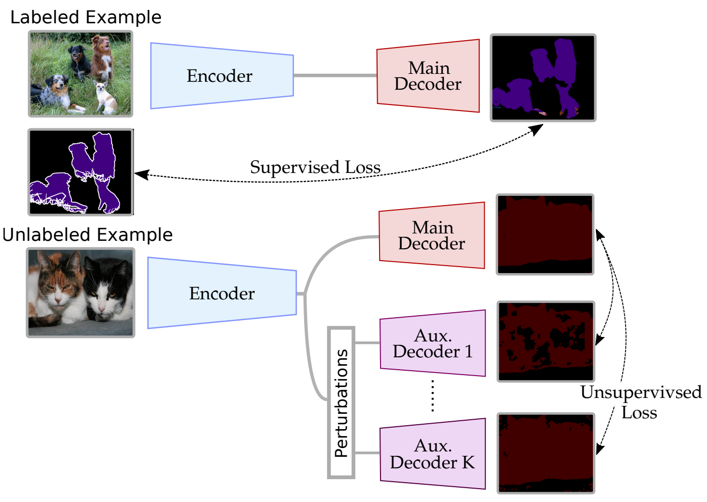
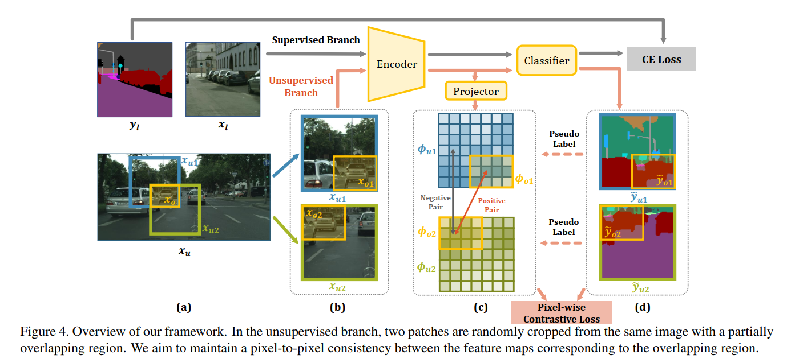
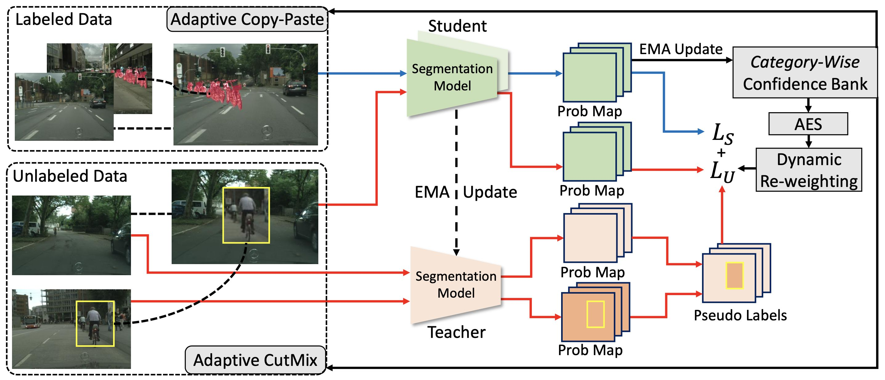

# 半监督学习

## 半监督学习的前提假设

少量 data 有标准，大量 data 无标注。

- 连续性假设

  - 分类问题中，如果两个 data 比较接近的时候，其 output 的后验概率矩阵也应该距离比较小。

  $$
  x_1 \approx x_2==>y_1 \approx y_2 \\ \hat y_1=[0.9,0.1] \\ \hat y_2=[0.85,0.15] √ \\ \hat y_2 =[0.55,0.45] ×
  $$

- 聚类假设

  - 类类内聚，类间分开

- 流形假设

  - 所有数据点可以被多个低维流形表达。简单理解就是，将高维冗余特征降维到低维空间。
  - 相同流形上的数据点，标签一样。换句话说，降维之后同样标签（在分类就是类别一样）的数据要接近或一致。

<b>常见做法</b>

- 一致性正则化
- 伪标签
- 对抗训练
- 主动学习（未接触过）

## 一致性正则化

利用连续性假设和聚类假设，一般是对样本增加扰动，迫使扰动样本的 output 的后验概率和扰动前的趋于一致。

即，对 unlabeled target sample 进行数据的强增强和弱增强，迫使强增强的结果和弱增强的结果保持一致。

比较有效的强增强方式有：ColorJitter（最优）、Grayscale、Blur、CutOut

<b>Semi-supervised Semantic Segmentation with Cross-Consistency Training（2020 CVPR）</b>

提供两个辅助分支，图像经过编码后，为特征增加不同的扰动，迫使扰动后的解码结果与未经过扰动的解码结果一致，进而优化特征表示。

<b>Semi-supervised Semantic Segmentation with Directional Context-aware</b>

保持“相同身份、不同背景”的特征的一致性。

## 伪标签

<b>Semi-Supervised Semantic Segmentation via Adaptive Equalization Learning（NIPS 2021）</b>

[[笔记\] AEL: 基于自适应均衡学习的半监督语义分割 (NeurIPS'21) - 知乎 (zhihu.com)](https://zhuanlan.zhihu.com/p/617615480)

通过 ① 自适应的数据扩增 ② 均衡的数据采样 ③ 动态的权重平衡 三大策略，帮助表现不佳的类别得到更充分的训练。

<b>Semi-supervised Semantic Segmentation with Error Localization Network</b>

这篇论文看着有点，，

<b>Adversarial Learning for Semi-Supervised Semantic Segmentation</b>

[[论文阅读\] Adversarial Learning for Semi-Supervised Semantic Segmentation_xiongxyowo的博客-CSDN博客](https://blog.csdn.net/qq_40714949/article/details/128017246)

## 主动学习

通过机器学习的方法获取到那些比较“难”分类的样本数据，让人工再次确认和审核，然后将人工标注得到的数据再次使用有监督学习模型或者半监督学习模型进行训练，逐步提升模型的效果，将人工经验融入模型训练的过程。

[主动学习（ACTIVE LEARNING） - 知乎 (zhihu.com)](https://zhuanlan.zhihu.com/p/239756522#SnippetTab)

## 课程学习

从易到难的学习