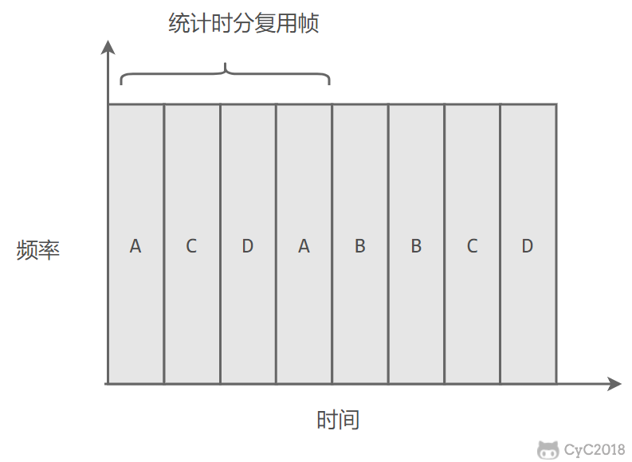
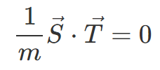
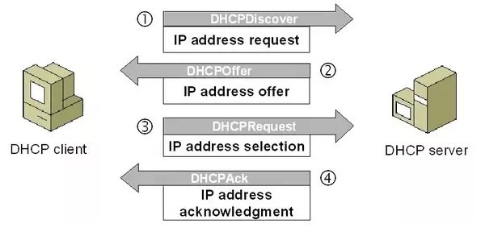

# 第一章 计算机网络体系结构

## 基础概念

- 网络把计算机连接起来，互联网把网络连接起来
- 互联网服务提供商（ISP）

## 因特网的组成

因特网：世界上最大的互连网络。

**因特网的组成：**

- 边缘部分：由所有连接再因特网上的主机组成。用户直接使用
- 核心部分：由大量网络和连接这些网络的路由器组成。为边缘部分提供服务的【提供连通性和数据交换】

## 主机间的通信方式

- 客户-服务器（C/S）：客户是服务的请求方，服务器是服务的提供方。

- 对等（P2P）：不区分客户和服务器。

## 电路交换与分组交换

### 电路交换

用于电话通信系统，两用户间建立一条专用的物理链路，在通信过程中一直占用该链路。资源利用率低下，计算机数据是突发式地出现在传输线路上，绝大多数时间都是空闲的。

需经过三个步骤：建立连接（分配通信资源）----> 通话（一直占用通信资源） ----> 释放连接（归还通信资源）

### 分组交换

> **计算机网络采用的方式。**

发送的数据称为报文，发送报文前，将较长的报文划分为更小的等长数据段。在每个数据段前添加首部，首部中包含目的地址，源地址等重要控制信息。

计算机将分组通过**通信链路**直接发送给**分组交换机**，分组交换机收到分组后将其暂存下来，检查其首部，更具首部中的目的地址查找转发表，找到合适的端口转发出去。直到把分组转发到最终的目的计算机。【**先存储再转发，称为存储转发**】

如果**输出缓存已满**，还有大量分组需要从某条链路转发时，就会出现分组丢失，【**网络发生拥塞**】

因特网中最重要的分组交换机是路由器（router）。

## 计算机网络的定义与分类

### 定义

一些互相连接的，自治的计算机的集合。

### 计算机网络的分类

#### 作用范围来分类

- 局域网（Local Area Network, LAN）：局限在较小范围
- 城域网（Metropolitan Area Network, MAN）：左右范围一般是一个城市
- 广域网（Wide Area Network，WAN）：作用范围 几十到几千米，可覆盖一个过假，地区，甚至横跨几个州
- 个人区域网（Personal Area Network，PAN）：不是用来连接普通计算机，而是在个人工作的地方把属于个人使用的电子设备用无线奇数连接起来的网络。也成为无线个人区域网。

#### 网络使用者进行分类

- 公用网络（public network）
- 专用网络（private network）

## 计算机网络的性能指标

### 速率

数据的传输速率，比特（bit）是计算机中数据量的单位。通信领域小写k表示1000

### 带宽

- 某个信号具有的频带宽度，这种意义的带宽单位是赫
- 计网中，带宽表示网络的通信线路所能传输数据的能力。单位时间内，从网络中某一点到另一点所能通过的“最高数据率”，单位是比特（bit）每秒。

### 吞吐量

单位时间内通过某个网络的数据量。

### 时延

数据从网络的一端到另一端所需要的时间。

总时延 = 排队时延 + 处理时延 + 传输时延 + 传播时延

- 排队时延：分组在路由器的输入队列和输出队列中排队等待的时间，取决于网络当前的通信量。

- 处理时延：主机或路由器收到分组时进行处理所需要的时间，例如分析首部、从分组中提取数据、进行差错检验或查找适当的路由等。【有一种网络攻击是让路由表存储大量无法转发得地址，从而造成网络问题。】
- 传输时延：主机或路由器传输数据帧所需要的时间。
- 传播时延：电磁波在信道中传播所需要花费的时间，电磁波传播的速度接近光速。

### 丢包率

一定时间范围内，分组在传输过程中丢失的分组数量与总的分组数量的比。

**分组丢失的主要原因如下：**

- 传输过程中出现了比特级差错，被结点丢失
- 分组到达一台队列已满的分组交换机时，由于没有空间来存储这些分组，分组交换机就会将达到的分组进行丢弃。

### 利用率

- 信道利用率：某信道有百分之几的时间是被利用的。【但是信道利用率不是越高越好，根据排队理论，信道利用率增大时，该信道引起的时延也就迅速增大】
- 网络利用率：全网络的信道利用率的加权平均值。

## 计算机网络体系结构

### 网络协议

为进行网络中的数据交换而建立的规则、标准或约定。【在网络中传输数据所遵顼的规则】

**网络协议三要素**

- 语法：数据与控制信息的结构和格式
- 语义：各个控制信息的具体意义
- 同步：事件实现顺序和时间的详细说明

### 层次模型与计算机网络体系结构

#### 层次结构设计的好处

- 各层之间独立，可将复杂的问题分解，由各层处理其中一部分，减小每步的复杂度
- 灵活性好：若某层发生了变化，只要结构不变，就不会影响到其他层。
- 易于实现和维护：
- 利于功能复用：

### 计算机网络体系

#### 五层协议

- **应用层（application layer**）：定义应用进程间通信和交互的规则
- **运输层（transport layer）**：为两台主机中进程之间的通信提供通用的数据传输服务。
  - 主要由这两个运输层协议
  - **传输控制协议TCP（Transmission Control Protocol）**
  - **用户数据报协议UDP（User Datagram Protocol）**
- **网络层（network layer）**：为分组交互网上的不同主机提供通信服务。**使用IP协议**。把运输层产生的报文段封装成**分组**或**包**进行传送。分组也称为IP数据报。
- **数据链路层（data link layer）**：将分组从链路的一端传送到另一端。【封装成帧传送帧？】
- **物理层（physical layer）**：在传输媒体上传送比特流。

# 第二章 物理层

> **物理层传输比特流**

> 物理层考虑的是怎样才能在连接各种计算机的传输媒体上传输数据比特流。【需要屏蔽掉不同传输媒体的差异】

物理层协议主要任务就是确定与传输媒体的接口有关的一些特性。

- 机械特性
- 电气特性
- 功能特性
- 过程特性

## 通信方式

根据信息在传输线上的传送方向，分为以下三种通信方式：

- **单工通信**：单向传输【只需要一条信道】
- **半双工通信**：双向交替传输【需要两条信道】
- **全双工通信**：双向同时传输【需要两条信道】

## 信道复用技术

> 复用：通过一条物理线路同时传输多路用户的信号

### 频分复用

Frequency Division Multiplexing， FDM

将频带资源划分成多个子频带，形成多个子信道，使得所有主机可在相同的时间占用不同的频率带宽资源。

  
 

### 时分复用

Time Division Multiplexing TDM

时分复用的所有主机在不同的时间占用相同的频率带宽资源。【轮流使用相同的频带资源】

  
 

使用频分复用和时分复用进行通信，在**通信的过程中主机会一直占用一部分信道资源**。但是由于计算机数据的突发性质，通信过程没必要一直占用信道资源而不让出给其它用户使用，**因此这两种方式对信道的利用率都不高**。

### 统计时分复用★

集中器（concentrator）常使用统计时分复用。

statistic TDM  STDM

是对时分复用的一种改进，不固定每个用户在时分复用帧中的位置，只要有数据就集中起来组成统计时分复用帧然后发送。

  
 

### 波分复用

Wavelength Division Multiplexing, WDM

光的频分复用。由于光的频率很高，因此习惯上用波长而不是频率来表示所使用的光载波。

### 码分复用

Code Division Multiplexing , CDM

每个用户可在同样地时间使用同样的频带进行通信。【因为各用户使用经过特殊挑选的不同码型，因此各用户之间不会造成干扰。抗干扰能力强】

为每个用户分配 m bit 的码片，并且所有的码片正交，对于任意两个码片  和  有

  
 

为了讨论方便，取 m=8，设码片  为 00011011。在拥有该码片的用户发送比特 1 时就发送该码片，发送比特 0 时就发送该码片的反码 11100100。

在计算时将 00011011 记作 (-1 -1 -1 +1 +1 -1 +1 +1)，可以得到

  
 

  
 

其中  为  的反码。

利用上面的式子我们知道，当接收端使用码片  对接收到的数据进行内积运算时，结果为 0 的是其它用户发送的数据，结果为 1 的是用户发送的比特 1，结果为 -1 的是用户发送的比特 0。

码分复用需要发送的数据量为原先的 m 倍。

  
 

# 第三章 数据链路层

> **数据链路层传输帧【协议数据单元】**

## 数据链路层使用的信道类型

### 点对点信道

使用一对一的点对点通信方式。

### 广播信道

使用一对多的广播通信方式，过程较为复杂。

## 使用点对点信道的数据链路层

### 通信步骤

假设A要把数据传输到B

- 结点A的数据链路层把网络层交下来的IP数据报添加首部和尾部封装成帧。
- 结点A把封装好的帧发送给结点B的数据链路层。
- 若结点B的数据链路层收到的帧无差错，则从收到的帧中提取出IP数据报上交给上面的网络层，否则丢弃帧。

### 封装成帧

数据链路层以帧为单位传输和处理数据。**网络层的IP数据报添加首部和尾部，封装成一个完整的帧**。**帧的长度等于帧的数据部分长度加上帧首部和帧尾部的长度。**

### 可靠传输

#### 停止等待协议

实现简单，但信道利用率低。

发现错误就重传。

### **点对点通信**

两个相邻结点通过一条链路相连接。

应用：PPP协议，常用于广域网

### 广播式链路

所有主机共享通信介质。

应用：早期的总线以太网，无线局域网。

典型拓扑结构：总线型、星型

### 介质访问控制

#### 静态划分信道

- **频分多路复用**：划分为多个频率，不同用户占用不同的频率段（类型并行）
- **时分多路复用**：划分时间段，轮流使用时间。（划分时分帧，根据周期用户交替执行）（类似并发）
- **统计时分复用**：不固定每个用户在时分复用帧中的位置，只要有数据就集中起来组成统计时分复用帧然后发送。
- **波分多路复用**：光的频分多路复用。
- **码分多路复用**

#### 动态分配信道

- 轮询访问截至控制：令牌传输协议
- 随机访问介质访问控制（不协调，会产生冲突）
  - **ALOHA**：
    - 纯ALOHA协议：不监听信道，不按时间槽发送，随机重发。==想发就发==
      - 冲突检测：如果发生冲突，接收方在的话，是可以检测出差错的，不予确认，发送方在一定时间得不到确认消息就判断发发生了冲突。
    - 时隙ALOHA协议：控制发送的时间。把时间分成若干相同的时间片，所有用户在时间片开始时刻同步接入网络信道，发生冲突，则必须等到下一个时间片开始时刻再发送。
  - **CSMA 表示载波监听多点接入**：
    - 发送数据时先检测总线上是否有其他计算机再发送数据。（检测资源是否被占用）
    - **1-坚持CSMA**：信道忙时，会一直监听信道，直到信道空闲，然后传输数据
    - **P-坚持CSMA**：监听信道，空闲则以概率P直接传输，不必等待；概率1-p等待到下一个时间槽再传输。忙则等待一个随机的时间之后再进行监听。
    - **非坚持CSMA**：信道忙时，不会一直监听信道，会等待一个随机的时间片后再进行监听（==这里可以学习到一种策略，如果他是经常性的得不到，那么每次放弃的时间逐步加长。JVM的编译优化也有类似的思想==）
  - **CSMA/CD 表示载波监听多点接入 / 碰撞检测。**【不适用于无线局域网，特别是碰撞检测部分】
    - 发送数据前，发送数据时都要检测一下总线上是否有其他计算机在发送数据。（类似OS竞争资源操作）
    - 先听后发，边听边发，冲突停发，随机重发。
    - 为什么想听后发还是会冲突？ 电磁波的传送是有时延的。
    - 记端到端的传播时延为 τ，最先发送的站点最多经过 2τ 就可以知道是否发生了碰撞，称 2τ 为  **争用期** 。只有经过争用期之后还没有检测到碰撞，才能肯定这次发送不会发生碰撞。
  - **CMCA/CA  表示载波监听多点接入 / 碰撞避免。**
    - 碰撞避免，减少碰撞发生的次数。
    - 预约信道：发送数据的同时向其他站点通知自己传输数据需要的时间长度，以便让其他站点在这个时间段内不要发送数据，从而避免碰撞。
    - ACK帧：所有站点正确接收到数据帧后，会向对方发送一个ACK帧，接收失败则不采取任何行动。发送方在发送完数据后，在规定时间内没有收到ACK帧，则认为发送失败，将数据重新发送，直到收到ACK帧，或者达到规定重发次数为止。
    - RTS/CTS帧：可选的碰撞避免机制。

### 局域网

局域网是一种典型的广播信道。

- 网络为一个单位所拥有，
- 且地理范围和站点数目均有限。
- 各站为平等关系而非主从关系

主要有以太网、令牌环网、FDDI 和 ATM 等局域网技术，目前以太网占领着有线局域网市场。

### 以太网

以太网是一种星型拓扑结构局域网。

早期使用集线器进行连接，集线器是一种物理层设备， 作用于比特而不是帧，当一个比特到达接口时，集线器重新生成这个比特，并将其能量强度放大，从而扩大网络的传输距离，之后再将这个比特发送到其它所有接口。如果集线器同时收到两个不同接口的帧，那么就发生了碰撞。

目前以太网使用交换机替代了集线器，交换机是一种链路层设备，它不会发生碰撞，能根据 MAC 地址进行存储转发。

以太网帧格式：

-  **类型** ：标记上层使用的协议；
-  **数据** ：长度在 46-1500 之间，如果太小则需要填充；
-  **FCS** ：帧检验序列，使用的是 CRC 检验方法；

### 交换机

==交换机具有自学习能力，学习的是交换表的内容==，交换表中存储着 MAC 地址到接口的映射。

正是由于这种自学习能力，因此交换机是一种即插即用设备，不需要网络管理员手动配置交换表内容。

下图中，交换机有 4 个接口，主机 A 向主机 B 发送数据帧时，交换机把主机 A 到接口 1 的映射写入交换表中。为了发送数据帧到 B，先查交换表，此时没有主机 B 的表项，那么主机 A 就发送广播帧，主机 C 和主机 D 会丢弃该帧，主机 B 回应该帧向主机 A 发送数据包时，交换机查找交换表得到主机 A 映射的接口为 1，就发送数据帧到接口 1，同时交换机添加主机 B 到接口 2 的映射。

### 虚拟局域网

==虚拟局域网可以建立与物理位置无关的逻辑组，只有在同一个虚拟局域网中的成员才会收到链路层广播信息。==

例如下图中 (A1, A2, A3, A4) 属于一个虚拟局域网，A1 发送的广播会被 A2、A3、A4 收到，而其它站点收不到。

使用 VLAN 干线连接来建立虚拟局域网，每台交换机上的一个特殊接口被设置为干线接口，以互连 VLAN 交换机。IEEE 定义了一种扩展的以太网帧格式 802.1Q，它在标准以太网帧上加进了 4 字节首部 VLAN 标签，用于表示该帧属于哪一个虚拟局域网。

### PPP 协议

互联网用户通常需要连接到某个 ISP 之后才能接入到互联网，PPP 协议是用户计算机和 ISP 进行通信时所使用的数据链路层协议。

# 第四章 网络层

## 概述

网络层最核心的功能：**路由选择（确定那一条路径）**、**分组转发（当一个分组到达时所采取的动作）**。

**路由选择：**按照复杂的分布式算法，根据从各相邻路由器所得到的关于整个网络拓扑的变化情况，动态地改变所选择地路由。

**分组转发：**指路由器根据转发表将用户地IP数据报从合适地端口转发出去。

**拥塞控制：**由于**出现过量的分组而引起网络性能下降**的现象称为拥塞。

> **判断网络拥塞的方法**，观察网络吞吐量和与网络负载的关系

- 网络负载增加，网络吞吐量增明显小于正常的吞吐量，那么网络可能进入了轻度拥塞
- 网络吞吐量随着网络负载的增大反而下降，网络可能进入拥塞状态
- 网络负载继续增大，而网络吞吐量下降到0，网络可能进入死锁（这也有死锁，，，）

<u>总而言之，看网络负载上升，吞吐量的变化情况。</u>

> **流量控制和拥塞控制的区别**

- **流量控制：**发送端和接收端之间的点对点通信量的控制。【抑制发送端发送数据的速率，以便接收端来得及接收】
- **拥塞控制：**确保通信子网能够传送待传送的数据，是一个全局性的问题，涉及网络中所有的主机、路由器以及导致网络传输能力下降的所有因素。
  - 开环控制：设计网络时事先考虑可能造成拥塞的因素，力求网络在工作时不产生拥塞。静态预防。一旦系统启动，中途不再修改。【不现实，一般不采用该方式】
  - 闭环控制：事先不考虑有关发生网络拥塞的因素，采用监测网络系统去监视，及时检测到哪里发生拥塞，然后将拥塞的信息传送到合适的地方。【基于反馈环路的概念，是一种动态的方法，一般采用该方式】

因为网络层是整个互联网的核心，因此应当让网络层尽可能简单。**网络层向上只提供简单灵活的、无连接的、尽最大努力交互的数据报服务。**

使用 IP 协议，可以把异构的物理网络连接起来，使得在网络层看起来好像是一个统一的网络。

  
 

与 IP 协议配套使用的还有三个协议：

- 地址解析协议 ARP（Address Resolution Protocol）
- 网际控制报文协议 ICMP（Internet Control Message Protocol）
- 网际组管理协议 IGMP（Internet Group Management Protocol）

## IP 数据报格式

  
 

-  **版本**  : 有 4（IPv4）和 6（IPv6）两个值；

-  **首部长度**  : 占 4 位，因此最大值为 15。值为 1 表示的是 1 个 32 位字的长度，也就是 4 字节。因为固定部分长度为 20 字节，因此该值最小为 5。如果可选字段的长度不是 4 字节的整数倍，就用尾部的填充部分来填充。

-  **区分服务**  : 用来获得更好的服务，一般情况下不使用。

-  **总长度**  : 包括首部长度和数据部分长度。

-  **生存时间**  ：TTL，它的存在是为了防止无法交付的数据报在互联网中不断兜圈子。以路由器跳数为单位，当 TTL 为 0 时就丢弃数据报。

-  **协议** ：指出携带的数据应该上交给哪个协议进行处理，例如 ICMP、TCP、UDP 等。

-  **首部检验和** ：因为数据报每经过一个路由器，都要重新计算检验和，因此检验和不包含数据部分可以减少计算的工作量。

-  **标识**  : 在数据报长度过长从而发生分片的情况下，相同数据报的不同分片具有相同的标识符。

-  **片偏移**  : 和标识符一起，用于发生分片的情况。片偏移的单位为 8 字节。

  
 

## IP 地址编址方式

IP 地址的编址方式经历了三个历史阶段：

- 分类
- 子网划分
- 无分类

### 1. 分类

由两部分组成，网络号和主机号，其中不同分类具有不同的网络号长度，并且是固定的。

IP 地址 ::= {< 网络号 >, < 主机号 >}

  
 

### 2. 子网划分

通过在主机号字段中拿一部分作为子网号，把两级 IP 地址划分为三级 IP 地址。

IP 地址 ::= {< 网络号 >, < 子网号 >, < 主机号 >}

要使用子网，必须配置子网掩码。一个 B 类地址的默认子网掩码为 255.255.0.0，如果 B 类地址的子网占两个比特，那么子网掩码为 11111111 11111111 11000000 00000000，也就是 255.255.192.0。

注意，外部网络看不到子网的存在。

### 3. 无分类

无分类编址 CIDR 消除了传统 A 类、B 类和 C 类地址以及划分子网的概念，使用网络前缀和主机号来对 IP 地址进行编码，网络前缀的长度可以根据需要变化。

IP 地址 ::= {< 网络前缀号 >, < 主机号 >}

CIDR 的记法上采用在 IP 地址后面加上网络前缀长度的方法，例如 128.14.35.7/20 表示前 20 位为网络前缀。

CIDR 的地址掩码可以继续称为子网掩码，子网掩码首 1 长度为网络前缀的长度。

一个 CIDR 地址块中有很多地址，一个 CIDR 表示的网络就可以表示原来的很多个网络，并且在路由表中只需要一个路由就可以代替原来的多个路由，减少了路由表项的数量。把这种通过使用网络前缀来减少路由表项的方式称为路由聚合，也称为  **构成超网** 。

在路由表中的项目由“网络前缀”和“下一跳地址”组成，在查找时可能会得到不止一个匹配结果，应当采用最长前缀匹配来确定应该匹配哪一个。

## 地址解析协议 ARP

网络层实现主机之间的通信，而**链路层实现具体每段链路之间的通信**。**因此在通信过程中，IP 数据报的源地址和目的地址始终不变，而 MAC 地址随着链路的改变而改变**。

  
 

ARP 实现由 IP 地址得到 MAC 地址。

  
 

每个主机都有一个 ARP 高速缓存，里面有本局域网上的各主机和路由器的 IP 地址到 MAC 地址的映射表。

如果主机 A 知道主机 B 的 IP 地址，但是 ARP 高速缓存中没有该 IP 地址到 MAC 地址的映射，此时主机 A 通过广播的方式发送 ARP 请求分组，主机 B 收到该请求后会发送 ARP 响应分组给主机 A 告知其 MAC 地址，随后主机 A 向其高速缓存中写入主机 B 的 IP 地址到 MAC 地址的映射。

  
 

## 网际控制报文协议 ICMP

ICMP 是为了更有效地转发 IP 数据报和提高交付成功的机会。它封装在 IP 数据报中，但是不属于高层协议。

  
 

ICMP 报文分为差错报告报文和询问报文。

  
 

### 1. Ping

Ping 是 ICMP 的一个重要应用，主要用来测试两台主机之间的连通性。

Ping 的原理是通过向目的主机发送 ICMP Echo 请求报文，目的主机收到之后会发送 Echo 回答报文。Ping 会根据时间和成功响应的次数估算出数据包往返时间以及丢包率。

### 2. Traceroute

Traceroute 是 ICMP 的另一个应用，用来跟踪一个分组从源点到终点的路径。

Traceroute 发送的 IP 数据报封装的是无法交付的 UDP 用户数据报，并由目的主机发送终点不可达差错报告报文。

- 源主机向目的主机发送一连串的 IP 数据报。第一个数据报 P1 的生存时间 TTL 设置为 1，当 P1 到达路径上的第一个路由器 R1 时，R1 收下它并把 TTL 减 1，此时 TTL 等于 0，R1 就把 P1 丢弃，并向源主机发送一个 ICMP 时间超过差错报告报文；
- 源主机接着发送第二个数据报 P2，并把 TTL 设置为 2。P2 先到达 R1，R1 收下后把 TTL 减 1 再转发给 R2，R2 收下后也把 TTL 减 1，由于此时 TTL 等于 0，R2 就丢弃 P2，并向源主机发送一个 ICMP 时间超过差错报文。
- 不断执行这样的步骤，直到最后一个数据报刚刚到达目的主机，主机不转发数据报，也不把 TTL 值减 1。但是因为数据报封装的是无法交付的 UDP，因此目的主机要向源主机发送 ICMP 终点不可达差错报告报文。
- 之后源主机知道了到达目的主机所经过的路由器 IP 地址以及到达每个路由器的往返时间。

## 虚拟专用网 VPN

由于 IP 地址的紧缺，一个机构能申请到的 IP 地址数往往远小于本机构所拥有的主机数。并且一个机构并不需要把所有的主机接入到外部的互联网中，机构内的计算机可以使用仅在本机构有效的 IP 地址（专用地址）。

有三个专用地址块：

- 10.0.0.0 \~ 10.255.255.255
- 172.16.0.0 \~ 172.31.255.255
- 192.168.0.0 \~ 192.168.255.255

VPN 使用公用的互联网作为本机构各专用网之间的通信载体。专用指机构内的主机只与本机构内的其它主机通信；虚拟指好像是，而实际上并不是，它有经过公用的互联网。

下图中，场所 A 和 B 的通信经过互联网，如果场所 A 的主机 X 要和另一个场所 B 的主机 Y 通信，IP 数据报的源地址是 10.1.0.1，目的地址是 10.2.0.3。数据报先发送到与互联网相连的路由器 R1，R1 对内部数据进行加密，然后重新加上数据报的首部，源地址是路由器 R1 的全球地址 125.1.2.3，目的地址是路由器 R2 的全球地址 194.4.5.6。路由器 R2 收到数据报后将数据部分进行解密，恢复原来的数据报，此时目的地址为 10.2.0.3，就交付给 Y。

  
 

## 网络地址转换 NAT

**专用网内部的主机使用本地 IP 地址又想和互联网上的主机通信时，可以使用 NAT 来将本地 IP 转换为全球 IP。**

在以前，NAT 将本地 IP 和全球 IP 一一对应，这种方式下拥有 n 个全球 IP 地址的专用网内最多只可以同时有 n 台主机接入互联网。为了更有效地利用全球 IP 地址，现在常用的 NAT 转换表把传输层的端口号也用上了，使得多个专用网内部的主机共用一个全球 IP 地址。使用端口号的 NAT 也叫做网络地址与端口转换 NAPT。

  
 

## 路由器的结构

路由器从功能上可以划分为：路由选择和分组转发。

分组转发结构由三个部分组成：交换结构、一组输入端口和一组输出端口。

  
 

## 路由算法

### 静态路由与动态路由

**静态路由算法：**网络管理员手动配置路由信息。适用于拓扑变化不大的网络。简便，可靠。

**动态路由算法：**路由器上的路由表项是通过相互联接的路由器之间彼此交换信息，按照一定的算法优化出来的。在一定时间间隙里不断更新，以适应不断变化的网络，以随时获得最优的寻路效果。【<u>相互连接的路由器之间彼此交换信息，按照一定算法优化。不断更新，适应变化的网络，获取最优的寻路效果</u>】

### 距离向量算法：

路由器之间交换信息优化出下一跳最小路径，不同的路由器的路由表信息不同，可能选择的路径不是最优。

### 链路状态算法：

路由器之间持有相同的网络拓扑图信息，只要一台路由器和其他路由器的网络拓扑图一致就说明信息是正确的，否则应该同步路由信息，使路由达到稳定状态，可以进行稳定的路由选择（最优路径）。

## 路由器分组转发流程

- 从数据报的首部提取目的主机的 IP 地址 D，得到目的网络地址 N。
- 若 N 就是与此路由器直接相连的某个网络地址，则进行直接交付；
- 若路由表中有目的地址为 D 的特定主机路由，则把数据报传送给表中所指明的下一跳路由器；
- 若路由表中有到达网络 N 的路由，则把数据报传送给路由表中所指明的下一跳路由器；
- 若路由表中有一个默认路由，则把数据报传送给路由表中所指明的默认路由器；
- 报告转发分组出错。

  
 

## 路由选择协议

路由选择协议都是自适应的，能随着网络通信量和拓扑结构的变化而自适应地进行调整。

互联网可以划分为许多较小的自治系统 AS，一个 AS 可以使用一种和别的 AS 不同的路由选择协议。

可以把路由选择协议划分为两大类：

- 自治系统内部的路由选择：RIP 和 OSPF
- 自治系统间的路由选择：BGP

### 1. 内部网关协议 RIP

RIP 是一种基于距离向量的路由选择协议。距离是指跳数，直接相连的路由器跳数为 1。跳数最多为 15，超过 15 表示不可达。

RIP 按固定的时间间隔仅和相邻路由器交换自己的路由表，经过若干次交换之后，所有路由器最终会知道到达本自治系统中任何一个网络的最短距离和下一跳路由器地址。

距离向量算法：

- 对地址为 X 的相邻路由器发来的 RIP 报文，先修改报文中的所有项目，把下一跳字段中的地址改为 X，并把所有的距离字段加 1；
- 对修改后的 RIP 报文中的每一个项目，进行以下步骤：
 - 若原来的路由表中没有目的网络 N，则把该项目添加到路由表中；
 - 否则：若下一跳路由器地址是 X，则把收到的项目替换原来路由表中的项目；否则：若收到的项目中的距离 d 小于路由表中的距离，则进行更新（例如原始路由表项为 Net2, 5, P，新表项为 Net2, 4, X，则更新）；否则什么也不做。
- 若 3 分钟还没有收到相邻路由器的更新路由表，则把该相邻路由器标为不可达，即把距离置为 16。

RIP 协议实现简单，开销小。但是 RIP 能使用的最大距离为 15，限制了网络的规模。并且当网络出现故障时，要经过比较长的时间才能将此消息传送到所有路由器。

### 2. 内部网关协议 OSPF

开放最短路径优先 OSPF，是为了克服 RIP 的缺点而开发出来的。

开放表示 OSPF 不受某一家厂商控制，而是公开发表的；最短路径优先表示使用了 Dijkstra 提出的最短路径算法 SPF。

OSPF 具有以下特点：

- 向本自治系统中的所有路由器发送信息，这种方法是洪泛法。
- 发送的信息就是与相邻路由器的链路状态，链路状态包括与哪些路由器相连以及链路的度量，度量用费用、距离、时延、带宽等来表示。
- 只有当链路状态发生变化时，路由器才会发送信息。

所有路由器都具有全网的拓扑结构图，并且是一致的。相比于 RIP，OSPF 的更新过程收敛的很快。

### 3. 外部网关协议 BGP

BGP（Border Gateway Protocol，边界网关协议）

AS 之间的路由选择很困难，主要是由于：

- 互联网规模很大；
- 各个 AS 内部使用不同的路由选择协议，无法准确定义路径的度量；
- AS 之间的路由选择必须考虑有关的策略，比如有些 AS 不愿意让其它 AS 经过。

BGP 只能寻找一条比较好的路由，而不是最佳路由。

每个 AS 都必须配置 BGP 发言人，通过在两个相邻 BGP 发言人之间建立 TCP 连接来交换路由信息。

  
 

# 第五章 传输层

## UDP 和 TCP 的特点

- 用户数据报协议 UDP（User Datagram Protocol）是**无连接**的，**尽最大可能交付**，**没有拥塞控制**，面向报文（对于应用程序传下来的报文不合并也不拆分，只是添加 UDP 首部），支持一对一、一对多、多对一和多对多的交互通信。

- 传输控制协议 TCP（Transmission Control Protocol）是**面向连接**的，**提供可靠交付**，**有流量控制**，**拥塞控制**，**提供全双工通信**，**面向字节流**（把应用层传下来的报文看成字节流，把字节流组织成大小不等的数据块），每一条 TCP 连接只能是点对点的（一对一）。

## UDP 首部格式

  
 

首部字段只有 8 个字节，包括源端口、目的端口、长度、检验和。12 字节的伪首部是为了计算检验和临时添加的。

## TCP 首部格式

  
 

-  **序号**  ：用于对字节流进行编号，例如序号为 301，表示第一个字节的编号为 301，如果携带的数据长度为 100 字节，那么下一个报文段的序号应为 401。

-  **确认号**  ：期望收到的下一个报文段的序号。例如 B 正确收到 A 发送来的一个报文段，序号为 501，携带的数据长度为 200 字节，因此 B 期望下一个报文段的序号为 701，B 发送给 A 的确认报文段中确认号就为 701。

-  **数据偏移**  ：指的是数据部分距离报文段起始处的偏移量，实际上指的是首部的长度。

-  **确认 ACK**  ：当 ACK=1 时确认号字段有效，否则无效。TCP 规定，在连接建立后所有传送的报文段都必须把 ACK 置 1。

-  **同步 SYN**  ：在连接建立时用来同步序号。当 SYN=1，ACK=0 时表示这是一个连接请求报文段。若对方同意建立连接，则响应报文中 SYN=1，ACK=1。

-  **终止 FIN**  ：用来释放一个连接，当 FIN=1 时，表示此报文段的发送方的数据已发送完毕，并要求释放连接。

-  **窗口**  ：窗口值作为接收方让发送方设置其发送窗口的依据。之所以要有这个限制，是因为接收方的数据缓存空间是有限的。

## TCP 的三次握手

  
 

假设 A 为客户端，B 为服务器端。

- 首先 B 处于 LISTEN（监听）状态，等待客户的连接请求。

- A 向 B 发送连接请求报文，SYN=1，ACK=0，选择一个初始的序号 x。

- B 收到连接请求报文，如果同意建立连接，则向 A 发送连接确认报文，SYN=1，ACK=1，确认号为 x+1，同时也选择一个初始的序号 y。

- A 收到 B 的连接确认报文后，还要向 B 发出确认，确认号为 y+1，序号为 x+1。

- B 收到 A 的确认后，连接建立。

**三次握手的原因** 

- 第三次握手是为了防止失效的连接请求到达服务器，让服务器错误打开连接。

  客户端发送的连接请求如果再网络中滞留时间过长，直到客户端连接关闭了才到达服务器端，此时服务器收到了请求，向客户端回应，但是客户端已经关闭了这次请求，无视了服务器的回应，但服务器一直在苦等客户端的数据。浪费的服务器的资源。

- 可保证数据的有序传输

  为了实现可靠传输，发送方和接收方始终需要同步( **SYN**chronize )序号。第一次握手，客户端发送客户端的同步信号；第二次握手，服务器告诉客户端自己收到同步序号，并且发送服务器端的同步序号，如果只有两次握手，那么只有客户端一方的同步序号是被确认了的，无法保证客户端和服务器端的都同步。而第三次握手，客户端告知服务器自己也收到了对方的同步序号，此时是可以保证可靠传输的！

## TCP 的四次挥手

> 为什么要四次挥手。其中一个原因是，A B双方都可以进行数据传送。A不传送了，但是B可能还有一点数据要传送，所以两次挥手关闭A，两次挥手关闭B，不同时都关了。【大概就这个意思，为了保证服务器B可以传输未传送完的数据】

  
 

以下描述不讨论序号和确认号，因为序号和确认号的规则比较简单。并且不讨论 ACK，因为 ACK 在连接建立之后都为 1。

- A 发送连接释放报文，FIN=1。

- B 收到之后发出确认，此时 TCP 属于半关闭状态，B 能向 A 发送数据但是 A 不能向 B 发送数据。

- 当 B 不再需要连接时，发送连接释放报文，FIN=1。

- A 收到后发出确认，进入 TIME-WAIT 状态，等待 2 MSL（最大报文存活时间）后释放连接。

- B 收到 A 的确认后释放连接。

**四次挥手的原因** ：服务器B可能还有一小部分数据需要发送给客户端A

客户端发送了 FIN 连接释放报文之后，服务器收到了这个报文，就进入了 CLOSE-WAIT 状态。这个状态是为了让服务器端发送还未传送完毕的数据，传送完毕之后，服务器会发送 FIN 连接释放报文。

**TIME_WAIT** 

客户端接收到服务器端的 FIN 报文后进入此状态，此时并不是直接进入 CLOSED 状态，还需要等待一个时间计时器设置的时间 2MSL。这么做有两个理由：

- 确保最后一个确认报文能够到达。如果 B 没收到 A 发送来的确认报文，那么就会重新发送连接释放请求报文，A 等待一段时间就是为了处理这种情况的发生。

- 等待一段时间是为了让本连接持续时间内所产生的所有报文都从网络中消失，使得下一个新的连接不会出现旧的连接请求报文。

## TCP 可靠传输

TCP 使用超时重传来实现可靠传输：如果一个已经发送的报文段在超时时间内没有收到确认，那么就重传这个报文段。

一个报文段从发送再到接收到确认所经过的时间称为往返时间 RTT，加权平均往返时间 RTTs 计算如下：

  

其中，0 ≤ a ＜ 1，RTTs 随着 a 的增加更容易受到 RTT 的影响。

超时时间 RTO 应该略大于 RTTs，TCP 使用的超时时间计算如下：

  

其中 RTTd 为偏差的加权平均值。

## TCP 滑动窗口

窗口是缓存的一部分，用来暂时存放字节流。发送方和接收方各有一个窗口，接收方通过 TCP 报文段中的窗口字段告诉发送方自己的窗口大小，发送方根据这个值和其它信息设置自己的窗口大小。

发送窗口内的字节都允许被发送，接收窗口内的字节都允许被接收。如果发送窗口左部的字节已经发送并且收到了确认，那么就将发送窗口向右滑动一定距离，直到左部第一个字节不是已发送并且已确认的状态；接收窗口的滑动类似，接收窗口左部字节已经发送确认并交付主机，就向右滑动接收窗口。

接收窗口只会对窗口内最后一个按序到达的字节进行确认，例如接收窗口已经收到的字节为 {31, 34, 35}，其中 {31} 按序到达，而 {34, 35} 就不是，因此只对字节 31 进行确认。发送方得到一个字节的确认之后，就知道这个字节之前的所有字节都已经被接收。

  
 

## TCP 流量控制

流量控制是为了控制发送方发送速率，保证接收方来得及接收。

接收方发送的确认报文中的窗口字段可以用来控制发送方窗口大小，从而影响发送方的发送速率。将窗口字段设置为 0，则发送方不能发送数据。

## TCP 拥塞控制 先看课本再看笔记

> TCP检测分组丢失有两种情况：重传计时器和收到连续三个重复的ACK。拥塞控制算法对着两种情况采取了同样的反应，将拥塞窗口降低为1，然后执行慢启动算法。

如果网络出现拥塞，分组将会丢失，此时发送方会继续重传，从而导致网络拥塞程度更高。因此当出现拥塞时，应当控制发送方的速率。这一点和流量控制很像，但是出发点不同。流量控制是为了让接收方能来得及接收，而拥塞控制是为了降低整个网络的拥塞程度。

  
 

TCP 主要通过四个算法来进行拥塞控制：慢开始、拥塞避免、快重传、快恢复。

发送方需要维护一个叫做拥塞窗口（cwnd）的状态变量，注意拥塞窗口与发送方窗口的区别：拥塞窗口只是一个状态变量，实际决定发送方能发送多少数据的是发送方窗口。

为了便于讨论，做如下假设：

- 接收方有足够大的接收缓存，因此不会发生流量控制；
- 虽然 TCP 的窗口基于字节，但是这里设窗口的大小单位为报文段。

  
 

### 慢开始与拥塞避免

发送的最初执行慢开始，令 cwnd = 1，发送方只能发送 1 个报文段；当收到确认后，将 cwnd 加倍，因此之后发送方能够发送的报文段数量为：2、4、8 ...

注意到慢开始每个轮次都将 cwnd 加倍，这样会让 cwnd 增长速度非常快，从而使得发送方发送的速度增长速度过快，网络拥塞的可能性也就更高。设置一个慢开始门限 ssthresh，当 cwnd >= ssthresh 时，进入拥塞避免，每个轮次只将 cwnd 加 1。

如果出现了超时，则令 ssthresh = cwnd / 2，然后重新执行慢开始。

> 大概意思就是这样：慢慢增加，每次cwnd大小变为2，达到一个值后每次只自增1，造成拥塞时，缩小为1/2.一般出现超时重传时可认为发送了拥塞（现在的通信质量很高，发送拥塞的几率不到1%）

### 快重传与快恢复

在接收方，要求每次接收到报文段都应该对最后一个已收到的有序报文段进行确认。例如已经接收到 M1 和 M2，此时收到 M4，应当发送对 M2 的确认。

**在发送方，如果收到三个重复确认，那么可以知道下一个报文段丢失，此时执行快重传**，立即重传下一个报文段。例如收到三个 M2，则 M3 丢失，立即重传 M3。

**在这种情况下，只是丢失个别报文段，而不是网络拥塞。因此执行快恢复**，令 ssthresh = cwnd / 2 ，cwnd = ssthresh，注意到此时直接进入拥塞避免。

慢开始和快恢复的快慢指的是 cwnd 的设定值，而不是 cwnd 的增长速率。慢开始 cwnd 设定为 1，而快恢复 cwnd 设定为 ssthresh。

  
 

# 第六章 应用层

## 网络应用模型

### 客户/服务器模型

> **客户请求服务，服务器提供服务**

**工作流程如下**

- 服务器处于接收请求的状态。
- 客户机发出服务请求，等待接收结果。
- 服务器收到请求后，分析请求，进行必要处理，得到结果并发送给客户机。

### P2P模型

C/S模型中，服务器的性能好坏决定了整个系统的性能，请求量过大时，服务器无法承受，导致崩溃。

P2P思想是：整个网络中的传输内容不再被保存在中心服务器上，每个结点都同时具有下载、上传的功能，权力与义务对等。无固定的客户和服务器划分。

**优点**

- 减轻的服务器的计算压力，消除了对某个服务器的完全依赖，可将任务分配到各节点上，提高了系统效率和资源利用率。【比如百度的激励计划，服务器下载压力过大时，利用你的电脑作为服务器提供下载功能；播放流媒体时对服务器的压力过大，而通过P2P模型，利用大量的客户机来提供服务】

**缺点**

获取服务时，还有给其他结点提供服务，会占用较多的内存。经常进行P2P下载会对硬盘造成较大损伤。

## 域名系统（DNS）

DNS系统采用客户/服务器模型，其协议运行在UDP之上，使用53端口，用于处理主机名与IP地址的转换（机器处理IP地址更为容易）

DNS 是一个分布式数据库，提供了主机名和 IP 地址之间相互转换的服务。这里的分布式数据库是指，每个站点只保留它自己的那部分数据。

域名具有层次结构，从上到下依次为：根域名、顶级域名、二级域名。

  
 

DNS 可以使用 UDP 或者 TCP 进行传输，使用的端口号都为 53。大多数情况下 DNS 使用 UDP 进行传输，这就要求域名解析器和域名服务器都必须自己处理超时和重传从而保证可靠性。在两种情况下会使用 TCP 进行传输：

- 如果返回的响应超过的 512 字节（UDP 最大只支持 512 字节的数据）。
- 区域传送（区域传送是主域名服务器向辅助域名服务器传送变化的那部分数据）。

**DNS域名解析**

假设客户机想获知域名为y.abc.com主机的IP地址

- 客户机向其本地域名服务器发出DNS请求报文
- 本地域名服务器接收到请求和，查询本地缓存，假设无该记录，则以DNS客户的身份向根域名服务器发出解析请求。
- 根域名服务器接收到请求后，判断该域名属于.com域；将对应的顶级域名服务器dns.com的IP地址返回给本地域名服务器。
- 本地域名服务器向顶级域名服务器dns.com发出解析请求报文。
- 顶级域名服务器dns.com收集到请求后，判断该域名属于abc.com域，故将对应的授权域名服务器dns.abc.com的IP地址返回给本地域名服务器。
- 本地域名服务器向授权域名服务器dns.abc.com发出解析请求报文。
- 授权域名服务器dns.abc.com收到请求后，将查询结果返回给本地域名服务器。
- 本地域名服务器将查询结果保存到本地缓存，同时返回给客户机。

> **一句话：发送请求，得到解析结果，全部解析完毕，缓存起来。**

为提高DNS的效率，会设置高速缓存，避免频繁的解析同一个域名而浪费机器性能。缓存有有效期。【**缓存的作用无处不在啊！**】

## 文件传送协议FTP

> **FTP提供交互式访问，允许客户指明文件的类型与格式，并允许文件具有存取权限。屏蔽了计算机系统的细节，适用于异构网络中任意计算机之间传送文件。**

FTP 使用 TCP 进行连接【文件传输要求严格，不允许有丢失】，它需要两个连接来传送一个文件：

- 控制连接：服务器打开端口号 21 ，等待客户端的连接请求，客户端主动建立连接后，使用这个连接将客户端的命令传送给服务器，并传回服务器的应答。
- 数据连接：用来传送一个文件数据。

根据数据连接是否是服务器端主动建立，FTP 有主动和被动两种模式：

- **主动模式：服务器端主动建立数据连接，**其中服务器端的端口号为 20，客户端的端口号随机，但是必须大于 1024，因为 0\~1023 是熟知端口号【避免端口冲突】。

  
 

- **被动模式：客户端主动建立数据连接，**其中客户端的端口号由客户端自己指定，服务器端的端口号随机。

  
 

主动模式要求客户端开放端口号给服务器端，需要去配置客户端的防火墙。被动模式只需要服务器端开放端口号即可，无需客户端配置防火墙。但是被动模式会导致服务器端的安全性减弱，因为开放了过多的端口号。

## 动态主机配置协议

DHCP (Dynamic Host Configuration Protocol) 提供了即插即用的连网方式，用户不再需要手动配置 IP 地址等信息。

DHCP 配置的内容不仅是 IP 地址，还包括子网掩码、网关 IP 地址。

DHCP 工作过程如下：

1. 客户端发送 Discover 报文，该报文的目的地址为 255.255.255.255:67，源地址为 0.0.0.0:68，被放入 UDP 中，该报文被广播到同一个子网的所有主机上。如果客户端和 DHCP 服务器不在同一个子网，就需要使用中继代理。
2. DHCP 服务器收到 Discover 报文之后，发送 Offer 报文给客户端，该报文包含了客户端所需要的信息。因为客户端可能收到多个 DHCP 服务器提供的信息，因此客户端需要进行选择。
3. 如果客户端选择了某个 DHCP 服务器提供的信息，那么就发送 Request 报文给该 DHCP 服务器。
4. DHCP 服务器发送 Ack 报文，表示客户端此时可以使用提供给它的信息。

  
 

## 远程登录协议

TELNET 用于登录到远程主机上，并且远程主机上的输出也会返回。

TELNET 可以适应许多计算机和操作系统的差异，例如不同操作系统系统的换行符定义。

## 电子邮件协议

> **电子邮件：异步通信**

**一个电子邮件系统由三部分组成：<u>用户代理</u>、<u>邮件服务器</u>  以及 <u>邮件协议（如SMTP，POP3，IMAP）</u>。**

邮件协议包含**发送协议**和**读取协议**，**发送协议常用 SMTP**，**读取协议常用 POP3 和 IMAP。**

  
 

### SMTP

SMTP 只能发送 ASCII 码，而互联网邮件扩充 MIME 可以发送二进制文件。MIME 并没有改动或者取代 SMTP，而是增加邮件主体的结构，定义了非 ASCII 码的编码规则。

  
 

### POP3

POP3 的特点是只要用户从服务器上读取了邮件，就把该邮件删除。

### IMAP

IMAP 协议中客户端和服务器上的邮件保持同步，如果不手动删除邮件，那么服务器上的邮件也不会被删除。IMAP 这种做法可以让用户随时随地去访问服务器上的邮件。

## 常用端口

|       应用       | 应用层协议 | 端口号  | 传输层协议 |            备注             |
| :--------------: | :--------: | :-----: | :--------: | :-------------------------: |
|     域名解析     |    DNS     |   53    |  UDP/TCP   | 长度超过 512 字节时使用 TCP |
| 动态主机配置协议 |    DHCP    |  67/68  |    UDP     |                             |
| 简单网络管理协议 |    SNMP    | 161/162 |    UDP     |                             |
|   文件传送协议   |    FTP     |  20/21  |    TCP     |  控制连接 21，数据连接 20   |
|   远程终端协议   |   TELNET   |   23    |    TCP     |                             |
|  超文本传送协议  |    HTTP    |   80    |    TCP     |                             |
| 简单邮件传送协议 |    SMTP    |   25    |    TCP     |                             |
|   邮件读取协议   |    POP3    |   110   |    TCP     |                             |
| 网际报文存取协议 |    IMAP    |   143   |    TCP     |                             |

## 万维网

## 万维网的概念与组成

万维网www（world wide web）：一个资料空间，是无数个网络站点和网页的集合。

**万维网的内核：**

- 统一资源定位符URL，负责标识万维网上的各种文档
- 超文本传输协议（HTTP），应用层协议，使用TCP进行可靠的传输
- 超文本标记语言，文档结构的标记语言，使用约定的标记对页面上的信息、格式进行描述

**工作流程：**（回忆tomcat的运作）

web用户使用浏览器（指定URL）与web服务器建立连接，并发送浏览请求

web服务器把url转化维文件路径，并返回信息给web浏览器

通信完成，关闭连接

## 超文本传输协议HTTP

> 规定了浏览器和服务器之间的请求和响应的格式和规则

**执行流程如下：**（以访问www.baidu.com为例）

- 浏览器分析链接指向页面的URL（http://www.baidu.com）
- 浏览器向DNS请求解析www.baidu.com的IP地址
- 域名系统解析出百度的IP地址**（域名解析先解析com，在解析baidu，在解析www）**
- 浏览器与该服务器建立TCP链接（不指定端口的话就是，默认端口80）
- 浏览器发出HTTP请求：GET /index.html
- 服务器通过HTTP响应把文件index.html发送给浏览器
- TCP释放连接
- 浏览器将文件index.html进行解释，并将web页显示给用户。

**HTTP协议的特点**

- 无状态；虽然使用了面向连接的TCP（运输层）协议，但HTTP协议本身是一个无状态协议。HTTP不要求服务器保留客户的任何状态信息，且不会影响下一次的访问。

- 无连接；虽采用TCP作为运输层协议，保证了数据传输的可靠性，但是HTTP本身不用考虑数据在传输过程中被丢弃后如何重传。通信双方在交换HTTP报文之前不需要建立HTTP连接。

- HTTP既可以采用非持久连接也可以采用持久连接

  - **HTTP/1.0采用非持续连接**，一次响应对应一个TCP连接。在非持续连接方式中，每次浏览器要请求一个文件都要与服务器进行TCP连接，当收到响应后就立即关闭（**开销是不是太大了**）【**每次建立新的TCP连接都要分配缓存和变量并初始化各种状态**】

    从请求文档到接收文档的时间 = 2RTT。三次握手+把请求文档作为响应报文返回给客户。三次握手的第三次，浏览器会把HTTP请求报文放上去，作为TCP的确认报文的数据发送给服务器（前两部分不能携带数据）。

    **缺点**：每请求一个文档就要有两倍的RTT的开销！

  - **HTTP/1.1协议使用持续连接**

    持续连接，万维网发送响应后仍然保持这条连接，使同一个客户（浏览器）和该服务可以继续在这条连接上传送后续的HTTP请求报文和响应报文。【不局限于同一个页面上的引用对象，而是只要这些文档在同一个服务器上就行】

    持续连接又分为流水线和非流水线。对于非流水线，客户在收到一个响应后才能发出下一个请求。流水线方式，在收到HTTP响应报文之前就连续发送多个请求报文。

## Web 页面请求过程

## 1. DHCP 配置主机信息

- 假设主机最开始没有 IP 地址以及其它信息，那么就需要先使用 DHCP 来获取。

- 主机生成一个 DHCP 请求报文，并将这个报文放入具有目的端口 67 和源端口 68 的 UDP 报文段中。

- 该报文段则被放入在一个具有广播 IP 目的地址(255.255.255.255) 和源 IP 地址（0.0.0.0）的 IP 数据报中。

- 该数据报则被放置在 MAC 帧中，该帧具有目的地址 FF:<zero-width space>FF:<zero-width space>FF:<zero-width space>FF:<zero-width space>FF:FF，将广播到与交换机连接的所有设备。

- 连接在交换机的 DHCP 服务器收到广播帧之后，不断地向上分解得到 IP 数据报、UDP 报文段、DHCP 请求报文，之后生成 DHCP ACK 报文，该报文包含以下信息：IP 地址、DNS 服务器的 IP 地址、默认网关路由器的 IP 地址和子网掩码。该报文被放入 UDP 报文段中，UDP 报文段有被放入 IP 数据报中，最后放入 MAC 帧中。

- 该帧的目的地址是请求主机的 MAC 地址，因为交换机具有自学习能力，之前主机发送了广播帧之后就记录了 MAC 地址到其转发接口的交换表项，因此现在交换机就可以直接知道应该向哪个接口发送该帧。

- 主机收到该帧后，不断分解得到 DHCP 报文。之后就配置它的 IP 地址、子网掩码和 DNS 服务器的 IP 地址，并在其 IP 转发表中安装默认网关。

## 2. ARP 解析 MAC 地址

- 主机通过浏览器生成一个 TCP 套接字，套接字向 HTTP 服务器发送 HTTP 请求。为了生成该套接字，主机需要知道网站的域名对应的 IP 地址。

- 主机生成一个 DNS 查询报文，该报文具有 53 号端口，因为 DNS 服务器的端口号是 53。

- 该 DNS 查询报文被放入目的地址为 DNS 服务器 IP 地址的 IP 数据报中。

- 该 IP 数据报被放入一个以太网帧中，该帧将发送到网关路由器。

- DHCP 过程只知道网关路由器的 IP 地址，为了获取网关路由器的 MAC 地址，需要使用 ARP 协议。

- 主机生成一个包含目的地址为网关路由器 IP 地址的 ARP 查询报文，将该 ARP 查询报文放入一个具有广播目的地址（FF:<zero-width space>FF:<zero-width space>FF:<zero-width space>FF:<zero-width space>FF:FF）的以太网帧中，并向交换机发送该以太网帧，交换机将该帧转发给所有的连接设备，包括网关路由器。

- 网关路由器接收到该帧后，不断向上分解得到 ARP 报文，发现其中的 IP 地址与其接口的 IP 地址匹配，因此就发送一个 ARP 回答报文，包含了它的 MAC 地址，发回给主机。

## 3. DNS 解析域名

- 知道了网关路由器的 MAC 地址之后，就可以继续 DNS 的解析过程了。

- 网关路由器接收到包含 DNS 查询报文的以太网帧后，抽取出 IP 数据报，并根据转发表决定该 IP 数据报应该转发的路由器。

- 因为路由器具有内部网关协议（RIP、OSPF）和外部网关协议（BGP）这两种路由选择协议，因此路由表中已经配置了网关路由器到达 DNS 服务器的路由表项。

- 到达 DNS 服务器之后，DNS 服务器抽取出 DNS 查询报文，并在 DNS 数据库中查找待解析的域名。

- 找到 DNS 记录之后，发送 DNS 回答报文，将该回答报文放入 UDP 报文段中，然后放入 IP 数据报中，通过路由器反向转发回网关路由器，并经过以太网交换机到达主机。

## 4. HTTP 请求页面

- 有了 HTTP 服务器的 IP 地址之后，主机就能够生成 TCP 套接字，该套接字将用于向 Web 服务器发送 HTTP GET 报文。

- 在生成 TCP 套接字之前，必须先与 HTTP 服务器进行三次握手来建立连接。生成一个具有目的端口 80 的 TCP SYN 报文段，并向 HTTP 服务器发送该报文段。

- HTTP 服务器收到该报文段之后，生成 TCP SYN ACK 报文段，发回给主机。

- 连接建立之后，浏览器生成 HTTP GET 报文，并交付给 HTTP 服务器。

- HTTP 服务器从 TCP 套接字读取 HTTP GET 报文，生成一个 HTTP 响应报文，将 Web 页面内容放入报文主体中，发回给主机。

- 浏览器收到 HTTP 响应报文后，抽取出 Web 页面内容，之后进行渲染，显示 Web 页面。