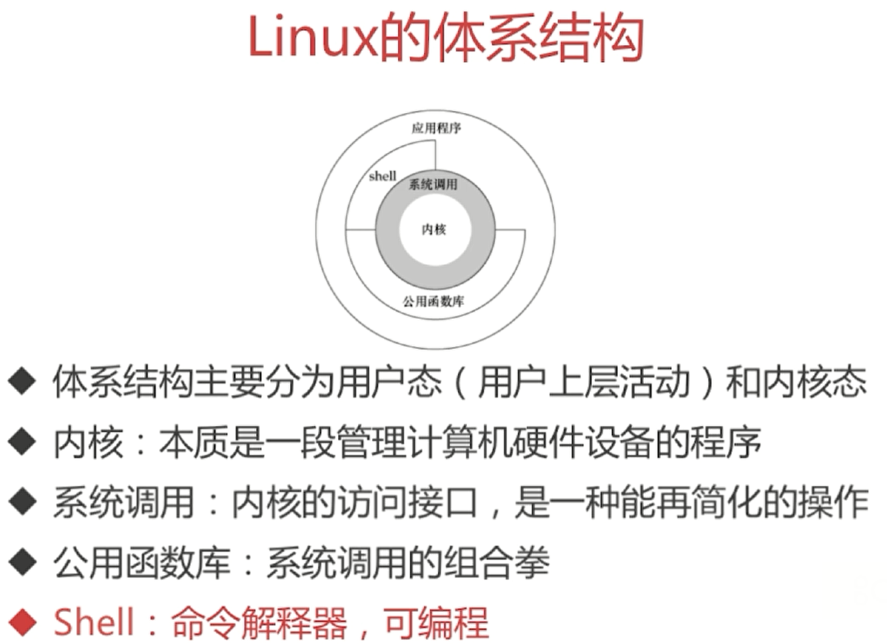
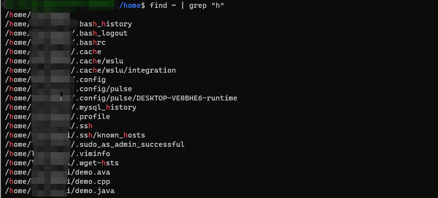
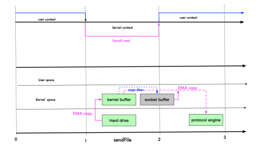

# Linux

## 体系结构

<div align="center"></div>

## 指令

- `man 2 syscalls` \=\=\> 查看所有的系统调用
- `which ls` 查看 ls \=\=\> 所在的位置
- `less 文件` \=\=\> 查看部分文件
- `cat /etc/shells` \=\=\> 查看支持哪些 shells 版本
- `chsh -s shell ==> 路径`，切换为某个 shell

> 查找文件

`find path [options] params` 在指定目录查找文件

```bash
find -name "target.java" # 当前目录为根目录进行搜索

find / -name "target.java" # 全局搜索  / 表示根目录

find ~ -name "target*" # 当前用户 home 目录 以 target 打头的文件

find ~ -iname "target*" # 不区分文件大小写查找
```

> 检索文件内容

`grep [options] pattern file`

- 全称：Global Regular Expression Print
- 作用：查找文件里符合条件的字符串，只会筛选目标字符所在的行。

```bash
grep "moo" target* # 在 target 开头的文件中 查找 moo；默认在当前目录查找
```

<div align="center"></div>

<div align="center"></div>

> 管道操作符 `|`

- 可将指令连接起来，前一个指令的输出作为后一个指令的输入；只处理前一个命令的正确输出，不处理错误输出。

- 如：查找文件中，文件名包含 h 的文件

<div align="center"></div>

- 从日志中筛选信息
- `grep 'demo\[true\]' de.log` 从日志中筛选 demo[true] 的数据 
- `grep -o 'engine\[[0-9a-z]*\]'` 筛选出正则表达式中的内容
- `grep -v 'grep'` 过滤掉包含 `grep` 的内容

> 对文件内容做统计

`awk [option] 'cmd' file`

- 一次读取一行文件，按输入分隔符进行切片，切成多个组成部分
- 将切片直接保存在内建的变量中，`$1$2...（$0表示行的全部）`
- 支持对单个切片的判断，支持循环判断，默认分隔符为空格

```bash
# 查看 demo.txt 中 第一列 和 第三列的信息
awk '{print $1,$3}' demo.txt

# 打印第一列等于 TCP，第三列等于 sf 的第0列的信息
awk '$1=="tcp" && $3=="sf" {print $0}' demo.txt 

# 对内容逐行做统计操作
```

> 批量替换文本内容

`sed [option] 'sed command' filename`

- 全名 stream editor，流编辑器
- 适合用于对文本内容进行处理

```bash
# 将 replace.java 中的 Str 开头的替换为 String，默认时把替换的结果输出到控制台
sed 's/^Str/String/' replace.java

# -i 则会将文本中的内容替换
sed -i 's/^Str/String/' replace.java

# 筛选出 . 结尾的行，并将 . 替换为 ;
sed -i 's/\.$/\;/' replace.java

# 筛选出包含 Jack 的字符串行，并将 Jack 替换为 me g表示全局替换，即所有的 Jack 都替换为 me
sed -i 's/Jack/me/g' replace.java

# 删除文本中的 Integer 所在的行
sed -i '/Integer/d' replace.java
```

> stat 查看文件时间

mtime（modify）最后一次修改的时间；

atime（access）最后一次访问的时间；

ctime（change）最后一次修改状态的时间，如使用 chmod 修改权限；

```shell
xxxx@xxxx:~$ stat nohup.out
  File: nohup.out
  Size: 106445          Blocks: 216        IO Block: 4096   regular file
Device: 810h/2064d      Inode: 33866       Links: 1
Access: (0600/-rw-------)  Uid: ( 1000/rootuser)   Gid: ( 1000/rootuser)
Access: 2022-02-25 17:17:26.586083900 +0800
Modify: 2022-02-25 23:12:31.006083900 +0800
Change: 2022-02-25 23:12:31.006083900 +0800
 Birth: -
```

> 网络相关

netstat -anp | grep 端口号 查看端口号状态。

nload 监控网络带宽；

## 启动过程

<b>1️⃣BIOS 开机自检</b>

对基础硬件环境进行开机自检，如：CPU，HDD，Memory，主板等， 根据启动顺序（默认硬盘启动）进行启动，只有自检通过才会进行下一步动作

<b>2️⃣启动引导过程</b>

系统启动后，会从硬盘 0 柱面 0 磁头 1 扇区（MBR 主引导程序）读取引导启动程序（Boot loader）用于引导操作系统启动，当 MBR 加载到内存之后，BIOS 将控制权交给 MBR（MBR 中最主要的功能就是存储启动引导程序）

MBR（Master Boot Record）主引导程序，占用一个扇区大小共 512 字节，其中启动引导程序（linux 启动引导程序 GRUB2）占用 446 字节，分区表占用 64 字节（每个分区项占用 16 字节，这也是为什么硬盘最大只能分四个主分区的原因），最后还有 2 字节的结束标识

<b>3️⃣加载内核及函数模块（驱动）</b>

linux 内核是以压缩的形成保存在启动系统的 /boot 目录下（被启动引导程序调用加载在内存中），内核会先在内存中进行解压缩，解压缩完成之后，内核会再执行一次自检（linux 一般更信任内核自检）内核的自检过程会记录在 "/var/log/dmesg" 文件中，启动引导程序加载内核之后，就需要内核加载硬件的驱动程序，一般情况下 IDE 接口的硬盘驱动都保存在内核中，可以直接调用（IDE 硬盘基本淘汰）这时候有一个问题，如果内核加载了所有的驱动程序，那么内核会非常大，linux 的解决方案是把常用的驱动加载在内核中，把不常用的驱动做成函数模块加载放在 /boot/lib/modules 文件中，需要的时候进行调用。

<b>4️⃣调用 init 进程</b>

在硬件驱动成功后，Kernel 会主动调用 init 进程（/sbin/init），而 init 会取得 runlevel 信息；

init 执行 /etc/rc.d/rc.sysinit 文件来准备软件的操作环境（如网络、时区等）；

init 执行 runlevel 的各个服务的启动（script 方式）；

init 执行 /etc/rc.d/rc.local 文件；

<b>5️⃣登陆</b>

init 执行终端机模拟程序 mingetty 来启动 login 程序，最后等待用户登录。

## 进程

### 进程启动过程

当你在 shell 中敲入一个命令要执行时，内核会帮我们创建一个新的进程，它会先在新进程的进程空间里面加载进可执行程序的代码段和数据段，然后加载进动态连接器（在 Linux 里面通常就是 /lib/ld-linux.so 符号链接所指向的那个程序，它本省就是一个动态库）的代码段和数据。在这之后，内核将控制传递给动态链接库里面的代码。动态连接器接下来负责加载该命令应用程序所需要使用的各种动态库。加载完毕，动态连接器才将控制传递给应用程序的 main 函数。如此，你的应用程序才得以运行。(过程链接表（PLT）,  Global Offset Table（GOT）)

### 可执行文件结构

主要分为：.bss 数据，.data 数据，.text 数据。

### fork

fork 是用于创建子进程的系统调用，其调用一次但是返回两次。返回值大于 0 的为父进程，返回值等于 0 的为子进程，并且各自从 fork 函数处继续执行（在 fork 过程中会有短暂的阻塞）。

子进程基本完全复制父进程：子进程 id 不同，文件描述符有自己的一份拷贝（引用计数会 +1），超时时钟会清零，

另外 linux 在此处使用了copy on write 的技术。

### fork和vfork

fork 是创建子进程的系统调用，子进程会完全复制父进程包括堆栈，它们只是 pid 不同。vfork 也是创建子进程的系统调用，但是其创建的子进程是与父进程共享地址空间的，并且父进程会一直阻塞直至子进程调用 exec 或 exit。

### wait和waitpid

wait 会一直阻塞直到某一子进程终止。waitpid 则可以等待指定子进程终止，还可以设置为非阻塞。

waitpid 中 pid 的含义依据其具体值而变：

- pid==-1 等待任何一个子进程，此时 waitpid 的作用与 wait 相同
- pid >0  等待进程 ID 与 pid 值相同的子进程
- pid==0  等待与调用者进程组 ID 相同的任意子进程
- pid<-1  等待进程组 ID 与 pid 绝对值相等的任意子进程

### 进程和线程

1、启动一个新的进程必须分配给它独立的地址空间，建立众多的数据表来维护它的代码段、堆栈段和数据段，系统开销比较大，而线程不一样，它们彼此之间使用相同的地址空间，共享大部分数据，切换速度也比进程快，效率高，linux 中线程和进程是共用一个数据结构 struct_task 的，所以 linux 中线程也就是 lwp，开一个线程和进程底层都是使用的 clone 函数，只是共享的数据不同，线程共享大部分数据。

2、<span style="color:orange">由于进程之间独立的特点，使得进程安全性比较高</span>，也因为进程有独立的地址空间，一个进程崩溃后，在保护模式下不会对其它进程产生影响，而线程只是一个进程中的不同执行路径。一个线程死掉回收堆空间往往导致连锁反应让整个进程死掉。

3、体现在通信机制上面，正因为进程之间互不干扰，相互独立，进程的通信机制相对很复杂，譬如管道，信号，消息队列，共享内存，套接字等通信机制，而线程由于共享数据段所以通信机制很方便。

> 进程与线程的选择取决以下几点

1、需要频繁创建销毁的优先使用线程；因为对进程来说创建和销毁一个进程代价是很大的。

2、因为对 CPU 系统的效率使用上线程更占优，所以可能要发展到多机分布的用进程，多核分布用线程；

3、需要更稳定安全时，适合选择进程；需要速度时，选择线程更好。

### 线程崩溃一定会导致进程崩溃吗

不一定，一般是因为共享地址空间带来的连锁反应，比如某一个线程堆栈溢出崩溃了，然后线程结束需要回收堆资源，导致其它共享地址空间的线程使用相应数据又发生了堆栈溢出。

### 线程间的共享和私有数据

> 共享数据：

1. <b>文件描述符表</b>（重点）

2. 每种信号的处理方式（SIG_IGN、SIG_DFL 或者自定义的信号处理函数） 

3. 当前工作目录 

4. 用户 id 和组 id

5. 地址空间

> 私有数据：

1. 线程 id 

2. <b>上下文信息，包括各种寄存器的值、程序计数器和栈指针</b>（重点） 

3. <b>栈空间（临时变量存储在栈空间中）</b>（重点）

4. errno 变量 

5. 信号屏蔽字 

6. 调度优先级

### 僵死进程，孤儿进程，守护进程

<b>僵死进程</b>：Linux 中当一个进程结束后还会保留一定的信息，直到告知父进程自己终止了之后才会清除，所以当父进程一直不获取已经终止的子进程的状态时，该子进程就是一个僵尸进程，已经终止但还占用着一定的系统资源。

<b>孤儿进程</b>：父进程已经终止但是子进程还在运行，则这些子进程为孤儿进程，孤儿进程会由 init 进程收养并完成终止状态收集。

<b>守护进程</b>：在后台运行的进程，特点是独立于控制终端，周期性地执行某一任务或等待某一事件发生。

可以通过 top 指令发现僵尸进程，然后 kill。

### 创建守护进程

1、fork 然后 exit 退出父进程，目的是让自己不是进程组组长，以成功调用 setsid。

2、setsid 成为新会话的头头，目的是独立于终端。

3、chdir 修改工作目录

4、重新设置文件权限掩码

5、关闭文件描述符

### 进程调度算法

FCFS（First Come First Serve）：先来先服务。

时间片轮转算法

多级反馈队列算法

Linux 的 CFS 算法

### 抢占进程

可以，两种情况：

1、有进程进入 TASK_RUNNING 状态，可以检查动态优先级进行抢占。

2、时间片到期时也可以被抢占。

### 实时操作系统与非实时操作系统

实时操作系统的内核是内核可抢占，高优先级的任务立刻执行。非实时操作系统的内核是不可被抢占的。

### 线程同步方式

信号量：若信号量为 0 则挂起该线程，否则原子地减一。使用完资源后将信号量原子地加一，若有挂起的线程则将其唤醒。

互斥量：又叫互斥锁，进入临界区需要加锁，离开临界区需要解锁。

条件变量：用于线程间同步共享数据，当某个数据达到指定条件时，唤醒等待这个数据的一个或多个线程。

### 进程通信方式

1️⃣管道（pipe）：管道是一种半双工的通信方式，数据只能单向流动，而且只能在具有亲缘关系的进程间使用。进程的亲缘关系通常是指父子进程关系。

优点：简单方便。

缺点：局限于单向通信的工作方式．并且只能在创建它的进程及其子孙进程之间实现管道的共享。

2️⃣命名管道（FIFO）：有名管道也是半双工的通信方式，但是它允许无亲缘关系进程间的通信。

优点：可以提供给任意关系的进程使用。

缺点：由于其长期存在于系统之中，使用不当容易出错。

3️⃣信号量：信号量是一个计数器，可以用来控制多个线程对共享资源的访问。它不是用于交换大批数据, 常作为一种锁机制,防止某进程在访问资源时其它进程也访问该资源，因此 , 主要作为进程间以及同一个进程内不同线程之间的同步手段。

优点：可作为同步手段。

缺点：无法传递数据。

4️⃣消息队列（message queue）： 消息队列是由消息的链表，存放在内核中并由消息队列标识符标识。消息队列克服了信号传递信息少、管道只能承载无格式字节流以及缓冲区大小受限等缺点。(优先级，大小)

优点：允许任意进程通过共享消息队列来实现进程间通信．并由系统调用函数来实现消息发送和接收之间的同步，从而使得用户在使用消息缓冲进行通信时不再需要考虑同步问题，使用方便。

缺点：信息的复制需要额外消耗 CPU 的时间．不适宜于信息量大或操作频繁的场合。

5️⃣共享内存（shared memory）：共享内存就是映射一段能被其他进程所访问的内存，这段共享内存由一个进程创建，但多个进程都可以访问。共享内存是最快的 IPC 方式，它是针对其他进程间通信方式运行效率低而专门设计的。它往往与其他通信机制，如信号量，配合使用，来实现进程间的同步和通信。

优点：快

缺点：需要用户保证同步

6️⃣信号 ( sinal )：信号是一种比较复杂的通信方式，用于通知接收进程某个事件已经发生，常见的信号。

7️⃣套接字( socket )：套套接字也是一种进程间通信机制，与其他通信机制不同的是，它可用于不同机器间的进程通信。

优点：可以多机间通信。

### 单核CPU多线程程序是否需要考虑加线程锁

需要，单核CPU也可以并发执行多线程程序，也存在同步与互斥场景。

### 死锁发生条件和解除方法

<span style="color:red">死锁发生的四个条件：</span>

- <b>互斥条件</b>：一个资源只能被一个进程使用。
- <b>请求与保持条件</b>：一个进程拥有一个资源，同时又请求另一资源，而另一资源被其它进程占有而使得该进程睡眠，却还保持着原有资源。
- <b>不可剥夺条件</b>：当一个资源被一个进程占有时，另一进程不能抢夺该资源。
- <b>循环等待条件</b>：若干进程形成首尾相接的资源等待关系。

<span style="color:red">解除方法：</span>

- 针对互斥条件：不可破坏
- 针对请求与保持条件：一次分配所有所需资源。
- 针对不可剥夺条件：不可破坏
- 针对循环等待条件：采用合理的资源分配算法，使进程请求资源不形成环路。如给所有资源编号，只有进程获得了编号较小的资源才能请求编号较大的资源。

<span style="color:red">排查死锁：</span>

使用 pstack 工具，查看当前程序各线程栈情况，是不是存在某两个线程一直处于等锁状态。

### 互斥锁，递归锁，读写锁，自旋锁，RCU

1️⃣互斥锁：当需要访问互斥资源时，尝试获取锁，获取失败则睡眠，资源使用完后解锁，然后唤醒睡眠的线程。

2️⃣递归锁（可重入锁）：同一线程可以多次获取一个锁资源，而当所有次数都被释放，其它线程才能获取该锁资源。

3️⃣读写锁：读写锁有三种状态，读状态加锁，写状态加锁，未加锁。读状态锁可以由多个进程占有，而写状态锁只能由一个进程占有且当前没有进程占有读状态锁。

4️⃣自旋锁：当一个线程尝试获取某一锁资源失败时，它不会睡眠，而是忙等待该锁被其他线程释放。好处是效率高，少了睡眠唤醒的开销，缺点是占用 CPU 资源。

5️⃣RCU：Read-Copy-Updata，读数据不需要加锁，需要修改数据时，先拷贝一份，然后等到时机合适的时候通过回调机制将修改后的数据写回原处。

### 用户态和内核态

用户态和内核态是进程运行的两种级别，用户态拥有最低的运行权限，内核态拥有最高的运行权限。

用户态到内核态转变的方式：系统调用，异常，中断。

为什么要区分用户态和内核态？因为用户程序是不可信的，比如对一些硬件进行操作，若操作不当将导致整个系统崩溃，所以这些操作需要交由内核完成。

### gdb常用命令

r-bin 重新开始运行可执行文件

b+num 在第 num 行下断点

n 逐过程单步调试

s 逐语句单步调试

l-num 查看第 num 行开始的原代码

c 继续运行

bt 查看函数调用堆栈

q 退出

### 系统调用开销大的原因

1、上下文切换

2、缓存局部性差

3、回到用户态的时候伴随一次任务调度

4、参数资源安全性检查

## 内存

访问非法内存区域时会发生段错误。

### 页式管理

将内存分成大小一样的页框，以页框为单位进行管理，进程启动的时候只会加载一部分页进物理内存，当某个虚拟内存数据真正被使用的时候才会产生缺页中断将相应的页加载进物理内存中。进行页式管理需要有一个页表进行虚拟地址到物理地址的转换，根据虚拟地址的高位找到相应的页所在的地址，然后根据低位找到数据所在位置。

优点是没有外内存碎片，每个碎片大小不超过一个页。

缺点是缺页中断的产生和选择淘汰页面等都要求有相应的硬件支持。

### 段式管理

将程序的逻辑分成不同的部分，每个部分为一个段，把进程的所有分段都存放在辅存中，进程运行时先把当前需要的一段或者几段装入主存，在执行过程中访问到不在主存的段时再把他们动态装入；

优点是可以分开编写和编译，针对不同的段采取不同的保护策略。

缺点是会产生碎片。

### 段页式管理

段式管理和页式管理的综合，每个段维护了一个页表结构。

缺点：复杂，效率低。

### 检查内存泄漏

内存泄漏就是当分配的内存不再使用后没有得到释放。一般是 new/malloc 后没 delete/free，或系统资源如 socket 没有 close，或基类析构函数没有定义为虚函数。

使用一些工具如 linux 下的 mtrace，或者对 new/malloc 进行统计监测，看 delete/free 次数是否一致。

### 虚拟地址

虚拟内存是计算机系统内存管理的一种技术。虚拟内存技术让每个进程都仿佛自己占用了系统的所有内存空间，而实际上所有进程共享物理内存，每个进程只是把当前需要使用的虚拟内存空间映射到了物理内存上，当实际访问数据时才会触发缺页中断拷贝数据。

这样做的好处是操作系统能更方便更公平地管理内存，每个进程都有相同的虚拟内存大小；其次是扩大了地址空间，每个进程都仿佛自己占用了所有内存空间；然后是在程序需要连续空间时不需要连续的物理空间，只需要连续的虚拟空间即可。

这样做的代价是虚拟地址到物理地址的转换带来了时间消耗；其次页面的换入换出涉及到磁盘 IO，效率很低。

### 页表寻址

页式内存管理就是将内存分成一个个固定长度的页片，操作系统维护一个虚拟内存地址到物理地址映射关系的数据结构，叫做页表。先通过虚拟地址的高位找到页基地址，然后根据低位地址偏移到实际的物理地址。现代操作系统一般都采用多级页表，好处是可以离散存储页表，并且除非4G内存都用满了，否则相比线性页表节省空间；代价是增加了寻址次数。

### 缺页中断

内存分配函数实际只是分配虚拟地址空间，并没有建立与物理内存的映射，当进程访问这些没有建立映射的虚拟地址时，会产生一个缺页中断，中断处理流程则和其它中断一样，缺页中断的处理函数会将相应的页加载到物理内存中。

### 页面置换算法

> 局部页面置换算法：

FIFO：简单，有 belady（抖动） 现象

LRU：效果最好，页面替换开销比较大

CLOCK：效果折中，页面替换开销比较小。将候选替换集合看作一个环形缓冲区，使用某一页面时候将其标志位置1，当需要替换一页时，从当前指针往后走，路过的页面标志位均置为 0，直至遇到第一个标志位为 0 的页面，将其换出。

> 全局页面置换算法：

工作集算法：使用一个时间窗口来表示工作集长度

页面错误高频算法：根据缺页率动态调整工作集长度

### 伙伴系统

Linux 的伙伴系统是为避免外内存碎片而设计的算法，用于管理分配一组连续的物理页框。Linux 中有 11 个页块链表，分别存放 $2^i$ 个连续页框的页块，申请的物理内存会向上取 $2^i$，然后在对应链表中寻找空闲页块，若该链表没有，则去下一个链表寻找，找到后将页块拆分，一部分下放给较小的页块链表，一部分分配使用。称为伙伴有三个条件，页块大小一样，物理地址连续，块必须是从同一个大块中分离出来的；若是伙伴，则可以合并为一个更大的块。

### Linux slab层

Linux 的 slab 缓存是其分配对象的一种机制，其会预先分配好一块块大内存，其中存放缓存对象，申请对象的时候从此处分配，释放对象的时候返还给 slab 层而不归还给伙伴系统。它做了这么几个优化：

（1）会做内存对齐，根据标志设置为缓存行大小对齐，或按指针大小对齐。

（2）以不同的偏移量给缓存着色，使得各个 slab 对象的偏移量不同，在不同的缓存行。

（3）优先使用刚释放的对象，该对象大概率还在缓存中，提高命中率。

### Linux malloc 大内存

Linux malloc 大内存有两种方法，

1️⃣扩展 swap 区：

创建用于交换的磁盘文件；设置 swap 区文件；

2️⃣设置 overcommit：

设置内存分配方式：overcommit_memory 是内核对内存分配的一种策略，它有三个可选值：0、1、2。

- 0 表示内核将检查是否有足够的可用内存供应用进程使用；如果有足够的可用内存，内存申请允许；否则，内存申请失败，并把错误返回给应用进程。
- 1 表示内核允许分配所有的物理内存，而不管当前的内存状态如何。
- 2 表示内核允许分配超过所有物理内存和交换空间总和的内存；

### 字节对齐

字节对齐的原因是很多 CPU 都只从对齐的地址开始加载数据，外部总线每次读取数据也不是一字节一字节地读取的，而是每次读取 4 字节或更多。这样一个 int 型变量若放在奇数地址，那么 CPU 需要读取两次才能解析出这个变量。

### 内存对齐规则

内存对齐有三条规则：

- 每个成员变量在其对齐数的整数倍地址处；
- 每个成员变量的对齐数为编译器默认对齐数和该成员大小的较小值，若该成员为结构体，则其对齐数为该结构体的最大对齐数；
- 结构体的大小为其最大对齐数的整数倍。

\#pragma pack(n) 相关预编译指令可以修改默认对齐数。

### 对象内存分配

A\*a = new A; a->i = 10；在内核中的内存分配上发生了什么？

在栈区分配一个指针大小的空间给 a，然后在堆区分配 A 大小的空间并将分配的空间地址赋值给变量 a，然后根据 a 记录的地址和 i 在类 A 中的偏移量找到 i 的地址，并在该地址上给 i 赋值。

> 一个类，里面有 static，virtual 之类的，来说一说这个类的内存分布？

静态成员：初始化了的在 .data 段，未初始化的在 .bss 段。

函数：在代码段。

虚函数表：在 .rodata 只读数据段。

普通成员：在实例化的对象中按声明顺序排列。

### 大端和小端

大端：低位字节放在高位地址

小端：低位字节放在低位地址

网络字节流：大端

判断方法：使用联合体，union T{int i; char c;}; T t;t.i = 1;判断 t.c 是否为 1，为 1 则为小端。

## IO

### 五种 IO 模型

阻塞 IO：IO 函数处阻塞，什么也不做

非阻塞 IO：IO 函数处立即返回，需要用户轮询是否有数据

IO 多路复用：内核来轮询多个非阻塞 IO 函数，有数据才真正地执行 IO 操作

信号驱动：当数据准备好时，内核发送信号通知用户处理

异步 IO：当有数据时，内核完成 IO 操作，然后通知用户

<b>阻塞 IO：</b>

- <span style="color:orange">优点</span>：可以简单方便的实现 client 和 server 端通信；通常一个 client 连接分配一个线程进行处理。
- <span style="color:orange">缺点</span>：支持的并发 client 连接数较少。
    - 一台机器可以分配的线程是有限的。
    - 大量线程会造成上下文且换过多而影响性能。

<b>非阻塞 IO(NIO)</b>：之所以一个连接 client 分配一个线程是因为处理客户端的读写是阻塞的，为避免该阻塞影响后续新的 client 连接，所以将阻塞逻辑交由单独的一个线程处理。所有的操作都需要内核来支持，NIO 也是由内核来支持的。

- 发起系统调用请求数据的时候，如果内核没有数据就立即返回；返回后等一段时间再向内核请求数据；内核有数据后，就把数据从内核态拷贝到用户态，拷贝完毕后再告诉应用程序数据准备好了。
- BIO 和 NIO 的区别在于等待数据（wait for data）的时候 BIO 是一直等，而 NIO 发现没有数据就立即返回，隔段时间再继续请求，直到请求到数据为止。
- 那么如何区分是有数据返回还是无数据返回？当然是根据返回的状态码来判断啦。NIO 没有数据时返回 EWOULDBLOCK，有数据时返回 OK。
- <span style="color:orange">优点</span>：读取数据时，如果数据未就绪可以直接返回。
- <span style="color:orange">缺点</span>：需要不断轮询询问内核，数据是否已就绪，涉及很多无效的、太频繁的系统调用（system call）

<b>如何改进非阻塞 IO 呢？</b>

核心矛盾在于，NIO 涉及很多次无用的、频繁的系统调用：非阻塞 socket 在 read 时并不知到啥时候数据会准备好，所以需要不断主动询问。如何改进呢？我们让主动询问变成等待通知就可以减少系统调用次数了（等待通知需要内核的支持）。

另一问题是，有办法避免：socket 数量的增加，系统调用成线性关系增加吗？如果可以提供一个可以批量执行系统调用的操作，就可以避免了。=\=\> select、poll。

一个 select 可以管理多个客户端的事件，同时传递多个网络描述符，交给内核，批量执行系统调用。

<b>IO 多路复用主要复用的是什么呢？</b>

- 单线程或单进程同时监测若干个文件描述符是否可以执行 IO 操作的能力，这是网上流行的一种观点。

- 视频中的看法是：IO 多路复用主要复用的是系统调用。从原先非阻塞情况下的多个 client 需要各自多次发送 recvform 系统调用去不断询问内核数据是否就绪，转变成了现在通过一次系统调用 select/poll 由内核主动通知用户那些 client 数据已就绪（read、write、accept 等事件）。大大减少了无效的系统调用次数。

<b>select() 定义</b>

```c
// select 定义
#include<sys/select.h>
#include<sys/time.h>

int select(int maxfdp1, fd_set *readset, fd_set *writeset, fd_set *exceptset, const struct timeval *timeout)
/**
fd_set 存储了被管理的文件描述符，用 bit 数据存储的，每一位表示一个客户端描述符。
maxfdp1：表示被 select 管理的描述符个数。值为最大描述符+1.（不是描述符的最大值）
readset：读事件
writeset：写事件
exceptset：异常事件
timeout：超时时间有三种含义，永远等待(<0)、正常超时(>0)、立即返回(0)
*/
// timeval 结构体
struct timeval{
    long tv_sec; /* seconds */
    long tv_usec; /* microseconds */
}
```

maxfdp1 表示的是描述符的个数，而非最大值。描述符是从 0 开始标记的，如果描述符是 5，那么 maxfdp1 的值就是 6，有六个描述符（0~5，一共六个）

为什么需要 maxfdp1 呢？是为了效率。因为很多情况下用不到 1024 个描述符，内核可以通过不复制那些不需要的描述符来提高效率

<b>poll() 定义</b>

```c
#include<sys/poll.h>

int poll(struct pollfd *fdarray, unsigned long nfds, int timeout) /* returns: count of ready descriptors,0 on timeout, -1 on error */
    
/* pollfd 定义 */
struct pollfd{
    int fd;			/* descriptor to check */
    short events;	/* events of interest on fd */	// 感兴趣的监听的事件
    short revents;	/* events that occurred on fd */ // 就绪的那些事件
}
```

### select 和 epoll

select 和 epoll 都是 IO 多路复用机制，本质都是同步 IO，select 需要每次进行轮询所有关注的 fd（文件描述符） 来获取被激活的 fd，epoll 则每次只会返回被激活的 fd。

Linux 可以通过 ulimit -n xxx 来修改 fd 上限。

### epoll 原理

epoll 有三个函数：

首先是 epoll_create，这个函数会做两件事，一是分配一块连续的物理空间初始化eventpoll 对象，eventpoll 中包含一颗红黑树，一条准备就绪链表和一条溢出链表；二是获取一个匿名文件，分配 struct file 对象和与之对应的 fd，将 eventpoll 对象放在 struct file 中的 private 成员中，这样就可以通过 fd 找到 struct file 从而找到 eventpoll 对象，实现 unix 的一切皆文件。

其次是 epoll_ctl，这个函数可以用于添加，修改和移除事件，以添加为例，首先搜索红黑树判断新添加的 fd 是否已经存在，若不存在则从 slab 层分配一个 epitem 对象挂在红黑树上，然后根据 epitem 创建一个 epoll_entry 对象挂在相应设备的等待队列上，并设置事件发生时的回调函数。回调函数内容为将被激活的事件挂在 eventpoll 的就绪队列或溢出队列上，然后唤醒 epoll_wait。

最后是 epoll_wait，检查就绪队列，是否为空，若不为空则先处理就绪队列，逐个拷贝到用户空间，然后将溢出队列对象挂到就绪队列上；若使用了 LT 模式，则会将拷贝到用户空间的 epitem 再次挂到就绪队列上，下次处理就绪队列时，若发现没有新事件则不拷贝到用户空间。

### epoll 的 ET 模式为什么一定要使用非阻塞 IO

ET 模式下，有读事件的时候必须要将所有数据读完，所以要 read 到返回 EAGAIN 错误。而如果使用阻塞 IO，这个时候线程就会阻塞。

### 为什么要有 page cache，操作系统怎么设计的 page cache

page cache 是将一部分磁盘文件缓存到内存中进行读写，从而减少磁盘 IO。当要读取文件时，先从 page cache 中查找是否有所需文件，若没有命中才到磁盘中读取。写过的内存页会被标记为 dirty page，操作系统会周期性地将 dirty page 回写到磁盘中。

### 软链接和硬链接

硬链接：多个文件项指向同一文件（inode，元数据）

软链接：多个文件项指向不同的文件（不同的 inode 和元数据），但是所指的文件内容是同一文件的路径。

### Linux 定时器

2.6.16 之前使用的是基于系统周期性时钟中断的多级时间轮，精度不高，只能到时钟中断的频率级别。

2.6.16 之后推出了高精度的定时器，使用的是红黑树，利用高精度时钟硬件设置下次中断触发的时间。

### Linux下文件的 cp 和 mv

cp 拷贝了一份文件。在相同的文件系统下，mv 只是修改了几个指针，并没有实质性的拷贝删除文件，所以速度很快；在不同的文件系统下，mv 则拷贝删除了文件，和 cp 等价。

### rm一个正在被使用的文件会发生什么

Linux 每个文件对应有两个计数器，在 inode 结构体中分别是 i_nlink 和 i_count，rm 只会将 i_nlink 减一，所以使用 ls 看不到文件信息，但是正在使用该文件的进程还能操作该文件，因为该文件并没有真正的被删除，当进程关闭该文件资源后，i_count 减一，当这两个计数器均为 0 后才会真正删除该文件。

### 文件 IO 与标准 IO

文件 IO 也叫不带缓冲区的 IO，直接调用 OS 的 IO 系统调用，与特定的 OS 绑定。

标准 IO 是 ANSI C 建立的标准 IO 模型，Linux 下使用的是 GLIBC 库中的 IO 函数，它会为 IO 操作建立一个缓冲区，以减少系统调用的次数。

### 零拷贝

零拷贝的核心是取消内核空间与用户空间之间的拷贝，如 Linux 的 sendfile 系统调用：

<div align="center"><b>2.4 之前</b></div>
<div align="center"><image src="img/image-20220610014321249.png"></div>

<div align="center"><b>2.4 之后</b></div>
<div align="center"></div>

2.4 之后取消了页缓存到 socket 缓存的拷贝，直接传送地址和偏移。

# CPP

## CPP基础语法

### static关键字

首先，无论是全局静态变量还是局部静态变量，只要是初始化了的就在 .data 区，未初始化的就在 .bss 区。使用 static 的场景可以分为以下 5类 ：

1️⃣全局静态变量：全局变量前面加一个 static 即全局静态变量，作用域为其所在的文件，即它对其它文件是不可见的。

2️⃣局部静态变量：在函数体中声明的静态变量，其虽然不会随函数的结束而销毁，但是其作用域和函数体中其它变量一样，在函数外是不可见的。当下一次调用同样的函数时，其值会保持和上次一样。

3️⃣静态函数：在函数名前面加一个 static 即为静态函数，作用域为其所在的文件。

4️⃣类中的静态成员：类中的静态成员需要在类外初始化，它不属于具体的一个该类对象，而是属于整个类，所以使用它也不需要 this 指针。

5️⃣类中的静态函数：类中的静态函数也是属于整个类的，调用它也不需要传入 this 指针，所以函数体中也不能使用类的非静态成员。

局部静态变量代码示例

```cpp
#include<iostream>
using namespace std;
int say(){
    static int i = 0;
    cout<<i++<<endl;
}

int main(){
    say();
    say();
}
/**
0
1
*/
```

### const在内存哪里

被 const 变量修饰的是常量，不可修改，其约束的是编译器的行为，所以它在内存中的布局和普通变量一样在普通的变量区。

### int\*const和const int\*

总的来说的就是 const 在 \* 前面还是后面，当 const 在 \* 前面的时候，const 修饰的是解引用之后的内容，即指针指向的对象是 const 的；当 const 在\*后面的时候，const 修饰的是指针本身，即指针地址是不可修改的。

### 成员函数后面加const

在成员函数后面加 const 是防止该成员函数体内对成员对象进行了修改。这与没有加 const 的函数属于重载，目的是让 const 对象调用 const 方法，非 const 对象调用没加 const 的方法。

### extern

extern 关键字表示其修饰的变量或函数的定义在其它源文件中。

extern “C” 表示接下来的内容按 C 的规则进行编译。比如 C++ 编译器通过修改所有函数的名字实现函数重载机制，C 则是按函数原本的名字进行编译的。

### restrict

restrict，C 语言中的一种类型[限定符](https://baike.baidu.com/item/限定符/1924249)（Type Qualifiers），用于告诉编译器，对象已经被指针所引用，不能通过除该指针外所有其他直接或间接的方式修改该对象的内容。

### C++四种类型转换

1️⃣reinterpret_cast：这个和 C 中的强转一样，没有任何限制。

2️⃣static_cast：用于各种隐式转换，用于 void\* 与其它类型指针之间的相互转化，可用于多态父子类之间的转化但结果未知。

3️⃣dynamic_cast：用于父类指针和子类指针，父类引用和子类引用之间的转化，若目标指针并非父类的子类，则会返回空，它是通过运行时类型推断实现的。

4️⃣const_cast：用于将 const 转为非 const 类型。

### 隐式转换

没有显示类型转换的转换都是隐式转换，如内置类型低精度的变量赋值给高精度的变量会发生隐式转换，如传给一个类的构造函数的变量若不是该类构造函数规定的参数类型的话也可能发生隐式转换。

### new/delete和malloc/free的区别

new/delete 是 C++ 关键字，需要 C++ 编译器支持。malloc/free 是 C 标准库函数，需要包含相应的头文件。

new 实际分为两步，第一步分配内存，第二步调用类的构造函数；delete 同理，第一步调用类的析构函数，第二步释放内存。这里分配和释放内存底层很多时候是用 malloc/free 实现的。而 malloc/free 只是分配和释放内存。

new 返回的是对象的指针。而 malloc 返回的是 void 型指针。

new 失败后会抛出 bad_alloc 异常，并且可以使用 set_new_handler 设置 new 失败时会调用的回调函数。而 malloc 失败后会返回空指针。

### class和struct区别

class 的默认访问权限和默认继承权限都是 private，struct 的默认访问权限和默认继承权限都是 public。

### C++类可以定义引用数据成员吗

可以，必须使用初始化列表初始化。

### 为什么用成员初始化列表会快一些

对于内置类型而言，效率没有区别；

对于用户定义的类而言，因为进入构造函数体后，所有对象都需要已经构造好，所以在之前会调用一次默认构造函数，然后在构造函数体内再调用一次特定构造函数，这就会造成多调用了一次构造函数，损失效率。

## CPP思想

### C++和C的区别

从设计思想上来说，C++ 是面向对象的语言，C 是面向过程的语言。从语法上来说，C++ 具有面向对象的封装，继承，多态特性；增加了许多类型安全机制，如四种类型强制转换；支持泛型编程，如模板类，函数模板。

### 面向对象

通俗来说，面向过程就是一件事该怎么做，面向对象就是什么事交给谁做，举个例子，面向过程编程就是造一台电脑，面向对象编程就是组装一台电脑。面向对象有三个特性，封装，继承和多态。封装就是将数据和对这些数据的操作集合在一起，并只对外暴露一些接口；继承可以让另一个类获得某一个类的属性和方法；多态则可以让同一个操作在不同的对象上表现出不同的效果。

### 面向对象三大特性

封装：封装就是将数据和对这些数据的操作集合在一起，将实现与对外只暴露一些接口。

继承：可以让某一个类获得另一个类的属性和方法，增加了代码的可重用性。

多态：同一个操作在不同对象上表现出不同的效果，使用虚函数实现。在 C++ 中就是用虚函数实现的多态。虚函数调用是一种只知道部分信息完成工作的机制，用户只需知道接口而无需知道具体对象，其实现依赖的是虚函数表，有虚函数的类中会有一个指向虚函数表的指针，当一个派生类自己实现了父亲的虚函数后，会将该函数在继承到的虚函数表中的地址改写为其重写的虚函数的地址。

## 指针

### 指针和引用的区别

指针是对象内存的地址，引用是对象的别名。

### 指针和数组的区别

指针是某一对象在内存中的地址，数组是相同类型数据的集合，数组名指向集合的首地址。

### 野指针

也叫悬挂指针，指向的是已经被释放的内存空间。

### 函数指针

C 在编译的时候所有函数都有一个入口地址，函数指针指向的则是某一个函数的入口地址。可用于调用函数或作为函数的参数传递。

### 虚表指针初始化

虚表指针在构造函数中初始化。

## C++11

### 四种智能指针

1️⃣auto_ptr：C++98 标准的方案，已经弃用。

2️⃣unique_ptr：独占指针，不允许将一个 unique_ptr 的左值对象赋给另一个 unique_ptr 对象，但是右值可以。

3️⃣shared_ptr：共享指针，多个 shared_ptr 对象可以指向同一对象，其中一个 shared_ptr 对象销毁时并不会销毁其指向对象，而是将引用计数-1，当引用计数为 0 时，才真正销毁所指向的对象。

4️⃣weak_ptr：这是一种不控制对象生命周期的智能指针，其指向一个shared_ptr 管理的对象，但是它的构造和析构不会使 shared_ptr 的引用计数增减。设计这种智能指针的目是为了解决两个类中使用 shared_ptr 交叉引用造成的内存泄漏的问题。

### std::weak_ptr::lock存在的意义

获得一个可用的 shared_ptr 对象，因为 weak_ptr 是一个观测者的身份，并没有重载 \* 和 ->，如果引用计数为 0 则返回一个空的 shared_ptr 对象。

### 左值和右值

右值一般指表达式结束就会消亡的对象，如临时变量。左值一般指表达式结束还会存在的变量。

右值无法取址而左值可以；右值无法赋值而左值可以。

C++11 引入右值引用主要是为了转移语义，消除两个对象交互时的不必要拷贝。

### C++11新特性

常用的：auto 关键字，nullptr 关键字，智能指针，右值引用，多线程，lambda 表达式，可变长模板。

### lambda表达式原理

编译器通过创建匿名类并重载()操作符实现，捕获列表则通过私有成员实现，将捕获列表参数作为私有成员保存。

### 原子变量fetch_add接口

原子变量的 fetch_add 接口是利用 CAS 实现的，CAS 是一项乐观锁技术。乐观锁是指认为数据访问不会冲突，只有在更新数据的时候才去检查冲突。CAS 底层则是汇编代码 cmpxchg。

### std::move和std::forward

首先是引用折叠，对于左值 T（A&），不管T后面加多少个 & 都会被折叠成左值，对于右值 T（A&&），T 后面加奇数个 & 会被折叠成左值，加偶数个 && 会被折叠成右值。

因此，move 作用是将左值转成右值，它首先使用 remove_reference 利用偏特化获得去除 & 后的原始类型，然后用 static_cast 转换成右值。

而 forward 用作完美转发，直接 static_cast<T&&> 即可，左值 T（A&）折叠成左值，右值 T（A&&）折叠成右值。

## 函数

### 多态和虚函数

<span style="color:orange">多态就是同一个操作作用于不同的对象可以产生不同的效果</span>，在 C++ 中就是用虚函数实现的多态。虚函数调用是一种只知道部分信息完成工作的机制，用户只需知道接口而无需知道具体对象，其实现依赖的是虚函数表，有虚函数的类中会有一个指向虚函数表的指针，当一个派生类自己实现了父亲的虚函数后，会将该函数在继承到的虚函数表中的地址改写为其重写的虚函数的地址。

### 怎么用C实现虚函数

仿照 Linux 中虚拟文件系统的做法，结构体中有一个 op 对象，里面都是各种函数指针，不同的文件系统实现不同的函数，然后赋值给该函数指针。

### 析构函数为何必须是虚函数，C++默认的为何不是虚函数

将可能会被继承的父类的析构函数设置为虚函数，可以保证当我们 new 一个子类，然后使用基类指针指向该子类对象，释放基类指针时可以释放掉子类的空间，防止内存泄漏。

C++ 默认的析构函数不是虚函数是因为虚函数需要额外的虚函数表和虚表指针，占用额外的内存。而对于不会被继承的类来说，其析构函数如果是虚函数，就会浪费内存。因此 C++ 默认的析构函数不是虚函数，而是只有当需要当作父类时，设置为虚函数。

简而言之：delete 父类指针时必须要调用子类的析构函数。若默认是虚函数则每个类都需要引入虚函数表，没有必要。

### 重写重载和隐藏

重载：函数名和返回值相同，参数列表不同。

重写：不同层级的类中实现的不同的虚函数。

隐藏：不同层级的类中实现的同名函数。

### 析构函数

当一个对象生命期结束的时候会调用它的析构函数，析构函数的调用顺序为：派生类的析构函数->成员对象的析构函数->父类的析构函数。

且析构函数可以是纯虚函数。

### C语言如何进行函数调用

将函数参数压栈；C 参数的压栈顺序是从右往左

将函数返回值压栈；

将栈帧指针（ebp 寄存器值）压栈；

移动栈顶和栈帧指针，为函数创建一个新的栈帧。

### 为什么从右往左压栈

对于可变长参数，从左往右压栈编译器难以确定明确参数的地址，而从右往左，则最左的参数地址就是栈帧指针加上一个返回值的长度。

### C++如何处理返回值

生成一个临时对象返回。不过现代编译器大多有RVO机制，直接在函数返回处构造对象

### 获取某一成员偏移量

```cpp
#define  offsetof(TYPE,MEMBER) ((size_t)&((TYPE*)0) ->MEMBER)
```

## C++模型

### 虚函数表实现多态

子类继承父类之后，如果重新实现了虚函数，会替换掉虚函数表中的相应的函数指针，从而实现多态。

### memory_order

```cpp
{
    memory_order_relaxed, //不对执行顺序做保证
    memory_order_acquire, //本线程中,所有后续的读操作必须在本条原子操作完成后执行
    memory_order_release, // 本线程中,所有之前的写操作完成后才能执行本条原子操作
    memory_order_acq_rel, //同时包含 memory_order_acquire 和 memory_order_release
    memory_order_consume,// 本线程中,所有后续的有关本原子类型的操作,必须在本条原子操作完成之后执行
    memory_order_seq_cst // 全部存取都按顺序执行
 } memory_order;
```

## STL

STL 的组成：容器，迭代器，分配器，算法，仿函数，配接器六个部分。

### vector和list区别

都是线性容器，但是 vector 是顺序表，list是链表。vector 支持随机访问，list 只支持顺序访问。vector 插入数据的时间复杂度为 O(n)，list 插入数据的时间复杂度为 O(1)。

### map和set的区别

区别：map 是键值对容器；set 是数据集合。map 的迭代器 key 是不可修改的，value 可修改；set 的迭代器是不可修改的。

实现：底层都是使用红黑树实现的，set 的 key 就是 value。因为都是使用红黑树实现的，所以数据都是有序的，也所以 set 的迭代器是 const 型的，map 的迭代器的 key 是 const 的，因为修改 key 值会影响红黑树的有序性。

### STL的allocator

是 STL 中广泛使用的对象配置器，提高了对象创建和销毁的效率。

在 C++ 中，new 实际分为两步，第一步分配内存，第二步调用构造函数，delete 也分为两步，第一步调用析构函数，第二步释放内存。STL 为了分工精细，使用配置器分配内存，使用 construct 函数和 destroy 函数处理对象的构造和析构。配置器分为两层，当所需内存大于 128Byte 时使用第一层配置器，使用标准库中的 malloc，realloc，free 等函数；小于等于 128Byte 时使用第二级配置器，其使用了内存池技术，以 8Byte 为单位分为了 16 种大小的槽位，每个槽位管理一个空闲链表，当空闲链表中没有空闲内存块时则从内存池中取一定数量的内存块放到空闲链表中。这里的空闲链表并没有多占用一点内存，其将 next 指针和内存块的头数据放在一个 union 中，避免了内存浪费。

### map释放内存

因为小于 128Byte 的数据内存是用二级配置器申请的，使用完后会放回内存池，并没有真正释放，所以需要和临时空 map 对象 swap 后销毁临时 map 对象。

### 迭代器的作用

迭代器的主要目的是将容器和算法分离，迭代器让容器的数据访问和遍历操作一致，这样算法使用迭代器对数据进行操作和遍历，就不需要关心具体的容器类型，适用性也就更强。

### STL迭代器删除元素

STL 使用 erase 删除迭代器内容。对于序列容器来说，erase 返回所删除的迭代器的下一迭代器，但删除迭代器元素会导致后面迭代器均失效。对于关联容器来说，erase 会导致被删除的迭代器失效，但是其它迭代器内容不失效。对于 list 来说，erase 会返回迭代器的下一迭代器，且其它迭代器均不是失效。

[STL 中 使用迭代器删除元素的问题 - mengmee - 博客园 (cnblogs.com)](https://www.cnblogs.com/liumeng-blog/p/7573692.html)

### resize和reserve

resize 改变的是 size 值，变小则后面的元素舍弃掉，变大则后面的元素默认初始化；

reserve 改变的是容量 capacity，不增加元素。

## 编译

### C++源文件到可执行文件

C++源文件—>（<b>预处理阶段</b>）—>宏展开后的源文件—>（<b>编译阶段</b>）—>汇编文件—>（<b>汇编阶段</b>）—>可重定位的二进制文件—>（<b>链接阶段</b>）—>可执行文件

### include中“”和<>的区别

预处理阶段寻找头文件的目录不同。

使用双引号会先从当前目录寻找头文件，然后从编译器指定目录寻找头文件，最后从标准库目录下寻找头文件。

使用尖括号则只会从编译器指定目录和标准库目录下寻找头文件。

标准库目录一般是 usr/include。

### G++和GCC的区别

1️⃣.c 文件被 gcc 当做 C 文件编译，g++ 当做 C++ 文件编译；.cpp 文件都会被当做 C++ 文件编译。

2️⃣g++ 在编译阶段调用的是 gcc，链接则由自己完成。

3️⃣如果后缀是 .c，使用 gcc 编译器，才不会定义 __cplusplus 宏。

4️⃣extern “C” 与 gcc 和 g++ 无关。

## 标准库

### malloc 原理

大于 128k 时候从 mmap 区申请内存，free 直接归还内存。

申请小于 128k 的时候首先会从空闲链表中寻找合适的内存块，glibc 的 malloc 管理三组链表，fast bins，unsorted bins 和 bins，fast bins 存放的是小内存块，一般是小于 64Byte 的，如果 fast bins 中没有的话就去 unsorted bins 中找，还没有则在 bins 中找，再没有就使用 brk 系统调用从堆区中申请内存。