# 杂记

## bitmap

[Bitmap简介 - 废物大师兄 - 博客园 (cnblogs.com)](https://www.cnblogs.com/cjsblog/p/11613708.html)

- 开源实现
    - jdk 的 java.util.Bitset
    - 谷歌的 EWAHCompressedBitmap
    - redis 的 bitmap
- 优点
    - 排序、查找、去重等运算效率高
    - 占用内存空间低
- 缺点
    - 结果数据不能重复，相当于就是去重过的数据
    - 如果数据只有两个：1 和 1008611 使用 bitmap 十分浪费空间。<b>只有当数据比较密集的时候使用 bitmap 才有优势。</b>

## 判断数据是否存在

如何判断一个数是否在 40 亿个整数中 / 如何从 2 亿个手机号中判断某个手机号是否存在。

- set 判断，耗内存，需要大内存的机器或多台机器。
- bitmap，40 亿个不重复的 int，一个 int 4 字节，开 $2^{32}$ 位的 bitmap。用位的值 0 还是 1 表示值为该索引的整数在不在。内存占用上，$2^{32}$ 个 bit，相当于 $2^{29}$ 个字节大概 500mb

# 网络

自顶向下；看书补充

> OSI开发式互联参考模型

<div align="center">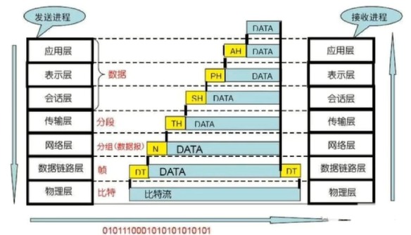</div>

## 网络编程

### Reactor 模型

一般来说，Reactor 模型有三种角色，一个是 accptor，一个是 reactor，一个是 handler。通过 acceptor 向 reactor 注册关注的事件，当事件发生时，reactor 将事件交给相应的 handler 处理执行相关业务逻辑。本质上就是将关注的事件与相应回调函数关联，事件发生时执行相应回调函数。

与 Proactor 的核心区别就是 Reactor 处理的是未完成 IO 的事件，而 Proactor 处理的是已完成 IO 的事件或信号。

### UDP socket 编程主要函数

服务端：socket(), bind(), recvfrom(), sendto(), close()

客户端：socket(), sendto(), recvfrom(), close()

### UDP 的 connect 函数

<span style="color:orange">TCP 的 connect 函数用来三次握手建立 TCP 连接，而 UDP 的套接字使用 connect 函数作用仅仅是记录对端的 IP 和端口号。</span>

### TCP 的 connect 函数

TCP 中的 connect 函数用于三次握手建立 TCP 连接。

阻塞方法：发送 SYN 报文段，收到 SYN, ACK 报文段后，发送 ACK 报文段然后返回。

非阻塞方法：首先判断返回值，-1 的话检查错误码，如果是 EINTR，则重新 connect，如果是 EINPROGRESS，则说明正在连接中，其余错误码则说明连接出现错误。之后使用 epoll 检查是否有写事件发生（accept 检查的是读事件），有的话使用 getsockopt 检查错误，没有错误则连接建立成功。

### read 和 write

一、read

1、阻塞与非阻塞：

阻塞的 read 在有数据时返回，没有数据时阻塞；

非阻塞的 read 在没有数据时返回 -1，错误码为 EAGAIN 或 EWOULDBLOCK（其实这个就是 EAGAIN，数值一样 #define EWOULDBLOCK EAGAIN）；

2、返回值：

返回值大于 0，正常；

返回值等于零，读到 FIN，一般关闭连接；

返回值小于零，错误码 EINTR 表示被信号中断，一般会重新调用 read；错误码EAGAIN 或 EWOULDBLOCK 表示当前没有数据。

二、write

1、阻塞与非阻塞：

阻塞的 write 在缓冲区空间足以发送所有数据时才返回；

非阻塞的 write 在缓冲区空间不够时只写一部分，然后返回写了的长度，之后再调用则返回 -1，错误码 EAGAIN 或 EWOULDBLOCK。

2、返回值：

返回值大于 0，正常；

返回值等于 0，套接字已经关闭；

返回值小于 0，错误码 EINTR 表示被信号中断，一般会重新调用 write；错误码EAGAIN 或 EWOULDBLOCK 表示当前缓冲区没有空间。

## TCP/UDP/IP

### TCP 可靠数据传输

保证数据没有在传输中变化：校验和

保证数据的送达：序号和确认号，超时重传

保证接收方缓存足够接收数据：流量控制

保证数据发送不引起网络拥堵：拥塞控制算法，包含慢启动，拥塞避免，快恢复

保证连接和断开时的可靠：三次握手，四次挥手

### 拥塞控制

慢启动：将拥塞窗口大小设为 1 个 MSS，每个确认报文段到来时，将拥塞窗口大小 +1 个 MSS。该状态拥塞窗口呈指数增大，每个 RTT 增大一倍。超时时重新开始慢启动，拥塞窗口设为 1，收到三个冗余 ACK 时启动快恢复，拥塞窗口减半，这两种情况将慢启动阈值设为拥塞窗口的一半。当拥塞窗口等于慢启动阈值时进入拥塞避免状态。

拥塞避免：每过一个 RTT 将拥塞窗口 +1 个 MSS。超时时重新开始慢启动，拥塞窗口设为 1，收到三个冗余 ACK 时启动快恢复，拥塞窗口减半，这两种情况将慢启动阈值设为拥塞窗口的一半。

快恢复：实际是相对慢启动而言的，拥塞窗口不是从 1 开始，而是从当前窗口的一半开始执行拥塞避免算法。

### 三次握手，四次挥手

三次握手：客户端首先发送一个 SYN 报文段，进入 SYN_SENT 状态，服务端收到后回送一个 SYN, ACK 报文段，进入 SYN_RCVD 状态，客户端收到后回送一个 ACK 报文段同时可以开始发送数据并进入 ESTABLISH 状态，服务端收到 ACK 报文段后也进入 ESTABLISH 状态。

四次挥手：客户端首先发送一个 FIN 报文段，进入 FIN_WAIT1 状态，服务端回送一个 ACK 报文段进入 CLOSE_WAIT 状态，客户端收到 ACK 后进入 FIN_WAIT2 状态，然后服务端数据发送完后回送一个 FIN 报文段进入 LAST_ACK 状态，客户端收到后发送一个 ACK 报文段然后进入 TIME_WAIT 状态，等待一定时长后关闭连接，服务端则在收到 ACK 报文段后断开连接。

> TCP 为什么不可以两次握手

两次握手意味着服务端收到 SYN 报文段后即认为连接已经建立，并为其维护相关系统资源。但客户端在发送 SYN 报文段后可能由于网络原因服务端的 SYN, ACK 报文段并没有送达客户端，此时客户端不认为连接已经建立也不会发送数据，服务端则将维护相关系统资源一段比较长的时间，造成浪费。

>TCP 握手为什么不用四次

TCP 是全双工通信，原本的握手模型确实应该像挥手一样进行四次的，但是服务端回复 ACK 和发送 SYN 之间并没有联系，所以可以合并为一次发送，故 TCP 握手只需要三次。

> TCP 三次握手初始序列号为什么不用固定值

防止串话，防止上一个连接的分组在本次连接建立后才传来并且在同一个窗口中。

### TCP 的 Keepalive

服务端每过一段时间（两小时）会发送一个心跳包（ACK 报文段，序号为当前序号 -1）；	正常情况下客户端回送一个 ACK 报文段；

客户端异常掉线（断电之类的），则服务端每过一定时间（默认 1000ms）发送一次心跳包，重复一定次数后关闭连接；

客户端断电之后 OS 又重启了，则 OS 会帮助回送一个 RST 报文段。

### SYN 洪泛攻击

攻击者发送大量的 SYN 报文段，而不完成第三次握手的步骤。随着这种 SYN 报文段纷至沓来，服务器不断为这些半开连接分配资源，导致服务器的连接资源被消耗殆尽。现在有一种有效的防御系统，称为 SYN cookie。

当服务器收到一个 SYN 报文段时，服务器不会为该报文段生成一个半开连接。相反，服务器生成一个初始 TCP 序列号，该序列号是 SYN 报文段的源和目的 IP 地址与端口号通过仅有服务器知道的哈希函数算得。重要的是，服务器并不记忆该 cookie 或任何对应与 SYN 的其它状态信息。（之前三次握手讲的方法分配了缓存和变量，即记录了状态信息）

如果客户是合法的，那么它将返回一个 ACK 报文段，当服务器收到 ACK，需要验证该 ACK 是否与前面发送的某些 SYN 相对应（之前三次握手讲的方法分配了缓存和变量所以不需要验证）。做法是将 SYNACK 报文段中的源和目的地IP地址与端口号执行同样的哈希函数，如果结果 +1 与 SYNACK 报文段中的确认号相同的话，则认为该 ACK 对应于较早的 SYN 报文段，因此它是合法的，生成一个具有套接字的全开的连接。

### TIME_WAIT 的作用

确保最后一个 ACK 报文段成功发给服务端。

确保网络中迷途的报文段消逝，防止串话。因为有的网路可能出现问题，导致之前的一些分组没有成功送达，然后触发超时重传。而后当前连接断开后又重新建立了一个新连接，此时之前的分组可能会发送过来，造成串话。等待一个 2MSL 时间，是因为IP数据报中有一个生存时间，当数据报在网络中传输了一定跳数还没到达目的地的话就会丢弃该数据报，等待 2MSL 时间可以确保分组已经被网络丢弃。

Linux 可以用 netstat 命令查看

可以修改 sysctl.conf 配置文件：

net.ipv4.tcp_tw_reuse = 1, TIME_WAIT 状态套接字可立即用于建立新连接；

net.ipv4.tcp_tw_recycle = 1, 操作系统加快 TIME_WAIT 状态套接字的回收；

net.ipv4.tcp_fin_timeout = 30, 设置 time_wait 等待时间。

### 出现大量 CLOSE_WAIT 状态的原因及解决办法

CLOSE_WAIT 状态出现于收到FIN报文段但一直没有回送 FIN 报文段的时候，一般是因为服务端处于忙读等状态，所以要处理好断开连接的情况，在 read 返回值为 0 或 read 返回值小于零查 errno 不是 EAGAIN 就断开连接。

### 路由选择算法

Dijkstra；

距离向量算法：不时地像相邻节点发送自己的距离向量副本，收到副本的节点使用 Bellman-Ford 方程更新自己的距离向量副本。

### 端口号最大值

端口号最大为 65535，因为运输层报文段头部存放端口号的字段占 16 位。

### MTU 和 MSS

MTU：Max Transmit Unit，是数据链路层的特性，限制了网络层每次最大的传输数据大小。

MSS：Max Segment Size，是传输层对应用层每次最大传输数据大小的限制，不包含 TCP 和 IP 头部，若 MTU 为 1500，则 MSS 为 1500-20-20=1460.

### 网络层分片

数据链路层有 MTU 的限制，若 IP 数据报比 MTU 要大，则需要分片传输。

实现上，有一个标识位，表示原始报文段的序号；有一个标志为，表示当前分片是否为最后一个分片；有一个分片偏移，表示当前分片在原始报文段的位置。

## HTTP

### HTTP 协议

HTTP 协议是一种基于 TCP 的，无状态的应用层传输协议。它基于 B-S 和 C-S 架构，定义了一种文件传输格式：请求报文包含请求行，请求头，和请求包体；响应报文包含状态行，响应头，和响应包体。

### HTTP 1.0/1.1

HTTP 1.1：

- 默认长连接；
- 增加管线化，可以同时发出多个请求，无需一个个等待响应；
- 完善 cache 机制，过期的页面不会删除，而是改为 stale 对象，与服务器重新激活；
- 增加断点续传；
- 增加错误码；

### HTTP 返回码

1xx：信息性状态码	 100：continue

2xx：成功状态码    200：OK

3xx：重定向状态码

4xx：客户端错误状态码   404：页面不存在

5xx：服务端错误状态码   503：服务不可用

### HTTP 和 HTTPS 的区别

HTTPS 并不是新的协议，而是 HTTP 先与 SSL 通信，然后再和 TCP 通信。

使用 HTTP 的话，因为是明文传输，所以内容可能被窃听；也无法保证内容完整性，即无法保证内容没有被第三方篡改；没有验证对方身份，因而可能遭遇伪装。

HTTPS 的网站用 HTTP 打开会怎么样？一般的网站会返回301重定向响应报文。

### HTTPS 原理

1、浏览器向服务器 443 端口发送请求，并携带浏览器支持的哈希算法和加密算法。

2、服务器选择一种哈希算法和加密算法，然后将数字证书发给浏览器。

3、浏览器从内置的可靠机构列表中找到相应机构的公钥，解密数字证书，获得服务器公钥，然后生成随机数，使用服务器公钥加密发给服务器。

4、服务器使用私钥解密后使用随机数生成公钥，然后之后使用对称加密与浏览器进行通信。

 ### GET 和 POST 区别

1、语义上，GET 用于获取服务器资源，POST 用于向服务器修改或提交数据，比如 restful 风格中就规范了 POST 的使用，只用于新建而 GET 用于查询数据，不改变数据的状态。

2、限制上，浏览器一般会限制 GET 方法的 url 长度，而 POST 方法的 url 在请求包体中。（<span style="color:orange">注意，是浏览器限制了 GET 方法的 url 长度</span>）

3、速度上，GET 方法更快，因为 GET 方法和 POST 方法请求流程不同，GET 方法是将头和包体一次发给服务端，然后服务端回复一个 200 OK；而 POST 方法是先发送头部，服务端回复一个 100 continue，然后浏览器再继续发送包体，最后服务端回复一个 200 OK。另外，GET 方法会被浏览器缓存，进一步提高了速度。

### Restful

Restful 是一套 web api 设计风格，不是标准，它的核心是面向资源而不是面向操作，所以 restful api 的设计风格是使用 URL 定位资源，使用 HTTP 动词（GET,PUT,POST,DELETE 等）描述操作。

如果以操作为中心，容易设计出需要前置操作的操作，这种操作多了系统就乱了，而以资源为中心的话就很容易切断这些关联，并且以资源为中心也更容易设计缓存系统和规范一致的 URL。

### Cookie 被禁用怎么实现 HTTP 的状态化

对于会话 coockie 来说：URL 重写，在后面加上 sessionID；

### XSS

过分信任服务器发来的代码,让服务器代码随意在浏览器上执行.

反射型：伪造出恶意 URL，服务器根据该 URL 修改页面的某些内容并发过来,而这部分内容会造成攻击.

存储型：向服务器提交有恶意代码的内容(如论坛内容)，之后的人访问就会被攻击.

### 跨域问题

* 只要协议、主机、端口之一不同，就不同源，例如
    * http://localhost:7070/a 和 https://localhost:7070/b 就不同源，它们使用的协议不一样。
* 同源检查是浏览器的行为，而且只针对 fetch、xhr 请求
    * 如果是其它客户端，例如 Java http client，postman，它们是不做同源检查的
    * 通过表单提交、浏览器直接输入 url 地址这些方式发送的请求，也不会做同源检查
* 更多相关知识请参考
    * [跨源资源共享（CORS） - HTTP | MDN (mozilla.org)](https://developer.mozilla.org/zh-CN/docs/Web/HTTP/CORS)

解决跨域问题的方式一般有两种。

<b>请求响应头解决</b>

<div align="center"></div>

* fetch 请求跨域，会携带一个 Origin 头，代表【发请求的资源源自何处】，目标通过它就能辨别是否发生跨域
    * 我们的例子中：student.html 发送 fetch 请求，告诉 tomcat，我源自 localhost:7070
* 目标资源通过返回 Access-Control-Allow-Origin 头，告诉浏览器【允许哪些源使用此响应】
    * 我们的例子中：tomcat 返回 fetch 响应，告诉浏览器，这个响应允许源自 localhost:7070 的资源使用

<b>代理解决</b>

以后浏览器所有的数据都发给 7070，8080 的数据请求则是先请求 7070 中的代理，然后代理通过 js 的 api 访问 8080 请求数据，这样就绕过了浏览器，解决了跨域问题。

- fetch 用的 browser 的 api，代理请求 8080 的数据用的则是 js 的 api ==> 解决跨域问题。

<div align="center"></div>

```cmd
npm install http-proxy-middleware --save-dev
```

# MySQL

## 关系型数据库

如何设计一个关系型数据库？考察对数据库 SQL 执行过程的了解，数据管理、权限管理的了解。

<div align="center"></div>

## 事务相关

### 事务隔离级别

- 读未提交：读到其它事务未提交的数据 (最新的版本)
    - 错误现象：有脏读、不可重复读、幻读现象

- 读已提交 (RC)：读到其它事务已提交的数据 (最新已提交的版本)
    - 错误现象：有不可重复读、幻读现象
    - 使用场景：希望看到最新的有效值

- 可重复读 (RR) - 在事务范围内，多次读能够保证一致性 (快照建立时最新已提交版本)
    - 错误现象：有幻读现象，可以用加锁避免
    - 使用场景：事务内要求更强的一致性，但看到的未必是最新的有效值
- 串行读（串行化）：在事务范围内，仅有读读可以并发，读写或写写会阻塞其它事务,用这种办法保证更强的一致性
    - 错误现象：无

### 数据读取现象

#### 脏读

读到了无效的数据（未提交事务的数据）

```shell
------------------------------------------------------------|------------------------------------------------------
tx1															| tx2
------------------------------------------------------------|------------------------------------------------------
set session transaction isolation level read uncommitted;	|
															|
start transaction;											|	
select * from account;										|
+-----------+---------+										|
| accountNo | balance |										|
+-----------+---------+										|
|         1 |    1000 |										|
|         2 |    1000 |										|
+-----------+---------+										|
------------------------------------------------------------|------------------------------------------------------
															| start transaction;
															| update account set balance = 2000 where accountNo=1;
------------------------------------------------------------|------------------------------------------------------
select * from account;										|
+-----------+---------+										|
| accountNo | balance |										|
+-----------+---------+										|
|         1 |    2000 |										|
|         2 |    1000 |										|
+-----------+---------+										|
------------------------------------------------------------|-------------------------------------------------------
```

#### 不可重复读

一次事务内的多次查询的结果不一致。（sql 语句不显示开启事务，那么语句执行结束后事务自动提交）

```shell
------------------------------------------------------------|------------------------------------------------------
tx1															| tx2
------------------------------------------------------------|------------------------------------------------------
set session transaction isolation level read committed;		|
															|
start transaction;											|	
select * from account;										|
+-----------+---------+										|
| accountNo | balance |										|
+-----------+---------+										|
|         1 |    1000 |										|
|         2 |    1000 |										|
+-----------+---------+										|
------------------------------------------------------------|------------------------------------------------------
															| # 不显示开启事务，默认是自动提交。
															| update account set balance = 2000 where accountNo=1;
------------------------------------------------------------|------------------------------------------------------
select * from account;										|
+-----------+---------+										|
| accountNo | balance |										|
+-----------+---------+										|
|         1 |    2000 |										|
|         2 |    1000 |										|
+-----------+---------+										|
------------------------------------------------------------|-------------------------------------------------------
```


#### 幻读

一边做查询、一边做插入时才有可能发生幻读现象。

```shell
------------------------------------------------------------|------------------------------------------------------
tx1															| tx2
------------------------------------------------------------|------------------------------------------------------
set session transaction isolation level repeatable read;	|
															|
start transaction;											|	
select * from account;										|
+-----------+---------+										|
| accountNo | balance |										|
+-----------+---------+										|
|         1 |    1000 |										|
|         2 |    1000 |										|
+-----------+---------+										|
------------------------------------------------------------|------------------------------------------------------
															| # 不显示开启事务，默认是自动提交。
															| insert into account values(3, 1000);
------------------------------------------------------------|------------------------------------------------------
select * from account;										|
+-----------+---------+										|
| accountNo | balance |										|
+-----------+---------+										|
|         1 |    2000 |										|
|         2 |    1000 |										|
+-----------+---------+										|
------------------------------------------------------------|-------------------------------------------------------
insert into account values(3, 5000);						|
ERROR 1062 (23000): Duplicate entry '3' for key 'PRIMARY'	|
------------------------------------------------------------|-------------------------------------------------------
```

第一次查询时做快照，然后同一事务内每次查询的结果都一致，因此如果其他事务插入了一条数据；我们仅凭该事务内查询的结果判断是否可以插入 3 号记录会直接报错。解决办法有两种

- 一种是加 update 锁
- 一种是提高隔离级别

<b>使用 update 锁避免幻读</b>

```shell
------------------------------------------------------------|------------------------------------------------------
tx1															| tx2
------------------------------------------------------------|------------------------------------------------------
set session transaction isolation level repeatable read;	|
															|
start transaction;											|	
select * from account;										|
+-----------+---------+										|
| accountNo | balance |										|
+-----------+---------+										|
|         1 |    1000 |										|
|         2 |    1000 |										|
+-----------+---------+										|
------------------------------------------------------------|------------------------------------------------------
select * from account where accountNo=3 for update;			|
------------------------------------------------------------|-------------------------------------------------------
															| insert into account values(3, 1000); # 阻塞
------------------------------------------------------------|-------------------------------------------------------
insert into account values(3, 5000);						|
------------------------------------------------------------|-------------------------------------------------------
```

<b>使用串行读避免幻读</b>

```shell
------------------------------------------------------------|------------------------------------------------------
tx1															| tx2
------------------------------------------------------------|------------------------------------------------------
set session transaction isolation level serializable;		|
															|
start transaction;											|	
select * from account;										|
+-----------+---------+										|
| accountNo | balance |										|
+-----------+---------+										|
|         1 |    1000 |										|
|         2 |    1000 |										|
+-----------+---------+										|
------------------------------------------------------------|-------------------------------------------------------
															| insert into account values(3, 1000); # 阻塞
------------------------------------------------------------|-------------------------------------------------------
insert into account values(3, 5000);						|
------------------------------------------------------------|-------------------------------------------------------
```

### 快照读与当前读

- 当前读，即读取最新提交的数据
    - select ... for update
    - insert. update. delete，都会按最新提交的数据进行操作

- 快照读，读取某一个快照建立时 (可以理解为某一时间点) 的数据
- 快照读主要体现在 select 时，不同隔离级别下，select 的行为不同
    - 在 Serializable 隔离级别下，普通 select 也变成当前读
    - 在 RC 隔离级别下，每次 select 都会建立新的快照
    - 在 RR 隔离级别下
        ① 事务启动后，首次 select 会建立快照
        ② 如果事务启动选择了 with consistent snapshot，事务启动时就建立快照
        ③ 基于旧数据的修改操作，会重新建立快照

### 快照建立时机

<b>事务内第一次执行 select 时</b>

<b>事务启动时选择了 with consistent snapshot，则事务启动时就建立快照</b>

<b>其他事务修改了数据，本地事务也要修改数据时，是在其他事务修改好了的基础上再进行改动的，此时再执行查询时会建立新的快照</b>

当前读，即读取最新提交的数据，查询时需要加锁

快照读，读取某一个快照建立时的数据，无需加锁，读取的是历史数据 (原理是回滚段)


<b>RR 下，快照建立时间 - 第一次 select 时</b>

```shell
|------------------------------------------------------------|------------------------------------------------------
tx1															 | tx2
|------------------------------------------------------------|------------------------------------------------------
set session transaction isolation level repeatable read;	 |
															 |
start transaction;											 |	
select * from account; # 此时,建立快照 						 |
+-----------+---------+										 |
| accountNo | balance |										 |
+-----------+---------+										 |
|         1 |    1000 |									 	 |
|         2 |    1000 |									 	 |
+-----------+---------+										 |
|------------------------------------------------------------|------------------------------------------------------
															 |	update account set balance = 2000 where accountNo=1;
|------------------------------------------------------------|-------------------------------------------------------
select * from account; # 其他事务的update不会导致RR重新建立快照   |
+-----------+---------+										 |
| accountNo | balance |										 |
+-----------+---------+										 |
|         1 |    1000 |										 |
|         2 |    1000 |										 |
+-----------+---------+										 |
```

```shell
|------------------------------------------------------------|------------------------------------------------------
tx1															 | tx2
|------------------------------------------------------------|------------------------------------------------------
set session transaction isolation level repeatable read;	 |
start transaction;											 |
|------------------------------------------------------------|-------------------------------------------------------
															 |	update account set balance = 2000 where accountNo=1;
|------------------------------------------------------------|-------------------------------------------------------
select * from account; # 此时,建立快照 						 |
+-----------+---------+										 |
| accountNo | balance |										 |
+-----------+---------+										 |
|         1 |    1000 |									 	 |
|         2 |    1000 |									 	 |
+-----------+---------+										 |
```


<b>RR 下，快照建立时间 - 事务启动时</b>

```shell
|------------------------------------------------------------|------------------------------------------------------
tx1															 | tx2
|------------------------------------------------------------|------------------------------------------------------
set session transaction isolation level repeatable read;	 |
start transaction with consistent snapshot;/* 此时建立快照 */  |
|------------------------------------------------------------|-------------------------------------------------------
															 |	update account set balance = 2000 where accountNo=1;
|------------------------------------------------------------|-------------------------------------------------------
select * from account; 										 |
+-----------+---------+										 |
| accountNo | balance |										 |
+-----------+---------+										 |
|         1 |    1000 |									 	 |
|         2 |    1000 |									 	 |
+-----------+---------+										 |
```


<b>RR 下，快照建立时机 - 修改数据时</b>

如果当前快照的数据是旧数据，且在当前事务内修改了数据（修改旧数据），此时会重新建立快照

```shell
|------------------------------------------------------------|------------------------------------------------------
tx1															 | tx2
|------------------------------------------------------------|------------------------------------------------------
set session transaction isolation level repeatable read;	 |
															 |
start transaction;											 |	
select * from account; # 此时,建立快照 						 |
+-----------+---------+										 |
| accountNo | balance |										 |
+-----------+---------+										 |
|         1 |    1000 |									 	 |
|         2 |    1000 |									 	 |
+-----------+---------+										 |
|------------------------------------------------------------|------------------------------------------------------
															 | update account set balance = balance+1000 where accountNo=1;
|------------------------------------------------------------|------------------------------------------------------
正确的更新是在2000的基础上再+1000,因此这次更新会重新建立快照			|
update account set balance = balance+1000 where accountNo=1; |	
|------------------------------------------------------------|------------------------------------------------------
select * from account; # 本事务的update会导致RR重新建立快照   |
+-----------+---------+										 |
| accountNo | balance |										 |
+-----------+---------+										 |
|         1 |    1000 |										 |
|         2 |    1000 |										 |
+-----------+---------+										 |
```

## 存储引擎

<b>InnoDB</b>

- 索引分为聚簇索引与二级索引
    - 聚簇索引：主键值作为索引数据，叶子节点还包含了所有字段数据
    - 二级索引：被索引的字段值作为索引数据，叶子节点还包含了主键值

- 支持事务
    - 通过 undo log 支持事务回滚、当前读（多版本查询）
    - 通过 redo log 实现持久性 (即便数据库突然宕机了，只要事务提交成功，记录就不会丢失)
    - 通过两阶段提交实现一致性
    - 通过当前读、锁实现隔离性
- 支持行锁、间隙锁
- 支持外键

<b>MyISAM</b>

* 索引只有一种
    * 被索引字段值作为索引数据，叶子节点还包含了该记录数据页地址，数据和索引是分开存储的
* 不支持事务，没有 undo log 和 redo log

* 仅支持表锁

* 不支持外键

* 会保存表的总行数

### InnoDB 索引特点

聚簇索引：主键值作为索引数据，叶子节点还包含了所有字段数据，索引和数据是存储在一起的

<div align="center">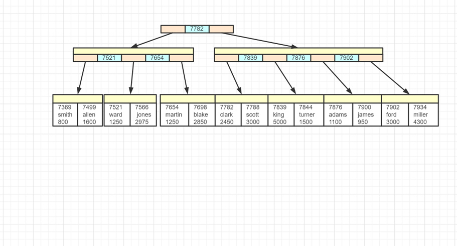</div>

* 主键即 7369、7499、7521 等

二级索引：除主键外的其它字段建立的索引称为二级索引。被索引的字段值作为索引数据，叶子节点还包含了主键值

<div align="center">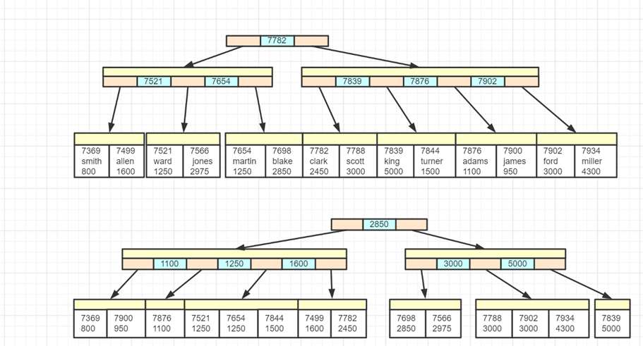</div>

* 上图中 800、950、1100 这些是工资字段的值，根据它们建立了二级索引

<div align="center"></div>

* 上图中，如果执行查询 `select empno, ename, sal from emp where sal = 800`，这时候可以利用二级索引定位到 800 这个工资，同时还能知道主键值 7369
* 但 select 字句中还出现了 ename 字段，在二级索引中不存在，因此需要根据主键值 7369 查询聚簇索引来获取 ename 的信息，这个过程俗称<b>回表</b>

### MyISAM 索引特点

被索引字段值作为索引数据，叶子节点还包含了该记录数据页地址，数据和索引是分开存储的

<div align="center"></div>


## 索引模块

索引是为了加快数据的检索。

* 了解常见索引与它们的适用场景，尤其是 B+Tree 索引的特点
* 掌握索引用于排序，以及失效情况
* 掌握索引用于筛选，以及失效情况
* 理解索引条件下推
* 理解二级索引覆盖

### 索引基础

<b>常见索引</b>

* 哈希索引
    * 理想时间复杂度为 $O(1)$
    * 适用场景：适用于等值查询的场景，内存数据的索引
    * 典型实现：Redis，MySQL 的 memory 引擎
* 平衡二叉树索引 
    * 查询和更新的时间复杂度都是 $O(log_2(n))$
    * 适用场景：适用于等值查询以及范围查询；适合内存数据的索引，但不适合磁盘数据的索引，可以认为<b>树的高度决定了磁盘 I/O 的次数</b>，百万数据树高约为 20
* BTree 索引
    * BTree 其实就是 n 叉树，分叉多意味着节点中的孩子（key）多，树高自然就降低了
    * 分叉数由页大小和行（包括 key 与 value）大小决定
        * 假设页大小为 16k，每行 40 个字节，那么分叉数就为 16k / 40 ≈ 410
        * 而分叉为 410，则百万数据树高约为3，仅 3 次 I/O 就能找到所需数据
    * <b>局部性原理</b>：每次 I/O 按页为单位读取数据，把多个 <b>key 相邻</b>的行放在同一页中（每页就是树上一个节点），能进一步减少 I/O

* B+ 树索引 
    * 在 BTree 的基础上做了改进，索引上只存储 key，这样能进一步增加分叉数，假设 key 占 13 个字节，那么一页数据分叉数可以到 1260，树高可以进一步下降为 2

> 树高计算公式
>
>  $log_{10}(N) / log_{10}(M)$ 其中 N 为数据行数，M 为分叉数

<b>BTree vs B+Tree</b>

* 无论 BTree 还是 B+Tree，每个叶子节点到根节点距离都相同
* BTree key 及 value 在每个节点上，无论叶子还是非叶子节点

<div align="center"></div>

* B+Tree 普通节点只存 key，叶子节点才存储 key 和 value，因此分叉数可以更多
    * 不过也请注意，普通节点上的 key 有的会与叶子节点的 key 重复
* B+Tree 必须到达叶子节点才能找到 value
* B+Tree 叶子节点用链表连接，可以方便范围查询及全表遍历

<div align="center"></div>

> 注：这两张图都是仅画了 key，未画 value

<b>B+Tree 新增 key</b>

假设阶数（m）为 5

1. 若为空树，那么直接创建一个节点，插入 key 即可，此时这个叶子结点也是根结点。例如，插入 5

<div align="center"></div>

2. 插入时，若当前结点 key 的个数小于阶数，则插入结束

3. 依次插入 8、10、15，按 key 大小升序

<div align="center"></div>

4. 插入 16，这时到达了阶数限制，所以要进行分裂

<div align="center"></div>

5. <b>叶子节点分裂规则</b>：将这个叶子结点分裂成左右两个叶子结点，左叶子结点包含前 m/2 个（2个）记录，右结点包含剩下的记录，将中间的 key 进位到父结点中。<b>注意</b>：中间的 key 仍会保留在叶子节点一份

<div align="center"></div>

6. 插入 17

<div align="center"></div>

7. 插入 18，这时当前结点的 key 个数到达 5，进行分裂

<div align="center"></div>

8. 分裂成两个结点，左结点 2 个记录，右结点 3 个记录，key 16 进位到父结点中

<div align="center"></div>

9. 插入 19、20、21、22、6、9

<div align="center"></div>

10. 插入 7，当前结点的 key 个数到达 5，需要分裂

<div align="center"></div>

11. 分裂后 key 7 进入到父结点中，这时父节点 key 个数也到达 5

<div align="center"></div>

12. <b>非叶子节点分裂规则</b>：左子结点包含前 (m-1)/2 个 key，将中间的 key 进位到父结点中（<b>不保留</b>），右子节点包含剩余的 key

<div align="center"></div>

<b>B+Tree 查询 key</b>

以查询 15 为例

* 第一次 I/O

<div align="center"></div>

* 第二次 I/O

<div align="center"></div>

* 第三次 I/O

<div align="center"></div>

<b>B+Tree 删除叶子节点 key</b>

1. 初始状态

<div align="center"></div>

2. <b>删完有富余</b>。即删除后结点的 key 的个数 > m/2 – 1，删除操作结束，例如删除 22

<div align="center"></div>

3. <b>删完没富余，但兄弟节点有富余</b>。即兄弟结点 key 有富余（ > m/2 – 1 ），向兄弟结点借一个记录，同时替换父节点，例如删除 15

<div align="center"></div>

4. <b>兄弟节点也不富余，合并兄弟叶子节点</b>。即兄弟节点合并成一个新的叶子结点，并删除父结点中的key，将当前结点指向父结点，例如删除 7

<div align="center"></div>

5. 也需要删除非叶子节点中的 7，并替换父节点保证区间仍有效

<div align="center"></div>

6. 左右兄弟都不够借，合并

<div align="center"></div>

<b>B+Tree 删除非叶子节点 key</b>

接着上面的操作

1. 非叶子节点 key 的个数 > m/2 – 1，则删除操作结束，否则执行 2

2. 若<b>兄弟结点有富余</b>，父结点 key 下移，兄弟结点 key 上移，删除结束，否则执行 3

3. 若<b>兄弟节点没富余</b>，当前结点和兄弟结点及父结点合并成一个新的结点。重复 1

<div align="center"></div>

<div align="center"></div>

### 命中索引

> <b>准备数据</b>
>
> 1. 修改 MySQL 配置文件，在 [mysqld] 下添加 secure_file_priv= 重启 MySQL 服务器，让选项生效
>
> 2. 执行 db.sql 内的脚本，建表
>
> 3. 执行 `LOAD DATA INFILE 'D:\\big_person.txt' INTO TABLE big_person;` 注意实际路径根据情况修改
> 测试表 big_person（此表数据量较大，如果与其它表数据一起提供不好管理，故单独提供），数据行数 100 万条，列个数 15 列。为了更快速导入数据，这里采用了 load data infile 命令配合 *.txt 格式数据

<b>索引用于排序</b>

```sql
/* 测试单列索引并不能在多列排序时加速 */
create index first_idx on big_person(first_name);
create index last_idx on big_person(last_name);
explain select * from big_person order by last_name, first_name limit 10; 

/* 多列排序需要用组合索引 */
alter table big_person drop index first_idx;
alter table big_person drop index last_idx;
create index last_first_idx on big_person(last_name,first_name);

/* 多列排序需要遵循最左前缀原则, 第1个查询可以利用索引，第2,3查询不能利用索引 */
explain select * from big_person order by last_name, first_name limit 10; 
explain select * from big_person order by first_name, last_name limit 10; 
explain select * from big_person order by first_name limit 10; 

/* 多列排序升降序需要一致，查询1可以利用索引，查询2不能利用索引*/
explain select * from big_person order by last_name desc, first_name desc limit 10; 
explain select * from big_person order by last_name desc, first_name asc limit 10; 
```

> <b>最左前缀原则</b>
>
> 若建立组合索引 (a,b,c)，则可以**利用**到索引的排序条件是：
>
> * order by a
> * order by a, b
> * order by a, b, c

<b>索引用于 where 筛选</b>

* 参考 https://dev.mysql.com/doc/refman/8.0/en/multiple-column-indexes.html

```sql
/* 模糊查询需要遵循字符串最左前缀原则，查询2可以利用索引，查询1,3不能利用索引 */
explain SELECT * FROM big_person WHERE first_name LIKE 'dav%' LIMIT 5;
explain SELECT * FROM big_person WHERE last_name LIKE 'dav%' LIMIT 5;
explain SELECT * FROM big_person WHERE last_name LIKE '%dav' LIMIT 5;

/* 组合索引需要遵循最左前缀原则，查询1,2可以利用索引，查询3,4不能利用索引 */
create index province_city_county_idx on big_person(province,city,county);
explain SELECT * FROM big_person WHERE province = '上海' AND city='宜兰县' AND county='中西区';
explain SELECT * FROM big_person WHERE county='中西区' AND city='宜兰县' AND province = '上海';
explain SELECT * FROM big_person WHERE city='宜兰县' AND county='中西区';
explain SELECT * FROM big_person WHERE county='中西区';

/* 函数及计算问题，一旦在字段上应用了计算或函数，都会造成索引失效。查询2可以利用索引，查询1不能利用索引 */
create index birthday_idx on big_person(birthday);
explain SELECT * FROM big_person WHERE ADDDATE(birthday,1)='2005-02-10';
explain SELECT * FROM big_person WHERE birthday=ADDDATE('2005-02-10',-1);

/* 隐式类型转换问题
	* 查询1会发生隐式类型转换等价于在phone上应用了函数，造成索引失效
	* 查询2字段与值类型相同不会类型转换，可以利用索引
*/
create index phone_idx on big_person(phone);
explain SELECT * FROM big_person WHERE phone = 13000013934;
explain SELECT * FROM big_person WHERE phone = '13000013934';
```

> <b>最左前缀原则（leftmost prefix）</b>
>
> 若建立组合索引 (a,b,c)，则可以<b>利用</b>到索引的查询条件是：
>
> * where a = ?
> * where a = ? and b = ? （注意与条件的先后次序无关，也可以是 where b = ? and a = ?，只要出现即可）
> * where a = ? and b = ? and c = ? （注意事项同上）
>
> <b>不能利用</b>的例子：
>
> * where b = ?
> * where b = ? and c = ?
> * where c = ?
>
> 特殊情况：
>
> * where a = ? and c = ?（a = ? 会利用索引，但 c = ? 不能利用索引加速，会触发索引条件下推）


<b>索引条件下推</b>

* 参考 https://dev.mysql.com/doc/refman/8.0/en/index-condition-pushdown-optimization.html

```sql
/* 查询 1,2,3,4 都能利用索引，但 4 相当于部分利用了索引，会触发索引条件下推 */
explain SELECT * FROM big_person WHERE province = '上海';
explain SELECT * FROM big_person WHERE province = '上海' AND city='嘉兴市';
explain SELECT * FROM big_person WHERE province = '上海' AND city='嘉兴市' AND county='中西区';
explain SELECT * FROM big_person WHERE province = '上海' AND county='中西区';
```

> <b>索引条件下推</b>
>
> * MySQL 执行条件判断的时机有两处：
>     * 服务层（上层，不包括索引实现）
>     * 引擎层（下层，包括了索引实现，可以利用）
>     * 上面查询 4 中有 province 条件能够利用索引，在引擎层执行，但 county 条件仍然要交给服务层处理
> * 在 5.6 之前，服务层需要判断所有记录的 county 条件，性能非常低
> * 5.6 以后，引擎层会先根据 province 条件过滤，满足条件的记录才在服务层处理 county 条件

我们现在用的是 5.6 以上版本，所以没有体会，可以用下面的语句关闭索引下推优化，再测试一下性能

```sql
SET optimizer_switch = 'index_condition_pushdown=off';
SELECT * FROM big_person WHERE province = '上海' AND county='中西区';
```

<b>二级索引覆盖</b>

```sql
explain SELECT * FROM big_person WHERE province = '上海' AND city='宜兰县' AND county= '中西区';
explain SELECT id,province,city,county FROM big_person WHERE province = '上海' AND city='宜兰县' AND county='中西区';
```

根据查询条件查询 1，2 都会先走二级索引，但是二级索引仅包含了 (province, city, county) 和 id 信息

* 查询 1 是 select *，因此还有一些字段二级索引中没有，需要回表（查询聚簇索引）来获取其它字段信息
* 查询 2 的 select 中明确指出了需要哪些字段，这些字段在二级索引都有，就避免了回表查询


<b>其它注意事项</b>

* 表连接需要在连接字段上建立索引
* 不要迷信网上说法，具体情况具体分析

例如：

```sql
create index first_idx on big_person(first_name);

/* 不会利用索引，因为优化器发现查询记录数太多，还不如直接全表扫描 */
explain SELECT * FROM big_person WHERE first_name > 'Jenni';

/* 会利用索引，因为优化器发现查询记录数不太多 */
explain SELECT * FROM big_person WHERE first_name > 'Willia';

/* 同一字段的不同值利用 or 连接，会利用索引 */
explain select * from big_person where id = 1 or id = 190839;

/* 不同字段利用 or 连接，会利用索引(底层分别用了两个索引) */
explain select * from big_person where first_name = 'David' or last_name = 'Thomas';

/* in 会利用索引 */
explain select * from big_person where first_name in ('Mark', 'Kevin','David'); 

/* not in 不会利用索引的情况 */
explain select * from big_person where first_name not in ('Mark', 'Kevin','David');

/* not in 会利用索引的情况 */
explain select id from big_person where first_name not in ('Mark', 'Kevin','David');
```

* 以上实验基于 5.7.27，其它如 !=、is null、is not null 是否使用索引都会跟版本、实际数据相关，以优化器结果为准

## 查询语句执行流程

<b>要求</b>

* 了解查询语句执行流程

<b>执行 SQL 语句 select * from user where id = 1 时发生了什么</b>


1. 连接器：负责建立连接、检查权限、连接超时时间由 wait_timeout 控制，默认 8 小时

2. 查询缓存：会将 SQL 和查询结果以键值对方式进行缓存，修改操作会以表单位导致缓存失效

3. 分析器：词法、语法分析

4. 优化器：决定用哪个索引，决定表的连接顺序等

5. 执行器：根据存储引擎类型，调用存储引擎接口

6. 存储引擎：数据的读写接口，索引、表都在此层实现

## 索引失效

准备数据

①在 [mysqld] 下添加 `secure_file_priv=` 重启 MySQL 服务器，让 MySQL 允许在任意目录下导入数据。

②执行 db.sql 内的脚本，建表

③执行 LOAD DATA INFILE 'D:\big_person.txt' INTO TABLE big_ person; 注意实际路径根据情况修改

测试表 big_person (此表数据量较大，如果与其它表数据一起提供不好管理，故单独提供)，数据行数 100 万条，列个数 15 列。为了更快速导入数据，这里采用了 load data infile 命令配合*.txt 格式数据。

### 索引用于排序

- 多列排序需要用组合索引
    - create index first\_idx on big_ person(first_ name);
    - create index last\_jidx on big\_person(last_ name);
    - explain select * from big\_person order by last\_name, first\_name limit 10; -- 索引失效，多个字段的排序需要使用联合索引。
- 多列排序需要遵循最左前缀原则
    - alter table big\_pefson drop index first\_idx;
    - alter table big\_person drop index last\_idx; 
    - create index last first\_idx on big\_person(last\_name, first\_name);
    - explain select * from big\_person order by last name, first\_name limit 10; -- 索引有效
    - explain select * from big\_person order by first\_name, last\_name limit 10; -- 索引失效，因为排序的结果和顺序相关，order by first\_name, last\_name 和 order by last\_name,  first\_name 是不一样的。
    - explain select * from big\_person order by first\_name limit 10; -- 索引失效
- 多列排序升降序需要一致
    - explain select * from big\_person order by last\_name desc, first_ name desc limit 10; -- 索引有效
    - explain select * from big\_person order by last\_name desc, first\_name asc limit 10; -- 索引失效

### 索引用于where

- 模糊查询需要遵循字符串最左前缀原则
- 组合索引需要遵循最左前缀原则（查询结果和字段在 where 的顺序无关，某个字段符合最左索引，索引即可生效）
- 函数及计算问题
    - create index birthday_ idx on big\_person(birthday);
    - explain SELECT * FROM big\_person WHERE ADDDATE(birthday,1)='2005-02-10'; -- 在列上进行函数运算，索引失效
    - explain SELECT * FROM big\_person WHERE birthday=ADDDATE('2005-02-10',-1); -- 在值上进行函数运算，索引有效
- 隐式类型转换问题（phone 是 char 类型）
    - create index phone\_idx on big\_person(phone);
    - explain SELECT * FROM big\_person WHERE phone = 13000013934; -- 存在隐式类型转换，将 phone 转换为整型，索引失效
    - explain SELECT * FROM big\_person WHERE phone = '13000013934'; -- 无隐式类型转换，索引有效

### 索引条件下推

此处的每个索引字段占 67 字节。用了一个字段占 67，两个字段则是 134，三个字段则是 201。 

MySQL 执行条件判断的时机有两处：引擎层(包括了索引实现)和服务层

- 上面第 4 条 SQL 中仅有 province 条件能够利用索引，在引擎层执行。但 county 条件仍然要交给服务层处理
- 在 5.6 之前，服务层需要判断所有记录的 county 条件，性能非常低
- 5.6 以后，引擎层会先根据 province 条件过滤，满足条件的记录才在服务层处理 county 条件

### 其他例子

- 二级索引如果覆盖到了所有字段就不用回表查询了（以主键为索引再做第二次查询，查询二级索引中未覆盖到的字段）。如果 explain 中 Extra 出现了 Using index 则说明出现了回表查询。
- 表连接需要在连接字段上建立索引（所以，能用主键连接就用主键连接？）
- 网上很多说法是不正确的，以 explain 的结果为准。
    - `where first_name > 'Jenni'` -- 不走索引，查询时如果 MySQL 发现使用索引过滤的数据不多，那就不会走索引。 
    - `where fist_name > 'Willia'` -- 走索引，比 Wxx 大的人名占比量小，走索引可以提高效率，因此会走索引。
    - `where id = 1 or id = 190839`  --  走索引
    - `where first_name = 'David' or last_name = 'Thomas'` --  走索引
    - `in ('Mark', 'Keven')` -- 走索引
    - 对于 `not in ()`，走不走索引和 select 子句也相关 `select id from xxx not in('Mark', 'Keven')` 发生了索引覆盖，会走索引。-- 看下 MySQL 的书，再做下实验。
- 是否会走索引和 MySQL 版本有关，一切以 explain 为准。

### SQL执行流程

<b>执行 SQL 语句 select * from user where id = 1 时发生了什么</b>

1. 连接器：负责建立连接、检查权限、连接超时时间由 wait_timeout 控制，默认 8 小时
2. 查询缓存：会将 SQL 和查询结果以键值对方式进行缓存，修改操作会以表单位导致缓存失效（如果不只是查询的话作用不大， 8.x 删除了）
3. 分析器：词法、语法分析
4. 优化器：决定用哪个索引，决定表的连接顺序等
5. 执行器：根据存储引擎类型，调用存储引擎接口
6. 存储引擎：数据的读写接口，索引、表都在此层实现

## 数据库锁

- 理解 undo log 的作用
- 理解 redo log 的作用
- undo log 和 redo log 是 InnoDB 独有的。
- 了解数据库锁的种类
- 理解数据库锁的作用

<b>在事务执行过程中，如果有加锁操作，这个锁需要等事务提交时释放。</b>

### undo log

<b>undo log 的作用有两个</b>

- 回滚数据， 以行为单位，记录数据每次的变更，一行记录有多个版本并存
- 多版本并发控制，即快照读 (也称为一致性读)，让查询操作可以去访问历史版本。查询的时候，只找比自己事务 id 小的记录。

<div align="center"></div>

1. 每个事务会按照开始时间，分配一个单调递增的事务编号 trx id
2. 每次事务的改动都会以行为单位记入回滚日志，包括当时的事务编号，改动的值等
3. 查询操作，事务编号大于自己的数据是不可见的，事务编号小于等于自己的数据才是可见的
    * 例如图中红色事务看不到 trx id=102 以及 trx id=101 的数据，只有 trx id=99 的数据对它可见

### redo log

<b>redo log 的作用主要是实现 ACID 中的持久性，保证提交的数据不丢失。个人理解，主要是为了保证即便是服务器宕机了，也可以保证数据的持久性。</b>

- 它记录了事务提交的变更操作，服务器意外宕机重启时，利用 redo log 进行回放，重新执行已提交的变更操作
- 事务提交时，首先将变更写入 redo log，事务就视为成功。至于数据页(表、索引) 上的变更，可以放在后面慢慢做
    - 数据页上的变更宕机丢失也没事，因为 redo log 里已经记录了
    - 数据页在磁盘上位置随机，写入速度慢，redo log 的写入是顺序的速度快
- 它由两部分组成，内存中的 redo log buffer，磁盘上的 redo log file
    - redo log file 由一组文件组成， 当写满了会循环覆盖较旧的日志，这意味着不能无限依赖 redo log，更早的数据恢复需要 binlog
    - buffer 和 file 两部分组成意味着，写入了文件才真正安全，同步策略由下面的参数控制
    - `innodb_flush_log_at_trx_commit`
        ① 0 - 每隔 1s 将日志 write and flush 到磁盘（最多丢一秒的数据）
        ② 1 - 每次事务提交将日志 write and flush (默认值)
        ③ 2 - 每次事务提交将日志 write，每隔 1s flush 到磁盘，意味着 write 意味着写入操作系统缓存，如果 MySQL 挂了，而操作系统没挂，那么数据不会丢失

### 锁概述

- 全局锁
- 表级锁
    - 表锁
    - MDL 元数据锁
    - IS 与 IX
- 行级锁
    - S 与 X
    - 记录锁、间隙锁、临键锁

<b>在事务执行过程中，如果有加锁操作，这个锁需要等事务提交时释放。</b>

### 全局锁

用作全量备份时，保证**表与表之间的数据一致性**

如果不加任何包含，数据备份时就可能产生不一致的情况

全局锁的语法：

```sql
flush tables with read lock;	
```

* 使用全局读锁锁定所有数据库的所有表。这时会阻塞其它所有 DML 以及 DDL 操作，这样可以避免备份过程中的数据不一致。接下来可以执行备份，最后用 unlock tables 来解锁

> <b>注意</b>
>
> 但 flush tables 属于比较重的操作，可以使用 --single-transaction 参数来完成不加锁的一致性备份（仅针对 InnoDB 引擎的表）
>
> ```sql
> mysqldump --single-transaction -uroot -p test > 1.sql
> ```


### 表级锁

<b>表锁</b>

- 语法：加锁 lock tables 表名 read/write，解锁 unlock tables
    - `lock tables t read`，给表 t 加锁。
- 缺点：粒度较粗，在 InnoDB 引擎很少使用


<b>元数据</b>

- 即 metadata-lock (MDL)， 主要是为了避免 DML 与 DDL 冲突（在事务期间保护表结构不会变动）
- 加元数据锁的几种情况
    - `lock tables read/write`，类型为 SHARED_READ_ONLY 和 SHARED_NO_READ_WRITE
    - `alter table`，类型为 EXCLUSIVE，与其它 MDL 都互斥
    - `select，select … lock in share mode`，类型为 SHARED_READ
    - `insert，update，delete，select for update`，类型为 SHARED_WRITE 
- DML 的元数据锁之间不互斥
- 查询元数据锁的信息（适用于 MySQL 8.0 以上版本）
    - `select object_type,object_schema,object_name,lock_type,lock_duration from performance_schema.metadata_locks;` 

<b>IS (意向共享) 与 IX (意向排他)</b>

- 主要是<b>避免 DML 与表锁冲突</b>，DML 主要目的是加行锁，为了让表锁不用检查每行数据是否加锁，加意向锁(表级)来减少表锁的判断 (这样就不用每条数据判断是否加锁了)，意向锁之间不会互斥
- 由 DML 语句添加，加意向表锁的几种情况
    - `select ... lock in share mode` 会加 IS 锁，
    - `insert, update, delete， select ... for update` 会加 IX 锁

- 查看意向表锁（适用于 MySQL 8.0 以上版本）
    * `select object_schema,object_name,index_name,lock_type,lock_mode,lock_data from performance_schema.data_locks;`

### 行级锁

<b>种类</b>

1. 行锁 -- 在 RC 下，锁住的是行，防止其他事务对此行 update 或 delete,
2. 间隙锁 -- 在 RR 下，锁住的是间隙，防止其他事务在这个间隙 insert 产生幻读。例如在 id 8 和 12 之间锁住，不会锁住 8 也不会锁住 12。
3. 临键锁 -- 在 RR 下，锁住的是前面`间隙+行`，特定条件下可优化为行锁。一般是做范围查询会加临键锁。

<b>查看行级锁</b>

* `select object_schema,object_name,index_name,lock_type,lock_mode,lock_data from performance_schema.data_locks where object_name='表名';`

<b>注意</b>

- 它们锁定的其实都是索引上的行与间隙，根据索引的有序性来确定间隙

测试数据

```sql
create table t (id int primary key, name varchar(10),age int, key (name)); 
insert into t values(1, 'zhangsan',18); 
insert into t values(2, 'lisi',20); 
insert into t values(3, 'wangwu',21); 
insert into t values(4, 'zhangsan', 17); 
insert into t values(8,'zhang',18);
insert into t values(12,'zhang',20);
```

> <b>说明</b>
>
> * 1,2,3,4 之间其实并不可能有间隙
> * 4 与 8 之间有间隙
> * 8 与 12 之间有间隙
> * 12 与正无穷大之间有间隙
> * 其实我们的例子中还有负无穷大与 1 之间的间隙，想避免负数可以通过建表时选择数据类型为 unsigned int


间隙锁例子

事务1：

```sql
begin;
select * from t where id = 9 for update; /* 锁住的是 8 与 12 之间的间隙 */
```

事务2：

```sql
update t set age=100 where id = 8; /* 不会阻塞 */
update t set age=100 where id = 12; /* 不会阻塞 */
insert into t values(10,'aaa',18); /* 会阻塞 */
```

临键锁和记录锁例子

事务1：

```sql
begin;
select * from t where id >= 8 for update;
```

* 临键锁锁定的是左开右闭的区间，与上条查询条件相关的区间有 (4,8]，(8,12]，(12,+∞)
* 临键锁在某些条件下可以被优化为记录锁，例如 (4,8] 被优化为只针对 8 的记录锁，前面的区间不会锁住

事务2：

```sql
insert into t values(7,'aaa',18); /* 不会阻塞 */
update t set age=100 where id = 8; /* 会阻塞 */
insert into t values(10,'aaa',18); /* 会阻塞 */
update t set age=100 where id = 12; /* 会阻塞 */
insert into t values(13,'aaa',18); /* 会阻塞 */
```

# Redis

## 数据类型

数据类型实际描述的是 value 的类型，key 都是 string，常见数据类型 (value) 有
1. string ( embstr. raw. int)，可以用来做最简单的数据，可以缓存某个简单的字符串，也可以缓存某个 json 格式的字符串，Redis 分布式锁的实现就利用了这种数据结构，还包括可以实现计数器、Session 共享、 分布式 ID
2. list (quicklist (多个 ziplist 双向链表) )，Redis 的列表通过命令的组合，既可以当做栈，也可以当做队列来使用，可以用来缓存类似微信公众号、微博等消息流数据
3. hash ( ziplist. hashtable )，可以用来存储一些 key-value 对, 更适合用来存储对象
4. set (intset. hashtable )，和列表类似，也可以存储多个元素，但是不能重复，集合可以进行交集、并集、差集操作,从而可以实现类似,我和某人共同关注的人、朋友圈点赞等功能
5. sorted set (ziplist、 skiplist)，集合是无序的，有序集合可以设置顺序，可以用来实现排行榜功能
6. bitmap
7. hyperloglog

每一种类型都用 redisObject 结构体来表示，每种类型根据情况不同，有不同的编码 encoding (即底层数据结构)

### String

- 如果字符串保存的是整数值，则底层编码为 int，实际使用 long 来存储
- 如果字符串保存的是非整数值 (浮点数字或其它字符) 又分两种情况
    - 长度 <=39 字节，使用 embstr 编码来保存，即将 redisObject 和 sdshdr 结构体保存在一起，分配内存只需一次	
    - 长度 >39 字节，使用 raw 编码来保存，即 redisObject 结构体分配一次内存， sdshdr 结构体分配一次内存， 用指针相连，需要额外的空间存储指针。

- sdshdr 称为简单动态字符串，实现上有点类似于 java 中的 StringBuilder，有如下特性
    - 单独存储字符长度，相比 `char *` 获取长度效率高 (`char*` 是 C 语言原生字符串表示)
    - 支持动态扩容, 方便字符串拼接操作
    - 预留空间，减少内存分配、释放次数 (<1M 时容量是字符串实际长度 2 倍, >= 1M 时容量是原有容量+ 1M)
    - 二进制安全，例如传统 `char*` 以 \0 作为结束字符，这样就不能保存视频、图片等二进制数据，而 sds 以长度来进行读取

### List

- 3.2 开始，Redis 采用 quicklist 作为其编码方式，它是一个双向链表，节点元素是 ziplist
    - 由于是链表, 内存上不连续
    - 操作头尾效率高， 时间复杂度 O(1) 
    - 链表中 ziplist 的大小和元素个数都可以设置，其中大小默认 8kb
- <b>ziplist 用一块连续的内存存储数据</b>，设计目标是让数据存储更紧凑，减少碎片开销，节约内存。为了节约内存， ziplist 中的节点占用的字节数也往往不同，会根据实际存储的内容来调整，其结构如下
    - zlbytes - 记录整个 ziplist 占用多少字节数
    - zltail-offset - 记录尾节点的偏移量，用于快速定位到伪节点，倒着遍历。
    - zllength - 记录节点数量
    - entry - 节点，1~N 个，每个 entry 记录了前一 entry 长度（为了倒序遍历，通过计算字节来找到上一个 entry），本 entry 的编码、长度、实际数据，为了节省内存,根据实际数据长度不同，用于记录长度的字节数也不同，例如前一 entry 长度是 253 时，需要用 1 个字节，但超过了 253，需要用 5 个字节。
    - zlend - 结束标记
- ziplist 适合存储少量元素，存储数据多话查询效率不高，并且长度可变的设计会带来连锁更新问题

### Hash

- 在数据量较小时，采用 ziplist 作为其编码，当键或值长度过大(64) 或个数过多(512) 时，转为 hashtable 编码。（把键值对的信息看成两个连续的 entry）

- hashtable 编码

    * hash 函数，Redis 5.0 采用了 SipHash 算法

    * 采用拉链法解决 key 冲突

    * <b>rehash 时机</b>

        ① 当元素数 < 1 * 桶个数时，不扩容

        ② 当元素数 > 5 * 桶个数时，一定扩容

        ③ 当 1 * 桶个数 <= 元素数 <= 5 * 桶个数时，如果此时没有进行 AOF 或 RDB 操作时，会进行 rehash。

        ④ 当元素数 < 桶个数 / 10 时，缩容，Java 的 hash 表并没有提供缩容机制。为什么没有提供呢？

    * <b>rehash 要点</b>

        ① 每个字典有两个哈希表，桶个数为 $2^n$，平时使用 ht[0]，ht[1] 开始为 null，扩容时新数组大小为元素个数 * 2

        ② <b>渐进式 rehash</b>，即不是一次将所有桶都迁移过去，每次对这张表 CRUD 仅迁移一个桶，避免一次移动过多阻塞其他命令，拉低吞吐量。

        ③ <b>active rehash</b>，server 的主循环中，每 100 ms 里留出 1s 进行主动迁移（确定是每 100 ms 里留出 1s 进行主动迁移吗？ ）

        ④ rehash 过程中，新增数据操作 ht[1] ，其它操作先操作 ht[0]，若没有，再操作 ht[1]

        ⑤ redis 所有 CRUD 都是单线程，因此 rehash 一定是线程安全的

### Sorted Set

- 在数据量较小时， 采用 ziplist 作为其编码，按 score 有序，当键或值长度过大 (64) 或个数过多 (128) 时，转为 skiplist + hashtable 编码，同时采用的理由是
    - 只用 hashtable，CRUD 是 O(1)，但要执行有序操作，需要排序,带来额外时间空间复杂度
    - 只用 skiplist，虽然范围操作优点保留，但时间复杂度上升
    - 虽然同时采用了两种结构，但由于采用了指针，元素并不会占用双份内存

- <b>skiplist 要点：多层链表、排序规则、backward、level (span, forward)</b>
    - backward 指向前驱的指针
    - forward 指向后继的指针
    - span 记录和前后节点的跨度，可以用来计算节点的排名，所有的跨度加起来就是排名。

<div align="center">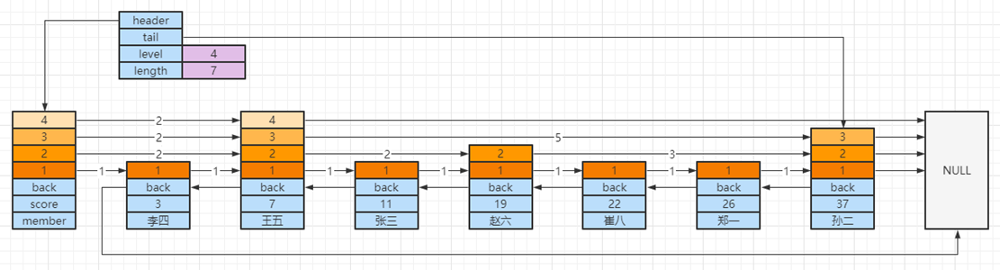</div>

* score 存储分数、member 存储数据、按 score 排序，如果 score 相同再按 member 排序
* backward 存储上一个节点指针
* 每个节点中会存储层级信息（level），同一个节点可能会有多层，每个 level 有属性：
    * foward 同层中下一个节点指针
    * span 跨度，用于计算排名，不是所有跳表都实现了跨度，Redis 实现特有

3. 多层链表可以加速查询，规则为，从顶层开始（层数最高的元素开始）

    1. `>` 同层右边的，继续在同层向右找

    2. `=` 找到了

    3. `<` 同层右边的或右边为 NULL，下一层，重复 1、2 步骤

<div align="center"></div>

* 以查找【崔八】为例
    1. 从顶层（4）层向右找到【王五】节点，22 > 7 继续向右找，但右侧是 NULL，下一层
    2. 在【王五】节点的第 3 层向右找到【孙二】节点，22 < 37，下一层
    3. 在【王五】节点的第 2 层向右找到【赵六】节点，22 > 19，继续向右找到【孙二】节点，22 < 37，下一层
    4. 在【赵六】节点的第 1 层向右找到【崔八】节点，22 = 22，返回

> <b>注意</b>
>
> * 数据量较小时，不能体现跳表的性能提升，跳表查询的时间复杂度是 $log_2(N)$，与二叉树性能相当

## keys命令问题

<b>要求</b>

* 理解低效命令对单线程的 Redis 影响

<b>问题描述</b>

* redis有一亿个 key，使用 keys 命令是否会影响线上服务？

<b>解答</b>

* keys 命令时间复杂度是 $O(n)$，n 即总的 key 数量，n 如果很大，性能非常低
* redis 执行命令是单线程执行，一个命令执行太慢会阻塞其它命令，阻塞时间长甚至会让 redis 发生故障切换

<b>改进方案</b>

* 可以使用 scan 命令替换 keys 命令，语法 `scan 起始游标 match 匹配规则 count 提示数目`，返回值代表下次的起点
    1. 虽然 scan 命令的时间复杂度仍是 $O(n)$，但它是通过游标分步执行，不会导致长时间阻塞
    2. 可以用 count 参数**提示**返回 key 的个数
    3. 弱状态，客户端仅需维护游标
    4. scan 能保证在 rehash 也正常工作
    5. 缺点是可能会重复遍历 key（缩容时）、应用应自己处理重复 key

## 过期key删除策略

<b>要求</b>

* 了解 Redis 如何记录 key 的过期时间
* 掌握 Redis 对过期 key 的删除策略

<b>记录 key 过期时间</b>

* 每个库中都包含了 expires 过期字典
    * hashtable结构，键为指针，指向真正 key，值为 long 类型的时间戳，毫秒精度
* 当设置某个 key 有过期时间时，就会向过期字典中添加此 key 的指针和时间戳

<b>过期 key 删除策略</b>

* 惰性删除

    * 在执行读写数据库的命令时，执行命令前会检查 key 是否过期，如果已过期，则删除 key

* 定期删除

    * redis 有一个定时任务处理器 serverCron，负责周期性任务处理，默认 100 ms 执行一次（hz 参数控制）包括：① 处理过期 key、② hash 表 rehash、③ 更新统计结果、④ 持久化、⑤ 清理过期客户端

    * 对于处理过期 key 会：依次遍历库，在规定时间内（最大 2.5 ms）运行如下操作

        ① 从每个库的 expires 过期字典中随机选择 20 个 key 检查，如果过期则删除

        ② 如果删除达到 5 个，重复 ① 步骤，没有达到，遍历至下一个库

        ③ 规定时间没有做完，等待下一轮 serverCron 运行

<b>总结</b>

惰性删除 + 定期删除

## 持久化

<b>要求</b>

* 掌握 AOF 持久化和 AOF 重写
* 掌握 RDB 持久化
* 了解混合持久化

### AOF持久化

<b>AOF 持久化</b>

* AOF - 将每条<b>写命令追加至 aof 文件</b>，当重启时会执行 aof 文件中每条命令来重建内存数据（与 MySQL 的 redo log 类似）
* AOF 日志是<b>写后日志</b>，即先执行命令，再记录日志
    * Redis 为了性能，向 aof 记录日志时没有对命令进行语法检查，如果要先记录日志，那么日志里就会记录语法错误的命令
    * MySQL 则是先写日志，再执行，因为 MySQL 对命令做了语法检查。
* 记录 AOF 日志时，有<b>三种同步策略</b>
    * Always 同步写，日志写入磁盘再返回，可以做到基本不丢数据，性能不高
        * 为什么说基本不丢呢，因为 aof 是在 serverCron 事件循环中执行 aof 写入的，并且这次写入的是上一次循环暂存在 aof 缓冲中的数据，因此最多还是可能丢失一个循环的数据
    * Everysec 每秒写，日志写入 AOF 文件的内存缓冲区，每隔一秒将内存缓冲区数据刷入磁盘，最多丢一秒的数据
    * No 操作系统写，日志写入 AOF 文件的内存缓冲区，由操作系统决定何时将数据刷入磁盘

<b>AOF 重写</b>

* AOF 文件太大引起的问题
    1. 文件大小受操作系统限制
    2. 文件太大，写入效率变低
    3. 文件太大，<b>恢复时非常慢</b>
* 重写就是对同一个 key 的多次操作进行瘦身
    1. 例如一个 key 我改了 100 遍，aof 里记录了100 条修改日志，但实际上只有最后一次有效
    2. 重写无需操作现有 aof 日志，只需要根据当前内存数据的状态，生成相应的命令，记入一个新的日志文件即可
    3. 重写过程是由另一个后台子进程完成的，不会阻塞主进程
* <b>AOF 重写过程</b>
    1. 创建子进程时会根据主进程生成内存快照（fork 拷贝页面信息即可，生成当前内存的快照），只需要对子进程的内存进行遍历，把每个 key 对应的命令写入新的日志文件（即重写日志）
    2. 此时如果有新的命令执行，修改的是主进程内存，不会影响子进程内存，并且新命令会记录到 `重写缓冲区` 
    3. 等子进程所有的 key 处理完毕，再将 `重写缓冲区` 记录的增量指令写入重写日志 
    4. 在此期间旧的 AOF 日志仍然在工作，待到重写完毕，用重写日志替换掉旧的 AOF 日志

### RDB持久化

<b>RDB 持久化</b>

* RDB - 是把整个内存数据以二进制方式写入磁盘
    * 对应数据文件为 `dump.rdb`
    * 好处是恢复速度快
* 相关命令有两个
    * save - 在主进程执行，会阻塞其它命令
    * bgsave - 创建子进程执行，避免阻塞，是默认方式
        * 子进程不会阻塞主进程，但创建子进程的期间，仍会阻塞，内存越大，阻塞时间越长
        * bgsave 也是利用了快照机制，执行 RDB 持久化期间如果有新数据写入，新的数据修改发生在主进程，子进程向 RDB 文件中写入还是旧的数据，这样新的修改不会影响到 RDB 操作
        * 但这些<b>新数据不会补充</b>至 RDB 文件
* 缺点： 可以通过调整 redis.conf 中的 save 参数来控制 rdb 的执行周期，但这个周期不好把握
    * 频繁执行的话，会影响性能
    * 偶尔执行的话，如果宕机又容易丢失较多数据

<b>RDB 持久化配置</b>

RDB（快照）持久化：保存某个时间点的全量数据快照。

```shell
save 900 1 # 900s 有一条写入 就备份
save 300 10 # 300s 有十条写入 就备份
save 60 10000 # 60s 有一万条写入 就备份 多个配置是怕数据的写入不规律，为了平衡性能和数据安全。

stop-writes-on-bgsave-error yes # 如果备份出现错误，主线程就停止接收新的写入操作

rdbcompression yes # 先压缩，再备份。一般我们是选择 no
```

### 混合持久化

<b>混合持久化</b>

* 从 4.0 开始，Redis 支持混合持久化，即使用 RDB 作为全量备份，两次 RDB 之间使用 AOF 作为增量备份
    * 配置项 aof-use-rdb-preamble 用来控制是否启用混合持久化，默认值 no
    * 持久化时将数据都存入 AOF 日志，日志前半部分为二进制的 RDB 格式，后半部分是 AOF 命令日志
    * 下一次 RDB 时，会覆盖之前的日志文件
* 优缺点
    * 结合了 RDB 与 AOF 的优点，恢复速度快，增量用 AOF 表示，数据更完整（取决于同步策略）、也无需 AOF 重写
    * 与旧版本的 redis 文件格式不兼容


## 缓存相关问题

缓存的目的是为了加速数据的访问，保护数据库不被请求打垮。

<b>要求</b>

* 掌握缓存击穿
* 掌握缓存雪崩
* 掌握缓存穿透
* 掌握旁路缓存与缓存一致性

### 缓存击穿

缓存击穿是指：某一热点 key 在缓存和数据库中都存在，它过期时，这时由于并发用户特别多，同时读缓存没读到，又同时去数据库去读，压垮数据库。

<b>解决方法</b>

- 热点数据不过期
- 对【查询缓存没有，查询数据库,结果放入缓存】这三步进行加锁，这时只有一个客户端能获得锁, 其它客户端会被阻塞，等锁释放开，缓存已有了数据，其它客户端就不必访问数据库了。但会影响吞吐量 (有损方案)。

### 缓存雪崩

情况1：由于大量 key 设置了相同的过期时间(数据在缓存和数据库都存在)，一旦到达过期时间点，这些 key 集体失效，造成访问这些 key 的请求全部进入数据库。

<b>解决方法</b>

- 错开过期时间，在过期时间上加上随机值 (比如 1~5 分钟)
- 服务降级，暂停非核心数据查询缓存，返回预定义信息 (错误页面，空值等)

情况2：Redis 实例宕机，大量请求进入数据库

<b>解决方法</b>

- 事前预防，搭建高可用集群，这样就不会因为某些 Redis 宕机导致大量请求进入数据库了
- 多级缓存，缺点是实现复杂度高
- 熔断，通过监控一旦雪崩出现，暂停缓存访问，待实例恢复，返回预定义信息 (有损方案)
- 限流，通过监控一旦发现数据库访问量超过阈值，限制访问数据库的请求数 (有损方案)

### 缓存穿透

缓存穿透是指:如果一个 key 在缓存和数据库都不存在，那么访问这个 key 每次都会进入数据库

- 很可能被恶意请求利用
- 缓存雪崩与缓存击穿都是数据库中有，但缓存暂时缺失
- 缓存雪崩与缓存击穿都能自然恢复，但缓存穿透则不能

<b>解决方法</b>

- 如果数据库没有，也将此不存在的 key 关联 null 值放入缓存，缺点是这样的 key 没有任何业务作用，白占空间
- 布隆过滤器
    - ①过滤器可以用来判定 key 不存在,发现这些不存在的 key，把它们过滤掉就好
    - ②需要将所有的 key 都预先加载至布隆过滤器
    - ③布隆过滤器不能删除，因此查询删除的数据一定会发生穿透

### 缓存一致性问题

何为旁路缓存 (Cache Aside)，它是一种使用缓存的策略。

- 查询时的规则
    - 先读缓存
    - 如果命中， 直接返回
    - 如果缺失， 查 DB 并将结果放入缓存，再返回.
- 增、删、改的规则
    - 新增数据，直接存 DB
    - 修改、删除数据，<b>先更新 DB，再删缓存!</b>
- 为什么要先操作库， 再操作缓存?
    - 如果先更新缓存，再操作库，会出现数据库与缓存不一致的情况。自己假设一个多线程的场景，一个更新数据，一个查缓存。更新数据的清空缓存，查缓存的发现缓存空了，重建缓存。
    - 先更新库再操作缓存只会出现 “短暂的不一致性，但最终会一致”。但是也有几率出现最终不一致，但是几率非常小，可以忽略不记。并且，实际上我们会为缓存设置过期时间，只要缓存的过期时间不是很长，这种不一致性持续的时间也不会很长。 

## 事务&LRU

- Redis 缓存的原子性可以看做缓存的事务

### 缓存原子性

<b>要求</b>

* 掌握 Redis 事务的局限性
* 理解用乐观锁保证原子性
* 理解用 lua 脚本保证原子性

<b>Redis 事务局限性</b>

* 单条命令是原子性，这是由 redis 单线程保障的
* 多条命令能否用 `multi + exec` 来保证其原子性呢？

Redis 中 `multi + exec` 并不支持回滚，例如有初始数据如下

```cmd
set a 1000
set b 1000
set c a
```

执行

```cmd
multi
decr a
incr b
incr c
exec
```

执行 `incr c` 时，由于字符串不支持自增导致此条命令失败，但之前的两条命令并不会回滚

更为重要的是，`multi + exec` 中的<b>读操作没有意义</b>，因为读的结果并不能赋值给临时变量，用于后续的写操作，既然 `multi + exec` 中读没有意义，就**无法保证读 + 写的原子性**，例如有初始数据如下

```cmd
set a 1000
set b 1000
```

假设 a 和 b 代表的是两个账户余额，现在获取旧值，执行转账 500 的操作：

```cmd
get a /* 存入客户端临时变量 */
get b /* 存入客户端临时变量 */
/* 客户端计算出 a 和 b 更新后的值 */
multi
set a 500
set b 1500
exec
```

但如果在 get 与 multi 之间其它客户端修改了 a 或 b，会造成丢失更新


<b>乐观锁保证原子性</b>

watch 命令，用来盯住 key（一到多个），如果这些 key 在事务期间：

* 没有被别的客户端修改，则 exec 才会成功

* 被别的客户端改了，则 exec 返回 nil

还是上一个例子

```cmd
get a /* 存入客户端临时变量 */
get b /* 存入客户端临时变量 */
/* 客户端计算出 a 和 b 更新后的值 */
watch a b /* 盯住 a 和 b */
multi
set a 500
set b 1500
exec
```

此时，如果其他客户端修改了 a 和 b 的值，那么 exec 就会返回 nil，并不会执行两条 set 命令，此时客户端可以进行重试


<b>lua 脚本保证原子性</b>

Redis 支持 lua 脚本，能保证 lua 脚本执行的原子性，可以取代 `multi + exec`

例如要解决上面的问题，可以执行如下命令

```cmd
eval "local a = tonumber(redis.call('GET',KEYS[1]));local b = tonumber(redis.call('GET',KEYS[2]));local c = tonumber(ARGV[1]); if(a >= c) then redis.call('SET', KEYS[1], a-c); redis.call('SET', KEYS[2], b+c); return 1;else return 0; end" 2 a b 500
```

* eval 用来执行 lua 脚本
* 2 表示后面用空格分隔的参数中，前两个是 key，剩下的是普通参数
* 脚本中可以用 keys[n] 来引用第 n 个 key，用 argv[n] 来引用第 n 个普通参数
* 其中双引号内部的即为 lua 脚本，格式化如下

```lua
local a = tonumber(redis.call('GET',KEYS[1]));
local b = tonumber(redis.call('GET',KEYS[2]));
local c = tonumber(ARGV[1]); 
if(a >= c) then 
    redis.call('SET', KEYS[1], a-c); 
    redis.call('SET', KEYS[2], b+c); 
    return 1;
else 
    return 0; 
end
```

### LRU Cache
<b>要求</b>

* 掌握基于链表的 LRU Cache 实现
* 了解 Redis 在 LRU Cache 实现上的变化

<b>LRU Cache 淘汰规则</b>

Least Recently Used，将最近最少使用的 key 从缓存中淘汰掉。以链表法为例，最近访问的 key 移动到链表头，不常访问的自然靠近链表尾，如果超过容量、个数限制，移除尾部的

* 例如有原始数据如下，容量规定为 3


* 时间上，新的留下，老的淘汰，比如 put d，那么最老的 a 被淘汰


* 如果访问了某个 key，则它就变成最新的，例如 get b，则 b 被移动到链表头


<b>LRU Cache 链表实现</b>

* 如何断开节点链接


* 如何链入头节点


参考代码一

```java
package day06;

import java.util.ArrayList;
import java.util.HashMap;
import java.util.List;
import java.util.Map;

public class LruCache1 {
    static class Node {
        Node prev;
        Node next;
        String key;
        Object value;

        public Node(String key, Object value) {
            this.key = key;
            this.value = value;
        }

        // (prev <- node -> next)
        public String toString() {
            StringBuilder sb = new StringBuilder(128);
            sb.append("(");
            sb.append(this.prev == null ? null : this.prev.key);
            sb.append("<-");
            sb.append(this.key);
            sb.append("->");
            sb.append(this.next == null ? null : this.next.key);
            sb.append(")");
            return sb.toString();
        }
    }

    public void unlink(Node node) {
        node.prev.next = node.next;
        node.next.prev = node.prev;
    }

    public void toHead(Node node) {
        node.prev = this.head;
        node.next = this.head.next;
        this.head.next.prev = node;
        this.head.next = node;
    }

    int limit;
    Node head;
    Node tail;
    Map<String, Node> map;
    public LruCache1(int limit) {
        this.limit = Math.max(limit, 2);
        this.head = new Node("Head", null);
        this.tail = new Node("Tail", null);
        head.next = tail;
        tail.prev = head;
        this.map = new HashMap<>();
    }

    public void remove(String key) {
        Node old = this.map.remove(key);
        unlink(old);
    }

    public Object get(String key) {
        Node node = this.map.get(key);
        if (node == null) {
            return null;
        }
        unlink(node);
        toHead(node);
        return node.value;
    }

    public void put(String key, Object value) {
        Node node = this.map.get(key);
        if (node == null) {
            node = new Node(key, value);
            this.map.put(key, node);
        } else {
            node.value = value;
            unlink(node);
        }
        toHead(node);
        if(map.size() > limit) {
            Node last = this.tail.prev;
            this.map.remove(last.key);
            unlink(last);
        }
    }

    @Override
    public String toString() {
        StringBuilder sb = new StringBuilder();
        sb.append(this.head);
        Node node = this.head;
        while ((node = node.next) != null) {
            sb.append(node);
        }
        return sb.toString();
    }

    public static void main(String[] args) {
        LruCache1 cache = new LruCache1(5);
        System.out.println(cache);
        cache.put("1", 1);
        System.out.println(cache);
        cache.put("2", 1);
        System.out.println(cache);
        cache.put("3", 1);
        System.out.println(cache);
        cache.put("4", 1);
        System.out.println(cache);
        cache.put("5", 1);
        System.out.println(cache);
        cache.put("6", 1);
        System.out.println(cache);
        cache.get("2");
        System.out.println(cache);
        cache.put("7", 1);
        System.out.println(cache);
    }

}
```


参考代码二

```java
package day06;

import java.util.LinkedHashMap;
import java.util.Map;

public class LruCache2 extends LinkedHashMap<String, Object> {

    private int limit;

    public LruCache2(int limit) {
        // 1 2 3 4 false
        // 1 3 4 2 true
        super(limit * 4 /3, 0.75f, true);
        this.limit = limit;
    }

    @Override
    protected boolean removeEldestEntry(Map.Entry<String, Object> eldest) {
        if (this.size() > this.limit) {
            return true;
        }
        return false;
    }

    public static void main(String[] args) {
        LruCache2 cache = new LruCache2(5);
        System.out.println(cache);
        cache.put("1", 1);
        System.out.println(cache);
        cache.put("2", 1);
        System.out.println(cache);
        cache.put("3", 1);
        System.out.println(cache);
        cache.put("4", 1);
        System.out.println(cache);
        cache.put("5", 1);
        System.out.println(cache);
        cache.put("6", 1);
        System.out.println(cache);
        cache.get("2");
        System.out.println(cache);
        cache.put("7", 1);
        System.out.println(cache);
    }
}
```


<b>Redis LRU Cache 实现</b>

Redis 采用了随机取样法，较之链表法占用内存更少，每次只抽 5 个 key，每个 key 记录了它们的<b>最近访问时间</b>，在这 5 个里挑出最老的移除

* 例如有原始数据如下，容量规定为 160，put 新 key a

<div align="center"></div>

* 每个 key 记录了放入 LRU 时的时间，随机挑到的 5 个 key（16,78,90,133,156），会挑时间最老的移除（16）
* 再 put b 时，会使用上轮剩下的 4 个（78,90,133,156），外加一个随机的 key（125），这里面挑最老的（78）

<div align="center"></div>

* 如果 get 了某个 key，它的访问时间会被更新（下图中 90）这样就避免了它下一轮被移除


<div align="center"></div>

## 单线程的 redis 为什么这么快

- redis 在内存中操作，持久化只是数据的备份，正常情况下内存和硬盘不会频繁 swap
- 多机主从，集群数据扩展
- maxmemory 的设置+淘汰策略
- 数据结构简单，有压缩处理，是专门设计的
- 单线程没有锁，没有多线程的切换和调度，不会死锁，没有性能消耗
- 使用 I/O 多路复用模型，非阻塞 IO；
- 构建了多种通信模式，进一步提升性能
- 进行持久化的时候会以子进程的方式执行，主进程不阻塞

## Redis 为什么是单线程的，优点

- 代码更清晰，处理逻辑更简单 不用去考虑各种锁的问题，
- 不存在加锁释放锁操作，没有因为可能出现死锁而导致的性能消耗
- 不存在多进程或者多线程导致的切换而消耗 CPU

## Redis 如何实现分布式锁？

- 首先利用 setnx 来保证，如果 key 不存在才能获取到锁，如果 key 存在，则获取不到锁
- 然后还要利用 Iua 脚本来保证多个 redis 操作的原子性
- 同时还要考虑到锁过期，所以需要额外的一个看门]狗定时任务来监听锁是否需要续约
- 同时还要考虑到 redis 节点挂掉后的情况，所以需要采用红锁的方式来同时向 N/2+1 个节点申请锁，都申请到了才证明获取锁成功，这样就算其中某个 redis 节点挂掉了，锁也不能被其他客户端获取到

## Redis 如何实现异步消息队列

用 `Redis` 的 list 数据结构先进先出的特点，可以实现一个消息队列，`rpush` 生产消息，`lpop` 消费消息。

- 当 `lpop` 没拿到消息，说明没有消息了；没有等待队列有值就直接消费
- 可以通过在应用层加入 sleep 机制去调用 `lpop` 重试。也可以 `blpop` 阻塞直到队列有消息或者超时。
- 缺点：每个消息只能供一个消费者消费。

`Redis` 的 pub/sub 模式可以实现一对多的消费队列。

- 发送者（pub）发送消息，订阅者（sub）接收消息
- 订阅者可以订阅任意数量的频道
- 缺点：消息的发布是无状态的，无法保证可达。


## Redis 集群原理

- 分片：按照某种规则去划分数据，分散存储在多个节点上。
- 常规的按照哈希划分无法实现节点的动态增减（当增加或减少一个节点时，会造成大量的 key 无法被命中）
- 一致性哈希算法：对 $2^{32}$ 取模。将哈希值空间组织成虚拟的圆环。

有多台服务器，为没台服务器计算 hash 值，将服务器分布在一个哈希环中。数据进行存取是，也对数据进行 hash 计算，将数据存储在距离最近的服务器上。这样会有一个问题，可能大量的数据都堆积在了一台服务器上。解决办法是：为每台服务器设置多个 node 节点即可。

## Redis 的 Pipeline

- Pipeline 和 Linux 的管道类似；批量执行成千上万的命令。
- `Redis` 基于请求\响应模型，单个请求处理需要一一应答
- Pipeline 批量执行指令，节省多次 IO 往返时间（就是，批量发送多条命令，最后将批量的结果返回）
- 有顺序依赖的指令建议分批发送。

## Redis 的同步机制

<b>主动同步原理</b>

- 一个 Master 写，多个 Slave 读。数据之间是弱一致性的，但是最终会趋于同步（最终一致性）。
- 全量同步
    - Salve 发送 sync 命令到 Master
    - Master 启动一个后台进程，将 Redis 中的数据快照保存到文件中
    - Master 将保存数据快照期间接收到的写命令缓存起来（就是缓存增量数据）
    - Master 完成写文件操作后，将该文件发送给 Salve
    - 使用新的 AOF 文件替换旧的 AOF 文件。
    - Master 将这期间收集的增量写命令发送给 Salve 端
- 增量同步过程
    - Master 接收到用户的操作指令，判断是否需要传播到 Slave
    - 将操作记录追加到 AOF 文件
    - 将操作传播到其他 Slave：1、对齐主从库；2、往响应缓存写入指令
    - 将缓存中的数据发送给 Slave
- Redis Sentinel：解决主从同步 Master 宕机后的主从切换问题，发现 Master 宕机后可以进行自动切换
    - 监控：检查主从服务器是否运行正常
    - 提醒：通过 API 向管理员或者其他应用程序发送故障通知
    - 自动故障迁移：主从切换，将一个从服务器升级为主服务器；将原来的 Slave 改为复制新的 Master；当集群试图连接宕机的主服务器时，会返回一个新的 Master 给他。
- 流言协议 Gossip：在杂乱无章中寻求一致
    - 每个节点都随机地与对方通信，最终所有节点的状态达成一致。
    - 种子阶段定期随机向其他节点发送节点列表以及需要传播的消息。
    - 不保证信息一定会传递给所有节点，但是最终会趋于一致。

# JavaSE

## 面向过程和面向对象的区别

<b>面向过程</b>

<b>优点：</b>性能比面向对象高，因为类调用时需要实例化，开销比较大，比较消耗资源；比如单片机、嵌入式开发、Linux/Unix 等一般采用面向过程开发，性能是最重要的因素。

<b>缺点：</b>没有面向对象易维护、易复用、易扩展

<b>面向对象</b>

<b>优点：</b>易维护、易复用、易扩展，由于面向对象有封装、继承、多态性的特性，可以设计出低耦合的系统，使系统更加灵活、更加易于维护

<b>缺点：</b>性能比面向过程低

## Java 的理解

- 平台无关：Java 代码 --> 字节码 --> 不同 OS 的 JVM 进行解析；用的同一套解析规则 --> JVM 将字节码转成具体平台上的机器指令
- GC
- 语言特性：泛型、反射、lambda
- 面向对象：继承、封装、多态
- 类库：集合、JUC、IO、NIO
- 异常处理

## Java 语言的特点

- 简单易学；
- 面向对象（封装，继承，多态）；
- 平台无关性（ Java 虚拟机实现平台无关性）；
- 可靠性；安全性；
- 支持多线程（ C++ 语言没有内置的多线程机制【C++ 11 开始支持多线程】，因此必须调用操作系统的多线程功能来进行多线程程序设计，而 Java 语言却提供了多线程支持）；
- 支持网络编程并且很方便（ Java 语言诞生本身就是为简化网络编程设计的，因此 Java 语言不仅支持网络编程而且很方便）；
- 编译与解释并存；

## Java 和 CPP 的区别

- 都是面向对象的语言，都支持封装、继承和多态
- Java 不提供指针来直接访问内存，程序内存更加安全
- Java 的类是单继承的，C++ 支持多重继承；虽然 Java 的类不可以多继承，但是接口可以多继承。
- Java 有自动内存管理机制，不需要程序员手动释放无用内存；C++ 有智能指针，可以自动释放对象内存。

## 构造器可否被 override

父类的私有属性和构造方法并不能被继承，所以 Constructor 也就不能被 override（重写），但是可以 overload（重载）。

## 重写和重载的区别

<b>重载：</b>发生在同一个类中，方法名必须相同，参数类型不同、个数不同、顺序不同，方法返回值和访问修饰符可以不同，发生在编译时。

<b>重写：</b>发生在父子类中，方法名、参数列表必须相同，返回值范围小于等于父类（协变返回类型），抛出的异常范围小于等于父类，访问修饰符范围大于等于父类；如果父类方法访问修饰符为 private 则子类就不能重写该方法。

## String、StringBuffer、StringBuilder

String StringBuffer 和 StringBuilder 的区别是什么 String 为什么是不可变的？

<b>可变性</b>

简单的来说：String 类中使用 final 关键字字节数组保存字符串，private final byte value[]（以前用的 char，现在用 byte，可能是 byte 占的字节更少，就一个字节），所以 String 对象是不可变的。

而 StringBuilder 与StringBuffer 都继承自 AbstractStringBuilder 类，在 AbstractStringBuilder 中也是使用字节数组保存字符串 byte[]value 但是没有用 final 关键字修饰，所以这两种对象都是可变的。StringBuilder 与 StringBuffer 的构造方法都是调用父类构造方法也就是 AbstractStringBuilder 实现的，可以自行查阅源码。

<b>线程安全性</b>

String 中的对象是不可变的，也就可以理解为常量，线程安全。

AbstractStringBuilder 是 StringBuilder 与 StringBuffer 的公共父类，定义了一些字符串的基本操作，如 expandCapacity、append、insert、indexOf 等公共方法。StringBuffer 对方法加了同步锁或者对调用的方法加了同步锁，所以是线程安全的。StringBuilder 并没有对方法进行加同步锁，所以是非线程安全的。

<b>性能</b>

每次对 String 类型进行改变的时候，都会生成一个新的 String 对象，然后将指针指向新的 String 对象。StringBuffer 每次都会对 StringBuffer 对象本身进行操作，而不是生成新的对象并改变对象引用。相同情况下使用 StringBuilder 相比使用 StringBuffer 仅能获得 10%~15% 左右的性能提升，但却要冒多线程不安全的风险。

<b>总结</b>

- 操作少量的数据 = String
- 单线程操作字符串缓冲区下操作大量数据 = StringBuilder
- 多线程操作字符串缓冲区下操作大量数据 = StringBuffer

## 自动装箱与拆箱

<b>装箱：</b>将基本类型用它们对应的引用类型包装起来；

<b>拆箱：</b>将包装类型转换为基本数据类型；

## 接口与抽象类的区别

- 接口的方法默认是 public，所有方法在接口中不能有实现 (Java 8 开始接口方法可以有默认实现），抽象类可以有非抽象的方法
- 接口中的实例变量默认是 final 类型的，而抽象类中则不一定
- 一个类可以实现多个接口，但最多只能实现一个抽象类
- 一个类实现接口的话要实现接口的所有方法，而抽象类不一定
- 接口不能用 new 实例化，但可以声明，但是必须引用一个实现该接口的对象从设计层面来说，抽象是对类的抽象，是一种模板设计，接口是行为的抽象，是一种行为的规范。

## 成员变量和局部变量

- 从语法形式上，看成员变量是属于类的，而局部变量是在方法中定义的变量或是方法的参数；成员变量可以被 public,private,static 等修饰符所修饰，而局部变量不能被访问控制修饰符及 static 所修饰；但是，成员变量和局部变量都能被 final 所修饰；
- 从变量在内存中的存储方式来看，成员变量是对象的一部分，而对象存在于堆内存，局部变量存在于栈内存
- 从变量在内存中的生存时间上看，成员变量是对象的一部分，它随着对象的创建而存在，而局部变量随着方法的调用而自动消失。
- 成员变量如果没有被赋初值，则会自动以类型的默认值而赋值（一种情况例外被 final 修饰的成员变量也必须显示地赋值）；而局部变量则不会自动赋值

## 对象实体与对象引用

对象引用指向对象实例（对象引用存放在栈内存中）。一个对象引用可以指向 0 个或 1 个对象（一根绳子可以不系气球，也可以系一个气球）;一个对象可以有 n 个引用指向它（可以用 n 条绳子系住一个气球）。

## ==与equals

`==` 的作用是判断两个对象的地址是不是相等。即，判断两个对象是不是同一个对象。(基本数据类型 \=\= 比较的是值，引用数据类型 \=\= 比较的是内存地址)

<b>equals()</b>: 它的作用也是判断两个对象是否相等。但它一般有两种使用情况：

- 情况 1：类没有覆盖 equals() 方法。则通过 equals() 比较该类的两个对象时，等价于通过“==”比较这两个对象。
- 情况 2：类覆盖了 equals() 方法。一般，我们都覆盖 equals() 方法来两个对象的内容相等；若它们的内容相等，则返回 true (即，认为这两个对象相等)

## hashCode

<b>介绍</b>

hashCode() 的作用是获取哈希码，也称为散列码；它实际上是返回一个 int 整数。这个哈希码的作用是确定该对象在哈希表中的索引位置。hashCode() 定义在 JDK 的 Object.java 中，这就意味着 Java 中的任何类都包含有 hashCode() 函数。

散列表存储的是键值对(key-value)，它的特点是：能根据“键”快速的检索出对应的“值”。这其中就利用到了散列码！（可以快速找到所需要的对象）

<b>作用</b>

我们以 “HashSet” 如何检查重复为例子来说明为什么要有 hashCode：

当你把对象加入 HashSet 时，HashSet 会先计算对象的 hashcode 值来判断对象加入的位置，同时也会与其他已经加入的对象的 hashcode 值作比较，如果没有相符的 hashcode，HashSet 会假设对象没有重复出现。但是如果发现有相同 hashcode 值的对象，这时会调用 equals（）方法来检查 hashcode 相等的对象是否真的相同。如果两者相同，HashSet 就不会让其加入操作成功。如果不同的话，就会重新散列到其他位置。这样我们就大大减少了 equals 的次数，相应就大大提高了执行速度

<b>hashCode() 与 equals() 的相关规定</b>

- 如果两个对象相等，则 hashcode 一定也是相同的
- 两个对象相等,对两个对象分别调用 equals 方法都返回 true
- 两个对象有相同的 hashcode 值，它们也不一定是相等的
- 因此，equals 方法被覆盖过，则 hashCode 方法也必须被覆盖
- hashCode() 的默认行为是对堆上的对象产生独特值。如果没有重写hashCode()，则该 class 的两个对象无论如何都不会相等（即使这两个对象指向相同的数据）

## 进程、线程、程序

<b>程序</b>是含有指令和数据的文件，被存储在磁盘或其他的数据存储设备中，也就是说程序是静态的代码。

<b>进程</b>是程序的一次执行过程，是系统运行程序的基本单位，因此进程是动态的。系统运行一个程序即是一个进程从创建，运行到消亡的过程。简单来说，一个进程就是一个执行中的程序，它在计算机中一个指令接着一个指令地执行着，同时，每个进程还占有某些系统资源如 CPU 时间，内存空间，文件，文件，输入输出设备的使用权等等。换句话说，当程序在执行时，将会被操作系统载入内存中。 线程是进程划分成的更小的运行单位。线程和进程最大的不同在于基本上各进程是独立的，而各线程则不一定，因为同一进程中的线程极有可能会相互影响。从另一角度来说，进程属于操作系统的范畴，主要是同一段时间内，可以同时执行一个以上的程序，而线程则是在同一程序内几乎同时执行一个以上的程序段。

<b>线程</b>与进程相似，但线程是一个比进程更小的执行单位。一个进程在其执行的过程中可以产生多个线程。与进程不同的是同类的多个线程共享同一块内存空间和一组系统资源，所以系统在产生一个线程，或是在各个线程之间作切换工作时，负担要比进程小得多，也正因为如此，线程也被称为轻量级进程。

## final 关键字

final 关键字主要用在三个地方：变量、方法、类。

- 对于一个 final 变量，如果是基本数据类型的变量，则其数值一旦在初始化之后便不能更改；如果是引用类型的变量，则在对其初始化之后便不能再让其指向另一个对象。

- 当用 final 修饰一个类时，表明这个类不能被继承。final 类中的所有成员方法都会被隐式地指定为 final 方法。

- 使用 final 方法的原因有两个。第一个原因是把方法锁定，以防任何继承类修改它的含义；第二个原因是效率。在早期的 Java 实现版本中，会将 final 方法转为内嵌调用。但是如果方法过于庞大，可能看不到内嵌调用带来的任何性能提升（现在的 Java 不一定会对 final 方法进行这些优化了）。类中所有的 private 方法都隐式地指定为 final。

## 异常处理

在 Java 中，所有的异常都有一个共同的祖先 java.lang 包中的 <b>Throwable 类</b>。Throwable： 有两个重要的子类：Exception（异常）和 Error（错误），二者都是 Java 异常处理的重要子类，各自都包含大量子类。

Error（错误）：是程序无法处理的错误，表示运行应用程序中较严重问题。大多数错误与代码编写者执行的操作无关，而表示代码运行时 JVM（Java 虚拟机）出现的问题。例如，Java 虚拟机运行错误（Virtual MachineError），当 JVM 不再有继续执行操作所需的内存资源时，将出现 OutOfMemoryError。这些异常发生时，Java 虚拟机（JVM）一般会选择线程终止。

这些错误表示故障发生于虚拟机自身、或者发生在虚拟机试图执行应用时，如 Java 虚拟机运行错误（Virtual MachineError）、类定义错误

（NoClassDefFoundError）等。这些错误是不可查的，因为它们在应用程序的控制和处理能力之 外，而且绝大多数是程序运行时不允许出现的状况。对于设计合理的应用程序来说，即使确实发生了错误，本质上也不应该试图去处理它所引起的异常状况。在 Java 中，错误通过 Error 的子类描述。

Exception（异常）：是程序本身可以处理的异常。Exception 类有一个重要的子类 RuntimeException。RuntimeException 异常由 Java 虚拟机抛出。

- NullPointerException（要访问的变量没有引用任何对象时，抛出该异常）、
- ArithmeticException（算术运算异常，一个整数除以 0 时，抛出该异常）和 ArrayIndexOutOfBoundsException （下标越界异常）。

<b>注意：异常和错误的区别：异常能被程序本身可以处理，错误是无法处理</b>

## 阻止字段序列化

对于不想进行序列化的变量，使用 transient 关键字修饰。

transient 关键字的作用是：阻止实例中那些用此关键字修饰的的变量序列化；当对象被反序列化时，被 transient 修饰的变量值不会被持久化和恢复。

transient 只能修饰变量，不能修饰类和方法。

## conhashmap为什么不允许null

[为何 ConcurrentHashMap 不支持 null 键和 null 值？ - 简书 (jianshu.com)](https://www.jianshu.com/p/2611e5c44c0c)

> 不允许 key 为 null

`Doug Lea` 如此设计最主要的原因是，<b>不容忍在并发场景下出现歧义！！！</b>

比如，通过调用 `map.get(key)` 获取值，但是返回结果为 `null`，如果是在并发场景下，是无法判断是键不存在，还是键对应的值为 `null`。在非并发的场景，可以通过 `map.contains(key)` 的方式检查，但是并发场景中，两次调用之间数据是会发生变化的。

> 不允许 value 为 null

Doug Lea 和 HashMap 的作者有分歧，他认为在 `Maps`（及 `Sets`）中允许出现 `null`，会导致一些未知的异常在特殊的情况下发生。

## loadClass 和 forName 的区别

Class.forName 得到的 class 是已经初始化完成的。

Classloader.loadClass 得到的 class 是还没有“链接”的。

可以用静态代码块进行验证。

```java
public class ClassDemo {

    public static void main(String[] args) throws ClassNotFoundException {
        // 输出 init
        Class<?> aClass = Class.forName("com.payphone.Demo");
    }
}

class Demo {
    static { System.out.println("init");}
}
```

```java
public class ClassDemo {

    public static void main(String[] args) throws ClassNotFoundException, InstantiationException, IllegalAccessException {
        ClassLoader classLoader = Demo.class.getClassLoader();
        Class<?> aClass = classLoader.loadClass("com.payphone.Demo"); // 不会打印数据
        // Spring IOC 在资源加载器获取要加载的资源时，获取 bean 的配置信息的时候，如果是以 classpath 的方式来加载，就需要使用 loadClass 延迟加载，加快加载速度。
        // 为了加快加载速度，Spring IOC 使用了 loadClass，这样不会加载类，节省了时间，需要使用时，再进行类的加载。
    }
}

class Demo {
    static {
        System.out.println("init");
    }
}
```

## JVM 杂记

HotSpot 采用了惰性评估 (Lazy Evaluation) 的做法，根据二八定律，消耗大部分系统资源的只有那一小部分的代码（热点代码），而这也就是 JIT 所需要编译的部分。JVM 会根据代码每次被执行的情况收集信息并相应地做出一些优化，因此执行的次数越多，它的速度就越快。JDK 9 引入了一种新的编译模式 AOT(Ahead of Time Compilation)，它是直接将字节码编译成机器码，这样就避免了 JIT 预热等各方面的开销。JDK 支持分层编译和 AOT 协作使用。但是，AOT 编译器的编译质量是肯定比不上 JIT 编译器的。

## 泛型

### extends与super的区别

`<? extends T>` 表示包括 T 在内的任何 T 的子类

`<? super T>` 表示包括 T 在内的任何 T 的父类

## 二分查找

<b>要求</b>

* 能够用自己语言描述二分查找算法
* 能够手写二分查找代码
* 能够解答一些变化后的考法

<b>算法描述</b>

1. 前提：有已排序数组 A（假设已经做好）

2. 定义左边界 L、右边界 R，确定搜索范围，循环执行二分查找（3、4两步）

3. 获取中间索引 M = Floor((L+R) /2)

4. 中间索引的值  A[M] 与待搜索的值 T 进行比较

    ① A[M] == T 表示找到，返回中间索引

    ② A[M] > T，中间值右侧的其它元素都大于 T，无需比较，中间索引左边去找，M - 1 设置为右边界，重新查找

    ③ A[M] < T，中间值左侧的其它元素都小于 T，无需比较，中间索引右边去找， M + 1 设置为左边界，重新查找

5. 当 L > R 时，表示没有找到，应结束循环

<b>算法实现</b>

```java
public static int binarySearch(int[] a, int t) {
    int l = 0, r = a.length - 1, m;
    while (l <= r) {
        m = (l + r) / 2;
        if (a[m] == t) {
            return m;
        } else if (a[m] > t) {
            r = m - 1;
        } else {
            l = m + 1;
        }
    }
    return -1;
}
```

<b>测试代码</b>

```java
public static void main(String[] args) {
    int[] array = {1, 5, 8, 11, 19, 22, 31, 35, 40, 45, 48, 49, 50};
    int target = 47;
    int idx = binarySearch(array, target);
    System.out.println(idx);
}
```

<b>解决整数溢出问题</b>

当 l 和 r 都较大时，`l + r` 有可能超过整数范围，造成运算错误，解决方法有两种：

```java
int m = l + (r - l) / 2;
```

还有一种是：

```java
int m = (l + r) >>> 1;
```

<b>其它考法</b>

1. 有一个有序表为 1,5,8,11,19,22,31,35,40,45,48,49,50 当二分查找值为 48 的结点时，查找成功需要比较的次数 

2. 使用二分法在序列 1,4,6,7,15,33,39,50,64,78,75,81,89,96 中查找元素 81 时，需要经过（   ）次比较

3. 在拥有 128 个元素的数组中二分查找一个数，需要比较的次数最多不超过多少次

对于前两个题目，记得一个简要判断口诀：奇数二分取中间，偶数二分取中间靠左。对于后一道题目，需要知道公式：

$$n = log_2N = log_{10}N/log_{10}2$$

其中 n 为查找次数，N 为元素个数

## 排序

### 冒泡排序

<b>要求</b>

* 能够用自己语言描述冒泡排序算法
* 能够手写冒泡排序代码
* 了解一些冒泡排序的优化手段

<b>算法描述</b>

1. 依次比较数组中相邻两个元素大小，若 a[j] > a[j+1]，则交换两个元素，两两都比较一遍称为一轮冒泡，结果是让最大的元素排至最后
2. 重复以上步骤，直到整个数组有序

<b>算法实现</b>

```java
public static void bubble(int[] a) {
    for (int j = 0; j < a.length - 1; j++) {
        // 一轮冒泡
        boolean swapped = false; // 是否发生了交换
        for (int i = 0; i < a.length - 1 - j; i++) {
            System.out.println("比较次数" + i);
            if (a[i] > a[i + 1]) {
                Utils.swap(a, i, i + 1);
                swapped = true;
            }
        }
        System.out.println("第" + j + "轮冒泡" + Arrays.toString(a));
        if (!swapped) {
            break;
        }
    }
}
```

* 优化点 1：每经过一轮冒泡，内层循环就可以减少一次
* 优化点 2：如果某一轮冒泡没有发生交换，则表示所有数据有序，可以结束外层循环

<b>进一步优化</b>

```java
public static void bubble_v2(int[] a) {
    int n = a.length - 1;
    while (true) {
        int last = 0; // 表示最后一次交换索引位置
        for (int i = 0; i < n; i++) {
            System.out.println("比较次数" + i);
            if (a[i] > a[i + 1]) {
                Utils.swap(a, i, i + 1);
                last = i;
            }
        }
        n = last;
        System.out.println("第轮冒泡" + Arrays.toString(a));
        if (n == 0) {
            break;
        }
    }
}
```

* 每轮冒泡时，最后一次交换索引可以作为下一轮冒泡的比较次数，如果这个值为零，表示整个数组有序，直接退出外层循环即可

### 选择排序

<b>要求</b>

* 能够用自己语言描述选择排序算法
* 能够比较选择排序与冒泡排序
* 理解非稳定排序与稳定排序

<b>算法描述</b>

1. 将数组分为两个子集，排序的和未排序的，每一轮从未排序的子集中选出最小的元素，放入排序子集

2. 重复以上步骤，直到整个数组有序

<b>算法实现</b>

```java
public static void selection(int[] a) {
    for (int i = 0; i < a.length - 1; i++) {
        // i 代表每轮选择最小元素要交换到的目标索引
        int s = i; // 代表最小元素的索引
        for (int j = s + 1; j < a.length; j++) {
            if (a[s] > a[j]) { // j 元素比 s 元素还要小, 更新 s
                s = j;
            }
        }
        if (s != i) {
            swap(a, s, i);
        }
        System.out.println(Arrays.toString(a));
    }
}
```

* 优化点：为减少交换次数，每一轮可以先找最小的索引，在每轮最后再交换元素

<b>与冒泡排序比较</b>

1. 二者平均时间复杂度都是 $O(n^2)$

2. 选择排序一般要快于冒泡，因为其交换次数少

3. 但如果集合有序度高，冒泡优于选择

4. 冒泡属于稳定排序算法，而选择属于不稳定排序
    * 稳定排序指，按对象中不同字段进行多次排序，不会打乱同值元素的顺序
    * 不稳定排序则反之

<b>稳定排序与不稳定排序</b>

```java
System.out.println("=================不稳定================");
Card[] cards = getStaticCards();
System.out.println(Arrays.toString(cards));
selection(cards, Comparator.comparingInt((Card a) -> a.sharpOrder).reversed());
System.out.println(Arrays.toString(cards));
selection(cards, Comparator.comparingInt((Card a) -> a.numberOrder).reversed());
System.out.println(Arrays.toString(cards));

System.out.println("=================稳定=================");
cards = getStaticCards();
System.out.println(Arrays.toString(cards));
bubble(cards, Comparator.comparingInt((Card a) -> a.sharpOrder).reversed());
System.out.println(Arrays.toString(cards));
bubble(cards, Comparator.comparingInt((Card a) -> a.numberOrder).reversed());
System.out.println(Arrays.toString(cards));
```

都是先按照花色排序（♠♥♣♦），再按照数字排序（AKQJ...）

* 不稳定排序算法按数字排序时，会打乱原本同值的花色顺序

    ```
    [[♠7], [♠2], [♠4], [♠5], [♥2], [♥5]]
    [[♠7], [♠5], [♥5], [♠4], [♥2], [♠2]]
    ```

    原来 ♠2 在前 ♥2 在后，按数字再排后，他俩的位置变了

* 稳定排序算法按数字排序时，会保留原本同值的花色顺序，如下所示 ♠2 与 ♥2 的相对位置不变

    ```
    [[♠7], [♠2], [♠4], [♠5], [♥2], [♥5]]
    [[♠7], [♠5], [♥5], [♠4], [♠2], [♥2]]
    ```

### 插入排序

<b>要求</b>

* 能够用自己语言描述插入排序算法
* 能够比较插入排序与选择排序

<b>算法描述</b>

1. 将数组分为两个区域，排序区域和未排序区域，每一轮从未排序区域中取出第一个元素，插入到排序区域（需保证顺序）

2. 重复以上步骤，直到整个数组有序

<b>算法实现</b>

```java
// 修改了代码与希尔排序一致
public static void insert(int[] a) {
    // i 代表待插入元素的索引
    for (int i = 1; i < a.length; i++) {
        int t = a[i]; // 代表待插入的元素值
        int j = i;
        System.out.println(j);
        while (j >= 1) {
            if (t < a[j - 1]) { // j-1 是上一个元素索引，如果 > t，后移
                a[j] = a[j - 1];
                j--;
            } else { // 如果 j-1 已经 <= t, 则 j 就是插入位置
                break;
            }
        }
        a[j] = t;
        System.out.println(Arrays.toString(a) + " " + j);
    }
}
```

<b>与选择排序比较</b>

1. 二者平均时间复杂度都是 $O(n^2)$

2. 大部分情况下，插入都略优于选择

3. 有序集合插入的时间复杂度为 $O(n)$

4. 插入属于稳定排序算法，而选择属于不稳定排序

<b>提示</b>

> 插入排序通常被同学们所轻视，其实它的地位非常重要。小数据量排序，都会优先选择插入排序

### 希尔排序

<b>要求</b>

* 能够用自己语言描述希尔排序算法

<b>算法描述</b>

1. 首先选取一个间隙序列，如 (n/2，n/4 … 1)，n 为数组长度

2. 每一轮将间隙相等的元素视为一组，对组内元素进行插入排序，目的有二

    ① 少量元素插入排序速度很快

    ② 让组内值较大的元素更快地移动到后方

3. 当间隙逐渐减少，直至为 1 时，即可完成排序

<b>算法实现</b>

```java
private static void shell(int[] a) {
    int n = a.length;
    for (int gap = n / 2; gap > 0; gap /= 2) {
        // i 代表待插入元素的索引
        for (int i = gap; i < n; i++) {
            int t = a[i]; // 代表待插入的元素值
            int j = i;
            while (j >= gap) {
                // 每次与上一个间隙为 gap 的元素进行插入排序
                if (t < a[j - gap]) { // j-gap 是上一个元素索引，如果 > t，后移
                    a[j] = a[j - gap];
                    j -= gap;
                } else { // 如果 j-1 已经 <= t, 则 j 就是插入位置
                    break;
                }
            }
            a[j] = t;
            System.out.println(Arrays.toString(a) + " gap:" + gap);
        }
    }
}
```

<b>参考资料</b>

* https://en.wikipedia.org/wiki/Shellsort

### 快速排序

<b>要求</b>

* 能够用自己语言描述快速排序算法
* 掌握手写单边循环、双边循环代码之一
* 能够说明快排特点
* 了解洛穆托与霍尔两种分区方案的性能比较

<b>算法描述</b>

1. 每一轮排序选择一个基准点（pivot）进行分区
    1. 让小于基准点的元素的进入一个分区，大于基准点的元素的进入另一个分区
    2. 当分区完成时，基准点元素的位置就是其最终位置
2. 在子分区内重复以上过程，直至子分区元素个数少于等于 1，这体现的是分而治之的思想 （[divide-and-conquer](https://en.wikipedia.org/wiki/Divide-and-conquer_algorithm)）
3. 从以上描述可以看出，一个关键在于分区算法，常见的有洛穆托分区方案、双边循环分区方案、霍尔分区方案

<b>单边循环快排（lomuto 洛穆托分区方案）</b>

1. 选择最右元素作为基准点元素

2. j 指针负责找到比基准点小的元素，一旦找到则与 i 进行交换

3. i 指针维护小于基准点元素的边界，也是每次交换的目标索引

4. 最后基准点与 i 交换，i 即为分区位置

```java
public static void quick(int[] a, int l, int h) {
    if (l >= h) {
        return;
    }
    int p = partition(a, l, h); // p 索引值
    quick(a, l, p - 1); // 左边分区的范围确定
    quick(a, p + 1, h); // 左边分区的范围确定
}

private static int partition(int[] a, int l, int h) {
    int pv = a[h]; // 基准点元素
    int i = l;
    for (int j = l; j < h; j++) {
        if (a[j] < pv) {
            if (i != j) {
                swap(a, i, j);
            }
            i++;
        }
    }
    if (i != h) {
        swap(a, h, i);
    }
    System.out.println(Arrays.toString(a) + " i=" + i);
    // 返回值代表了基准点元素所在的正确索引，用它确定下一轮分区的边界
    return i;
}
```

<b>双边循环快排（不完全等价于 hoare 霍尔分区方案）</b>

1. 选择最左元素作为基准点元素
2. j 指针负责从右向左找比基准点小的元素，i 指针负责从左向右找比基准点大的元素，一旦找到二者交换，直至 i，j 相交
3. 最后基准点与 i（此时 i 与 j 相等）交换，i 即为分区位置

要点

1. 基准点在左边，并且要先 j 后 i

2. while( i < j && a[j] > pv ) j-- 
3. while ( i < j && a[i] <= pv ) i++

```java
private static void quick(int[] a, int l, int h) {
    if (l >= h) {
        return;
    }
    int p = partition(a, l, h);
    quick(a, l, p - 1);
    quick(a, p + 1, h);
}

private static int partition(int[] a, int l, int h) {
    int pv = a[l];
    int i = l;
    int j = h;
    while (i < j) {
        // j 从右找小的
        while (i < j && a[j] > pv) {
            j--;
        }
        // i 从左找大的
        while (i < j && a[i] <= pv) {
            i++;
        }
        swap(a, i, j);
    }
    swap(a, l, j);
    System.out.println(Arrays.toString(a) + " j=" + j);
    return j;
}
```

<b>快排特点</b>

1. 平均时间复杂度是 $O(nlog_2⁡n )$，最坏时间复杂度 $O(n^2)$

2. 数据量较大时，优势非常明显

3. 属于不稳定排序

<b>洛穆托分区方案 vs 霍尔分区方案</b>

* 霍尔的移动次数平均来讲比洛穆托少3倍
* https://qastack.cn/cs/11458/quicksort-partitioning-hoare-vs-lomuto

> <b>补充代码说明</b>
>
> * day01.sort.QuickSort3 演示了空穴法改进的双边快排，比较次数更少
> * day01.sort.QuickSortHoare 演示了霍尔分区的实现
> * day01.sort.LomutoVsHoare 对四种分区实现的移动次数比较

## ArrayList

<b>目标</b>

- 掌握 ArrayList 的扩容机制
- 掌握 Iterator 的 fail-fast、fail-safe 机制

<b>扩容机制</b>

- 扩容是懒惰式的，即没有添加元素前，即使指定了容量，也不会真正创建数组
- add(Object o) 首次扩容为 10，再次扩容为上次容量的 1.5 倍
- addAll(Collection c) 首次扩容为 Math.max(10, 实际元素个数)
- addAll(Collection c) 再次扩容(有元素时)为 Math.max(原容量 1.5 倍, 实际元素个数)

<b>fail-fast 与 fail-safe</b>

- ArrayList 是 fail-fast 的典型代表，遍历的同时不能修改，尽快失败
- CopyOnWriteArrayList 是 fail-safe 的典型代表，遍历的同时可以修改，原理是读写分离

### 扩容规则

- ArrayList() 会使用长度为零的数组。<span style="color:blue">即：使用空参构造方法初始化 ArrayList 时，不会创建数组，第一次添加元素时，才会创建一个容量为 10 的数组。</span>


```java
private static final Object[] DEFAULTCAPACITY_EMPTY_ELEMENTDATA = {};
public ArrayList() {
    this.elementData = DEFAULTCAPACITY_EMPTY_ELEMENTDATA;
}
```

- ArrayList(int initialCapacity) 会使用指定容量的数组。


```java
public ArrayList(int initialCapacity) {
    if (initialCapacity > 0) {
        this.elementData = new Object[initialCapacity];
    } else if (initialCapacity == 0) {
        this.elementData = EMPTY_ELEMENTDATA;
    } else {
        throw new IllegalArgumentException("Illegal Capacity: " + initialCapacity);
    }
}
```

- public ArrayList(Collection<? extends E> c) 会使用 c 的大小作为数组容量。

- add(Object o) 首次扩容为 10，再次扩容为上次容量的 1.5 倍

- addAll(Collection c) 首次扩容为 Math.max(10, 实际元素个数)

- addAll(Collection c) 再次扩容（有元素时）为 Math.max(原容量 1.5 倍, 实际元素个数)
    - 举例：容量为 10，已有 10 个元素，addAll(三个)，最后会在 13 和 15 之间选个最大值。(coding)
    - `list.addAll(list.of(1,2,3,4,5,6,7,8,9,10,11));` ，最后会在 11 和 10 直接选个最大值（如果是无参构造创建 `ArrayList`，则第一次扩容是直接扩容成 10）。

- fail-fast 与 fail-safe
    - ArrayList 是 fail-fast 的典型代表，遍历的同时不能修改，尽快失败
    - CopyOnWriteArrayList 是 fail-safe 的典型代表，遍历的同时可以修改，原理是读写分离。

### 迭代遍历

Iterator FailFast FailSafe

- fail-fast 一旦发现遍历的同时其他人来修改，则立刻抛异常。【ArrayList 演示】
- fail-safe 发现遍历的同时其它人来修改，应当能有对应策略，例如牺牲一致性来让整个遍历运行完成。【CopyOnWriteArrayList 演示】

通过判断循环开始时和循环遍历过程中，数组的修改次数是否一致，不一致说明被修改了，抛出并发修改异常。modCount 用了 volatile 修饰吗？

### fail-fast 的实现

ArrayList 内部维护了一个 modCount，记录了 ArrayList 被操作了多少次。Iterator 内部也维护了一个 expectedModCount，初始值为 modCount。如果迭代的过程中发现 expectedModCount 和 modCount 不一样，说明被修改了，抛出并发修改异常。

### fail-safe 的实现

CopyOnWriteArrayList 遍历的同时可以修改，实现原理是读写分离 (需要修改时复制原数组，然后修改复制的数组，再将旧数组替换为修改后的数组)；迭代器遍历的时候会让迭代器中的 snapshot 指向数组的引用，如果在迭代的过程中新增、删除了元素，就只有 snapshot 指向旧数组了，CopyOnWriteArrayList 的数组则是变更为指向新的数组。

<b>对象引用的变化如下图所示。</b>

最开始迭代器的 snapshot 和 List 的数组都指向 array


修改数组（添加、删除元素）后，迭代器的 snapshot 指向 array，List 的数组指向 array2。写时复制，写完后再替换掉原来数组的指向。


<b>总结</b>

遍历是一个数组，添加又是另一个数组（CopyOnWriter），添加完毕后替换旧数组。

## LinkedList

<b>目标</b>

- 掌握 ArrayList 与 LinkedList 的比较。

<b>ArrayList vs LinkedList</b>

- ArrayList
    - 基于数组，需要连续内存
    - 随机访问快
    - 尾部插入、删除性能可以；其他部分插入、删除都会移动数据，性能低
    - 可以利用 CPU 缓存，局部性原理
- LinkedList
    - 基于双向链表，无需内存连续
    - 随机访问慢（要沿着链表遍历）
    - 头尾插入删除性能高
    - 占用内存多

## HashMap

<b>要求</b>

* 掌握 HashMap 的基本数据结构
* 掌握树化
* 理解索引计算方法、二次 hash 的意义、容量对索引计算的影响
* 掌握 put 流程、扩容、扩容因子
* 理解并发使用 HashMap 可能导致的问题
* 理解 key 的设计

### 基本数据结构

> 底层数据结构，1.7 & 1.8

- 1.7：数组+链表
- 1.8：数组+(链表 / 红黑树)

> 为何要用红黑树？为何一上来不树化？树化阈值为何是 8？何时被树化？何时会退化为链表？

链表短的时候，性能是比红黑树要高的。而且红黑树节点占用的内存也较大。

> 为什么不用 AVL 树而是红黑树？

| 平衡树类型 | 平衡度 | 调整频率 | 适用场景        |
| ---------- | ------ | -------- | --------------- |
| AVL 树     | 高     | 高       | 查询多，增/删少 |
| 红黑树     | 低     | 低       | 增/删频繁       |

### 树化与退化

<b>树化意义</b>

* 红黑树是用来避免 DoS 攻击，防止链表超长时性能下降，树化应当是偶然情况，是保底策略
* hash 表的查找，更新的时间复杂度是 $O(1)$，而红黑树的查找、更新的时间复杂度是 $O(log_2⁡n )$，TreeNode 占用的空间也比普通 Node 的大，如非必要，尽量还是使用链表
* hash 值如果足够随机，则在 hash 表内按泊松分布，在负载因子 0.75 的情况下，长度超过 8 的链表出现概率是 0.00000006，<span style="color:orange">树化阈值选择 8 就是为了让树化几率足够小</span>

<b>树化规则</b>

* 当链表长度超过树化阈值 8 时，先尝试扩容来减少链表长度，如果数组容量已经 >=64，才会进行树化。
* 链表长度为 8，数组容量 <64，不会树化，会扩容数组。链表长度为8，且数组容量已经 >=64，会进行树化。

<b>退化规则</b>

* 情况 1：在扩容时如果拆分树时，树元素个数 <= 6 则会退化链表
* 情况 2：remove 树节点时，若 root、root.left、root.right、root.left.left 有一个为 null ，也会退化为链表

### 索引计算

<b>索引计算方法</b>

* 首先，计算对象的 hashCode()
* 再进行调用 HashMap 的 hash() 方法进行二次哈希
    * <span  style="color:orange">二次 hash() 是为了综合高位数据，让哈希分布更为均匀</span>
* 最后 & (capacity – 1) 得到索引

<b>为什么要二次哈希</b>

- 为了尽可能的确保数据不聚集在一起，让数据的分布经可能的均匀。

<b>数组容量为何是 2 的 n 次幂</b>

1. 计算索引（桶下标）时效率更高：如果是 2 的 n 次幂可以使用位与运算代替取模
2. 扩容时重新计算索引效率更高： hash & oldCap == 0 的元素留在原来位置 ，否则新位置 = 旧位置 + oldCap

为什么可以这么做，不理解。

<b>注意</b>

* 二次 hash 是为了配合<b>容量是 2 的 n 次幂</b> 这一设计前提，如果 hash 表的容量不是 2 的 n 次幂，则不必二次 hash
* <span  style="color:orange">容量是 2 的 n 次幂这一设计计算索引效率更好，但 hash 的分散性就不好，需要二次 hash 来作为补偿，没有采用这一设计的典型例子是 Hashtable。</span>
* 比如：1000 个偶数，放到容量为 16 的 hashmap 中，无论怎么取模，定位到的 index 都不可能是奇数。而容量为 11、13、15 的话就不会存在这种情况。
* <span style="color:red">如果希望效率高，那么 map 数组容量取 2 的 n 次幂；如果希望 hash 分布性较好，那么 map 数组的容量应该尽量取一个较好的质数。</span>

### put 与扩容

<b>put 流程</b>

1. HashMap 是懒惰创建数组的，首次使用才创建数组
2. 计算索引（桶下标）
3. 如果桶下标还没人占用，创建 Node 占位返回
4. 如果桶下标已经有人占用
    1. 已经是 TreeNode 走红黑树的添加或更新逻辑
    2. 是普通 Node，走链表的添加或更新逻辑，如果链表长度超过树化阈值，走树化逻辑
5. 返回前检查容量是否超过阈值，一旦超过进行扩容 <span style="color:orange">(添加完元素后再扩容，然后再重新计算元素的下标，进行迁移)</span>

<b>1.7 与 1.8 的区别</b>

1. 链表插入节点时，1.7 是头插法，1.8 是尾插法

2. 1.7 是大于等于阈值且没有空位（计算出的 index 位置有数据的意思，不是所有 index 下都有数据。）时才扩容，而 1.8 是大于阈值就扩容

3. 1.8 在扩容计算 Node 索引时，会优化

<b>扩容（加载）因子为何默认是 0.75f</b>

1. 在空间占用与查询时间之间取得较好的权衡
2. 大于这个值，空间节省了，但链表就会比较长，影响性能
3. 小于这个值，冲突减少了，但扩容就会更频繁，空间占用也更多

### 并发问题

<b>扩容死链（1.7 会存在）再对着视频刷一遍</b>

1.7 源码如下：

```java
void transfer(Entry[] newTable, boolean rehash) {
    int newCapacity = newTable.length;
    for (Entry<K,V> e : table) {
        while(null != e) {
            Entry<K,V> next = e.next;
            if (rehash) {
                e.hash = null == e.key ? 0 : hash(e.key);
            }
            int i = indexFor(e.hash, newCapacity);
            e.next = newTable[i];
            newTable[i] = e;
            e = next;
        }
    }
}
```

简单说就是：两个线程同时对一个桶进行扩容。线程 1 和线程 2 都拿到了指针。线程 2 先头插法完成了扩容。然后线程 1 被唤醒了，再次用头插法执行扩容，形成了环状的死链。

* e 和 next 都是局部变量，用来指向当前节点和下一个节点
* 线程 1（绿色）的临时变量 e 和 next 刚引用了这俩节点，还未来得及移动节点，发生了线程切换，由线程 2（蓝色）完成扩容和迁移

<div align="center"></div>

* 线程 2 扩容完成，由于头插法，链表顺序颠倒。但线程 1 的临时变量 e 和 next 还引用了这俩节点，还要再来一遍迁移

<div align="center"></div>

* 第一次循环
    * 循环接着线程切换前运行，注意此时 e 指向的是节点 a，next 指向的是节点 b
    * e 头插 a 节点，注意图中画了两份 a 节点，但事实上只有一个（为了不让箭头特别乱画了两份）
    * 当循环结束时 e 会指向 next 也就是 b 节点

<div align="center"></div>

* 第二次循环
    * next 指向了节点 a
    * e 头插节点 b
    * 当循环结束时，e 指向 next 也就是节点 a

<div align="center"></div>

* 第三次循环
    * next 指向了 null
    * e 头插节点 a，<b>a 的 next 指向了 b</b>（之前 a.next 一直是 null），b 的 next 指向 a，死链已成
    * 当循环结束时，e 指向 next 也就是 null，因此第四次循环时会正常退出

<div align="center"></div>

<b>数据错乱（1.7，1.8 都会存在）</b>

* 代码参考 `day01.map.HashMapMissData`，具体调试步骤参考视频

### key 的设计

<b>key 的设计要求</b>

1. HashMap 的 key 可以为 null，但 Map 的其他实现则不然
2. 作为 key 的对象，必须实现 hashCode 和 equals，并且 key 的内容不能修改（不可变）
3. key 的 hashCode 应该有良好的散列性

如果 key 可变，例如修改了 age 会导致再次查询时查询不到

```java
public class HashMapMutableKey {
    public static void main(String[] args) {
        HashMap<Student, Object> map = new HashMap<>();
        Student stu = new Student("张三", 18);
        map.put(stu, new Object());

        System.out.println(map.get(stu));
        stu.age = 19;
        System.out.println(map.get(stu));
    }

    static class Student {
        String name;
        int age;

        public Student(String name, int age) {
            this.name = name;
            this.age = age;
        }
		// 省略 setter getter
        @Override
        public boolean equals(Object o) {
            if (this == o) return true;
            if (o == null || getClass() != o.getClass()) return false;
            Student student = (Student) o;
            return age == student.age && Objects.equals(name, student.name);
        }

        @Override
        public int hashCode() {
            return Objects.hash(name, age);
        }
    }
}
```

<b>String 对象的 hashCode() 设计</b>

* 目标是达到较为均匀的散列效果，每个字符串的 hashCode 足够独特
* 字符串中的每个字符都可以表现为一个数字，称为 $S_i$，其中 i 的范围是 0 ~ n - 1 
* 散列公式为： $S_0∗31^{(n-1)}+ S_1∗31^{(n-2)}+ … S_i ∗ 31^{(n-1-i)}+ …S_{(n-1)}∗31^0$
* 31 代入公式有较好的散列特性，并且 31 * h 可以被优化为 
    * 即 $32 ∗h -h $
    * 即 $2^5  ∗h -h$
    * 即 $h≪5-h$

## 单例模式

<b>要求</b>

* 掌握五种单例模式的实现方式，问哪里用到了单例设计模式尽量说源码中的。
* 理解为何 DCL 实现时要使用 volatile 修饰静态变量
* 了解 JDK 中用到单例的场景

<b>其他</b>

单例模式一共有八种写法

- 饿汉模式
- 懒汉模式（线程不安全）
- 懒汉模式（线程安全）
- 双重检查模式（DCL）
- 静态内部类单例模式
- 枚举类单例模式
- 使用 容器 实现单例模式
- CAS 实现单例模式

### 实现方式

- 饿汉式
- 枚举饿汉式
- 懒汉式
- 双检锁懒汉式
- 内部类懒汉式

<b>饿汉式</b>

```java
public class Singleton1 implements Serializable {
    private Singleton1() {
        // 禁止反射重复创建对象。
        if (INSTANCE != null) {
            throw new RuntimeException("单例对象不能重复创建");
        }
        System.out.println("private Singleton1()");
    }

    private static final Singleton1 INSTANCE = new Singleton1();

    public static Singleton1 getInstance() {
        return INSTANCE;
    }

    public static void otherMethod() {
        System.out.println("otherMethod()");
    }

    // 禁止反序列化破环单例
    public Object readResolve() {
        return INSTANCE;
    }
}
```

* 构造方法抛出异常是防止反射破坏单例
* `readResolve()` 是防止反序列化破坏单例

<b>枚举饿汉式</b>

```java
public enum Singleton2 {
    INSTANCE;

    private Singleton2() {
        System.out.println("private Singleton2()");
    }

    @Override
    public String toString() {
        return getClass().getName() + "@" + Integer.toHexString(hashCode());
    }

    public static Singleton2 getInstance() {
        return INSTANCE;
    }

    public static void otherMethod() {
        System.out.println("otherMethod()");
    }
}
```

* 枚举饿汉式能天然防止反射、反序列化破坏单例

<b>懒汉式</b>

```java
public class Singleton3 implements Serializable {
    private Singleton3() {
        System.out.println("private Singleton3()");
    }

    private static Singleton3 INSTANCE = null;

    // Singleton3.class
    public static synchronized Singleton3 getInstance() {
        if (INSTANCE == null) {
            INSTANCE = new Singleton3();
        }
        return INSTANCE;
    }

    public static void otherMethod() {
        System.out.println("otherMethod()");
    }

}
```

* 其实只有首次创建单例对象时才需要同步，但该代码实际上每次调用都会同步
* 因此有了下面的双检锁改进

<b>双检锁懒汉式</b>

```java
public class Singleton4 implements Serializable {
    private Singleton4() {
        System.out.println("private Singleton4()");
    }

    private static volatile Singleton4 INSTANCE = null; // 可见性，有序性

    public static Singleton4 getInstance() {
        if (INSTANCE == null) {
            synchronized (Singleton4.class) {
                if (INSTANCE == null) {
                    INSTANCE = new Singleton4();
                }
            }
        }
        return INSTANCE;
    }

    public static void otherMethod() {
        System.out.println("otherMethod()");
    }
}
```

为何必须加 volatile：

* `INSTANCE = new Singleton4()` 不是原子性操作，分成 3 步：创建对象、调用构造、给静态变量赋值，<span style="color:orange">其中后两步可能被指令重排序优化，变成先赋值、再调用构造</span>
* 如果线程 1 先执行了赋值，线程 2 执行到第一个 `INSTANCE == null` 时发现 INSTANCE 已经不为 null，此时就会返回一个未完全构造的对象

<b>内部类懒汉式</b>

<b style="color:orange">把对象的创建放入静态代码块里，对象的创建就是安全的，这种安全性由 JVM 保证。</b>

```java
public class Singleton5 implements Serializable {
    private Singleton5() {
        System.out.println("private Singleton5()");
    }

    private static class Holder {
        static Singleton5 INSTANCE = new Singleton5();
    }

    public static Singleton5 getInstance() {
        return Holder.INSTANCE;
    }

    public static void otherMethod() {
        System.out.println("otherMethod()");
    }
}
```

* 避免了双检锁的缺点

### JDK 中单例的体现

* Runtime 体现了饿汉式单例
* Console 体现了双检锁懒汉式单例
* Collections 中的 EmptyNavigableSet 内部类懒汉式单例
* ReverseComparator.REVERSE_ORDER 内部类懒汉式单例
* Comparators.NaturalOrderComparator.INSTANCE 枚举饿汉式单例

# 并发编程

## 并发编程三要素

- 原子性：不可分割的操作，多个步骤要保证同时成功或同时失败
- 有序性：程序执行的顺序和代码的顺序保持一致（volatile 解决指令重排序）
- 可见性：一个线程对共享变量的修改，另一个线程能马上看到

## 线程状态

<b>要求</b>

* 掌握 Java 线程六种状态
* 掌握 Java 线程状态转换
* 能理解五种状态与六种状态两种说法的区别

<b>六种状态及转换，Java内部定义的六种状态</b>

<div align="center"></div>

分别是

* 新建
    * 当一个线程对象被创建，但还未调用 start 方法时处于新建状态
    * 此时未与操作系统底层线程关联
* 可运行
    * 调用了 start 方法，就会由新建进入可运行
    * 此时与底层线程关联，由操作系统调度执行
* 终结
    * 线程内代码已经执行完毕，由可运行进入终结
    * 此时会取消与底层线程关联
* 阻塞
    * 当获取锁失败后，由可运行进入 Monitor 的阻塞队列阻塞，此时不占用 CPU 时间
    * 当持锁线程释放锁时，会按照一定规则唤醒阻塞队列中的阻塞线程，唤醒后的线程进入可运行状态
* 等待
    * 当获取锁成功后，但由于条件不满足，调用了 wait() 方法，此时从可运行状态释放锁进入 Monitor 等待集合等待，同样不占用 CPU 时间
    * 当其它持锁线程调用 notify() 或 notifyAll() 方法，会按照一定规则唤醒等待集合中的等待线程，恢复为可运行状态
* 有时限等待
    * 当获取锁成功后，但由于条件不满足，调用了 wait(long) 方法，此时从可运行状态释放锁进入 Monitor 等待集合进行有时限等待，同样不占用 CPU 时间
    * 当其它持锁线程调用 notify() 或 notifyAll() 方法，会按照一定规则唤醒等待集合中的有时限等待线程，恢复为可运行状态，并重新去竞争锁
    * 如果等待超时，也会从有时限等待状态恢复为可运行状态，并重新去竞争锁
    * 还有一种情况是调用 sleep(long) 方法也会从可运行状态进入有时限等待状态，但与 Monitor 无关，不需要主动唤醒，超时时间到自然恢复为可运行状态

> <b>其它情况（只需了解）</b>
>
> * 可以用 interrupt() 方法打断等待、有时限等待的线程，让它们恢复为可运行状态
> * park，unpark 等方法也可以让线程等待和唤醒

<b>五种状态</b>

五种状态的说法来自于操作系统层面的划分

<div align="center"></div>

* 运行态：分到 CPU 时间，能真正执行线程内代码的
* 就绪态：有资格分到 CPU 时间，但还未轮到它的
* 阻塞态：没资格分到 CPU 时间的
    * 涵盖了 Java 状态中提到的<b>阻塞、等待、有时限等待</b>
    * 多出了阻塞 I/O，指线程在调用阻塞 I/O 时，实际的任务由 I/O 设备完成，此时线程无事可做，只能干等
* 新建与终结态：与 Java 中同名状态类似

## 线程池

<b>要求</b>

* 掌握线程池的 7 大核心参数

<b>七大参数</b>

1. corePoolSize 核心线程数目 - 池中会保留的最多线程数
2. maximumPoolSize 最大线程数目 - 核心线程+救急线程的最大数目
3. keepAliveTime 生存时间 - 救急线程的生存时间，生存时间内没有新任务，此线程资源会释放
4. unit 时间单位 - 救急线程的生存时间单位，如秒、毫秒等
5. workQueue - 用来缓冲任务，当没有空闲核心线程时，新来任务会加入到此队列排队，队列满会创建救急线程执行任务
6. threadFactory 线程工厂 - 可以定制线程对象的创建，例如设置线程名字、是否是守护线程等
7. handler 拒绝策略 - 当所有线程都在繁忙，workQueue 也放满时，会触发拒绝策略
    1. 抛异常 java.util.concurrent.ThreadPoolExecutor.AbortPolicy
    2. 由调用者执行任务 java.util.concurrent.ThreadPoolExecutor.CallerRunsPolicy
    3. 丢弃任务 java.util.concurrent.ThreadPoolExecutor.DiscardPolicy
    4. 丢弃最早排队任务 java.util.concurrent.ThreadPoolExecutor.DiscardOldestPolicy

<div align="center"></div>

> <b>代码说明</b>

```java
// 线程池参数
public class ThreadPoolDemo {
    public static void main(String[] args) {
        AtomicInteger c = new AtomicInteger();
        ThreadPoolExecutor threadPoolExecutor = new ThreadPoolExecutor(
                5,
                10,
                60,
                TimeUnit.SECONDS,
                new ArrayBlockingQueue<Runnable>(2),
                // lambda 表达式。
                r -> new Thread(r, "mythread" + c.getAndIncrement()),
                new ThreadPoolExecutor.AbortPolicy()
        );
    }
}
```

## wait vs sleep

<b>要求</b>

* 能够说出二者区别

一个共同点，三个不同点

共同点

- wait()，wait(long) 和 sleep(long) 的效果都是让当前线程暂时放弃 CPU 的使用权，进入阻塞状态

不同点

* 方法归属不同
    * ①sleep(long) 是 Thread 的静态方法
    * ②而 wait()，wait(long) 都是 Object 的成员方法，每个对象都有

* 醒来时机不同
    * ①执行 sleep(long) 和 wait(long) 的线程都会在等待相应毫秒后醒来
    * ②wait(long) 和 wait() 还可以被 notify 唤醒，wait() 如果不唤醒就一直等下去
    * ③它们都可以被打断唤醒

* 锁特性不同（重点）
    * ①wait 方法的调用必须先获取 wait 对象的锁，否则会抛出监视器状态非法异常，而 sleep 则无此限制
    * ②wait 方法执行后会释放对象锁，允许其它线程获得该对象锁（我放弃 CPU，但你们还可以用）
    * ③而 sleep 如果在 synchronized 代码块中执行，并不会释放对象锁（我放弃 CPU，你们也用不了）

## lock vs synchronized

<b>要求</b>

* 掌握 lock 与 synchronized 的区别
* 理解 ReentrantLock 的公平、非公平锁
* 理解 ReentrantLock 中的条件变量

<b>三个层面</b>

不同点

* 语法层面
    * synchronized 是关键字，源码在 jvm 中，用 c++ 语言实现
    * Lock 是接口，源码由 jdk 提供，用 java 语言实现
    * 使用 synchronized 时，退出同步代码块锁会自动释放，而使用 Lock 时，需要手动调用 unlock 方法释放锁
* 功能层面
    * 二者均属于悲观锁、都具备基本的互斥、同步、锁重入功能
    * <span style="color:blue">Lock 提供了许多 synchronized 不具备的功能，例如获取等待状态、公平锁、可打断、可超时、多条件变量</span>
        * synchronized 只支持非公平锁，不支持多条件变量，无法获取等待状态，且无法获得那些线程被阻塞了。
        * Lock 支持公平锁、非公平锁，支持多条件变量，可以获取等待状态，可以获取那些线程被阻塞了。
    * Lock 有适合不同场景的实现，如 ReentrantLock， ReentrantReadWriteLock
* 性能层面
    * 在没有竞争时，synchronized 做了很多优化，如偏向锁、轻量级锁，性能不赖
    * 在竞争激烈时，Lock 的实现通常会提供更好的性能

<b>公平锁</b>

* 公平锁的公平体现
    * 已经处在阻塞队列中的线程（不考虑超时）始终都是公平的，先进先出
    * 公平锁是指未处于阻塞队列中的线程来争抢锁，如果队列不为空，则老实到队尾等待
    * 非公平锁是指未处于阻塞队列中的线程来争抢锁，与队列头唤醒的线程去竞争，谁抢到算谁的
* 公平锁会降低吞吐量，一般不用. synchronized 默认是非公平锁

<b>条件变量</b>

* ReentrantLock 中的条件变量功能类似于普通 synchronized 的 wait，notify，用在当线程获得锁后，发现条件不满足时，<span style="color:blue">临时等待的链表结构</span>
* 与 synchronized 的等待集合不同之处在于，ReentrantLock 中的条件变量可以有多个，可以实现更精细的等待、唤醒控制

> <b>代码说明</b>

```java
package day02;

import java.io.IOException;
import java.lang.reflect.Field;
import java.util.*;
import java.util.concurrent.TimeUnit;
import java.util.concurrent.locks.AbstractQueuedSynchronizer;
import java.util.concurrent.locks.Condition;
import java.util.concurrent.locks.ReentrantLock;
import java.util.stream.Collectors;
import java.util.stream.IntStream;
import java.util.stream.Stream;

import static day02.LoggerUtils.*;

// --add-opens java.base/java.util.concurrent=ALL-UNNAMED --add-opens java.base/java.util.concurrent.locks=ALL-UNNAMED
public class TestReentrantLock {
    static final MyReentrantLock LOCK = new MyReentrantLock(true);

    static Condition c1 = LOCK.newCondition("c1");
    static Condition c2 = LOCK.newCondition("c2");

    static volatile boolean stop = false;

    public static void main(String[] args) throws InterruptedException, IOException {
        learnLock();
    }

    private static void learnLock() throws InterruptedException {
        System.out.println(LOCK);
        new MyThread(() -> {
            LOCK.lock();
            get("t").debug("acquire lock...");
        }, "t1").start();

        Thread.sleep(100);
        new MyThread(() -> {
            LOCK.lock();
            get("t").debug("acquire lock...");
        }, "t2").start();

        Thread.sleep(100);
        new MyThread(() -> {
            LOCK.lock();
            get("t").debug("acquire lock...");
        }, "t3").start();

        Thread.sleep(100);
        new MyThread(() -> {
            LOCK.lock();
            get("t").debug("acquire lock...");
        }, "t4").start();
    }

    private static void fairVsUnfair() throws InterruptedException {
        new MyThread(() -> {
            LOCK.lock();
            get("t").debug("acquire lock...");
            sleep1s();
            LOCK.unlock();
        }, "t1").start();

        Thread.sleep(100);
        new MyThread(() -> {
            LOCK.lock();
            get("t").debug("acquire lock...");
            sleep1s();
            LOCK.unlock();
        }, "t2").start();

        Thread.sleep(100);
        new MyThread(() -> {
            LOCK.lock();
            get("t").debug("acquire lock...");
            sleep1s();
            LOCK.unlock();
        }, "t3").start();

        Thread.sleep(100);
        new MyThread(() -> {
            LOCK.lock();
            get("t").debug("acquire lock...");
            sleep1s();
            LOCK.unlock();
        }, "t4").start();

        get("t").debug("{}", LOCK);

        while (!stop) {
            new Thread(() -> {
                try {
                    boolean b = LOCK.tryLock(10, TimeUnit.MILLISECONDS);
                    if (b) {
                        System.out.println(Thread.currentThread().getName() + " acquire lock...");
                        stop = true;
                        sleep1s();
                        LOCK.unlock();
                    }
                } catch (InterruptedException e) {
                    e.printStackTrace();
                }
            }).start();
        }
    }

    private static void sleep1s() {
        try {
            Thread.sleep(1000);
        } catch (InterruptedException e) {
            e.printStackTrace();
        }
    }

    private static class MyReentrantLock extends ReentrantLock {
        private final Map<String, Condition> conditions = new HashMap<>();

        public MyReentrantLock(boolean fair) {
            super(fair);
        }

        public Condition newCondition(String name) {
            Condition condition = super.newCondition();
            conditions.put(name, condition);
            return condition;
        }

        @Override
        public String toString() {
            StringBuilder sb = new StringBuilder(512);
            String queuedInfo = getQueuedInfo();
            List<String> all = new ArrayList<>();
            all.add(String.format("| owner[%s] state[%s]", this.getOwner(), this.getState()));
            all.add(String.format("| blocked queue %s", queuedInfo));
            for (Map.Entry<String, Condition> entry : this.conditions.entrySet()) {
                String waitingInfo = getWaitingInfo(entry.getValue());
                all.add(String.format("| waiting queue [%s] %s", entry.getKey(), waitingInfo));
            }
            int maxLength = all.stream().map(String::length).max(Comparator.naturalOrder()).orElse(100);
            for (String s : all) {
                sb.append(s);
                String space = IntStream.range(0, maxLength - s.length() + 7).mapToObj(i -> " ").collect(Collectors.joining(""));
                sb.append(space).append("|\n");
            }
            sb.deleteCharAt(sb.length() - 1);
            String line1 = IntStream.range(0, maxLength ).mapToObj(i -> "-").collect(Collectors.joining(""));
            sb.insert(0, String.format("%n| Lock %s|%n", line1));
            maxLength += 6;
            String line3 = IntStream.range(0, maxLength).mapToObj(i -> "-").collect(Collectors.joining(""));
            sb.append(String.format("%n|%s|", line3));
            return sb.toString();
        }

        private Object getState() {
            try {
                Field syncField = ReentrantLock.class.getDeclaredField("sync");
                Class<?> aqsClass = Class.forName("java.util.concurrent.locks.AbstractQueuedSynchronizer");
                Field stateField = aqsClass.getDeclaredField("state");
                syncField.setAccessible(true);
                AbstractQueuedSynchronizer sync = (AbstractQueuedSynchronizer) syncField.get(this);
                stateField.setAccessible(true);
                return stateField.get(sync);
            } catch (Exception e) {
                e.printStackTrace();
                throw new RuntimeException(e);
            }
        }

        private String getWaitingInfo(Condition condition) {
            List<String> result = new ArrayList<>();
            try {
                Field firstWaiterField = AbstractQueuedSynchronizer.ConditionObject.class.getDeclaredField("firstWaiter");
                Class<?> conditionNodeClass = Class.forName("java.util.concurrent.locks.AbstractQueuedSynchronizer$ConditionNode");
                Class<?> nodeClass = Class.forName("java.util.concurrent.locks.AbstractQueuedSynchronizer$Node");
                Field waiterField = nodeClass.getDeclaredField("waiter");
                Field statusField = nodeClass.getDeclaredField("status");
                Field nextWaiterField = conditionNodeClass.getDeclaredField("nextWaiter");
                firstWaiterField.setAccessible(true);
                waiterField.setAccessible(true);
                statusField.setAccessible(true);
                nextWaiterField.setAccessible(true);
                Object fistWaiter = firstWaiterField.get(condition);
                while (fistWaiter != null) {
                    Object waiter = waiterField.get(fistWaiter);
                    Object status = statusField.get(fistWaiter);
                    result.add(String.format("([%s]%s)", status, waiter));
                    fistWaiter = nextWaiterField.get(fistWaiter);
                }
            } catch (Exception e) {
                e.printStackTrace();
            }
            return String.join("->", result);
        }

        private String getQueuedInfo() {
            List<String> result = new ArrayList<>();
            try {
                Field syncField = ReentrantLock.class.getDeclaredField("sync");
                Field headField = AbstractQueuedSynchronizer.class.getDeclaredField("head");
                Class<?> nodeClass = Class.forName("java.util.concurrent.locks.AbstractQueuedSynchronizer$Node");
                Field waiterField = nodeClass.getDeclaredField("waiter");
                Field statusField = nodeClass.getDeclaredField("status");
                Field nextField = nodeClass.getDeclaredField("next");
                syncField.setAccessible(true);
                AbstractQueuedSynchronizer sync = (AbstractQueuedSynchronizer) syncField.get(this);
                waiterField.setAccessible(true);
                statusField.setAccessible(true);
                nextField.setAccessible(true);
                headField.setAccessible(true);
                Object head = headField.get(sync);
                while (head != null) {
                    Object waiter = waiterField.get(head);
                    Object status = statusField.get(head);
					result.add("{"+status+"}"+ waiter);
                    head = nextField.get(head);
                }
            } catch (Exception e) {
                e.printStackTrace();
            }
            return String.join("->", result);
        }
    }

    static class MyThread extends Thread {
        public MyThread(Runnable target, String name) {
            super(target, name);
        }

        @Override
        public String toString() {
            return this.getName();
        }
    }
}
```

## volatile

<b>要求</b>

* 掌握线程安全要考虑的三个问题
* 掌握 volatile 能解决哪些问题

volatile 能否保证线程安全？

1. 线程安全要考虑三个方面：可见性、有序性、原子性
    ①可见性指，一个线程对共享变量修改，另一个线程能看到最新的结果。
    ②有序性指，一个线程内代码按照编写顺序执行。（指令重排序的影响）
    ③原子性指，一个线程内多行代码以一个整体运行，期间不能有其他线程的代码插队。

2. volatile 能够保证共享变量的可见性与有序性，但并不能保证原子性

    ①原子性举例

    ②可见性举例

    ③有序性举例

<b>原子性</b>

* 起因：多线程下，不同线程的指令发生了交错导致的共享变量的读写混乱
* 解决：用悲观锁或乐观锁解决，volatile 并不能解决原子性

<b>可见性</b>

* 起因：由于编译器优化、或缓存优化、或 CPU 指令重排序优化导致的对共享变量所做的修改另外的线程看不到
* 解决：<span style="color:orange">用 volatile 修饰共享变量，能够防止编译器等优化发生</span>，让一个线程对共享变量的修改对另一个线程可见

```java
// 停不下来的循环
public class ForeverLoop {
    static boolean stop = false;

    public static void main(String[] args) throws InterruptedException {
        new Thread(() -> {
            while (!stop) {
            }
        }).start();
        TimeUnit.SECONDS.sleep(1);
        stop = true;
    }
}
```

网上的说法是：把 stop 重新赋值后，只是在线程的工作内存中更新，没有同步到主存，所以读不到。这种说法是错误的。下面的代码验证了这种说法是错误的。

```java
// 添加 VM 指令。 -Xint
public class ForeverLoop {
    static boolean stop = false;

    public static void main(String[] args) throws InterruptedException {
        new Thread(() -> {
            while (!stop) { // 实际上被优化成了 if(!stop) while(true)
            }
        }).start();
        TimeUnit.SECONDS.sleep(1);
        stop = true;
        
        new Thread(() -> {
            System.out.println(stop); // 可以读到 stop 的值是 true
        }).start();
        TimeUnit.SECONDS.sleep(1);
    }
}
```

其实是 JIT 的原因。访问主存的速度是比较慢的，大概需要几百纳秒，JIT 发现 while 循环在 1s 内执行的次数大于了某个阈值，为了执行效率，直接把 while(!stop) 替换为了 while(true)。【JIT 也有办法把替换回来的】可以通过禁用 JIT 进行测试。循环次数不够多，就不会发生代码替换（替换成机器码）也就会停下来了。给 stop 加上 volatile 也可以，加上 volatile 后就不会对 while(!stop) 进行 JIT 优化了。

<b>有序性</b>

* 起因：由于编译器优化、或缓存优化、或 CPU 指令重排序优化导致指令的实际执行顺序与编写顺序不一致 (可以看下多级流水线指令理解下重排序优化)
* 解决：<span style="color:orange">用 volatile 修饰共享变量会在读、写共享变量时加入不同的屏障，阻止其他读写操作越过屏障，从而达到阻止重排序的效果</span>
* 注意：
    * volatile 变量写操作，加的屏障是阻止上方其它写操作越过屏障排到 volatile 变量写之下（volatile 变量先写，其他指令不能比我先写）
    * volatile 变量读操作，加的屏障是阻止下方其它读操作越过屏障排到 volatile 变量读之上（volatile 变量先读，其他指令不能比我先读）
    * volatile 读写操作，加入的屏障只能防止同一线程内的指令重排

> <b>代码说明</b>
>
> * day02.threadsafe.AddAndSubtract 演示原子性
> * day02.threadsafe.ForeverLoop 演示可见性
>     * 注意：本例经实践检验是编译器优化导致的可见性问题
> * day02.threadsafe.Reordering 演示有序性
>     * 需要打成 jar 包后测试
> * 请同时参考视频讲解

```java
package day02.threadsafe;

import static day02.LoggerUtils.get;

// 可见性例子
// -Xint
public class ForeverLoop {
    static volatile boolean stop = false;

    public static void main(String[] args) {
        new Thread(() -> {
            try {
                Thread.sleep(100);
            } catch (InterruptedException e) {
                e.printStackTrace();
            }
            stop = true;
            get().debug("modify stop to true...");
        }).start();

        new Thread(() -> {
            try {
                Thread.sleep(200);
            } catch (Interru9ptedException e) {
                e.printStackTrace();
            }
            get().debug("{}", stop);
        }).start();

        new Thread(() -> {
            try {
                Thread.sleep(200);
            } catch (InterruptedException e) {
                e.printStackTrace();
            }
            get().debug("{}", stop);
        }).start();

        foo();
    }

    static void foo() {
        int i = 0;
        // JIT 优化会直接把代码优化成 while(!false) 。所以循环停不下来。
        // 不使用 JIT 或者 while 训练的次数不够多，就不触发 JIT。
        // 或者用 volatile 修饰，不让 JIT 进行优化。
        while (!stop) {
            i++;
        }
        get().debug("stopped... c:{}", i);
    }
}
```

## 悲观锁 vs 乐观锁

<b>要求</b>

* 掌握悲观锁和乐观锁的区别

<b>对比悲观锁与乐观锁</b>

* 悲观锁的代表是 synchronized 和 Lock 锁
    * 其核心思想是【线程只有占有了锁，才能去操作共享变量，每次只有一个线程占锁成功，获取锁失败的线程，都得停下来等待】
    * 线程从运行到阻塞、再从阻塞到唤醒，涉及线程上下文切换，如果频繁发生，影响性能
    * 实际上，线程在获取 synchronized 和 Lock 锁时，如果锁已被占用，都会做几次重试操作，减少阻塞的机会

* 乐观锁的代表是 AtomicInteger，使用 CAS 来保证原子性
    * 其核心思想是【无需加锁，每次只有一个线程能成功修改共享变量，其它失败的线程不需要停止，不断重试直至成功】
    * 由于线程一直运行，不需要阻塞，因此不涉及线程上下文切换
    * 它需要多核 CPU 支持，且线程数不应超过 CPU 核数（有独立的 CPU 来执行重试的代码）
    * Java 的 CAS 一般需要配合 Java 的 volatile 使用，要保证 CAS 操作的变量的可见性。

> <b>代码说明</b>
>
> * day02.SyncVsCas 演示了分别使用乐观锁和悲观锁解决原子赋值

```java
package day02;
import jdk.internal.misc.Unsafe;
// --add-opens java.base/jdk.internal.misc=ALL-UNNAMED
public class SyncVsCas {
    static final Unsafe U = Unsafe.getUnsafe();
    static final long BALANCE = U.objectFieldOffset(Account.class, "balance");

    static class Account {
        volatile int balance = 10;
    }

    private static void showResult(Account account, Thread t1, Thread t2) {
        try {
            t1.start();
            t2.start();
            t1.join();
            t2.join();
            LoggerUtils.get().debug("{}", account.balance);
        } catch (InterruptedException e) {
            e.printStackTrace();
        }
    }

    public static void sync(Account account) {
        Thread t1 = new Thread(() -> {
            synchronized (account) {
                int old = account.balance;
                int n = old - 5;
                account.balance = n;
            }
        },"t1");

        Thread t2 = new Thread(() -> {
            synchronized (account) {
                int o = account.balance;
                int n = o + 5;
                account.balance = n;
            }
        },"t2");

        showResult(account, t1, t2);
    }

    public static void cas(Account account) {
        Thread t1 = new Thread(() -> {
            while (true) {
                int o = account.balance;
                int n = o - 5;
                if (U.compareAndSetInt(account, BALANCE, o, n)) { // 能保证操作是原子的。
                    break;
                }
            }
        },"t1");

        Thread t2 = new Thread(() -> {
            while (true) {
                int o = account.balance;
                int n = o + 5;
                if (U.compareAndSetInt(account, BALANCE, o, n)) {
                    break;
                }
            }
        },"t2");

        showResult(account, t1, t2);
    }

    private static void basicCas(Account account) {
        while (true) {
            int o = account.balance;
            int n = o + 5;
            if(U.compareAndSetInt(account, BALANCE, o, n)){
                break;
            }
        }
        System.out.println(account.balance);
    }

    public static void main(String[] args) {
        Account account = new Account();
        cas(account);
    }
}
```

## Hashtable vs ConcurrentHashMap

面试题：Hashtable vs ConcurrentHashMap

1. Hashtable 与 ConcurrentHashMap 都是线程安全的 Map 集合。
2. Hashtable 并发度低，整个 Hashtable 都对应一把锁，同一时刻，只能有一个线程操作它
3. 1.8 之前 ConcurrentHashMap 使用了 Segment + 数组 + 链表的结构，每个 Segment 对应一把锁，如果多个线程访问不同的 Segment（Segment 数组里会套一个小数组），则不会冲突。
4. 1.8 开始 ConcurrentHashMap  将数组的每个头节点作为锁，如果多个线程访问的头节点不同，则不会冲突。
    1. 并发 put
    2. 扩容，三个问题 forwardingNode，扩容时的 get，扩容的 put

<b>要求</b>

* 掌握 Hashtable 与 ConcurrentHashMap 的区别
* 掌握 ConcurrentHashMap 在不同版本的实现区别

> 更形象的演示，见资料中的 hash-demo.jar，运行需要 jdk14 以上环境，进入 jar 包目录，执行下面命令
>
> ```shell
> java -jar --add-exports java.base/jdk.internal.misc=ALL-UNNAMED hash-demo.jar
> ```

<b>Hashtable 对比 ConcurrentHashMap</b>

* Hashtable 与 ConcurrentHashMap 都是线程安全的 Map 集合
* Hashtable 并发度低，整个 Hashtable 对应一把锁，同一时刻，只能有一个线程操作它
* ConcurrentHashMap 并发度高，整个 ConcurrentHashMap 对应多把锁，只要线程访问的是不同锁，那么不会冲突

<b>ConcurrentHashMap 1.7</b>

* 数据结构：`Segment(大数组) + HashEntry(小数组) + 链表`，每个 Segment 对应一把锁，如果多个线程访问不同的 Segment，则不会冲突
* 并发度：Segment 数组大小即并发度，决定了同一时刻最多能有多少个线程并发访问。Segment 数组不能扩容，意味着并发度在 ConcurrentHashMap 创建时就固定了。容量（capacity） / 并发度（Segment）= 每个 Segment 里的小数组的容量。
* 索引计算
    * 假设大数组长度是 $2^m$，key 在大数组内的索引是 key 的二次 hash 值的高 m 位
    * 假设小数组长度是 $2^n$，key 在小数组内的索引是 key 的二次 hash 值的低 n 位
* <span style="color:orange">扩容：每个小数组的扩容相对独立，小数组在超过扩容因子时会触发扩容，每次扩容翻倍，小数组各扩各的。</span>
* Segment[0] 原型（饿汉式初始化 Segment[0] 数组）：首次创建其它小数组时，会以此原型为依据，数组长度，扩容因子都会以原型为准。如果 Segment[0] 扩容了，那么新创建的数组的大小会和 扩容后的 Segment[0] 一样。体现了原型设计模式。

<b>ConcurrentHashMap 1.8</b>

* 数据结构：`Node 数组 + 链表或红黑树`，数组的每个头节点作为锁，如果多个线程访问的头节点不同，则不会冲突。首次生成头节点时如果发生竞争，利用 CAS 而非 syncronized，进一步提升性能。
* 构造参数含义：`public ConcurrentHashMap(int initialCapacity, float loadFactor, int concurrencyLevel) `
    * initialCapacity：不再对应数组的长度，对应的是将来要放 initialCapacity 个元素，数组的长度看着办。
    * loadFactor：负载因子，只会在第一次构造用到，后面的扩容还是按$3/4$ 来扩容的。
    * concurrencyLevel：
    * eg：initialCapacity=12，loadFactor=0.75；此时数组的长度会是 32。为什么不是16？因为$16* 3/4 = 12$，又要扩容所，以直接是32。
    * eg：initialCapacity=11，loadFactor=0.75；此时数组的长度会是 16。

* 并发度：Node 数组有多大，并发度就有多大，与 1.7 不同，Node 数组可以扩容
* 扩容条件：Node 数组满 $\frac{3}{4}$ 时就会扩容
* 扩容单位：以链表为单位从后向前迁移链表，迁移完成的将旧数组头节点替换为 ForwardingNode
* 扩容时并发 get
    * 根据是否为 ForwardingNode 来决定是在新数组查找还是在旧数组查找，不会阻塞
    * 如果链表长度超过 1，则需要对节点进行复制（创建新节点），怕的是节点迁移后 next 指针改变
    * 如果链表最后几个元素扩容后索引不变，则节点无需复制
* 扩容时并发 put
    * 如果 put 的线程与扩容线程操作的链表是同一个，put 线程会阻塞
    * 如果 put 的线程操作的链表还未迁移完成，即头节点不是 ForwardingNode，则可以并发执行
    * 如果 put 的线程操作的链表已经迁移完成，即头结点是 ForwardingNode，则可以协助扩容
* 与 1.7 相比是懒惰初始化
* capacity 代表预估的元素个数，capacity / factory 来计算出初始数组大小，需要贴近 $2^n$ 
* loadFactor 只在计算初始数组大小时被使用，之后扩容固定为 3/4
* 超过树化阈值时的扩容问题，如果容量已经是 64，直接树化，否则在原来容量基础上做 3 轮扩容

## ThreadLocal

<b>面试题：谈一谈对 ThreadLocal 的理解。</b>

1. ThreadLocal 可以实现 [资源对象] 的线程隔离，让每个线程各用各的 [资源对象] ，避免征用引发的线程安全问题.
2. ThreadLocal 同时实现了线程内的资源共享 (局部变量可以保证资源隔离,但是无法共享, ThreadLoca 既可以隔离,又可以共享)

<b>要求</b>

* 掌握 ThreadLocal 的作用与原理
* 掌握 ThreadLocal 的内存释放时机

<b>作用</b>

* ThreadLocal 可以实现【资源对象】的线程隔离，让每个线程各用各的【资源对象】，避免争用引发的线程安全问题
* ThreadLocal 同时实现了线程内的资源共享

<b>原理</b>

【拿到当前 Thread 的 ThreadLocalMap，在 ThreadLocalMap 中存入数据，key 为当前 ThreadLocal，value 为指定的 value】

每个线程内有一个 ThreadLocalMap 类型的成员变量，用来存储资源对象. ThreadLocal 只是关联这些资源对象的.

* 调用 set 方法，就是以 ThreadLocal 自己作为 key，资源对象作为 value，放入当前线程的 ThreadLocalMap 集合中
* 调用 get 方法，就是以 ThreadLocal 自己作为 key，到当前线程中查找关联的资源值
* 调用 remove 方法，就是以 ThreadLocal 自己作为 key，移除当前线程关联的资源值

ThreadLocalMap 的一些特点

* key 的 hash 值统一分配，且 key 设计为了 WeakReference
* 初始容量 16，扩容因子 2/3，扩容容量翻倍
* key 索引冲突后用开放寻址法解决冲突

注意：ThreadLocal 是 ThreadLocalMap 中的 key，多个 ThreadLocal 就有多个 key。如果想在线程中存放多个线程内贡献的资源就要创建多个 ThreadLocal 并且 ThreadLocal (key) 不能丢，不然就不能用 key 找到 value 了。

```java
class MyTL<T> extends ThreadLocal<T> {
    public MyTL() { System.out.println("init my tl"); }
}

public class ThreadLocalDemo {
    static ThreadLocal<String> tl = new MyTL<>();

    public static void main(String[] args) {
        ExecutorService threadPools = Executors.newFixedThreadPool(2);
        // Thread 中都有一个 ThreadLocalMap。
        threadPools.execute(() -> {
            tl.set(Thread.currentThread().getName());
            System.out.println(tl.get());
        });
        threadPools.execute(() -> {
            tl.set(Thread.currentThread().getName());
            System.out.println(tl.get());
        });
        threadPools.shutdown();

    }
}

// 对 ThreadLocal#set 方法进行断点调试发现，main 线程创建的时候回指向一次 set。
// 其余两个线程调用的时候，线程内部调用了 set 方法，也会执行到对应的代码，且 this 
// 都是同一个 MyTL 对象。但是 map 是不同线程的 ThreadLocal.ThreadLocalMap。
public void set(T value) {
    Thread t = Thread.currentThread();
    ThreadLocalMap map = getMap(t);
    if (map != null) {
        map.set(this, value);
    } else {
        createMap(t, value);
    }
}
```

<b>弱引用 key</b>（如果仅有弱引用引用该对象时，只要发生垃圾回收，就会释放该对象，这样即便我们忘记释放了 key，如果 key 在其他地方没有被强引用，那么 key 也有机会被 GC。并且，和 key 关联的 value 也有对应的回收策略，也有机会回收。）

ThreadLocalMap 中的 key 被设计为弱引用，原因如下

* Thread 可能需要长时间运行（如线程池中的线程），如果 key 不再使用，需要在内存不足（GC）时释放其占用的内存
* 但 GC 仅是让 key 的内存释放，后续还要根据 key 是否为 null 来进一步释放值的内存。
* 但是一般 ThreadLocal 我们是定义为 static，这么一看，设计成 WeakReference 是不是多此一举？应该还是有机会发货 WeakReference 作用的。

```java
static class ThreadLocalMap {

	// key 是弱引用
    static class Entry extends WeakReference<ThreadLocal<?>> {
        /** The value associated with this ThreadLocal. */
        Object value;

        Entry(ThreadLocal<?> k, Object v) {
            super(k);
            value = v;
        }
    }
}
```

<b>内存释放时机</b>

* 被动 GC 释放 key
    * 仅是让 key 的内存释放，关联 value 的内存并不会释放
    * 因为采用的是弱引用，只要别的地方不再使用这个 key，那么 map 里的 key 就可以被释放掉。
* 懒惰被动释放 value
    * get key 时，发现是 null key，则释放其 value 内存（准确说是将 value 移除 map）
    * set key 时，会使用启发式扫描，清除临近的 null key 的 value 内存，启发次数与元素个数，是否发现 null key 有关

上面的情况指的都是没有其他地方引用 key 了，只有 ThreadLocalMap 的弱引用引用 key，然后 gc 回收弱引用，key 为 null，后面再触发 value 对应的垃圾回收操作。但是我们一般会用 static 修饰 threadLocal（会有强引用引用 key），这样，上面说的释放其实不会发生。

```java
public class ThreadLocalDemo {
    // 静态变量 tl 一直引用这 ThreadLocal 对象，是强引用。
    // 即使 tl 在 ThreadLocalMap 中是弱引用，但是一直有 tl 的强引用，key
    // 就清理不了，value 自然也就清理不了。
    static ThreadLocal<String> tl = new ThreadLocal<>();

	// 多线程使用 tl 的 code...
}
```

因此，我们还是要主动 remove 来释放 key，value

* 主动 remove 释放 key，value
    * 会同时释放 key，value 的内存，也会清除临近的 null key 的 value 内存
    * 推荐使用它，因为一般使用 ThreadLocal 时都把它作为静态变量（即强引用），因此无法被动依靠 GC 回收，线程运行过久 key-value 越多，容易造成内存泄漏，因此推荐使用 remove 移除。

<b>ThreadLocalMap key 和 value 内存被动释放的设计思想在一些缓存中也有体现，如 Redis、MyBatis 缓存。缓存的设计思想总结如下</b>

- 设置成 WeakReference，无强引用时可以回收，但是局限在了 Java 这类有弱引用的语言。
- get key 时发现 key 为 null，清理掉定位到的 key (哈希值定位) 对应的 value
- set key 时，采用启发式扫描，清除临近的 null key 的 value 内存。
- remove 时，如果发现内存紧张，为了避免一次清理过多的内容导致系统卡顿，也可以采用启发式扫描，清理临近的 null key 的 value 内存。
- 清理过期 key-value 时可以定期小批量清除 + set + get 时采用启发式扫描清理。

# 虚拟机篇

## JVM 内存结构

<b>要求</b>

* 掌握 JVM 内存结构划分
* 尤其要知道方法区、永久代、元空间的关系

<b>结合一段 Java 代码的执行理解内存划分</b>

<div align="center"></div>

* 执行 javac 命令编译源代码为字节码
* 执行 java 命令
    1. 创建 JVM，调用类加载子系统加载 class，将类的信息存入<b>方法区</b>
    2. 创建 main 线程，使用的内存区域是 <b>JVM 虚拟机栈</b>，开始执行 main 方法代码
    3. 如果遇到了未见过的类，会继续触发类加载过程，同样会存入<b>方法区</b>
    4. 需要创建对象，会使用<b>堆</b>内存来存储对象
    5. 不再使用的对象，会由<b>垃圾回收器</b>在内存不足时回收其内存
    6. 调用方法时，方法内的局部变量、方法参数所使用的是  <b>JVM 虚拟机栈</b>中的栈帧内存
    7. 调用方法时，先要到<b>方法区</b>获得到该方法的字节码指令，由<b>解释器</b>将字节码指令解释为机器码执行
    8. 调用方法时，会将要执行的指令行号读到<b>程序计数器</b>，这样当发生了线程切换，恢复时就可以从中断的位置继续
    9. 对于非 java 实现的方法调用，使用内存称为<b>本地方法栈</b>（见说明）
    10. 对于热点方法调用，或者频繁的循环代码，由 <b>JIT 即时编译器</b>将这些代码编译成机器码缓存，提高执行性能

<b>说明</b>

* 加粗字体代表了 JVM 虚拟机组件
* 对于 Oracle 的 Hotspot 虚拟机实现，不区分虚拟机栈和本地方法栈

<b>会发生内存溢出的区域</b>

* 不会出现内存溢出的区域 – 程序计数器
* 出现 OutOfMemoryError 的情况
    * 堆内存耗尽 – 对象越来越多，又一直在使用，不能被垃圾回收
    * 方法区内存耗尽 – 加载的类越来越多，很多框架都会在运行期间动态产生新的类
    * 虚拟机栈累积 – 每个线程最多会占用 1 M 内存，线程个数越来越多，而又长时间运行不销毁时
* 出现 StackOverflowError 的区域
    * JVM 虚拟机栈，原因有方法递归调用未正确结束、反序列化 json 时循环引用, 导致线程内的 1M 内存耗尽.

<b>方法区、永久代、元空间</b>

* <b>方法区</b>是 JVM 规范中定义的一块内存区域，用来存储类元数据、方法字节码、即时编译器需要的信息等
* <b>永久代</b>是 Hotspot 虚拟机对 JVM 规范的实现（1.8 之前）
* <b>元空间</b>是 Hotspot 虚拟机对 JVM 规范的另一种实现（1.8 以后），使用本地内存作为这些信息的存储空间

<div align="center"></div>

从这张图学到三点

* 当第一次用到某个类是，由类加载器将 class 文件的类元信息读入，并存储于元空间
* X，Y 的类元信息是存储于元空间中，无法直接访问
* 可以用 X.class，Y.class 间接访问类元信息，它们俩属于 java 对象，我们的代码中可以使用

<div align="center">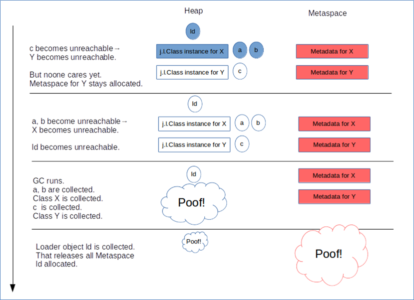</div>

从这张图可以学到

* 堆内存中：当一个<b>类加载器对象</b>，这个类加载器对象加载的所有<b>类对象</b>，这些类对象对应的所有<b>实例对象</b>都没人引用时，GC 时就会对它们占用的对内存进行释放
* 元空间中：内存释放<b>以类加载器为单位</b>，当堆中类加载器内存释放时，对应的元空间中的类元信息也会释放

## JVM 内存参数

<b>要求</b> 

* 熟悉常见的 JVM 参数，尤其和大小相关的

<b>堆内存，按大小设置</b>

<div align="center"></div>

解释：

* -Xms 最小堆内存（包括新生代和老年代）
* -Xmx 最大对内存（包括新生代和老年代）
* 通常建议将 -Xms 与 -Xmx 设置为大小相等，即不需要保留内存，不需要从小到大增长，这样性能较好
* -XX:NewSize 与 -XX:MaxNewSize 设置新生代的最小与最大值，但一般不建议设置，由 JVM 自己控制
* -Xmn 设置新生代大小，相当于同时设置了 -XX:NewSize 与 -XX:MaxNewSize 并且取值相等
* 保留是指，一开始不会占用那么多内存，随着使用内存越来越多，会逐步使用这部分保留内存。下同

<b>堆内存，按比例设置</b>

<div align="center"></div>

解释：

* -XX:NewRatio=2:1 表示老年代占两份，新生代占一份
* -XX:SurvivorRatio=4:1 表示新生代分成六份，伊甸园占四份，from 和 to 各占一份

<b>元空间内存设置</b>

<div align="center"></div>

解释：

* class space 存储类的基本信息，最大值受 -XX:CompressedClassSpaceSize 控制
* non-class space 存储除类的基本信息以外的其它信息（如方法字节码、注解等）
* class space 和 non-class space 总大小受 -XX:MaxMetaspaceSize 控制

注意：

* 这里 -XX:CompressedClassSpaceSize 这段空间还与是否开启了指针压缩有关，这里暂不深入展开，可以简单认为指针压缩默认开启

<b>代码缓存内存设置</b>

<div align="center"></div>

解释：

* 如果 -XX:ReservedCodeCacheSize < 240m，所有优化机器代码不加区分存在一起
* 否则，分成三个区域（图中笔误 mthod 拼写错误，少一个 e）
    * non-nmethods - JVM 自己用的代码
    * profiled nmethods - 部分优化的机器码
    * non-profiled nmethods - 完全优化的机器码

<b>线程内存设置</b>

<div align="center">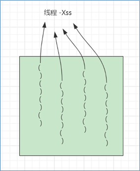</div>

> <b>官方参考文档</b>
>
> * https://docs.oracle.com/en/java/javase/11/tools/java.html#GUID-3B1CE181-CD30-4178-9602-230B800D4FAE

## JVM 垃圾回收

<b>要求</b>

* 掌握垃圾回收算法
* 掌握分代回收思想
* 理解三色标记及漏标处理
* 了解常见垃圾回收器

<b>三种垃圾回收算法</b>

- 标记清除法
- 标记整理法
- 标记复制法

### 标记清除法

<div align="center"></div>

解释：

1. 找到 GC Root 对象，即那些一定不会被回收的对象，如正执行方法内局部变量引用的对象、静态变量引用的对象
2. 标记阶段：沿着 GC Root 对象的引用链找，直接或间接引用到的对象加上标记
3. 清除阶段：释放未加标记的对象占用的内存

要点：

* 标记速度与存活对象线性关系
* 清除速度与内存大小线性关系
* 缺点是会产生内存碎片

### 标记整理法

<div align="center"></div>

解释：

1. 前面的标记阶段、清理阶段与标记清除法类似
2. 多了一步整理的动作，将存活对象向一端移动，可以避免内存碎片产生

特点：

* 标记速度与存活对象线性关系

* 清除与整理速度与内存大小成线性关系
* 缺点是性能上较慢

### 标记复制法

<div align="center"></div>

解释：

1. 将整个内存分成两个大小相等的区域，from 和 to，其中 to 总是处于空闲，from 存储新创建的对象
2. 标记阶段与前面的算法类似
3. 在找出存活对象后，会将它们从 from 复制到 to 区域，复制的过程中自然完成了碎片整理
4. 复制完成后，交换 from 和 to 的位置即可

特点：

* 标记与复制速度与存活对象成线性关系
* 缺点是会占用成倍的空间

### GC 与分代回收算法

GC 的目的在于实现无用对象内存自动释放，减少内存碎片、加快分配速度

GC 要点：

* 回收区域是<b>堆内存</b>，不包括虚拟机栈
* 判断无用对象，使用<b>可达性分析算法</b>，<b>三色标记法</b>标记存活对象，回收未标记对象
* GC 具体的实现称为<b>垃圾回收器</b>
* GC 大都采用了<b>分代回收思想</b>
    * 理论依据是大部分对象朝生夕灭，用完立刻就可以回收，另有少部分对象会长时间存活，每次很难回收
    * 根据这两类对象的特性将回收区域分为<b>新生代</b>和<b>老年代</b>，新生代采用标记复制法、老年代一般采用标记整理法
* 根据 GC 的规模可以分成 <b>Minor GC，Mixed GC，Full GC</b>

<b>分代回收</b>

1. 伊甸园 eden，最初对象都分配到这里，与幸存区 survivor（分成 from 和 to）合称新生代，

<div align="center"></div>

2. 当伊甸园内存不足，标记伊甸园与 from（现阶段没有）的存活对象

<div align="center"></div>

3. 将存活对象采用复制算法复制到 to 中，复制完毕后，伊甸园和 from 内存都得到释放

<div align="center"></div>

4. 将 from 和 to 交换位置

<div align="center"></div>

5. 经过一段时间后伊甸园的内存又出现不足

<div align="center"></div>

6. 标记伊甸园与 from（现阶段没有）的存活对象

<div align="center">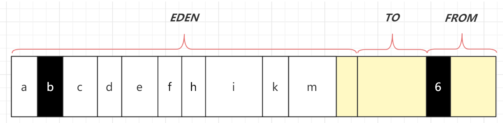</div>

7. 将存活对象采用复制算法复制到 to 中

<div align="center"></div>

8. 复制完毕后，伊甸园和 from 内存都得到释放

<div align="center"></div>

9. 将 from 和 to 交换位置

<div align="center"></div>

10. 老年代 old，当幸存区对象熬过几次回收（最多15次），晋升到老年代（幸存区内存不足或大对象会导致提前晋升）

<b>GC 规模</b>

* Minor GC 发生在新生代的垃圾回收，暂停时间短

* Mixed GC 新生代 + 老年代部分区域的垃圾回收，G1 收集器特有

* Full GC 新生代 + 老年代完整垃圾回收，暂停时间长，<b>应尽力避免</b>

<b>三色标记</b>

即用三种颜色记录对象的标记状态

* 黑色 – 已标记
* 灰色 – 标记中
* 白色 – 还未标记

1. 起始的三个对象还未处理完成，用灰色表示

<div align="center"></div>

2. 该对象的引用已经处理完成，用黑色表示，黑色引用的对象变为灰色

<div align="center"></div>

3. 依次类推

<div align="center"></div>

4. 沿着引用链都标记了一遍

<div align="center"></div>

5. 最后为标记的白色对象，即为垃圾

<div align="center"></div>

<b>并发漏标问题</b>

比较先进的垃圾回收器都支持<b>并发标记</b>，即在标记过程中，用户线程仍然能工作。但这样带来一个新的问题，如果用户线程修改了对象引用，那么就存在漏标问题。例如：

1. 如图所示标记工作尚未完成

<div align="center"></div>

2. 用户线程同时在工作，断开了第一层 3、4 两个对象之间的引用，这时对于正在处理 3 号对象的垃圾回收线程来讲，它会将 4 号对象当做是白色垃圾

<div align="center">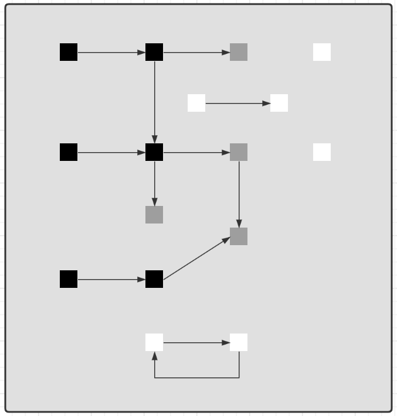</div>

3. 但如果其他用户线程又建立了 2、4 两个对象的引用，这时因为 2 号对象是黑色已处理对象了，因此垃圾回收线程不会察觉到这个引用关系的变化，从而产生了漏标

<div align="center"></div>

4. 如果用户线程让黑色对象引用了一个新增对象，一样会存在漏标问题

<div align="center"></div>

因此对于<b>并发标记</b>而言，必须解决漏标问题，也就是要记录标记过程中的变化。有两种解决方法：

1. Incremental Update 增量更新法，CMS 垃圾回收器采用
    * 思路是拦截每次赋值动作，只要赋值发生，被赋值的对象就会被记录下来，在重新标记阶段再确认一遍
2. Snapshot At The Beginning，SATB 原始快照法，G1 垃圾回收器采用
    * 思路也是拦截每次赋值动作，不过记录的对象不同，也需要在重新标记阶段对这些对象二次处理
    * 新加对象会被记录
    * 被删除引用关系的对象也被记录

### 垃圾回收器

<b>垃圾回收器 - Parallel GC</b>

* eden 内存不足发生 Minor GC，采用标记复制算法，需要暂停用户线程
* old 内存不足发生 Full GC，采用标记整理算法，需要暂停用户线程

* <b>注重吞吐量</b>

<b>垃圾回收器 - ConcurrentMarkSweep GC</b>

* 它是工作在 old 老年代，支持<b>并发标记</b>的一款回收器，采用<b>并发清除</b>算法
    * 并发标记时不需暂停用户线程
    * 重新标记时仍需暂停用户线程

* 如果并发失败（即回收速度赶不上创建新对象速度），会触发 Full GC

* <b>注重响应时间</b>

<b>垃圾回收器 - G1 GC</b>

* <b>响应时间与吞吐量兼顾</b>
* 划分成多个区域，每个区域都可以充当 eden，survivor，old， humongous，其中 humongous 专为大对象准备
* 分成三个阶段：新生代回收、并发标记、混合收集
* 如果并发失败（即回收速度赶不上创建新对象速度），会触发 Full GC

<b>G1 回收阶段 - 新生代回收</b>

1. 初始时，所有区域都处于空闲状态

<div align="center"></div>

2. 创建了一些对象，挑出一些空闲区域作为伊甸园区存储这些对象

<div align="center"></div>

3. 当伊甸园需要垃圾回收时，挑出一个空闲区域作为幸存区，用复制算法复制存活对象，需要暂停用户线程

<div align="center">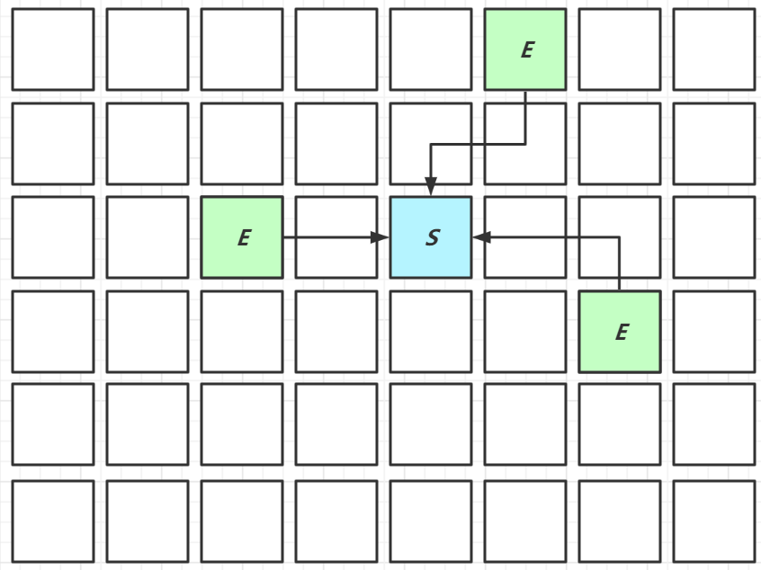</div>

4. 复制完成，将之前的伊甸园内存释放

<div align="center"></div>

5. 随着时间流逝，伊甸园的内存又有不足

<div align="center"></div>

6. 将伊甸园以及之前幸存区中的存活对象，采用复制算法，复制到新的幸存区，其中较老对象晋升至老年代

<div align="center"></div>

7. 释放伊甸园以及之前幸存区的内存

<div align="center">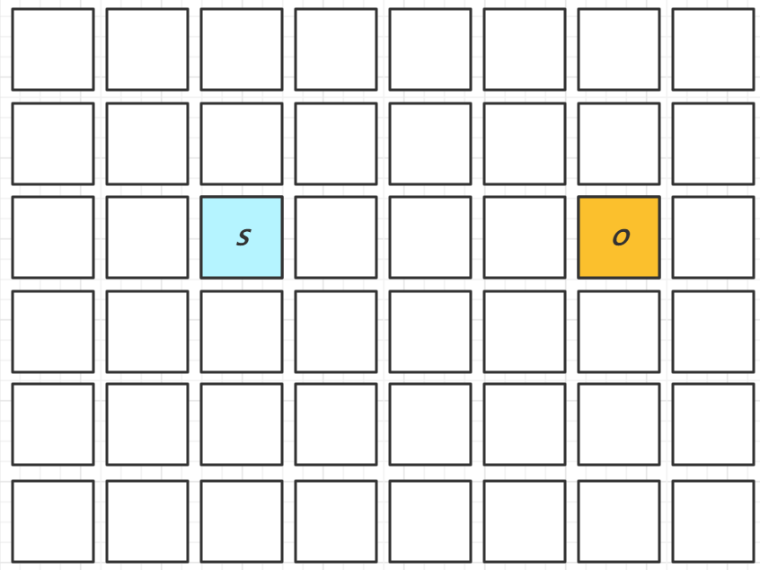</div>

<b>G1 回收阶段 - 并发标记与混合收集</b>

1. 当老年代占用内存超过阈值后，触发并发标记，这时无需暂停用户线程

<div align="center">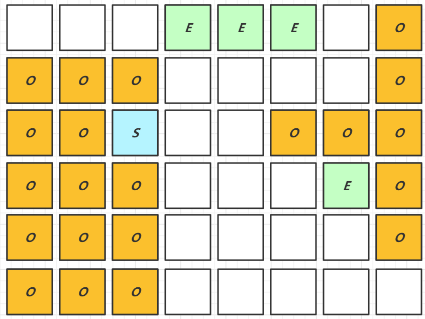</div>

2. 并发标记之后，会有重新标记阶段解决漏标问题，此时需要暂停用户线程。这些都完成后就知道了老年代有哪些存活对象，随后进入混合收集阶段。此时不会对所有老年代区域进行回收，而是根据<b>暂停时间目标</b>优先回收价值高（存活对象少）的区域（这也是 Gabage First 名称的由来）。

<div align="center">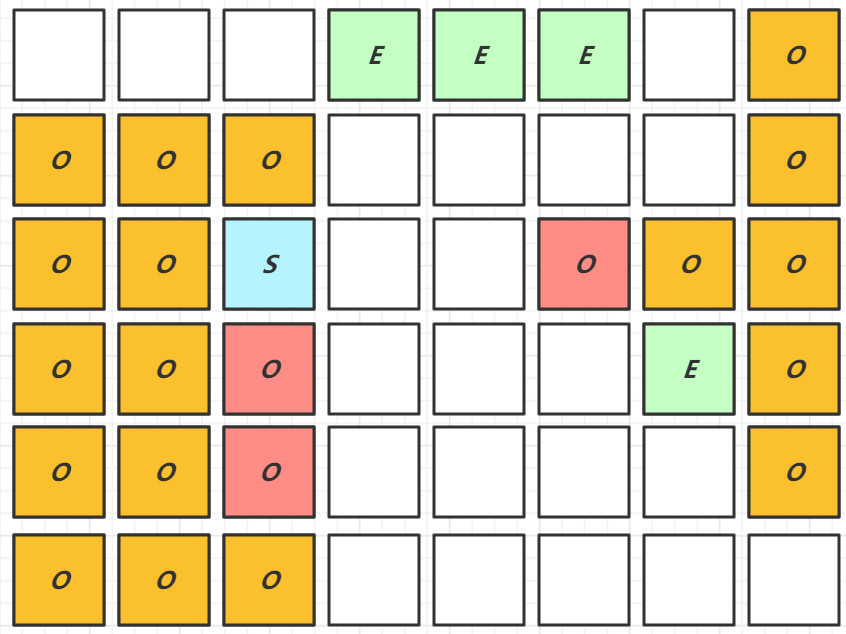</div>

3. 混合收集阶段中，参与复制的有 eden、survivor、old，下图显示了伊甸园和幸存区的存活对象复制

<div align="center"></div>

4. 下图显示了老年代和幸存区晋升的存活对象的复制

<div align="center"></div>

5. 复制完成，内存得到释放。进入下一轮的新生代回收、并发标记、混合收集

<div align="center"></div>

## 内存溢出

<b>要求</b>

* 能够说出几种典型的导致内存溢出的情况

<b>典型情况</b>

* 误用线程池导致的内存溢出
    * 参考 day03.TestOomThreadPool
* 查询数据量太大导致的内存溢出
    * 参考 day03.TestOomTooManyObject
* 动态生成类导致的内存溢出
    * 参考 day03.TestOomTooManyClass

## 类加载

<b>要求</b>

* 掌握类加载阶段
* 掌握类加载器
* 理解双亲委派机制

<b>类加载过程的三个阶段</b>

1. 加载

    1. 将类的字节码载入方法区，并创建类.class 对象 (方法区的字节码是由 CPP 表示的, Java 无法直接访问. .class 对象是一个对象,存放在堆中)

    2. 如果此类的父类没有加载，先加载父类
    3. 加载是懒惰执行, 用到类的才会加载.

2. 链接
    1. 验证 – 验证类是否符合 Class 规范，合法性、安全性检查
    2. 准备 – 为 static 变量分配空间，设置默认值. ( 不会进行赋值操作,赋值操作是在初始化阶段进行的. )
    3. 解析 – 将常量池的符号引用解析为直接引用

3. 初始化
    1. 静态代码块、static 修饰的变量赋值、static final 修饰的引用类型变量赋值，会被合并成一个 `<cinit>` 方法，在初始化时被调用
    2. <b>static final 修饰的基本类型变量赋值，在链接阶段就已完成</b>
    3. 初始化是懒惰执行

> <b>验证手段</b>
>
> * 使用 jps 查看进程号
> * 使用 jhsdb 调试，执行命令 `jhsdb.exe hsdb` 打开它的图形界面
>     * Class Browser 可以查看当前 jvm 中加载了哪些类
>     * 控制台的 universe 命令查看堆内存范围
>     * 控制台的 g1regiondetails 命令查看 region 详情
>     * `scanoops 起始地址 结束地址 对象类型` 可以根据类型查找某个区间内的对象地址
>     * 控制台的 `inspect 地址` 指令能够查看这个地址对应的对象详情
> * 使用 javap 命令可以查看 class 字节码

><b>代码说明</b>
>
>* day03.loader.TestLazy - 验证类的加载是懒惰的，用到时才触发类加载
>* day03.loader.TestFinal - 验证使用 final 修饰的变量不会触发类加载

<b>jdk8 的类加载器</b>

| <b>名称</b>             | <b>加载哪的类</b>     | <b>说明</b>                    |
| ----------------------- | --------------------- | ------------------------------ |
| Bootstrap ClassLoader   | JAVA_HOME/jre/lib     | 无法直接访问                   |
| Extension ClassLoader   | JAVA_HOME/jre/lib/ext | 上级为 Bootstrap，显示为  null |
| Application ClassLoader | classpath             | 上级为 Extension               |
| 自定义类加载器          | 自定义                | 上级为 Application             |

<b>双亲委派机制</b>

所谓的双亲委派，就是指优先委派上级类加载器进行加载，如果上级类加载器

* 能找到这个类，由上级加载，加载后该类也对下级加载器可见
* 找不到这个类，则下级类加载器才有资格执行加载

双亲委派的目的有两点

1. 让上级类加载器中的类对下级共享（反之不行），即能让你的类能依赖到 jdk 提供的核心类

2. 让类的加载有优先次序，保证核心类优先加载

<b>对双亲委派的误解</b>

下面面试题的回答是错误的

<div align="center"></div>

错在哪了？

* 自己编写类加载器就能加载一个假冒的 java.lang.System 吗? 答案是不行。

* 假设你自己的类加载器用双亲委派，那么优先由启动类加载器加载真正的 java.lang.System，自然不会加载假冒的

* 假设你自己的类加载器不用双亲委派，那么你的类加载器加载假冒的 java.lang.System 时，它需要先加载父类 java.lang.Object，而你没有用委派，找不到 java.lang.Object 所以加载会失败

* <b>以上也仅仅是假设</b>。事实上操作你就会发现，自定义类加载器加载以 java. 打头的类时，会抛安全异常，在 jdk9 以上版本这些特殊包名都与模块进行了绑定，更连编译都过不了

><b>代码说明</b>
>
>* day03.loader.TestJdk9ClassLoader - 演示类加载器与模块的绑定关系

## 四种引用

<b>要求</b>

* 掌握四种引用

<b>强引用</b>

1. 普通变量赋值即为强引用，如 A a = new A();

2. 通过 GC Root 的引用链，如果强引用不到该对象，该对象才能被回收

<div align="center"></div>

<b>软引用（SoftReference）</b>

1. 例如：SoftReference a = new SoftReference(new A());

2. 如果仅有软引用该对象时，首次垃圾回收不会回收该对象，如果内存仍不足，再次回收时才会释放对象

3. 软引用自身需要配合引用队列来释放

4. 典型例子是反射数据

<div align="center"></div>

<b>弱引用（WeakReference）</b>

1. 例如：WeakReference a = new WeakReference(new A());

2. 如果仅有弱引用引用该对象时，只要发生垃圾回收，就会释放该对象

3. 弱引用自身需要配合引用队列来释放

4. 典型例子是 ThreadLocalMap 中的 Entry 对象

<div align="center"></div>

<b>虚引用（PhantomReference）</b>

1. 例如： PhantomReference a = new PhantomReference(new A(), referenceQueue);

2. 必须配合引用队列一起使用，当虚引用所引用的对象被回收时，由 Reference Handler 线程将虚引用对象入队，这样就可以知道哪些对象被回收，从而对它们关联的资源做进一步处理

3. 典型例子是 Cleaner 释放 DirectByteBuffer 关联的直接内存

<div align="center">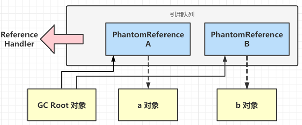</div>

><b>代码说明</b>
>
>* day03.reference.TestPhantomReference - 演示虚引用的基本用法
>* day03.reference.TestWeakReference - 模拟 ThreadLocalMap, 采用引用队列释放 entry 内存

## finalize

<b>要求</b>

* 掌握 finalize 的工作原理与缺点

<b>finalize</b>

* 它是 Object 中的一个方法，如果子类重写它，垃圾回收时此方法会被调用，可以在其中进行资源释放和清理工作
* 将资源释放和清理放在 finalize 方法中非常不好，非常影响性能，严重时甚至会引起 OOM，从 Java9 开始就被标注为 @Deprecated，不建议被使用了

<b>finalize 原理</b>

1. 对 finalize 方法进行处理的核心逻辑位于 java.lang.ref.Finalizer 类中，它包含了名为 unfinalized 的静态变量（双向链表结构），Finalizer 也可被视为另一种引用对象（地位与软、弱、虚相当，只是不对外，无法直接使用）
2. 当重写了 finalize 方法的对象，在构造方法调用之时，JVM 都会将其包装成一个 Finalizer 对象，并加入 unfinalized 链表中

<div align="center"></div>

3. Finalizer 类中还有另一个重要的静态变量，即 ReferenceQueue 引用队列，刚开始它是空的。当狗对象可以被当作垃圾回收时，就会把这些狗对象对应的 Finalizer 对象加入此引用队列
4. 但此时 Dog 对象还没法被立刻回收，因为 unfinalized -> Finalizer 这一引用链还在引用它嘛，为的是【先别着急回收啊，等我调完 finalize 方法，再回收】
5. FinalizerThread 线程会从 ReferenceQueue 中逐一取出每个 Finalizer 对象，把它们从链表断开并真正调用 finallize 方法

<div align="center">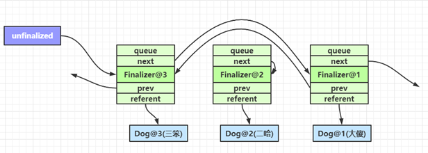</div>

6. 由于整个 Finalizer 对象已经从 unfinalized 链表中断开，这样没谁能引用到它和狗对象，所以下次 gc 时就被回收了

<b>finalize 缺点</b>

* 无法保证资源释放：FinalizerThread 是守护线程，代码很有可能没来得及执行完，线程就结束了
* 无法判断是否发生错误：执行 finalize 方法时，会吞掉任意异常（Throwable）
* 内存释放不及时：重写了 finalize 方法的对象在第一次被 gc 时，并不能及时释放它占用的内存，因为要等着 FinalizerThread 调用完 finalize，把它从 unfinalized 队列移除后，第二次 gc 时才能真正释放内存
* 有的文章提到【Finalizer 线程会和我们的主线程进行竞争，不过由于它的优先级较低，获取到的CPU时间较少，因此它永远也赶不上主线程的步伐】这个显然是错误的，FinalizerThread 的优先级较普通线程更高，原因应该是 finalize 串行执行慢等原因综合导致

> <b>代码说明</b>
>
> * day03.reference.TestFinalize - finalize 的测试代码

# Tomcat

## Tomcat 为什么要重写类加载

[Tomcat 源码分析 WebappClassLoader 分析 (基于8.0.5) - 简书 (jianshu.com)](https://www.jianshu.com/p/269f60fa481e)

<b>先回顾双亲委派模型</b>

双亲委派模式，就是调用类加载器 ClassLoader 的 loadClass 方法时，查找类的规则。先问父类能不能处理，父类不能处理才自己处理。

<span style="color:red">注意：这里的双亲，翻译为上级应该更合适，因为它们并没有继承关系。</span>


<b>双亲委派的优点</b>

Java 中的类随着它的类加载器一起具备了一种带有优先级的层次关系。如 java.lang.Object，存放在 rt.jar 中，无论那个类加载器要加载这个类，最终都是委派给处于模型最顶端的启动类加载器进行加载，因此 Object 类在程序的各种类加载器环境中都能保证是同一个类。

<b>Tomcat 重写类加载器的原因</b>

1️⃣无法实现 Web 应用隔离：Tomcat 中往往需要部署多个 Web 应用。如果采用默认的类加载器，走双亲委派模型，那么是无法加载两个相同类库的不同版本的，默认的类加器是不管你是什么版本的，只在乎你的全限定类名，并且只有一份。一个 web 容器可能要部署两个或者多个应用程序，不同的应用程序，可能会依赖同一个第三方类库的不同版本，因此要保证每一个应用程序的类库都是独立、相互隔离的。部署在同一个 web 容器中的相同类库的相同版本可以共享，否则，会有重复的类库被加载进 JVM，web 容器也有自己的类库，不能和应用程序的类库混淆，需要相互隔离。

2️⃣无法实现热替换：jsp 文件其实也就是 class 文件，那么如果修改了，但类名还是一样，类加载器会直接取方法区中已经存在的，因此修改后的 jsp 是不会重新加载的。


- CommonClassLoader：tomcat 最基本的类加载器，加载路径中的 class 可以被 tomcat 和各个 webapp 访问
- CatalinaClassLoader：tomcat 私有的类加载器，webapp 不能访问其加载路径下的 class，即对 webapp 不可见
- SharedClassLoader：各个 webapp 共享的类加载器，对 tomcat 不可见
- WebappClassLoader：webapp 私有的类加载器，只对当前 webapp 可见

每一个 web 应用程序对应一个 WebappClassLoader，每一个 jsp 文件对应一个 JspClassLoader，所以这两个类加载器有多个实例。如果 web 应用中的 jsp 被修改了，则丢弃加载原先 jsp 的 JspClassLoader，这也 jsp 就可以被新的 classLoader 再次加载。

<b>工作原理</b>

- 不同的类加载器会指定自己加载那些目录下的类
    - Bootstrap 类加载器负责加载 Java 核心包的类
    - Extension 类加载器负责加载标准扩展路径下的类 `JAVA_HOME/jre/lib/ext`
    - System 类加载器，即应用程序类加载器，用于加载 main 类和先前两种类加载器都没有覆盖的其他类的默认类加载器。IDEA 运行的时候如果依赖了其他三方 jar，会在执行代码的时候加追加 classpath 参数。
    - Tomcat 自定义的几个类加载器也是指定了加载 xx 路径下的类。
- WebAppClassLoader 规定了在 CATALINAME_HOME/webapps/[webapp]/WEB-INF/lib 和 WEB-INF/classes 目录下搜寻 JAR 文件和类文件，<span style="color:orange">它不使用双亲委派模式，而是先自己加载类，加载不了再有上级加载器加载，也可通过配置，先使用上级加载器进行加载，上级加载不了再使用自己的类加载器。但是 WebAppClassLoader 无法覆盖 Java 基本类，因为会优先使用 ExtClassLoader 尝试加载，如果这些类是位于 ExtClassLoader 扫描的目录下，ExtClassLoader 可以正常加载。这也就避免了 WebAppClassLoader 覆盖 Java 基本类库。</span>
- 而 JasperLoader 的加载范围仅仅是这个 JSP 文件所编译出来的那一个 .class 文件，它出现的目的就是为了被丢弃，当 Web 容器检测到 JSP 文件被修改时，会替换掉目前的 JasperLoader 的实例，并通过再建立一个新的 Jsp 类加载器来实现 JSP 文件的 HotSwap 功能。

<b>补充内容</b>

- CommonClassLoader 能加载的类都可以被 CatalinaClassLoader 和 SharedClassLoader 使用，从而实现了公有类库的共用。
- CatalinaClassLoader 和 SharedClassLoader 自己能加载的类则与对方相互隔离
- WebAppClassLoader 可以使用 SharedClassLoader 加载到的类，但各个 WebAppClassLoader 实例之间相互隔离，多个 WebAppClassLoader 是同级关系。

<b>基于源码，分析 WebAppClassLoader</b>

```java
// tomcat 8.5.x 源码
// java/org/apache/catalina/loader/WebappClassLoaderBase#loadClass
// 代码中省略了打日志的部分代码
public Class<?> loadClass(String name, boolean resolve) throws ClassNotFoundException {

    synchronized (getClassLoadingLock(name)) {
        Class<?> clazz = null;

        // Log access to stopped class loader
        // 1.  判断程序是否已经启动了, 未启动 OK, 就进行加载, 则直接抛异常
        checkStateForClassLoading(name);

        // (0) Check our previously loaded local class cache
        // 2. 当前对象缓存中检查是否已经加载该类, 有的话直接返回 Class
        clazz = findLoadedClass0(name);
        if (clazz != null) {
            if (resolve) {
                resolveClass(clazz);
            }
            return clazz;
        }

        // (0.1) Check our previously loaded class cache
        // 3. 是否已经加载过该类 (这里的加载最终会调用一个 native 方法, 
        // 意思就是检查这个 ClassLoader 是否已经加载过对应的 class)
        clazz = findLoadedClass(name);
        if (clazz != null) {
            if (resolve) {
                resolveClass(clazz);
            }
            return clazz;
        }

        // (0.2) Try loading the class with the bootstrap class loader, to prevent
        //       the webapp from overriding Java SE classes. This implements
        //       SRV.10.7.2
        // 这是为什么呢 ? 这里直接用 ExtClassLoader 来加载 J2SE 所对应的 class, 防止被 WebappClassLoader 加载了
        // 判断该类名是否是 JavaSE 中的，则用 ExtClassLoader 来加载，如果不是则用其他类加载器进行加载（此处破坏了双亲委派模型）
        String resourceName = binaryNameToPath(name, false);

        ClassLoader javaseLoader = getJavaseClassLoader();
        boolean tryLoadingFromJavaseLoader;
        try {

            URL url;
            // 设置了权限校验就坐权限校验，看是否有权加载该类。
            if (securityManager != null) {
                PrivilegedAction<URL> dp = new PrivilegedJavaseGetResource(resourceName);
                url = AccessController.doPrivileged(dp);
            } else {
                // 如果
                url = javaseLoader.getResource(resourceName);
            }
            tryLoadingFromJavaseLoader = (url != null);
        } catch (Throwable t) {
            // Swallow all exceptions apart from those that must be re-thrown
            ExceptionUtils.handleThrowable(t);
            // The getResource() trick won't work for this class. We have to
            // try loading it directly and accept that we might get a
            // ClassNotFoundException.
            tryLoadingFromJavaseLoader = true;
        }
		
        // 尝试使用 ExtClassLoader 加载
        if (tryLoadingFromJavaseLoader) {
            try {
                clazz = javaseLoader.loadClass(name);
                if (clazz != null) {
                    if (resolve) {
                        resolveClass(clazz);
                    }
                    return clazz;
                }
            } catch (ClassNotFoundException e) {
                // Ignore
            }
        }

        // (0.5) Permission to access this class when using a SecurityManager
        if (securityManager != null) {
            int i = name.lastIndexOf('.');
            if (i >= 0) {
                try {
                    securityManager.checkPackageAccess(name.substring(0,i));
                } catch (SecurityException se) {
                    String error = sm.getString("webappClassLoader.restrictedPackage", name);
                    log.info(error, se);
                    throw new ClassNotFoundException(error, se);
                }
            }
        }

        boolean delegateLoad = delegate || filter(name, true);

        // (1) Delegate to our parent if requested
		// 如果配置了 parent-first 模式, 那么委托给父加载器
        if (delegateLoad) {
            try {
                clazz = Class.forName(name, false, parent);
                if (clazz != null) {
                    if (resolve) {
                        resolveClass(clazz);
                    }
                    return clazz;
                }
            } catch (ClassNotFoundException e) {
                // Ignore
            }
        }

        // (2) Search local repositories
        try {
            // 从 WebApp 中去加载类, 主要是 WebApp 下的 classes 目录 与 lib 目录
            clazz = findClass(name);
            if (clazz != null) {
                if (resolve) {
                    resolveClass(clazz);
                }
                return clazz;
            }
        } catch (ClassNotFoundException e) {
            // Ignore
        }

        // (3) Delegate to parent unconditionally
        // 如果在当前 WebApp 中无法加载到, 委托给 StandardClassLoader 从 $catalina_home/lib 中去加载
        if (!delegateLoad) {
            try {
                clazz = Class.forName(name, false, parent);
                if (clazz != null) {
                    if (log.isDebugEnabled()) {
                        log.debug("  Loading class from parent");
                    }
                    if (resolve) {
                        resolveClass(clazz);
                    }
                    return clazz;
                }
            } catch (ClassNotFoundException e) {
                // Ignore
            }
        }
    }
	// 若还没加载成功的话, 那就直接抛异常
    throw new ClassNotFoundException(name);
}
```

其他的类加载器也是修改了 loadClass 的加载逻辑，实现的类隔离。

<b>tomcat 目录结构与上面的类加载器对应</b>

- /common/*
- /server/*
- /shared/*
- /WEB-INF/*

默认情况下，conf 目录下的 catalina.properties 文件，没有指定 server.loader 以及 shared.loader，所以 tomcat 没有建立 CatalinaClassLoader 和 SharedClassLoader 的实例，这两个都会使用 CommonClassLoader 来代替。Tomcat6 之后，把 common，shared，server 目录合成了一个 lib 目录。所以在我们的服务器里看不到 common，shared，server 目录。

#  框架

## Spring refresh 流程

<b>要求</b>

* 掌握 refresh 的 12 个步骤

ApplicationContext 只是一个外部的容器，核心功能还是要交给 BeanFactory 容器。

### 概述

refresh 是 AbstractApplicationContext 中的一个方法，负责初始化 ApplicationContext 容器，容器必须调用 refresh 才能正常工作。它的内部主要会调用 12 个方法，我们把它们称为 refresh 的 12 个步骤：

- 准备工作
    - prepareRefresh
- 创建和准备 BeanFactory 对象
    - obtainFreshBeanFactory
    - prepareBeanFactory
    - postProcessBeanFactory
    - invokeBeanFactoryPostProcessors
    - registerBeanPostProcessors
- 准备 ApplicationContext
    - initMessageSource
    - initApplicationEventMulticaster
    - onRefresh
    - registerListeners
    - <b>finishBeanFactoryInitialization</b> 创建单例对象（初始化 BeanFactory 中非延迟单例 bean）
    - finishRefresh

### 每步的功能

- prepareRefresh -- 做好准备工作：创建一个 Eventivorment 对象，为 Spring 后续的运行准备键值信息。
- obtainFreshBeanFactory -- 创建或获取 BeanFactory：
- prepareBeanFactory -- 准备 BeanFactory：为 BeanFactory 准备各个成员变量，如 EL 表达式的解析器，类型转换器，内置的 BeanPostProcessor
- postProcessBeanFactory -- 子类扩展 BeanFactory
- invokeBeanFactoryPostProcessors -- 后处理器扩展 BeanFactory，比较重要的有 ConfigurationClassPostProcessor 可以解析各种配置信息的注解。
- registerBeanPostProcessors -- 准备 Bean 后处理器，常见的有 解析 Autowired 注解的，解析 Resource 注解的，创建代理类的。
- initMessageSource -- 为 ApplicationContext 提供国际化功能
- initApplicationEventMulticaster -- 为 ApplicationContext  提供事件发布器
- onRefresh -- 留给子类扩展
- registerListeners -- 为 ApplicationContext  准备监听器
- <b>finishBeanFactoryInitialization</b> -- 初始化所有非延迟单例 Bean，执行 Bean 后处理器扩展
- finishRefresh -- 准备生命周期管理器，发布 ContextRefreshed 事件。

```java
@Override
// 用到了模板方法。定义流程规则，具体实现由子类实现。
public void refresh() throws BeansException, IllegalStateException {
   synchronized (this.startupShutdownMonitor) {
      // Prepare this context for refreshing.
      prepareRefresh();

      // Tell the subclass to refresh the internal bean factory.
      ConfigurableListableBeanFactory beanFactory = obtainFreshBeanFactory();

      // Prepare the bean factory for use in this context.
      prepareBeanFactory(beanFactory);

      try {
         // Allows post-processing of the bean factory in context subclasses.
         postProcessBeanFactory(beanFactory);

         // Invoke factory processors registered as beans in the context.
         invokeBeanFactoryPostProcessors(beanFactory);

         // Register bean processors that intercept bean creation.
         registerBeanPostProcessors(beanFactory);

         // Initialize message source for this context.
         initMessageSource();

         // Initialize event multicaster for this context.
         initApplicationEventMulticaster();

         // Initialize other special beans in specific context subclasses.
         onRefresh();

         // Check for listener beans and register them.
         registerListeners();

         // Instantiate all remaining (non-lazy-init) singletons.
         finishBeanFactoryInitialization(beanFactory);

         // Last step: publish corresponding event.
         finishRefresh();
      }

      catch (BeansException ex) {
         if (logger.isWarnEnabled()) {
            logger.warn("Exception encountered during context initialization - " +
                  "cancelling refresh attempt: " + ex);
         }

         // Destroy already created singletons to avoid dangling resources.
         destroyBeans();

         // Reset 'active' flag.
         cancelRefresh(ex);

         // Propagate exception to caller.
         throw ex;
      }

      finally {
         // Reset common introspection caches in Spring's core, since we
         // might not ever need metadata for singleton beans anymore...
         resetCommonCaches();
      }
   }
}
```

### prepareRefresh

- 创建和准备 Environment 对象
- 理解 Environment 对象的作用
    - 提供一些键值信息，管理各种键值信息。
    - systemProperties
    - systemEnvironment
    - 自定义 PropertySource

Environment  的作用之一就是为后续 @Value，值注入时提供键值。

Environment 分成三个主要部分

* systemProperties - 保存 java 环境键值
* systemEnvironment - 保存系统环境键值
* 自定义 PropertySource - 保存自定义键值，例如来自于 *.properties 文件的键值

<div align="center"></div>

### obtainFreshBeanFactory

- 获取（或创建）BeanFactory
- 理解 BeanFactory 的作用
- 理解 BeanDefinition 的作用
- BeanDefinition 从何而来

BeanFactory 会包含这几个信息

- beanDefinitionMap - 初始化了
- beanExpressionResolver
- propertyEditorRegistrars
- resolvableDependencies
- beanPostProcessors
- conversionService
- embeddedValueResolvers
- singletonObjects

* 这一步获取（或创建） BeanFactory，它也是作为 ApplicationContext 的一个成员变量
* BeanFactory 的作用是负责 bean 的创建、依赖注入和初始化，bean 的各项特征由 BeanDefinition 定义
    * BeanDefinition 作为 bean 的设计蓝图，规定了 bean 的特征，如单例多例、依赖关系、初始销毁方法等
    * BeanDefinition 的来源有多种多样，可以是通过 xml 获得、配置类获得、组件扫描获得，也可以是编程添加
* 所有的 BeanDefinition 会存入 BeanFactory 中的 beanDefinitionMap 集合

<div align="center"></div>

###  prepareBeanFactory

准备 bean 工厂。即把成员变量初始化好。

- 这一步会进一步完善 BeanFactory，为它的各项成员变量赋值
- beanExpressionResolver 用来解析 SpEL，常见实现为 StandardBeanExpressionResolver
- propertyEditorRegistrars 会注册类型转换器
    * 它在这里使用了 ResourceEditorRegistrar 实现类
    * 并应用 ApplicationContext 提供的 Environment 完成 ${ } 解析
- registerResolvableDependency 来注册 beanFactory 以及 ApplicationContext，让它们也能用于依赖注入
- beanPostProcessors 是 bean 后处理器集合，会工作在 bean 的生命周期各个阶段，此处会添加两个：
    * ApplicationContextAwareProcessor 用来解析 Aware 接口
    * ApplicationListenerDetector 用来识别容器中 ApplicationListener 类型的 bean

<div align="center"></div>

### postProcessBeanFactory

- 空方法，留给子类扩展
- 用到了模板方法设计模式
- 一般 Web 环境的  ApplicationContext 都要利用它注册新的 Scope，完善 Web 下的  BeanFactory

### invokeBeanFactoryPostProcessors

- 这一步会调用 beanFactory 后处理器
- beanFactory 后处理器，充当 beanFactory 的扩展点，可以用来补充或修改 BeanDefinition
- 常见的 beanFactory 后处理器有
    * ConfigurationClassPostProcessor – 解析 @Configuration、@Bean、@Import、@PropertySource 等
    * PropertySourcesPlaceHolderConfigurer – 替换 BeanDefinition 中的 ${ }
    * MapperScannerConfigurer – 补充 Mapper 接口对应的 BeanDefinition

<div align="center"></div>

### registerBeanPostProcessors

对 bean 做后处理增强。就是那些需要增强的对象。这些 bean 后处理器都是在 beanDefinitionMap 中搜索，看看有没有人实现了 beanPostProcessors 接口。有的话就创建出来，加入到 beanPostProcessors 集合中。bean 创建时就需要用到这些  bean 后置处理器了。

- 默认的 BeanFactory 是没有这么多功能的。如：没有处理依赖的功能，没有切面增强的功能，需要我们加入后置处理器。
- bean 后处理器，充当 bean 的扩展点，可以工作在 bean 的实例化、依赖注入、初始化阶段
- AutowiredAnnotationBeanPostProcessor 功能有：解析 @Autowired，@Value 注解
- CommonAnnotationBeanPostProcessor 功能有：解析 @Resource，@PostConstruct，@PreDestroy
- AnnotationAwareAspectJAutoProxyCreator 功能有：为符合切点的目标 bean 自动创建代理，从而进行功能增强。
- 在 bean 创建的过程中，才会使用到这些后置处理器。

<div align="center"></div>

###  initMessageSource

- 这一步是为 ApplicationContext 添加 messageSource 成员，实现国际化功能
- 去 beanFactory 内找名为 messageSource 的 bean，如果没有，则提供空的 MessageSource 实现

<div align="center"></div>

### initApplicationEventMulticaster

收发事件。Multicaster用来发事件。监听器负责收事件。也是先到 beanDefinitionMap 中找，有就拿，没有就创建一个默认的。

- 用来发布事件给监听器
- 可以从容器中找名为 applicationEventMulticaster 的 bean 作为事件广播器，若没有，也会新建默认的事件广播器
- 可以调用 ApplicationContext.publishEvent(事件对象) 来发布事件。

<div align="center"></div>

### onRefresh

- 空实现，留给子类扩展
- Spring Boot 中有很多内嵌的 web 容器，其实就是扩展了 onRefresh 这个方法。创建了一些 内嵌web 容器
- 体现的是模板方法设计模式

### registerListeners

- 这一步会从多种途径找到事件监听器，并添加至 applicationEventMulticaster
- 事件监听器顾名思义，用来接收事件广播器发布的事件，有如下来源
    * 事先编程添加的
    * 来自容器中的 bean
    * 来自于 @EventListener 的解析
- 要实现事件监听器，只需要实现 ApplicationListener 接口，重写其中 onApplicationEvent(E e) 方法即可

<div align="center"></div>

### finishBeanFactoryInitialization

- 包含三个内容：conversionService、embeddedValueResolvers、singletonObjects
- 这一步会将 beanFactory 的成员补充完毕，并初始化所有非延迟单例 bean
- conversionService 也是一套转换机制，作为对 PropertyEditor 的补充
- embeddedValueResolvers 即内嵌值解析器，用来解析 @Value 中的 ${ }，借用的是 Environment 的功能
- singletonObjects 即单例池，缓存所有单例对象
    * 对象的创建都分三个阶段，每一阶段都有不同的 bean 后处理器参与进来，扩展功能

<div align="center"></div>

### finishRefresh

- 用来控制容器内需要生命周期管理的 bean。
- 这一步会为 ApplicationContext 添加 lifecycleProcessor 成员，用来控制容器内需要生命周期管理的 bean
- 如果容器中有名称为 lifecycleProcessor 的 bean 就用它，否则创建默认的生命周期管理器
- 准备好生命周期管理器，就可以实现
    * 调用 context 的 start，即可触发所有实现 LifeCycle 接口 bean 的 start
    * 调用 context 的 stop，即可触发所有实现 LifeCycle 接口 bean 的 stop
- 发布 ContextRefreshed 事件，整个 refresh 执行完成

<div align="center">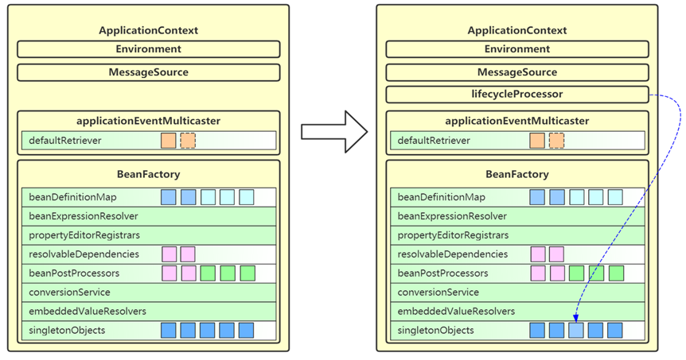</div>

## Spring Bean 的生命周期

<b>要求</b>

* 掌握 Spring bean 的生命周期

<b>bean 生命周期概述</b>

bean 的生命周期从调用 beanFactory 的 getBean 开始，到这个 bean 被销毁，可以总结为以下七个阶段：

Bean 从创建到销毁主要做了那些事情。

```java
protected <T> T doGetBean(
    String name, @Nullable Class<T> requiredType, @Nullable Object[] args, boolean typeCheckOnly)
```

- 阶段 1：处理名称，检查缓存
- 阶段 2：检查父工厂
- 阶段 3：检查 DependsOn
- 阶段 4：按 Scope 创建 Bean

    - 创建 singleton
    - 创建 prototype
    - 创建其他 scope
- 阶段 5：创建 bean
    - <span style="color:red">创建 bean 实例- @Autowired，唯一带参构造，默认构造</span>

    - <span style="color:red">依赖注入 - @Autowired @Value，@Resource，ByName ByType，精确指定</span>

    - <span style="color:red">初始化 - Aware 接口处理，@PostConstruct，InitializingBean，initMethod</span>

    - 登记可销毁 bean

- 阶段 6：类型转换处理
- 阶段7：销毁 bean

> <b>注意</b>
>
> - 划分的阶段和名称并不重要，重要的是理解整个过程中做了哪些事情

### 处理名称，检查缓存

<b>要点</b>

- 掌握别名处理
- 了解 FactoryBean 的名字规范
- 掌握三级缓存的概念

<b>总结</b>

* 这一步会处理别名，将别名解析为实际名称，再进行后续处理，最终还是根据 bean 真正的名字来处理的
* 对 FactoryBean 也会特殊处理，如果以 & 开头表示要获取 FactoryBean 本身，否则表示要获取其产品
* 这里针对单例对象会检查一级、二级、三级缓存
    * singletonFactories 是三级缓存，存放单例工厂对象
    * earlySingletonObjects 是二级缓存，存放单例工厂的产品对象
        * 如果发生循环依赖，产品是代理；无循环依赖，产品是原始对象
    * singletonObjects 一级缓存，存放单例成品对象

### 检查父工厂

<b>要点</b>

- 了解有父容器时的查找规则

<b>总结</b>

* 如果当前容器根据名字找不到这个 bean，此时若父容器存在，则执行父容器的 getBean 流程
* 父子容器的 bean 名称可以重复

### 检查 dependsOn

<b>要点</b>

- 了解有 dependsOn 时的 bean 初始化顺序

<b>总结</b>

* 有依赖关系的 bean 的创建次序是可以确定的。而无显示依赖的创建次序可以用 dependsOn 指定。
* 如果当前 bean 有通过 dependsOn 指定了非显式依赖的 bean，这一步会提前创建这些 dependsOn 的 bean，如 A dependsOn B，那就是 B 先创建。
* 所谓非显式依赖，就是指两个 bean 之间不存在直接依赖关系，但需要控制它们的创建先后顺序

### 选择 scope 策略

<b>要点</b>

- 理解三种 scope

<b>总结</b>

* scope 可以理解为从 XXX 范围内找这个 bean。
* singleton scope 表示从单例池去获取 bean，如果有则直接返回，没有则创建新的
* prototype scope 表示不缓存 bean，每次都创建新的
* request scope 表示从不缓存 bean，每次都创建新的

```java
import org.junit.Test;
import org.springframework.context.annotation.CommonAnnotationBeanPostProcessor;
import org.springframework.context.support.GenericApplicationContext;
import org.springframework.mock.web.MockHttpServletRequest;
import org.springframework.web.context.request.RequestContextHolder;
import org.springframework.web.context.request.RequestScope;
import org.springframework.web.context.request.ServletWebRequest;

import javax.annotation.PostConstruct;
import javax.annotation.PreDestroy;
import java.io.IOException;

public class TestScope {
    
    @Test
    public void testSingletonScope() {
        GenericApplicationContext context = new GenericApplicationContext();
        context.registerBean("bean1", Bean.class);
        // bean 注解后处理器
        context.registerBean(CommonAnnotationBeanPostProcessor.class);
        context.refresh();// refresh 会执行到每个 单例 bean 的 getBean 方法，会初始化 bean。
        context.close();
    }

    @Test
    public void testPrototypeScope() {
        GenericApplicationContext context = new GenericApplicationContext();
        context.registerBean("bean1", Bean.class, bd -> bd.setScope("prototype"));
        // bean 注解后处理器
        context.registerBean(CommonAnnotationBeanPostProcessor.class);
        context.refresh(); // 不会导致多例 bean 的创建和销毁
        System.out.println("================");
        Bean bean = context.getBean(Bean.class);
        // 需要我们手动销毁
        context.getDefaultListableBeanFactory().destroyBean(bean);
        context.close();
        /**
         * ================
         * init
         * destroy
         */
    }

    @Test
    public void testRequestScope() throws IOException {
        GenericApplicationContext context = new GenericApplicationContext();
        context.getDefaultListableBeanFactory().registerScope("request", new RequestScope());
        context.registerBean("bean1", Bean.class, bd -> bd.setScope("request"));
        context.registerBean(CommonAnnotationBeanPostProcessor.class);
        context.refresh();
        // request 域的是请求结束前进行销毁
        for (int i = 0; i < 2; i++) {
            new Thread(() -> {
                MockHttpServletRequest request = new MockHttpServletRequest();
                ServletWebRequest webRequest = new ServletWebRequest(request);
                RequestContextHolder.setRequestAttributes(webRequest);

                Bean bean = context.getBean(Bean.class);
                System.out.println(bean);
                request.getAttribute("bean1");
                webRequest.requestCompleted();
            }).start();
        }
        System.in.read();
        /**
         * init
         * init
         * Bean@2f9fad81
         * Bean@1d261ad1
         * destroy
         * destroy
         */
    }
}

class Bean {
    @PostConstruct
    public void init() { System.out.println("init"); }
    @PreDestroy
    public void destroy() { System.out.println("destroy"); }
}
```

### 创建 bean

<div align="center"></div>

<b>1️⃣创建 bean - 创建 bean 实例</b>

| 要点                                                         | 总结                                                         |
| ------------------------------------------------------------ | ------------------------------------------------------------ |
| 有自定义 TargetSource 的情况                                 | 由 AnnotationAwareAspectJAutoProxyCreator 创建代理返回       |
| Supplier 方式创建 bean 实例                                  | 为 Spring 5.0 新增功能，方便编程方式创建  bean  实例         |
| FactoryMethod 方式  创建 bean  实例                          | ① 分成静态工厂与实例工厂；<br>② 工厂方法若有参数，需要对工厂方法参数进行解析，利用  resolveDependency；<br>③ 如果有多个工厂方法候选者，还要进一步按权重筛选 |
| <span style="color:red">AutowiredAnnotationBeanPostProcessor</span> | ① 优先选择带  @Autowired  注解的构造；<br>② 若有唯一的带参构造，也会入选 |
| mbd.getPreferredConstructors                                 | 选择所有公共构造，这些构造之间按权重筛选                     |
| <span style="color:red">采用默认构造</span>                  | 如果上面的后处理器和 BeanDefiniation 都没找到构造，采用默认构造，即使是私有的 |

<b>2️⃣创建 bean - 依赖注入</b>

| 要点                                                         | 总结                                                         |
| ------------------------------------------------------------ | ------------------------------------------------------------ |
| <span style="color:red">AutowiredAnnotationBeanPostProcessor (注解匹配)</span> | 识别 @Autowired 及 @Value 标注的成员，封装为 InjectionMetadata 进行依赖注入 |
| <span style="color:red">CommonAnnotationBeanPostProcessor (注解匹配)</span> | 识别 @Resource 标注的成员，封装为 InjectionMetadata 进行依赖注入 |
| resolveDependency                                            | 用来查找要装配的值，可以识别：① Optional；② ObjectFactory 及 ObjectProvider；③ @Lazy  注解；④ @Value  注解（${  }, #{ }, 类型转换）；⑤ 集合类型（Collection，Map，数组等）；⑥ 泛型和  @Qualifier（用来区分类型歧义）；⑦ primary  及名字匹配（用来区分类型歧义） |
| <span style="color:red">AUTOWIRE_BY_NAME (根据名字匹配)</span> | 根据成员名字找 bean 对象，修改 mbd 的 propertyValues，不会考虑简单类型的成员 |
| <span style="color:red">AUTOWIRE_BY_TYPE (根据类型匹配)</span> | 根据成员类型执行 resolveDependency 找到依赖注入的值，修改 mbd 的 propertyValues |
| <span style="color:red">applyPropertyValues (精确指定)</span> | 根据 mbd 的 propertyValues 进行依赖注入（即 xml 中 `<property name ref|value/>`） |

优先级问题

```java
import org.springframework.beans.factory.annotation.Autowired;
import org.springframework.beans.factory.annotation.Qualifier;
import org.springframework.beans.factory.config.RuntimeBeanReference;
import org.springframework.beans.factory.support.AbstractBeanDefinition;
import org.springframework.beans.factory.support.RootBeanDefinition;
import org.springframework.context.annotation.AnnotationConfigUtils;
import org.springframework.context.support.GenericApplicationContext;

public class TestInjection {
    public static void main(String[] args) {
        GenericApplicationContext context = new GenericApplicationContext();
        AnnotationConfigUtils.registerAnnotationConfigProcessors(context.getDefaultListableBeanFactory());
        context.registerBean("bean1", Bean1.class, bd -> {
            // 优先级最高，<prototype name="bean3" ref="bean2" /> TestInjection$Bean2@7e6f74c
            // bd.getPropertyValues().add("bean3", new RuntimeBeanReference("bean2"));

            // 按名字匹配，方法名为 setBean3, 则 bean 的名字为 bean3，注入的为 Bean3 -- TestInjection$Bean3@2b71e916
            // AUTOWIRE_BY_NAME 的优先级高于 AutoWired
             ((RootBeanDefinition) bd).setAutowireMode(AbstractBeanDefinition.AUTOWIRE_BY_NAME);
        });

        context.registerBean("bean2", Bean2.class);
        context.registerBean("bean3", Bean3.class);
        context.registerBean("bean4", Bean4.class);
        context.refresh();
    }

    static class Bean1 {
        MyInter bean;

        @Autowired
        @Qualifier("bean4")
        public void setBean3(MyInter bean) {
            System.out.println(bean);
            this.bean = bean;
        }
    }

    interface MyInter {}
    static class Bean2 implements MyInter {}
    static class Bean3 implements MyInter {}
    static class Bean4 implements MyInter {}
}
```

<b>3️⃣创建 bean - 初始化：</b>调用 Aware 接口，调用初始化方法，创建 AOP 代理。

| 要点                                                 | 总结                                                         |
| ---------------------------------------------------- | ------------------------------------------------------------ |
| <span style="color:red">内置 Aware 接口的装配</span> | 包括 BeanNameAware，BeanFactoryAware 等                      |
| <span style="color:red">扩展 Aware 接口的装配</span> | 由 ApplicationContextAwareProcessor 解析，执行时机在 postProcessBeforeInitialization |
| <span style="color:red">@PostConstruct</span>        | 由 CommonAnnotationBeanPostProcessor 解析，执行时机在 postProcessBeforeInitialization |
| <span style="color:red">InitializingBean</span>      | 通过接口回调执行初始化                                       |
| <span style="color:red">initMethod</span>            | 根据 BeanDefinition 得到的初始化方法执行初始化，即 `<bean init-method>` 或 @Bean(initMethod) |
| <span style="color:red">创建 aop 代理</span>         | 由 AnnotationAwareAspectJAutoProxyCreator 创建，执行时机在 postProcessAfterInitialization |

```java
import org.springframework.beans.BeansException;
import org.springframework.beans.factory.BeanFactory;
import org.springframework.beans.factory.BeanFactoryAware;
import org.springframework.beans.factory.InitializingBean;
import org.springframework.context.annotation.CommonAnnotationBeanPostProcessor;
import org.springframework.context.support.GenericApplicationContext;

import javax.annotation.PostConstruct;

public class TestInitialization {

    public static void main(String[] args) {
        GenericApplicationContext context = new GenericApplicationContext();
        // 处理 Bean 注解
        context.registerBean(CommonAnnotationBeanPostProcessor.class);
        // 注册 bean 并指定初始化方法
        context.registerBean("bean1", Bean1.class, bd -> bd.setInitMethodName("initMethod"));
        context.refresh();
    }

    static class Bean1 implements InitializingBean, BeanFactoryAware {

        // initializingBean 接口的
        @Override
        public void afterPropertiesSet() throws Exception {
            System.out.println(1);
        }

        // 注解的
        @PostConstruct
        public void init() {
            System.out.println(2);
        }

        // BeanDefinition 指定的，相当于 xml 中的 <bean init-method="initMethod"
        public void initMethod() {
            System.out.println(3);
        }
        // 先处理 Aware 接口。在处理注解方法。然后处理 InitializingBean 的方法，最后才会执行我们用
        // BeanDefinition 指定的方法
        // 4 2 1 3 的调用顺序
        @Override // Aware 接口的
        public void setBeanFactory(BeanFactory beanFactory) throws BeansException {
            System.out.println(4);
        }
    }
}
```

<b>4️⃣创建 bean - 注册可销毁 bean</b>

在这一步判断并登记可销毁 bean

* 判断依据
    * 如果实现了 DisposableBean 或 AutoCloseable 接口，则为可销毁 bean
    * 如果自定义了 destroyMethod，则为可销毁 bean
    * 如果采用 @Bean 没有指定 destroyMethod，则采用自动推断方式获取销毁方法名（close，shutdown）
    * 如果有 @PreDestroy 标注的方法
* 存储位置
    * singleton scope 的可销毁 bean 会存储于 beanFactory 的成员当中
    * 自定义 scope 的可销毁 bean 会存储于对应的域对象当中
    * prototype scope 不会存储，需要自己找到此对象销毁
* 存储时都会封装为 DisposableBeanAdapter 类型对销毁方法的调用进行适配，统一了销毁方法的调用方式。

### 类型转换处理

* 如果 getBean 的 requiredType 参数与实际得到的对象类型不同，会尝试进行类型转换

```java
protected <T> T doGetBean(
    String name, @Nullable Class<T> requiredType, @Nullable Object[] args, boolean typeCheckOnly)
    throws BeansException {
	//...
    // 尝试对 bean 做类型转换
    return adaptBeanInstance(name, beanInstance, requiredType);
}

<T> T adaptBeanInstance(String name, Object bean, @Nullable Class<?> requiredType) {
    // Check if required type matches the type of the actual bean instance.
    if (requiredType != null && !requiredType.isInstance(bean)) {
        try {
            Object convertedBean = getTypeConverter().convertIfNecessary(bean, requiredType);
            if (convertedBean == null) {
                throw new BeanNotOfRequiredTypeException(name, requiredType, bean.getClass());
            }
            return (T) convertedBean;
        }
        catch (TypeMismatchException ex) {
            if (logger.isTraceEnabled()) {
                logger.trace("Failed to convert bean '" + name + "' to required type '" +
                             ClassUtils.getQualifiedName(requiredType) + "'", ex);
            }
            throw new BeanNotOfRequiredTypeException(name, requiredType, bean.getClass());
        }
    }
    return (T) bean;
}
```

### 销毁 bean

<b>要点</b>

- singleton bean 的销毁时机
- 自定义 scope bean 的销毁时机
- prototype bean 的销毁时机
- 同一 bean 中不同形式销毁方法的调用次序

<b>总结</b>

* singleton bean 的销毁在调用 ApplicationContext.close 时，此时会找到所有 DisposableBean 的名字，逐一销毁
* 自定义 scope bean 的销毁在作用域对象生命周期结束时
* prototype bean 的销毁可以通过自己手动调用 AutowireCapableBeanFactory.destroyBean 方法执行销毁
* 同一 bean 中不同形式销毁方法的调用次序
    * 优先后处理器销毁，即 @PreDestroy
    * 其次 DisposableBean 接口销毁
    * 最后 destroyMethod 销毁（包括自定义名称，推断名称，AutoCloseable 接口多选一）

## Spring 事务失效

[SpringBoot事务失效场景、事务正确使用姿势_林邵晨的博客-CSDN博客_springboot 事务 应用场景](https://blog.csdn.net/qq_54429571/article/details/126814655)

### 失效情况

<b>要求</b>

* 掌握事务失效的八种场景

<b>总结</b>

1️⃣抛出检查异常导致事务不能正确回滚

- 原因：Spring 默认只会回滚非检查异常
- 解法：配置 rollbackFor 属性

2️⃣业务方法内自己 try-catche 异常导致事务不能正确回滚

- 原因：事务通知只捉到了目标抛出的异常，才能进行后续的回滚处理，如果目标自己处理掉异常，事务通知无法知悉
- 解法 1：异常原样抛出
- 解法 2：手动设置 TranscactionStatus.setRollbackOnly()

3️⃣aop 切面顺序导致事务不能正常回滚

- 原因：事务切面优先级最低，但是如果自定义的切面优先级和他一样，则还是自定义切面在内层，这是若自定义切面自己把异常处理了，没有抛出去，事务切面就捕获不到异常，也就无法回滚事务了。
- 解法：同情况 2；

4️⃣非 public 方法导致的事务失效

- 原因：Spring 为方法创建代理、添加事务通知，前提条件都是该方法是 public 的
- 解法：方法改为 public

5️⃣父子容器导致的事务失效

- 原因：子容器扫描范围过大，把未加事务配置的 service 扫描进来，子容器查询 bean 的时候查询到的是自己容器中未加事务配置的 bean，而非父容器中加了事务配置的 bean。
- 解法 1：各扫各的，不要图方便
- 解法 2：不使用父子容器，所有 bean 放在同一容器

6️⃣调用本类方法导致传播行为失效

- 原因：本类方法调用不经过代理，因此无法增强
- 解法 1：依赖注入自己（代理）来调用
- 解法 2：通过 AopContext 拿到代理对象来调用
- 解法 3：通过 CTW，LTW 来实现功能增强

7️⃣@Transactional 没有保证原子性行为

- 原因：事务的原子性仅涵盖 insert、update、delete、select...for update 语句，select 方法并不阻塞。

8️⃣@Transactional 方法导致的 synchronized 失效

- 原因：sync 保证的只是目标方法的原子性，环绕目标方法的还有 commit 等操作，没有为 commit（提交事务的方法）加上锁。
- 解法 1：加大锁的范围，覆盖到 commit，如，将范围扩大到代理方法的调用
- 解法 2：使用 select...for update 替换 select，为 select 操作加锁。

### 详解

<b>1️⃣抛出检查异常导致事务不能正确回滚</b>

```java
@Service
public class Service1 {

    @Autowired
    private AccountMapper accountMapper;

    @Transactional
    public void transfer(int from, int to, int amount) throws FileNotFoundException {
        int fromBalance = accountMapper.findBalanceBy(from);
        if (fromBalance - amount >= 0) {
            accountMapper.update(from, -1 * amount);
            new FileInputStream("aaa");
            accountMapper.update(to, amount);
        }
    }
}
```

* <span style="color:orange">原因：Spring 默认只会回滚非检查异常。如 NullPointException，Error 的子类才会进行回滚。</span>

* 解法：配置 rollbackFor 属性
    * `@Transactional(rollbackFor = Exception.class)`

<b>2️⃣业务方法内自己 try-catch 异常导致事务不能正确回滚</b>

```java
@Service
public class Service2 {

    @Autowired
    private AccountMapper accountMapper;

    @Transactional(rollbackFor = Exception.class)
    public void transfer(int from, int to, int amount)  {
        try {
            int fromBalance = accountMapper.findBalanceBy(from);
            if (fromBalance - amount >= 0) {
                accountMapper.update(from, -1 * amount);
                new FileInputStream("aaa");
                accountMapper.update(to, amount);
            }
        } catch (FileNotFoundException e) {
            e.printStackTrace();
            // 解决方案一，抛出异常（这里转换成未检查异常了，不用方法上 throws）
            // throw new RuntimeException(e);
            // 解决方案二，拿到当前事务的状态，设置它的状态为提交
            // TransactionInterceptor.currentTransactionStatus().setRollbackOnly();
        }
    }
}
```

* <span style="color:orange">原因：事务通知只有捉到了目标抛出的异常，才能进行后续的回滚处理，如果目标自己处理掉异常，事务通知无法知悉。</span>

* 解法 1：异常原样抛出
    * 在 catch 块添加 `throw new RuntimeException(e);`

* 解法 2：手动设置 TransactionStatus.setRollbackOnly()
    * 在 catch 块添加 `TransactionInterceptor.currentTransactionStatus().setRollbackOnly();`

<b>3️⃣aop 切面顺序导致导致事务不能正确回滚</b>

```java
@Service
public class Service3 {

    @Autowired
    private AccountMapper accountMapper;

    @Transactional(rollbackFor = Exception.class)
    public void transfer(int from, int to, int amount) throws FileNotFoundException {
        int fromBalance = accountMapper.findBalanceBy(from);
        if (fromBalance - amount >= 0) {
            accountMapper.update(from, -1 * amount);
            new FileInputStream("aaa");
            accountMapper.update(to, amount);
        }
    }
}
```

```java
@Aspect
public class MyAspect {
    @Around("execution(* transfer(..))")
    public Object around(ProceedingJoinPoint pjp) throws Throwable {
        LoggerUtils.get().debug("log:{}", pjp.getTarget());
        try {
            return pjp.proceed();
        } catch (Throwable e) {
            e.printStackTrace();
            return null;
        }
    }
}
```

* <span style="color:orange">原因：事务切面优先级最低（最后执行），但如果自定义的切面优先级和他一样，则还是自定义切面在内层（比事务切面先执行），这时，如果发生了异常，自定义的切面捕捉了异常且没有抛出，那么优先级最低的事务切面就不会抓到这个异常，事务通知无法知悉也就不会回滚了。</span>

* 解法 1、2：同情况 2 中的解法：1、2，要么让自定义的切面抛出异常，要么就设置当前事务的状态为回滚。
* 解法 3：调整切面顺序，在 MyAspect 上添加 `@Order(Ordered.LOWEST_PRECEDENCE-1)`（不推荐），数字小一点优先级就高了。

<b>4️⃣非 public 方法导致的事务失效</b>

```java
@Service
public class Service4 {

    @Autowired
    private AccountMapper accountMapper;

    @Transactional
    void transfer(int from, int to, int amount) throws FileNotFoundException {
        int fromBalance = accountMapper.findBalanceBy(from);
        if (fromBalance - amount >= 0) {
            accountMapper.update(from, -1 * amount);
            accountMapper.update(to, amount);
        }
    }
}
```

* <span style="color:orange">原因：Spring 为方法创建代理、添加事务通知、前提条件都是该方法是 public 的</span>

* 解法 1：改为 public 方法
* 解法 2：添加 bean 配置如下（不推荐）

```java
@Bean
public TransactionAttributeSource transactionAttributeSource() {
    return new AnnotationTransactionAttributeSource(false);
}
```

<b>5️⃣父子容器导致的事务失效</b>

```java
package day04.tx.app.service;

// ...
@Service
public class Service5 {

    @Autowired
    private AccountMapper accountMapper;

    @Transactional(rollbackFor = Exception.class)
    public void transfer(int from, int to, int amount) throws FileNotFoundException {
        int fromBalance = accountMapper.findBalanceBy(from);
        if (fromBalance - amount >= 0) {
            accountMapper.update(from, -1 * amount);
            accountMapper.update(to, amount);
        }
    }
}
```

控制器类

```java
package day04.tx.app.controller;

// ...
@Controller
public class AccountController {

    @Autowired
    public Service5 service;

    public void transfer(int from, int to, int amount) throws FileNotFoundException {
        service.transfer(from, to, amount);
    }
}
```

App 配置类，配置了生命式事务。

```java
@Configuration
@ComponentScan("day04.tx.app.service")
@EnableTransactionManagement
// ...
public class AppConfig {
    // ... 有事务相关配置
}
```

Web 配置类，未配置了生命式事务。

```java
@Configuration
@ComponentScan("day04.tx.app")
// ...
public class WebConfig {
    // ... 无事务配置
}
```

现在配置了父子容器，WebConfig 对应子容器，AppConfig 对应父容器，发现事务依然失效

* 原因：子容器扫描范围过大，把未加事务配置的 service 扫描进来，相当于子容器有自己的未加事务配置的 service bean，父容器也有一份加了事务配置的 service bean，子容器找 bean 时先从自己的容器中找。

* 解法 1：各扫描各的，不要图简便

* 解法 2：不要用父子容器，所有 bean 放在同一容器，SpringBoot 就是都是同一个容器，没有父子容器；传统的 SSM 项目就有父子容器，web 容器和 spring 容器。

<b>6️⃣调用本类方法导致传播行为失效</b>

```java
@Service
public class Service6 {

    @Transactional(propagation = Propagation.REQUIRED, rollbackFor = Exception.class)
    public void foo() throws FileNotFoundException {
        LoggerUtils.get().debug("foo");
        bar();
    }

    @Transactional(propagation = Propagation.REQUIRES_NEW, rollbackFor = Exception.class)
    public void bar() throws FileNotFoundException {
        LoggerUtils.get().debug("bar");
    }
}
```

* 原因：本类方法调用不经过代理，因此无法增强

* 解法 1：依赖注入自己（代理）来调用

* 解法 2：通过 AopContext 拿到代理对象，来调用

* 解法 3：通过 CTW，LTW 实现功能增强

解法 1

```java
@Service
public class Service6 {

	@Autowired
	private Service6 proxy; // 本质上是一种循环依赖

    @Transactional(propagation = Propagation.REQUIRED, rollbackFor = Exception.class)
    public void foo() throws FileNotFoundException {
        LoggerUtils.get().debug("foo");
		System.out.println(proxy.getClass());
		proxy.bar();
    }

    @Transactional(propagation = Propagation.REQUIRES_NEW, rollbackFor = Exception.class)
    public void bar() throws FileNotFoundException {
        LoggerUtils.get().debug("bar");
    }
}
```

解法 2，还需要在 AppConfig 上添加 `@EnableAspectJAutoProxy(exposeProxy=true)`

```java
@Service
public class Service6 {
    
    @Transactional(propagation = Propagation.REQUIRED, rollbackFor = Exception.class)
    public void foo() throws FileNotFoundException {
        LoggerUtils.get().debug("foo");
        ((Service6) AopContext.currentProxy()).bar();
    }

    @Transactional(propagation = Propagation.REQUIRES_NEW, rollbackFor = Exception.class)
    public void bar() throws FileNotFoundException {
        LoggerUtils.get().debug("bar");
    }
}
```

<b>7️⃣@Transactional 没有保证原子行为</b>

```java
@Service
public class Service7 {

    private static final Logger logger = LoggerFactory.getLogger(Service7.class);

    @Autowired
    private AccountMapper accountMapper;

    @Transactional(rollbackFor = Exception.class)
    public void transfer(int from, int to, int amount) {
        int fromBalance = accountMapper.findBalanceBy(from);
        logger.debug("更新前查询余额为: {}", fromBalance);
        if (fromBalance - amount >= 0) {
            accountMapper.update(from, -1 * amount);
            accountMapper.update(to, amount);
        }
    }

    public int findBalance(int accountNo) {
        return accountMapper.findBalanceBy(accountNo);
    }
}
```

上面的代码实际上是有 bug 的，假设 from 余额为 1000，两个线程都来转账 1000，可能会出现扣减为负数的情况

* 原因：事务的原子性仅涵盖 insert、update、delete、select … for update 语句，select 方法并不阻塞

<div align="center"></div>

* 如上图所示，红色线程和蓝色线程的查询都发生在扣减之前，都以为自己有足够的余额做扣减

<b>8️⃣@Transactional 方法导致的 synchronized 失效</b>

针对上面的问题，能否在方法上加 synchronized 锁来解决呢？

```java
@Service
public class Service7 {

    private static final Logger logger = LoggerFactory.getLogger(Service7.class);

    @Autowired
    private AccountMapper accountMapper;

    @Transactional(rollbackFor = Exception.class)
    public synchronized void transfer(int from, int to, int amount) {
        int fromBalance = accountMapper.findBalanceBy(from);
        logger.debug("更新前查询余额为: {}", fromBalance);
        if (fromBalance - amount >= 0) {
            accountMapper.update(from, -1 * amount);
            accountMapper.update(to, amount);
        }
    }

    public int findBalance(int accountNo) {
        return accountMapper.findBalanceBy(accountNo);
    }
}
```

答案是不行，原因如下：

* synchronized 保证的仅是目标方法的原子性，环绕目标方法的还有 commit 等操作，它们并未处于 sync 块内，即线程 A 拿到锁进行转账，执行完转账业务后，此时事务还未提交，但是线程 A 释放了锁。线程 B 拿到锁，查询出数据（读到的是旧数据），然后再次进行转账，这样就出现了并发安全问题。
* 可以参考下图发现，蓝色线程的查询只要在红色线程提交之前执行，那么依然会查询到有 1000 足够余额来转账

<div align="center"></div>

* 解法 1：synchronized 范围应扩大至代理方法调用

* 解法 2：使用 select … for update 替换 select，就可以在数据库的层面保证数据的原子性，即 A 事务查询了记录 record 在事务未提交前，其他事务查询（同样要使用 select...for update 查询数据奥）数据时会被阻塞住。<span style="color:red">推荐这个</span>

解法 1

```java
@Service
public class Service7 {

    private static final Logger logger = LoggerFactory.getLogger(Service7.class);

    @Autowired
    private AccountMapper accountMapper;

    public void transfer(int from, int to, int amount) {
        synchronized(Service7.class){
            // 记得在配置类上加注解
            // @EnableAspectJAutoProxy(exposeProxy = true) // 暴露代理对象。
            Service7 proxy = (Service7)AopContext.currentProxy();
            proxy.transfer0(int from, int to, int amount);
        }
    }
    
    @Transactional(rollbackFor = Exception.class)
    public void transfer0(int from, int to, int amount) {
        int fromBalance = accountMapper.findBalanceBy(from);
        logger.debug("更新前查询余额为: {}", fromBalance);
        if (fromBalance - amount >= 0) {
            accountMapper.update(from, -1 * amount);
            accountMapper.update(to, amount);
        }
    }

    public int findBalance(int accountNo) {
        return accountMapper.findBalanceBy(accountNo);
    }
}
```

## Spring MVC 执行流程

<b>要求</b>

* 掌握 Spring MVC 的执行流程
* 了解 Spring MVC 的重要组件的作用

<b>概要</b>

我把整个流程分成三个阶段

* 初始化阶段
* 匹配阶段
* 执行阶段

### 初始化阶段

1️⃣在 Web 容器第一次用到 DispatcherServlet 的时候，会创建其对象并执行 init 方法

2️⃣init 方法内会创建 Spring Web 容器，并调用容器 refresh 方法

3️⃣refresh 过程中会创建并初始化 SpringMVC 中的重要组件， 例如 MultipartResolver，HandlerMapping，HandlerAdapter，HandlerExceptionResolver、ViewResolver 等

4️⃣容器初始化后，会将上一步初始化好的重要组件，赋值给 DispatcherServlet 的成员变量，留待后用

<div align="center"></div>

HandlerMapping 做请求映射的，根据请求路径找到对应的方法来处理请求。

HandlerAdapter 来调用那些方法来处理请求的。

如果在调用方法的过程中出现了异常，就使用 HandlerExceptionResolver 来处理异常。

控制器方法执行执行完毕后会封装成 ModelAndView 对象，但是 ModelAndView 对象中的视图可能只包含一个字符串对象，而 ViewResolver 则是将那些视图名字解析成视图对象的，如跳转到 JSP 视图。

文件上传时用 MultipartResolver 来处理表单文件的。

### 匹配阶段

1️⃣用户发送的请求统一到达前端控制器 DispatcherServlet

2️⃣DispatcherServlet 遍历所有 HandlerMapping，找到与路径匹配的处理器

​	① HandlerMapping 有多个，每个 HandlerMapping 会返回不同的处理器对象，谁先匹配，返回谁的处理器。其中能识别 @RequestMapping 的优先级最高

​	② 对应 @RequestMapping 的处理器是 HandlerMethod，它包含了控制器对象和控制器方法信息

​	③ 其中路径与处理器的映射关系在 HandlerMapping 初始化时就会建立好

<div align="center"></div>

3️⃣将 HandlerMethod 连同匹配到的拦截器，生成调用链对象 HandlerExecutionChain 返回

<div align="center"></div>

4️⃣遍历 HandlerAdapter 处理器适配器，找到能处理 HandlerMethod 的适配器对象，开始调用

<div align="center"></div>

### 调用阶段

1️⃣执行拦截器 preHandle

<div align="center"></div>

2️⃣由 HandlerAdapter 调用 HandlerMethod

​	① 调用前处理不同类型的参数

​	② 调用后处理不同类型的返回值

<div align="center"></div>

3️⃣第 2 步没有异常

​	① 返回 ModelAndView

​	② 执行拦截器 postHandle 方法

​	③ 解析视图，得到 View 对象，进行视图渲染

<div align="center"></div>

4️⃣第 2 步有异常，进入 HandlerExceptionResolver 异常处理流程

<div align="center"></div>

5️⃣最后都会执行拦截器的 afterCompletion 方法

6️⃣如果控制器方法标注了 @ResponseBody 注解，则在第 2 步，就会生成 json 结果，并标记 ModelAndView 已处理，这样就不会执行第 3 步的视图渲染

## Spring 注解

<b>要求</b>

* 掌握 Spring 常见注解

> <b>提示</b>
>
> * 大部分注解都比较熟悉，仅对个别的作简要说明

### Spring 相关注解

<b>事务注解</b>

* @EnableTransactionManagement，启用声明式事务，会额外加载 4 个 bean
    * BeanFactoryTransactionAttributeSourceAdvisor 事务切面类
    * TransactionAttributeSource 用来解析事务属性
    * TransactionInterceptor 事务拦截器
    * TransactionalEventListenerFactory 事务监听器工厂
* @Transactional，表示该方法受事务控制，如果加载类上，则表示该类的所有方法都受事务控制。

<b>核心</b>

* @Order

<b>切面</b>

* @EnableAspectJAutoProxy
    * 会加载 AnnotationAwareAspectJAutoProxyCreator，它是一个 bean 后处理器，用来创建代理
    * 如果没有配置 @EnableAspectJAutoProxy，又需要用到代理（如事务）则会使用 InfrastructureAdvisorAutoProxyCreator 这个 bean 后处理器

<b>组件扫描与配置类</b>

* @Component

* @Controller

* @Service

* @Repository

* @ComponentScan

* @Conditional 

* @Configuration

    * 配置类其实相当于一个工厂, 标注 @Bean 注解的方法相当于工厂方法
    * @Bean 不支持方法重载, 如果有多个重载方法, 仅有一个能入选为工厂方法
    * @Configuration 默认会为标注的类生成代理, 其目的是保证 @Bean 方法相互调用时, 仍然能保证其单例特性
    * @Configuration 中如果含有 BeanFactory 后处理器, 则实例工厂方法会导致 MyConfig 提前创建, 造成其依赖注入失败，解决方法是改用静态工厂方法或直接为 @Bean 的方法参数依赖注入, 针对 Mapper 扫描可以改用注解方式

* @Bean

* @Import 

    * 四种用法

        ① 引入单个 bean

        ② 引入一个配置类

        ③ 通过 Selector 引入多个类

        ④ 通过 beanDefinition 注册器

    * 解析规则

        * 同一配置类中, @Import 先解析  @Bean 后解析
        * 同名定义, 默认后面解析的会覆盖前面解析的
        * 不允许覆盖的情况下, 如何能够让 MyConfig(主配置类) 的配置优先? (虽然覆盖方式能解决)
        * 采用 DeferredImportSelector，因为它最后工作, 可以简单认为先解析 @Bean, 再 Import

* @Lazy

    * 加在类上，表示此类延迟实例化、初始化
    * 加在方法参数上，此参数会以代理方式注入

* @PropertySource

<b>依赖注入</b>

* @Autowired
* @Qualifier
* @Value

### Spring MVC 相关注解

**mvc mapping**

* @RequestMapping，可以派生多个注解如 @GetMapping 等

**mvc rest**

* @RequestBody
* @ResponseBody，组合 @Controller =>  @RestController
* @ResponseStatus

<b>mvc 统一处理</b>

* @ControllerAdvice，组合 @ResponseBody => @RestControllerAdvice
* @ExceptionHandler

<b>mvc 参数</b>

* @PathVariable

**mvc ajax**

* @CrossOrigin

### Spring Boot 相关注解

<b>boot auto</b>

* @SpringBootApplication
* @EnableAutoConfiguration
* @SpringBootConfiguration

<b>boot condition</b>

* @ConditionalOnClass，classpath 下存在某个 class 时，条件才成立
* @ConditionalOnMissingBean，beanFactory 内不存在某个 bean 时，条件才成立
* @ConditionalOnProperty，配置文件中存在某个 property（键、值）时，条件才成立

<b>boot properties</b>

* @ConfigurationProperties，会将当前 bean 的属性与配置文件中的键值进行绑定
* @EnableConfigurationProperties，会添加两个较为重要的 bean
    * ConfigurationPropertiesBindingPostProcessor，bean 后处理器，在 bean 初始化前调用下面的 binder
    * ConfigurationPropertiesBinder，真正执行绑定操作

### 注解图片

<div align="center">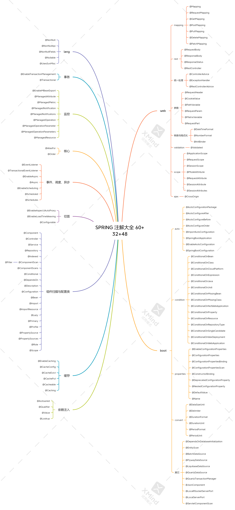</div>

## SpringBoot 自动配置原理

### 基本解释

<b>要求</b>

* 掌握 SpringBoot 自动配置原理

<b>自动配置原理</b>

@SpringBootConfiguration 是一个组合注解，由 @ComponentScan、@EnableAutoConfiguration 和 @SpringBootConfiguration 组成

1. @SpringBootConfiguration 与普通 @Configuration 相比功能上完全等价，唯一区别是前者（@SpringBootConfiguration）要求整个 app 中只出现一次【代码注释中写的】

2. @ComponentScan
    * excludeFilters - 用来在组件扫描时进行排除，为了防止装配 Spring Boot 的自动装配类，在扫描组件的时候会排除自动配置类

3. @EnableAutoConfiguration 也是一个组合注解，由下面注解组成
    * @AutoConfigurationPackage – 用来记住扫描的起始包，加了 @AutoConfigurationPackage 注解的类，它所在的包名会被记录下来，然后放在容器中，需要使用时就从容器中获取。
    
        `AutoConfigurationPackages.get(context.getDefaultListableBeanFactory())`，测试代码请看测试一
    
    * @Import(AutoConfigurationImportSelector.class) 用来加载 `META-INF/spring.factories` 中的自动配置类

<b>为什么不使用 @Import 直接引入自动配置类</b>

有两个原因：

1. 让主配置类和自动配置类变成了强耦合，主配置类不应该知道有哪些从属配置（我们不希望，自定义一些配置的同时还要用 Import 把那些从配置的配置类一个一个引入）
2. 直接用 `@Import(自动配置类.class)`，引入的配置解析优先级较高，自动配置类的解析应该在主配置没提供时作为默认配置，即先解析主配置中的类，对主配置定义的 bean 进行装配，当主配置解析完毕后，在对从配置进行解析，然后将需要的且主配置中没有装配的 bean 进行装配。测试代码请看测试二、三。

- 因此，采用了 `@Import(AutoConfigurationImportSelector.class)`，由 `AutoConfigurationImportSelector.class` 去读取 `META-INF/spring.factories` 中的自动配置类，实现了弱耦合。

* 另外 `AutoConfigurationImportSelector.class` 实现了 DeferredImportSelector 接口，让自动配置的解析晚于主配置的解析。

### 代码验证

> 测试一：创建一个基本的 SpringBoot 项目即可测试。

```java
import org.springframework.boot.autoconfigure.AutoConfigurationPackage;
import org.springframework.boot.autoconfigure.AutoConfigurationPackages;
import org.springframework.context.annotation.AnnotationConfigUtils;
import org.springframework.context.annotation.Configuration;
import org.springframework.context.support.GenericApplicationContext;

import java.util.List;

public class TestAutoConfiguration {
    public static void main(String[] args) {
        GenericApplicationContext context = new GenericApplicationContext();
        AnnotationConfigUtils.registerAnnotationConfigProcessors(context.getDefaultListableBeanFactory());
        context.registerBean(MyConfig.class);
        context.refresh();

        List<String> strings = AutoConfigurationPackages.get(context.getDefaultListableBeanFactory());
        System.out.println(strings);
    }

    @Configuration
    // 记录 MyConfig 所在的包
    @AutoConfigurationPackage
    static class MyConfig {}
}
```

> 测试二，测试 Import 的紧耦合

```java
package com;

import org.springframework.boot.autoconfigure.AutoConfigurationPackage;
import org.springframework.boot.autoconfigure.AutoConfigurationPackages;
import org.springframework.context.annotation.AnnotationConfigUtils;
import org.springframework.context.annotation.Bean;
import org.springframework.context.annotation.Configuration;
import org.springframework.context.annotation.Import;
import org.springframework.context.support.GenericApplicationContext;

import java.util.List;

public class TestAutoConfiguration {
    public static void main(String[] args) {
        GenericApplicationContext context = new GenericApplicationContext();
        AnnotationConfigUtils.registerAnnotationConfigProcessors(context.getDefaultListableBeanFactory());
        context.registerBean(MyConfig.class);
        context.refresh();

        List<String> strings = AutoConfigurationPackages.get(context.getDefaultListableBeanFactory());
        System.out.println(strings);
    }

    @Configuration
    // 记录 MyConfig 所在的包
    @AutoConfigurationPackage
    @Import(OtherConfig.class) // 需要知道并写上配置类，且使用 Import 从属配置的优先级高。
    static class MyConfig {} // 主配置

    @Configuration
    static class OtherConfig {	// 从属配置（自动配置、默认配置），我们希望是主配置解析完了，再解析从配置进行补充
        @Bean
        public Bean1 bean1() {
            System.out.println("OtherConfig");
            return new Bean1();
        }
    }

    static class Bean1 {}
}
// OtherConfig
```

> 测试三，@AutoConfigurationImportSelector 的松耦合配置和从配置的解析

先查看下 SpringBoot Redis 自动装配是怎么处理主从配置直接的关系的

```java
@AutoConfiguration
@ConditionalOnClass(RedisOperations.class)
@EnableConfigurationProperties(RedisProperties.class)
@Import({ LettuceConnectionConfiguration.class, JedisConnectionConfiguration.class })
public class RedisAutoConfiguration {

	@Bean
	@ConditionalOnMissingBean(name = "redisTemplate")
	@ConditionalOnSingleCandidate(RedisConnectionFactory.class)
	public RedisTemplate<Object, Object> redisTemplate(RedisConnectionFactory redisConnectionFactory) {
		RedisTemplate<Object, Object> template = new RedisTemplate<>();
		template.setConnectionFactory(redisConnectionFactory);
		return template;
	}

	@Bean
	@ConditionalOnMissingBean
	@ConditionalOnSingleCandidate(RedisConnectionFactory.class)
	public StringRedisTemplate stringRedisTemplate(RedisConnectionFactory redisConnectionFactory) {
		return new StringRedisTemplate(redisConnectionFactory);
	}
}
```

可以看到，是缺失 redisTemplate bean 的时候从配置才进行装配，即主配置解析完毕后，如果主配置需要但是没有设置 bean，那么从配置就会进行配置。下面我们来实现一个自定义的从配置，来看看主从配置直接的装配顺序。

```java
import org.springframework.boot.autoconfigure.AutoConfigurationPackage;
import org.springframework.boot.autoconfigure.EnableAutoConfiguration;
import org.springframework.boot.autoconfigure.condition.ConditionalOnMissingBean;
import org.springframework.context.annotation.AnnotationConfigUtils;
import org.springframework.context.annotation.Bean;
import org.springframework.context.annotation.Configuration;
import org.springframework.context.support.GenericApplicationContext;

public class TestAutoConfiguration {
    public static void main(String[] args) {
        GenericApplicationContext context = new GenericApplicationContext();
        AnnotationConfigUtils.registerAnnotationConfigProcessors(context.getDefaultListableBeanFactory());
        context.registerBean(MyConfig.class);
        context.refresh();
    }

    @Configuration
    @AutoConfigurationPackage
    @EnableAutoConfiguration(excludeName = {"org.springframework.boot.autoconfigure.admin.SpringApplicationAdminJmxAutoConfiguration"})
    static class MyConfig { 
        // 主配置不必强耦合从配置（默认配置）
        // 且 从配置（默认配置）OtherConfig 的解析优先权是最低的，因为 @EnableAutoConfiguration 中的 AutoConfigurationImportSelector
        // 实现了 DeferredImportSelector 可以保证它的优先级最低。
        // 先解析从配置，在解析 SpringBoot 中的那些默认配置（从配置）
        @Bean
        public Bean1 bean1() {
            System.out.println("MyConfig Bean1");
            return new Bean1();
        }
    }

    @Configuration
    static class OtherConfig {
        @Bean
        @ConditionalOnMissingBean // 如果主配置（就是我自定义的那些配置）中没有，则从默认配置（从配置）中进行配置
        public Bean1 bean1() { // 主配置中没有，从配置（默认配置）才进行配置
            System.out.println("OtherConfig Bean1");
            return new Bean1();
        }

        @Bean
        @ConditionalOnMissingBean 
        public Bean2 bean2() { // 主配置中没有，从配置（默认配置）才进行配置
            System.out.println("OtherConfig Bean2");
            return new Bean2();
        }
    }

    static class Bean1 {}
    static class Bean2{}
}
/*
MyConfig Bean1
OtherConfig Bean2
*/
```

OtherConfig 的配置，在 resources/META-INF/spring.factories 中写上从配置（默认配置）的配置类全名

```properties
org.springframework.boot.autoconfigure.EnableAutoConfiguration=com.TestAutoConfiguration$OtherConfig
```

从结果可以看出，是先装配主配置中的 bean 再装配从配置中的 bean，如果主配置没有装配，则再从从配置中进行装配。

## Spring 中的设计模式

<b>要求</b>

* 掌握 Spring 中常见的设计模式

<b>1. Spring 中的 Singleton</b>

<span style="color:red">请大家区分 singleton pattern 与 Spring 中的 singleton bean</span>

* 根据单例模式的目的 <i>Ensure a class only has one instance, and provide a global point of access to it</i>
* 显然 Spring 中的 singleton bean 并非实现了单例模式，singleton bean 只能保证每个容器内，相同 id 的 bean 单实例
* 当然 Spring 中也用到了单例模式，例如
    * org.springframework.transaction.TransactionDefinition#withDefaults
    * org.springframework.aop.TruePointcut#INSTANCE
    * org.springframework.aop.interceptor.ExposeInvocationInterceptor#ADVISOR
    * org.springframework.core.annotation.AnnotationAwareOrderComparator#INSTANCE
    * org.springframework.core.OrderComparator#INSTANCE

<b>2. Spring 中的 Builder</b>

定义 Separate the construction of a complex object from its representation so that the same construction process can create different representations

它的主要亮点有三处：

1. 较为灵活的构建产品对象

2. 在不执行最后 build 方法前，产品对象都不可用

3. 构建过程采用链式调用，看起来比较爽

Spring 中体现 Builder 模式的地方：

* org.springframework.beans.factory.support.BeanDefinitionBuilder

* org.springframework.web.util.UriComponentsBuilder

* org.springframework.http.ResponseEntity.HeadersBuilder

* org.springframework.http.ResponseEntity.BodyBuilder

<b>3. Spring 中的 Factory Method</b>

定义 <i>Define an interface for creating an object, but let subclasses decide which class to instantiate. Factory Method lets a class defer instantiation to subclasses</i>

根据上面的定义，Spring 中的 ApplicationContext 与 BeanFactory 中的 getBean 都可以视为工厂方法，它隐藏了 bean （产品）的创建过程和具体实现

Spring 中其它工厂：

* org.springframework.beans.factory.FactoryBean

* @Bean 标注的静态方法及实例方法

* ObjectFactory 及 ObjectProvider

前两种工厂主要封装第三方的 bean 的创建过程，后两种工厂可以推迟 bean 创建，解决循环依赖及单例注入多例等问题

<b>4. Spring 中的 Adapter</b>

定义 <i>Convert the interface of a class into another interface clients expect. Adapter lets classes work together that couldn't otherwise because of incompatible interfaces</i>

典型的实现有两处：

* org.springframework.web.servlet.HandlerAdapter – 因为控制器实现有各种各样，比如有
    * 大家熟悉的 @RequestMapping 标注的控制器实现
    * 传统的基于 Controller 接口（不是 @Controller注解啊）的实现
    * 较新的基于 RouterFunction 接口的实现
    * 它们的处理方法都不一样，为了统一调用，必须适配为 HandlerAdapter 接口
* org.springframework.beans.factory.support.DisposableBeanAdapter – 因为销毁方法多种多样，因此都要适配为 DisposableBean 来统一调用销毁方法 

<b>5. Spring 中的 Composite</b>

定义 <i>Compose objects into tree structures to represent part-whole hierarchies. Composite lets clients treat individual objects and compositions of objects uniformly</i>

典型实现有：

* org.springframework.web.method.support.HandlerMethodArgumentResolverComposite
* org.springframework.web.method.support.HandlerMethodReturnValueHandlerComposite
* org.springframework.web.servlet.handler.HandlerExceptionResolverComposite
* org.springframework.web.servlet.view.ViewResolverComposite

composite 对象的作用是，将分散的调用集中起来，统一调用入口，它的特征是，与具体干活的实现实现同一个接口，当调用 composite 对象的接口方法时，其实是委托具体干活的实现来完成

<b>6. Spring 中的 Decorator</b>

定义 <i>Attach additional responsibilities to an object dynamically. Decorators provide a flexible alternative to subclassing for extending functionality</i>

典型实现：

* org.springframework.web.util.ContentCachingRequestWrapper

<b>7. Spring 中的 Proxy</b>

定义 <i>Provide a surrogate or placeholder for another object to control access to it</i>

装饰器模式注重的是功能增强，避免子类继承方式进行功能扩展，而代理模式更注重控制目标的访问

典型实现：

* org.springframework.aop.framework.JdkDynamicAopProxy
* org.springframework.aop.framework.ObjenesisCglibAopProxy

<b>8. Spring 中的 Chain of Responsibility</b>

定义 <i>Avoid coupling the sender of a request to its receiver by giving more than one object a chance to handle the request. Chain the receiving objects and pass the request along the chain until an object handles it</i>

典型实现：

* org.springframework.web.servlet.HandlerInterceptor

<b>9. Spring 中的 Observer</b>

定义 <i>Define a one-to-many dependency between objects so that when one object changes state, all its dependents are notified and updated automatically</i>

典型实现：

* org.springframework.context.ApplicationListener
* org.springframework.context.event.ApplicationEventMulticaster
* org.springframework.context.ApplicationEvent

<b>10. Spring 中的 Strategy</b>

定义 <i>Define a family of algorithms, encapsulate each one, and make them interchangeable. Strategy lets the algorithm vary independently from clients that use it</i>

典型实现：

* org.springframework.beans.factory.support.InstantiationStrategy
* org.springframework.core.annotation.MergedAnnotations.SearchStrategy
* org.springframework.boot.autoconfigure.condition.SearchStrategy

<b>11. Spring 中的 Template Method</b>

定义 <i>Define the skeleton of an algorithm in an operation, deferring some steps to subclasses. Template Method lets subclasses redefine certain steps of an algorithm without changing the algorithm's structure</i> 

典型实现：

* 大部分以 Template 命名的类，如 JdbcTemplate，TransactionTemplate
* 很多以 Abstract 命名的类，如 AbstractApplicationContext

## 解决 set 循环依赖的原理

理解循环依赖前需要理解代理对象的创建时机。

### 创建代理

<b>要点</b>

- 掌握 ProxyFactory 创建代理的过程，理解 Advisor，Advice，Pointcut 和 Aspect
- 掌握 AnnotationAwareAspectJAutoProxyCreator 筛选 Advisor 合格者，创建代理的过程

<b>总结</b>

- 最基本的切面是 Advisor，一个 Aspect 切面对应一到多个 Advisor
- 最基本的 Advice 是 MethodInterceptor，其他 Advice 最终都将适配为 MethodInterceptor
- 创建代理的方式
    - 实现了用户自定义接口，采用 jdk 动态代理
    - 没有实现用户自定义接口，采用 cglib 代理
    - 设置了 setProxyTargetClass(true)，统一采用 cglib 代理
- 切面、切点、通知等不会被代理
- AnnotationAwareAspectJAutoProxyCreate 调用时机：创建阶段、依赖注入阶段、初始化阶段

#### 使用 ProxyFactory 创建代理对象

```java
import org.aopalliance.intercept.MethodInterceptor;
import org.aopalliance.intercept.MethodInvocation;
import org.springframework.aop.framework.ProxyFactory;

public class App64_2 {
    public static void main(String[] args) {
        ProxyFactory proxyFactory = new ProxyFactory();
        proxyFactory.setTarget(new Target1());
        proxyFactory.addAdvice(new MethodInterceptor() { // 添加环绕通知
            @Override
            public Object invoke(MethodInvocation invocation) throws Throwable {
                try {
                    System.out.println("before...");
                    return invocation.proceed();
                } finally {
                    System.out.println("after...");
                }
            }
        });
        // 创建代理对象
        I1 proxy = (I1) proxyFactory.getProxy();
        proxy.foo();
        proxy.bar();
    }

    interface I1 {
        void foo();
        void bar();
    }

    static class Target1 implements I1 {
        @Override
        public void foo() {
            System.out.println("Target1 foo");
        }

        @Override
        public void bar() {
            System.out.println("Target1 bar");
        }
    }
}
```

使用切点表达式指定增强某些方法

```java
import org.aopalliance.intercept.MethodInterceptor;
import org.springframework.aop.aspectj.AspectJExpressionPointcut;
import org.springframework.aop.framework.ProxyFactory;
import org.springframework.aop.support.DefaultPointcutAdvisor;

public class App64_2 {
    public static void main(String[] args) {
        ProxyFactory proxyFactory = new ProxyFactory();
        proxyFactory.setTarget(new Target1());

        AspectJExpressionPointcut pointcut = new AspectJExpressionPointcut();
        // 指定对 foo 方法进行增强
        pointcut.setExpression("execution(* foo())");
        proxyFactory.addAdvisor(new DefaultPointcutAdvisor(pointcut, (MethodInterceptor) invocation -> {
            try {
                System.out.println("before...");
                return invocation.proceed();
            } finally {
                System.out.println("after...");
            }
        }));
        // 创建代理对象
        I1 proxy = (I1) proxyFactory.getProxy();
        proxy.foo();
        proxy.bar();
    }

    interface I1 {
        void foo();
        void bar();
    }

    static class Target1 implements I1 {
        @Override
        public void foo() {
            System.out.println("Target1 foo");
        }

        @Override
        public void bar() {
            System.out.println("Target1 bar");
        }
    }
}
```

使用 JDK 动态代理只需要为代理工厂设置接口。

```java
package com.aop;

import org.aopalliance.intercept.MethodInterceptor;
import org.springframework.aop.aspectj.AspectJExpressionPointcut;
import org.springframework.aop.framework.ProxyFactory;
import org.springframework.aop.support.DefaultPointcutAdvisor;

public class App64_3 {
    public static void main(String[] args) {
        ProxyFactory proxyFactory = new ProxyFactory();
        proxyFactory.setTarget(new Target1());

        AspectJExpressionPointcut pointcut = new AspectJExpressionPointcut();
        pointcut.setExpression("execution(* foo())");
        proxyFactory.addAdvisor(new DefaultPointcutAdvisor(pointcut, (MethodInterceptor) invocation -> {
            try {
                System.out.println("before...");
                return invocation.proceed();
            } finally {
                System.out.println("after...");
            }
        }));
        // 设置为 JDK 动态代理
        proxyFactory.addInterface(I1.class);
        
        // 不管三七二十一统一设置成 cglib 动态代理
        // proxyFactory.setProxyTargetClass(true);
        
        // 创建代理对象
        I1 proxy = (I1) proxyFactory.getProxy();
        // class com.aop.$Proxy0
        System.out.println(proxy.getClass());
        proxy.foo();
        proxy.bar();
    }

    interface I1 {
        void foo();
        void bar();
    }

    static class Target1 implements I1 {
        @Override
        public void foo() {
            System.out.println("Target1 foo");
        }

        @Override
        public void bar() {
            System.out.println("Target1 bar");
        }
    }
}
```

#### 代理对象的构成

<div align="center"></div>

代理对象会间接引用这些 Advisor。

> 实际使用中用的还是注解的方式，但注解的这种方式最终还是会转换为 Advisor 和 MethodInterceptor 的形式。以通知方法为单位进行转换的。

```java
@Aspect // 切面类
class Aspect1{
    // 通知方法
    @Around("execution(* foo())") // --> 对应一个 advisor 切面
    public Object around(ProceedingJoinPoint pjp) throws Throwable{
        System.out.println("aspect1 around");
        return pjp.proceed();
    }
    
    @Before("execution(* foo())") // --> 对应一个 advisor 切面
    public void before() throws Throwable{
        System.out.println("aspect1 before");
    }
}
```

#### Aspect 与 advisor 的关系

Aspect 中的每个通知最后会转成一个又一个的 advisor。

```java
import org.aspectj.lang.ProceedingJoinPoint;
import org.aspectj.lang.annotation.After;
import org.aspectj.lang.annotation.Around;
import org.aspectj.lang.annotation.Aspect;
import org.aspectj.lang.annotation.Before;
import org.springframework.aop.aspectj.annotation.AnnotationAwareAspectJAutoProxyCreator;
import org.springframework.context.support.GenericApplicationContext;

public class App64_1 {
    public static void main(String[] args) {
        GenericApplicationContext context = new GenericApplicationContext();
        context.registerBean("aspect1", Aspect1.class);
        context.registerBean("aspect2", Aspect2.class);
        context.registerBean("aspect3", Aspect3.class);
        context.registerBean(AnnotationAwareAspectJAutoProxyCreator.class); // 自动代理后处理器
        context.registerBean("target1", Target1.class);
        context.registerBean("target2", Target2.class);
        context.refresh();
        Target1 bean1 = context.getBean(Target1.class);
        Target2 bean2 = context.getBean(Target2.class);
        bean1.foo();
        System.out.println(">>>>>>>>>>>>>>>>>>>>>>>>>>>>>>");
        bean2.bar();
    }

    static class Target1 {
        public void foo() {
            System.out.println("Target1 foo");
        }
    }

    static class Target2 {
        public void bar() {
            System.out.println("Target2 bar");
        }
    }

    @Aspect
    static class Aspect1 {
        @Around("execution(* foo())")
        public Object around(ProceedingJoinPoint pjp) throws Throwable {
            System.out.println("aspect1 around");
            return pjp.proceed(); // 调用目标方法
        }
    }

    @Aspect
    static class Aspect2 {
        @Before("execution(* foo())")
        public void before() {
            System.out.println("aspect2 before");
        }

        @After("execution(* foo())")
        public void after() {
            System.out.println("aspect2 after");
        }
    }

    @Aspect
    static class Aspect3 {
        @Before("execution(* bar())")
        public void before() {
            System.out.println("aspect3 before");
        }
    }
}
/*
aspect1 around
aspect2 before
Target1 foo
aspect2 after
>>>>>>>>>>>>>>>>>>>>>>>>>>>>>>
aspect3 before
Target2 bar
*/
```

<div align="center"></div>

Spring 增加切面的时候会为每个代理对象增加一个 ExposeInvocationInterceptor 切面，用来对外暴露一个 InvocationInterceptor 对象，属于高级功能，一般用不到。

#### 自动代理后处理器

AnnotationAwareAspectJAutoProxyCreator

> 方法 `wrapIfNecessary` AnnotationAwareAspectJAutoProxyCreator 父类（AbstractAutoProxyCreator）的一个 protected 修饰的方法。为了确保可以调用该方法，我们将自己编写的类的包名设置为 `org.springframework.aop.framework.autoproxy`。

```java
package org.springframework.aop.framework.autoproxy;

import org.aspectj.lang.ProceedingJoinPoint;
import org.aspectj.lang.annotation.After;
import org.aspectj.lang.annotation.Around;
import org.aspectj.lang.annotation.Aspect;
import org.aspectj.lang.annotation.Before;
import org.springframework.aop.aspectj.annotation.AnnotationAwareAspectJAutoProxyCreator;
import org.springframework.context.support.GenericApplicationContext;

// 把我们的类的包名改成和AnnotationAwareAspectJAutoProxyCreator改成一样的包名，这样受保护的方法也可以调用
public class Asp {
    public static void main(String[] args) {
        GenericApplicationContext context = new GenericApplicationContext();
        context.registerBean("aspect1", Aspect1.class);
        context.registerBean("aspect2", Aspect2.class);
        context.registerBean("aspect3", Aspect3.class);
        context.registerBean("target1", Target1.class);
        context.registerBean(AnnotationAwareAspectJAutoProxyCreator.class); // 自动代理后处理器
        context.refresh();

        AnnotationAwareAspectJAutoProxyCreator creator = context.getBean(AnnotationAwareAspectJAutoProxyCreator.class);
        // 如果需要就对 bean 进行包装（就是是否创建代理）
        // 如切面类和通知类不用创建代理，没有匹配到切点表达式的也不用进行代理。
        Object o = creator.wrapIfNecessary(new Target1(), "target1", "target1");
        System.out.println(o.getClass()); // Asp$Target1$$EnhancerBySpringCGLIB$$87fc41fa 复合规则，需要进行代理

        Object o2 = creator.wrapIfNecessary(new Aspect2(), "aspect2", "aspect2");
        System.out.println(o2.getClass()); // Asp$Aspect2 不复合规则，无需进行代理

        Object o3 = creator.wrapIfNecessary(new Target3(), "target3", "target3");
        System.out.println(o.getClass()); // Asp$Target1$$EnhancerBySpringCGLIB$$87fc41fa 复合规则，需要进行代理

        System.out.println(">>>>>>>>>>>>>>>>>>>>>>>>>>>>>>");
    }

    @Aspect
    static class Aspect1 {
        @Around("execution(* foo())")
        public Object around(ProceedingJoinPoint pjp) throws Throwable {
            System.out.println("aspect1 around");
            return pjp.proceed();
        }
    }

    @Aspect
    static class Aspect2 {
        @Before("execution(* foo())")
        public void before() {
            System.out.println("aspect2 before");
        }

        @After("execution(* foo())")
        public void after() {
            System.out.println("aspect2 after");
        }
    }

    @Aspect
    static class Aspect3 {
        @Before("execution(* bar())")
        public void before() {
            System.out.println("aspect3 before");
        }
    }

    static class Target1 {
        public void foo() {
            System.out.println("target1 foo");
        }
    }

    static class Target2 {
        public void bar() {
            System.out.println("target2 bar");
        }
    }

    static class Target3 {
        public void baz() {
            System.out.println("target3 baz");
        }
    }
}
```

> wrapIfNecessary 方法源码细节

```java
protected Object wrapIfNecessary(Object bean, String beanName, Object cacheKey) {
    if (StringUtils.hasLength(beanName) && this.targetSourcedBeans.contains(beanName)) {
        return bean;
    }
    if (Boolean.FALSE.equals(this.advisedBeans.get(cacheKey))) {
        return bean;
    }
    // 重要方法一,检查是否是基础设施类，如切点，切面，通知
    if (isInfrastructureClass(bean.getClass()) || shouldSkip(bean.getClass(), beanName)) {
        this.advisedBeans.put(cacheKey, Boolean.FALSE);
        // 是的话直接返回 bean 本身
        return bean;
    }

    // Create proxy if we have advice.
    // 重要方法二,找有那些匹配的切面
    Object[] specificInterceptors = getAdvicesAndAdvisorsForBean(bean.getClass(), beanName, null);
    if (specificInterceptors != DO_NOT_PROXY) {
        this.advisedBeans.put(cacheKey, Boolean.TRUE);
        // 重要方法三,如果有匹配的切面则需要创建代理
        Object proxy = createProxy(
            bean.getClass(), beanName, specificInterceptors, new SingletonTargetSource(bean));
        this.proxyTypes.put(cacheKey, proxy.getClass());
        return proxy;
    }

    this.advisedBeans.put(cacheKey, Boolean.FALSE);
    return bean;
}
```

用条件断点进行 debug，当对我们的 bean target1 进行代理时才停住。

```java
// 测试代码片段
creator.wrapIfNecessary(new Target1(), "target1", "target3");
```

<div align="center"></div>

<div align="center"></div>

```java
protected Object createProxy(Class<?> beanClass, @Nullable String beanName,
                             @Nullable Object[] specificInterceptors, TargetSource targetSource) {

    if (this.beanFactory instanceof ConfigurableListableBeanFactory) {
        AutoProxyUtils.exposeTargetClass((ConfigurableListableBeanFactory) this.beanFactory, beanName, beanClass);
    }

    ProxyFactory proxyFactory = new ProxyFactory();
    proxyFactory.copyFrom(this);

    if (proxyFactory.isProxyTargetClass()) {
        // Explicit handling of JDK proxy targets and lambdas (for introduction advice scenarios)
        if (Proxy.isProxyClass(beanClass) || ClassUtils.isLambdaClass(beanClass)) {
            // Must allow for introductions; can't just set interfaces to the proxy's interfaces only.
            for (Class<?> ifc : beanClass.getInterfaces()) {
                proxyFactory.addInterface(ifc);
            }
        }
    }
    else {
        // No proxyTargetClass flag enforced, let's apply our default checks...
        if (shouldProxyTargetClass(beanClass, beanName)) {
            proxyFactory.setProxyTargetClass(true);
        }
        else {
            // 有接口的话使用 JDK 动态代理，没有则使用 cglib 动态代理
            evaluateProxyInterfaces(beanClass, proxyFactory);
        }
    }

    Advisor[] advisors = buildAdvisors(beanName, specificInterceptors);
    proxyFactory.addAdvisors(advisors);
    proxyFactory.setTargetSource(targetSource);
    customizeProxyFactory(proxyFactory);

    proxyFactory.setFrozen(this.freezeProxy);
    if (advisorsPreFiltered()) {
        proxyFactory.setPreFiltered(true);
    }

    // Use original ClassLoader if bean class not locally loaded in overriding class loader
    ClassLoader classLoader = getProxyClassLoader();
    if (classLoader instanceof SmartClassLoader && classLoader != beanClass.getClassLoader()) {
        classLoader = ((SmartClassLoader) classLoader).getOriginalClassLoader();
    }
    return proxyFactory.getProxy(classLoader);
}
```


### 一级缓存

#### 作用

<div align="center">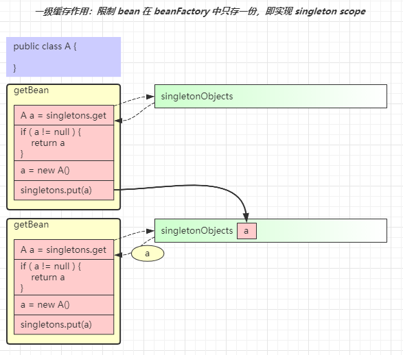</div>

作用是保证单例对象仅被创建一次

* 第一次走 `getBean("a")` 流程后，最后会将成品 a 放入 singletonObjects 一级缓存
* 后续再走 `getBean("a")` 流程时，先从一级缓存中找，这时已经有成品 a，就无需再次创建

#### 循环依赖

<div align="center"></div>

一级缓存无法解决循环依赖问题，分析如下

* 无论是获取 bean a 还是获取 bean b，走的方法都是同一个 getBean 方法，假设先走 `getBean("a")`
* 当 a 的实例对象创建，接下来执行 `a.setB()` 时，需要走 `getBean("b")` 流程，红色箭头 1
* 当 b 的实例对象创建，接下来执行 `b.setA()` 时，又回到了 `getBean("a")` 的流程，红色箭头 2
* 但此时 singletonObjects 一级缓存内没有成品的 a，陷入了死循环

### 二级缓存

#### 作用

<div align="center"></div>

解决思路如下：

* 再增加一个 singletonFactories 缓存
* 在依赖注入前，即 `a.setB()` 以及 `b.setA()` 将 a 及 b 的半成品对象（未完成依赖注入和初始化）放入此缓存
* 执行依赖注入时，先看看 singletonFactories 缓存中是否有半成品的对象，如果有拿来注入，顺利走完流程

对于上面的图

* `a=new A()` 执行之后就会把这个半成品的 a 放入 singletonFactories 缓存，即 `factories.put(a)`
* 接下来执行 `a.setB()`，走入 `getBean("b")` 流程，红色箭头 3
* 这回再执行到 `b.setA()` 时，需要一个 a 对象，有没有呢？有！
* `factories.get()` 在 singletonFactories  缓存中就可以找到，红色箭头 4 和 5
* b 的流程能够顺利走完，将 b 成品放入 singletonObject 一级缓存，返回到 a 的依赖注入流程，红色箭头 6

#### 创建代理

<div align="center"></div>

二级缓存无法正确处理循环依赖并且包含有代理创建的场景，分析如下

* spring 默认要求，在 `a.init` 完成之后才能创建代理 `pa = proxy(a)`
* 由于 a 的代理创建时机靠后，在执行 `factories.put(a)` 向 singletonFactories 中放入的还是原始对象
* 接下来箭头 3、4、5 这几步 b 对象拿到和注入的都是原始对象

### 三级缓存

二级缓存因为创建代理的时机较晚，因此注入的是原始对象，而非代理对象。

#### 作用

<div align="center"></div>

简单分析的话，只需要将代理的创建时机放在依赖注入之前即可，但 spring 仍然希望代理的创建时机在 init 之后，只有出现循环依赖时，才会将代理的创建时机提前。所以解决思路稍显复杂：

* 图中 `factories.put(fa)` 放入的既不是原始对象，也不是代理对象而是工厂对象 fa
* 当检查出发生循环依赖时，fa 的产品就是代理 pa，没有发生循环依赖，fa 的产品是原始对象 a
* 假设出现了循环依赖，拿到了 singletonFactories 中的工厂对象，通过在依赖注入前获得了 pa，红色箭头 5
* 这回 `b.setA()` 注入的就是代理对象，保证了正确性，红色箭头 7
* 还需要把 pa 存入新加的 earlySingletonObjects 缓存，红色箭头 6
* `a.init` 完成后，无需二次创建代理，从哪儿找到 pa 呢？earlySingletonObjects 已经缓存，蓝色箭头 9

当成品对象产生，放入 singletonObject 后，singletonFactories 和 earlySingletonObjects 就中的对象就没有用处，清除即可

## Spring bean 循环依赖

<b>要求</b>

* 掌握单例 set 方式循环依赖的原理
* 掌握其它循环依赖的解决方法

<b>总结</b>

- 单例 set 方法（包括成员变量）循环依赖，Spring 会利用三级缓存解决，无需额外配置
    - 一级缓存存放成品对象
    - 二级缓存存放存放发生了循环依赖时的产品对象（可能是原始 bean，也可能是代理 bean）
    - 三级缓存存放工厂对象，发生循环依赖时，会调用工厂获取产品
    - Spring 期望在初始化时创建代理，但是如果发生了循环依赖，会由工厂提前创建代理，后续初始化时就不必重复创建代理
    - 二级缓存的意义在于，如果提前创建了代理对象，在最后的阶段需要从二级缓存中获取此代理对象，作为最终结果
- 构造方法及多例循环依赖解决办法
    - @Lazy 产生代理对象
    - @Scope 产生代理对象
    - ObjectFactory & ObjectProvider 使用工厂创建对象
    - Provider 使用工厂创建对象

### set 循环依赖

<b>循环依赖的产生</b>

* 首先要明白，bean 的创建要遵循一定的步骤，必须是创建、注入、初始化三步，这些顺序不能乱

<div align="center"></div>

* set 方法（包括成员变量）的循环依赖如图所示

    * 可以在【a 创建】和【a set 注入 b】之间加入 b 的整个流程来解决
    * 【b set 注入 a】 时可以成功，因为之前 a 的实例已经创建完毕

    * a 的顺序，及 b 的顺序都能得到保障

<div align="center"></div>

* 构造方法的循环依赖如图所示，显然无法用前面的方法解决。A 创建的时候需要调用有参构造，需要 B 对象；而 B 对象创建的时候需要调用有参构造，需要 A 对象；死循环了。

<div align="center"></div>

> set 解决循环依赖测试代码

```java
package com.depent;

import org.slf4j.Logger;
import org.slf4j.LoggerFactory;
import org.springframework.beans.factory.annotation.Autowired;
import org.springframework.context.annotation.AnnotationConfigUtils;
import org.springframework.context.support.GenericApplicationContext;

import javax.annotation.PostConstruct;

// set 方法解决循环依赖
public class App60 {
    public static void main(String[] args) {
        GenericApplicationContext context = new GenericApplicationContext();
        context.registerBean("A", A.class);
        context.registerBean("B", B.class);
        AnnotationConfigUtils.registerAnnotationConfigProcessors(context.getDefaultListableBeanFactory());
        context.refresh();
    }

    static class A {
        private static final Logger log = LoggerFactory.getLogger("A");
        private B b;

        public A() { log.debug("A()");}
        
        @Autowired
        public void setB(B b) {
            log.debug("setB({})", b);
            this.b = b;
        }

        @PostConstruct
        public void init(){ log.debug("init()");}
    }

    static class B {
        private static final Logger log = LoggerFactory.getLogger("B");
        private A a;

        public B() { log.debug("B()"); }
        
        @Autowired
        public void setA(A a) {
            log.debug("setA({})", a);
            this.a = a;
        }
        
        @PostConstruct
        public void init(){ log.debug("init()"); }
    }
}

/*
先创建对象 A，再创建对象 B，再执行 set 方法进行依赖注入
21:09:07.833 [main] DEBUG A - A()
21:09:07.911 [main] DEBUG B - B()
21:09:07.911 [main] DEBUG B - setA(com.depent.App60$A@32b260fa)
21:09:07.911 [main] DEBUG B - init()
21:09:07.911 [main] DEBUG A - setB(com.depent.App60$B@76c3e77a)
21:09:07.911 [main] DEBUG A - init()
*/
```

断点调试，在 AbstractBeanFactory#doGetBean 中的 getSingleton 上打断点，断点条件为只关系对象 a 的创建（beanName.equals("A")）；在 AbstractAutowireCapableBeanFactory#doCreateBean 上 getSingleton 加断点（会访问到一级二级缓存）。

### 构造循环依赖

<b>构造循环依赖的解决思路--推迟真实 bean 的获取</b>

* 思路 1
    * a 注入 b 的代理对象（提供一个假对象），这样能够保证 a 的流程走通
    * 后续需要用到 b 的真实对象时，可以通过代理间接访问

<div align="center"></div>

* 思路 2
    * a 注入 b 的工厂对象，让 b 的实例创建被推迟，这样能够保证 a 的流程先走通
    * 后续需要用到 b 的真实对象时，再通过 ObjectFactory 工厂间接访问

<div align="center"></div>

* 示例 1：用 @Lazy 为构造方法参数生成代理

```java
public class App60_1 {

    static class A {
        private static final Logger log = LoggerFactory.getLogger("A");
        private B b;

        public A(@Lazy B b) {
            log.debug("A(B b) {}", b.getClass());
            this.b = b;
        }

        @PostConstruct
        public void init() {
            log.debug("init()");
        }
    }

    static class B {
        private static final Logger log = LoggerFactory.getLogger("B");
        private A a;

        public B(A a) {
            log.debug("B({})", a);
            this.a = a;
        }

        @PostConstruct
        public void init() {
            log.debug("init()");
        }
    }

    public static void main(String[] args) {
        GenericApplicationContext context = new GenericApplicationContext();
        context.registerBean("a", A.class);
        context.registerBean("b", B.class);
        AnnotationConfigUtils.registerAnnotationConfigProcessors(context.getDefaultListableBeanFactory());
        context.refresh();
        System.out.println();
    }
}
```

* 示例 2：用 ObjectProvider 延迟依赖对象的创建

```java
public class App60_2 {

    static class A {
        private static final Logger log = LoggerFactory.getLogger("A");
        private ObjectProvider<B> b;

        public A(ObjectProvider<B> b) {
            log.debug("A({})", b);
            this.b = b;
        }

        @PostConstruct
        public void init() {
            log.debug("init()");
        }
    }

    static class B {
        private static final Logger log = LoggerFactory.getLogger("B");
        private A a;

        public B(A a) {
            log.debug("B({})", a);
            this.a = a;
        }

        @PostConstruct
        public void init() {
            log.debug("init()");
        }
    }

    public static void main(String[] args) {
        GenericApplicationContext context = new GenericApplicationContext();
        context.registerBean("a", A.class);
        context.registerBean("b", B.class);
        AnnotationConfigUtils.registerAnnotationConfigProcessors(context.getDefaultListableBeanFactory());
        context.refresh();

        System.out.println(context.getBean(A.class).b.getObject());
        System.out.println(context.getBean(B.class));
    }
}
```

* 示例 3：用 @Scope 产生代理

```java
public class App60_3 {

    public static void main(String[] args) {
        GenericApplicationContext context = new GenericApplicationContext();
        ClassPathBeanDefinitionScanner scanner = new ClassPathBeanDefinitionScanner(context.getDefaultListableBeanFactory());
        scanner.scan("com.itheima.app60.sub");
        context.refresh();
        System.out.println();
    }
}
```

```java
@Component
class A {
    private static final Logger log = LoggerFactory.getLogger("A");
    private B b;

    public A(B b) {
        log.debug("A(B b) {}", b.getClass());
        this.b = b;
    }

    @PostConstruct
    public void init() {
        log.debug("init()");
    }
}
```

```java
@Scope(proxyMode = ScopedProxyMode.TARGET_CLASS)
@Component
class B {
    private static final Logger log = LoggerFactory.getLogger("B");
    private A a;

    public B(A a) {
        log.debug("B({})", a);
        this.a = a;
    }

    @PostConstruct
    public void init() {
        log.debug("init()");
    }
}
```

* 示例 4：用 Provider 接口解决，原理上与 ObjectProvider 一样，Provider 接口是独立的 jar 包，需要加入依赖

```xml
<dependency>
    <groupId>javax.inject</groupId>
    <artifactId>javax.inject</artifactId>
    <version>1</version>
</dependency>
```

```java
public class App60_4 {

    static class A {
        private static final Logger log = LoggerFactory.getLogger("A");
        private Provider<B> b;

        public A(Provider<B> b) {
            log.debug("A({}})", b);
            this.b = b;
        }

        @PostConstruct
        public void init() {
            log.debug("init()");
        }
    }

    static class B {
        private static final Logger log = LoggerFactory.getLogger("B");
        private A a;

        public B(A a) {
            log.debug("B({}})", a);
            this.a = a;
        }

        @PostConstruct
        public void init() {
            log.debug("init()");
        }
    }

    public static void main(String[] args) {
        GenericApplicationContext context = new GenericApplicationContext();
        context.registerBean("a", A.class);
        context.registerBean("b", B.class);
        AnnotationConfigUtils.registerAnnotationConfigProcessors(context.getDefaultListableBeanFactory());
        context.refresh();

        System.out.println(context.getBean(A.class).b.get());
        System.out.println(context.getBean(B.class));
    }
}
```

## MyBatis

### #{}和${}

#{} 可以认为是 JDBC 的预编译对象，基本不会出现 SQL 注入问题。而 ${} 则是采用字符串拼接的方式，存在 SQL 注入的问题。

# 分布式基本理论

## CAP 理论

CAP 理论是分布式领域非常重要的一个理论， 很多分布式中间件在实现时都需要遵守这个理论，其中:
- C 表示一致性：指的的是分布式系统中的数据的一致性
- A 表示可用性：表示分布式系统是否正常可用
- P 表示分区容器性：表示分布式系统出现网络问题时的容错性

CAP 理论是指，在分布式系统中不能同时保证 C、A 和 P，也就是说在分布式系统中要么保证 CP，要么保证 AP，也就是一致性和可用性只能取其一，如果想要数据的一致性, 那么就需要损失系统的可用性，如果需要系统高可用，那么就要损失系统的数据一致性, 特指强一致性。

CAP 理论太过严格，在实际生产环境中更多的是使用 BASE 理论，BASE 理论是指分布式系统不需要保证数据的强一致，只要做到最终一致, 也不需要保证一直可用，保证基本可用即可。

## Base 理论

由于不能同时满足 CAP，所以出现了 BASE 理论

- BA：Basically Available，表示基本可用，表示可以允许一定程度的不可用， 比如由于系统故障，请求时间变长，或者由于系统故障导致部分非核心功能不可用，都是允许的
- S: Soft state，表示分布式系统可以处于一种中间状态， 比如数据正在同步
- E: Eventually consistent，表示最终一致性, 不要汾布式系统数据实时达到一致，允许在经过一段时间后再达到一致，在达到一致过程中，弱统也是可用的

## RPC

RPC，表示远程过程调用，对于 Java 这种面试对象语言，也可以理解为远程方法调用，RPC 调用和 HTTP 调用是有区别的，RPC 表示的是一种调用远程方法的方式，可以使用 HTTP 协议、或直接基于 TCP 协议来实现 RPC，在 Java 中， 我们可以通过直接使用某个服务接口的代理对象来执行方法，而底层则通过构造 HTTP 请求来调用远端的方法，所以，有一种说法是 RPC 协议是 HTTP 协议之上的一种协议，也是可以理解的。

## 分布式 ID

在开发中，我们通常会需要一个唯一 ID 来标识数据， 如果是单体架构，我们可以通过数据库的主键，或直接在内存中维护一个自增数字来作为 ID 都是可以的，但对于一个分布式系统，就会有可能会出现 ID 冲突，此时有一下解决方案：

- uuid,这种方案复杂度最低，但是会影响存储空间和性能
- 利用单机数据库的自增主键，作为分布式 ID 的生成器，复杂度适中，ID 长度较之 uuid 更短， 但是受到单机数据库性能的限制，并发量大的时候，此方案也不是最优方案
- 利用 redis、zookeeper 的特性来生成 id, 比如 redis 的自增命令、 zookeeper 的顺序节点, 这种方案和单机数据库 (mysq) 相比，性能有所提高，可以适当选用
- 雪花算法，一切问题如果能直接用算法解决，那就是最合适的，利用雪花算法也可以生成分布式 ID，底层原理就是通过某台机器在某一毫秒内对某一个数字自增，这种方案也能保证分布式架构中的系统 id 唯一,但是只能保证趋势递增。业界存在 tinyid、leaf 等开源中间件实现了雪花算法。

[雪花算法【snowflake】-阿里云开发者社区 (aliyun.com)](https://developer.aliyun.com/article/772913)

## 一致性哈希

<a href="https://www.jianshu.com/p/c28ce65e92b5">一致性哈希算法</a>